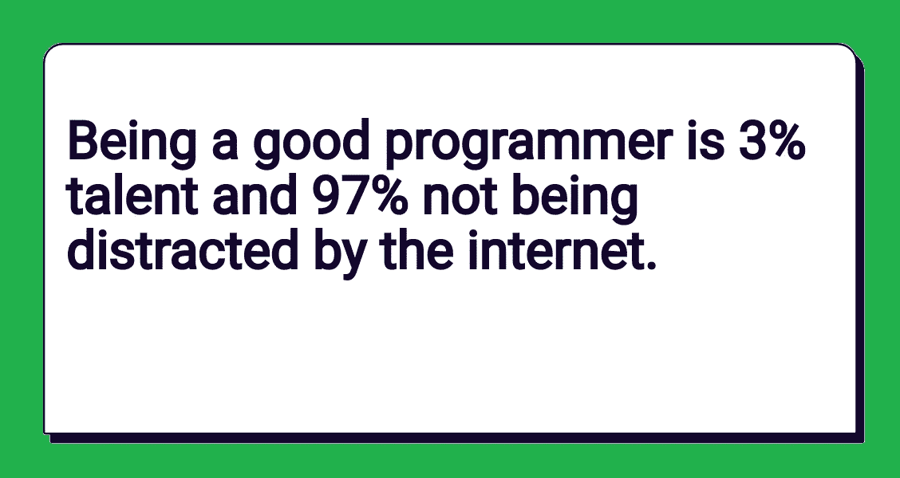
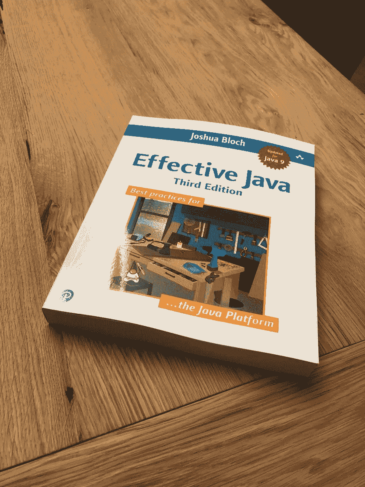
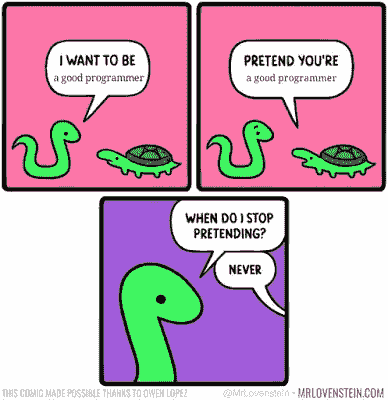

# 2023 年成为更好的程序员和软件开发者的 10 个技巧

> 原文：<https://medium.com/javarevisited/10-tips-to-become-a-better-programmer-and-software-developer-a48037519182?source=collection_archive---------0----------------------->

## 我的拙见是在 2023 年成为一名更好的程序员、开发者和软件工程师。

大家好，如果你想成为一名更好的开发人员，并寻找一些可靠的提示，那么你来对地方了。在过去，我已经分享了许多路线图，如 [2023 Java 开发人员路线图](/javarevisited/the-java-programmer-roadmap-f9db163ef2c2)、 [Web 开发人员路线图](/javarevisited/the-2019-web-developer-roadmap-ab89ac3c380e)、 [DevOps 工程师路线图](/hackernoon/the-2018-devops-roadmap-31588d8670cb)和 [React.js 开发人员路线图](/javarevisited/the-2019-react-js-developer-roadmap-9a8e290b8a56)，在本文中，我将分享一些实用技巧，以便在 2023 年成为一名更好的全能开发人员。

很多 Java 开发者问我**如何成为一个更好的程序员？如何提高我的编程技能？或者我擅长 Java 但不擅长解决问题的能力等等。**

这是一个现实，今天的时代充满了语言专家而不是真正的程序员。很容易理解 Java 编程语言的关键字、方法和 API。

然而，与此同时，解决实际问题，设计可重用的、健壮的软件，以及获得最佳的数据结构和算法仍然是一个挑战。

我经常看到 Java 程序员在被要求在有限的时间内设计和编写解决方案时表现不佳，但同时，他们对 Java 概念和所有理论都非常精通。

即使是拥有 4 到 6 年 Java 编程经验的高级程序员，有时也无法解决像设计*咖啡机、* [*编码自动售货机*](http://javarevisited.blogspot.sg/2016/06/design-vending-machine-in-java.html#axzz4sZVwtCgs) 这样的问题，有时甚至无法解决 [*倒链表*](https://javarevisited.blogspot.com/2017/03/how-to-reverse-linked-list-in-java-using-iteration-and-recursion.html) 这样的问题。

我可能刚刚离开成为一名更好的程序员，但是了解你的局限性并努力解决这些问题是很重要的。

如果你对编码感到抵触，那么你应该尽可能地编码，如果你在使用[面向对象分析和设计](https://click.linksynergy.com/deeplink?id=JVFxdTr9V80&mid=39197&murl=https%3A%2F%2Fwww.udemy.com%2Fcourse%2Fuml-and-object-oriented-design-foundations%2F)进行设计时感到压力和失落。你应该尽可能多地使用纸和笔来做设计。这种阻力是阻止你成为更好的程序员的原因。

我个人发现，对于一个普通的程序员来说，编码和设计存在很多阻力，因为他们中的大多数人在自己的专业工作中没有做足够的编码和开发。顺便说一句，成为一名更好的程序员可能有许多技巧，我将坚持我的清单，我个人遵循它，它不断地帮助我。

您可能会发现它们很有用，但是如果您是更高级的人员，并且正在寻找成为解决方案架构师的技巧，您可能会喜欢看 Mark Farragher 的 [**如何成为杰出的解决方案架构师**](https://click.linksynergy.com/deeplink?id=JVFxdTr9V80&mid=39197&murl=https%3A%2F%2Fwww.udemy.com%2Fcourse%2Fhow-to-become-an-outstanding-solution-architect%2F) 课程。

 [## 成为解决方案架构师:架构课程

### 您是 IT 项目团队中的开发人员、首席开发人员还是解决方案架构师？你想学习如何…

udemy.com](https://click.linksynergy.com/deeplink?id=JVFxdTr9V80&mid=39197&murl=https%3A%2F%2Fwww.udemy.com%2Fcourse%2Fhow-to-become-an-outstanding-solution-architect%2F) 

# 2023 年成为更好的程序员或软件开发员的 10 个技巧

要成为一名更好的程序员，你需要擅长[数据结构](https://www.java67.com/2019/07/top-10-online-courses-to-learn-data-structure-and-algorithms-in-java.html)、[算法](https://hackernoon.com/10-data-structure-algorithms-and-programming-courses-to-crack-any-coding-interview-e1c50b30b927)、[使用 OOP 进行设计、](https://javarevisited.blogspot.com/2018/08/5-object-oriented-programming-and-design-courses-for-Java-programmers.html) [多线程](https://javarevisited.blogspot.com/2018/06/top-5-java-multithreading-and-concurrency-courses-experienced-programmers.html)，以及各种编程概念，如递归、分治、原型化和[单元测试](http://javarevisited.blogspot.sg/2012/08/best-practices-to-write-junit-test.html)。编程是许多技能的结合，这意味着不可能在短时间内学会它，它需要时间和经验，但不会自动发生。

你可以花五年时间做一份 Java 编程的工作，而不是一个优秀的程序员。因为大多数 Java 面试关注的是理论而不是编程和编码技能。

没有多少程序员练习这些必备的编程技能。如果有一个强制性的解决问题的编程测试，我敢打赌一般的程序员会做得更好。无论如何，下面是我列出的可以帮助你成为一名优秀程序员的事情。

## 1.编码，编码，编码

为什么我把编码放在这个列表的首位？因为这是最难的，同时也是编程的核心部分。

通过做编码，你也认识到自己在[设计](http://javarevisited.blogspot.sg/2012/06/20-design-pattern-and-software-design.html)、[错误处理](http://javarevisited.blogspot.sg/2013/03/0-exception-handling-best-practices-in-Java-Programming.html)、[线程化、](http://javarevisited.blogspot.sg/2010/10/what-is-deadlock-in-java-how-to-fix-it.html)中的错误，然后回到那些各自的技能中去提高。你不能只从事设计工作；编码产生输出，这对学习和行动的成功至关重要。顺便说一句，不要在解决问题后就停下来，扔掉你的第一个解决方案总是更好，那只是一个原型，你的下一个解决方案应该解决你发现的问题，遗漏构建原型的需求。

你也可以看看 Maximillian Schwarzmuller 为 JavaScript 开发人员开设的 [Clean Code](https://click.linksynergy.com/deeplink?id=JVFxdTr9V80&mid=39197&murl=https%3A%2F%2Fwww.udemy.com%2Fcourse%2Fwriting-clean-code%2F) 课程，以及为 Java 开发人员开设的[**Clean Code with Java:Learn Simple Design，Refactoring & TDD**](https://click.linksynergy.com/deeplink?id=CuIbQrBnhiw&mid=39197&murl=https%3A%2F%2Fwww.udemy.com%2Fcourse%2Fjava-clean-code-with-refactoring-and-tdd%2F) 课程，了解如何编写经得起时间考验的高质量代码。

 [## 干净的代码

### 作为一名开发人员，您应该能够编写有效的代码——当然！不幸的是，很多开发人员写得不好…

udemy.com](https://click.linksynergy.com/deeplink?id=JVFxdTr9V80&mid=39197&murl=https%3A%2F%2Fwww.udemy.com%2Fcourse%2Fwriting-clean-code%2F)  [## 用 Java 清理代码:学习简单的设计、重构和 TDD

### Ranga 是经认证的谷歌云助理云工程师、AWS 认证解决方案架构师助理、AWS 认证…

udemy.com](https://click.linksynergy.com/deeplink?id=CuIbQrBnhiw&mid=39197&murl=https%3A%2F%2Fwww.udemy.com%2Fcourse%2Fjava-clean-code-with-refactoring-and-tdd%2F) 

## 2.阅读书籍

编码说起来容易做起来难，好代码和坏代码之间有巨大的差异，但是你怎么知道呢？直到你看到一个好的代码并知道为什么一个特定的代码是好的，你才能理解其中的区别。

这就是书来帮忙的地方；通常，作者本身就是伟大的程序员。他们以书的形式提供他们的经验。我爱书，但有一本书对我帮助特别大，那就是鲍勃大叔的 [***【干净的代码】***](http://www.amazon.com/Clean-Code-Handbook-Software-Craftsmanship/dp/0132350882?tag=javamysqlanta-20) 。

通过阅读这本书，我发现自己时不时会在代码中发现问题，并应用书中给出的建议。我的建议是，如果你找到这样的书，就把它们抢过来。我也推荐多读这些经典书籍，时不时参考一下。

另一本类似的书是约书亚·布洛赫的 [***有效 Java***](http://www.amazon.com/dp/0321356683/?tag=javamysqlanta-20) ，里面全是好建议。还有，通过读书，你是在借鉴别人的经验，而提升自己的方式只有两种，要么*借鉴自己的经验*(非常有限)，要么*借鉴别人的经验*(无限)。

多记并不总是好的，与其读 5 本书，我建议读两本你喜欢读了很多遍的书。这两本书也来自我的 Java 程序员必读[书籍清单](http://javarevisited.blogspot.com/2013/01/top-5-java-programming-books-best-good.html)。

## 3.练习数据结构、算法和系统设计问题

我本想把它列为第二项，但最后却成了第三项。在我看来，这是成为一名更好的程序员最关键的事情。我见过和遇到的好程序员，大部分在[数据结构](https://dev.to/javinpaul/10-data-structure-algorithms-sql-and-java-courses-to-crack-any-programming-job-interview-11f6)、[算法](https://dev.to/javinpaul/top-10-free-books-and-courses-to-learn-data-structure-and-algorithms-in-2019-30gl)、计算机科学基础等方面真的很好。通过学习这些东西，你可以更好地利用现有的资源。由于数据结构是任何程序的关键部分，扎实的数据结构知识有助于解决问题。

同样，关键编程原理、搜索和排序算法等知名算法的知识为你开发编程技巧。

你可以加入一个综合课程，比如 [**数据结构和算法:使用 Java**](https://click.linksynergy.com/deeplink?id=JVFxdTr9V80&mid=39197&murl=https%3A%2F%2Fwww.udemy.com%2Fcourse%2Fdata-structures-and-algorithms-deep-dive-using-java%2F) 深入学习更多关于基本数据结构，它们的属性，以及何时在你的程序中使用它们。这是我在网上找到的最好的课程之一。

而如果你喜欢看书胜过网络课程，那么你也参考[这些书](http://javarevisited.blogspot.com/2015/07/5-data-structure-and-algorithm-books-best-must-read.html)来提高你的数据结构和算法知识。

另一件对成为更好的开发人员至关重要的事情是学习系统设计和软件架构。这是一个有 10 年经验的程序员和一个有经验的程序员之间的区别。

你应该熟悉系统如何工作，它们的各个部分如何协作，微服务和 Monolith 等不同的架构，它们的优缺点等。

如果你需要资源，我强烈推荐教育类的 [**探索系统设计面试**](https://www.educative.io/collection/5668639101419520/5649050225344512?affiliate_id=5073518643380224) 课程。这门互动课程及其关于高级设计问题的第二部分可以教你很多关于设计和优化系统的好东西。

 [## 探索系统设计面试——互动学习

### 系统设计问题已经成为软件工程面试过程的标准部分。在这些方面的表现…

www.educative.io](https://www.educative.io/collection/5668639101419520/5649050225344512?affiliate_id=5073518643380224) 

## 4.开源贡献

贡献开源代码，尤其是来自 Apache、Google 和其他一些项目的开源代码，是提高编程技能和成为更好的程序员的另一种方式。只要在他们的邮件列表上签名，接下来的讨论就能教会你很多。

由于大部分的讨论都发生在优秀的程序员之间，倾听他们，理解问题以及他们的方法、解决方案和观点，会自动养成良好的编程习惯。要充分利用它，不要只是被动地坐着，问问题，提出你的观点，也要尊重他人。如果您想知道如何从开源贡献开始，那么这里有一些来自 Medium 的关于开源贡献的好文章

 [## 为开源做出你的第一份贡献

### 我们将讨论开源意味着什么，你可能想参与的原因，以及如何使你的第一个…

medium.com](/bigcommerce-developer-blog/making-your-first-contribution-to-open-source-5d983dcb910e)  [## 如何开始为开源项目做贡献

### 开始往往是成功的一半

towardsdatascience.com](https://towardsdatascience.com/how-to-start-contributing-to-open-source-projects-10d0517b13d8) 

## 5.阅读好的博客

读好博客是读书的一小部分。阅读博客如何帮助你成为一名更好的程序员？嗯，确实如此。由于博客通常是由程序员自己写的，并且大多数人分享他们的个人观点和经验，所以你经常会发现它们是相关的。

还有，博客是一小段信息，所以很好消化。博客还有助于学习现有语言和 API 的新技术和新特性。

很多时候，我从一篇小博文中描述的 Java 的一个真正为人熟知的部分，看到了一些细微或遗漏的东西。说到阅读好的开发文章，我更喜欢去像 [Dev.to](https://dev.to/javinpaul/11-essential-skills-software-developers-should-learn-in-2020-1bio) 、 [FreeCodecamp](https://www.freecodecamp.org/news/these-are-the-best-free-courses-to-learn-data-structures-and-algorithms-in-depth-4d52f0d6b35a/?gi=a41bf34d0c99) 和 [Medium](/javarevisited/what-java-programmers-should-learn-in-2020-648050533c83) 这样的网站，尤其是一些专注于开发的出版物。

 [## 2023 年开发运维路线图

### 2023 年成为 DevOps 工程师的图解指南及课程链接

medium.com](/hackernoon/the-2018-devops-roadmap-31588d8670cb)  [## Nikto Web 服务器扫描简介

### 网站是世界上几乎每个企业或组织的重要组成部分。从你附近的花店到环球…

www.freecodecamp.org](https://www.freecodecamp.org/news/an-introduction-to-web-server-scanning-with-nikto/)  [## Java 访问

### 一个关于 Java，编程，算法，数据结构，SQL，Linux，数据库，面试问题，以及我个人…

javarevisited.blogspot.com](https://javarevisited.blogspot.com/) 

## 6.读取代码

如果阅读博客有助于*成为一名优秀的程序员*，那么阅读代码的帮助不止于此；但与此同时，阅读博客很容易，但阅读代码却很难。你看到阻力了吗？那你应该去做。

看看开源项目的代码，你的程序员同伴的代码，你现有的专有代码，来自 Java SDK 的代码，试着理解它们是如何工作的；试着看看他们在做什么，为什么这么做。

寻找[图案](https://javarevisited.blogspot.com/2018/02/top-5-java-design-pattern-courses-for-developers.html)，培养导航技能；最初，你会发现这很无聊和困难，但随着时间的推移，你会养成良好的 ***代码意识*** ，它会在你犯错误时提醒你，帮助你发现别人的错误、差距和代码味道。

这种代码感是一个更好的程序员的标志之一，他们往往倾向于看，看你错过了什么。

## 7.编写单元测试

单元测试补充了思考和编码过程，并随后帮助你更好地设计。任何难以测试的东西都有改进的机会。此外，[编写单元测试](http://javarevisited.blogspot.sg/2013/03/how-to-write-unit-test-in-java-eclipse-netbeans-example-run.html)有助于找到更好的名字、更好的抽象、更好的接口、抽象类设计，并整体提高代码质量。

但是就像[编码](https://dev.to/javinpaul/top-20-websites-to-learn-coding-with-java-python-sql-algorithms-and-git-for-free-in-2019-best-of-lot-l2l)和[设计](https://dev.to/javinpaul/5-best-courses-to-learn-software-architecture-and-system-design-for-programmers-1879)一样，单元测试对于一般程序员来说也是一项艰苦的工作，你会在那里看到很多阻力。一些程序员编写琐碎的测试，而不是认真思考使用场景。请记住，在分析、设计和开发之后，没有什么可以替代对整个过程的思考，单元测试是对代码中的场景和缺口进行思考的另一个机会。让它成为一个规则；始终为您的代码编写单元测试。

如果你想学习 Java 中的单元测试，我建议你学习 JUnit 和 Mockito 这两个 Java 中单元测试的必备框架，如果你需要一门课程，我建议你加入 Udemy 上 Ranga Karnan 的[**JUnit 5 in 20 steps**](https://click.linksynergy.com/deeplink?id=JVFxdTr9V80&mid=39197&murl=https%3A%2F%2Fwww.udemy.com%2Fcourse%2Fjunit-tutorial-for-beginners-with-java-examples%2F)课程。

## 8.进行代码评审

像单元测试一样，代码评审是另一种有助于成为优秀程序员的开发实践。代码评审对评审者和作者都有帮助；当作者从他的错误中学习时，评审者提高了他的代码意识并提供了真诚的建议。

你认为坚如磐石的代码有一些只有其他程序员才能看到的错误，这通常会有所帮助，[代码审查](http://javarevisited.blogspot.sg/2011/09/code-review-checklist-best-practice.html)和四眼检查会帮你做到这一点。如果你很幸运，有机会在一家将单元测试、代码审查作为一门学科的公司工作，那么你很可能成为一名比其他人更好的程序员。这两件事极大地有助于提高编程技能。

如果你想知道在代码审查中检查什么，我建议你检查代码是否功能正确，是否遵循了标准实践，如 [**可靠设计原则**](https://click.linksynergy.com/deeplink?id=JVFxdTr9V80&mid=39197&murl=https%3A%2F%2Fwww.udemy.com%2Fcourse%2Fsolid-design%2F) 和 Java 命名约定。你可以检查的另一件事是是否有足够的单元测试，这经常被忽视。

> 注意——不要像伟大的霍马那样以大公司的风格进行代码审查

## 9.和一个程序员同事聊天

与说话相比，阅读是一件被动的事情。谈论一个程序，并与一个程序员同事讨论它，通常会带来一个更好的解决方案；这是很自然的，因为当你说话和听别人说话时，你的头脑往往会涉及更多。

我在和队友讨论的时候发现了差距、缺失的需求、bug、设计缺陷。在软件行业中，程序员倾向于将自己与他们的计算机隔离开来，交谈、分享和做白板会议非常有帮助。

*不要只是坐着写代码*，和程序员们一起交谈、倾听、思考、闲逛。参加活动也有帮助。你也可以得到一些有用的实践技巧，一夜之间成为一名更好的开发人员，就像下面这个:-)

## 10.参与堆栈溢出和论坛，评论博客

这是另一种帮助你复习知识的活动形式。通过分享知识，首先受益的是分享者。由于[编程](/javarevisited/7-best-coding-course-to-learn-programming-with-zero-experience-in-2020-52f7d0d9cb80)很庞大，你很容易忘记大多数超过三个月不用的东西。参与 StackOverflow，回答别人的问题，在博客和论坛上发表评论，这是一个很好的修正知识和纠正错误观念的小方法。通过把我们的知识展示给别人，我们帮助了别人，也考验了他们。很多时候你会看到有人从你的知识中受益，但你也正在纠正你的误解。

**每个程序员都想成为更好的程序员**，但不是每个人都能成功。除了编程和解决问题的天赋之外，成为一名更好的程序员还需要大量的努力、不断的学习和毅力。

像编码、设计、单元测试和代码审查这样的实际工作做得越多，你就会变得越好。如果你此刻只想做一件事，我会说去读 [**干净代码**](http://www.amazon.com/Clean-Code-Handbook-Software-Craftsmanship/dp/0132350882?tag=javamysqlanta-20) **。**

其他**编程文章**你可能喜欢:

*   [完整的 Java 开发者路线图](/javarevisited/the-java-programmer-roadmap-f9db163ef2c2)
*   [每个 Java 开发人员都应该学习的 10 个工具](https://www.java67.com/2018/04/10-tools-java-developers-should-learn.html)
*   [通晓多种语言的程序员可以学习的 10 种编程语言](http://www.java67.com/2017/12/10-programming-languages-to-learn-in.html)
*   [每个程序员应该知道的 10 件事](/swlh/10-things-every-programmer-should-know-26ba37cfcaf4)
*   [深入学习 Spring 框架的前 5 门课程](https://javarevisited.blogspot.com/2018/06/top-6-spring-framework-online-courses-Java-programmers.html)
*   [初学者的 10 个最佳云认证](https://www.java67.com/2020/09/top-10-cloud-certification-you-can-aim.html)
*   [深入了解 Spring Boot 的五大课程](https://www.java67.com/2018/06/5-best-courses-to-learn-spring-boot-in.html)
*   每个 Java 开发人员都应该阅读的 10 本书
*   Java 和 Web 开发人员应该学习的 10 个框架
*   [Java 开发者应该知道的 20 个库](http://javarevisited.blogspot.sg/2018/01/top-20-libraries-and-apis-for-java-programmers.html)
*   [我最喜欢的深入学习 Java 的免费课程](/javarevisited/10-free-courses-to-learn-java-in-2019-22d1f33a3915)
*   [学习 Maven、Jenkins 和 Docker 的 10 门免费课程](/javarevisited/top-10-free-courses-to-learn-maven-jenkins-and-docker-for-java-developers-51fa7a1e66f6)
*   [破解编码面试的 5 个必备技巧](https://javarevisited.blogspot.com/2020/04/5-essential-skills-to-crack-coding-interviews.html)
*   [完整的前端和后端开发路线图](https://javarevisited.blogspot.com/2019/02/the-2019-web-developer-roadmap.html)
*   【Java 开发人员十大 IT 认证

感谢您阅读本文。如果你喜欢这些建议，请与你的朋友和同事分享。如果您有任何问题或反馈，请留言。如果你有任何其他的技巧来提高你的编程和编码技能，请随时与我们分享。

**P. S. —** 如果你是一名 Java 开发人员，并且正在寻找一些特定于 Java 的技巧来成为一名更好的 Java 开发人员，你也可以查看今年的 [**技巧列表来成为一名更好的 Java 程序员**](https://javarevisited.blogspot.com/2018/05/10-tips-to-become-better-java-developer.html#axzz5jwmmAbXI) 。

**P.S.S.** —如果您是一名拥有 5 到 10 年经验的资深程序员，并且正在寻找成为解决方案架构师或在职业生涯中从技术方面向前迈进的技巧，那么您可能想看看 Udemy 上 Mark Farragher 的 [**如何成为一名杰出的解决方案架构师**](https://click.linksynergy.com/deeplink?id=JVFxdTr9V80&mid=39197&murl=https%3A%2F%2Fwww.udemy.com%2Fcourse%2Fhow-to-become-an-outstanding-solution-architect%2F) 课程。学习成为解决方案架构师所需的所有软硬技能的最佳课程之一。

 [## 成为解决方案架构师:架构课程

### 您是 IT 项目团队中的开发人员、首席开发人员还是解决方案架构师？你想学习如何…

udemy.com](https://click.linksynergy.com/deeplink?id=JVFxdTr9V80&mid=39197&murl=https%3A%2F%2Fwww.udemy.com%2Fcourse%2Fhow-to-become-an-outstanding-solution-architect%2F)