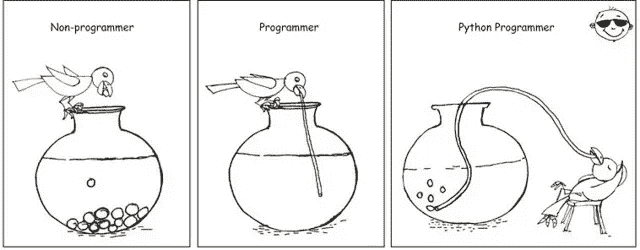
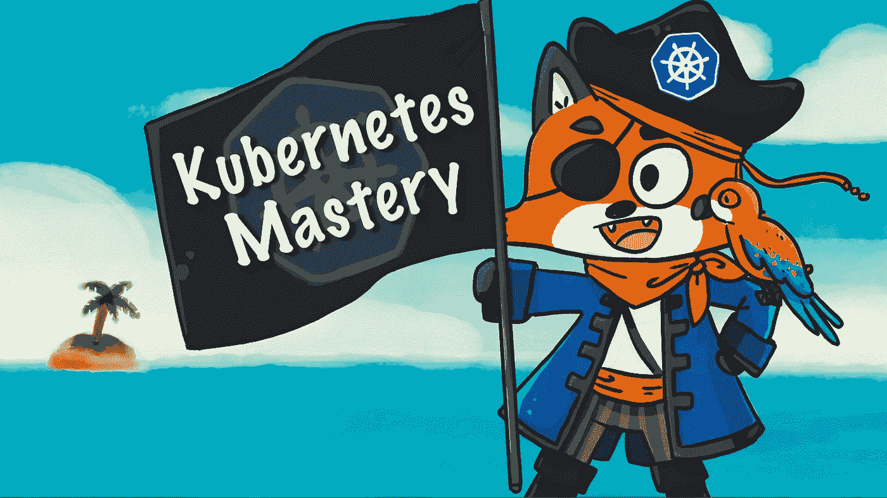
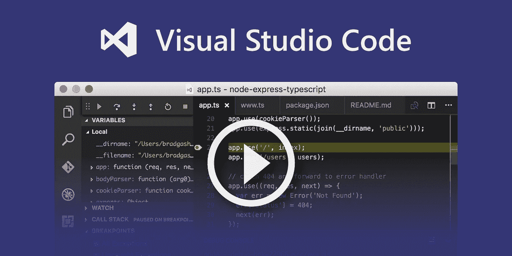
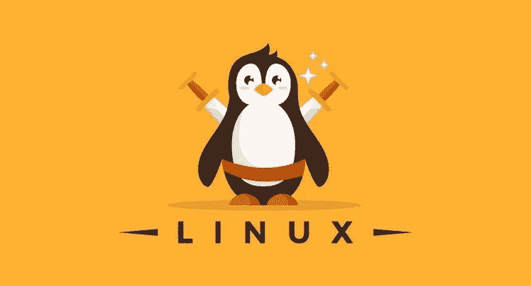

# 程序员和软件开发人员应该在 2023 年学习的 10 个最佳工具和库

> 原文：<https://medium.com/javarevisited/10-tools-and-libraries-every-software-developers-should-learn-e05e636a5577?source=collection_archive---------0----------------------->

## 这十个工具和库是开发者技能的基础。看看这个列表，你可以从哪里开始扩展你的技能。

你好，伙计们，如果你在寻找程序员和软件开发人员在 2023 年可以学习的最好的工具和库，那么你来对地方了。之前，我已经分享了 [**最好的 Python 工具**](/javarevisited/top-10-tools-python-programmers-should-learn-cb9c2535f57)[**最好的 Java 框架**](/javarevisited/top-5-frameworks-java-developers-can-learn-for-microservices-development-in-2022-848da66d6651) ，以及 [**最好的 Java 库**](/javarevisited/20-essential-java-libraries-and-apis-every-programmer-should-learn-5ccd41812fc7) ，今天，我将分享最好的工具和库，每个程序员都应该学习。

像每个行业一样，软件开发也有工具和实践，每个软件程序员都需要学习才能成功。虽然在软件开发中并不缺乏工具和库，但在本文中，我将分享我认为每个软件开发人员都应该学习的 10 个基本工具和库。

你们中的一些人可能认为十个工具算不了什么，但是，说实话，如果每个程序员都真正了解这些，他就可以在日常工作中完成很多事情。事不宜迟，让我们来看看我列出的每个软件开发人员都应该知道和熟知的十个工具。

# 2023 年要学习的 10 个最佳编程和软件开发工具和库

在不浪费你更多时间的情况下，这里列出了每个程序员和软件工程师都应该学习的最好的工具和库。它们对于软件开发是必不可少的，学习它们会让你成为一个更好、更有能力的软件专业人员。

## 1.版本控制和代码库

对于任何程序员或软件开发人员来说，良好的源代码控制库知识都是必不可少的，因为您每天都需要签入和签出代码。要成为一名更好的开发人员，您还应该了解分支和合并等高级概念。

在当今世界，Git 和 GitHub 已经成为源代码控制库和版本控制工具的同义词。对于现在的程序员来说，这是唯一最重要的工具，这就是为什么我建议每个程序员真正学好 Git 和 GitHub。

如果你是一名初学者或程序员，想要提高自己的 Git 知识，我建议你去看看 Udemy 的[**Git Complete:Git**](https://click.linksynergy.com/fs-bin/click?id=JVFxdTr9V80&subid=0&offerid=323058.1&type=10&tmpid=14538&RD_PARM1=https%3A%2F%2Fwww.udemy.com%2Fgit-complete%2F)课程的权威分步指南，这是深入学习 Git 的最佳课程之一。

## 2.SQL[用于数据库交互]

这是每个程序员都应该学习的另一个重要工具或编程语言。SQL 实际上是一种标准的查询语言，用于处理数据库。通过使用 SQL，您可以从表中读取、更新和删除数据。

由于我们在现实世界中到处都使用数据库，程序员应该对 SQL 有很好的理解。

除了知道基本的命令，如 SELECT、INSERT、UPDATE 和 DELETE，程序员还应该知道如何使用 join、聚合函数、子查询和其他高级功能编写复杂的查询。

如果您是 SQL 新手，或者想要将您的 SQL 技能提升到一个新的水平，那么 [**完整的 SQL 训练营**](https://click.linksynergy.com/fs-bin/click?id=JVFxdTr9V80&subid=0&offerid=323058.1&type=10&tmpid=14538&RD_PARM1=https%3A%2F%2Fwww.udemy.com%2Fthe-complete-sql-bootcamp%2F) 是一个不错的起点。

## 3.python[编码和编程]

作为一名 Java 开发人员，你可能会感到惊讶，我建议每个程序员都学习 Python。这是有原因的。Python 是一种功能强大的高级面向对象编程语言，用途非常广泛。

您可以像在 Java 中一样创建大型应用程序，并且可以使用 Python 创建有用的脚本来实现自动化。

它还有许多模块，几乎可以实现任何事情，从访问文件系统和开发 web 应用程序到机器学习。

我不能说更多，但我会给你看这张图，它清楚地解释了为什么每个程序员都应该学习 Python。

它还具有简单易用的语法，这使得它成为第一次尝试学习计算机编程的人的完美语言。如果你想学习 Python，那么 [**完整的 Python boot camp**](https://click.linksynergy.com/fs-bin/click?id=JVFxdTr9V80&subid=0&offerid=323058.1&type=10&tmpid=14538&RD_PARM1=https%3A%2F%2Fwww.udemy.com%2Fcomplete-python-bootcamp%2F)**课程是一个很好的起点。**

****

## **4.码头工人[集装箱]**

**Docker 是一个改变游戏规则的工具，因为它简化了运行任何应用程序的过程。有了 Docker，你就有了一个不仅能在你的机器上运行，而且能在每台机器上运行的进程。**

**借助 Docker 映像和容器，您可以轻松部署 Java 微服务或 C++应用，最重要的是，您可以进行扩展，因为它们就像启动流程一样简单。**

**不再担心依赖的库，依赖的运行时，如 Java。NET 或 Node，甚至不用担心 RHEL 5 或 RHEL 7 等操作系统的依赖性，有了 Docker，您就有了一个简单、可扩展的过程，让您高枕无忧，这使它成为任何程序员都必须学习的工具。**

**并且，如果你想学习 Docker，需要一门推荐课程，我强烈推荐 Udemy 上 Maximiliar SchwarzMuller 的这门 [**Docker & Kubernetes:实用指南**](https://click.linksynergy.com/deeplink?id=JVFxdTr9V80&mid=39197&murl=https%3A%2F%2Fwww.udemy.com%2Fcourse%2Fdocker-kubernetes-the-practical-guide%2F) 课程。**

****

## **5.kubernetes[集装箱运输]**

**这是另一个工具，也是云计算世界中的一个流行词，因为它使扩展应用程序变得非常容易。购买服务器、在服务器上建立基础设施，然后花数周时间部署应用程序的时代已经一去不复返了。**

**使用 Kubernetes 和 Docker，您可以轻松地扩展和缩减您的应用程序，以处理突发的流量，并在流量恢复正常时节省资金。**

**Kubernetes 通过自动化扩展过程将 Docker 提供的功能提升到了一个新的水平，并使其成为当今云原生世界的宠儿。如果你想学习 Kubernetes，我强烈推荐 Udemy 的这本[**Kubernetes master:来自码头工人船长的实践课程**](https://click.linksynergy.com/deeplink?id=JVFxdTr9V80&mid=39197&murl=https%3A%2F%2Fwww.udemy.com%2Fcourse%2Fkubernetesmastery%2F) 。**

****

## **6.excel[生产力工具]**

**Microsoft Excel 是程序员和软件开发人员的另一个重要工具。不要把它误认为仅仅是一个电子表格应用程序，使用 Excel 你可以做的事情比你想象的要多得多。**

**学习微软 Excel 的最大原因是你会发现它无处不在。从企业到 BA、QA 和项目经理，每个人都在使用它。你可以用它来生成报告，自动化，协调材料，等等。**

**如果你想超越仅仅将内容复制粘贴到 Excel 来学习 VLOOKUP 之类的功能，我建议你参加 Udemy 上的 [**Microsoft Excel — Excel 从初级到高级**](https://click.linksynergy.com/fs-bin/click?id=JVFxdTr9V80&subid=0&offerid=323058.1&type=10&tmpid=14538&RD_PARM1=https%3A%2F%2Fwww.udemy.com%2Fmicrosoft-excel-2013-from-beginner-to-advanced-and-beyond%2F) 课程。深入学习 Excel 的最佳课程之一**

****

## **7.文本编辑器+ IDE [ [VS 代码](https://code.visualstudio.com/docs/introvideos/basics)**

**每个程序员都应该非常了解一个文本编辑器。软件开发人员做大量的文本处理工作，知道一个文本编辑器总是有帮助的。**

**除了记事本，这是一个非常好的，无处不在的，基本的文本编辑器，我鼓励程序员学习一些高级的文本编辑器，如 VS 代码或 NotePad++。**

**它们支持正则表达式搜索和替换和宏，这对你的日常工作有很大帮助。如果你想了解更多关于 VS 代码文本编辑器 [**Visual Studio 代码教程——VS 代码入门**](https://click.linksynergy.com/deeplink?id=JVFxdTr9V80&mid=39197&murl=https%3A%2F%2Fwww.udemy.com%2Fcourse%2Fvisual-studio-code-tutorial%2F) 是一个很好的起点。**

****

## **8.Linux 命令**

**就像 [SQL](/javarevisited/top-5-sql-and-database-courses-to-learn-online-48424533ac61) 一样，Linux 命令是程序员的另一个必备工具。每个程序员有时都必须在 UNIX 上工作，我们中的许多人一天的大部分时间都在 Linux 机器上度过。**

**对 Linux 命令的良好了解意味着您可以找到您想要的东西，您可以知道机器正在发生什么，并且您可以对在 Linux 上运行的应用程序的任何问题进行故障排除。**

**这是每个程序员必备的技能，如果你对 Linux 命令不熟悉，你必须花些时间学习它，尤其是如果你对 Linux 有一些探索的话。对于初学者来说， [**Linux 精通:在 11.5 小时内掌握 Linux 命令行**](https://click.linksynergy.com/deeplink?id=JVFxdTr9V80&mid=39197&murl=https%3A%2F%2Fwww.udemy.com%2Fcourse%2Flinux-mastery%2F) s 是一个很好的起点。**

****

## **9.邮递员[API 测试]**

**今天是 API 的世界，Postman 在测试和使用 API 中扮演着至关重要的角色。无论您是开发 REST API 还是 GraphQL APIs，您都需要一个工具来连接和探索 API，然后再为其开发客户端或将其发布到客户端，而 [Postman](/javarevisited/7-best-courses-to-learn-postman-tool-for-web-service-and-api-testing-f225c138fa5a) 是测试 API 的最佳工具。**

**使用 Postman 客户端 GUI 或 Chrome 扩展，您可以发送 GET、POST 或任何其他 HTTP 请求，添加标头和请求参数，还可以详细分析响应。**

**如果你是 web 开发人员或应用程序开发人员，我强烈建议你学习 Postman，如果你正在使用 API，这肯定会在开发和测试方面对你有所帮助。如果你需要一门课程，可以在 Udemy 上查看瓦伦丁·德斯帕的 [**邮差:完全指南——REST API 测试**](https://click.linksynergy.com/deeplink?id=JVFxdTr9V80&mid=39197&murl=https%3A%2F%2Fwww.udemy.com%2Fcourse%2Fpostman-the-complete-guide%2F) 。**

****

## **10.云平台**

**云计算席卷了整个世界。其他所有公司都在向云迁移。无论你是一家初创公司还是一家拥有 100 年历史的大型投资银行，都在向云迁移，以获得更好的可扩展性、高可用性和成本降低。**

**并且， [AWS](/javarevisited/5-best-aws-courses-for-beginners-and-experienced-developers-to-learn-in-2021-563212409fbd) 是历史最悠久、规模最大的公共云提供商。了解 AWS 对任何开发人员来说都是关键，因为它让您了解如何在不购买服务器的情况下构建和部署应用程序。**

**现在，开办一家初创公司变得非常容易，因为你只需要编写你的应用程序，AWS 可以处理从运行应用程序到扩展应用程序、日志记录、存储数据等一切事情。**

**如果你今年能学到一样东西，我强烈推荐你学习 AWS，如果你需要一门课程，我推荐夏羽·马瑞克的 [**AWS 解决方案架构师课程**](https://click.linksynergy.com/deeplink?id=JVFxdTr9V80&mid=39197&murl=https%3A%2F%2Fwww.udemy.com%2Fcourse%2Faws-certified-solutions-architect-associate-saa-c02%2F) ，它是为认证而设计的，但包含了对任何想学习 AWS 的人来说最有价值的信息**

****

**这就是所有关于**每个程序员的必备工具**。这些是每个人都需要的一些基本工具，无论是使用 JavaScript 的 web 开发人员、使用服务器端代码的 Java 开发人员，还是使用 Android 或 iOS 应用程序的移动开发人员。**

**对这些工具的良好了解将对您的软件开发生涯大有帮助，因为您每天都会使用这些工具，并且会感谢您最初为学习它们所投入的时间和精力。**

**您可能喜欢的其他 **Web 开发文章****

*   **[学习 Web 开发的前 5 门课程](/better-programming/my-5-favorite-courses-to-learn-web-development-in-2019-a5e74167f8b2)**
*   **[2023 年前端和后端开发者路线图](https://javarevisited.blogspot.com/2019/02/the-2019-web-developer-roadmap.html)**
*   **[学习 React 钩子和上下文 API 的 10 门免费课程](/javarevisited/top-10-free-courses-to-learn-react-js-c14edbd3b35f?source=extreme_main_feed----d3a191ac6ed-----5-1--------------------561c2dc6_a2b4_41e0_b7be_1d97edbf631c--8)**
*   **[2023 年你能学会的 10 种编程语言](http://www.java67.com/2017/12/10-programming-languages-to-learn-in.html)**
*   **[2023 年 DevOps 工程师路线图](https://javarevisited.blogspot.com/2018/09/the-2018-devops-roadmap-your-guide-to-become-DevOps-Engineer.html#axzz61d5FPRru)**
*   **[成为全栈式 web 开发人员的 10 门最佳课程](/javarevisited/top-10-online-courses-to-become-a-fullstack-web-developer-in-2020-d608a6b63232)**
*   **[初学者学习 Nodejs 的 10 大课程](/javarevisited/top-10-online-courses-to-learn-node-js-in-depth-8ef0e31ca139)**
*   **[2023 年学习打字稿的 10 门免费课程](/javarevisited/top-10-free-typescript-courses-to-learn-online-best-of-lot-44bce9da41d1)**
*   **[2023 年 Java 程序员应该学会的 10 件事](https://javarevisited.blogspot.com/2017/12/10-things-java-programmers-should-learn.html#axzz5atl0BngO)**
*   **[我最喜欢的学习角框架的课程](/javarevisited/10-courses-to-learn-angular-for-web-development-6da1bd2856dc)**
*   **[初学者和有经验者的 15 门最佳 JavaScript 课程](/javarevisited/10-best-online-courses-to-learn-javascript-in-2020-af5ed0801645)**
*   **[2023 年需要学习的 5 大 Java 框架](http://javarevisited.blogspot.sg/2018/04/top-5-java-frameworks-to-learn-in-2018_27.html)**
*   **[2023 年学习 Python 的 10 个理由](https://javarevisited.blogspot.com/2018/05/10-reasons-to-learn-python-programming.html)**
*   **[2023 年学习 HTML 5 和 CSS 的前 5 门课程](https://javarevisited.blogspot.com/2019/05/top-5-html-5-and-css-3-courses-for-web-developers.html)**
*   **[2023 年要学习的 10 个 JavaScript 框架和库](https://www.java67.com/2019/01/top-10-javascript-frameworks-and-libraries-for-web-developers.html)**

**感谢您阅读本文。如果你觉得这些*最好的编程工具和库*有用，请分享给你的朋友和同事。如果您有任何问题或反馈，请留言。如果您有任何其他工具、技术、框架、库和技能是 Web 开发人员应该学习的，请随时发表评论。**

**如果你想成为一名 Java 开发人员，我还推荐你去看看 Udemy 上由 Tim Buchalaka 和他的团队为软件开发人员开设的 [**Java 编程大师班**](https://click.linksynergy.com/deeplink?id=JVFxdTr9V80&mid=39197&murl=https%3A%2F%2Fwww.udemy.com%2Fcourse%2Fjava-the-complete-java-developer-course%2F) 课程。对于任何想使用 Java 编程语言进行软件开发的人来说，这都是一门很棒的课程。**

**<https://click.linksynergy.com/deeplink?id=JVFxdTr9V80&mid=39197&murl=https%3A%2F%2Fwww.udemy.com%2Fcourse%2Fjava-the-complete-java-developer-course%2F> **