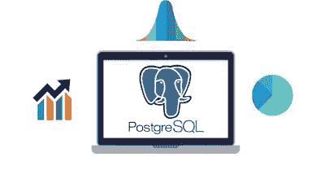
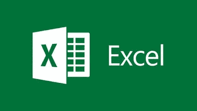
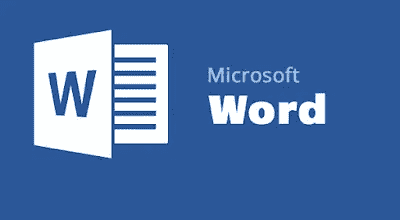
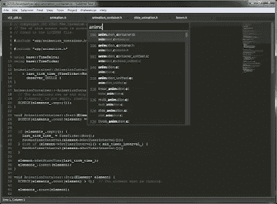
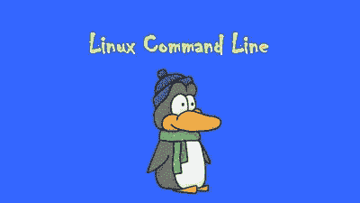
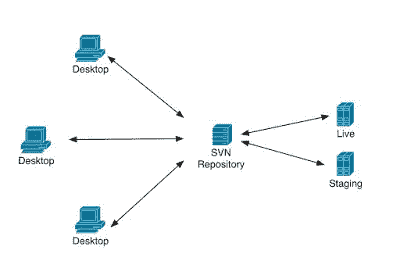
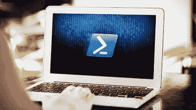

# 2023 年程序员和 IT 专业人员学习的 10 个最佳工具和库

> 原文：<https://medium.com/javarevisited/10-useful-tools-and-libraries-for-programmer-and-it-professionals-914e64e0eabc?source=collection_archive---------2----------------------->

## 编码新手入门

“橙色墙上的橙色扩音器”由 [Unsplash](https://unsplash.com?utm_source=medium&utm_medium=referral) 的奥列格·拉普捷夫

> 每个行业都有自己的工具，软件开发也不例外。一个好的程序员比其他人更了解他的工具，并且比一个普通的程序员拥有更强大和更先进的工具，但是，有些工具你希望每个软件开发者都应该知道，这个列表就是关于这些工具的。

在这个列表中，我要分享的是 **10 个必备工具**，相信每个程序员或者软件开发人员都应该知道并且非常了解。

# 每个程序员都应该知道的 10 个工具

你们中的一些人可能认为 10 个工具什么都不是，但是，老实说，如果每个程序员都真正了解这些，他可以在日常工作中完成很多事情。

不管怎样，事不宜迟，让我们来看看**我列出的每个软件开发人员都应该了解**并熟知的 10 个工具。

## 1.Git 和 Github

对任何程序员或软件开发人员来说，对任何源代码控制库的良好了解都是必不可少的，因为您每天都需要进行代码的签入和签出。

> 而且，要成为一名更好的开发人员，你还应该了解分支和合并等高级概念。

在当今世界， [Git 和 Github](http://javarevisited.blogspot.sg/2018/01/5-free-git-courses-for-programmers-to-learn-online.html) 已经成为源代码控制库和版本控制工具的代名词。

对于现在的程序员来说，这是唯一最重要的工具，这就是为什么我建议每个程序员真正学好 Git 和 Github。

如果你是一个初学者或程序员，想提高自己的 Git 知识，我建议你去看看 Udemy 的[Git Complete:Git](https://click.linksynergy.com/fs-bin/click?id=JVFxdTr9V80&subid=0&offerid=323058.1&type=10&tmpid=14538&RD_PARM1=https%3A%2F%2Fwww.udemy.com%2Fgit-complete%2F)课程的权威分步指南。深入学习 Git 的最佳课程之一。

# 2.结构化查询语言

这是每个程序员都应该学习的另一个重要工具或编程语言。SQL 实际上是标准的查询语言，用于处理数据库。通过使用 SQL，您可以从表中读取、更新和删除数据。

> 由于我们在现实世界中到处都使用数据库，程序员应该对 SQL 有很好的理解。

除了知道选择、插入、更新和删除等基本命令，程序员还应该知道如何使用[连接](http://javarevisited.blogspot.sg/2013/05/difference-between-left-and-right-outer-join-sql-mysql.html)、[聚合函数](https://javarevisited.blogspot.com/2013/08/difference-between-where-vs-having-clause-SQL-databse-group-by-comparision.html)、[子查询](http://javarevisited.blogspot.sg/2012/07/subquery-example-in-sql-correlated-vs.html)和其他高级功能编写复杂的查询。

如果您是 SQL 新手，或者想要将您的 SQL 技能提升到一个新的水平，那么[完整的 SQL 训练营](https://click.linksynergy.com/fs-bin/click?id=JVFxdTr9V80&subid=0&offerid=323058.1&type=10&tmpid=14538&RD_PARM1=https%3A%2F%2Fwww.udemy.com%2Fthe-complete-sql-bootcamp%2F)是一个不错的起点。

# 3.计算机编程语言

你可能会惊讶，作为一个 Java 开发人员，为什么我建议每个程序员学习 Python？这是有原因的。Python 是一种功能强大的高级面向对象编程语言[，它非常通用。](http://www.java67.com/2018/02/5-free-object-oriented-programming-online-courses.html)

> 您不仅可以像在 Java 中一样创建大型应用程序，还可以使用 Python 创建有用的脚本来实现自动化。

它还有许多模块，几乎可以让任何事情成为可能，从访问文件系统、开发 web 应用程序到机器学习。

我不能多说，只能给你看这张图，它清楚地解释了为什么每个程序员都应该学习 Python。

它还具有简单易用的语法，这使它成为第一次尝试学习计算机编程的人的完美语言。如果你想学习 Python，那么 [**完整的 Python 训练营**](https://click.linksynergy.com/fs-bin/click?id=JVFxdTr9V80&subid=0&offerid=323058.1&type=10&tmpid=14538&RD_PARM1=https%3A%2F%2Fwww.udemy.com%2Fcomplete-python-bootcamp%2F) 课程是一个很好的起点。

# 4.Excel 或任何电子表格

Microsoft Excel 是程序员和软件开发人员的另一个重要工具。不要把它误认为仅仅是一个电子表格应用程序，使用 Excel 你可以做很多你想象不到的事情。

学习微软 Excel 的最大原因是你会发现它无处不在。从业务人员到 BA、QA 和项目经理，每个人都在使用它。你可以使用它生成报告，自动化和协调的东西，以及更多。

如果你想超越只是将东西复制粘贴到 excel 来学习 VLOOKUP 之类的功能，我建议你加入 Udemy 上的[微软 Excel — Excel 从初级到高级](https://click.linksynergy.com/fs-bin/click?id=JVFxdTr9V80&subid=0&offerid=323058.1&type=10&tmpid=14538&RD_PARM1=https%3A%2F%2Fwww.udemy.com%2Fmicrosoft-excel-2013-from-beginner-to-advanced-and-beyond%2F)课程。深入学习 Excel 的最佳课程之一。

# 5.Word 或类似

微软 Word 不像微软 Excel 那样受欢迎，但仍然是程序员和软件工程师的基本工具之一。

作为一名开发人员，你经常需要创建文档，例如软件设计文档、需求文档等，而 Microsoft Word 是最好的工具。

它提供了复杂的格式选项来创建真正好看的文档。

如果你是初学者或中级开发人员，想提高你对微软世界的了解，我建议你参加 Udemy 上的[微软 Word 初级到高级](https://click.linksynergy.com/fs-bin/click?id=JVFxdTr9V80&subid=0&offerid=323058.1&type=10&tmpid=14538&RD_PARM1=https%3A%2F%2Fwww.udemy.com%2Fmicrosoft-word-from-beginner-to-advanced-and-beyond%2F)课程。

# 6.文稿演示软件

PowerPoint 与 Microsoft Excel 和 Word 一起构成了基本办公工具的三部曲，这就是为什么它们对于软件工程师和 IT 专业人员也是必不可少的，包括开发人员、QA、BA 和项目经理。

Microsoft PowerPoint 是最受欢迎的创建演示文稿的工具，作为一名程序员，很多时候你需要做演示，例如向业务部门介绍你的想法，向经理介绍你的计划，以及在团队之间进行许多知识共享会议，这就是为什么你不能忽视 PowerPoint。

如果你想学习 Powerpoint 或者提高你的知识，那么 Udemy 上的[精通 PowerPoint 演示文稿](https://click.linksynergy.com/fs-bin/click?id=JVFxdTr9V80&subid=0&offerid=323058.1&type=10&tmpid=14538&RD_PARM1=https%3A%2F%2Fwww.udemy.com%2Fcase-study-powerpoint-2013-presentation-slide-by-slide%2F)课程是一个很好的起点。

而且，如果你需要更多的选择，你也可以从这个[最佳微软 PowerPoint 在线课程](https://javarevisited.blogspot.com/2022/02/top-5-courses-to-learn-microsoft.html)列表开始。

# 7.文本编辑器(SubLime)

每个程序员都应该非常了解一个文本编辑器。软件开发人员做大量文本处理工作，知道一个文本编辑器总是有帮助的。

除了记事本，这是一个非常好的，无处不在的基本文本编辑器，我鼓励程序员学习一些高级的文本编辑器，如 Sublime 或 NotePad++。

它们支持正则表达式搜索和替换和宏，这对你的日常工作有很大帮助。如果你想了解更多关于 sublime 文本编辑器的知识，[Sublime Text for Rapid Web Development](https://click.linksynergy.com/fs-bin/click?id=JVFxdTr9V80&subid=0&offerid=323058.1&type=10&tmpid=14538&RD_PARM1=https%3A%2F%2Fwww.udemy.com%2Fsublime-text-for-rapid-web-development%2F)是一个不错的起点。

# 8.Linux 命令

就像 [SQL](https://javarevisited.blogspot.com/2018/05/top-5-sql-and-database-courses-to-learn-online.html) 一样，Linux commands 是程序员的另一个必备工具。每个程序员都有在 UNIX 上工作的时候，我们中的许多人每天大部分时间都在 Linux 机器上。

对 [Linux 命令](http://www.java67.com/2018/02/5-free-linux-unix-courses-for-programmers-learn-online.html)的良好了解意味着您可以找到您想要的东西，您可以知道机器正在发生什么，并且您可以对在 Linux 上运行的应用程序的任何问题进行故障排除。

这是每个程序员都必须掌握的技能，如果你不习惯 Linux 命令，你必须花些时间去学习它，尤其是如果你对 Linux 有所探索的话。对于初学者来说， [Linux 命令行基础知识](https://click.linksynergy.com/fs-bin/click?id=JVFxdTr9V80&subid=0&offerid=323058.1&type=10&tmpid=14538&RD_PARM1=https%3A%2F%2Fwww.udemy.com%2Flinux-command-line-volume1%2F)是一个开始的好地方。

# 9.SVN

尽管就版本控制系统而言, [Git](https://javarevisited.blogspot.com/2018/01/5-free-git-courses-for-programmers-to-learn-online.html) 已经占据了将近 70%的市场份额，但仍有一些项目使用了 SVN(也被称为 subversion)。

不仅在财产上，而且在开放源码上，这就是为什么认识乌龟 SVN 对程序员有好处。

这是同一个工具，我 12 年前从 SVN 开始，现在仍然存在。如果您是初学者或想提高 SVN 知识并学习一些高级概念(如在 SVN 的分支和合并)的人，那么约翰·索尼兹在 Pluarlsight 上撰写的《SVN T4 导论》是一门很好的入门课程。

# 10.Powershell 或 Cygwin

一旦你在 Linux 下工作，在 Windows 下工作时你会感觉到约束，因为在 Windows 和 Powershell 中没有什么比 [Linux 命令](http://javarevisited.blogspot.sg/2017/03/10-examples-of-curl-command-in-unix-and-Linux.html)更能一劳永逸地解决这个问题。

Windows PowerShell 是由 Microsoft 开发的一种 Shell，用于任务自动化和配置管理。

这个强大的外壳基于。NET 框架，它包括一个命令行外壳和一种脚本语言，这样您就可以像在 Linux 中一样自动编写和创建脚本。

如果你想从 PowerShell 开始，我建议你看看 Udemy 上的[学习 Windows PowerShell](https://click.linksynergy.com/fs-bin/click?id=JVFxdTr9V80&subid=0&offerid=323058.1&type=10&tmpid=14538&RD_PARM1=https%3A%2F%2Fwww.udemy.com%2Flearning-windows-powershell%2F) 课程，我最近买了它来提高我的 PowerShell 技能。

这就是每个程序员必备的工具。这些是每个人都需要的一些基本工具，无论是从事 [JavaScript](http://www.java67.com/2018/04/top-5-free-javascript-courses-to-learn.html) 的 web 开发人员、从事服务器端代码的 Java 开发人员，还是从事 [Android](http://javarevisited.blogspot.sg/2017/12/top-5-android-online-training-courses-for-Java-developers.html) 或 iOS 应用的移动开发人员。

> 对这些工具的良好了解将对您的软件开发生涯大有帮助，因为您每天都会使用这些工具，并且会感谢您最初为学习它们所付出的时间和努力。

其他**编程文章**你可能喜欢的
[10 本书每个程序员必读的](http://www.java67.com/2015/03/10-books-every-programmer-and-software-engineer-read.html)
[提高编程技能的 10 个技巧](http://javarevisited.blogspot.sg/2014/01/10-tips-to-improve-programming-skill-become-better-programmer.html#axzz553pz1hYh)
[10 个面向对象设计原则每个程序员都应该知道的](http://javarevisited.blogspot.sg/2012/03/10-object-oriented-design-principles.html)
[十大编程语言学习](http://www.java67.com/2017/12/10-programming-languages-to-learn-in.html)
[10 篇文章每个程序员都应该阅读的](http://javarevisited.blogspot.sg/2014/05/10-articles-every-programmer-must-read.html)
[10 个框架和库 Java 和 Web 开发人员都应该学习的](http://javarevisited.blogspot.sg/2018/01/10-frameworks-java-and-web-developers-should-learn.html)

## 结束语

谢谢，你坚持到了文章的结尾…

如果你喜欢这篇文章，那么请分享给你的朋友和同事，别忘了在 Twitter 上关注 [javinpaul](https://twitter.com/javinpaul) ！

p . s——如果你需要一些免费资源，可以查看这个 [f **ree 数据结构与算法课程**](http://javarevisited.blogspot.com/2018/01/top-5-free-data-structure-and-algorithm-courses-java--c-programmers.html) 列表，开始准备。

**你可能喜欢的其他文章:**

 [## 2023 年 Java 程序员该学什么？

### 2023 年 Java 程序员可以学习的有用工具、技术、框架和库

medium.com](/javarevisited/what-java-programmers-should-learn-in-2020-648050533c83)  [## 2023 年学习 Java 的 10 大课程

### 如果你是计算机科学专业的毕业生，或者想学习 Java 并且正在寻找一些很棒的资源，比如…

medium.com](/javarevisited/top-5-java-online-courses-for-beginners-best-of-lot-1e1e240a758)  [## 我最喜欢的 2023 年学习软件架构的课程——最好的

### 这些是 2023 年学习软件架构并成为解决方案架构师的最佳课程

medium.com](/javarevisited/top-5-courses-to-learn-software-architecture-in-2020-best-of-lot-5d34ebc52e9)