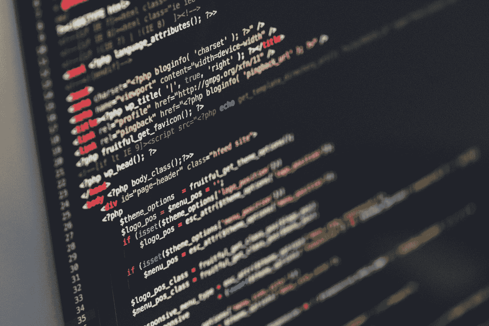

# 程序员应该阅读的 10 篇 Web 开发文章

> 原文：<https://medium.com/javarevisited/10-web-development-articles-programmer-should-read-this-week-485119a21884?source=collection_archive---------0----------------------->

伊利亚·巴甫洛夫在 [Unsplash](https://unsplash.com?utm_source=medium&utm_medium=referral) 上的照片

大家好，有人改天问我，你介意像你为 [Java](/javarevisited/10-articles-java-developers-should-read-this-week-7648edd18a22) 和[算法](/javarevisited/10-data-structure-and-algorithms-articles-programmer-should-read-this-week-585404a9403b)所做的那样，为 web 开发文章列出一个每周列表吗？嗯，我非常乐意考虑她的请求，因为我也喜欢阅读 Web 开发文章，所以对我来说，向你们推荐一些值得阅读的文章并不困难。

所以，我这里有几篇文章关注于[前端开发](https://dev.to/javinpaul/the-2019-web-development-frontend-backend-roadmap-4le2)、 [Javascript](http://www.java67.com/2019/01/top-10-javascript-frameworks-and-libraries-for-web-developers.html) 、 [Web 开发](https://javarevisited.blogspot.com/2018/01/top-10-udemy-courses-for-java-and-web-developers.html)，以及那些独角兽框架，如 [Angular](https://javarevisited.blogspot.com/2018/06/5-best-courses-to-learn-angular.html) 、 [React](https://hackernoon.com/the-2018-react-js-roadmap-4d0a43814c02) 和 Vue.js。

> 顺便说一句，这个列表并不是一个详尽的列表，我希望看到你们的一些行动。如果你有一篇关于网络开发的文章，不管是媒体内部的还是媒体外部的，请随时与我们分享。我很想读读它们。

不浪费你更多的时间，这里是我本周列出的 10 篇值得一读的关于 Web 开发的文章:

# 成为一个有效的角度开发者你需要学会的 19 件事

Aphinya Dechalert 是我上周的发现，不知何故，我无意中发现了这篇文章，并成为了她的粉丝。她是一个优秀的作家，她对 Angular、React 和 Web 开发的知识非常棒。

从角神到两个晚上学会反应 JS，在过去的几天里我读了很多她的故事，这是我最喜欢的一个。如果你正在使用 Angular 或者正在学习 Angular，这是你的必读文章。

如果你正在读这篇文章，让我告诉你，我真的很喜欢你的用户名@purplegreenlemon，到目前为止我只听说过 RGB，这是我的新用户名:-)

</better-programming/19-things-you-need-to-learn-to-become-an-effective-angular-developer-c0ccfa51222a>  

# 由 [javinpaul](https://medium.com/u/bb36d8439904?source=post_page-----485119a21884--------------------------------) 开发的网络开发者路线图

我对由 [Kamran Ahmed](https://medium.com/u/d4eb92ea1991?source=post_page-----485119a21884--------------------------------) 创作的著名的 web 开发者路线图的阐释，从去年开始已经激励了许多 Web 开发者。如果你正在深入学习 Web 开发，这是一个明确的指南。

</javarevisited/the-2019-web-developer-roadmap-ab89ac3c380e>  

我在这篇文章中也分享了很多有用的课程和链接，但是如果你必须选择一种资源来开始你的 Web 开发之旅，没有什么比 Udemy 上@ColtSteele 的 Web 开发人员 Bootcamp 在线课程更好的了。这是一个非常棒的资源，即使是现在我也一直在回顾这个课程。

<https://click.linksynergy.com/deeplink?id=JVFxdTr9V80&mid=39197&murl=https%3A%2F%2Fwww.udemy.com%2Fthe-web-developer-bootcamp%2F>  

而且，如果你不了解柯尔特的教学风格(不太可能)，你应该看看我的另一个最爱[Angela Yu](https://click.linksynergy.com/deeplink?id=JVFxdTr9V80&mid=39197&murl=https%3A%2F%2Fwww.udemy.com%2Fcourse%2Fthe-complete-web-development-bootcamp%2F)的完整 Web 开发训练营

<https://click.linksynergy.com/deeplink?id=JVFxdTr9V80&mid=39197&murl=https%3A%2F%2Fwww.udemy.com%2Fcourse%2Fthe-complete-web-development-bootcamp%2F>  

# 7 你应该知道的前端 JavaScript 趋势和工具

用一些最好的前端 JavaScript 趋势和工具为今年做准备会更好。在本文中， [Jonathan Saring](https://medium.com/u/c9a6ef212193?source=post_page-----485119a21884--------------------------------) 分享了其中的七个，比如组件级别的状态管理和将组件样式化为组合。绝对是一篇值得一读的文章。

<https://hackernoon.com/7-frontend-javascript-trends-and-tools-you-should-know-for-2020-fb1476e41083>  

# Angular 的第 8 版——更小的包、CLI APIs 和与生态系统的结合 [Stephen Fluin](https://medium.com/u/a1fba6cea10f?source=post_page-----485119a21884--------------------------------)

想知道 Angular 8 有什么新功能吗？阅读这篇文章，了解 Angular 8 的一些令人兴奋的新特性，如更小的捆绑器、CLI APIs 等。

<https://blog.angular.io/version-8-of-angular-smaller-bundles-cli-apis-and-alignment-with-the-ecosystem-af0261112a27>  

# Arfat Salman 通过示例深入理解 JavaScript Async 和 wait

到目前为止，你们中有多少人使用过 JavaScript 的 Async 和 Await？你们中的许多人是对的，但我敢打赌，读完这篇文章后，你一定会学到一些新东西。我确实学到了。不过，常见错误和陷阱部分是本文最精彩的部分。

<https://blog.bitsrc.io/understanding-javascript-async-and-await-with-examples-a010b03926ea>  

# javinpaul[为初学者提供的五大 GraphQL 课程](https://medium.com/u/bb36d8439904?source=post_page-----485119a21884--------------------------------)

我的另一篇关于[黑客的文章](https://medium.com/u/4a8a924edf41?source=post_page-----485119a21884--------------------------------)。GraphQL 真的成为了 Web 开发人员的重要工具，现在可能是学习 GraphQL 的好时机，否则就太晚了。本文包含了初学者和 web 开发人员学习 GraphQL 的一些最佳课程。

<https://hackernoon.com/top-5-graphql-courses-for-beginners-26cad52bcd3e>  

我已经分享了五门学习 GraphQL 的优秀课程，但如果你问我最喜欢的，那肯定是现代 GraphQL 训练营 (有 Node.js 和 Apollo)，不是别人，正是[安德鲁·米德](https://medium.com/u/bfcac06f983f?source=post_page-----485119a21884--------------------------------)，还记得他的 [Node JS 课程](https://click.linksynergy.com/deeplink?id=JVFxdTr9V80&mid=39197&murl=https%3A%2F%2Fwww.udemy.com%2Fthe-complete-nodejs-developer-course-2%2F)，Udemy 上的另一门史诗课程。

<https://click.linksynergy.com/deeplink?id=JVFxdTr9V80&mid=39197&murl=https%3A%2F%2Fwww.udemy.com%2Fgraphql-bootcamp%2F>  

# 你应该知道的 9 个 Web 组件 UI 库

另一篇乔纳森·萨林的文章，我开始喜欢他的内容了。寻找与框架无关的 web 组件？看看这篇文章，你会发现一些很棒的 UI 库，比如 **Material components web** 和 **Polymer elements** 。如果你在 [Web 开发的前端](https://dev.to/javinpaul/the-2019-web-development-frontend-backend-roadmap-4le2)这是一篇值得一读的文章。

<https://blog.bitsrc.io/9-web-component-ui-libraries-you-should-know-in-2019-9d4476c3f103>  

# 通过 [javinpaul](https://medium.com/u/bb36d8439904?source=post_page-----485119a21884--------------------------------) 为初学者学习 JavaScript 的 10 个网站

我的另一篇文章分享了一些在线学习 JavaScript 的精彩资源。由于 JavaScript 是 Web 开发的支柱，所以[学习 JavaScript](https://javarevisited.blogspot.com/2018/06/top-10-courses-to-learn-javascript-in.html) 并学好它是非常重要的。这些资源将帮助你实现这个目标。还包括一些优秀的免费资源。

<https://hackernoon.com/10-websites-to-learn-javascript-for-beginners-31e13bbdbb5c>  

顺便说一句，另一个有用的 JavaScript 资源是 [JavaScript 老师](https://medium.com/u/6727c1eb71f8?source=post_page-----485119a21884--------------------------------)免费的 [JavaScript 语法书](http://www.javascriptgrammar.com/?v=bio)，它很棒，我只希望我能早点知道它。他还免费提供，非常感谢[的 JavaScript 老师](https://medium.com/u/6727c1eb71f8?source=post_page-----485119a21884--------------------------------)的善意举动。

# 消瘦是因为过敏吗？由 [Aphinya Dechalert](https://medium.com/u/3ac3fb3f09e0?source=post_page-----485119a21884--------------------------------)

另一篇有目的的文章:-)嗯 [Aphinya Dechalert](https://medium.com/u/3ac3fb3f09e0?source=post_page-----485119a21884--------------------------------) 写了一些关于 Web 开发的精彩文章，这是我最喜欢的出版物之一 [ITNEXT](https://medium.com/u/5db23d2304f9?source=post_page-----485119a21884--------------------------------) 中的一篇。网络开发的未来会发生什么

<https://itnext.io/is-angular-dying-because-of-react-a8e885f09421>  

顺便说一句，如果你对 Angular 感兴趣，那么让我也推荐我最喜欢的学习 Angular 的在线课程，你可能已经猜到了，它是由我在 Udemy 上最喜欢的导师 Maximilian Schwarzmüller 编写的 [**Angular 原名 Angular 2)——完整指南**](https://click.linksynergy.com/deeplink?id=JVFxdTr9V80&mid=39197&murl=https%3A%2F%2Fwww.udemy.com%2Fthe-complete-guide-to-angular-2%2F) 。你可以看到它也更新了 Angular 8，这太棒了。

<https://click.linksynergy.com/deeplink?id=JVFxdTr9V80&mid=39197&murl=https%3A%2F%2Fwww.udemy.com%2Fthe-complete-guide-to-angular-2%2F>  

# TDD 改变了我的生活

这是一个改变了许多开发人员生活的原则，我强烈推荐给每一个编码人员。第一次看起来令人畏惧，但是随着你的学习和经验的增长，TDD 不仅会节省大量的时间，而且会产生更高质量的代码。这篇文章是一个很棒的故事，我强烈建议每一个编码者阅读它。

</javascript-scene/tdd-changed-my-life-5af0ce099f80>  

并且，如果你热爱 TDD 或者想了解更多关于它的知识。我也强烈推荐经典的[测试驱动](http://www.amazon.com/Test-Driven-Acceptance-Java-Developers/dp/1932394850?tag=javamysqlanta-20)书，我读过很多关于 TDD 和测试的书，但是没有人能接近这本书。真是太神奇了。

如果想购买，这里有链接: [**测试驱动:面向 Java 开发者的 TDD 和验收 TDD**](http://www.amazon.com/Test-Driven-Acceptance-Java-Developers/dp/1932394850?tag=javamysqlanta-20)

<https://www.amazon.com/Test-Driven-Acceptance-Java-Developers/dp/1932394850?tag=javamysqlanta-20>  

以上就是本周末值得一读的一些 Web 开发文章。读一读，享受你的周末。如果你有一篇文章，你认为我们应该阅读，请随意发表在评论中，我会看一看的。

> 正如我所说的，请随意分享您希望我阅读的 web 开发文章，我很乐意阅读您的选择。