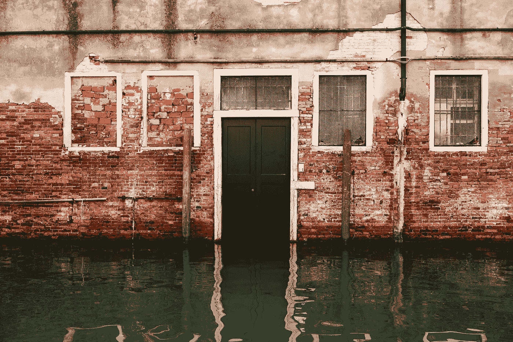

# 第 10 天—洪水填充

> 原文：<https://medium.com/javarevisited/100-days-challenge-to-cracking-the-coding-interview-6c3475fe889a?source=collection_archive---------1----------------------->

## **亚马逊 100 天**

[**100 天到亚马逊—**](https://leetcode.com/problems/flood-fill/) **第 10 天—洪水泛滥**

照片由[克里斯蒂娜·戈塔迪](https://unsplash.com/@cristina_gottardi?utm_source=unsplash&utm_medium=referral&utm_content=creditCopyText)在 [Unsplash](https://unsplash.com/s/photos/flood?utm_source=unsplash&utm_medium=referral&utm_content=creditCopyText) 上拍摄

出免费故事？下面是我的 [**好友链接。**](/@akshay_ravindran/100-days-challenge-to-cracking-the-coding-interview-6c3475fe889a?source=friends_link&sk=be4b8cd421dfbdd22b79270144df9fb8)

# 介绍

嘿伙计们，今天是我接受挑战的第 10 天。在接下来的 100 天里，我每天都要解决在**之前的采访中被问到的**编程问题**。**