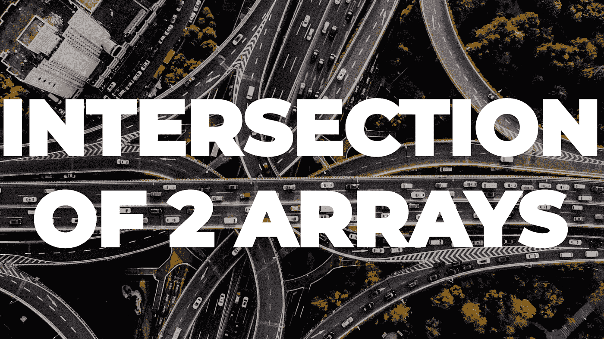

# 破解编码面试的 100 天挑战

> 原文：<https://medium.com/javarevisited/100-days-challenge-to-cracking-the-coding-interview-c93cdbfd1da8?source=collection_archive---------1----------------------->

## 第 20 天—两个阵列的交集

[**100 天到亚马逊—**](https://leetcode.com/problems/intersection-of-two-arrays/description/) **第 20 天**

照片由 [Denys Nevozhai](https://unsplash.com/@dnevozhai?utm_source=unsplash&utm_medium=referral&utm_content=creditCopyText) 在 [Unsplash](https://unsplash.com/s/photos/intersection?utm_source=unsplash&utm_medium=referral&utm_content=creditCopyText) 上拍摄

# 介绍

嘿伙计们，今天是我挑战的第 20 天。其中我将在 100 天内每天解决 [**编程问题**](/javarevisited/top-21-string-programming-interview-questions-for-beginners-and-experienced-developers-56037048de45) ，这些问题在**之前的面试中已经被问过。**