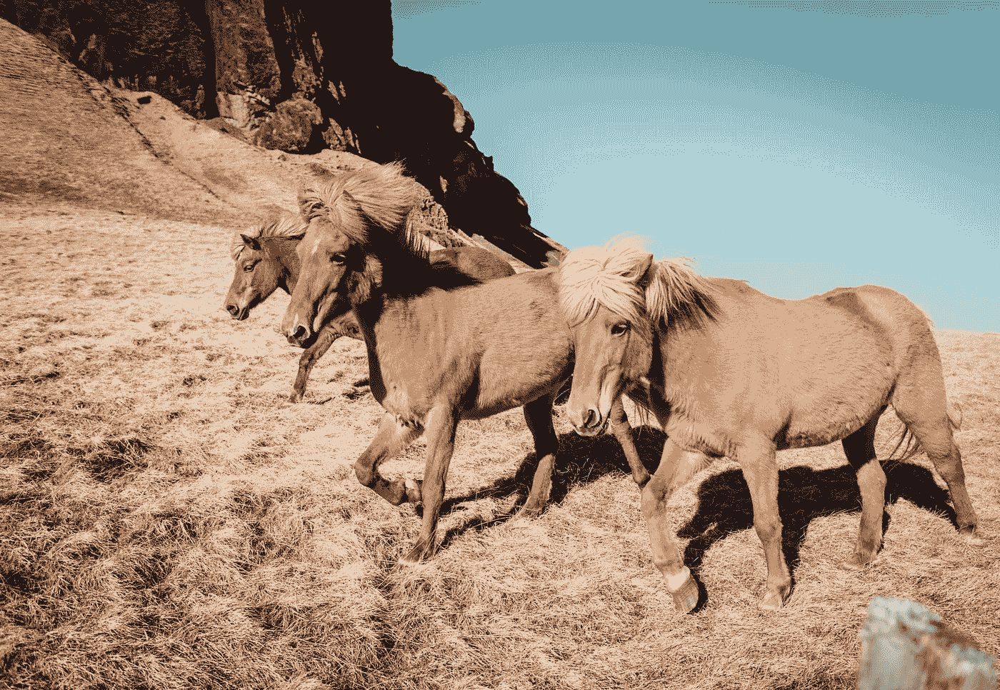

# 亚马逊 100 天

> 原文：<https://medium.com/javarevisited/100-days-to-amazon-day-1-b9e07228f079?source=collection_archive---------0----------------------->

## 第一天

## 独特的三胞胎

[通过](http://Photo by Alice Donovan Rouse on Unsplash)

伙计们，从今天开始。我挑战自己在 100 天内每天解决 **1 个问题**。用完你的免费故事这里是我的 [**好友链接。**](/@akshay_ravindran/100-days-to-amazon-day-1-b9e07228f079?source=friends_link&sk=14fb5685bfd54caf84436034cbe9e11c)

我将这个系列命名为**亚马逊 100 天。**

> 这些问题都摘自下面的 [**电子书**](https://www.amazon.com/dp/B081969QH5/ref=cm_sw_r_cp_apa_i_wqVZDbCVY8RV6?tag=javamysqlanta-20) **。🎓**