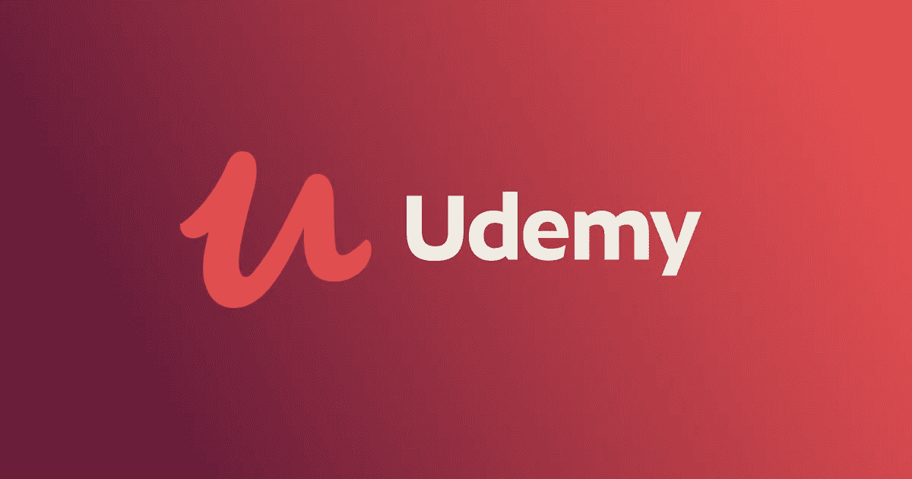

# 2023 年面向程序员和开发人员的 20 大免费 Udemy 课程——最好的

> 原文：<https://medium.com/javarevisited/100-free-programming-and-web-development-courses-on-udemy-free-resource-center-3f8415eb5e6f?source=collection_archive---------0----------------------->

## 20 个最好的免费 Udemy 课程学习 HTML、CSS、JavaScript、React、Angular、Node.js 成为 2023 年的 Web 开发者

大家好，继[**plural sight**](https://pluralsight.pxf.io/c/1193463/424552/7490?u=https%3A%2F%2Fwww.pluralsight.com%2Flearn)**免费制作了他们的 [7000+专家指导的在线课程](/javarevisited/top-10-pluralsight-courses-to-learn-programming-and-software-development-during-covid-19-stay-at-30b7d8a4f88f)一个月后，现在 Udemy 推出了“[**【Udemy 免费资源中心”**](https://click.linksynergy.com/deeplink?id=JVFxdTr9V80&mid=39197&murl=https%3A%2F%2Fwww.udemy.com%2Fcourses%2Ffree%2F) 在这里你可以找到 Udemy 最好的免费内容，这些内容来自他们最好的导师。**

**由于现在每个人都在帮助人们在线学习，Udemy 也意识到这是提供帮助的时候了，这就是为什么他们推出了 Udemy 免费资源中心，从他们的学习市场收集免费课程。**

**而且，如果你渴望在 2023 年成为一名 web 开发人员，并且正在寻找一门涵盖大多数这些框架和库的课程，那么我强烈推荐你在 Udemy 上查看由 Angela Yu 教授的完整的 2024 年 Web 开发人员训练营课程。这是成为一名网站开发人员的最新和最有吸引力的在线课程。**

** [## 完整的 2023 年网络开发训练营

### 欢迎来到完整的 Web 开发训练营，这是您学习编码并成为全栈 web…

udemy.com](https://click.linksynergy.com/deeplink?id=JVFxdTr9V80&mid=39197&murl=https%3A%2F%2Fwww.udemy.com%2Fcourse%2Fthe-complete-web-development-bootcamp%2F)** 

# **什么是 Udemy 免费资源中心？**

**Udemy 资源中心是一个地方，在这里你可以找到 Udemy 最好的免费内容，这些内容来自他们最好的导师。**

**如果你很好奇 Udemy 免费资源中心有哪些课程，就去那里自己看看吧，**

> **以下是加入的链接: [**Udemy 免费资源中心**](https://click.linksynergy.com/deeplink?id=JVFxdTr9V80&mid=39197&murl=https%3A%2F%2Fwww.udemy.com%2Fcourses%2Ffree%2F)**

****

# **Udemy 的 20 多门免费网络开发课程**

**他们开设了许多免费课程，包括编程、开发、AWS、认证、web 开发、摄影等等。如果你需要一份助理牧师的名单，这里有一些我最喜欢的 Udemy 的免费课程**

## **1. [HTML5 和 CSS3 基础知识](https://click.linksynergy.com/deeplink?id=JVFxdTr9V80&mid=39197&murl=https%3A%2F%2Fwww.udemy.com%2Fcourse%2Fhtml5-fundamentals-for-beginners%2F)**

**使用 HTML5 和 CSS3，用 HTML5 从头开始构建你自己的网站——专为完全的初学者设计**

** [## 免费 CSS 教程- HTML5 和 CSS3 基础

### 在技术领域，保持领先总是一项挑战。在去年的一个方面…

udemy.com](https://click.linksynergy.com/deeplink?id=JVFxdTr9V80&mid=39197&murl=https%3A%2F%2Fwww.udemy.com%2Fcourse%2Fhtml5-fundamentals-for-beginners%2F)** 

## **[2。了解亚马逊网络服务(AWS):完整介绍](https://click.linksynergy.com/deeplink?id=JVFxdTr9V80&mid=39197&murl=https%3A%2F%2Fwww.udemy.com%2Fcourse%2Flearn-amazon-web-services-the-complete-introduction%2F)**

**从 AWS 开始您的旅程，亲自动手，涵盖目前可用的每一项 AWS 服务**

** [## 免费亚马逊 AWS 教程-亚马逊 AWS 教程:学习亚马逊 Web 服务(AWS)

### LevelUpCloud 为所有云计算平台提供领先的在线培训。亚马逊网络服务，谷歌云…

udemy.com](https://click.linksynergy.com/deeplink?id=JVFxdTr9V80&mid=39197&murl=https%3A%2F%2Fwww.udemy.com%2Fcourse%2Flearn-amazon-web-services-the-complete-introduction%2F)** 

## **3.[编程 101](https://click.linksynergy.com/deeplink?id=JVFxdTr9V80&mid=39197&murl=https%3A%2F%2Fwww.udemy.com%2Fcourse%2Fprogramming-101%2F)**

**理解硬件、网络、编程和许可的基础知识。**

** [## 免费编程基础教程-编程 101

### 大多数人不知道他们的设备如何处理二进制和数据，从他们的洗衣机到他们的智能…

udemy.com](https://click.linksynergy.com/deeplink?id=JVFxdTr9V80&mid=39197&murl=https%3A%2F%2Fwww.udemy.com%2Fcourse%2Fprogramming-101%2F)** 

## ****4。**[**Angular 2+**](https://click.linksynergy.com/deeplink?id=JVFxdTr9V80&mid=39197&murl=https%3A%2F%2Fwww.udemy.com%2Fcourse%2Fgetting-started-with-angular-2%2F)**作者:Ryan Chenkie****

**了解如何构建您的第一个 Angular 2+应用程序！**

** [## 免费角度教程-Angular 2+入门

### 您将学习如何使用 Angular 的一些最常见的特性，包括组件、指令、表单、HTTP…

udemy.com](https://click.linksynergy.com/deeplink?id=JVFxdTr9V80&mid=39197&murl=https%3A%2F%2Fwww.udemy.com%2Fcourse%2Fgetting-started-with-angular-2%2F)** 

## **5. [Git & GitHub 速成班:从头创建一个资源库！](https://click.linksynergy.com/deeplink?id=JVFxdTr9V80&mid=39197&murl=https%3A%2F%2Fwww.udemy.com%2Fcourse%2Fgit-and-github-crash-course-creating-a-repository-from-scratch%2F)**

**了解如何在不到 30 分钟的时间内创建 Git 存储库、克隆它、进行更改并将更改提交给 GitHub。**

** [## 免费 Git 教程- Git & GitHub 速成班:从头创建一个存储库！

### 他是一名专业的网站开发人员，自 1999 年以来一直在开发网站并与初创公司合作。他也有一个…

udemy.com](https://click.linksynergy.com/deeplink?id=JVFxdTr9V80&mid=39197&murl=https%3A%2F%2Fwww.udemy.com%2Fcourse%2Fgit-and-github-crash-course-creating-a-repository-from-scratch%2F)** 

## **[6。火花启动器套件](https://click.linksynergy.com/deeplink?id=JVFxdTr9V80&mid=39197&murl=https%3A%2F%2Fwww.udemy.com%2Fcourse%2Fsparkstarterkit%2F)**

**而不是另一个“火花是什么？”当然！深入探索 Spark，在 Spark 中获得强大的基础。**

** [## 免费 Apache Spark 教程- Spark 初学者工具包

### 当我们的学生要求我们创建一个关于 Spark 的课程时，我们查看了市场上其他与 Spark 相关的课程，并且…

udemy.com](https://click.linksynergy.com/deeplink?id=JVFxdTr9V80&mid=39197&murl=https%3A%2F%2Fwww.udemy.com%2Fcourse%2Fsparkstarterkit%2F)** 

## **[7。亚马逊网络服务(AWS)——从零到英雄](https://click.linksynergy.com/deeplink?id=JVFxdTr9V80&mid=39197&murl=https%3A%2F%2Fwww.udemy.com%2Fcourse%2Famazon-web-services-aws-v%2F)**

**新手，零到英雄。AWS EC2 网络服务器、NodeJS 服务器、AWS RDS 数据库服务器、S3、SES & CloudWatch。自由的**

** [## 免费亚马逊 AWS 教程-亚马逊网络服务(AWS) -零到英雄

### 自 2014 年以来，提供由 AWS 专业级认证讲师讲授的加速学习计划。独一无二的…

udemy.com](https://click.linksynergy.com/deeplink?id=JVFxdTr9V80&mid=39197&murl=https%3A%2F%2Fwww.udemy.com%2Fcourse%2Famazon-web-services-aws-v%2F)** 

## **[8。Linux 教程和项目(免费)](https://click.linksynergy.com/deeplink?id=JVFxdTr9V80&mid=39197&murl=https%3A%2F%2Fwww.udemy.com%2Fcourse%2Flinux-tutorials%2F)**

**免费教程包括负载平衡，MySQL 复制，SSL 证书管理等。**

** [## 免费 Linux 教程- Linux 教程和项目(免费)

### Jason 于 1999 年开始了他的 Unix 和 Linux 系统工程师生涯。从那时起，他开始利用他的 Linux 技能…

udemy.com](https://click.linksynergy.com/deeplink?id=JVFxdTr9V80&mid=39197&murl=https%3A%2F%2Fwww.udemy.com%2Fcourse%2Flinux-tutorials%2F)** 

## **[9。CSS Flexbox —掌握基础知识](https://click.linksynergy.com/deeplink?id=JVFxdTr9V80&mid=39197&murl=https%3A%2F%2Fwww.udemy.com%2Fcourse%2Fcss-flexbox-mastering-the-basics%2F)**

**初学者的绝佳课程。完整，解释清楚，组织良好，流程完美。强烈推荐这门课。**

** [## 免费 CSS Flexbox 教程-掌握基础知识

### 我热衷于帮助他人学习和改善他们的生活。目标是用…解释复杂的概念

udemy.com](https://click.linksynergy.com/deeplink?id=JVFxdTr9V80&mid=39197&murl=https%3A%2F%2Fwww.udemy.com%2Fcourse%2Fcss-flexbox-mastering-the-basics%2F)** 

## **10.[由](https://click.linksynergy.com/deeplink?id=JVFxdTr9V80&mid=39197&murl=https%3A%2F%2Fwww.udemy.com%2Fcourse%2Fbuild-a-quiz-app-with-html-css-and-javascript%2F)[詹姆斯·奎克](https://medium.com/u/11d2e4d97536?source=post_page-----3f8415eb5e6f--------------------------------)用 HTML、CSS 和 JavaScript 构建一个测验应用**

**通过使用 HTML、CSS 和 JavaScript 构建测验应用程序来提高您的核心开发技能**

** [## 免费的 Web 开发教程——用 HTML、CSS 和 JavaScript 构建一个测验应用程序

### James 对 Web 开发、工具和设计有着真正的热情。他关注最新的博客，在社区演讲…

udemy.com](https://click.linksynergy.com/deeplink?id=JVFxdTr9V80&mid=39197&murl=https%3A%2F%2Fwww.udemy.com%2Fcourse%2Fbuild-a-quiz-app-with-html-css-and-javascript%2F)** 

## ****11。** [**为创业者编程— JavaScript**](https://click.linksynergy.com/deeplink?id=JVFxdTr9V80&mid=39197&murl=https%3A%2F%2Fwww.udemy.com%2Fcourse%2Fprogramming-for-entrepreneurs-javascript%2F)**

**从头开始学习 JavaScript，并开始那个网站/应用程序/游戏项目！**

** [## 免费 JavaScript 教程-企业家编程- JavaScript

### ZENVA 的认证游戏开发者和创始人-世界领先的学习游戏制作、VR、机器学习的平台…

udemy.com](https://click.linksynergy.com/deeplink?id=JVFxdTr9V80&mid=39197&murl=https%3A%2F%2Fwww.udemy.com%2Fcourse%2Fprogramming-for-entrepreneurs-javascript%2F)** 

## **12. [JSP (Java 服务器页面)和 servlet 基础知识](https://click.linksynergy.com/deeplink?id=JVFxdTr9V80&mid=39197&murl=https%3A%2F%2Fwww.udemy.com%2Fcourse%2Fjsp-servlet-free%2F)**

**面向初学者的 JSP (Java 服务器页面)和 servlet 基础课程**

** [## 免费 JSP 教程- JSP (Java 服务器页面)和 servlet 基础

### Chaand 是一个知识渊博的人，对帮助世界各地的学生有浓厚的兴趣。他是学习易的负责人…

udemy.com](https://click.linksynergy.com/deeplink?id=JVFxdTr9V80&mid=39197&murl=https%3A%2F%2Fwww.udemy.com%2Fcourse%2Fjsp-servlet-free%2F)** 

## **13.[远程工作；高效且有效](https://click.linksynergy.com/deeplink?id=JVFxdTr9V80&mid=39197&murl=https%3A%2F%2Fwww.udemy.com%2Fcourse%2Fworking-remotely-efficiently-and-effectively%2F)**

**在办公室之外生存和发展，可能是现在最重要的课程。**

** [## 免费远程办公教程-远程工作:高效和有效

### 摘要:活跃的 SAP 软件顾问，在中小型企业领域与 SAP Business One 合作。发展业务…

udemy.com](https://click.linksynergy.com/deeplink?id=JVFxdTr9V80&mid=39197&murl=https%3A%2F%2Fwww.udemy.com%2Fcourse%2Fworking-remotely-efficiently-and-effectively%2F)** 

## **14 . [AWS VPC 公交网关—实践学习！](https://click.linksynergy.com/deeplink?id=JVFxdTr9V80&mid=39197&murl=https%3A%2F%2Fwww.udemy.com%2Fcourse%2Faws-vpc-transit-gateway%2F)**

**通过实施 3 个实际场景，实际学习 AWS VPC 公交网关**

** [## 免费虚拟私有云教程- AWS VPC 中转网关-动手学习！

### 欢迎来到 AWS VPC 交通网关的这个神奇的课程。我们将通过实际实施 AWS VPC 公交系统来学习…

udemy.com](https://click.linksynergy.com/deeplink?id=JVFxdTr9V80&mid=39197&murl=https%3A%2F%2Fwww.udemy.com%2Fcourse%2Faws-vpc-transit-gateway%2F)** 

## **[17。EMMET 更快的 HTML & CSS 工作流——开发者的最佳工具](https://click.linksynergy.com/deeplink?id=JVFxdTr9V80&mid=39197&murl=https%3A%2F%2Fwww.udemy.com%2Fcourse%2Femmet-start-coding-html-and-css-fast-and-easy%2F)**

**Emmet 是一个文本编辑器插件，可以帮助你更快地编写 HTML 和 CSS。工作更快，节省时间，赚更多的钱。**

** [## 免费 Emmet 教程- EMMET 更快的 HTML & CSS 工作流程-开发者的最佳工具

### 他是在计算机科学方面有经验的专业人士；此外，在软件，网络开发…

udemy.com](https://click.linksynergy.com/deeplink?id=JVFxdTr9V80&mid=39197&murl=https%3A%2F%2Fwww.udemy.com%2Fcourse%2Femmet-start-coding-html-and-css-fast-and-easy%2F)** 

## **18。引导程序 4 中的代码 a“即将推出”登录页面**

**使用 bootstrap 4 中的倒计时时钟构建您的“正在建设中”或“即将推出”的登录页面**

** [## 免费的引导程序教程-在引导程序 4 中编写一个“即将推出”的登录页面

### 了解构建功能齐全的专业登录页面所需的基本概念、工具和功能…

udemy.com](https://click.linksynergy.com/deeplink?id=JVFxdTr9V80&mid=39197&murl=https%3A%2F%2Fwww.udemy.com%2Fcourse%2Fcode-a-coming-soon-landing-page-in-bootstrap-4%2F)** 

## **[19。使用 Etherem](https://click.linksynergy.com/deeplink?id=JVFxdTr9V80&mid=39197&murl=https%3A%2F%2Fwww.udemy.com%2Fcourse%2Fyour-first-decentralized-app%2F) 构建和部署您的首个分散式应用**

**了解如何创建智能合同并通过 Web3 用户界面与它们进行交互！**

** [## 免费区块链教程-使用以太坊构建和部署您的第一个去中心化应用

### Gary Simon 是一名专业的自由职业图形和网页设计师，拥有十多年的工作经验。服过……

udemy.com](https://click.linksynergy.com/deeplink?id=JVFxdTr9V80&mid=39197&murl=https%3A%2F%2Fwww.udemy.com%2Fcourse%2Fyour-first-decentralized-app%2F)** 

## **[20。角度认证—掌握基础知识](https://click.linksynergy.com/deeplink?id=JVFxdTr9V80&mid=39197&murl=https%3A%2F%2Fwww.udemy.com%2Fcourse%2Fangular-authentication-tutorial-mastering-the-basics%2F)**

**对基本概念的清晰解释使用了一个非常基本的例子，这样你就可以理解每一步都发生了什么**

**建议了解基本的后端、前端授权**

** [## 免费角度教程-角度认证-掌握基础知识

### 了解使用 JWT 验证角度应用所需的基本概念。内容和概述…

click.linksynergy.com](https://click.linksynergy.com/deeplink?id=JVFxdTr9V80&mid=39197&murl=https%3A%2F%2Fwww.udemy.com%2Fcourse%2Fangular-authentication-tutorial-mastering-the-basics%2F) 

好了，伙计们，请在我的免费资源中心享受这些课程吧。你在家里，可以充分利用这些免费资源。我知道这并不容易，但保持积极和学习的心态意味着减少压力，这对你的免疫系统有好处。

祝你的学习黑客马拉松一切顺利，保持安全、积极和健康。

并且，如果你需要更多的免费课程学习，可以在 [**Pluralsight**](https://pluralsight.pxf.io/c/1193463/424552/7490?u=https%3A%2F%2Fwww.pluralsight.com%2Flearn) 上查看 7000+免费课程:

 [## 个人技术技能|多视角

### 培养你在职业生涯中更快发展所需的技术技能。掌握最新的技术与数以千计的…

pluralsight.pxf.io](https://pluralsight.pxf.io/c/1193463/424552/7490?u=https%3A%2F%2Fwww.pluralsight.com%2Flearn)  [## 7000 多门免费的 Pluralsight 课程，让您足不出户就能掌握所需的技术技能

### 不需要信用卡。没有手表限制。和一份精选的课程清单

medium.com](/javarevisited/7000-free-pluralsight-courses-to-build-in-demand-tech-skills-without-leaving-your-house-40edb50a8cf2) 

此外，如果你渴望在 2023 年成为软件开发人员、程序员或 web 开发人员，并且正在寻找一门涵盖大多数这些框架和库的课程，那么我强烈建议你在 Udemy 上查看由 Angela Yu 教授的完整的 2023 年 Web 开发人员训练营 课程。这是成为一名网站开发人员的最新和最有吸引力的在线课程。

 [## 完整的 2023 年网络开发训练营

### 欢迎来到完整的 Web 开发训练营，这是您学习编码并成为全栈 web…

udemy.com](https://click.linksynergy.com/deeplink?id=JVFxdTr9V80&mid=39197&murl=https%3A%2F%2Fwww.udemy.com%2Fcourse%2Fthe-complete-web-development-bootcamp%2F)**