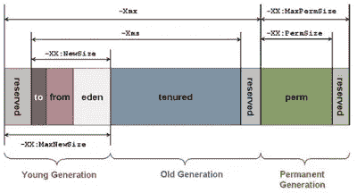
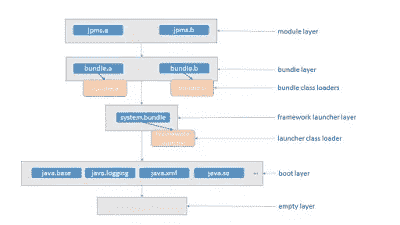
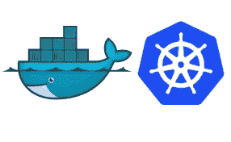
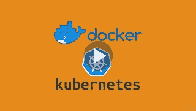
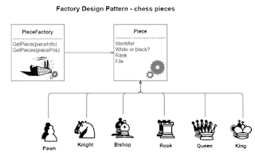
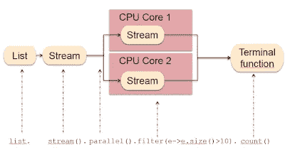

# 2023 年面向有经验的 Java 程序员的 11 门最佳核心 Java 在线课程

> 原文：<https://medium.com/javarevisited/11-advanced-core-java-online-courses-to-join-in-2021-46011661257a?source=collection_archive---------0----------------------->

## 这些是核心 java 开发人员学习多线程、集合、JVM、性能、模块、设计模式、流 API 等技能以及 Docker 和 Kubernetes 等工具的最佳在线课程。

image_credit — [Java 应用性能和内存管理](https://click.linksynergy.com/deeplink?id=JVFxdTr9V80&mid=39197&murl=https%3A%2F%2Fwww.udemy.com%2Fcourse%2Fjava-application-performance-and-memory-management%2F)

大家好，过去我已经为初级核心 Java 开发人员分享了许多[书籍](/javarevisited/5-best-core-java-books-for-beginners-20e3f723e3a)和[课程](/javarevisited/top-5-java-online-courses-for-beginners-best-of-lot-1e1e240a758)，但是我的许多读者已经向我询问高级 Java 课程，以改进诸如 [Java 集合](/javarevisited/7-best-java-collections-and-stream-api-courses-for-beginners-in-2020-3ad18d52c38)、 [Stream AP](/javarevisited/8-best-lambdas-stream-and-functional-programming-courses-for-java-developers-3d1836a97a1d) I、[设计模式](/javarevisited/7-best-online-courses-to-learn-object-oriented-design-pattern-in-java-749b6399af59)、[并发性](/javarevisited/8-best-multithreading-and-concurrency-courses-for-experienced-java-developers-8acfd3b25094)、 [Java 性能](/javarevisited/7-best-courses-to-learn-jvm-garbage-collection-and-performance-tuning-for-experienced-java-331705180686)、泛型、垃圾收集以及最近 Java 版本中引入的新特性，如 Java 模块系统。

如果你也有这个问题，并且正在寻找一些很好的课程来深入学习核心 Java，那么请继续阅读。

在这篇文章中，我将为有经验的程序员分享一些**高级核心 Java 课程。这些是你要真正掌握像[多线程](https://javarevisited.blogspot.com/2018/06/top-5-java-multithreading-and-concurrency-courses-experienced-programmers.html)、[集合](/javarevisited/7-best-java-collections-and-stream-api-courses-for-beginners-in-2020-3ad18d52c38)、 [JVM 内部](https://javarevisited.blogspot.com/2019/04/top-5-courses-to-learn-jvm-internals.html)、[工具](https://javarevisited.blogspot.com/2017/03/10-tools-used-by-java-programming-Developers.html)、[库](https://javarevisited.blogspot.com/2018/01/top-20-libraries-and-apis-for-java-programmers.html)这样的 Java 编程概念，成为每个公司都想聘请的 Java 专家，尤其是大投行。

同样，如果你的目标是在 JP 摩根、花旗银行、巴克莱资本、摩根士丹利等银行找到工作，那么这些在线课程可以为你提供坚实的基础知识，并让你深入了解在这些公司找到工作所需的核心 Java。正如我在标题中所说的，这门课程是为中级和有经验的 Java 开发人员开设的，也就是说，有些人懂得 Java 的基础知识，有时也从事 Java 工作。即使你已经为 Java 工作了半年到一年，你也可以从这些课程中受益，让你的 Java 技能更上一层楼。

如果你是 Java 新手，那么最好从 Udemy 上的 Tim Buchalaka 的 [**完整 Java 大师班**](https://click.linksynergy.com/deeplink?id=JVFxdTr9V80&mid=39197&murl=https%3A%2F%2Fwww.udemy.com%2Fcourse%2Fjava-the-complete-java-developer-course%2F) 这样的综合 Java 课程开始，而不是加入这些高级课程。这将以更加结构化的方式为您提供 Java 开发人员需要了解的所有基础知识。**

<https://click.linksynergy.com/deeplink?id=JVFxdTr9V80&mid=39197&murl=https%3A%2F%2Fwww.udemy.com%2Fcourse%2Fjava-the-complete-java-developer-course%2F>  

# 深入学习核心 Java 的 10 门最佳课程

不浪费你更多的时间，这里是我为有经验的程序员列出的一些最好的核心 Java 课程。

## 1. [Java 多线程、并发和性能优化](https://click.linksynergy.com/deeplink?id=JVFxdTr9V80&mid=39197&murl=https%3A%2F%2Fwww.udemy.com%2Fcourse%2Fjava-multithreading-concurrency-performance-optimization%2F)

多线程和并发性是 Java 开发人员最需要的技能之一。对很好理解多线程和并发的 Java 开发人员要求很高，但同时，这也是很难掌握的课题之一。

如果你想让你的并发技能更上一层楼，想成为 Java 中多线程、并发和并行编程的专家，特别强调高性能，那么我向你强烈推荐这门课程。

我把它放在第一位是有原因的，因为这可能是这个列表中最重要的课程，强烈推荐每个 Java 开发人员都去学习它。

**这里是加入本课程的链接** — [Java 多线程、并发和性能优化](https://click.linksynergy.com/deeplink?id=JVFxdTr9V80&mid=39197&murl=https%3A%2F%2Fwww.udemy.com%2Fcourse%2Fjava-multithreading-concurrency-performance-optimization%2F)

## 2. [Java 应用性能和内存管理](https://click.linksynergy.com/deeplink?id=JVFxdTr9V80&mid=39197&murl=https%3A%2F%2Fwww.udemy.com%2Fcourse%2Fjava-application-performance-and-memory-management%2F)

内存管理和应用程序性能故障排除是另一个让许多 Java 开发人员头疼的话题。

虽然 Java 在内存管理方面要简单得多，尤其是与 c++(T13)这样的语言相比，但是作为一名 Java 程序员，您需要了解一些 JVM 的知识。这是一门很棒的课程，学习如何调优 JVM 并做出好的编码选择，以确保您的应用程序以最佳方式运行。如果您想编写高性能 Java 应用程序，或者您的工作涉及到改进遗留应用程序的性能，那么本课程适合您。

**以下是加入本课程的链接-** [Java 应用性能和内存管理](https://click.linksynergy.com/deeplink?id=JVFxdTr9V80&mid=39197&murl=https%3A%2F%2Fwww.udemy.com%2Fcourse%2Fjava-application-performance-and-memory-management%2F)

## 3. [Java 内存管理](https://click.linksynergy.com/deeplink?id=JVFxdTr9V80&mid=39197&murl=https%3A%2F%2Fwww.udemy.com%2Fcourse%2Fjava-memory-management%2F)

这是另一个关于 JVM 内存管理的课程，如果你在第二个课程中无法与讲师取得联系，可以查看这个课程。

这也涵盖了 Java 专业人员需要了解的关于[内存](/javarevisited/5-best-advanced-java-performance-and-memory-management-courses-for-experienced-programmers-f7b2e07be5ca)，垃圾收集，调优 VM，以及避免 Java 内存泄漏的所有事情。

也很实惠，在 Udemy 闪购上只需 10 美元就能买到，每月都有。

**这里是加入这个 JVM 课程** — [Java 内存管理](https://click.linksynergy.com/deeplink?id=JVFxdTr9V80&mid=39197&murl=https%3A%2F%2Fwww.udemy.com%2Fcourse%2Fjava-memory-management%2F)的链接

## 4. [Java 9 模块化:Sander Mak 的初看](https://pluralsight.pxf.io/c/1193463/424552/7490?u=https%3A%2F%2Fwww.pluralsight.com%2Fcourses%2Fjava-9-modularity-first-look)

我仍然需要掌握的一个主题是 Java 模块系统，这也是我开始关注这门课程的原因。

虽然 Java 模块系统不像每个 Java 开发人员都需要了解的 Java 集合，但我认为您至少应该了解基于模块的 Java 应用程序的基础知识。

本课程很好地概述了 [Java 模块系统](https://www.oracle.com/corporate/features/understanding-java-9-modules.html)。您将了解基本的模块化概念，如封装和显式模块依赖，以及如何将现有代码移植到 Java 9。

**以下是加入本模块课程的链接** — [Java 9 模块化:初看作者 Sander Mak](https://pluralsight.pxf.io/c/1193463/424552/7490?u=https%3A%2F%2Fwww.pluralsight.com%2Fcourses%2Fjava-9-modularity-first-look)

## 5.[在 Java 8 中使用 Lambda 表达式从集合到流](https://pluralsight.pxf.io/c/1193463/424552/7490?u=https%3A%2F%2Fwww.pluralsight.com%2Fcourses%2Fjava-8-lambda-expressions-collections-streams)

Java 8 带来了许多新的模式和特性来构建高效和干净的 Java 应用程序，但毫无疑问 Lambda 表达式和流是最重要的，本课程将重点介绍它们。

本课程将通过介绍[映射](https://www.java67.com/2015/01/java-8-map-function-examples.html)、[平面映射](http://www.java67.com/2016/03/how-to-use-flatmap-in-java-8-stream.html)、[过滤](https://javarevisited.blogspot.com/2018/05/java-8-filter-map-collect-stream-example.html)、[归约](http://www.java67.com/2016/09/map-reduce-example-java8.html)等概念以及其他流 API 方法，教你如何用 Java 编写函数代码。

如果你真的想通过 Stream API 掌握使用 Java 集合的新方法，那么我向你强烈推荐这门课程。如果你不知道，你可以在今年四月免费学习这门课程，因为 Pluralsight 已经将他们所有的课程免费提供了一个月。

**这里是加入本模块课程** — [使用 Lambda 表达式在 Java 8 中从集合到流](https://pluralsight.pxf.io/c/1193463/424552/7490?u=https%3A%2F%2Fwww.pluralsight.com%2Fcourses%2Fjava-8-lambda-expressions-collections-streams)的链接

顺便说一下，你需要一个 Pluralsight 会员才能参加这个课程，费用大约是每月 29 美元或每年 299 美元(14%的折扣)。我向所有程序员强烈推荐这个订阅，因为它提供了超过 7000 个在线课程的即时访问，以学习任何技术技能。或者，你也可以使用他们的 [**10 天免费通行证**](https://pluralsight.pxf.io/c/1193463/424552/7490?u=https%3A%2F%2Fwww.pluralsight.com%2Flearn) 免费观看本课程。

<https://pluralsight.pxf.io/c/1193463/424552/7490?u=https%3A%2F%2Fwww.pluralsight.com%2Flearn>  

## 6.面向 Java 开发者的 Docker

码头工人拥有技能的时代已经一去不复返了；这是所有 Java 开发人员的必备技能，更像 Git，每个人都希望你知道。

这是有原因的，因为 [Docker](https://javarevisited.blogspot.com/2019/05/top-5-courses-to-learn-docker-and-kubernetes-for-devops.html) 确实让开发和部署过程变得更加容易。你现在不需要构建你的服务器，安装所有不同版本的软件来制作你的 Java 应用程序，因为 [Docker](/javarevisited/top-15-online-courses-to-learn-docker-kubernetes-and-aws-for-fullstack-developers-and-devops-d8cc4f16e773) 将所有这些东西抽象出来，给你提供一个你可以在任何地方部署的容器。

容器拥有你的应用程序执行自身所需的一切，包括[操作系统](/javarevisited/6-best-operating-system-courses-for-beginners-to-learn-7d727882d267)。如果你想学 Docker，你也应该学，那么这是 Java 开发者最好的课程。

**以下是加入本模块课程** — [面向 Java 开发人员的 Docker](https://click.linksynergy.com/deeplink?id=JVFxdTr9V80&mid=39197&murl=https%3A%2F%2Fwww.udemy.com%2Fcourse%2Fdocker-for-java-developers%2F)的链接

## 7.[Google Cloud 上面向 Java 开发者的 Kubernetes](https://click.linksynergy.com/deeplink?id=JVFxdTr9V80&mid=39197&murl=https%3A%2F%2Fwww.udemy.com%2Fcourse%2Fkubernetes-crash-course-for-java-developers%2F)

当我们谈论 Docker 时，我们也谈论 Kubernetes，因为没有人在云或生产环境上手动部署容器。通常，像 Kubernetes 这样的容器管理工具被用来部署 Java 应用程序。Kubernetes 不仅负责部署，还负责根据负载增加和减少容器实例。

如果你正在学习 Docker，那么我也建议你熟悉 Kubernetes，这是一个学习谷歌 Kubernetes 引擎上的 [Kubernetes](https://dev.to/javinpaul/top-10-courses-to-learn-docker-and-kubernetes-for-programmers-4lg0) 、 [Docker](/javarevisited/top-15-online-courses-to-learn-docker-kubernetes-and-aws-for-fullstack-developers-and-devops-d8cc4f16e773) 和 [Java Spring Boot](https://javarevisited.blogspot.com/2018/02/top-5-spring-microservices-courses-with-spring-boot-and-spring-cloud.html) 微服务的好课程

**这是加入本模块课程的链接**——[Google Cloud 上面向 Java 开发人员的 Kubernetes】](https://click.linksynergy.com/deeplink?id=JVFxdTr9V80&mid=39197&murl=https%3A%2F%2Fwww.udemy.com%2Fcourse%2Fkubernetes-crash-course-for-java-developers%2F)

## 8.[Java 中的设计模式](https://click.linksynergy.com/deeplink?id=JVFxdTr9V80&mid=39197&murl=https%3A%2F%2Fwww.udemy.com%2Fcourse%2Fdesign-patterns-java%2F)

这是一个经常把初级 Java 开发人员和更有经验的开发人员分开的话题。我不知道为什么设计模式会被认为是高级概念，但确实如此，你应该学习它。

这是一门学习 Java 中[设计模式的现代实现的伟大课程。它从实用的角度全面概述了不同的模式。

本课程最棒的地方在于，它涵盖了使用最新版本 Java 编程语言的模式，以及使用现代编程方法，如](/javarevisited/7-best-online-courses-to-learn-object-oriented-design-pattern-in-java-749b6399af59)[依赖注入](https://javarevisited.blogspot.com/2015/06/difference-between-dependency-injection.html)、[反应式编程](/javarevisited/7-best-webflux-and-reactive-spring-boot-courses-for-java-programmers-33b7c6fa8995)等等。

如果你想学习 Java 中的设计模式，我向你强烈推荐这门课程。

**这里是加入本模块课程**—[Java 设计模式](https://click.linksynergy.com/deeplink?id=JVFxdTr9V80&mid=39197&murl=https%3A%2F%2Fwww.udemy.com%2Fcourse%2Fdesign-patterns-java%2F)的链接

## 9. [Java Streams API 开发人员指南](https://click.linksynergy.com/deeplink?id=JVFxdTr9V80&mid=39197&murl=https%3A%2F%2Fwww.udemy.com%2Fcourse%2Fjava-streams%2F)

这是我向希望掌握 Java Stream API 的人推荐的另一门课程，以及 Jose Paumard 在 Pluralsight 上的课程。这是 Udemy 提供的，如果你没有 Pluralsight 会员资格，你可以购买这门课程。

导师尼尔森·德加洛是一个很棒的导师，他会用一些现场代码例子教你[流 API](/javarevisited/8-best-lambdas-stream-and-functional-programming-courses-for-java-developers-3d1836a97a1d) 。在途中，你还将学习如何在[智能电脑](/javarevisited/7-best-courses-to-learn-intellij-idea-for-beginners-and-experienced-java-programmers-2e9aa9bb0c05)上高效工作。

**这里是加入本模块课程** — [Java Streams API 开发人员指南](https://click.linksynergy.com/deeplink?id=JVFxdTr9V80&mid=39197&murl=https%3A%2F%2Fwww.udemy.com%2Fcourse%2Fjava-streams%2F)的链接

## 10.[网络应用和软件架构 101](https://www.educative.io/courses/web-application-software-architecture-101?affiliate_id=5073518643380224)

作为一名高级 Java 开发人员，您应该了解软件架构以及如何在不同的技术、工具和实践之间进行选择。本课程提供了关于 web 应用程序和软件架构的坚实而简明的信息。

它带你一步一步地了解设计 web 应用程序架构时所涉及的不同组件和概念。

您将了解不同的架构模式，如客户端-服务器、点对点、[微服务](https://dev.to/javinpaul/top-10-courses-to-learn-spring-boot-and-microservices-for-java-programmers-3hjg)，web 应用程序中数据流的基础知识，不同的层，如客户端、服务和 DAO 层，可伸缩性、故障转移、容错等概念，等等。

总的来说，这是高级 Java 开发人员学习软件架构一些关键概念的绝佳课程。

**这是加入本模块课程** — [Web 应用和软件架构 101](https://www.educative.io/courses/web-application-software-architecture-101?affiliate_id=5073518643380224) 的链接

顺便说一句，如果你发现教育平台和他们的搜索课程，如搜索[系统设计面试](https://www.educative.io/collection/5668639101419520/5649050225344512?affiliate_id=5073518643380224)，搜索面向对象编程面试，然后考虑获得 [**教育订阅**](https://www.educative.io/subscription?affiliate_id=5073518643380224) ，提供每月 18 美元的 100 多门课程(现在打五折)。非常划算，非常适合准备编码面试。

<https://www.educative.io/subscription?affiliate_id=5073518643380224>  

## 11.[完整的 Java MasterClass](https://click.linksynergy.com/deeplink?id=JVFxdTr9V80&mid=39197&murl=https%3A%2F%2Fwww.udemy.com%2Fcourse%2Fjava-the-complete-java-developer-course%2F)

为了以防万一，如果你没有太多的经验，仍然缺乏基本的 java 技能，那么你也可以从 Tim Buchalaka 和他的团队提供的这个全面的一站式 Java 课程开始。这也是最新的课程之一，涵盖了最近 Java 版本的新特性。

**这里是加入本模块课程** — [完整 Java 大师班](https://click.linksynergy.com/deeplink?id=JVFxdTr9V80&mid=39197&murl=https%3A%2F%2Fwww.udemy.com%2Fcourse%2Fjava-the-complete-java-developer-course%2F)的链接

这就是为有经验的程序员提供的最好的高级 Java 课程。作为一名高级 Java 开发人员，您应该知道如何解决内存问题，如何读取堆转储和 GC 日志，以及如何应用特定的设计模式来创建更好的解决方案。

这些课程将为您提供成为 Java 专家所需的所有知识。如果你是一个有几年经验的 Java 开发人员，并且想让你的职业生涯更上一层楼，这些课程可以帮助你。

您可能想探索的其他**编程资源文章**

*   [面向 Java 开发者的 5 门免费 Spring 框架课程](http://www.java67.com/2017/11/top-5-free-core-spring-mvc-courses-learn-online.html)
*   [与 Spring Boot 一起学习微服务的 5 大课程](https://javarevisited.blogspot.com/2018/02/top-5-spring-microservices-courses-with-spring-boot-and-spring-cloud.html#axzz6JJFPbsyP)
*   [2023 年学习 Web 开发的 5 门课程](http://javarevisited.blogspot.sg/2018/02/top-5-online-courses-to-learn-web-development.html#axzz57wed1PWd)
*   [学习正则表达式的前 5 门课程](https://javarevisited.blogspot.com/2020/04/top-5-courses-to-learn-regular-expression-regex.html)
*   [学习 Java 微服务的 7 大课程](/javarevisited/top-5-courses-to-learn-microservices-in-java-and-spring-framework-e9fed1ba804d)
*   [编程/编码工作面试 10 门课程](http://javarevisited.blogspot.sg/2018/02/10-courses-to-prepare-for-programming-job-interviews.html)
*   [深入学习 Spring 的 5 大课程](https://javarevisited.blogspot.com/2018/06/top-6-spring-framework-online-courses-Java-programmers.html)
*   [5 门免费学习核心 Java 的在线课程](http://javarevisited.blogspot.sg/2017/11/top-5-free-java-courses-for-beginners.html#axzz4zuIICRs9)
*   [面向有经验的 Java 开发人员的 5 大 Java 设计模式课程](http://javarevisited.blogspot.sg/2018/02/top-5-java-design-pattern-courses-for-developers.html)
*   [面向 Java 开发人员的 10 门高级 Spring Boot 课程](/javarevisited/10-advanced-spring-boot-courses-for-experienced-java-developers-5e57606816bd)
*   [初学者学习 Spring Cloud 的 5 大课程](https://javarevisited.blogspot.com/2018/04/top-5-spring-cloud-courses-for-java.html)
*   [学习 learn Shell 脚本的 5 门课程](http://javarevisited.blogspot.sg/2018/02/5-courses-to-learn-shell-scripting-in-linux.html)
*   面向 Java 开发者的 10 个免费 Spring Boot 教程和课程

感谢您阅读本文。如果你喜欢这些*最好的高级 Java 课程*，那么请与你的朋友和同事分享。如果您有任何问题或反馈，请留言。

**P. S.** —如果你是 Java 世界的新手，并且正在寻找一些免费的在线课程来开始学习 Java 编程语言，那么你也可以看看这个为初学者准备的 [**最佳免费 Java 课程的列表**](https://www.java67.com/2018/08/top-10-free-java-courses-for-beginners-experienced-developers.html) 来开始你的旅程。

</javarevisited/10-free-courses-to-learn-java-in-2019-22d1f33a3915> 