# 2023 年 11 个最佳 Coursera 数据科学和分析认证和课程

> 原文：<https://medium.com/javarevisited/11-best-coursera-certifications-and-courses-for-data-science-and-analysis-in-2021-65ce1ac810a5?source=collection_archive---------0----------------------->

## 2023 年学习数据科学、数据可视化和数据分析的最佳 Coursera 课程和认证的集合

[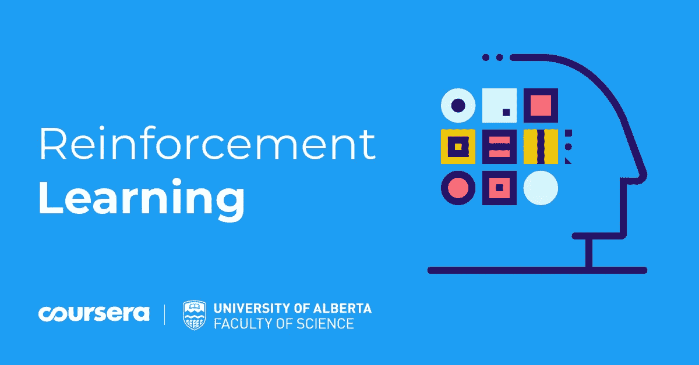](https://coursera.pxf.io/c/3294490/1164545/14726?u=https%3A%2F%2Fwww.coursera.org%2Fprofessional-certificates%2Fgoogle-data-analytics)

image_credit — Coursera

大家好，如果你渴望在数据科学、数据分析和数据可视化领域开始你的职业生涯，并寻找最好的 Coursera 认证、课程、专业和项目，那么你来对地方了。

在过去，我已经分享了最好的 Coursera 课程和认证，以学习[人工智能](/javarevisited/10-best-udemy-and-coursera-courses-to-learn-artificial-intelligence-in-2020-ec77ad13bdc1)、 [Python 编程语言](/javarevisited/10-best-python-certification-courses-from-coursera-4576890eb6b3)、[软件开发](/javarevisited/10-best-software-development-courses-certifications-from-coursera-4ccc59aae201)和 [Web 开发](/javarevisited/10-best-coursera-courses-for-web-development-and-web-design-9ec54ed92dd9)，在这篇文章中，我将分享最好的 Coursera 课程、项目、认证以及来自著名大学如 Johns Hopkins 和科技公司如 IBM 的数据科学、数据可视化和数据分析专业。

这些都是很受欢迎的技能，有很多工作适合简历中有这些技能的人。世界各地成千上万的人已经使用这些在线课程和认证来建立这些关键技能并开始他们的职业生涯，你也可以这样做。

数据是任何公司取得成功的命脉，因此他们可以通过利用这些数据来与其他企业竞争，并尝试获得洞察力，以便他们可以了解市场的运作方式以及用户在特定情况下的行为。

如果有人问我在数据分析领域的职业生涯，我会告诉他，获得认证是一个不错的选择，因为它告诉你的员工，你拥有这个行业所需的经验和教育，你是这个职位的合适人选，可以加入负责公司成败的团队。

顺便说一下，如果你正在寻找一门课程而不是多门课程，那么我强烈建议你加入 365 Careers 及其团队**的 [**数据科学课程 2023**](https://click.linksynergy.com/deeplink?id=JVFxdTr9V80&mid=39197&murl=https%3A%2F%2Fwww.udemy.com%2Fcourse%2Fthe-data-science-course-complete-data-science-bootcamp%2F) 。**他在 Udemy 上有最好的数据科学和数据可视化课程。

 [## 数据科学培训课程:数据科学家训练营

### 数据科学家是本世纪最适合蓬勃发展的职业之一。它是数字化的，面向编程的，并且…

udemy.com](https://click.linksynergy.com/deeplink?id=JVFxdTr9V80&mid=39197&murl=https%3A%2F%2Fwww.udemy.com%2Fcourse%2Fthe-data-science-course-complete-data-science-bootcamp%2F) 

# Coursera 上的 10 个最佳数据科学和分析课程及认证

在此之下，有许多最好的 Coursera 课程和证书可以放在你的简历中，它们可以促进你作为数据分析师的职业生涯，并扩展你在这个行业的知识。一般来说，Coursera 课程是免费审核的，这意味着你可以免费注册和学习，但你需要支付认证、评估和练习的费用。如果你负担得起，尽一切办法去认证，但如果你不能，你仍然可以通过参加免费的 Coursera 课程来学习这些关键技能。

## 1.[谷歌数据分析专业证书](https://coursera.pxf.io/c/3294490/1164545/14726?u=https%3A%2F%2Fwww.coursera.org%2Fprofessional-certificates%2Fgoogle-data-analytics)

数据分析通过清理、转换和分析数据来处理数据，以提取有价值的信息用于决策。Coursera 中学习数据分析最好的课程之一是**谷歌数据分析专业证书**。

Google 提供的这个专业证书有超过 446k 的注册人数。他们承诺，加入他们的项目后，你将在短短六个月内为数据分析工作做好准备，不需要任何经验。

您将了解数据分析师的工作方式以及用于数据分析的工具。了解不同的数据类型，以及如何使用 SQL 语言，创建数据可视化，并使用 R 语言分析数据。

**以下是加入本次谷歌认证的链接—** [谷歌数据分析专业证书](https://coursera.pxf.io/c/3294490/1164545/14726?u=https%3A%2F%2Fwww.coursera.org%2Fprofessional-certificates%2Fgoogle-data-analytics)

[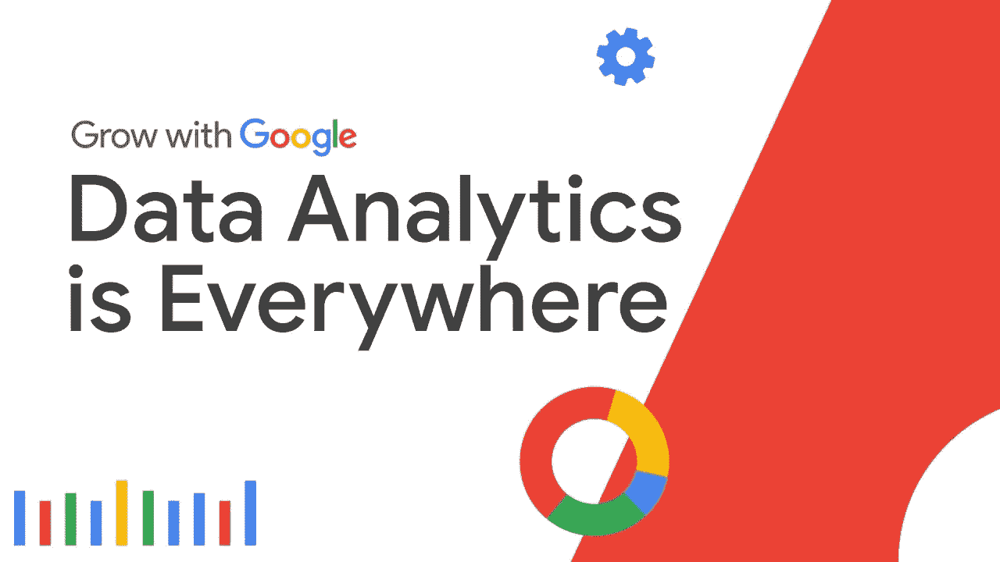](https://coursera.pxf.io/c/3294490/1164545/14726?u=https%3A%2F%2Fwww.coursera.org%2Fprofessional-certificates%2Fgoogle-data-analytics)

## 2. [IBM 数据科学专业证书](https://coursera.pxf.io/c/3294490/1164545/14726?u=https%3A%2F%2Fwww.coursera.org%2Fprofessional-certificates%2Fibm-data-science)

这是 2023 年 Coursera 上最好最海量的数据科学认证，学习数据科学和分析相关的一切。

该 Coursera 专业认证由九门课程组成，首先教授 [Python 编程](/swlh/5-free-python-courses-for-beginners-to-learn-online-e1ca90687caf)然后是 [SQL for databases](/hackernoon/top-5-sql-and-database-courses-to-learn-online-48424533ac61) 以及使用 Python 进行数据分析和可视化。

这个专业证书非常强调应用学习。除了第一门课程，所有其他课程都包括一系列在 IBM Cloud 中的动手实验，这些实验将为您提供适用于实际工作的实用技能。

在此过程中，您还将学习有用的工具和库:

**工具:** Jupyter / JupyterLab、GitHub、R Studio 和 Watson Studio

**库** : Pandas、NumPy、Matplotlib、Seaborn、follow、ipython-sql、Scikit-learn、ScipPy 等。

总的来说，从 Coursera 学习数据科学并在 2023 年成为数据科学家的完美计划。

**这里是加入本证书** — [IBM 数据科学专业证书](https://coursera.pxf.io/c/3294490/1164545/14726?u=https%3A%2F%2Fwww.coursera.org%2Fprofessional-certificates%2Fibm-data-science)的链接

[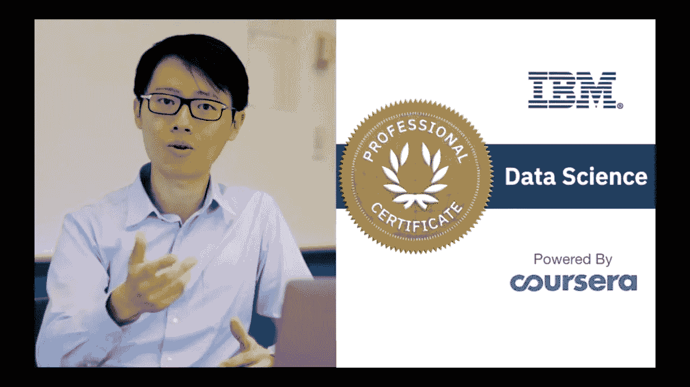](https://coursera.pxf.io/c/3294490/1164545/14726?u=https%3A%2F%2Fwww.coursera.org%2Fprofessional-certificates%2Fibm-data-science)

## 3.[约翰·霍普金斯大学数据科学专业](https://coursera.pxf.io/c/3294490/1164545/14726?u=https%3A%2F%2Fwww.coursera.org%2Fspecializations%2Fjhu-data-science)

这是 t Coursera 学习数据科学的又一大专长，但使用的是 R 编程语言。这个程序也是一个课程的集合，从教授 R 编程语言开始，然后清理你的数据并使之可视化。

之后，您将看到一些统计数据，这些数据将应用于您的数据以及机器学习模型，并创建数据产品来自动化您复杂的数据分析。

这也是 Coursera 的一个非常受欢迎的数据科学专业，已经有超过 **420，523** 人注册了该专业。所以，如果你想用 R 编程语言学习数据科学，这是一个很好的开始。

**这里是加入本课程的链接** — [约翰·霍普金斯大学数据科学专业](https://coursera.pxf.io/c/3294490/1164545/14726?u=https%3A%2F%2Fwww.coursera.org%2Fspecializations%2Fjhu-data-science)

[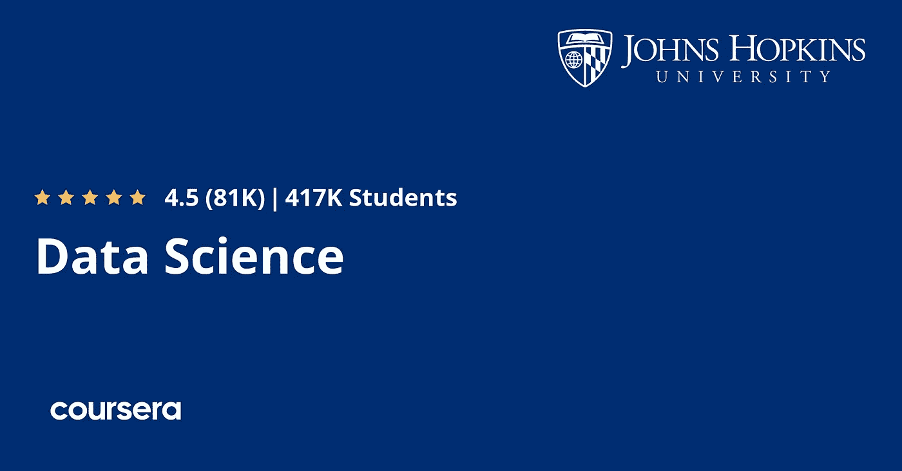](https://coursera.pxf.io/c/3294490/1164545/14726?u=https%3A%2F%2Fwww.coursera.org%2Fspecializations%2Fjhu-data-science)

## 4.[使用 SQL 进行现代大数据分析](https://coursera.pxf.io/c/3294490/1164545/14726?u=https%3A%2F%2Fwww.coursera.org%2Fspecializations%2Fcloudera-big-data-analysis-sql)

这是 Coursera 学习使用 SQL 查询语言进行大数据数据分析的最佳课程。

本课程首先介绍什么是大数据和数据库系统，然后学习如何使用 SQL 语言获取数据并进行分析，最后管理大数据并将其加载到集群中，等等。

这门课程是由著名的大数据公司之一 Cloudera 提供的，已经有超过**15948**人参加了这门课程。

这种专业化也有利于准备**cloud era Certified Associate(CCA)数据分析师**认证考试的人。您可以通过参加动手实践考试获得该认证证书，考试使用的 SQL 引擎与本专业教授的相同— Hive 和 Impala。

**这里是加入本课程的链接** — [使用 SQL 的现代大数据分析](https://coursera.pxf.io/c/3294490/1164545/14726?u=https%3A%2F%2Fwww.coursera.org%2Fspecializations%2Fcloudera-big-data-analysis-sql)

[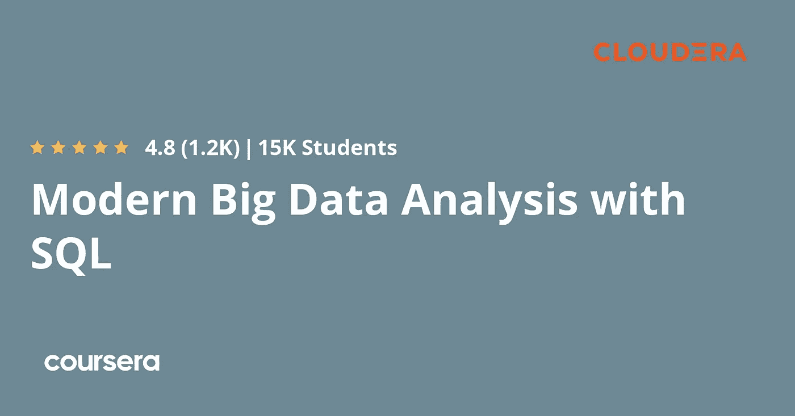](https://coursera.pxf.io/c/3294490/1164545/14726?u=https%3A%2F%2Fwww.coursera.org%2Fspecializations%2Fcloudera-big-data-analysis-sql)

## 5.[业务数据分析简介](https://coursera.pxf.io/c/3294490/1164545/14726?u=https%3A%2F%2Fwww.coursera.org%2Flearn%2Fdata-analytics-business)

这是 Coursera 的另一个专业，在商业中使用 SQL 语言进行数据分析，由科罗拉多大学博尔德分校提供。

本课程首先介绍数据和分析在现实世界中是如何工作的，然后学习在数据库中存储数据背后的技术，以及学习获取数据的 SQL 语言[和一些使您的分析更加顺畅的过程。](/javarevisited/7-free-courses-to-learn-database-and-sql-for-programmers-and-data-scientist-e7ae19514ed2)

**以下是加入本计划的链接** — [商业数据分析简介](https://coursera.pxf.io/c/3294490/1164545/14726?u=https%3A%2F%2Fwww.coursera.org%2Flearn%2Fdata-analytics-business)

[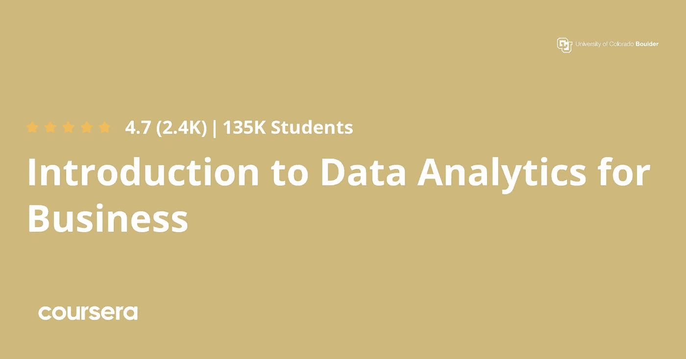](https://coursera.pxf.io/c/3294490/1164545/14726?u=https%3A%2F%2Fwww.coursera.org%2Flearn%2Fdata-analytics-business)

## 6.[使用 Python 进行 COVID19 数据分析](https://coursera.pxf.io/c/3294490/1164545/14726?u=https%3A%2F%2Fwww.coursera.org%2Fprojects%2Fcovid19-data-analysis-using-python)

这是最好的基于项目的课程之一，您将使用新冠肺炎的一些数据集，并尝试在任何分析之前先准备数据，如合并数据，以查看病毒传播与生活在该国的人们的幸福程度之间的关系。

在本项目中，您将使用由约翰·霍普斯金大学发布的 COVID19 数据集，该数据集包含与每个国家每天确诊病例的累计数量相关的数据。

然后，您将最终使用 python 语言和 seaborn 库来可视化这些数据。

**这里是加入这个项目** — [使用 Python 进行 COVID19 数据分析](https://coursera.pxf.io/c/3294490/1164545/14726?u=https%3A%2F%2Fwww.coursera.org%2Fprojects%2Fcovid19-data-analysis-using-python)的链接

[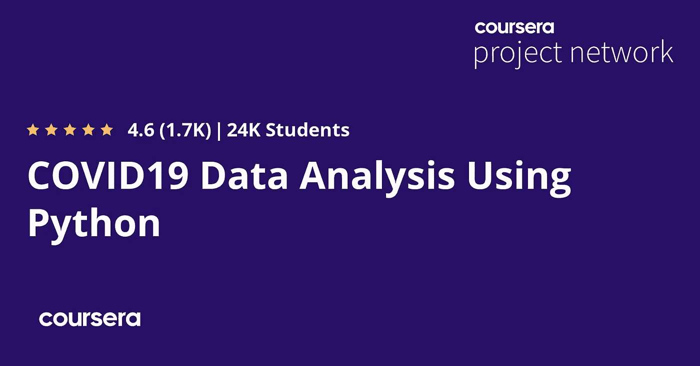](https://coursera.pxf.io/c/3294490/1164545/14726?u=https%3A%2F%2Fwww.coursera.org%2Fprojects%2Fcovid19-data-analysis-using-python)

## 7.[使用 Excel 进行数据分析的介绍](https://coursera.pxf.io/c/3294490/1164545/14726?u=https%3A%2F%2Fwww.coursera.org%2Flearn%2Fexcel-data-analysis)

这是一门很棒的 Coursera 课程，学习如何使用 Excel 准备和分析您的数据，这是世界上任何数据科学家或数据分析师都必须具备的技能。

本课程从介绍 Excel 电子表格和导入数据开始，然后学习一些组织数据的函数以及过滤和数据透视表，最后创建图表和散点图等可视化效果。

**这里是加入本课程的链接**——[使用 Excel 进行数据分析的介绍](https://coursera.pxf.io/c/3294490/1164545/14726?u=https%3A%2F%2Fwww.coursera.org%2Flearn%2Fexcel-data-analysis)

[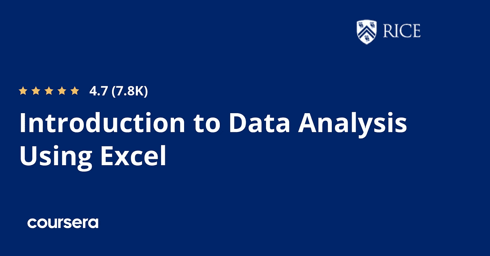](https://coursera.pxf.io/c/3294490/1164545/14726?u=https%3A%2F%2Fwww.coursera.org%2Flearn%2Fexcel-data-analysis)

## 8.[用 Python 应用数据科学](https://coursera.pxf.io/c/3294490/1164545/14726?u=https%3A%2F%2Fwww.coursera.org%2Fspecializations%2Fdata-science-python)

这是 2023 年又一个用 Python 编程语言学习数据科学的梦幻般的 Coursera 认证项目。

本专业是 5 门在线课程的集合，从探索这种 python 语言开始，然后学习如何使用 Matplotlib 库可视化您的数据

之后，您将看到如何使用 sci-kit-learn 创建机器学习模型，以及使用 NLTK 库进行文本挖掘和操作。

**这里是加入这个项目**—[Python 应用数据科学](https://coursera.pxf.io/c/3294490/1164545/14726?u=https%3A%2F%2Fwww.coursera.org%2Fspecializations%2Fdata-science-python)的链接

[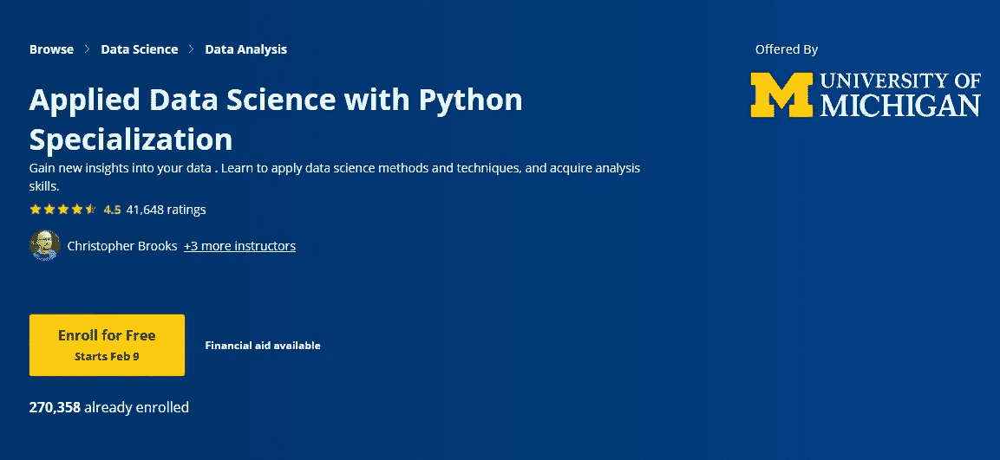](https://www.coursera.org/specializations/data-science-python)

## 9.[使用 Python 和 Pandas 进行探索性数据分析](https://coursera.pxf.io/c/3294490/1164545/14726?u=https%3A%2F%2Fwww.coursera.org%2Fprojects%2Fexploratory-data-analysis-python-pandas)

这是最好的基于 Coursera 项目的课程之一，将教你如何使用许多 python 库，如 NumPy、Matplotlib、 [Pandas](/javarevisited/5-best-courses-to-learn-pythons-pandas-libary-for-data-analysis-and-data-science-34b62abb0e96) 和 Seaborn 进行数据科学和分析。

在这个 2 小时的基于项目的课程中，您将学习如何用 Python 执行探索性数据分析(EDA)。您将学习如何读取您的数据和应用一些统计函数，然后分析您的数据，寻找两个变量之间的关系和可视化等。

总的来说，这是一门优秀的基于项目的课程，只需 2 小时就能学到有用的东西。

**这里是加入这个项目**——[用 Python 和熊猫进行探索性数据分析](https://coursera.pxf.io/c/3294490/1164545/14726?u=https%3A%2F%2Fwww.coursera.org%2Fprojects%2Fexploratory-data-analysis-python-pandas)的链接

[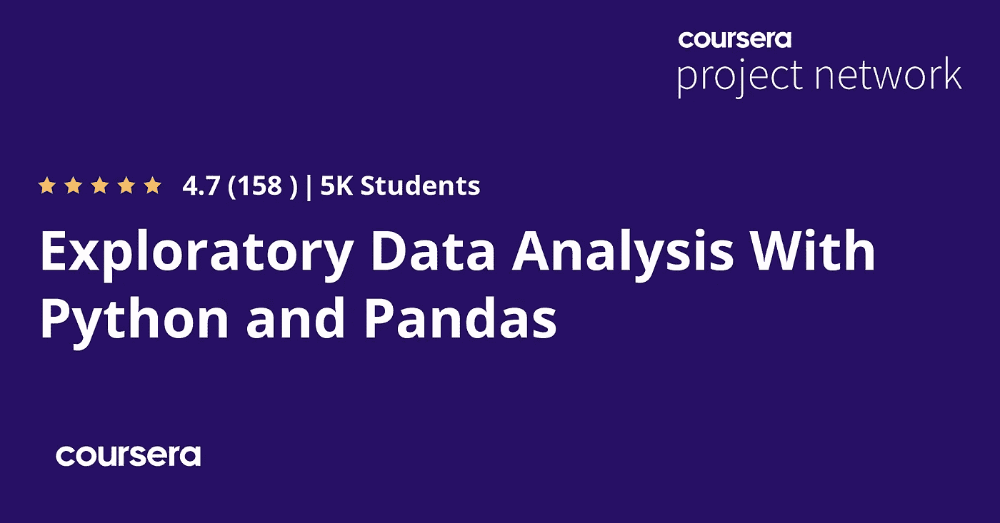](https://coursera.pxf.io/c/3294490/1164545/14726?u=https%3A%2F%2Fwww.coursera.org%2Fprojects%2Fexploratory-data-analysis-python-pandas)

## 10.[数据分析和解释](https://coursera.pxf.io/c/3294490/1164545/14726?u=https%3A%2F%2Fwww.coursera.org%2Fspecializations%2Fdata-analysis)

这是在 Coursera 上学习使用 Python 和 SAS 语言进行数据分析的又一个很棒的课程。

本课程首先讲授什么是数据，以及如何使用 python 和 SAS 等强大的工具来可视化数据，然后对数据执行一些机器学习模型，如回归，最后将所有这些应用到真实世界的数据中，这是一个顶点项目。

本课程的 USP 是，在整个认证过程中，你将分析你选择的一个研究问题，并总结你的见解。

该专业旨在帮助您，无论您是否正在考虑从事数据职业，是否在主管希望您提供数据见解的环境中工作，或者您是否有一些迫切的问题想要探索。不需要以前的经验。

**这里是加入本课程** — [数据分析与解释](https://coursera.pxf.io/c/3294490/1164545/14726?u=https%3A%2F%2Fwww.coursera.org%2Fspecializations%2Fdata-analysis)的链接

[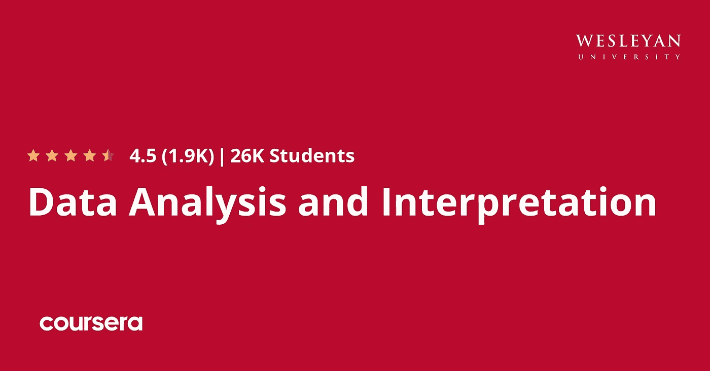](https://coursera.pxf.io/c/3294490/1164545/14726?u=https%3A%2F%2Fwww.coursera.org%2Fspecializations%2Fdata-analysis)

## 11.[表格可视化基础](https://coursera.pxf.io/c/3294490/1164545/14726?u=https%3A%2F%2Fwww.coursera.org%2Flearn%2Fdata-visualization-tableau)

使用著名软件 tableau 开始学习数据可视化的一个很好的课程，从探索该软件的仪表板和导航开始，然后获取您的数据并进行可视化，如折线图和树形图，并学习如何使用 tableau 添加一些交互等等。

完成本课程后，您将能够准备数据并将数据导入 Tableau，并解释数据分析和[数据可视化](https://javarevisited.blogspot.com/2020/08/top-10-coursera-certifications-to-learn-Data-Science-Visualization-and-Data-Analysis.html)之间的关系。

本课程的另一个优点是，它是为以前从未使用过 [Tableau](/javarevisited/my-favorite-courses-to-learn-tableau-for-data-science-and-visualization-46623ba5b424?source=---------8------------------) 的学员设计的，或者是为需要复习或想要更深入地探索 Tableau 的学员设计的

**这是加入本课程**——[的链接](https://coursera.pxf.io/c/3294490/1164545/14726?u=https%3A%2F%2Fwww.coursera.org%2Flearn%2Fdata-visualization-tableau)

[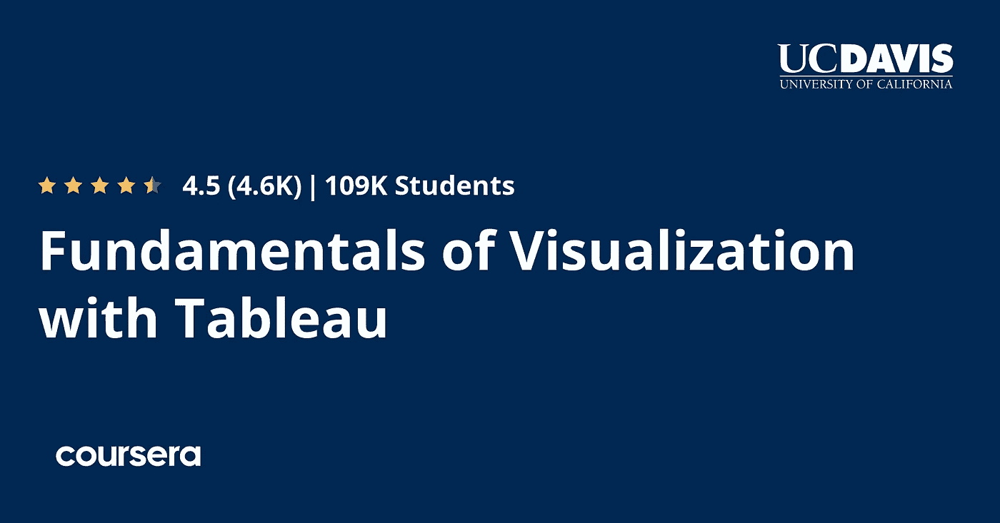](https://coursera.pxf.io/c/3294490/1164545/14726?u=https%3A%2F%2Fwww.coursera.org%2Flearn%2Fdata-visualization-tableau)

## 12.[强化学习专精](https://coursera.pxf.io/c/3294490/1164545/14726?u=https%3A%2F%2Fwww.coursera.org%2Fspecializations%2Freinforcement-learning)

这是阿尔伯塔大学在 Coursera 上提供的一个相对较新的专业。它由 4 门课程组成，探索自适应学习系统和人工智能的力量( [AI](/javarevisited/10-best-coursera-certifications-courses-for-machine-learning-and-artificial-intelligence-256d9a125822) )。

本课程将帮助您了解强化学习(RL)解决方案如何通过从头到尾实施完整的 RL 解决方案，通过试错式交互来帮助解决现实世界中的问题。

**这是参加本课程** —强化学习专业化的链接

[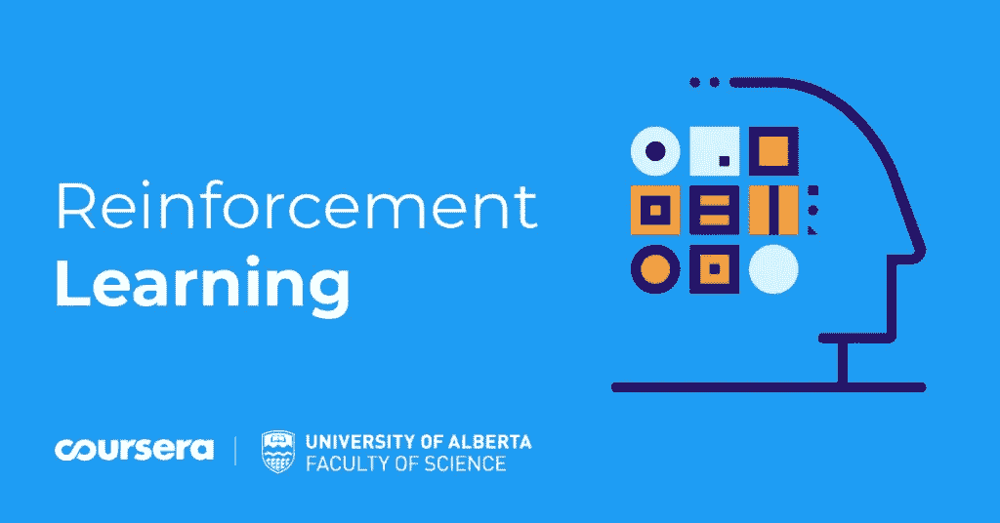](https://coursera.pxf.io/c/3294490/1164545/14726?u=https%3A%2F%2Fwww.coursera.org%2Fspecializations%2Freinforcement-learning)

以上是 2023 年学习数据科学、数据分析和数据可视化的**最佳 Coursera 课程、专业、认证和项目。**

互联网已经改变了游戏，任何人都可以学习和参加任何主题和行业的课程，数据分析就是其中之一，所以你可以在不花钱和多年大学教育的情况下获得拥有伟大职业的认证。

顺便说一句，如果你计划参加多个 Coursera 课程或专业，那么考虑参加 [**Coursera Plus**](https://coursera.pxf.io/c/3294490/1164545/14726?u=https%3A%2F%2Fwww.coursera.org%2Fcourseraplus) 订阅，它可以让你无限制地访问他们最受欢迎的课程、专业、专业证书和指导项目。它每年花费大约 399 美元，但它完全值得你的钱，因为你可以获得无限的证书。

 [## Coursera Plus |无限制访问 7，000 多门在线课程

### 用 Coursera Plus 投资你的职业目标。无限制访问 90%以上的课程、项目…

coursera.pxf.io](https://coursera.pxf.io/c/3294490/1164545/14726?u=https%3A%2F%2Fwww.coursera.org%2Fcourseraplus) 

你可能喜欢的其他 **Coursera 和编程文章**

*   [2023 年程序员十大课程](https://javarevisited.blogspot.com/2020/08/top-10-coursera-courses-specilizations-and-certifications.html)
*   [学习云计算的 10 门最佳 Coursera 课程](https://javarevisited.blogspot.com/2020/08/top-10-coursera-certifications-to-learn-cloud-computing-aws.html#axzz6WK1yC5WW)
*   [Coursera Plus Review——在 Coursera 上学习的更好方式](https://javarevisited.blogspot.com/2020/08/coursera-plus-better-way-to-take-coursera-courses-specilizations-certification.html)
*   [学习 Web 开发的十大 Coursera 课程](https://javarevisited.blogspot.com/2020/08/top-10-coursera-certifications-to-learn-web-development.html)
*   [学习数据科学的十大 Coursera 课程](https://javarevisited.blogspot.com/2020/08/top-10-coursera-certifications-to-learn-Data-Science-Visualization-and-Data-Analysis.html)
*   [面向程序员和开发人员的十大 Coursera 项目](https://javarevisited.blogspot.com/2020/08/top-10-coursera-projects-to-learn-essential-programming-skills.html)
*   [开始职业生涯的 10 大 Coursera 认证](/javarevisited/top-10-coursera-certificates-to-start-your-career-in-cloud-data-science-ai-mainframe-and-it-558690c83587)
*   [2023 年学习人工智能的 7 门最佳课程](/javarevisited/7-best-courses-to-learn-artificial-intelligence-in-2020-26d59d62f6fe)
*   [Udemy vs 复数视线？哪个学习平台比较好？](https://javarevisited.blogspot.com/2019/10/udemy-vs-pluralsight-review-which-is-better-to-learn-code.html)
*   [Udemy vs CodeCademy vs one month？](https://javarevisited.blogspot.com/2019/09/codecademy-vs-udemy-vs-onemonth-which-is-better-for-learning-code.html#axzz6VYKcmyZz)
*   Udemy vs Educative vs Codecademy？新手用哪个好
*   [学习 Python 的 10 个 Coursera 专业和认证](https://javarevisited.blogspot.com/2020/02/10-best-coursera-courses--for-python.html)
*   5 个最好的程序员 Coursera 职业证书
*   [2023 年学习 Python 可以做的 8 个项目](/javarevisited/8-projects-you-can-buil-to-learn-python-in-2020-251dd5350d56)
*   [你可以在 Coursera Online 上获得 5 个数据科学学位](https://www.java67.com/2020/06/top-5-data-science-degree-you-can-earn-online-coursera-edx.html)
*   【Coursera 的 10 项数据科学和机器学习认证

感谢阅读这篇文章。如果你喜欢这些*关于数据科学、数据分析和数据可视化的最佳 Coursera 课程*，那么请与你的朋友和同事分享它们。如果您有任何问题或反馈，请留言。

**P. S.** —如果你正在寻找最好的 Udemy 课程来学习数据科学、数据可视化和数据分析，那么你也可以看看 365 Careers 的 [**数据科学课程 2023**](https://click.linksynergy.com/deeplink?id=JVFxdTr9V80&mid=39197&murl=https%3A%2F%2Fwww.udemy.com%2Fcourse%2Fthe-data-science-course-complete-data-science-bootcamp%2F) 和他的团队**。**他在 Udemy 上有最好的数据科学和数据可视化课程。

 [## 数据科学培训课程:数据科学家训练营

### 数据科学家是本世纪最适合蓬勃发展的职业之一。它是数字化的，面向编程的，并且…

udemy.com](https://click.linksynergy.com/deeplink?id=JVFxdTr9V80&mid=39197&murl=https%3A%2F%2Fwww.udemy.com%2Fcourse%2Fthe-data-science-course-complete-data-science-bootcamp%2F)