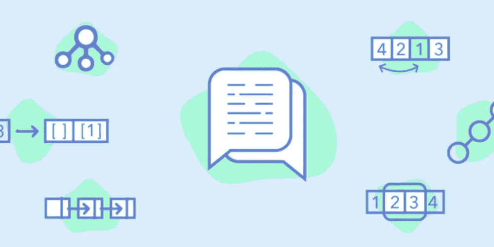
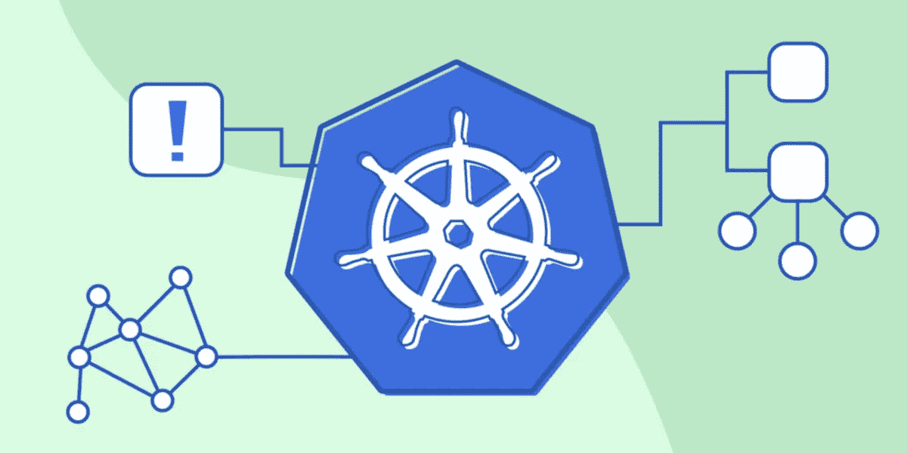
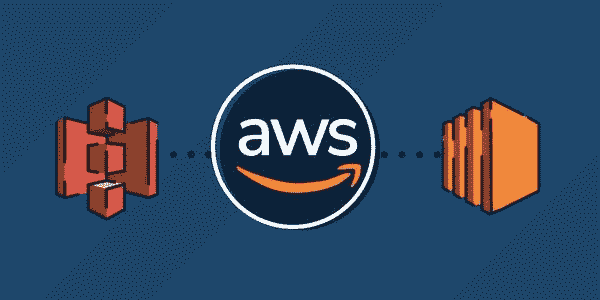
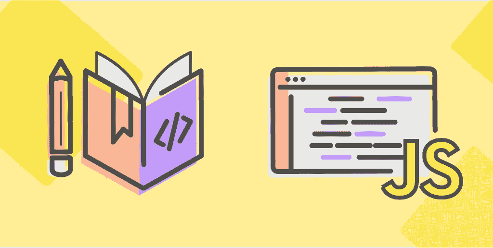
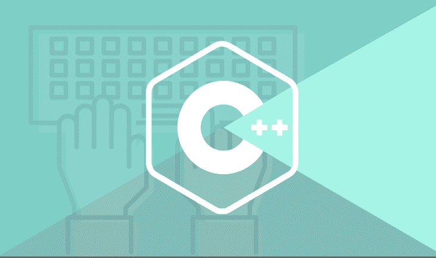
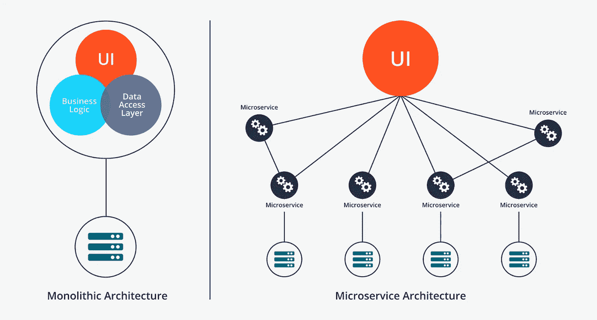

# 2023 年编码面试和软件开发的 11 门最佳教育课程

> 原文：<https://medium.com/javarevisited/11-best-educative-courses-for-coding-interviews-and-software-development-339ad82fee50?source=collection_archive---------0----------------------->

## 我最喜欢的 Educative.io 课程 2023 年破解编码面试学习软件开发。

image_credit — Educative.io

今天，我将与大家分享一个相对较新的在线学习平台，名为 **Educative** ，这是一个基于文本的交互式学习平台。如果你像我一样是一个在线学习者，你可能听说过 [Educative](/javarevisited/20-free-educative-courses-for-programmers-and-software-engineers-a7135028350c) 或者遇到过它的一些优秀和最受欢迎的课程，比如**Grokking System Design Interview course**，我在前面关于系统设计面试问题的文章中提到过。

那么，教育性有什么特别之处呢？与其他流行的在线平台如 [Udemy](/javarevisited/15-best-udemy-courses-programmers-can-buy-on-black-friday-and-cyber-monday-2020-a803874f41d9) 、 [Coursera](/javarevisited/top-15-free-coursera-courses-and-certifications-for-it-professionals-384207d56f45) 、 [Pluralsight](/javarevisited/10-best-react-courses-from-pluralsight-for-beginners-and-experienced-developers-80b7c640cca3) 和 [CodeCademy](/javarevisited/pluralsight-or-udemy-d9a94d2e8ee) 有多大不同？Educative 是不同的，因为它主要是一个基于文本的学习平台，允许你在浏览器中编写代码和程序。

与通过观看视频来学习的 Udemy 或 Coursera 不同，你可以通过阅读和尝试 Educative 中的代码样本来学习更多。

通过阅读学习有一些独特的优势，尤其是丰富的文本。比如阅读永远比看视频快，我也见过很多人只是在冗长枯燥的视频之间跳着去寻找感兴趣的信息。

有了文字，你可以更快地跳过，也更容易记笔记。Educative 的尖端技术还允许你在浏览器中运行代码。这意味着你可以使用 Educative 的创新代码小部件在浏览器中学习 [Python](/swlh/5-free-python-courses-for-beginners-to-learn-online-e1ca90687caf) 、 [Java](/javarevisited/top-5-java-online-courses-for-beginners-best-of-lot-1e1e240a758) 、 [Ruby](/@javinpaul/top-5-free-courses-to-learn-ruby-and-rails-for-beginners-best-of-lot-e149fe03c964) 、 [JavaScript](/javarevisited/12-free-courses-to-learn-javascript-and-es6-for-beginners-and-experienced-developers-aa35874c9a32) ，甚至 [C++](https://dev.to/javinpaul/top-10-courses-to-learn-c-in-depth-best-of-lot-1k7) 。

简而言之， [**教育平台**](https://www.educative.io/subscription?affiliate_id=5073518643380224) 作为一个平台提供了很多东西，值得一看，但只有平台是不够的，除非你有一些利用平台全部潜力的优秀课程，并为你提供令人惊叹的学习体验，而且教育充满了它们。在这篇文章中，我将与你分享程序员和软件工程师的 11 大教育课程。你可以查看这些课程来提升程序员的基本技能，比如系统设计、算法、Docker、库本内特、反应、JavaScript、T42、C++和动态编程。这些是需要掌握的真正有用的技能，Educative 的互动学习平台将帮助你快速掌握它们。

 [## 探索系统设计面试——互动学习

### 系统设计问题已经成为软件工程面试过程的标准部分。在这些方面的表现…

www.educative.io](https://www.educative.io/collection/5668639101419520/5649050225344512?affiliate_id=5073518643380224) 

# 2023 年我最喜欢的编程面试和软件开发教育课程

在不浪费你更多时间的情况下，这里列出了 Educative 为程序员和软件工程师提供的最好的交互式、基于文本的课程。

这些基于文本的交互式课程是由专家和 Educative 的最先进平台创建的，该平台通过交互式测验和直接从浏览器运行程序的能力使学习变得简单。

## 1.[钻研系统设计面试](https://www.educative.io/collection/5668639101419520/5649050225344512?affiliate_id=5073518643380224)

这实际上是我见过的第一个，也可能是最好的教育课程。本课程由设计大师创建，旨在解决系统设计的主题。如果你参加过编码面试，那么你可能知道处理系统设计问题是不容易的，尤其是如果你没有太多现实世界软件开发的经验。

缓存、可扩展性、容错、[微服务](https://javarevisited.blogspot.com/2018/02/top-5-spring-microservices-courses-with-spring-boot-and-spring-cloud.html)、数据库设计这些东西对于设计软件来说是必不可少但又不容易掌握的。这门课程很好地介绍了在设计一个新的系统，比如一个网站，一个应用程序，或者仅仅是一个应用程序时，你需要记住的所有东西。如果你想通过编码面试，这个互动课程*是必须的，但是即使你没有为面试做准备，你也会通过这个课程学到很多关于软件架构师和设计的知识，最终使你成为一个更好的程序员。*

**以下是加入本课程** — [系统设计面试](https://www.educative.io/collection/5668639101419520/5649050225344512?affiliate_id=5073518643380224)的链接

## 2.[寻找编码面试:编码问题的模式](https://www.educative.io/collection/5668639101419520/5671464854355968?affiliate_id=5073518643380224)

这是另一个来自程序员教育平台的精彩课程。与其他通过解决问题来准备编码面试的在线课程不同，本课程将教你如何找到*潜在的编码模式*，以便你可以在编码面试中解决类似的问题。

如果你想在像[谷歌](/javarevisited/5-best-programming-languages-to-get-a-sofware-developer-job-in-google-3d8c83c444d6)、[微软](https://javarevisited.blogspot.com/2015/12/30-microsoft-interview-questions-for-software-development-engineers.html#axzz5YWjgMMkL)、[亚马逊](https://javarevisited.blogspot.com/2016/01/top-20-amazon-and-google-programming-interview-questions.html)、苹果、脸书、网飞或任何 FAANG 公司的编码面试中胜出，这种发现模式和培养编码意识的技术是必须的。

为什么？因为他们经常给你出一个你从来没见过的编码问题。如果你知道如何将问题分解成可识别的模式，你就能解决它们。

我向所有准备参加编码面试的人强烈推荐这个课程，但是就像前面的课程一样，即使你没有准备面试，你也可以参加这个课程来提高你的编码技能，成为一名更好的开发人员。

**这里是加入本编码课程的链接** — [探索编码面试模式](https://www.educative.io/collection/5668639101419520/5671464854355968?affiliate_id=5073518643380224)

## 3.[寻找编码面试的动态编程模式](https://www.educative.io/collection/5668639101419520/5633779737559040?affiliate_id=5073518643380224)

这是我从 Educative 为准备编码面试的程序员选择的第三门课程，因为 Educative 真的有最好的编码面试课程。这门课程解决了编码面试中的另一个难题[动态编程](/javarevisited/6-best-dynamic-programming-courses-for-coding-interviews-14744060923c)。

如果你不知道动态编程是一种通过将复杂问题分解成更小的类似问题来解决复杂问题的技术。它使用[递归](https://javarevisited.blogspot.com/2017/03/how-to-reverse-linked-list-in-java-using-iteration-and-recursion.html)和[记忆](https://www.java67.com/2016/05/fibonacci-series-in-java-using-recursion.html)来解决单个部分，最终解决更大的问题，但不容易掌握。本课程将为您提供掌握动态编程所需的所有知识，您将通过解决面试中最常见的动态编程问题来学习，以便您在真正需要时准备好解决它们。

**这里是加入本课程的链接** — [探索编码面试的动态编程模式](https://www.educative.io/collection/5668639101419520/5633779737559040?affiliate_id=5073518643380224)

## 4.[开发者 Docker](https://www.educative.io/courses/docker-for-developers?affiliate_id=5073518643380224)

如果有一个工具是每个程序员今年都应该学习的，那么它应该是 Docker。如果你不知道 Docker 是什么？那么我来告诉你，Docker 是一个容器工具，它解决了执行一个有这么多依赖项的复杂应用程序的问题。

它还解决了大规模部署的问题，因为它将应用程序及其所有依赖项捆绑到单个 Docker 映像(类似于 tar 文件)中，您只需部署该映像，而不必通过安装操作系统、外壳和不同的依赖项来设置整个环境。

Docker 最好的一点是 Docker 容器非常轻量级，可以部署在任何物理和虚拟机上，这使得它们非常适合云部署，如 [AWS](https://javarevisited.blogspot.com/2020/05/top-5-amazon-web-services-aws-courses-for-beginners-and-experienced-programmers.html) 、 [GCP](https://javarevisited.blogspot.com/2019/07/top-5-google-cloud-platform-gcp-courses-certifications-online.html) 和 [Azure](https://javarevisited.blogspot.com/2020/04/how-to-crack-microsoft-az-103-azure-administrator-associate-exam-certification.html) 。

这门课程，Docker for Developers 会教你一个开发者应该知道的关于 Docker 的所有事情，Educative 的互动学习平台意味着你会通过练习和动手练习来学习 Docker

**以下是加入本互动课程**—[Docker for Developers](https://www.educative.io/courses/docker-for-developers?affiliate_id=5073518643380224)的链接

## 5.Kubernetes 实用指南

除了 Docker，Kubernetes 是另一个风靡全球的工具。它将容器部署带到了下一个级别。

而 Docker 则通过捆绑应用代码、依赖、运行时环境如 OS、 [Java](/javarevisited/10-free-courses-to-learn-java-in-2019-22d1f33a3915) 、[来解决应用部署的问题。NET](https://javarevisited.blogspot.com/2019/10/top-5-courses-to-learn-asp-net-in-2019.html) 和[节点](https://www.java67.com/2019/07/top-5-free-nodejs-courses-for-web-development.html)合并到单个 Docker 映像文件中，但根据可伸缩性需求来生成和管理成百上千个容器仍然不容易。Kubernetes 通过自动化容器管理解决了这个问题。它可以在流量翻倍时自动创建新的容器，并在应用程序负载恢复正常时关闭它们。

如果你渴望成为一名 [DevOps 工程师](/hackernoon/the-2018-devops-roadmap-31588d8670cb)或者只是想成为一名全栈开发人员，学习 Kubernetes 可以提升你的形象，这门课程确实可以帮助你深入学习 Kubernetes。

**这是参加 Kubernetes 课程的链接**e—[Kubernetes 实用指南](https://www.educative.io/courses/practical-guide-to-kubernetes?affiliate_id=5073518643380224)

## 6.[AWS 的好部分:穿过杂乱的东西](https://www.educative.io/courses/good-parts-of-aws?affiliate_id=5073518643380224)

AWS 是我认为每个开发人员都应该掌握的另一项技能，不仅是为了提高他们的个人资料和简历，也是为了了解应用程序在不久的将来将如何执行。

由于云计算是软件开发的未来，现在越来越多的应用程序从[云](/javarevisited/5-best-cloud-computing-courses-to-learn-in-2020-f5f091159401)上运行，因此开发人员必须了解云是如何工作的，以及计算机、内存、存储和网络等基本要素是如何配置的。

但是，学习 [AWS](https://javarevisited.blogspot.com/2019/08/how-to-crack-aws-certified-solution-architect-exam.html) 可能会很乏味和耗时，因为有太多的服务及其选项，这正是本课程的帮助所在。这个课程教你 AWS 的好的和必要的部分。本课程中分享的大部分知识，你在其他任何地方或 AWS 文档中都找不到。*这里的目标是帮助你认识到你应该使用哪些 AWS 功能*——这些功能已经通过了时间的考验，是互联网上大多数事物的支柱。

**这里是加入这个 AWS 课程的链接**——[AWS 的好部分](https://www.educative.io/courses/good-parts-of-aws?affiliate_id=5073518643380224)

## 7.[现代 JavaScript 完全指南](https://www.educative.io/courses/complete-guide-to-modern-javascript?affiliate_id=5073518643380224)

毫无疑问，JavaScript 是 web 开发的一种，是软件开发中最有利可图的途径，但是 JavaScript 在过去几年里发生了很大的变化。这和你我 10 年前在客户端验证时学到的 JavaScript 不一样。

现代 JavaScript 是一种更加强大的编程语言，包括了 [OOP](/javarevisited/my-favorite-courses-to-learn-object-oriented-programming-and-design-in-2019-197bab351733) 和[函数式编程](https://www.java67.com/2015/07/5-books-learn-java-8-functional-programming.html)的特性，可以编写干净简洁的代码。这门课程《现代 JavaScript 完全指南》将指导你从语言的基础到目前为止引入的所有新特性。

无论你是 JavaScript 初学者还是已经有了一些经验，这个课程只会增强你的 JavaScript 知识，让你成为更好的开发者。

您还将使用 Educative 的交互式在线学习平台，通过测验和一些编码挑战来测试您的知识。

**这里是加入这个令人敬畏的课程的链接**——[现代 JavaScript 完全指南](https://www.educative.io/courses/complete-guide-to-modern-javascript?affiliate_id=5073518643380224)

## 8. [C++17 详解:深潜](https://www.educative.io/courses/cpp-17-in-detail-a-deep-dive?affiliate_id=5073518643380224)

除了编码面试课程，C++是 Educative 有最好的课程的另一个主题。他们有涵盖各个 C++领域的课程，如模板、嵌入式编程，还有像这门深入 C++17 的课程。

本课程描述了 [C++17](https://javarevisited.blogspot.com/2020/03/top-5-cpp-programming-books-must-read.html) 中的所有重大变化，并将为您提供掌握最新特性的基本知识。此外，每一部分都包含大量实际示例，并使用自下而上的方法让您有一个更舒适的开始

如果您想将您的 C++技能提升到一个新的水平，那么我向您强烈推荐本课程，如果您愿意，您也可以查看他们的其他 C++书籍。你知道吗，你实际上可以购买一份教育订阅来尝试所有这些课程，而不是单独购买。这是一个更好的交易，因为每月 18 美元的费用，你可以访问他们的 140+课程库。

**这里是加入这个 C++课程的链接**——[c++ 17 详细内容:深度探索](https://www.educative.io/courses/cpp-17-in-detail-a-deep-dive?affiliate_id=5073518643380224)

## 9.[面向高级工程面试的 Java 多线程](https://www.educative.io/courses/java-multithreading-for-senior-engineering-interviews?affiliate_id=5073518643380224)

正如我所说，Educative 有最好的准备编程工作面试的在线课程，并发性是编写面试代码的关键技能之一。不仅要通过面试，还要开发当今的高性能和高并发应用。Java 中的并发性是高级工程师面试中提出的最复杂和高级的话题之一。对[并发](https://javarevisited.blogspot.com/2016/06/5-books-to-learn-concurrent-programming-multithreading-java.html)和[多线程](https://javarevisited.blogspot.com/2020/04/top-10-advanced-java-books-for-experienced-programmers.html)的了解可以让受访者处于相当大的优势。本课程奠定了高级并发和多线程的基础，并深入解释了监视器和延迟回调等概念。它还将教你如何解决流行的并发编码问题，这些问题可以在采访中被问到，比如读者-作者问题和用餐哲学家问题。

无论你是初学者还是有经验的 Java 程序员，如果你想让你的并发技能更上一层楼，我都强烈推荐你上这门课

**这里是加入本线程课程**——[高级工程面试 Java 多线程](https://www.educative.io/courses/java-multithreading-for-senior-engineering-interviews?affiliate_id=5073518643380224)的链接

## 10.[反应的道路:有钩子的那条](https://www.educative.io/courses/road-to-react-with-hooks?affiliate_id=5073518643380224)

毫无疑问，React.js 是前端开发的头号框架。就像 JavaScript 是一种 Web 开发，Python 是数据科学之王一样，React 对于任何前端开发人员来说也是最重要的。

你可能已经知道 React 了，但事实是 [React.js](https://javarevisited.blogspot.com/2019/04/10-free-angular-and-react-courses-for.html) 一直在变化，在每个版本中都引入了新的功能，要跟上他们并不容易，这就是本课程的帮助所在。

在本课程中，你将深入 React 基础知识，涵盖所有新的 React 概念，包括[挂钩](/javarevisited/top-10-free-courses-to-learn-react-js-c14edbd3b35f)。如果你正在使用一个旧的代码库，我会处理一些遗留的特性，但是本课程的大部分将集中在使用现代的 React 上。

您将学习如何设计您的应用程序、维护应用程序的技术，以及一些更高级的概念，如性能优化。

**这里是加入这个 React 课程的链接**——[React 之路:带钩的那条](https://www.educative.io/courses/road-to-react-with-hooks?affiliate_id=5073518643380224)

## 11.[网络应用和软件架构 101](https://www.educative.io/courses/web-application-software-architecture-101?affiliate_id=5073518643380224)

软件架构是许多开发人员没有给予足够关注的一个话题。不幸的是，也没有好的材料可以用来学习不同的软件架构，以及它们的优缺点。你需要努力寻找，需要知道如何找到那些珍贵的文章，如果你真的幸运的话，你可能会找到它们，但对我们大多数人来说，它只是擦肩而过，所以这个有用的话题仍然很薄弱。本课程通过解释程序员需要知道的关于软件架构的一切来解决这个问题。

如果你正在寻找一门关于 [web 应用](/javarevisited/top-10-free-courses-to-learn-html-5-css-3-and-web-development-872d62d97a97)和[软件架构](https://dev.to/javinpaul/5-best-courses-to-learn-software-architecture-and-system-design-for-programmers-1879)的完整课程，我推荐你去看看这个关于教育的 web 应用和软件架构 101 课程。这是一门有用的课程，可以帮助任何想要加强软件架构整体知识的人。

这里是加入这个令人敬畏的课程的链接。[网络应用和软件架构 101](https://www.educative.io/courses/web-application-software-architecture-101?affiliate_id=5073518643380224)

以上是关于**程序员和软件工程师的 11 门最佳教育课程**。这个列表包括非常适合准备编程面试的课程，如 Grokking 系列，以及一些学习 Docker 和 Kubernetes 等工具和 Python、Java、C++和 JavaScript 等编程语言的课程。

如果你觉得这些在线课程和教育平台很有用，那么你也可以考虑申请 [**教育订阅**](https://www.educative.io/subscription?affiliate_id=5073518643380224) ，这样你就可以只花**【14.99 美元/月】**就能获得 100 多门课程。

有时你需要这种灵活性，加入你想要的课程，而不是购买它。如果你打算在一年内参加几门以上的教育课程，这也是一个更好的交易。

其他对程序员和开发人员有用的资源

*   [面向有经验程序员的 10 门高级 Java 课程](https://javarevisited.blogspot.com/2020/04/top-10-advanced-core-java-courses-for-experienced-developers.html#axzz6KyOHbmCo)
*   [2023 年学习 Web 开发的五大课程](https://javarevisited.blogspot.com/2018/02/top-5-online-courses-to-learn-web-development.html)
*   [学习大数据和 Apache Spark 的 5 门课程](http://javarevisited.blogspot.com/2017/12/top-5-courses-to-learn-big-data-and.html)
*   [深入学习 AWS 的 10 门课程](/javarevisited/top-10-courses-to-learn-amazon-web-services-aws-cloud-in-2020-best-and-free-317f10d7c21d)
*   【Educative 为初学者提供的 10 门免费编程课程
*   [成为全栈 Java 开发人员的前 5 门课程](https://javarevisited.blogspot.com/2020/04/top-5-courses-to-become-full-stack-java-developer-with-Angular-and-Reactjs.html)
*   [学习 Spring 框架的 10 门最佳课程](/javarevisited/10-best-online-courses-to-learn-spring-framework-in-2020-f7f73599c2fd)
*   [2023 年学习 Spring Boot 的 5 大课程](https://javarevisited.blogspot.com/2018/05/top-5-courses-to-learn-spring-boot-in.html)
*   [2023 年 Java 程序员最佳阿帕奇卡夫卡课程](https://javarevisited.blogspot.com/2018/04/top-5-apache-kafka-course-to-learn.html)
*   [Coursera Plus Review——更好的上课方式](https://javarevisited.blogspot.com/2020/08/coursera-plus-better-way-to-take-coursera-courses-specilizations-certification.html)
*   面向程序员的 15 门 AWS、Docker 和 Kubernetes 课程
*   [深入学习 React Native 的 5 门课程](http://javarevisited.blogspot.sg/2018/02/5-react-native-courses-to-learn-mobile-development-using-JavaScript.html)
*   [我最喜欢的免费课程学习 Maven、Jenkins 和 Docker](/javarevisited/top-10-free-courses-to-learn-maven-jenkins-and-docker-for-java-developers-51fa7a1e66f6)
*   [Web 开发人员学习 TypeScript 的五大课程](https://javarevisited.blogspot.com/2018/07/top-5-courses-to-learn-typescript.html)
*   [面向 Web 开发人员的十大 JavaScript 教程和课程](https://javarevisited.blogspot.com/2018/06/top-10-courses-to-learn-javascript-in.html)

感谢您阅读本文。如果您发现这些 ***在线课程和教育平台*** 有用，请与您的朋友和同事分享。如果您有任何问题或反馈，请留言。学习从未如此轻松有趣。

**P. S.** —如果你正在寻找一些免费的课程来探索教育平台和他们的交互式学习工具，那么我也建议你看看我早先的一篇关于 [**程序员和开发人员的 10 门免费教育课程**](https://javarevisited.blogspot.com/2020/01/top-10-free-interactive-online-courses.html) 的文章。在那里我提到了免费的 Educative.io 课程，供程序员学习 Java、Python、C++、JavaScript 和 Web 开发。

 [## 从头开始学习 Python 3-免费互动课程

### 通过这个交互式课程免费学习 Python 3，并掌握世界上最流行的编程语言…

www.educative.io](https://www.educative.io/courses/learn-python-from-scratch?affiliate_id=5073518643380224)