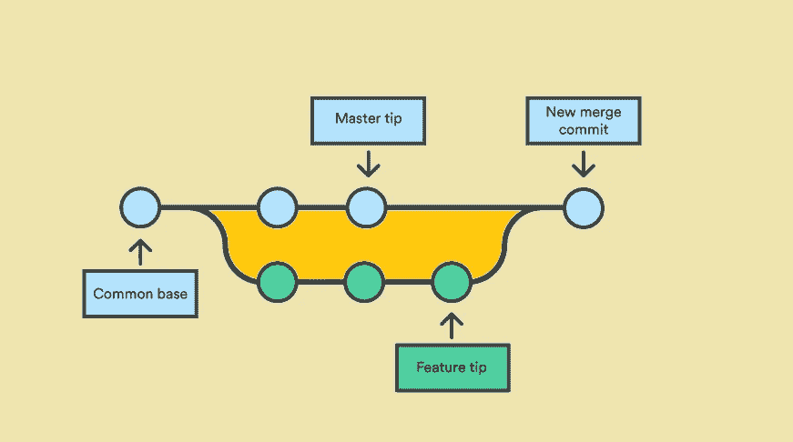
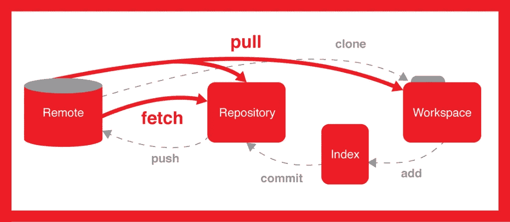
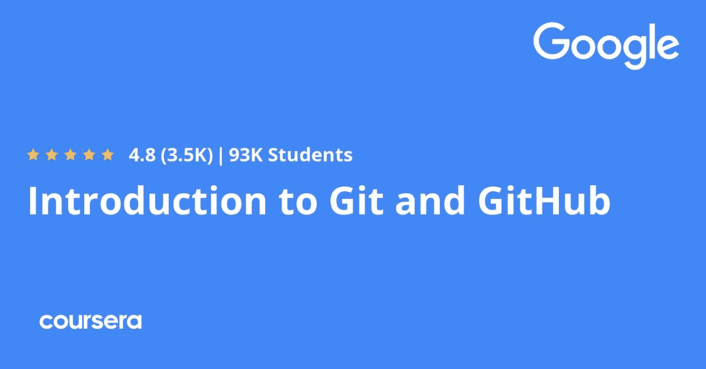
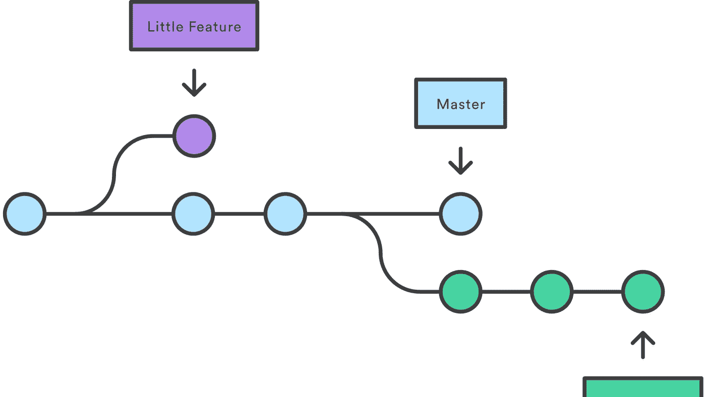
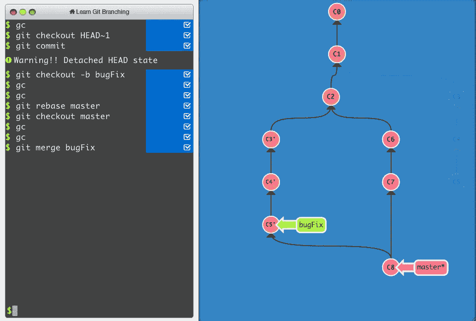
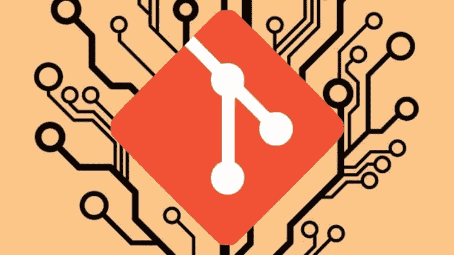
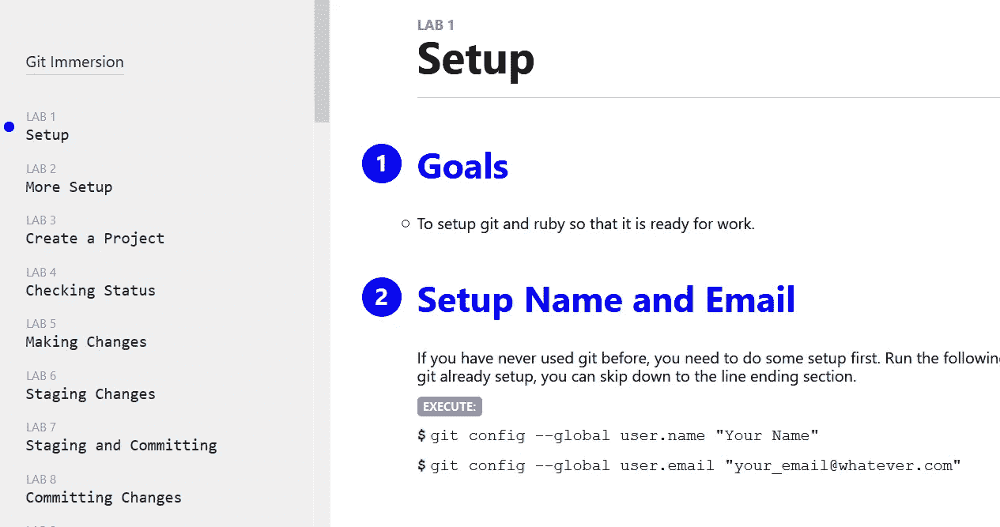
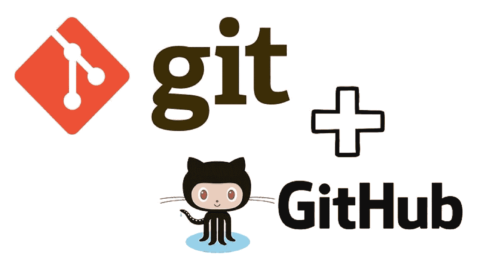

# 2023 年免费学习 Git 和 GitHub 的 11 个最佳地点

> 原文：<https://medium.com/javarevisited/11-best-online-places-to-learn-git-for-beginners-in-2021-6dc2b7c6ef48?source=collection_archive---------0----------------------->

## 这些是 2023 年初学者学习 Git 命令和 Git 概念的最佳网站和平台列表

大家好，如果你想在 2023 年学习 git 并寻找最好的网站，那么你来对地方了。前面我已经分享了[**最好的 git 和 GitHub 在线课程**](/javarevisited/7-best-courses-to-master-git-and-github-for-programmers-d671859a68b2?source=---------9------------------) ，今天我要分享的是从初级到高级学习 git 的最好的网站。很多都是免费的。

像许多程序员一样，我也使用过许多源代码控制系统，如 SVN、CVS、TFS、VSS、水星，我一直想知道为什么会有这么多的源代码控制系统？为什么不只是一个。

它是开发必备的[软件工具](https://javarevisited.blogspot.com/2018/01/10-tools-every-software-developer-know.html)之一，每个人都需要版本控制和代码库，应该有一个标准的解决方案。现在看来 Git 和 Github 已经解决了这个问题。

现在，**从开源到闭源**，从小的创业公司到大的投资银行，Git 无处不在，但仍然有遗留项目躺在 SVN 和 CVS 上，但他们现在也开始向它移动。

直到去年，我至少还在做一个关于 SVN 的项目，但现在这个项目也转移到了 Git。这显示了 Git 的优势，这也是为什么对于新的和有经验的程序员来说学习 Git 和 Github 变得至关重要。

如果你不知道 Git 和 Github 是什么，我来简单介绍一下。 **Git 是一个分布式版本控制系统**，用于跟踪源代码文件中的变更，并在多人之间协调对这些文件的工作。

尽管它主要用于软件开发中的源代码管理，但它也可以用于跟踪任何一组文件中的变更。您经常需要在一个团队中工作，在这个团队中，多个程序员在同一个项目上工作，并修改同一个数据集合。

Git 还有助于协调这项工作，这样就不会丢失代码变更或者意外地覆盖被测试的内容。

简而言之， [Git](https://hackernoon.com/top-5-free-courses-to-learn-git-and-github-best-of-lot-2f394c6533b0) 解决了版本控制和分发的问题，这意味着你也可以在你本地的分支机构上跟踪你自己机器上的变化。Git 还引入了推送更改的概念，然后将所有本地提交写入服务器或远程分支。

Git 解决版本控制问题的同时， [Github](http://github.com/) 解决代码库问题。它提供了一个地方来存储你的代码和一些有用的功能，比如 pull requests，它促进了代码审查。大多数开源软件现在都保存在他们的 Github 库中。

在这篇文章中，我将分享 1 *1 网站、平台、教程、课程和文章*在这些网站、平台、教程和文章中，你可以免费学习基本和高级 Git 概念，你需要做的只是花时间和实践。

Btw **，**如果你不介意花点钱学习 Git 这种有价值的技能，那么我也建议你看一看这本 [**Git Complete:权威指南**](https://click.linksynergy.com/deeplink?id=JVFxdTr9V80&mid=39197&murl=https%3A%2F%2Fwww.udemy.com%2Fcourse%2Fgit-complete%2F) ，这是面向所有级别程序员的深入学习 Git 的最佳但付费的课程之一。虽然它很便宜，你可以在 Udemy 上只花 10 美元买到。

<https://click.linksynergy.com/deeplink?id=JVFxdTr9V80&mid=39197&murl=https%3A%2F%2Fwww.udemy.com%2Fcourse%2Fgit-complete%2F>  

# 2023 年免费学习 Git 的 11 个最佳网站和平台

互联网上有很多学习 Git 的有用资源，你们中的许多人已经在 Chrome 或 Firefox 浏览器中收藏了一些。我已经试着把其中的一些包括在这里，但是这个列表并不完整，如果你遇到任何其他有用的资源，请随时与我们分享，我可能会把它添加到这个列表中。

## 1.Udemy

这是我最喜欢学习任何东西的地方，不管是技术技能还是别的什么。Udemy 在互联网上有最大的在线课程集合，你可以以仅仅 10 美元的荒谬价格找到它们，这仅仅是一杯优秀咖啡的成本。它不仅以荒谬的价格出售课程，而且还有许多很棒的免费课程，你可以用它们来学习几乎任何东西。以前有分享过免费课学习 [Java](/javarevisited/top-5-java-online-courses-for-beginners-best-of-lot-1e1e240a758) 、 [Python](/javarevisited/10-free-python-tutorials-and-courses-from-google-microsoft-and-coursera-for-beginners-96b9ad20b4e6) 、 [Web 开发](/javarevisited/top-10-free-courses-to-learn-html-5-css-3-and-web-development-872d62d97a97)、 [React](/javarevisited/10-free-angular-and-react-js-courses-from-udemy-and-coursera-best-of-lot-e67f7d811e6b) 、 [Angular](/javarevisited/10-courses-to-learn-angular-for-web-development-6da1bd2856dc) 、 [Spring](/javarevisited/top-10-free-courses-to-learn-spring-framework-for-java-developers-639db9348d25) ，甚至 Git。

这里列出了 Udemy 中学习 Git 的一些最好的免费课程:

1.  **贾森·泰勒 Github 入门** ( [链接免费加入](https://click.linksynergy.com/deeplink?id=JVFxdTr9V80&mid=39197&murl=https%3A%2F%2Fwww.udemy.com%2Fgit-started-with-github%2F))
2.  伊恩·肖诺弗的 Git 简介
3.  **Jad Khalili 在 4 小时内成为 Git 专家** ( [链接免费加入](https://click.linksynergy.com/deeplink?id=JVFxdTr9V80&mid=39197&murl=https%3A%2F%2Fwww.udemy.com%2Fgit-expert-4-hours%2F))

你可以使用这些*免费的 Git 在线培训课程*来开始你的 Git 和 Github 学习。

## 2.[Git 和 GitHub 介绍](https://coursera.pxf.io/c/3294490/1164545/14726?u=https%3A%2F%2Fwww.coursera.org%2Flearn%2Fintroduction-git-github)【Coursera】

这是学习 Git 的另一个极好的资源。这是谷歌在 Coursera 上提供的在线课程，Coursera 是我最喜欢的在线学习网站之一。

Google 有一些学习 Python 最好的培训材料，Google Cloud，Coursera 上的 IT 支持像他们的[**Google IT Automation with Python Professional Certificate**](https://coursera.pxf.io/c/3294490/1164545/14726?u=https%3A%2F%2Fwww.coursera.org%2Fprofessional-certificates%2Fgoogle-it-automation)很受初学者欢迎。

在本课程中，您将学习如何使用一个流行的版本控制系统(VCS)Git 来跟踪不同版本的代码和配置文件。我们还将介绍如何在一个名为 GitHub 的服务上建立一个帐户，这样你就可以创建自己的远程存储库来存储你的代码和配置。

和 [Coursera](https://javarevisited.blogspot.com/2019/10/top-5-coursera-professional-certificates-for-programmers-IT-professionals.html) 的很多其他课程一样，这个也是**免费**学习，但是如果需要认证，想要参加练习，就需要交钱

**这里是加入这个 Coursera gem**——[Git 和 GitHub 简介](https://coursera.pxf.io/c/3294490/1164545/14726?u=https%3A%2F%2Fwww.coursera.org%2Flearn%2Fintroduction-git-github)的链接

而且，如果你觉得 Coursera 专业化和认证有用，特别是像这样的，那么我建议你加入 [**Coursera Plus**](https://coursera.pxf.io/c/3294490/1164545/14726?u=https%3A%2F%2Fwww.coursera.org%2Fcourseraplus) ，这是 Coursera 的一个伟大的订阅计划，让你无限制地访问他们最受欢迎的课程、专业化、专业证书和指导项目。它每年花费大约 399 美元，但是它完全值得你的钱，因为你得到了无限的证书

<https://coursera.pxf.io/c/3294490/1164545/14726?u=https%3A%2F%2Fwww.coursera.org%2Fcourseraplus>  

## 3.[在 CodeCademy 上学习 Git](https://www.pjtra.com/t/TUJGR0lLR0JHRklJSkhCR0ZISk1N?url=https%3A%2F%2Fwww.codecademy.com%2Flearn%2Flearn-git)【免费】

CodeCademy 是 2023 年学习 Git 命令和概念的另一个好地方。几年前，当我开始学习 JavaScript 时，我第一次看到这个网站，并对 CodeCademy 提供的交互式学习环境留下了深刻的印象。从那以后，我用这个网站学习了 [Bash 命令](http://www.java67.com/2019/04/top-5-free-course-to-learn-bash-shell-scripting-linux.html)、 [Java](http://javarevisited.blogspot.sg/2015/06/2-websites-to-learn-coding-in-java-online-free.html) 和 [Git](https://dzone.com/articles/top-5-free-courses-to-learn-git-and-github-in-2019) 。

这是一个结构非常好的网站，你会学到大部分日常使用的关于 Git 的东西。您将了解基本的 Git 工作流程，如何在 Git 中回溯、分支、协作或与团队合作。

这是一个完整的在线互动网站，你甚至不需要在你的机器上安装 git，你就可以在你的浏览器中开始输入 Git 命令。

顺便说一句，你需要一个[**CodeCademy PRO**](https://bit.ly/codecademypro)才能加入这个课程。它的年费大约为每月 15.99 美元(25%的折扣)，并提供所有 CodeCademy 内容、课程、测验和项目的访问。你可以用这个来赚取，练习&应用工作技能。

## [4。Pluralsight](http://pluralsight.pxf.io/c/1193463/424552/7490?u=https%3A%2F%2Fwww.pluralsight.com%2Flearn) 【免费试用】

这是另一个我花很多时间学习新事物的网站。与 Udemy 类似，这也有很多有用的在线课程，但你需要一个 [Pluralsight 会员](https://javarevisited.blogspot.com/2019/10/udemy-vs-pluralsight-review-which-is-better-to-learn-code.html)才能访问这些课程。

会员费约为每月 29 美元或每年 299 美元，但您可以访问 5000 多门关于最新技术的在线课程。我以前曾使用这个网站学习算法、Docker、Kubernetes、Jenkins 和许多其他东西。它也有一些学习 Git 和 Github 的最好的课程，比如詹姆斯·科瓦奇的 [**Git 基础**](https://pluralsight.pxf.io/c/1193463/424552/7490?u=https%3A%2F%2Fwww.pluralsight.com%2Fcourses%2Fgit-fundamentals) **，其中深入讨论了 Git。**

如果你有 Pluralsight 会员资格，那么你可以使用这个课程来学习 Git，即使你没有，你也可以利用他们的 [**10 天免费通行证**](http://pluralsight.pxf.io/c/1193463/424552/7490?u=https%3A%2F%2Fwww.pluralsight.com%2Flearn) 来免费访问这个课程。

<http://pluralsight.pxf.io/c/1193463/424552/7490?u=https%3A%2F%2Fwww.pluralsight.com%2Flearn>  

## 5.[比特桶 Git 教程](https://www.atlassian.com/git/tutorials/learn-git-with-bitbucket-cloud)

这是学习和掌握 git 的另一个极好的资源，我强烈推荐每个想学习 Git 的人都去看看这个网站。这个网站可以让你用 Bitbucket Cloud 学习 Git。

通过使用这个网站，你可以创建一个 Git 库，添加文件，从你在 Bitbucket Cloud 上的 Git 库拉变更，甚至使用 Git 分支合并一个文件。

为您提供在线工作空间，您可以在这里练习 git 命令，如`git clone`、`git config`、`git add`、`git status`、`git commit`、`git push`、`git pull`、`git branch`、`git checkout`、`git merg` e 等。

简而言之，对初学者来说最好的 [Git 教程](https://dev.to/javinpaul/5-free-courses-to-learn-git-and-github-in-depth-jpp)之一，也可能是从头开始学习 Git 的最好地方，当然值得收藏。

## [6。学习 Git 分支](http://learngitbranching.js.org/)

这是我去年在学习 Git 和 Github 时发现的该网站的另一个亮点。顾名思义，这为 Git 分支提供了一个交互式指南。您将学习如何创建分支，将代码提交到分支中，*将分支合并到主分支中*，删除分支，以及在分支中导航。

即使对于有经验的开发人员来说，分支也可能令人困惑，所以绝对值得一看。我强烈建议您完成所有任务，因为这也将提高您对 git 命令的记忆。

简而言之，学习分支和合并的**最佳 Git 教程之一。这对初学者和有经验的程序员都非常有用。你不能忽视这个教程，它太好了，我强烈建议你尝试这个教程中的所有问题。**

## 7 .[。git —简单指南](http://up1.github.io/git-guide/index.html)

这是从 Git 开始的另一个极好的资源。这只是一个单页网站，列出了日常生活中需要的一些最常用的 Git 命令。

这个网站的最佳用途是在你的机器上安装 git，并逐个检查每个命令。在不到一个小时的时间里，你应该有足够的经验[克隆一个 git 库](/@javinpaul/top-10-free-courses-to-learn-git-and-github-best-of-lot-967aa314ea)并开始工作。如果你是 Git 的新手，我也建议你把这个网站加入书签，因为你会发现自己总是在寻找那些命令。

## [8。Git 和 GitHub——初学者循序渐进](https://click.linksynergy.com/deeplink?id=JVFxdTr9V80&mid=39197&murl=https%3A%2F%2Fwww.udemy.com%2Fgit-and-github-step-by-step-for-beginners%2F)

这是另一个从 Udemy 学习 Git 和 Github 的免费课程，对初学者和初级开发人员特别有用。

在这个最好的 git 在线课程中，您不仅将了解必要的安装，在 Windows 和 Mac 上设置您的环境，在 Mac 上启用 Git 命令和颜色的自动完成，还将了解分支和合并的基础知识，这对于在团队中使用 Git 至关重要。

这是一个只有 1.5 个小时内容的短期课程，但对快速上手非常有用。如果您刚刚开始使用 Git，那么首先这是一个极好的资源。

**这里是加入这个免费 Git 课程的链接** — [Git 和 GitHub——面向初学者的循序渐进](https://click.linksynergy.com/deeplink?id=JVFxdTr9V80&mid=39197&murl=https%3A%2F%2Fwww.udemy.com%2Fgit-and-github-step-by-step-for-beginners%2F)

## [9。Git: Git Immersion](http://gitimmersion.com/index.html)

这是一个很棒的，可能是最好的免费学习 Git 的网站。这个网站是由已故的伟大的 Jim Weirich 编写的，它提供了一组设计良好的实验室来教你基本的 Git 概念和命令。

这就像是一次引导游览，走过 Git 的基础，灵感来自于这样一个前提:了解一件事就是去做它。如果您想学习 git 或者想快速开始 git，我强烈建议您浏览这些实验，并按照其中的说明进行操作，包括命令。

## [10。Git 和 GitHub 简介](https://thegymnasium.com/courses/GYM/006/0/about)

Git 和 GitHub 的介绍大约需要一个小时，这是找到使用 Git 的最佳方法。这是**最好的在线学习和练习 Git 的网站之一。**现在没有借口逃避 Git，迟早你会在你的项目中需要 Git，这就是为什么现在学比以后学好。它也是一个很好的版本控制和代码库，会让你的生活更轻松。

您可以本地提交更改，并且只有当您完成一个特性时，您才能推送更改。不用担心失去改变。您还可以进行更多的分支，开发一个特性，然后创建一个拉请求，将它们合并到主干中。拉请求不仅将一个特性或分支合并到主干中，而且还需要某个必须对代码库进行写访问的人的批准，从而强制进行代码审查。在今天的 [DevOps](https://hackernoon.com/the-2018-devops-roadmap-31588d8670cb) 和[敏捷](https://javarevisited.blogspot.com/2018/01/top-5-free-agile-courses-for-programmers.html)世界中，代码审查是必须的，而 Git 是确保这一切发生的完美工具。

## 11.[教育性——Git&版本控制指南](https://www.educative.io/courses/guide-to-git-and-version-control?affiliate_id=5073518643380224)

Educative 是另一个令人印象深刻的学习编码技能的网站。它提供了一个交互式的学习体验，因为你可以在你的浏览器上练习。你不需要在本地机器上安装 git，相反你可以在你的浏览器上练习 git 命令，thx to [Docker containers](https://javarevisited.blogspot.com/2020/11/why-devops-engineer-learn-docker-kubernetes.html#axzz6dXsEfLvJ) 。

在本课程中，您将学习版本控制的基础知识，Git 如何对您的项目有用，以及 GitHub 如何作为软件开发平台。

您将学习如何为您自己的项目设置 Git，随着课程的进行，您将涵盖更复杂的主题，包括 Git 提交、分支、合并和重定基础。

本课程结束时，你将拥有一项新技能，可以在你的整个职业生涯中使用。

**这里是加入 Git 教育课程的链接**—[Git&版本控制指南](https://www.educative.io/courses/guide-to-git-and-version-control?affiliate_id=5073518643380224)

而且，如果你找到了教育平台和他们的探索课程，比如探索系统设计面试，那么考虑购买**[**教育订阅**](https://www.educative.io/subscription?affiliate_id=5073518643380224) ，每月只需 14.9 美元就能获得 100 多门课程。非常划算，非常适合准备编码面试。**

**<https://www.educative.io/subscription?affiliate_id=5073518643380224>  

以上就是一些免费学习 Git 和 Github 的**网站和资源**。我真的鼓励所有计算机科学学生、程序员、Web 开发人员和初学者学习 Git，因为无论你去哪里都会需要它。几乎所有的公司都使用 Git 来存储代码和版本控制。

不仅如此， [Udemy](https://javarevisited.blogspot.com/2019/08/top-10-udemy-courses-and-certifications-for-programmers.html) 和 [Coursera](https://javarevisited.blogspot.com/2020/02/10-best-coursera-courses--for-python.html#axzz6G15UISw6) 上的大部分开源项目甚至在线课程的代码示例都托管在 Github 上。除非你知道如何使用 [Git](https://git-scm.com/) 和 [Github](https://github.com/) ，否则你无法利用这些令人敬畏的代码。

其他**免费编程资源**您可能喜欢:

*   [2023 年 Java 开发者路线图](https://javarevisited.blogspot.com/2019/10/the-java-developer-roadmap.html)
*   [10 张 Coursera 证书开启你的科技职业生涯](/javarevisited/top-10-coursera-certificates-to-start-your-career-in-cloud-data-science-ai-mainframe-and-it-558690c83587)
*   [2023 年 DevOps 开发者路线图](https://javarevisited.blogspot.com/2018/09/the-2018-devops-roadmap-your-guide-to-become-DevOps-Engineer.html)
*   [面向 Java 和 DevOps 专业人员的 10 门免费 Docker 课程](https://javarevisited.blogspot.sg/2018/02/10-free-docker-container-courses-for-Java-Developers.html)
*   [学习 Jenkins 自动化和开发运维的 5 大课程](https://javarevisited.blogspot.com/2018/09/top-5-jenkins-courses-for-java-and-DevOps-Programmers.html)
*   [5 门免费 Selenium 课程学习自动化测试](https://javarevisited.blogspot.sg/2018/02/top-5-selenium-webdriver-with-java-courses-for-testers.html)
*   [面向 Java 开发者的 6 门 Maven 课程](http://www.java67.com/2018/02/6-free-maven-and-jenkins-online-courses-for-java-developers.html)
*   [2023 年 Java 开发者应该学会的 10 件事](http://javarevisited.blogspot.sg/2017/12/10-things-java-programmers-should-learn.html#axzz53ENLS1RB)
*   Java 开发者可以从 Spring 框架中学习的 3 个最佳实践
*   [2023 年 Java 开发人员应该学习的 10 种工具](http://www.java67.com/2018/04/10-tools-java-developers-should-learn.html)
*   [5 免费弹簧框架和 Spring Boot 课程](http://www.java67.com/2017/11/top-5-free-core-spring-mvc-courses-learn-online.html)
*   [面向 Java JEE 开发人员的 5 大 Hibernate 和 JPA 课程](http://javarevisited.blogspot.sg/2018/01/top-5-hibernate-and-jpa-courses-for-java-programmers-learn-online.html)
*   [5 个免费学习 Python 编程的网站](https://javarevisited.blogspot.com/2019/09/5-websites-to-learn-python-for-free.html)

非常感谢您阅读这篇文章。如果你喜欢这些*学习 Git 的最佳地点、平台和网站*，那么请与你的朋友和同事分享。如果您对任何其他网站有任何问题或反馈或建议要添加到此列表中，请留言。

**p . s .**——如果你不介意为一项值得学习的技能支付一些钱，那么我也建议你看看这个 [**Git Complete:权威指南**](https://click.linksynergy.com/deeplink?id=JVFxdTr9V80&mid=39197&murl=https%3A%2F%2Fwww.udemy.com%2Fcourse%2Fgit-complete%2F) ，它是所有级别的程序员深入学习 Git 的最佳资源之一。

<https://click.linksynergy.com/deeplink?id=JVFxdTr9V80&mid=39197&murl=https%3A%2F%2Fwww.udemy.com%2Fcourse%2Fgit-complete%2F> **