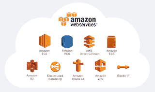
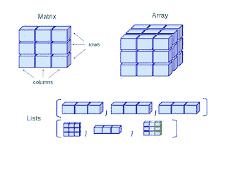
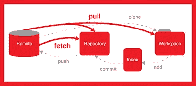
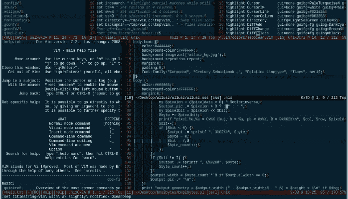
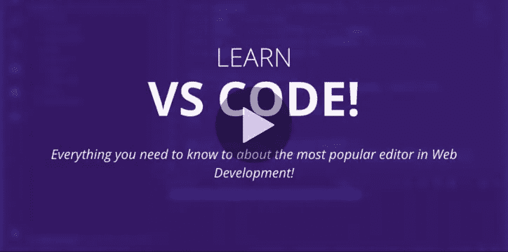
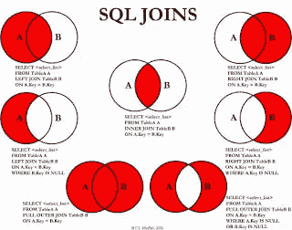
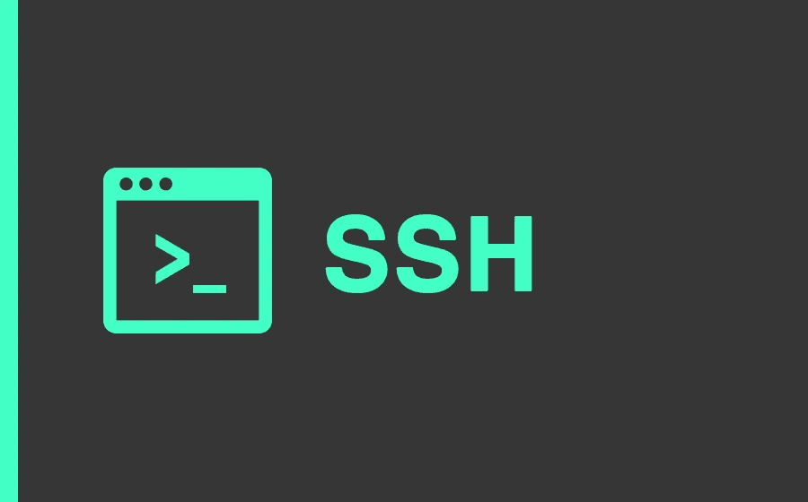
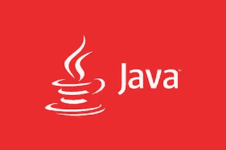
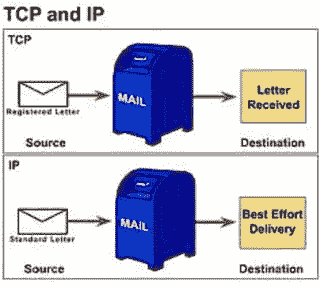
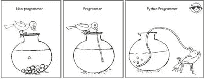

# 2023 年成为软件开发人员的 11 项基本技能

> 原文：<https://medium.com/javarevisited/11-essential-skills-to-become-software-developer-in-2020-c617e293e90e?source=collection_archive---------0----------------------->

## 程序员和软件开发人员 2023 年要学习的关键技能

朋友你好，如果你做软件开发已经有一段时间了，在思考怎样才算一个好的程序员？2023 年一个程序员应该学什么才能成为更好的开发者？计算机专业毕业生为了从事软件开发和编程的职业，应该提前学些什么？

> 我从脸书的许多学生和关注我的电子邮件中收到了一些常见的问题，即初级开发人员应该具备哪些技能。

这些人大多是大学毕业生和初学者，由于互联网，他们现在可以获得丰富的信息，并渴望提前学习技能，为他们的编程工作面试做准备。

在这篇文章中，我将分享 11 个技能，我相信，每个程序员都应该在 2023 年知道或学习这些技能。

这包括像 C++或 Java 这样的编程语言，像[数据结构](/free-code-camp/these-are-the-best-free-courses-to-learn-data-structures-and-algorithms-in-depth-4d52f0d6b35a)、[算法](/javarevisited/10-best-books-for-data-structure-and-algorithms-for-beginners-in-java-c-c-and-python-5e3d9b478eb1)和计算机网络基础知识这样的基本计算机科学概念，像 Git、 [Docker](/@javinpaul/10-free-courses-to-learn-docker-and-devops-for-frontend-developers-691ac7652cee) 、 [Kubernetes](/javarevisited/top-10-courses-to-learn-devops-for-experienced-programmers-d93b666db151) 这样的重要工具和一般容器，像 [AWS](https://javarevisited.blogspot.com/2019/05/top-5-courses-to-crack-aws-solutions-architect-associate-certification-exam-SAA-C01.html#axzz5rHwAwycj) 、GCP、微软 Azure 这样的云计算概念和平台，以及像 SQL 和 UNIX 这样的常青树技能，像 [Eclipse](/javarevisited/top-10-courses-to-learn-eclipse-junit-and-mockito-for-java-developers-4de1e8d62b96) 或 Visual Studio Code 这样的编辑器，以及像 VIM 和 NotePad+这样的文本编辑器

这个列表并不完整，但是它为程序员应该知道的技能提供了一个很好的起点。如果你的目标是软件开发职业，并寻找一份编程工作，那么这些是你可以学习和提高的东西，以保持在竞争中的领先地位。

# 2023 年软件开发人员的 11 大必备技能

话不多说，这里列出了我个人认为每个程序员都应该知道的技能，不管他做的是什么工作。这些都是必备技能，会长期为你服务。在这方面投入的时间、金钱和努力将有助于你在职业生涯中获得回报。

## 1.云计算技能(AWS、GCP 或 Azure)

除了容器，云是我认为每个软件开发人员和数据科学家在 2023 年应该学习的另一件事。各种规模和领域的公司现在都在将其环境转移到云中，以节省成本和提高可扩展性，这意味着迟早您需要使用云原生应用程序。

它们对于数据科学、机器学习和人工智能领域的所有朝阳发展也是必不可少的，因为只有云才能提供这些资源饥渴模型所需的计算能力。

学习云平台像*亚马逊 Web 服务* ( [*AWS*](/javarevisited/10-best-aws-certified-cloud-practitioner-clf-c01-online-courses-and-practice-test-to-crack-ecc0f913091e?source=---------12----------------------------) )，*谷歌云平台(*[*GCP*](/javarevisited/5-best-courses-to-learn-google-cloud-platform-gcp-in-2021-169093a3771a)*)*或 [*微软 Azure*](/javarevisited/5-best-azure-fundamentals-courses-to-pass-az-900-certification-exam-in-2020-9e602aea035d) 不仅在你目前的工作岗位上，而且在下一个岗位上，都会比你的竞争对手领先一步。你不需要学所有的，事实上，学一门意味着你会对其他的有一个公平的想法。

首先，我建议你学习 AWS，因为它是最受欢迎和最成熟的云平台，对拥有 AWS 知识的开发人员和系统管理员有强烈的需求。如果你需要资源，我推荐云专家 [Stéphane Maarek](https://medium.com/u/98189c4cef0?source=post_page-----c617e293e90e--------------------------------) 开设的 [**终极 AWS 认证解决方案架构师助理**](https://click.linksynergy.com/deeplink?id=JVFxdTr9V80&mid=39197&murl=https%3A%2F%2Fwww.udemy.com%2Fcourse%2Faws-certified-solutions-architect-associate-saa-c02%2F) 课程。这不仅有助于你深入学习 AWS，也为你准备 AWS 认证。

## 2.数据结构和算法

如果你想成为一名程序员，那么你应该很好地了解数据结构和算法；无处可逃。这是任何编程工作面试的重要话题之一，如果你不知道基本的数据结构，比如一个[数组](https://javarevisited.blogspot.com/2015/06/top-20-array-interview-questions-and-answers.html)、[链表](http://javarevisited.blogspot.sg/2017/07/top-10-linked-list-coding-questions-and.html#axzz4xXS86IVo)、[映射](http://www.java67.com/2017/08/top-10-java-hashmap-interview-questions.html)、集合，就不可能写出一个真实世界的应用程序。

这就是为什么每个程序员都应该在他们的计算机科学课程中努力学习数据结构和算法。

如果你是一个自学成才的程序员，那么你也必须知道数据结构和算法；其实很多编程 bootcamp 第一件事都会教你数据结构和算法。如果你需要一门课程，我强烈推荐你去看看 Udemy 上 Tim Buchalaka 的 [**数据结构和算法:使用 Java**](https://click.linksynergy.com/fs-bin/click?id=JVFxdTr9V80&subid=0&offerid=323058.1&type=10&tmpid=14538&RD_PARM1=https%3A%2F%2Fwww.udemy.com%2Fdata-structures-and-algorithms-deep-dive-using-java%2F) 课程。

如果你需要免费的资源来学习数据结构和算法，你可以在媒体上查看这些免费的算法课程。

## 3.Git 和 Github

源代码控制是用来存储代码的，如果你想成为一名程序员或软件开发人员，你必须知道像 Git 和 SVN 这样的版本控制工具。

谢天谢地 Git 和 Github 精简了市场，现在超过 70%的组织使用 Git；因此，你可以通过学习 Git 来逃避。

顺便说一句，你应该努力学好 Git，就像你应该熟悉分支和合并等高级版本控制概念以及工具本身，我的意思是，无论是在命令行上还是使用 GUI。对于初学者来说，[**GitHub Ultimate:Master Git 和 GitHub**](https://click.linksynergy.com/fs-bin/click?id=JVFxdTr9V80&subid=0&offerid=634352.1&type=10&tmpid=14538&RD_PARM1=https%3A%2F%2Fwww.udemy.com%2Fgithub-ultimate%2F) 是正确的起点。

而且，如果你需要一个免费的在线课程来学习 Git，可以看看这些在 Medium 上的免费 Git 课程

## 4.集装箱(Docker 和 Kubernetes)

2023 年，我相信每个程序员、软件工程师、数据科学家，甚至项目经理都应该知道 Docker 和 Kubernetes 这样的容器和工具。

现在已经证明，像 Docker 这样的容器不仅可以帮助开发人员在统一的环境中测试他们的应用程序，还可以简化部署过程。

在 **Docker** 的帮助下，你可以一次性快速部署你的应用程序及其所有的依赖项，它还为你提供了进程隔离。类似地，Kubernetes，这是一个容器编排工具，将它带到了一个新的层次，可以为您管理容器。

这意味着你不需要担心你的应用程序的可伸缩性，并且 **Kubernetes** 或者 K8s 可以自动为你做这些。如果你想在 2023 年学习一项新技能，我建议你学习 Docker 和 Kubernetes，这不仅对你目前的工作有帮助，而且对下一份工作也有帮助，因为它们也是各种规模的公司最热门的技能。

而且，如果你已经意识到了容器的重要性，并且正在寻找学习 Docker 和 Kubernetes 的资源，我建议你加入 Stephen Grider 的畅销课程— [**Docker 和 Kubernetes:The Complete Guide**](https://click.linksynergy.com/deeplink?id=JVFxdTr9V80&mid=39197&murl=https%3A%2F%2Fwww.udemy.com%2Fcourse%2Fdocker-and-kubernetes-the-complete-guide%2F)，这是学习这两项必备技能的最佳课程之一。

如果你需要一些免费的课程材料，我也建议你先看看这些免费的 Docker 课程。

## 5.精力

作为程序员，我没有一天不使用文本编辑器。即使对于非程序员和任何使用计算机的人来说，它也是必不可少的工具。

我主要在 Windows 上使用记事本，在 Linux 上使用 VIM，但是现在，你有很多高级编辑器可供选择，比如 Sublime 和 NotePad++，它们提供了类似 IDE 的功能。

我建议你花些时间学习你最喜欢的编辑器和键盘快捷键，生产力提示是你可以学习的。如果你喜欢 VIM，那就去学 VIM 吧，你不会后悔你的决定。如果你需要推荐，那么[杰森·卡农](https://medium.com/u/7f779f7af3ef?source=post_page-----c617e293e90e--------------------------------)的 [**VIM 大师班**](https://click.linksynergy.com/deeplink?id=JVFxdTr9V80&mid=39197&murl=https%3A%2F%2Fwww.udemy.com%2Fcourse%2Fvim-commands-cheat-sheet%2F) 是学习这些技能的绝佳课程。

而且，如果你需要更多的选择，可以看看我关于[最佳 VIM 课程](https://javarevisited.blogspot.com/2020/04/top-5-courses-to-learn-vim-editor-in-Linux.html)的文章，里面有更多深入学习 VIM 的选择。

## 6.ide(vs code 或 IntelliJIDEA)

像 Eclipse 或 Visual Studio 代码这样的现代 ide 对于任何程序员来说都是最重要的工具。对于 C、C++和 C#程序员来说，选择是明确的，Visual Studio 和 Python 开发人员来说，Jupiter Notebook 每天都在变得越来越好。

如果你想学习 VS 代码，建议你在 Udemy 上加入[**Learn Visual Studio Code**](https://click.linksynergy.com/deeplink?id=JVFxdTr9V80&mid=39197&murl=https%3A%2F%2Fwww.udemy.com%2Fcourse%2Flearn-visual-studio-code%2F)by[James Quick](https://medium.com/u/11d2e4d97536?source=post_page-----c617e293e90e--------------------------------)。

对于 Java 程序员来说，有三个主要的 IDE 可以选择，像 Eclipse、NetBeans 和 IntelliJ，而 [Eclipse](/javarevisited/top-10-courses-to-learn-eclipse-junit-and-mockito-for-java-developers-4de1e8d62b96) 是我的最爱， [IntelliJIDEA](https://itnext.io/top-5-intellijidea-and-android-studio-courses-for-java-and-android-programmers-afcc27309b60) 一点也不差。

如果你想更好地学习 IDEA，你也可以去看看**由[陶 W](https://medium.com/u/96d8feaeb19f?source=post_page-----c617e293e90e--------------------------------) 和[李中清](https://medium.com/u/73cfaf96b88b?source=post_page-----c617e293e90e--------------------------------)教授的课程**

****

## **7.数据库和 SQL**

**SQL 是一个经典，它已经存在了 30 多年，我认为它还会存在 30 年。鉴于数据库的无处不在，程序员应该熟悉基本的数据库概念，如规范化、表设计以及 SQL。**

**数据库有很多，像 Oracle， [MySQL](/@javinpaul/top-5-courses-to-learn-mysql-in-2020-4ffada70656f) ，微软 SQL Server，PostgreSQL 等等。但是只知道一个就够了。关键是你应该熟悉数据库。您应该知道如何插入/更新/删除数据，并编写 SQL 查询来检索数据。**

**像加入一个聚合函数这样的高级概念的知识是一个很大的奖励，如果你想得到它，那么何塞·马西亚尔·波尔蒂利亚的 [**完整的 SQL 训练营**](https://click.linksynergy.com/fs-bin/click?id=JVFxdTr9V80&subid=0&offerid=323058.1&type=10&tmpid=14538&RD_PARM1=https%3A%2F%2Fwww.udemy.com%2Fthe-complete-sql-bootcamp%2F) 是一个很好的开始课程。**

****

**而且，如果你需要免费资源，那么这些[Medium 上的免费 SQL 课程](/javarevisited/7-free-courses-to-learn-database-and-sql-for-programmers-and-data-scientist-e7ae19514ed2)是一个很好的起点。**

## **8.Linux (UNIX)**

**和 SQL 一样，UNIX 也经受住了时间的考验。它也已经存在了 30 多年，我希望在未来的许多年里它还会存在。由于大多数时候，程序员不得不在 UNIX 机器上工作，就像 Linux 服务器一样，对 Linux 命令行的良好知识大有帮助。**

**它让你有效地工作。您可以搜索文件，通过检查系统的 CPU 和内存使用情况来了解系统的情况，并执行基本和高级任务。**

**如果你想学习 Linux 命令，我建议在 Udemy 上通过[**5 天学习 Linux 并升级你的职业**](https://click.linksynergy.com/fs-bin/click?id=JVFxdTr9V80&subid=0&offerid=562016.1&type=10&tmpid=14538&RD_PARM1=https%3A%2F%2Fwww.udemy.com%2Flearn-linux-in-5-days%2F) 课程**

****

**而且，如果你需要一些免费资源，那么你也可以在 Medium 上查看这些[免费 Linux 课程](/javarevisited/top-10-courses-to-learn-linux-command-line-in-2020-best-and-free-f3ee4a78d0c0)。**

## **9.面向对象编程**

**作为一名程序员，你必须知道一门编程语言，比如 [C++](/javarevisited/top-10-courses-to-learn-c-for-beginners-best-and-free-4afc262a544e) 或者 [Java](/javarevisited/top-5-java-online-courses-for-beginners-best-of-lot-1e1e240a758) 或者可能是 [Python](/javarevisited/10-free-python-tutorials-and-courses-from-google-microsoft-and-coursera-for-beginners-96b9ad20b4e6) 或者 [JavaScript](/javarevisited/my-favorite-free-tutorials-and-courses-to-learn-javascript-8f4d0a71faf2) 。你想选什么都可以，但我个人的建议是你至少要懂 Java。**

**一开始就很简单，这也是为什么初学者的正确选择。它也非常强大，允许你做几乎任何事情。**

**它有做基础工作的库，比如 web 开发和大数据等等。如果你决定学习 Java，那么 [**完整的 Java MasterClass**](https://click.linksynergy.com/fs-bin/click?id=JVFxdTr9V80&subid=0&offerid=323058.1&type=10&tmpid=14538&RD_PARM1=https%3A%2F%2Fwww.udemy.com%2Fjava-the-complete-java-developer-course%2F) 可能是最好的入手点。**

****

**而且，如果你需要一些免费的选择来学习 Java，那么这些免费的 Java 课程可能是最好的开始。**

## **10.计算机网络**

**当今的世界是一个互联的世界，无论你走到哪里，你都会发现计算机网络，从你使用 WIFI 的家里到学校、大学和办公室，通过局域网(LAN)连接到互联网。**

**您将编写的大多数应用程序也不是独立的，而是客户端-服务器类型的应用程序，请求将通过网络到达服务器。客户将从世界任何地方访问您的应用程序。**

**底线是您必须了解网络基础知识，以理解、开发和支持您的应用程序。**

**如果你想了解更多，那么我建议你加入 Udemy 上的 [**完整的网络基础**](https://click.linksynergy.com/fs-bin/click?id=JVFxdTr9V80&subid=0&offerid=634352.1&type=10&tmpid=14538&RD_PARM1=https%3A%2F%2Fwww.udemy.com%2Fcomplete-networking-fundamentals-course-ccna-start%2F) 课程。初学者的良好起点。**

****

## **11.脚本**

**在第 8 点，我要求你学习一门编程语言，而在这里我要求你学习一门脚本语言？为什么？同一个编程语言能不能不做脚本语言？**

**毫无疑问，有一些语言既适合 OOP 编码也适合脚本编写，比如 Python，这就是为什么我要求你至少学习它，但是如果你碰巧学习了 C/C++或 Java，那么你就不能像 Python 或 Perl 开发人员那样快速地写出一些东西。**

**如果你想学习 Python 并且需要一门课程， [**完整的 Python Bootcamp**](https://click.linksynergy.com/fs-bin/click?id=JVFxdTr9V80&subid=0&offerid=634352.1&type=10&tmpid=14538&RD_PARM1=https%3A%2F%2Fwww.udemy.com%2Fcomplete-python-bootcamp%2F) 是一门很好的入门课程。**

****

**脚本语言使得创建工具和脚本来解决编程世界中的常见问题变得容易。如果你很好地掌握了脚本语言，比如 Python，那么你就可以很容易地自动化普通的东西。**

**再次建议你学习 Python 一举两得，如果你还需要一些更多的资源，这份来自微软和谷歌的 [**免费 Python 教程**](/better-programming/my-favorite-free-courses-to-learn-python-in-depth-95eb9508d042) 列表也是有益的。**

**这就是每个程序员都应该学习的 11 项技能。计算机科学毕业生和渴望成为程序员的人可以使用这个列表来找到成为一名成功的程序员所需的工具和技能。**

**顺便说一句，如果你有兴趣了解更多程序员应该知道的事情，在程序员必备的东西方面有很多指导，你可以在网上找到很好的建议，如 [**97 程序员应该知道的事情**](https://www.amazon.com/Things-Every-Programmer-Should-Know/dp/0596809484/?tag=javamysqlanta-20) ，这是每个认真的程序员的必读。**

**其他**编程文章**你可能喜欢的
[10 本算法书每个程序员都应该读的](http://www.java67.com/2015/09/top-10-algorithm-books-every-programmer-read-learn.html)
[10 个工具每个软件工程师都应该知道的](https://javarevisited.blogspot.com/2018/01/10-tools-every-software-developer-know.html)
[2023 年 Java 开发者路线图](https://javarevisited.blogspot.com/2019/10/the-java-developer-roadmap.html#axzz64YOHJ2TL)
[程序员和开发者的 10 个高薪职业选择](http://javarevisited.blogspot.sg/2018/02/top-10-highest-paying-technical-jobs-programmers-software-developers.html#axzz58Gi5STbU)
[成为更好的 Java 开发者的 10 个技巧](https://javarevisited.blogspot.com/2018/05/10-tips-to-become-better-java-developer.html)
[完整的 Web 开发者路线图](https://javarevisited.blogspot.com/2019/02/the-2019-web-developer-roadmap.html#axzz63HbZbxLC)
[提高你的 10 个技巧 设计原则每个程序员都应该知道的](https://javarevisited.blogspot.com/2014/01/10-tips-to-improve-programming-skill-become-better-programmer.html)
[100+程序员的数据结构和算法问题](http://www.java67.com/2018/06/data-structure-and-algorithm-interview-questions-programmers.html)
[Java 程序员的 10 个单元测试工具](http://javarevisited.blogspot.sg/2018/01/10-unit-testing-and-integration-tools-for-java-programmers.html)**

**感谢您阅读本文。如果你觉得这篇文章有用，那么请分享给你的朋友和同事。如果您有任何问题或反馈，请留言。**

**如果你认为我错过了一个对程序员有益的关键技能，并且一个人应该学习它，请随意提出建议，我很乐意将它纳入本文。毕竟编程是一个旅程，每天我们都会学到一些重要的东西。**

## **你可能喜欢的其他媒体文章**

** [## 完整的 Web 开发者路线图

### 成为网页开发者的图解指南，并提供相关课程的链接

medium.com](/hackernoon/the-2019-web-developer-roadmap-ab89ac3c380e)  [## 完整的 DevOps 路线图

### 成为前端或后端开发人员的图解指南，提供课程链接

medium.com](/hackernoon/the-2018-devops-roadmap-31588d8670cb)  [## 面向程序员的 5 门免费面向对象编程在线课程

### 成为 DevOps 工程师的图解指南，包含相关课程的链接

medium.com](/swlh/5-free-object-oriented-programming-online-courses-for-programmers-156afd0a3a73)**