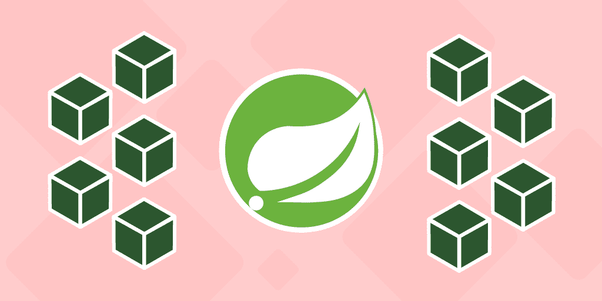
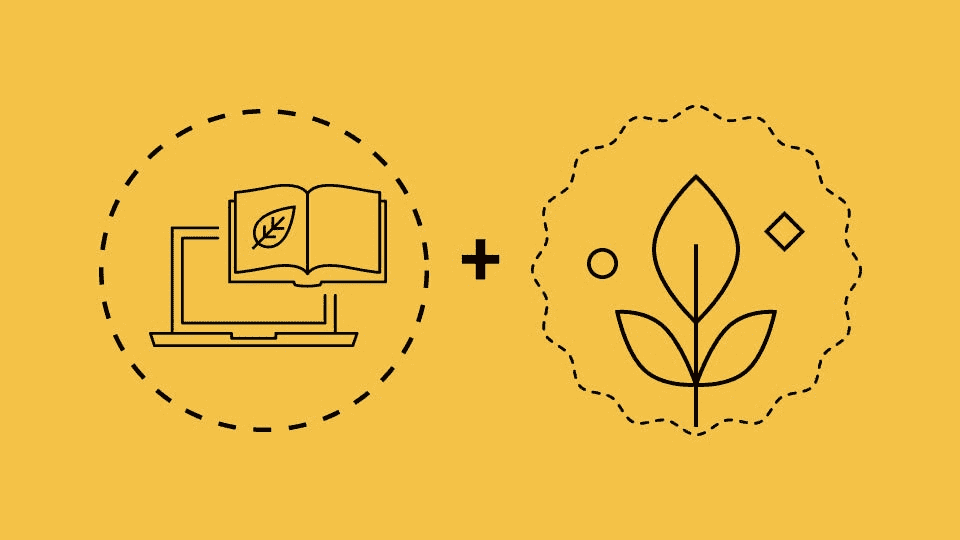
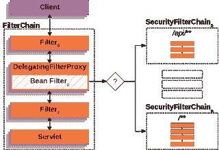
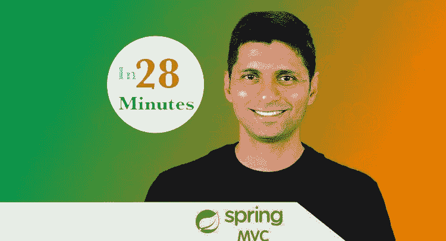
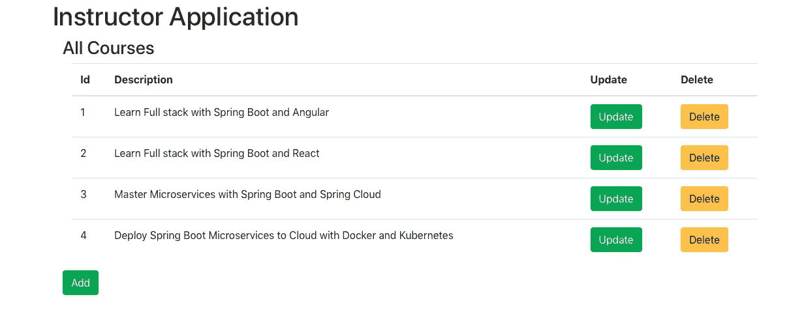
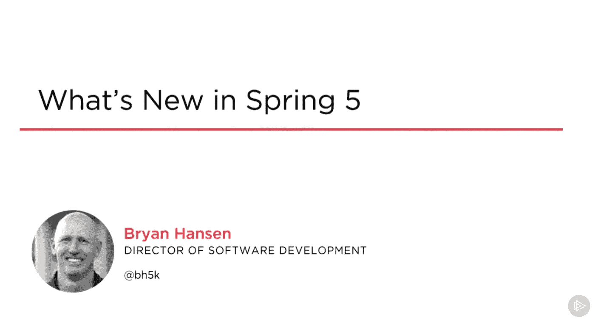

# 2023 年面向 Java 程序员的 12 门高级 Spring 框架课程

> 原文：<https://medium.com/javarevisited/12-advanced-spring-framework-courses-for-java-programmers-a273f6e4448c?source=collection_archive---------0----------------------->

## 我最喜欢的 Java 程序员学习 Spring Boot、Hibernate、Spring Cloud、Spring Security、Spring Data JPA、2023 年 Spring Boot 测试的高级 Spring 框架课程

image_credit —教育性

Java 程序员你好，如果你想深入学习 Spring 框架，找一些高级的 Spring 在线课程来学习像 Spring Boot、Spring Cloud、Spring Data JPA、Spring Security、Spring MVC 等东西，你来对地方了。

前面我已经分享了学习</javarevisited/top-10-courses-to-learn-spring-boot-in-2020-best-of-lot-6ffce88a1b6e?source=---------39------------------>**[**微服务**](/javarevisited/10-best-java-microservices-courses-with-spring-boot-and-spring-cloud-6d04556bdfed)[**Hibernate**](/javarevisited/top-5-hibernate-online-training-courses-for-beginners-and-advance-java-programmers-469460596b2b)**和**[**JPA**](/javarevisited/5-best-spring-data-jpa-courses-for-java-developers-45e6438be3c9)**的最佳课程，在这篇文章中，我将为有经验的 Java 开发人员分享最好最先进的 Spring 框架课程。****

****毫无疑问，Spring 框架可能是 Java 开发人员最重要的技能，但是仅仅了解 Spring 也是不够的。****

****从 core Spring 到 [Spring MVC](/javarevisited/my-favorite-spring-mvc-courses-for-java-developers-5ede7f85dd88) ，从 Spring 到 Spring Boot， [Spring Cloud](/javarevisited/7-best-courses-to-learn-spring-boot-with-aws-and-azure-cloud-platform-9f953d12bb93) ，再到现在的 Reactive Spring，Spring 框架有这么多的进步，从 REST APIs 到微服务，作为一个有经验的 Java 和 Spring 开发者，有很多东西需要学习。****

****虽然大多数 Java 开发人员已经了解 Spring 框架的基础知识，如[依赖注入](https://javarevisited.blogspot.com/2012/12/inversion-of-control-dependency-injection-design-pattern-spring-example-tutorial.html)和[控制反转](https://javarevisited.blogspot.com/2012/12/inversion-of-control-dependency-injection-design-pattern-spring-example-tutorial.html)，并且熟悉 Spring MVC 注释和工作流，但是没有多少人了解 Spring Boot、Spring Cloud 和 Reactive Spring。****

****我收到了很多关于课程、书籍和教程的请求，以学习这些高级的 Spring 框架和概念，特别是来自具有 2 到 5 年甚至 10 年经验的中级和有经验的 Java 开发人员。在单独回答了其中的许多问题后，我决定将我一直与我的朋友和读者分享的那些高级 Spring 框架课程放在一起，这里是为有经验的开发人员提供的高级 Spring 框架课程列表。

如果你也想学习这些高级的 Spring 框架概念像[Spring Cloud](https://javarevisited.blogspot.com/2018/04/top-5-spring-cloud-courses-for-java.html#axzz6cRYbn916)[微服务](https://javarevisited.blogspot.com/2018/02/top-5-spring-microservices-courses-with-spring-boot-and-spring-cloud.html#axzz6sTbbxwp7)[Spring Data JPA](https://www.java67.com/2021/11/best-hibernate-and-spring-data-jpa-courses.html)，甚至 REST 开发的 Spring MVC，那你来对地方了。本文将为有经验的 Java 程序员分享 12 门高级 Spring 课程。****

# ****2023 年面向有经验的 Java 程序员的 12 门高级 Spring 框架课程****

****在不浪费您更多时间的情况下，这里列出了一些学习高级 Spring 概念和框架的最佳课程，如 Spring MVC、Spring Boot、Spring Cloud、微服务、测试 Spring 应用程序、Spring Data 等等。****

## ****1.[初学的春天和冬眠(包括 Spring Boot)](https://click.linksynergy.com/deeplink?id=JVFxdTr9V80&mid=39197&murl=https%3A%2F%2Fwww.udemy.com%2Fcourse%2Fspring-hibernate-tutorial%2F)****

****这是学习 Java 程序员三个有用技能的最好课程之一，Spring、Hibernate 和 Spring Boot。如果你正在寻找一门学习最基本的 Java 框架的课程，那么这门课是你应该参加的。****

****由 Chad Darby 创建，这是一个非常实用的课程，学习 Udemy 上的 Spring、Hibernate 和 Spring Boot 的基本知识。它也是最受欢迎的课程之一，拥有超过 20 万名学生，是评分最高的课程，平均评分为 4.5+分。****

****这个课程是专门为初学者创建的，这意味着不需要 Spring 和 Hibernate 的先验知识，但是你需要熟悉 Java 编程概念。如果你刚开始接触 Spring 和 Hibernate，我强烈推荐你上这门课。****

******这里是加入这个课程的链接**——[初学的春天和冬眠(包括 Spring Boot)](https://click.linksynergy.com/deeplink?id=JVFxdTr9V80&mid=39197&murl=https%3A%2F%2Fwww.udemy.com%2Fcourse%2Fspring-hibernate-tutorial%2F)****

********

## ****2.[和 Spring Boot 一起玩 Java 全栈并做出反应](https://click.linksynergy.com/deeplink?id=JVFxdTr9V80&mid=39197&murl=https%3A%2F%2Fwww.udemy.com%2Fcourse%2Ffull-stack-application-with-spring-boot-and-react%2F)****

****全栈 Java 开发人员需求量很大，如果你也想成为全栈 Java 开发人员，那么这个课程就是为你准备的。本课程将向您介绍 Spring boot 和 React.js，这是用 Java 构建全栈应用程序的两种最流行的技术。****

****虽然你也可以使用 [Angular](/javarevisited/10-courses-to-learn-angular-for-web-development-6da1bd2856dc?source=---------8------------------) 和 [Vue.js](/javarevisited/top-5-online-courses-to-learn-vue-js-in-2021-249e66b60646) 来构建前端，但我强烈推荐你选择 React.js，因为它是最受欢迎的一个，许多公司都在寻找拥有 [React.js](https://javarevisited.blogspot.com/2018/08/top-5-react-js-and-redux-courses-to-learn-online.html#axzz5r06B3egD) 技能的程序员。****

****如果你已经决定在 2023 年学习 Spring Boot 和 React.js，那么我强烈推荐 Udemy 上的 Ranga Karnam 的这门课程。这是最受欢迎的课程之一，已经有 50，000 名 Java 程序员加入，平均得分为 4.5+分。****

******这是加入本课程的链接** — [与 Spring Boot 一起学习 Java 全栈并做出反应](https://click.linksynergy.com/deeplink?id=JVFxdTr9V80&mid=39197&murl=https%3A%2F%2Fwww.udemy.com%2Fcourse%2Ffull-stack-application-with-spring-boot-and-react%2F)****

********

## ****3. [Spring 框架 5:初学者到大师](https://click.linksynergy.com/deeplink?id=JVFxdTr9V80&mid=39197&murl=https%3A%2F%2Fwww.udemy.com%2Fcourse%2Fspring-framework-5-beginner-to-guru%2F)****

****如果您刚开始使用 Spring，并且还想学习高级特性，比如使用 Spring 进行反应式编程，那么这是一个很好的课程。这涵盖了 Spring 5，并向您介绍了作为 Java 开发人员需要了解的所有重要的 Spring 概念和特性。****

****我也非常喜欢约翰·汤姆逊的教学风格和他亲自动手的例子。如果你想从零开始学习反作用弹簧、WebFlux 和所有其他弹簧 5 的变化，那么我强烈推荐你加入 Udemy 的这个最好的弹簧课程。****

****您不仅将学习核心的 spring 基础知识、Spring 5 和 Spring Boot 2，还将学习如何使用 Spring Data JPA 和 Hibernate 访问数据。更重要的是，您还将有机会学习如何在 [Docker 容器](https://javarevisited.blogspot.com/2019/05/top-5-courses-to-learn-docker-and-kubernetes-for-devops.html#axzz6u4HTHz4Z)中运行 Spring Boot 应用程序。****

******这里是加入本课程** — [Spring Framework 5:初学者到大师](https://click.linksynergy.com/deeplink?id=JVFxdTr9V80&mid=39197&murl=https%3A%2F%2Fwww.udemy.com%2Fcourse%2Fspring-framework-5-beginner-to-guru%2F)的链接****

********

## ****4.欧根·帕拉斯基夫的《安息吧，春天》****

****对于想用 Java 开发 RESTful Web 服务的人来说，这是最好的春季课程。由 Baeldung 的 Eugen Paraschive 创建，这个令人敬畏的课程将教你如何使用 Spring 在 Java 中创建 REST web 服务。****

****取消与其他在线 REST 课程的链接，这不仅教你基础知识，还教你创建专业级 RESTful web 服务所需的高级和实用概念，如如何保护 REST APIs，如何记录它们，以及如何以一致的方式更新它们。****

****如果你真的想把你的休息技巧提升到一个新的水平，那么我向你强烈推荐这个课程。****

******这是加入本课程的链接**——[欧根·帕拉斯基夫的《与春天同眠》](http://www.baeldung.com/rest-with-spring-course?utm_source=javarevisited&utm_medium=web&utm_campaign=rws&affcode=22136_bkwjs9xa)****

********

## ****5.[春季安全零到掌握](https://click.linksynergy.com/deeplink?id=CuIbQrBnhiw&mid=39197&murl=https%3A%2F%2Fwww.udemy.com%2Fcourse%2Fspring-security-zero-to-master%2F)****

****Spring 安全性是 Spring 框架的另一个重要部分，每个有经验的 Java 开发人员都应该学习。您可以使用 Spring Security 来保护您的 web 应用程序并实现身份验证和授权，如果您想[深入了解 Spring Security](/javarevisited/top-10-courses-to-learn-spring-security-and-oauth2-with-spring-boot-for-java-developers-8f0222d6066d?source=---------5-----------------------)，这个 Udemy 课程是最好的 Spring Security 课程之一。****

****以下是您将在本课程中学到的内容:****

*   ****Spring 安全框架、概念及其工作原理的基础知识****
*   ****什么是 CSRF，CORS，JWT，OAUTH2****
*   ****如何在 Java web 应用中实现 Spring 安全性****
*   ****核心 Java 和 web 应用程序中的方法级安全性****
*   ****用户角色和访问控制****

****由 Eazy Bytes 创建的这个 9 小时的课程是[学习 Spring Security](https://javarevisited.blogspot.com/2019/06/3-books-and-courses-to-learn-spring-security-in-depth.html#axzz6rQaZvLlb) 的最新课程，我向所有想要掌握 Spring Security 的有经验的 Java 开发人员强烈推荐这个课程。****

******以下是加入本课程** — [春季安全零至掌握](https://click.linksynergy.com/deeplink?id=CuIbQrBnhiw&mid=39197&murl=https%3A%2F%2Fwww.udemy.com%2Fcourse%2Fspring-security-zero-to-master%2F)的链接****

********

## ****6.[初学者的 Spring MVC 用 25 个步骤构建 Java Web App](https://click.linksynergy.com/deeplink?id=JVFxdTr9V80&mid=39197&murl=https%3A%2F%2Fwww.udemy.com%2Fcourse%2Fspring-mvc-tutorial-for-beginners-step-by-step%2F)****

****这是初学者学习 Spring MVC 最好的在线课程之一。我将本课程包含在高级 spring 框架课程列表中，因为它侧重于 Spring MVC，并为您提供了构建 Todo 管理应用程序的实际操作和分步指南！****

****以下是您将在本课程中学到的内容:****

*   ****如何在 [Spring MVC](https://javarevisited.blogspot.com/2020/08/top-5-courses-to-learn-spring-mvc-for.html#axzz6l7a2SLSi) 中进行代码绑定和验证****
*   ****如何构建 spring rest web 服务？****
*   ****如何使用 maven 和 Spring 进行依赖管理****
*   ****学习基础 [Spring MVC 注释](https://www.java67.com/2019/04/top-10-spring-mvc-and-rest-annotations-examples-java.html)****
*   ****如何使用 spring security 进行身份验证和授权****
*   ****如何在 Spring MVC 中处理异常****
*   ****如何使用 Tomcat 和 Eclipse 构建 Spring MVC 应用程序？****

****我经常说，没有比构建项目更好的学习新技术或框架的方法了，而本课程正好符合这个要求。如果你想详细学习 Spring MVC，你应该加入这个课程。****

******这里是加入本课程的链接**——[Spring MVC For 初学者——用 25 个步骤构建 Java Web App](https://click.linksynergy.com/deeplink?id=JVFxdTr9V80&mid=39197&murl=https%3A%2F%2Fwww.udemy.com%2Fcourse%2Fspring-mvc-tutorial-for-beginners-step-by-step%2F)****

********

## ****7.[学习 AWS —将 Java Spring Boot 部署到 AWS 弹性豆茎](https://click.linksynergy.com/deeplink?id=JVFxdTr9V80&mid=39197&murl=https%3A%2F%2Fwww.udemy.com%2Fcourse%2Fdeploy-java-spring-boot-to-aws-amazon-web-service%2F)****

****这是如何使用 AWS Elastic Beanstack 等服务在 Amazon AWS 上部署 Spring 应用程序的另一个精彩之处。您可以通过本课程从 Java 开发人员的角度学习 AWS 和 Spring Boot 部署。****

****以下是您将在本课程中学到的内容:****

*   ****亚马逊网络服务基础****
*   ****如何将 Spring Boot 应用部署到 [AWS](/javarevisited/5-best-aws-courses-for-beginners-and-experienced-developers-to-learn-in-2021-563212409fbd?source=rss-bb36d8439904------2&utm_source=dlvr.it&utm_medium=linkedin)****
*   ****如何使用 AWS 弹性豆茎和 S3****
*   ****如何将 Spring Boot 应用程序容器化****
*   ****如何在 AWS 中部署容器化的 Spring boot 应用程序****
*   ****将 Spring Boot REST API 部署到 AWS 中****

****总的来说，这是一门很棒的实践课程，学习如何将 Spring Boot 应用程序部署到 Amazon Web Services 中。好本事在这个[云计算](https://javarevisited.blogspot.com/2019/07/top-5-online-courses-to-learn-cloud-computing-aws.html#axzz6qnblZnVj)和[微服务](https://javarevisited.blogspot.com/2019/09/top-5-courses-to-learn-soa-service-oriented-architecture-microservices.html)的世界里。****

******以下是加入本课程的链接** — [学习 AWS —将 Java Spring Boot 部署到 AWS Elastic Beanstalk](https://click.linksynergy.com/deeplink?id=JVFxdTr9V80&mid=39197&murl=https%3A%2F%2Fwww.udemy.com%2Fcourse%2Fdeploy-java-spring-boot-to-aws-amazon-web-service%2F)****

********

## ****8.[用 Spring 框架 5 进行反应式编程](https://click.linksynergy.com/deeplink?id=JVFxdTr9V80&mid=39197&murl=https%3A%2F%2Fwww.udemy.com%2Fcourse%2Freactive-programming-with-spring-framework-5%2F)****

****作为一个有经验的 Java 开发者，我强烈推荐你去看看并学习反应式编程范式，这是一种开发可伸缩 Java 应用和微服务的新方法，幸运的是 Spring 支持反应式编程。****

****由我最喜欢的导师约翰·汤姆逊创建，这门课程将教你创建反应式 Spring Boot 微服务所需的一切。****

****以下是您将在本课程中学到的关键技能:****

*   ****如何使用 Spring 框架的反应式编程特性****
*   ****用 Java 进行函数式编程****
*   ****如何使用 WebFlux 构建反应式微服务****
*   ****如何在 Spring 数据中使用 Reactive 类型 [MongoDB](/javarevisited/5-best-mongodb-courses-to-learn-nosql-for-beginners-in-2020-42df5af5496c)****
*   ****Java 8 流和函数式编程****

****总的来说，这是一门学习 Java 和 [Spring Framework](https://javarevisited.blogspot.com/2018/06/top-6-spring-framework-online-courses-Java-programmers.html) 反应式编程技巧的好课程，对有经验的 Java 开发人员非常有用。****

******这里是加入本课程** — [用 Spring Framework 5](https://click.linksynergy.com/deeplink?id=JVFxdTr9V80&mid=39197&murl=https%3A%2F%2Fwww.udemy.com%2Fcourse%2Freactive-programming-with-spring-framework-5%2F) 进行反应式编程的链接****

********

## ****9.[AWS 上的 Spring 框架 devo PS](https://click.linksynergy.com/deeplink?id=JVFxdTr9V80&mid=39197&murl=https%3A%2F%2Fwww.udemy.com%2Fcourse%2Fspring-core-devops-on-aws%2F)****

****作为一名高级开发人员，学习 DevOps 并在内部和云中构建 CI/CD 也是您的责任。本课程将教您如何在 [AWS](https://javarevisited.blogspot.com/2020/05/top-5-amazon-web-services-aws-courses-for-beginners-and-experienced-programmers.html#axzz6f4s58Ml9) 上将 Spring Boot 应用程序部署到云中。该课程由约翰·汤姆逊创建，将向您展示如何在云上打包和部署您的 Spring Boot 应用。****

****以下是您将在本课程中学到的内容:****

*   ****如何将 spring 应用程序部署到多个环境中****
*   ****如何启动 docker 容器****
*   ****如何在亚马逊 AWS 中创建服务器****
*   ****如何配置 Jenkins 版本****
*   ****如何管理 spring 的高级配置选项****
*   ****如何将 Maven 构建部署到 Artifcatory****

****如果你想学习 Spring 的 DevOps，那么这是一门很好的课程。您还将学习如何使用 Spring profiles 在多个环境中部署 Spring 应用程序，比如 dev、at 和 production，包括 AWS 这样的公共云。****

******这里是加入本课程的链接**——[Spring Framework devo PS on AWS](https://click.linksynergy.com/deeplink?id=JVFxdTr9V80&mid=39197&murl=https%3A%2F%2Fwww.udemy.com%2Fcourse%2Fspring-core-devops-on-aws%2F)****

********

## ****10.[用 Spring Boot 和 Angular 去 Java 全栈](https://click.linksynergy.com/deeplink?id=JVFxdTr9V80&mid=39197&murl=https%3A%2F%2Fwww.udemy.com%2Fcourse%2Ffull-stack-application-development-with-spring-boot-and-angular%2F)****

****正如我之前所说，全栈 Java 开发人员有两个主要选择:向 Spring Boot 学习 ReactJS，或者向 Spring Boot 学习 Angular，因为 React 和 Angular 都是最流行的前端开发框架。****

****前面我们已经看过 Ranga 用 React 和 Spring Boot 学习全栈 Java 开发的课程，这个课程会教你如何用 [Angular](https://javarevisited.blogspot.com/2018/06/5-best-courses-to-learn-angular.html) 和 [Spring Boot](https://javarevisited.blogspot.com/2020/05/top-20-spring-boot-interview-questions-answers.html) 构建你的第一个 Java 全栈应用。****

****与前面的课程类似，本课程也是 Udemy 上一门实践性很强、评分最高的全栈 Java 开发课程。如果你想在 2023 年成为 Angular 和 Spring Boot 的 Fullstack Java 开发者，我强烈推荐这门课程。****

******这里是加入本课程的链接** — [与 Spring Boot 和 Angular 一起去 Java 全栈](https://click.linksynergy.com/deeplink?id=JVFxdTr9V80&mid=39197&murl=https%3A%2F%2Fwww.udemy.com%2Fcourse%2Ffull-stack-application-development-with-spring-boot-and-angular%2F)****

********

## ****11.[测试 Spring Boot:从初学者到大师](https://click.linksynergy.com/deeplink?id=JVFxdTr9V80&mid=39197&murl=https%3A%2F%2Fwww.udemy.com%2Fcourse%2Ftesting-spring-boot-beginner-to-guru%2F)****

****测试是 Java 和 Spring Boot 开发人员需要学习的另一项重要技能，这是学习 Spring Boot 测试的最佳课程。由约翰·汤姆逊创建的这个 Udemy 课程将教你 JUnit、Mockito 和 Spring Boot 测试特性。****

****您将学习如何使用 Spring boot 注释和类似`@SpringBootTest`、`@WebMvcTest`和`@JpaTest`的特性为您的 Spring Boot 应用程序编写单元测试和集成测试。您还将学习如何使用其他开源库来简化测试，并引入一些自动化测试。****

****无论您是初学者还是有经验的开发人员，我都强烈推荐这个课程来提高您的 Spring Boot 测试技能。****

******这是加入本课程的链接**——[测试 Spring Boot:从初学者到大师](https://click.linksynergy.com/deeplink?id=JVFxdTr9V80&mid=39197&murl=https%3A%2F%2Fwww.udemy.com%2Fcourse%2Ftesting-spring-boot-beginner-to-guru%2F)****

********

## ****12.[春季新品 5](https://pluralsight.pxf.io/c/1193463/424552/7490?u=https%3A%2F%2Fwww.pluralsight.com%2Fcourses%2Fwhats-new-spring-5)【Plurlasight】****

****Spring 是最流行的 Java 开发框架。本课程将向您介绍最新版本 Spring 5 中的新特性，包括 JDK 需求、核心变化、 [Kotlin](https://javarevisited.blogspot.com/2018/02/5-courses-to-learn-kotlin-programming-java-android.html#axzz6fTlxGViW) 、 [WebFlux](https://javarevisited.blogspot.com/2021/04/best-reactive-spring-and-webflux-courses-for-java-developers.html) ，以及使用 JUnit 5 进行测试。****

****以下是您将在本课程中学到的内容:****

1.  ****弹簧芯的变化****
2.  ****用 Kotlin 进行函数式编程****
3.  ****使用 WebFlux 的反应式编程****
4.  ****使用 JUnit 5 对单元测试的更改****

******这是加入本课程的链接** — [春季 5 有什么新内容](https://pluralsight.pxf.io/c/1193463/424552/7490?u=https%3A%2F%2Fwww.pluralsight.com%2Fcourses%2Fwhats-new-spring-5)****

********

****顺便说一句，你需要一个 Pluralsight 会员才能参加这个课程，费用大约是每年 299 美元或每月 29 美元。或者，你也可以使用他们的 [**10 天免费试用**](https://pluralsight.pxf.io/c/1193463/424552/7490?u=https%3A%2F%2Fwww.pluralsight.com%2Flearn) 免费观看本课程。****

****<https://pluralsight.pxf.io/c/1193463/424552/7490?u=https%3A%2F%2Fwww.pluralsight.com%2Flearn>  

这就是为有经验的 Java 开发人员提供的高级 Spring 框架课程。正如我所说，Spring 是 Java 程序员最重要的技能，如果你想在竞争中保持领先，你还需要努力用 Spring Boot、Spring Cloud、微服务、反应式 Spring 和测试 Spring Boot 应用来提升自己。

作为一名经验丰富的 Java 开发人员，您应该知道或者对这些框架和概念有一些想法。

你可能想探索的其他春季文章和资源

*   [15 春季数据和 JPA 面试题](https://www.java67.com/2021/01/spring-data-jpa-interview-questions-answers-java.html)
*   [跟 Spring Boot 学微服务的 10 大课程](/javarevisited/10-best-java-microservices-courses-with-spring-boot-and-spring-cloud-6d04556bdfed)
*   [13 Spring Boot 致动器面试问题](https://www.java67.com/2021/02/spring-boot-actuator-interview-questions-answers-java.html)
*   [初学者的 10 个最佳 Spring 框架课程](/javarevisited/10-best-online-courses-to-learn-spring-framework-in-2020-f7f73599c2fd)
*   [15 春云面试问题及答案](https://www.java67.com/2021/01/spring-cloud-interview-questions-with-answers-java.html)
*   [如何在 Spring 控制器中获取 ServletContext 对象](http://javarevisited.blogspot.sg/2012/03/how-to-get-servletcontext-in-servlet.html)
*   [为有经验的开发人员开设的 10 门高级 Spring Boot 课程](/javarevisited/10-advanced-spring-boot-courses-for-experienced-java-developers-5e57606816bd)
*   [如何在 Java web 应用中启用 Spring 安全？](http://javarevisited.blogspot.sg/2017/05/how-to-enable-spring-security-in-java-web-application.html)
*   [15 大微服务面试问题及答案](https://www.java67.com/2021/02/microservices-interview-questions-answers-java-spring.html)
*   [20 道 Spring Boot 测试面试问题及答案](https://javarevisited.blogspot.com/2020/05/top-20-spring-boot-interview-questions-answers.html)
*   [17 春季 AOP 面试问题及答案](https://javarevisited.blogspot.com/2021/03/spring-aop-interview-questions-answers.html#axzz6nwXUSoGH)
*   [Java 开发人员 20+ Spring Boot 面试问题](https://javarevisited.blogspot.com/2020/05/top-20-spring-boot-interview-questions-answers.html)

感谢您阅读本文。如果你喜欢这些针对 Java 开发人员的*高级 Spring 课程，请*与你的朋友和同事分享。如果您有任何问题或反馈，请留言。

**P. S.** —如果你热衷于学习 Spring MVC 框架，成为一名全栈 Java 开发者，但正在寻找免费的在线课程，你也可以在 Udemy 上查看这个 [**Angular 和 Spring MVC 课程**](https://click.linksynergy.com/deeplink?id=JVFxdTr9V80&mid=39197&murl=https%3A%2F%2Fwww.udemy.com%2Fcourse%2Fbuild-an-angular-and-spring-mvc-web-application%2F) 。已经完成了，你只需要一个免费的 Udemy 帐户就可以参加这个课程。

</javarevisited/top-10-free-courses-to-learn-spring-framework-for-java-developers-639db9348d25> ****