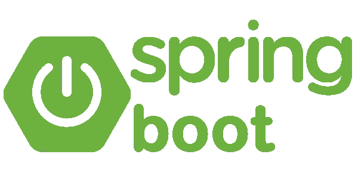
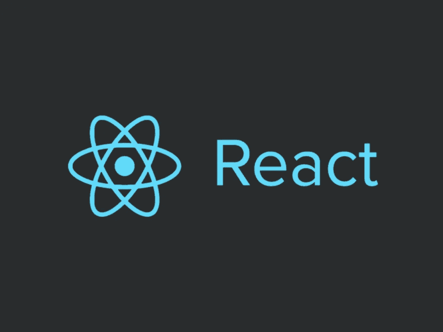
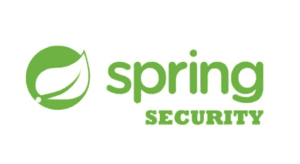
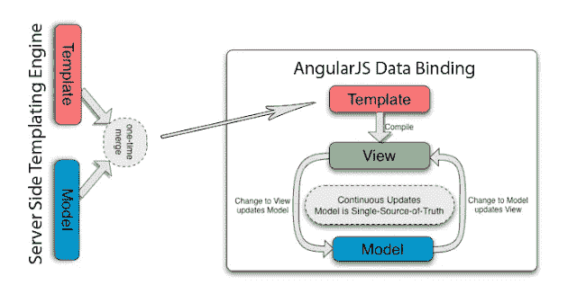
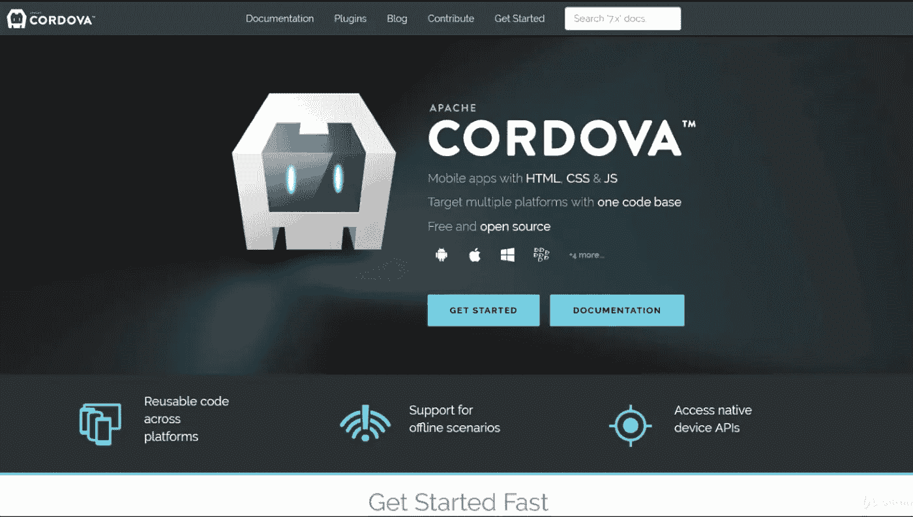
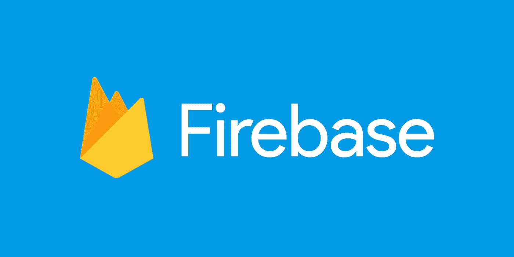

# 2023 年 Java Web 开发人员应该学习的 12 个框架

> 原文：<https://medium.com/javarevisited/12-frameworks-java-web-developers-should-learn-in-2018-edae59315244?source=collection_archive---------0----------------------->

[保罗·史密斯](https://unsplash.com/@sumo?utm_source=medium&utm_medium=referral)在 [Unsplash](https://unsplash.com?utm_source=medium&utm_medium=referral) 上的“红白灯长曝光摄影”

在当今世界，对各种框架的良好了解非常重要。它们允许您快速开发原型和真实项目。如果你在创业领域工作，那么你应该马上做出一些很酷的东西，这就是框架知识的优势所在。

如果你被困在某个地方从事无聊的工作，比如启动和停止服务器，设置一些 cron 作业，回复相同的旧电子邮件维护遗留应用程序，它也可以帮助你获得更好的工作，并使你的职业生涯更上一层楼。

在本文中，我分享了与 [Java 开发](https://javarevisited.blogspot.sg/2018/04/top-5-java-frameworks-to-learn-in-2018_27.html#axzz5DmwFLA1K)、[移动 app 开发](http://www.java67.com/2018/01/top-10-web-mobile-and-big-data-framework-libraries-technologies-programmers-should-learn-in-2018.html)、 [web 开发](http://www.java67.com/2018/02/5-free-react-courses-for-web-developers.html)、[大数据](http://www.java67.com/2018/05/top-5-free-big-data-courses-to-learn-Hadoop-Apache-Spark.html)相关的 **12 个有用框架。如果你有另一个好的框架，你认为 Java 和 web 开发人员应该在 2023 年学习，那么请在评论中分享它。**

# 2023 年 Java 后端和 Web 开发人员可以学习的 12 个框架

这里列出了 2023 年专门从事 web 开发的 Java 后端开发人员可以学习的最佳框架和库。它包括 Java 后端框架和 JavaScript 前端框架，如 React.js 和 Angular，以及用于大数据处理的 Apache Spark 和 Hadoop。

## 1.Spring Boot

我使用 Spring 框架已经很多年了，所以当我第一次被介绍到 Spring Boot 时，我对配置的相对缺乏感到非常惊讶。使用 Spring Boot 编写基于 Spring 的 Java 应用程序就像使用 [main()](http://www.java67.com/2014/02/can-you-run-java-program-without-main-method.html) 方法编写核心 Java 应用程序一样简单。

尽管我尝试过 Spring Boot，但我还有很多东西要学，这就是为什么它会出现在我 2023 年要学的事情清单上。

上个月，我还从 Udemy 花了 10 美元买了 Spring Boot 大师班[，这是学习 Spring Boot 最好的在线课程之一，我期待着在 2023 年使用它。](https://click.linksynergy.com/fs-bin/click?id=JVFxdTr9V80&subid=0&offerid=323058.1&type=10&tmpid=14538&RD_PARM1=https%3A%2F%2Fwww.udemy.com%2Fspring-boot-intro%2F)

## 2.React.js

React 是另一个用于构建用户界面的 JavaScript 库或框架。它就像 [Angular](http://www.java67.com/2018/01/top-5-free-angular-js-online-courses-for-web-developers.html) 一样，但是由脸书、Instagram 和一个由个人开发者和公司组成的社区来维护。它允许 web 开发人员创建大型 web 应用程序，无需重新加载页面就可以随时更改。

web 开发世界分为 [Angular](https://javarevisited.blogspot.com/2018/06/top-10-angular-tutorials-and-courses-for-web-developers.html#axzz5Ie75bPFF) 和 [React](http://www.java67.com/2018/02/5-free-react-courses-for-web-developers.html) 两种，如何选择取决于你自己。大多数时候，这是由环境决定的；例如，如果你正在做一个基于 React 的项目，那么很明显，你需要学习 React。

如果你决定在 2023 年学习 React，那么来自 Pluralsight 的 [**React.js:入门**](https://pluralsight.pxf.io/c/1193463/424552/7490?u=https%3A%2F%2Fwww.pluralsight.com%2Fcourses%2Freact-js-getting-started) 课程是一个很好的起点。

## 3.春季安全 5

安全是不可替代的，在 2023 年，它将更加重要。由于 Spring Security 已经成为 Java 世界中 web security 的代名词，所以在 2023 年用 Spring Security 的最新版本更新自己是完全有意义的。

Spring security 的新版本 5.0 包括许多错误修复和一个完整的新 OAuth 2.0 模块。

即使你不知道春安，也要考虑在 2023 年学习，没有比加入欧根帕拉斯基夫的 [**学习春安大师班**](https://courses.baeldung.com/p/learn-spring-security-the-master-class?utm_source=javarevisited&utm_medium=web&utm_campaign=lss&affcode=22136_bkwjs9xa) **更好的办法了。**

## 4.角度 2+

这是另一个 JavaScript 框架，在我 2023 年的学习清单上。它提供了一个完全客户端的解决方案。可以使用 AngularJS 在客户端创建动态网页。

它提供了声明性模板、依赖注入、端到端工具和集成的最佳实践来解决客户端常见的开发挑战。

因为它是一个 JavaScript 库，所以可以使用

由于谷歌落后于 Angular，所以在性能和定期更新方面你可以放心。我坚信 AngularJS 会长期留在这里，因此，在这里投入时间是完全合理的。如果你决定在 2023 年学习 Angular，那么 [**Angular —来自 Udemy 的完整指南**](https://click.linksynergy.com/fs-bin/click?id=JVFxdTr9V80&subid=0&offerid=323058.1&type=10&tmpid=14538&RD_PARM1=https%3A%2F%2Fwww.udemy.com%2Fthe-complete-guide-to-angular-2%2F) 是一个很好的起点。

## 5.节点 JS

毫无疑问，JavaScript 是头号编程语言，Node.js 在其中扮演了重要角色。传统上，JavaScript 被用作客户端脚本语言，与 HTML 一起在客户端提供动态行为。它运行在 web 浏览器上，但是 Node.js 允许您在服务器端运行 JavaScript。

js 是一个开源的、跨平台的 JavaScript 运行时环境，用于在服务器端执行 JavaScript 代码。在将动态网页发送到客户端之前，可以使用 Node.js 在服务器端创建动态网页。

这意味着您可以用 JavaScript 开发一个从前端到后端的客户端-服务器应用程序。上个月，我在 Udemy 的 10 美元特卖会上购买了完整的 Node.js 开发者课程。

## 6.引导程序

这是另一个流行的开源前端 web 框架，用于设计网站和 web 应用程序。Bootstrap 最初由 Twitter 提供给我们，它为排版、表单、按钮、导航和其他界面组件提供基于 HTML 和 CSS 的设计模板，以及可选的 JavaScript 扩展。

Bootstrap 支持响应式网页设计，这意味着网页的布局会根据浏览器的屏幕大小动态调整。

在移动领域，Bootstrap 以其移动优先的设计理念引领潮流，强调默认的响应式设计。

如果你是一个 web 开发者，不知道 Bootstrap，2023 年是入门的好时机。 [**Bootstrap 4 从零开始**](https://click.linksynergy.com/fs-bin/click?id=JVFxdTr9V80&subid=0&offerid=323058.1&type=10&tmpid=14538&RD_PARM1=https%3A%2F%2Fwww.udemy.com%2Fbootstrap-4-from-scratch-with-5-projects%2F) 是你 2023 年 Bootstrap 旅程的良好起点。

## 7.jQuery

这是另一个统治世界的 JavaScript 框架。很长一段时间以来，jQuery 一直是我的最爱，我建议每个开发人员都要学习 jQuery。它使得客户端脚本编写变得非常容易。

只需编写几行代码，您就可以制作动画、发送 HTTP 请求、重新加载页面以及执行客户端验证。

如果你决定在 2023 年学习 jQuery，那么我建议你看一看这个 [**jQuery 大师班**](https://click.linksynergy.com/fs-bin/click?id=JVFxdTr9V80&subid=0&offerid=323058.1&type=10&tmpid=14538&RD_PARM1=https%3A%2F%2Fwww.udemy.com%2Fjquery-tutorial%2F) **，【Udemy 提供的学习 jQuery 的免费在线课程。**

## 8.Apache Hadoop

大数据和自动化是 2023 年许多公司的焦点，这就是为什么程序员学习大数据技术变得很重要，如 [Hadoop](http://www.java67.com/2018/05/top-5-free-big-data-courses-to-learn-Hadoop-Apache-Spark.html) 和 [Spark](http://www.java67.com/2018/04/5-free-apache-spark-course-for-java-scala-python-developers.html) 。

Apache Hadoop 是一个框架，它允许使用简单的编程模型跨计算机集群分布式处理大型数据集。

它旨在从单个服务器扩展到数千台机器，每台机器都提供本地计算和存储。它基于流行的 [Map Reduce 模式](http://www.java67.com/2016/09/map-reduce-example-java8.html)，是开发可靠、可伸缩和分布式软件计算应用的关键。

我上个月已经报名参加了 [**终极动手 Hadoop**](https://click.linksynergy.com/fs-bin/click?id=JVFxdTr9V80&subid=0&offerid=323058.1&type=10&tmpid=14538&RD_PARM1=https%3A%2F%2Fwww.udemy.com%2Fthe-ultimate-hands-on-hadoop-tame-your-big-data%2F) ，如果你决定在 2023 年学习 Hadoop，你也可以在 Udemy 上加入。

## 9.阿帕奇火花

这是另一个越来越受欢迎的大数据框架。Apache Spark 是一个快速的内存数据处理引擎，具有优雅和丰富的开发 API，允许数据工作者高效地执行需要快速迭代访问数据集的流、机器学习或 SQL 工作负载。

您可以使用 Spark 进行内存计算，将 ETL、机器学习和数据科学工作负载转移到 Hadoop。我已经入围了 Pluralsight 的 [**阿帕奇火花基础**](https://pluralsight.pxf.io/c/1193463/424552/7490?u=https%3A%2F%2Fwww.pluralsight.com%2Fcourses%2Fapache-spark-fundamentals) 课程，要在 2023 年通过。如果你也有同样的情况，你可以去看看那个课程来获得一些灵感

顺便说一下，你需要一个 [Pluralsight 会员](https://pluralsight.pxf.io/c/1193463/424552/7490?u=https%3A%2F%2Fwww.pluralsight.com%2Fpricing)才能加入这个课程，费用大约是每月 29 美元或每年 299 美元(14%的折扣)。我强烈推荐这个订阅，因为它促进了你的学习，作为一个程序员，你总是需要学习新的东西。或者，你也可以使用他们的 [**10 天免费通行证**](https://pluralsight.pxf.io/c/1193463/424552/7490?u=https%3A%2F%2Fwww.pluralsight.com%2Flearn) 免费观看本课程。

## 10.科尔多瓦

Apache Cordova 是另一个移动应用程序开发框架，最初由 Nitobi 创建。Adobe Systems 在 2011 年收购了 Nitobi，将其更名为 PhoneGap，后来发布了该软件的开源版本，名为 Apache Cordova。

它允许您使用标准的 web 技术——html 5、CSS3 和 JavaScript 进行跨平台开发，其中一项是 2023 年要学习的热门技术。

如果你想在 2023 年学习科尔多瓦，那么请查看 [**用 Angular 和科尔多瓦**](https://click.linksynergy.com/fs-bin/click?id=JVFxdTr9V80&subid=0&offerid=323058.1&type=10&tmpid=14538&RD_PARM1=https%3A%2F%2Fwww.udemy.com%2Fionic-2-the-practical-guide-to-building-ios-android-apps%2F)**构建 iOS & Android 应用程序，这是学习科尔多瓦的激动人心的课程之一。**

****

## **11.重火力点**

**Firebase 是谷歌的移动平台，可帮助您快速开发高质量的移动应用程序并发展您的业务。你可以选择 Firebase 作为 Android 或 iOS 应用程序的后端。**

**如果你希望在 2023 年进入利润丰厚的移动应用程序开发行业，那么学习 Firebase 是一个非常好的主意，而 [**高级 iOS 和 Firebase:Rideshare**](https://click.linksynergy.com/fs-bin/click?id=JVFxdTr9V80&subid=0&offerid=323058.1&type=10&tmpid=14538&RD_PARM1=https%3A%2F%2Fwww.udemy.com%2Fadvanced-ios-firebae-build-an-uber-clone-app%2F)**是一个很好的起点。****

********

## ****12.Xamarin****

****Xamarin 是一种通过单一的共享 C#代码库快速为所有平台制作移动应用程序的方法，可以为每个平台构建自定义的原生用户界面，也可以使用 Xamarin。表单来编写跨平台的单一共享用户界面。****

****它归微软所有，并因为 C、C++和 C#开发人员创建移动应用程序而迅速流行起来。****

****如果你已经会一门 C 语言，并且正在寻找移动应用开发的职业生涯，那么我强烈建议你在 2023 年学习 Xamarin，以及 [**完整的 Xamarin 开发者课程:iOS 和 Android！**](http://bit.ly/2DxBRt4) 是一个很好的开始课程。****

********

****以上就是关于**2023 年 web 开发者能学到的东西**。这些框架需求量很大，尤其是 Spring、Node.js 和 AngularJS。学习这些框架不仅会增加你找到工作的机会，还会打开许多机会之门。****

****即使你已经在工作中安顿下来，让自己跟上最新最棒的技术对你的职业发展也是至关重要的。****

****所以，我建议你挑几个这样的框架，2023 年学。如果你是一名 Java 开发人员，那么 [Apache Spark](http://www.java67.com/2018/04/5-free-apache-spark-course-for-java-scala-python-developers.html) 是一个不错的选择，但如果你对编程语言而不是框架或库感兴趣，那么 [Kotlin](https://javarevisited.blogspot.com/2018/02/5-courses-to-learn-kotlin-programming-java-android.html) 在 2023 年看起来不错。****

******附言**。—如果你不确定如何在 2023 年学习新技术，如编程语言、框架或库，那么请参见我的帖子，关于学习新技术或编程语言的 10 种方法[这里](http://www.java67.com/2017/12/10-ways-to-learn-new-technology-programming-language-or-framework.html)。****

## ****您可能喜欢的其他媒体文章:****

****</swlh/5-free-python-courses-for-beginners-to-learn-online-e1ca90687caf>  </javarevisited/25-software-design-interview-questions-to-crack-any-programming-and-technical-interviews-4b8237942db0>  </javarevisited/top-10-coursera-certificates-to-start-your-career-in-cloud-data-science-ai-mainframe-and-it-558690c83587> ****