# 2023 年供初学者在线学习的 12 大免费 JavaScript 课程和教程——最好的

> 原文：<https://medium.com/javarevisited/12-free-courses-to-learn-javascript-and-es6-for-beginners-and-experienced-developers-aa35874c9a32?source=collection_archive---------0----------------------->

## 我最喜欢的学习 JavaScript 和 ES6 的免费在线课程来自哈佛、Udemy、Coursera、Pluralsight、edX 和 Educative

[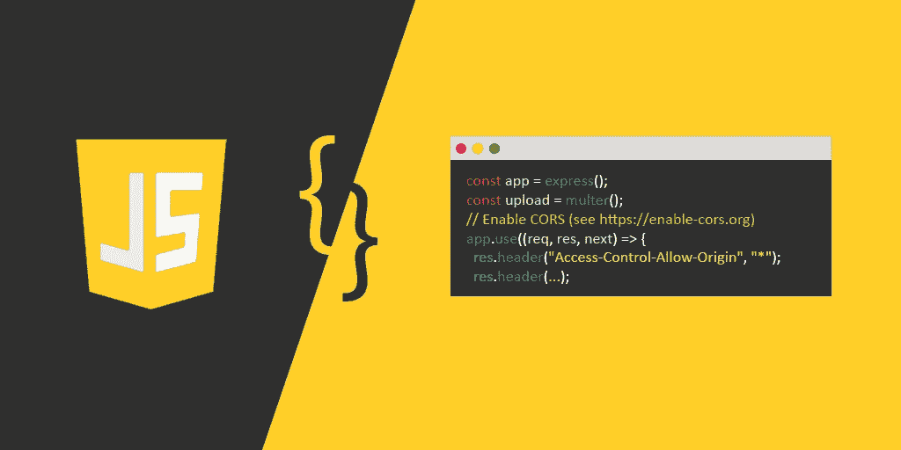](https://www.educative.io/subscription?affiliate_id=5073518643380224)

image_credit —教育性

大家好，如果你想自学 JavaScript 并寻找一些免费资源，如[书籍](http://www.java67.com/2015/10/top-5-free-javascript-books-download-pdf-read-online.html)、[网站](http://www.java67.com/2015/12/best-websites-to-learn-javascript-online.html)和[教程](http://www.java67.com/2017/07/6-ways-to-redirect-web-page-using-JavaScript-and-jQuery.html)，那么你来对地方了。

早些时候，我已经分享了 [**最佳 JavaScript 课程**](/javarevisited/10-best-online-courses-to-learn-javascript-in-2020-af5ed0801645) 和 [**最佳 JavaScript 书籍**](/javarevisited/5-best-javascript-books-for-beginners-and-experienced-web-developers-2c6353d1cc85) ，在这篇文章中，我将分享一些最好的免费 JavaScript 在线课程，你可以自己参加，按照自己的时间表，在自己的地方学习 [JavaScript](http://www.java67.com/2018/04/top-5-free-javascript-courses-to-learn.html) 。

很多人都在学习 JavaScript，而且人数还在与日俱增，为什么不呢？它是#1 网络开发语言。它还有大量有用的框架和库，如 [Angular](http://www.java67.com/2018/01/top-5-free-angular-js-online-courses-for-web-developers.html) 、 [React](http://www.java67.com/2018/02/5-free-react-courses-for-web-developers.html) 、 [Node.js](http://javarevisited.blogspot.sg/2018/01/top-5-nodejs-and-express-js-online-courses-for-web-developers.html) 和 [jQuery](http://javarevisited.blogspot.sg/2017/04/free-ebooks-to-learn-jquery-online-or-download-pdf.html#axzz5CcaMIuUC) ，这使得 web 开发变得非常容易。

如果你正在找工作或者正在创办自己的网站，学习 JavaScript 是一个不错的决定。在当今世界，我非常鼓励人们学习编码，至少知道如何自己构建一个 web 应用程序和移动应用程序，通过学习 JavaScript，你可以一箭双雕。

是的，你也可以用 JavaScript 开发一个移动应用。如果你没有， [React Native](http://javarevisited.blogspot.sg/2018/02/5-react-native-courses-to-learn-mobile-development-using-JavaScript.html) 是一个 JavaScript 库，它允许你用 JavaScript 为 [Android](http://www.java67.com/2019/01/top-5-free-android-app-development-courses-for-programmers.html) 和 [iOS](https://javarevisited.blogspot.com/2019/01/top-5-ios-developer-course-to-learn-ios.html) 设备如 iPhone 和 iPad 开发一个移动应用。现在，最大的问题是你应该选择哪些课程来学习 JavaScript？在书籍、教程、付费课程和免费课程方面有大量的选择。

甚至有一些网站可以让你交互式地学习 JavaScript。你可能想看看我之前关于学习 JavaScript 的 5 个网站的文章。

我把这个选择留给你，我将在这篇文章中分享学习 JavaScript 的 5 个最好的免费课程。这些都是很好的，是他们的老师出于教育目的免费提供的，是完美的开始。

顺便说一句，如果你不介意花点钱学习像 JavaScript 这样有价值的东西，那么我也建议你查看[**2023 年完整 JavaScript 课程:构建真正的项目！**](https://click.linksynergy.com/deeplink?id=JVFxdTr9V80&mid=39197&murl=https%3A%2F%2Fwww.udemy.com%2Fcourse%2Fthe-complete-javascript-course%2F) 课程由 Jonas Schmedtmann 在 Udemy 上开设。2023 年学习 JavaScript 的动手指南。它不是免费的，但完全物有所值，而且价格也非常实惠，在 Udemy 上只需 10 美元就能买到。

<https://click.linksynergy.com/deeplink?id=JVFxdTr9V80&mid=39197&murl=https%3A%2F%2Fwww.udemy.com%2Fcourse%2Fthe-complete-javascript-course%2F>  

# 2023 年学习 JavaScript 的 12 个最佳免费在线课程

以下是我列出的 2023 年学习 JavaScript 的一些最佳课程，而且也是免费的。虽然你可以按照自己的方式开始学习 JavaScript，但我的建议是从基础开始，在学习任何框架或库之前先学习 JavaScript 语言。

## 1. [JavaScript 基础知识](https://click.linksynergy.com/fs-bin/click?id=JVFxdTr9V80&subid=0&offerid=323058.1&type=10&tmpid=14538&RD_PARM1=https%3A%2F%2Fwww.udemy.com%2Fjavascript-essentials%2F)【我的免费课程】

这是学习 JavaScript 编程语言的基础课程。在本课程中，你将学习 JavaScript 语言的所有基础知识，如基本类型、[数组、](http://www.java67.com/2018/02/10-examples-of-array-in-java-tutorial.html)、函数、操作符、对象(如[窗口、](http://javarevisited.blogspot.sg/2014/11/difference-between-jquery-document-ready-vs-Javascript-window-onload-event.html)、DOM 等等。

你还将学习 JavaScript 如何工作，一些基本的 API，最后，你将应用你在这个*免费 JavaScript 课程*中学到的知识开发一个迷你 JavaScript 项目。

[课程](https://click.linksynergy.com/fs-bin/click?id=JVFxdTr9V80&subid=0&offerid=323058.1&type=10&tmpid=14538&RD_PARM1=https%3A%2F%2Fwww.udemy.com%2Fjavascript-essentials%2F)对于任何从零开始学习 JavaScript 但有一些编程经验的人来说都是理想的，但是不要担心，如果你是编程新手并且刚刚开始学习 JavaScript，那么你也可以参加这个课程，因为它非常适合初学者。

**这里是免费报名本课程的链接—**[**Javascript Essentials**](https://click.linksynergy.com/fs-bin/click?id=JVFxdTr9V80&subid=0&offerid=323058.1&type=10&tmpid=14538&RD_PARM1=https%3A%2F%2Fwww.udemy.com%2Fjavascript-essentials%2F)

[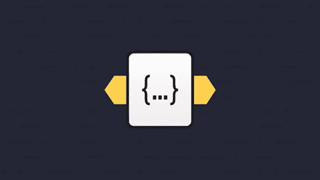](https://click.linksynergy.com/fs-bin/click?id=JVFxdTr9V80&subid=0&offerid=323058.1&type=10&tmpid=14538&RD_PARM1=https%3A%2F%2Fwww.udemy.com%2Fjavascript-essentials%2F)

## 2.[与 JavaScript 的互动](https://click.linksynergy.com/deeplink?id=JVFxdTr9V80&mid=40328&murl=https%3A%2F%2Fwww.coursera.org%2Flearn%2Fjavascript)【Coursera 免费课程】

这是一个在 Coursera 上学习 JavaScript 的非常棒的免费课程，Coursera 是我最喜欢的在线学习门户之一。本课程将向您介绍 JavaScript 语言的基础知识。

本课程涵盖了变量、循环、函数等概念，甚至还有一点调试工具。你不仅会了解 JavaScript 如何使用文档对象模型(DOM)来识别和修改页面的特定部分，还会了解如何与 DOM 交互。

课程结束后，您应该能够对 DOM 事件做出反应，并动态改变其页面的内容和样式。该课程还将帮助你构建一个最终项目——创建一个接受和验证输入的交互式 HTML5 表单。

**这里是免费注册本课程的链接—** [与 JavaScript 的互动](https://click.linksynergy.com/deeplink?id=JVFxdTr9V80&mid=40328&murl=https%3A%2F%2Fwww.coursera.org%2Flearn%2Fjavascript)

[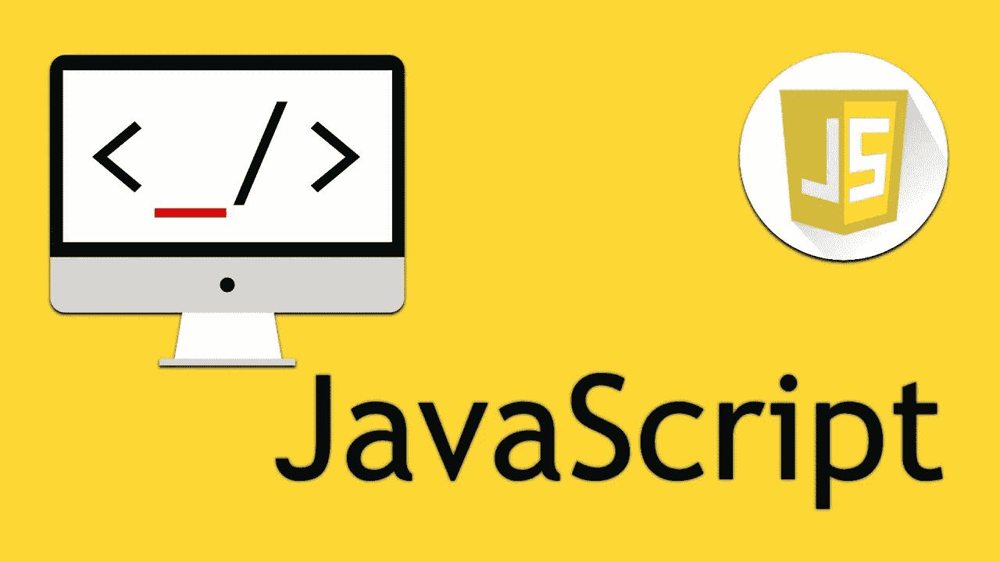](https://click.linksynergy.com/deeplink?id=JVFxdTr9V80&mid=40328&murl=https%3A%2F%2Fwww.coursera.org%2Flearn%2Fjavascript)

除了这个免费课程，还有约翰霍普金斯大学的 [**HTML、CSS 和 JavaScript for Web Developers**](https://coursera.pxf.io/c/3294490/1164545/14726?u=https%3A%2F%2Fwww.coursera.org%2Flearn%2Fhtml-css-javascript-for-web-developers)课程和加州大学戴维斯分校的 [**JavaScript for 初学者专业化**](https://coursera.pxf.io/c/3294490/1164545/14726?u=https%3A%2F%2Fwww.coursera.org%2Fspecializations%2Fjavascript-beginner) 是 Coursera 上另外两个值得一看的 JavaScript 课程，你应该检查一下，因为 Coursera 的大多数课程都是免费审核的。

如果你觉得 Coursera 的课程很有用，因为它们是由知名公司如**谷歌**、 **IBM** 、**亚马逊**和世界上最好的大学创建的，我建议你加入 Coursera 的年度订阅计划[、 **Coursera Plus** 、T21。](https://coursera.pxf.io/c/3294490/1164545/14726?u=https%3A%2F%2Fwww.coursera.org%2Fcourseraplus)

<https://coursera.pxf.io/c/3294490/1164545/14726?u=https%3A%2F%2Fwww.coursera.org%2Fcourseraplus>  

这种单一订阅让你可以无限制地访问他们最受欢迎的**课程**、**专业化**、**职业证书**和**指导项目**。它每年花费大约 399 美元，但是它完全值得你的钱，因为你得到了无限的证书。

## [3。JavaScript 介绍:第一步](https://www.educative.io/courses/introduction-to-javascript-first-steps?affiliate_id=5073518643380224)【教育性免费课程】

这是一个面向完全初学者的 JavaScript 入门课程。它将提供语言的基础。主题包括变量、运算符、函数、数组、对象和循环。学完本课程后，您应该准备好通过高级课程或其他资源进一步学习。

该课程由全栈工程师 Arnav Agarwal 创建。他在理解人们如何学习编码方面有丰富的经验。由于 Educative 和 Educative 团队的努力，这门课程是基于文本的、交互式的、完全免费的

**这里是免费注册本课程的链接—**[JavaScript 简介:第一步](https://www.educative.io/courses/introduction-to-javascript-first-steps?affiliate_id=5073518643380224)

面向初学者的免费 JavaScript 课程

如果你不知道 [Educative](https://www.educative.io/subscription?affiliate_id=5073518643380224) 是另一个在线学习平台，它基于文本的互动学习课程获得了很大的吸引力。阅读通常比观看更快，如果你更喜欢阅读文本而不是观看视频，那么这就是结账的平台。

它有一些为编码面试做准备的最好的课程，像 [**寻找编码面试:编码问题的模式**](https://www.educative.io/collection/5668639101419520/5671464854355968?affiliate_id=5073518643380224) 和 [**寻找系统设计面试**](https://www.educative.io/collection/5668639101419520/5649050225344512?affiliate_id=5073518643380224) 。它还有很多免费的资源，比如这个免费的 JavaScript 课程，用来学习基本的技术。

你可以免费注册这门课程，但如果你喜欢充分利用这个平台，我建议你购买一个 [**教育性订阅**](https://www.educative.io/subscription?affiliate_id=5073518643380224) ，每月 17 美元(现在**打五折**)，对于需要不断学习的程序员和软件工程师来说完全值得。

<https://www.educative.io/subscription?affiliate_id=5073518643380224>  

## [4。CS50 用 Python 和 JavaScript 的 Web 编程](https://www.awin1.com/cread.php?awinmid=6798&awinaffid=631878&clickref=&p=%5B%5Bhttps%3A%2F%2Fwww.edx.org%2Fcourse%2Fcs50s-web-programming-with-python-and-javascript)【edX 免费】

本课程从 CS50 停止的地方开始，使用 Flask、Django 和 Bootstrap 等框架，更深入地研究使用 Python、JavaScript 和 SQL 的 web 应用程序的设计和实现。

这门课程最棒的地方在于它来自哈佛，已经有超过 502，135 人注册了这门课程！进入本课程，这充分说明了本课程的可信度和实用性。

**以下是免费注册本课程的链接—** [CS50 的 Python 和 JavaScript 网络编程](https://www.awin1.com/cread.php?awinmid=6798&awinaffid=631878&clickref=&p=%5B%5Bhttps%3A%2F%2Fwww.edx.org%2Fcourse%2Fcs50s-web-programming-with-python-and-javascript)

免费在线学习 JavaScript 的最佳课程

## 5.[JavaScript basic](https://click.linksynergy.com/fs-bin/click?id=JVFxdTr9V80&subid=0&offerid=323058.1&type=10&tmpid=14538&RD_PARM1=https%3A%2F%2Fwww.udemy.com%2Flearn-javascript-fundamentals%2F)【plural sight Free Trial】

这是一门从头开始学习 JavaScript 的好课程。它详细涉及了 JavaScript 语言的各个方面，并向您展示了如何从互联网语言中获得最大的收益。

在本 JavaScript 课程中，讲师利亚姆·麦克伦南将向您介绍 JavaScript 程序的常见构造块，如语法、运算符、null、未定义、循环、对象、等式、函数、控制流、类型等。

以后您还将了解类型系统和各种 [JavaScript 库](http://www.java67.com/2019/01/top-10-javascript-frameworks-and-libraries-for-web-developers.html)，如正则表达式、日期、 [JSON](http://javarevisited.blogspot.sg/2017/02/how-to-consume-json-from-restful-web-services-Spring-RESTTemplate-Example.html#axzz5CdW6rG8R) 、数学等。您还将了解如何测试您的 JavaScript 代码，并使用 Firebug 对其进行调试，Firebug 是 Mozilla 为 Firefox 浏览器提供的 JavaScript 调试器。

**以下是免费注册本课程的链接—** [初学者 Javascript—快速 Javascript 基础知识](https://click.linksynergy.com/fs-bin/click?id=JVFxdTr9V80&subid=0&offerid=323058.1&type=10&tmpid=14538&RD_PARM1=https%3A%2F%2Fwww.udemy.com%2Flearn-javascript-fundamentals%2F)

[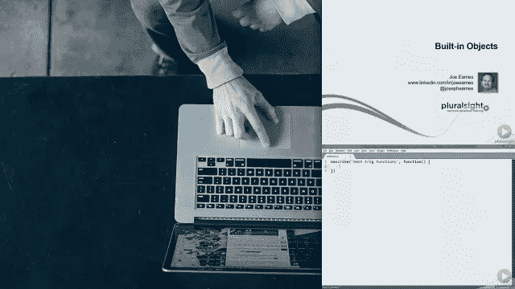](https://pluralsight.pxf.io/c/1193463/424552/7490?u=https%3A%2F%2Fwww.pluralsight.com%2Fcourses%2Fjscript-fundamentals)

简而言之，这是一门从头开始学习 JavaScript 的好课程。顺便说一下，这并不是完全免费的。您需要 Pluralsight 会员资格才能学习本课程，但如果您没有月度或年度会员资格，无需担心。您仍可通过注册 [**10 天免费通行证**](http://pluralsight.pxf.io/c/1193463/424552/7490?u=https%3A%2F%2Fwww.pluralsight.com%2Flearn) **进入本课程。**

<http://pluralsight.pxf.io/c/1193463/424552/7490?u=https%3A%2F%2Fwww.pluralsight.com%2Flearn>  

## 6.[高级面向对象的 JavaScript 和 ES6](https://click.linksynergy.com/deeplink?id=JVFxdTr9V80&mid=39197&murl=https%3A%2F%2Fwww.udemy.com%2Fcourse%2Fadvanced-and-object-oriented-javascript%2F)

这是另一个在 Udemy 免费学习 JavaScript、OOP、ES6 的优秀免费课程。它也很受欢迎，有超过 6200 名学生注册了它，并获得了超过 90 个 4.5 的评分。

在这个免费的 JavaScript 课程中，讲师 Bharath Thippireddy 将从头开始教 JavaScript。你将学习建立你自己的编码环境和开发 JavaScript 程序。

你还将学习变量、对象、[数组](https://javarevisited.blogspot.com/2015/06/top-20-array-interview-questions-and-answers.html#axzz5dCg1cNYo)、函数、逻辑、循环、控制语句、DOM 以及其他基本的 JavaScript 概念。对于任何想学习 JavaScript 进行 web 开发的人来说，这是一门理想的课程。不过，你需要在 HTML 和 CSS 方面有一点经验，并对 web 开发有所了解。

**这里是免费报名本课程的链接——**[高级面向对象 JavaScript 和 ES6](https://click.linksynergy.com/deeplink?id=JVFxdTr9V80&mid=39197&murl=https%3A%2F%2Fwww.udemy.com%2Fcourse%2Fadvanced-and-object-oriented-javascript%2F)

[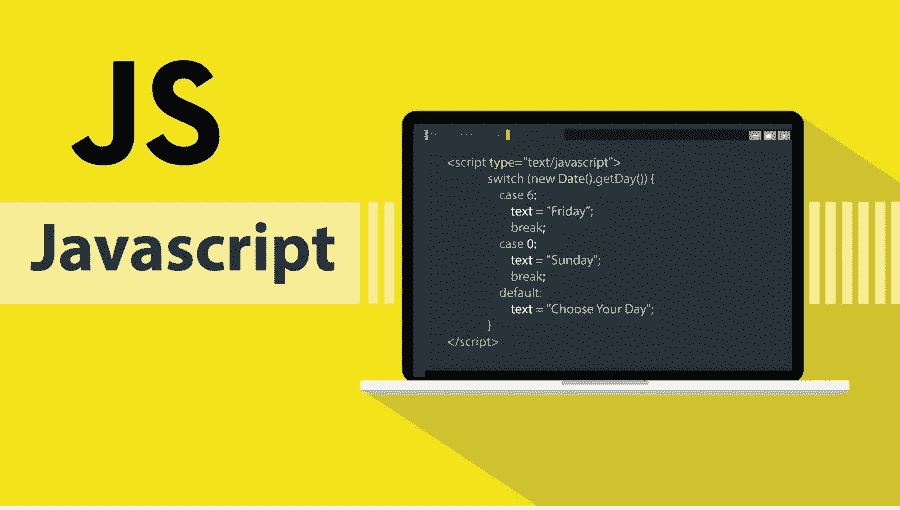](https://click.linksynergy.com/deeplink?id=JVFxdTr9V80&mid=39197&murl=https%3A%2F%2Fwww.udemy.com%2Fcourse%2Fadvanced-and-object-oriented-javascript%2F)

## 7.[学习 ECMAScript 下一代 Javascript](https://click.linksynergy.com/deeplink?id=JVFxdTr9V80&mid=39197&murl=https%3A%2F%2Fwww.udemy.com%2Fcourse%2Fecmascript2015%2F)

大家好，你可能知道 ES6/ES7 是 JavaScript 的新版本，如果你想成为一名更好的开发者，这是适合你的课程。

这是一个很棒的免费课程，可以通过使用 JSBin 或任何其他在线解释器来学习新的 JavaScript 特性。在本课程中，您将了解如何使用 ES6 和 ES7 功能，有哪些可用的工具，但更重要的是如何正确配置这些工具，以便在完成本课程后可以在您的应用程序中使用它们。

**这里是免费报名本课程的链接—** [学习 ECMAScript 下一代 Javascript](https://click.linksynergy.com/deeplink?id=JVFxdTr9V80&mid=39197&murl=https%3A%2F%2Fwww.udemy.com%2Fcourse%2Fecmascript2015%2F)

[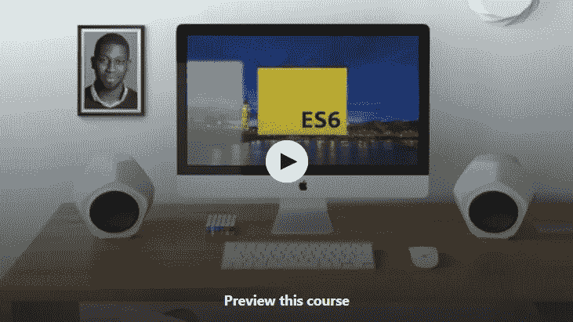](https://click.linksynergy.com/deeplink?id=JVFxdTr9V80&mid=39197&murl=https%3A%2F%2Fwww.udemy.com%2Fcourse%2Fecmascript2015%2F)

## 8.[用 HTML、CSS、JavaScript 搭建一个问答 App](https://click.linksynergy.com/deeplink?id=JVFxdTr9V80&mid=39197&murl=https%3A%2F%2Fwww.udemy.com%2Fcourse%2Fbuild-a-quiz-app-with-html-css-and-javascript%2F)【项目课程】

这是一门基于项目的实践课程，不仅要学习 JavaScript，还要学习 HTML 和 CSS，这是前端开发人员的另外两项重要技术。

本课程通过使用 [HTML](/javarevisited/top-10-free-courses-to-learn-html-5-css-3-and-web-development-872d62d97a97) 、CSS 和 JavaScript 构建一个测验应用来提高你的核心开发技能。您将使用新的 ES6 JavaScript 特性，如箭头函数、spread 运算符、const 和 let 以及模板文字字符串。

您还将学习如何使用 Fetch API 从 API 加载琐事问题，在本地存储中存储高分，如何在 CSS 中使用 Flexbox、动画和 REM 单元，以及如何从头开始创建进度条。总的来说，这是 2023 年学习 JavaScript 的一个完美项目。

**这里是免费注册本课程的链接—** [用 HTML、CSS 和 JavaScript 构建一个测验应用](https://click.linksynergy.com/deeplink?id=JVFxdTr9V80&mid=39197&murl=https%3A%2F%2Fwww.udemy.com%2Fcourse%2Fbuild-a-quiz-app-with-html-css-and-javascript%2F)

[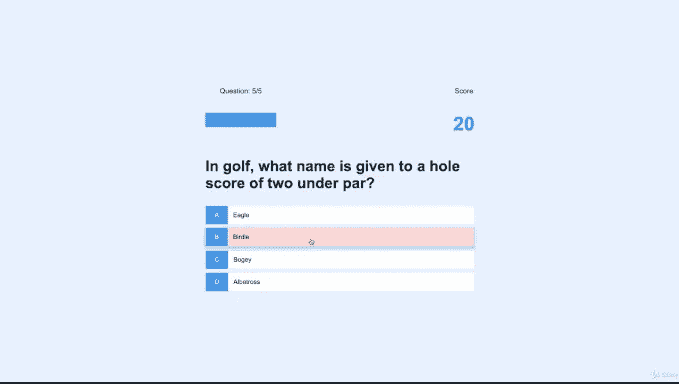](https://click.linksynergy.com/deeplink?id=JVFxdTr9V80&mid=39197&murl=https%3A%2F%2Fwww.udemy.com%2Fcourse%2Fbuild-a-quiz-app-with-html-css-and-javascript%2F)

## 9.[调平至 ES6](https://click.linksynergy.com/deeplink?id=JVFxdTr9V80&mid=39197&murl=https%3A%2F%2Fwww.udemy.com%2Fcourse%2Fleveling-up-to-es6%2F)

如果你已经知道 JavaScript，但是想学习 ES6 的所有新特性，这样你就可以编写更好更简洁的 JavaScript 代码，那么这是最好的课程，你知道吗，它是完全免费的。

在这个免费的 ES 6 课程中，您将学习如何使用 ES6 特性，了解何时应该使用这些特定的 ES6 特性，并了解为什么这些 ES6 特性可以帮助您编写更干净、更简洁的代码

总的来说，这是一个很棒的免费 javascript 课程，可以用 ES6 中提供的最新特性提升您的 JavaScript 知识。

**这里是免费报名参加本课程的链接—** [升级到 ES6](https://click.linksynergy.com/deeplink?id=JVFxdTr9V80&mid=39197&murl=https%3A%2F%2Fwww.udemy.com%2Fcourse%2Fleveling-up-to-es6%2F)

[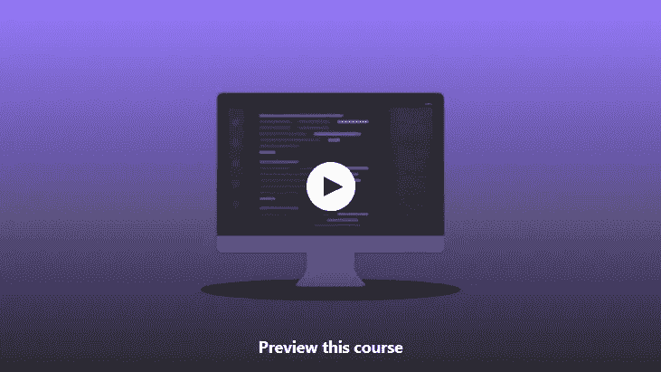](https://click.linksynergy.com/deeplink?id=JVFxdTr9V80&mid=39197&murl=https%3A%2F%2Fwww.udemy.com%2Fcourse%2Fleveling-up-to-es6%2F)

## 10. [JavaScript 基础:5 分钟后开始编码](https://click.linksynergy.com/deeplink?id=JVFxdTr9V80&mid=39197&murl=https%3A%2F%2Fwww.udemy.com%2Fcourse%2Fjavascript-basics-start-coding-in-5-minutes-2019%2F)

这是一个完整学习 JavaScript 的大量免费课程。该课程有超过 56 个小时的内容，涵盖了 JavaScript 开发人员需要知道的一切。

你会在 Udemy 上的这个免费 JavaScript 课程中找到比任何其他付费课程更多的材料。我真的很感谢讲师[扎克·弗里德曼](https://click.linksynergy.com/deeplink?id=JVFxdTr9V80&mid=39197&murl=https%3A%2F%2Fwww.udemy.com%2Fuser%2F5539ab2518198%2F)创造了这么棒的课程并让它免费。

**以下是免费注册本课程的链接—** [JavaScript 基础:5 分钟内开始编码](https://click.linksynergy.com/deeplink?id=JVFxdTr9V80&mid=39197&murl=https%3A%2F%2Fwww.udemy.com%2Fcourse%2Fjavascript-basics-start-coding-in-5-minutes-2019%2F)

[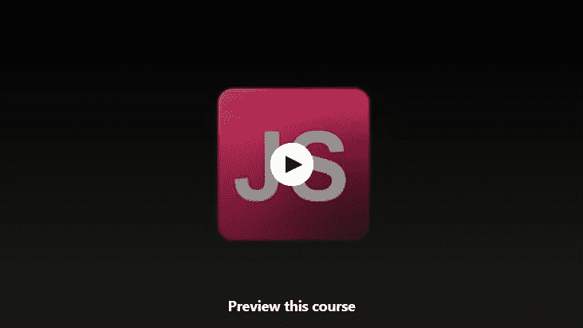](https://click.linksynergy.com/deeplink?id=JVFxdTr9V80&mid=39197&murl=https%3A%2F%2Fwww.udemy.com%2Fcourse%2Fjavascript-basics-start-coding-in-5-minutes-2019%2F)

## 11.[edX 团队 JavaScript 简介](https://www.awin1.com/cread.php?awinmid=6798&awinaffid=631878&clickref=&p=%5B%5Bhttps%3A%2F%2Fwww.edx.org%2Fcourse%2Fjavascript-introduction)

这是您在网上学习的另一门初级 JavaScript 课程。这是由 w3c 创建的，我强烈建议初学者学习这门课程。

你将从零开始学习如何使用 JavaScript，一切都很清楚，解释得很好，所有的主题都已经详细讨论过了，你不能指望有更多的初学者 JavaScript 课程

**以下是免费注册本课程的链接—** [JavaScript 简介](https://www.awin1.com/cread.php?awinmid=6798&awinaffid=631878&clickref=&p=%5B%5Bhttps%3A%2F%2Fwww.edx.org%2Fcourse%2Fjavascript-introduction)

[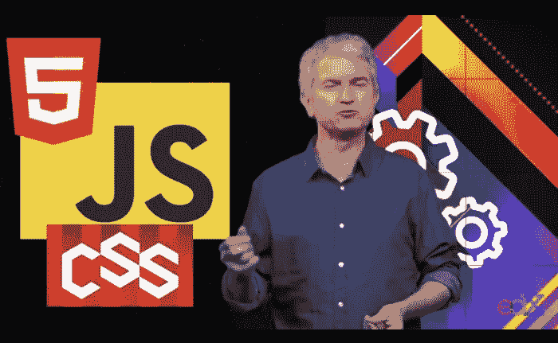](https://www.awin1.com/cread.php?awinmid=6798&awinaffid=631878&clickref=&p=%5B%5Bhttps%3A%2F%2Fwww.edx.org%2Fcourse%2Fjavascript-introduction)

## 12.[学习用 JavaScript 编程:从初学者到专业人员](https://click.linksynergy.com/deeplink?id=JVFxdTr9V80&mid=39197&murl=https%3A%2F%2Fwww.udemy.com%2Fprogramming-in-javascript%2F)

对于想深入学习 *JavaScript 的网络开发人员来说，这是另一门令人敬畏的免费 JavaScript 课程。*

在本课程中，您不仅将了解 JavaScript 是如何工作的，还将学习诸如闭包、原型等高级概念，并学习编写框架。

最重要的是，它将教会你如何编写可靠、优秀的 JavaScript 代码，避免其他 JavaScript 代码编写人员犯下的常见陷阱和错误。

**这里是免费报名本课程的链接—** [学习 Javascript 编程:初级到专业](https://click.linksynergy.com/deeplink?id=JVFxdTr9V80&mid=39197&murl=https%3A%2F%2Fwww.udemy.com%2Fprogramming-in-javascript%2F)

[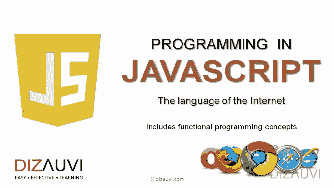](https://click.linksynergy.com/deeplink?id=JVFxdTr9V80&mid=39197&murl=https%3A%2F%2Fwww.udemy.com%2Fprogramming-in-javascript%2F)

您还将了解如何调试 JavaScript 代码，以及如何更容易地发现问题。它还向您展示了流行的 JavaScript 框架的代码，这将有助于您更好地理解它们。

总的来说，是一门经过超过 75000 名学生反复试验的优质 JavaScript 课程。它还获得了 4000 次平均 4.4 分的收视率，非常令人印象深刻。

## 13.[JavaScript @ Codecademy 简介](https://bit.ly/learnjavascriptwithcodecademy)

这是在线学习 JavaScript 的另一个最好的免费资源。事实上，这是我第一次学习 JavaScript 时使用的一个资源。我真的很喜欢在网络浏览器中输入代码，不用做任何设置就能看到输出的方式。

这个免费的 JavaScript 教程是初学者的理想选择，因为它是交互式的，不需要额外的设置，就像其他免费教程一样，你需要下载和设置工具。

尽管目前，[**CodeCademy**](https://www.pjatr.com/t/TUJGR0lLR0JHRklJSkhCR0ZISk1N?url=https%3A%2F%2Fwww.codecademy.com%2Fpro%2Fmembership)**提供了 [Java](http://www.java67.com/2018/08/top-10-free-java-courses-for-beginners-experienced-developers.html) 、 [Git](https://hackernoon.com/top-5-free-courses-to-learn-git-and-github-best-of-lot-2f394c6533b0) 、 [UNIX 命令行](https://hackernoon.com/top-5-free-linux-courses-for-programmers-4a433b4edade)和其他几门课程，但它因一门交互式 JavaScript 课程而出名，可以根据自己的进度在线学习。**

**你可以通过目前注册的学生人数来衡量这门课程的受欢迎程度，注册人数为**500 万+** ，这对于任何在线免费课程来说都是一个非常高的数字。**

**你可以 [**在这里**注册这个免费的 JavaScript 教程。](https://bit.ly/learnjavascriptwithcodecademy)**

**[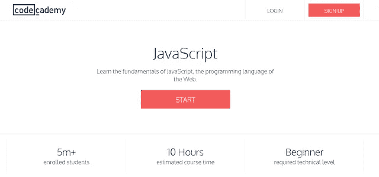](https://bit.ly/learnjavascriptwithcodecademy)**

**简而言之，CodeCademy 是在线学习 JavaScript 的最佳网站之一，你应该利用这一点。**

**顺便说一句，如果你喜欢 CodeCademy 平台，那么你也可以加入 CodeCademy PRO ，这是一个面向程序员的高级订阅。它的年费大约是每月 15.99 美元，提供所有 CodeCademy 的内容、课程、测验和项目。**

**<https://bit.ly/codecademypro>  

以上是关于在线学习 JavaScript 的一些**免费课程**。这些免费课程让你可以在办公室和家里舒适地学习 JavaScript。你不需要去任何地方，你也可以按照自己的节奏学习。你不需要遵循任何特定的时间表。顺便说一句，有一点需要注意的是，Udemy 上的一些免费 JavaScript 课程将来可能会变成付费课程，所以在加入之前一定要核实一下。我的建议是现在注册，当他们免费的时候，即使你没有时间学习 JavaScript。一旦你加入了他们，他们将终身免费，你可以在有时间或优先级改变时开始学习。这样你就不会后悔错过了那些免费的课程。

其他**您可能想探索的 Web 开发资源文章**

1.  [完整的 Web 开发者路线图](/hackernoon/the-2019-web-developer-roadmap-ab89ac3c380e)
2.  [我最喜欢的免费 JavaScript 初学者教程](/javarevisited/my-favorite-free-tutorials-and-courses-to-learn-javascript-8f4d0a71faf2)
3.  [15 面向 Web 开发人员的 Docker、Kubernetes 和 AWS 课程](/javarevisited/top-15-online-courses-to-learn-docker-kubernetes-and-aws-for-fullstack-developers-and-devops-d8cc4f16e773)
4.  Web 开发人员可以学习的 10 个 JavaScript 框架
5.  [学习 Web 开发的前 5 门课程](/better-programming/my-5-favorite-courses-to-learn-web-development-in-2019-a5e74167f8b2)
6.  [我最喜欢的学习 HTML 和 CSS 的免费课程](/javarevisited/5-free-html-and-css-courses-to-learn-front-end-web-development-online-8b04517c6ecb?source=collection_home---4------0-----------------------)
7.  [面向前端开发者的 5 门免费 Docker 课程](/javarevisited/top-5-free-courses-to-learn-docker-for-beginners-best-of-lot-b2b1ad2b98ad)
8.  [初学者学习 SQL 和数据库的 7 门免费课程](/javarevisited/7-free-courses-to-learn-database-and-sql-for-programmers-and-data-scientist-e7ae19514ed2)
9.  [完整的 React.js 开发者路线图](/javarevisited/the-2019-react-js-developer-roadmap-9a8e290b8a56)
10.  [2021 年学棱角的 10 本书和课程](/javarevisited/top-10-angular-books-and-courses-for-beginners-and-experienced-web-developers-best-of-lot-9a2dae87f04c)

感谢您阅读本文。如果你喜欢这些网络开发课程，请与你的朋友和同事分享。如果您有任何问题或反馈，请留言。

## 结束语

感谢您阅读本文。你可能会想，有这么多东西要学，有这么多课程要参加，但你不需要担心。

很有可能你已经知道了大部分内容，也有很多有用的免费资源、书籍和网站可供你使用，我还在这里和那里链接了它们以及最好的资源，这些资源当然不是免费的，但值得花钱。

我是 [Udemy](https://click.linksynergy.com/fs-bin/click?id=JVFxdTr9V80&offerid=323058.9410&type=3&subid=0) 、 [edX](https://www.awin1.com/cread.php?awinmid=6798&awinaffid=631878&clickref=&p=) 、 [Educative](https://www.educative.io/subscription?affiliate_id=5073518643380224) 和 [**Coursera**](https://coursera.pxf.io/c/3294490/1164545/14726?u=https%3A%2F%2Fwww.coursera.org%2F) 课程的特别粉丝，因为它们非常实惠，并且以很少的金额提供很多价值，但是你可以自由选择你想要的课程。

说到底，你应该对这里提到的事情有足够的知识和经验。

祝您的 JavaScript 之旅好运！当然**不会很容易**，但是通过遵循这个路线图和指南，你离成为你一直想成为的 Web 开发者又近了一步

如果你喜欢这篇文章，那么请考虑在 medium 上关注我( [javinpaul](https://medium.com/u/bb36d8439904?source=post_page-----aa35874c9a32--------------------------------) )。如果你想得到每一个新帖子的通知，别忘了在 Twitter 上关注**[**javarevited**](https://twitter.com/javarevisited)！**** 

******p . s .**——如果你也在寻找一些免费的资源来开始你的 web 开发生涯，那么你也可以看看这个为程序员提供的免费 Web 开发课程<http://www.java67.com/2018/03/top-5-free-courses-to-learn-web-development.html>**的列表。******

******</javarevisited/top-10-free-courses-to-learn-html-5-css-3-and-web-development-872d62d97a97>  

**P.P.S. —** 如果你不介意花点钱学习像 JavaScript 这样有价值的东西，那么我也建议你去看看[**2023 年完整的 JavaScript 课程:构建真正的项目！由 Jonas Schmedtmann 在 Udemy 上开设的课程。2023 年学习 JavaScript 的动手指南。它不是免费的，但完全物有所值，而且价格也非常实惠，在 Udemy 上只需 10 美元就能买到。**](https://click.linksynergy.com/deeplink?id=JVFxdTr9V80&mid=39197&murl=https%3A%2F%2Fwww.udemy.com%2Fcourse%2Fthe-complete-javascript-course%2F)

<https://click.linksynergy.com/deeplink?id=JVFxdTr9V80&mid=39197&murl=https%3A%2F%2Fwww.udemy.com%2Fcourse%2Fthe-complete-javascript-course%2F> ******