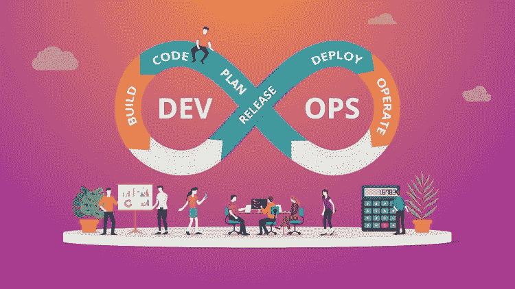
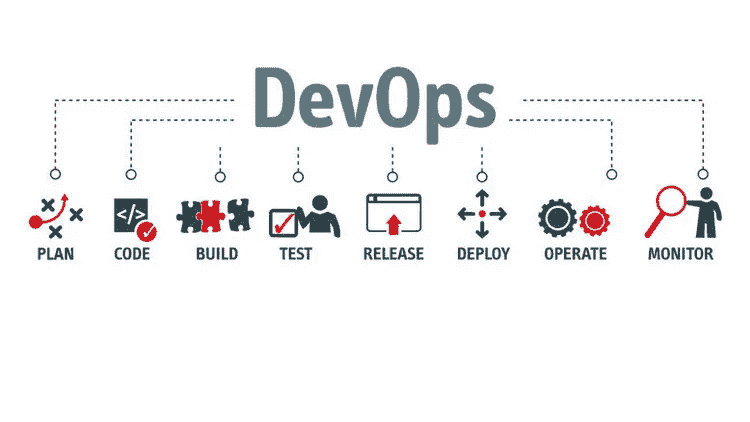
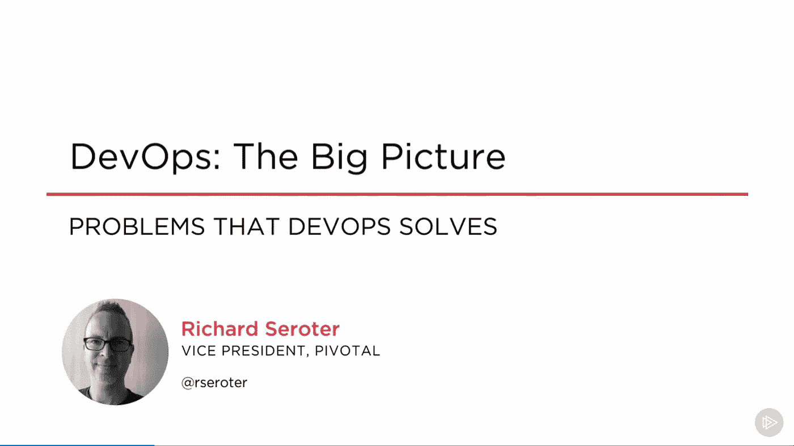
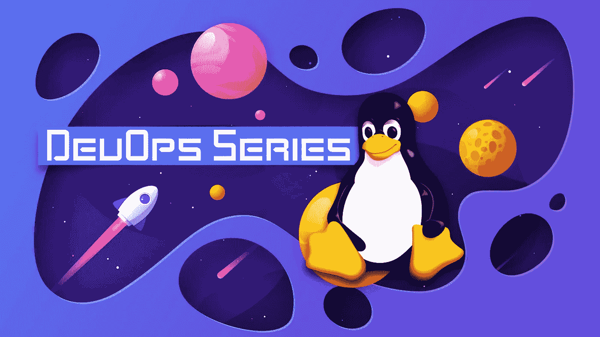
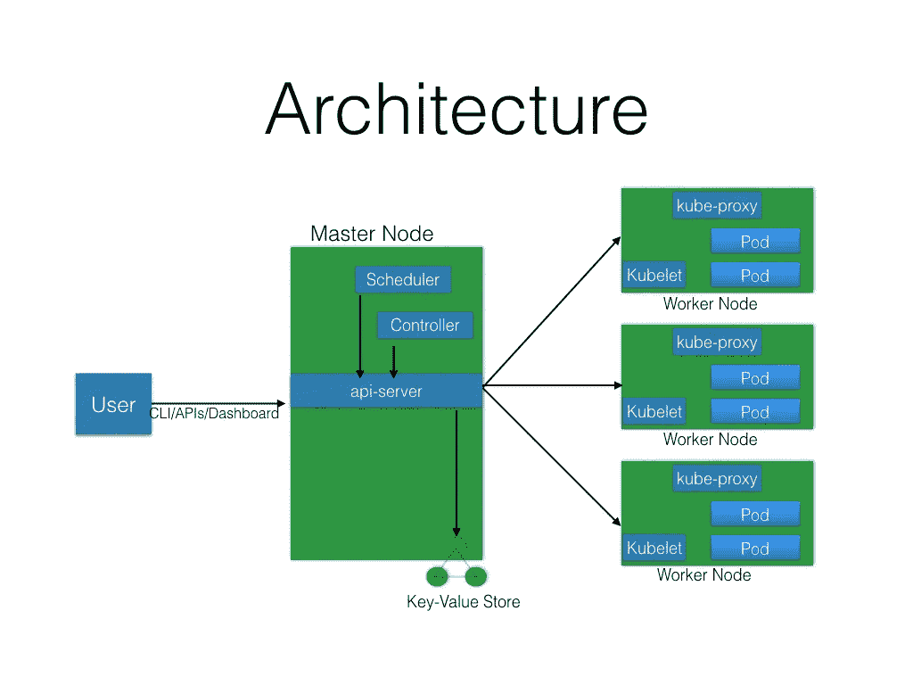
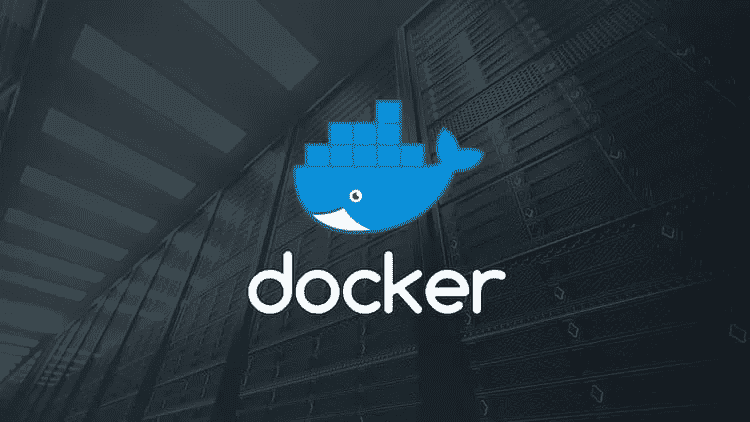

# 2023 年面向有经验开发人员的 15 门最佳 DevOps 在线课程

> 原文：<https://medium.com/javarevisited/13-best-courses-to-learn-devops-for-senior-developers-in-2020-a2997ff7c33c?source=collection_archive---------0----------------------->

## 来自 Udemy、Coursera、ZTM 学院和 Pluralsight 的最佳 DevOps 在线课程，供有经验的程序员学习，并在 2023 年成为 SRE 和 DevOps 工程师

大家好，你们可能知道 DevOps 是大型和小型组织最需要的技能之一。因此， [DevOps 工程师](/javarevisited/top-5-online-courses-to-become-a-devops-engineer-in-2020-764f5e60c2b)对于不想从事人事管理或项目管理等一般工作的人来说，也是薪酬最高的技术工作之一。

如果你正在寻求加薪或想让你的职业生涯更上一层楼，学习 DevOps 和工具，如 [Docker](https://www.java67.com/2019/03/5-free-devops-courses-to-learn-jenkins.html) 、 [Kubernetes](/hackernoon/the-2018-devops-roadmap-31588d8670cb) 、 [Jenkins](https://javarevisited.blogspot.com/2018/09/top-5-jenkins-courses-for-java-and-DevOps-Programmers.html) 和 [Maven](https://javarevisited.blogspot.com/2019/03/top-5-course-to-learn-apache-maven-for.html#axzz645Kt2tH8) 可能是一个不错的选择。DevOps 提出了两个词 Development 和 Operations 的缩写，大多数人认为它是一种编程语言的软件，但事实并非如此。它是一种概念或哲学，使开发团队与运营团队在同一个 It 部门或组织内顺利地协同工作。

学习 [DevOps](https://javarevisited.blogspot.com/2018/09/10-devops-courses-for-experienced-java-developers.html) 有助于你了解组织是如何运作的，并让你对产品生命周期的运作方式感到舒适，如果你想在世界上最大的组织和财富 500 强科技公司中获得一份 [DevOps 工程师的工作](https://javarevisited.blogspot.com/2018/10/top-5-carrer-options-for-experienced-java-programmers.html)，并通过学习如何在同一组织内合作来促进你的职业发展，这就是公司对你的要求。

在这篇文章中，我们将看到一些最好的课程，教你如何成为一名 [DevOps 工程师](/hackernoon/the-2018-devops-roadmap-31588d8670cb)，并向你展示公司开发团队的心态，他们如何合作，产品开发的生命周期如何运行，以及公司用来保持其 web 应用程序效率的一些实用工具。

# 2023 年成为 DevOps 工程师的 15 门最佳在线课程

不要再浪费你的时间，这里有最好的 DevOps 在线培训课程，你可以在 2002 年成为一名 DevOps 工程师。这些课程不仅涵盖 DevOps 实践和文化，如对自动化的兴趣，还会教你基本的 DevOps 工具，如 [Maven](https://javarevisited.blogspot.com/2019/03/top-5-course-to-learn-apache-maven-for.html#axzz645Kt2tH8) 、 [Jenkins](/javarevisited/7-best-courses-to-learn-jenkins-and-ci-cd-for-devops-engineers-and-software-developers-df2de8fe38f3) 、 [Docker](https://javarevisited.blogspot.com/2019/05/top-5-courses-to-learn-docker-and-kubernetes-for-devops.html) 和 [Kubernetes](https://javarevisited.blogspot.com/2020/06/top-5-courses-to-learn-kubernetes-for-devops-and-certification.html) 。

## 1. [DevOps 文化和心态](https://coursera.pxf.io/c/3294490/1164545/14726?u=https%3A%2F%2Fwww.coursera.org%2Flearn%2Fdevops-culture-and-mindset)【Coursera】

本课程将带您了解 DevOps 的基本原则，重点关注 DevOps 工程师的思维模式和文化，并向您展示开发和运营团队如何在相同的环境中协同工作。

在整个课程中，你会看到许多公司的案例研究，因此你会有 DevOps 在现实世界中如何工作的实际例子，你可以立即开始在你工作的地方实施这些概念。

以下是你将在 Coursera 上的这个最佳 DevOps 课程中学到的关键技能:

*   什么是 DevOps 的介绍。
*   DevOps 工程师的心态。
*   加快开发和运营团队的时间。

该课程由 Courtney Kissler 创建，由加州大学(UC Davis)提供，受到超过 14000 名在线开发者的信任。你也可以免费参加这个课程。

**以下是加入本课程的链接** : [DevOps 文化和心态](https://coursera.pxf.io/c/3294490/1164545/14726?u=https%3A%2F%2Fwww.coursera.org%2Flearn%2Fdevops-culture-and-mindset)

## [2。CI/CD(持续集成/交付，面向初学者的 devo PS](https://click.linksynergy.com/deeplink?id=JVFxdTr9V80&mid=39197&murl=https%3A%2F%2Fwww.udemy.com%2Fcourse%2Fci-cd-devops%2F)

这是在线学习 CI、CD 和 DevOps 的最佳 Udemy 课程。该课程将在简单的世界中向您传授持续集成、持续交付、部署和 DevOps 的基本概念。

以下是您将在这一最佳 CI/CD 课程中学到的关键技能:

*   持续集成(CI)、持续交付和持续部署(CD)以及开发运维的基本概念。
*   了解为 CI / CD/ DevOps 铺平道路的传统软件开发生命周期中的痛点。
*   了解如何通过引入 CI/CD/DevOps 来大幅提高业务收入和上市时间。
*   了解 CI / CD / DevOps 是如何一步步发展的。这将有助于建立一个坚实的基础，以了解更多关于实现部分和所涉及的工具。
*   学习使用插图、动画和卡通。大约 90%的课程有插图，剩下的 10%由清晰的幻灯片组成。

这也是 Udemy 上评分最高的 DevOps 课程之一，我强烈推荐给任何开始学习 DevOps、CI/CD 和自动部署流程的人。

**这里是加入本课程的链接** — [CI/CD(持续集成/交付，面向初学者的开发操作系统](https://click.linksynergy.com/deeplink?id=JVFxdTr9V80&mid=39197&murl=https%3A%2F%2Fwww.udemy.com%2Fcourse%2Fci-cd-devops%2F)

## 3. [DevOps:大局](https://pluralsight.pxf.io/c/1193463/424552/7490?u=https%3A%2F%2Fwww.pluralsight.com%2Fcourses%2Fdevops-big-picture)【复数视线】

Pluralsight 上的这门课程向您展示了 DevOps 术语背后的方法论，如什么是 DevOps，以及您的组织如何转变其开发和运营团队的工作流程，以便在产品构建和部署中协同工作。

本课程侧重于开发运维团队可以解决的问题，以及如何根据这些工作流条款和用于改造开发和运营团队内部工作的不同技术和工具来改造整个组织。

以下是您将在 Pluralsight 的最佳 DevOps 课程中学习到的关键概念:

*   满足您组织需求的最佳 DevOps 技术。
*   开发运维中使用的技术和工具。
*   DevOps 重点解决的问题。

**以下是加入本课程的链接** — [DevOps:大图](https://pluralsight.pxf.io/c/1193463/424552/7490?u=https%3A%2F%2Fwww.pluralsight.com%2Fcourses%2Fdevops-big-picture)

顺便说一下，你需要一个 Pluralsight 会员资格才能参加这个课程，费用大约是每月 29 美元或每年 299 美元。虽然我向所有程序员和开发人员强烈推荐该会员资格，因为他们总是需要学习和提升自己，但您也可以通过使用他们的 [**10 天免费试用**](https://pluralsight.pxf.io/c/1193463/424552/7490?u=https%3A%2F%2Fwww.pluralsight.com%2Flearn) 免费查看该课程，该课程提供 200 分钟的免费在线培训课程。

<https://pluralsight.pxf.io/c/1193463/424552/7490?u=https%3A%2F%2Fwww.pluralsight.com%2Flearn>  

## [4。DevOps Bootcamp:学习 Linux &成为 Linux 系统管理员](https://academy.zerotomastery.io/p/devops-bootcamp?affcode=441520_zytgk2dn)

这是 DevOps 专业人员和工程师学习 Linux 的另一个令人惊叹的课程，Linux 是 DevOps 的关键技能之一。这个 DevOps Bootcamp 课程的目的是让学生从一个完全的 Linux 初学者成为自信而有效的 Linux 系统管理员。

但是，你可能在想，DevOps 工程师为什么要学 Linux？因为 Linux 为互联网提供了动力。到处都是。从最小到最大的公司，如亚马逊、微软、SpaceX，他们都在后端使用 Linux。

大多数服务器，无论是 Java 应用程序还是 C++应用程序，或者是 [Python](https://becominghuman.ai/7-best-python-online-courses-for-beginners-to-learn-programming-abe12cecb1ad) 和 [JavaScript](https://javinpaul.medium.com/6-best-data-structure-and-algorithms-courses-for-javascript-developers-c35e23236165) 节点服务器都运行在 Linux 上。这意味着对懂得 Linux / DevOps 的人有巨大的工作需求。

有多大？嗯，目前 LinkedIn 上有 88106 个 DevOps 的招聘信息。

但是这个课程不仅仅是为那些想成为 Linux 系统管理员或者全职从事 DevOps 工作的人准备的。

这是每个程序员都要学习的宝贵技能。在你职业生涯的某个时候，你可能不得不使用 Linux。所以这是一个扩展你的技能和推进你职业生涯的绝佳机会。

**以下是加入本课程的链接** — [DevOps Bootcamp:学习 Linux &成为 Linux 系统管理员](https://academy.zerotomastery.io/p/devops-bootcamp?affcode=441520_zytgk2dn)

顺便说一句，你需要一个 [**ZTM 会员**](https://academy.zerotomastery.io/a/aff_c0gnlvf7/external?affcode=441520_zytgk2dn) 才能观看这个课程，这个课程每月花费大约 39 美元，但也提供了许多超级吸引人和有用的课程。您还可以使用我的代码 **FRIENDS10** 获得您选择的任何套餐的 10%折扣。

<https://academy.zerotomastery.io/a/aff_c0gnlvf7/external?affcode=441520_zytgk2dn>  

## 5.[学习 DevOps:完整的 Kubernetes 课程](https://click.linksynergy.com/deeplink?id=JVFxdTr9V80&mid=39197&murl=https%3A%2F%2Fwww.udemy.com%2Fcourse%2Flearn-devops-the-complete-kubernetes-course%2F) [Udemy]

如果你想控制和管理你的容器，你可以看看这个课程，学习如何使用 Kubernetes 来构建和部署你的 web 应用程序，以及如何像 Google 一样实现基础设施的灵活性和效率。

这个关于 DevOps 的课程向你展示了如何安装和使用这个开源软件来自动化部署、扩展容器化的应用，以及在本地主机或亚马逊 [AWS](https://javarevisited.blogspot.com/2020/05/top-5-amazon-web-services-aws-courses-for-beginners-and-experienced-programmers.html) 上管理它们。在 Udemy 上的这个 best DevOps + Kuberentes 课程中，你将学到以下内容:

*   使用 Docker 在容器中构建应用程序，并使用 Kubernetes 集群部署它们。
*   在您的桌面机器上，或者在 Amazon AWS 之类的云上设置您的集群环境。
*   如何用[詹金斯](/javarevisited/top-10-free-courses-to-learn-maven-jenkins-and-docker-for-java-developers-51fa7a1e66f6?source=collection_home---4------3-----------------------)自动创建和部署自己的舵图？

**以下是加入本课程的链接** : [学习 Kubernetes 完整课程](https://click.linksynergy.com/deeplink?id=JVFxdTr9V80&mid=39197&murl=https%3A%2F%2Fwww.udemy.com%2Fcourse%2Flearn-devops-the-complete-kubernetes-course%2F)

## 6. [DevOps 初学者到高级|解码 DevOps 与项目](https://click.linksynergy.com/deeplink?id=CuIbQrBnhiw&mid=39197&murl=https%3A%2F%2Fwww.udemy.com%2Fcourse%2Fdecodingdevops%2F)

这是 Udemy 上相对较新的 DevOps 课程，但它将深入探讨更高级的概念和核心价值观，说明如何在现实世界的组织中实际实施 DevOps。作为一个绝对的初学者开始你的 DevOps 生涯，这是一个很棒的课程。

本课程侧重于使用各种技术部署和配置您的产品或 web 应用程序基础架构，以及如何扩展您的业务成果，面向开发和运营团队。

您还将学习所有的工具和技术，如 Linux、AWS、Bash & Python 脚本、Jenkins、Ansible、Docker、Kubernetes、Cloudformation、Terraform 等，这些都是每个 DevOps 工程师需要的。

以下是您将在 DevOps 工程师最佳 Udemy 课程中学到的关键技能:

*   从头开始学习 DevOps
*   了解各种技术如何在 DevOps 中协同工作
*   了解 DevOps 流程、工具和技术

**这里是加入本课程的链接**——[DevOps 初学者到高级|解码 devo PS 与项目](https://click.linksynergy.com/deeplink?id=CuIbQrBnhiw&mid=39197&murl=https%3A%2F%2Fwww.udemy.com%2Fcourse%2Fdecodingdevops%2F)

## 7. [DevOps 项目— 2023:与 Jenkins Ansible Kubernetes 的 CI/CD](https://click.linksynergy.com/deeplink?id=JVFxdTr9V80&mid=39197&murl=https%3A%2F%2Fwww.udemy.com%2Fcourse%2Fvalaxy-devops%2F)

如果您正在寻找一门实践课程来学习 DevOps 并成为一名 DevOps 工程师，那么这门课程非常适合您。在这门 100%实践课程中，您将在 AWS 上使用 Git、Jenkins、Ansible、Docker 和 Kubernetes 做实验，学习如何创建 DevOps CI/CD 管道。

它还向您展示了如何使用不同技术的概念，如 [Docker](https://www.java67.com/2018/02/5-free-docker-courses-for-java-and-DevOps-engineers.html) 、 [Jenkins](https://dev.to/javinpaul/10-free-devops-courses-to-learn-jenkins-docker-and-maven-for-programmers-ohp) 、 [GIT](https://www.blogger.com/) 、 [Maven](https://www.java67.com/2018/02/6-free-maven-and-jenkins-online-courses-for-java-developers.html) 使用 Amazon AWS 在云上创建容器和部署您的 web 应用程序。此外，您将看到如何在现实世界中使用这些技术的实践练习。

以下是您将在 DevOps 工程师最佳 Udemy 课程中学到的内容:

*   DevOps 技术的概念。
*   设置 DevOps CI/CD 管道以构建和部署实时项目
*   如何在 AWS 云上设置 Kubernetes
*   如何使用 Docker 和 Jenkins 等不同的 DevOps 技术？

**以下是参加本课程的链接** — [DevOps 项目— 2023:与 Jenkins Ansible Kubernetes](https://click.linksynergy.com/deeplink?id=JVFxdTr9V80&mid=39197&murl=https%3A%2F%2Fwww.udemy.com%2Fcourse%2Fvalaxy-devops%2F) 合作的 CI/CD

## 8.[连续交付&devo PS](https://coursera.pxf.io/c/3294490/1164545/14726?u=https%3A%2F%2Fwww.coursera.org%2Flearn%2Fuva-darden-continous-delivery-devops)【Coursera 课程】

这是在 Coursera 上学习 CI/CD 和 DevOps 的好课程。本课程由弗吉尼亚大学提供，由顶尖教师亚历克斯·夸恩教授。本课程将教授您跨学科的技能，以培养您组织中的持续部署能力。

以下是您将在这一面向 DevOps 工程师的最佳 CI/CD 课程中学到的关键技能

1.  诊断团队的交付管道，并提出优先建议来改进它
2.  解释 [DevOps](/javarevisited/top-10-courses-to-learn-devops-for-experienced-programmers-d93b666db151) 中涉及的技能组合和角色，以及它们如何对持续交付能力做出贡献
3.  评审并交付整个开发栈的自动化测试
4.  解释系统运营的关键工作，以及当今领先的技术和工具如何应用于这些工作
5.  解释高功能团队如何使用开发运维及相关方法来达到持续交付能力
6.  促进优先化的、迭代的团队改进交付渠道的进展

这也是一门高产课程，超过 62%的人在完成这些课程后开始了新的职业生涯，超过 42%的人从这门课程中获得了切实的职业利益

**这里是加入本课程的链接**——[连续交付& DevOps](https://coursera.pxf.io/c/3294490/1164545/14726?u=https%3A%2F%2Fwww.coursera.org%2Flearn%2Fuva-darden-continous-delivery-devops)

## [9。了解 DevOps:使用 Terraform 实现基础设施自动化](https://click.linksynergy.com/deeplink?id=JVFxdTr9V80&mid=39197&murl=https%3A%2F%2Fwww.udemy.com%2Fcourse%2Flearn-devops-infrastructure-automation-with-terraform%2F)

Terraform 是一个令人难以置信的工具，它允许您将基础设施视为代码。它允许 DevOps 工程师使用一种称为 HashiCorp 配置语言的声明式配置语言(或可选的 JSON)来定义和配置数据中心基础架构。

如果你想学习 Terraform，那么这是你能参加的最好的 Udemy 课程，它将教你如何用 Terraform 自动化你的基础设施。它涵盖了 Terraform 与 [AWS](/javarevisited/top-10-courses-to-learn-amazon-web-services-aws-cloud-in-2020-best-and-free-317f10d7c21d) ，Packer， [Docker](/javarevisited/10-free-courses-to-learn-docker-and-devops-for-frontend-developers-691ac7652cee?source=---------94------------------) ，ECS，EKS， [Jenkins](/javarevisited/top-10-free-courses-to-learn-maven-jenkins-and-docker-for-java-developers-51fa7a1e66f6?source=collection_home---4------3-----------------------)

以下是您将在这一面向 DevOps 工程师的最佳 Terraform 课程中学到的关键概念和主题:

*   什么是 terraform 以及如何使用
*   知道何时使用 terraform 的不同功能
*   如何将 [Terraform](/javarevisited/7-best-terraform-online-courses-for-devops-engineers-5e4dab297785) 与 AWS 一起使用
*   如何使用 terraform 和 Packer 创建自定义图像
*   能够使用 terraform 应用 DevOps 技术

总体而言，这是学习 Terraform 的最佳在线课程之一，terra form 是 DevOps 工程师的重要工具。

**这是参加本课程的链接**——[学习 DevOps:使用 Terraform 的基础设施自动化](https://click.linksynergy.com/deeplink?id=JVFxdTr9V80&mid=39197&murl=https%3A%2F%2Fwww.udemy.com%2Fcourse%2Flearn-devops-infrastructure-automation-with-terraform%2F)

## [10。码头工人掌握:码头工人船长的 Kubernetes+Swarm](https://click.linksynergy.com/deeplink?id=JVFxdTr9V80&mid=39197&murl=https%3A%2F%2Fwww.udemy.com%2Fcourse%2Fdocker-mastery%2F)

如果你正在寻找一个全面的 Docker 课程来深入学习 Docker，那么别无选择。这是深入学习 Docker 的最佳在线课程。

由 Docker 船长 Bret Fisher 创建的这个在线 Docker 课程将教你如何使用 DevOps 在 Docker、Kubernetes、Compose、Swarm 和 Registry 上构建、测试和部署容器

以下是您将在 DevOps 最佳 Docker 课程中学到的关键概念和技能:

*   如何在你的机器上使用 Docker、Compose 和 Kubernetes 来更好地构建和测试软件。
*   如何用运行在容器中的代码构建开发环境？
*   如何为服务器部署创建 Swarm 和 Kubernetes 集群！
*   像专业人士一样制作 docker 文件和编写文件的最佳实践！
*   如何建立和发布您自己的自定义图像。

这也是 UDemy 上最受欢迎的 Docker 课程，有超过 180，255 名学生，近 39，310 名参与者的平均评分为 4.6。这太不可思议了，您还可以通过包含的实时聊天组(21，000 名成员)更快地学习！)和每周直播问答。

**以下是加入本课程的链接** — [码头工人掌握:码头工人队长的 Kubernetes+Swarm](https://click.linksynergy.com/deeplink?id=JVFxdTr9V80&mid=39197&murl=https%3A%2F%2Fwww.udemy.com%2Fcourse%2Fdocker-mastery%2F)

## [11。詹金斯，从零到英雄:成为 DevOps 詹金斯大师](https://click.linksynergy.com/deeplink?id=JVFxdTr9V80&mid=39197&murl=https%3A%2F%2Fwww.udemy.com%2Fcourse%2Fjenkins-from-zero-to-hero%2F)

Jenkins 是 DevOps 最重要的工具之一，因为它可以帮助您建立交付渠道，这是在线学习 Jenkins 的最佳 Udemy 课程。

在本课程中，您将学习如何成为一名 DevOps 大师，学习 Jenkins &集成强大的工具，如 [Docker](/javarevisited/top-5-free-courses-to-learn-docker-for-beginners-best-of-lot-b2b1ad2b98ad?source=collection_home---4------2-----------------------) 、 [Ansible](https://javarevisited.blogspot.com/2019/11/top-5-course-to-learn-ansible-for-devops.html#axzz6OglQbBaX) 、 [AWS](https://javarevisited.blogspot.com/2020/05/top-5-amazon-web-services-aws-courses-for-beginners-and-experienced-programmers.html) 、 [GIT](/@javinpaul/top-10-free-courses-to-learn-git-and-github-best-of-lot-967aa314ea?source=---------33------------------) &等等！

以下是您将在面向 DevOps 工程师的 best Jenkins 在线课程中学习到的关键主题:

*   什么是詹金斯，它是如何深入工作的
*   什么是持续集成和持续部署
*   了解如何将 Jenkins 与 [Docker](/javarevisited/top-15-online-courses-to-learn-docker-kubernetes-and-aws-for-fullstack-developers-and-devops-d8cc4f16e773) 、 [Ansible](/javarevisited/5-best-ansible-courses-for-devops-engineers-cc87692fdf52) 、 [AWS](/javarevisited/5-best-aws-courses-for-beginners-and-experienced-developers-to-learn-in-2021-563212409fbd?source=rss-bb36d8439904------2&utm_source=dlvr.it&utm_medium=linkedin) 、 [GIT](/javarevisited/7-best-courses-to-master-git-and-github-for-programmers-d671859a68b2) 、Email、Maven 等进行整合！
*   学习如何使用一系列工具设计和构建自己的工作
*   编排当今最流行的开发工具

总的来说，这是一个很好的在线学习詹金斯的课程。这也被超过 42，344 名学生所信任，平均有 4。3 来自近 4，836 名参与者的评分令人印象深刻。

**以下是加入本课程的链接**——[詹金斯，从零到英雄:成为 DevOps 詹金斯大师](https://click.linksynergy.com/deeplink?id=JVFxdTr9V80&mid=39197&murl=https%3A%2F%2Fwww.udemy.com%2Fcourse%2Fjenkins-from-zero-to-hero%2F)

## 12。面向绝对初学者的 Docker 动手——devo PS

这是 Udemy 上最好的 Docker 课程，它将通过动手编程练习来教你，Docker。本课程由 Udemy 上最好的 DevOps 讲师之一 [Mumshad Mannambeth](https://click.linksynergy.com/deeplink?id=JVFxdTr9V80&mid=39197&murl=https%3A%2F%2Fwww.udemy.com%2Fcourse%2Flearn-docker%2F) 创建，本课程非常适合希望学习 Docker 和 containers 的 DevOps 初学者。

以下是您将在面向 DevOps 工程师的最佳 Docker 课程中学习到的关键主题:

*   码头工人和集装箱基础知识
*   带有实践练习的基本 Docker 命令
*   如何通过实践练习使用 Docker 文件构建 Docker 图像
*   Docker Compose 是什么，如何使用？
*   如何使用 Docker 构建应用程序堆栈并结合实践练习

谈到社会证明，这也是 Udemy 上最好的 Docker 课程之一，受到成千上万学习 Docker 的人的信任。它也非常吸引人，有大量的测验和练习。

**这是加入本课程的链接**—[Docker for the very 初学者—动手— DevOps](https://click.linksynergy.com/deeplink?id=JVFxdTr9V80&mid=39197&murl=https%3A%2F%2Fwww.udemy.com%2Fcourse%2Flearn-docker%2F)

## 13。适合绝对的初学者——动手——开发人员

这是从零开始学习英语的最好的课程。本课程由 Mumshad Mannambeth 创建，向 DevOps 的绝对初学者介绍 Ansible。

本课程也非常注重实践，您将在浏览器中通过编码练习来练习 Ansible。

以下是您将在这一面向 DevOps 工程师的最佳可行课程中学到的关键技能:

*   带动手练习的 Ansible 基础
*   YAML 基础和动手练习
*   如何通过动手练习建立可行的库存文件
*   如何通过动手练习建立可行的库存文件
*   如何自动化供应和 web 服务器部署

总的来说，学习 Ansible for DevOps 是一门很棒的课程。这门课程也受到 Udemy 上成千上万开发者的信任，它也是 Udemy 上评分最高的 Ansible 课程之一。

**这是参加本课程** — [的链接，适合完全初学者—动手—开发人员](https://click.linksynergy.com/deeplink?id=JVFxdTr9V80&mid=39197&murl=https%3A%2F%2Fwww.udemy.com%2Fcourse%2Flearn-ansible%2F)

## 14.[Google Kubernetes 引擎入门](https://coursera.pxf.io/c/3294490/1164545/14726?u=https%3A%2F%2Fwww.coursera.org%2Flearn%2Fgoogle-kubernetes-engine)【Coursera】

这个为期一周的在线加速 Google Kubernetes 引擎课程将教你如何使用 Docker 容器，将它们部署到 Google Kubernetes 引擎提供的 Kubernetes 集群，并扩展这些容器以处理增加的流量。

您还将学习如何在 Kubernetes 集群中不断部署新代码以提供应用程序更新。本课程也是 [**准备 Google 云认证的一部分:Coursera 上的云 DevOps 工程师职业证书**](https://coursera.pxf.io/c/3294490/1164545/14726?u=https%3A%2F%2Fwww.coursera.org%2Fprofessional-certificates%2Fsre-devops-engineer-google-cloud) 完成这个会算进去。

以下是针对 DevOps 工程师的最佳 Kubernetes 课程中涵盖的关键主题

*   Docker 之类的容器基础知识
*   如何将现有的应用程序容器化
*   Kubernetes 的基本概念和原则
*   如何使用 CLI 将应用程序部署到 Kubernetes
*   如何使用 Jenkins 建立持续的交付渠道

这是在线学习谷歌云平台 Kubernetes 的最佳课程之一，尤其是在 Coursera 上。如果您熟悉命令行工具、Linux 环境和 web 服务器技术，如 Nginx，您可以成为这个独特设计的 Kubernetes 课程的一部分。它在 Coursera 上提供，任何人都可以免费注册。

**这里是加入本课程的链接** — [开始使用 Google Kubernetes 引擎](https://coursera.pxf.io/c/3294490/1164545/14726?u=https%3A%2F%2Fwww.coursera.org%2Flearn%2Fgoogle-kubernetes-engine)

顺便说一句，如果你觉得 Coursera 的课程有用，因为它们是由知名公司如**谷歌**、 **IBM** 、**亚马逊**和世界上最好的大学创建的，我建议你加入 Coursera 的年度订阅计划 [**Coursera Plus**](https://coursera.pxf.io/c/3294490/1164545/14726?u=https%3A%2F%2Fwww.coursera.org%2Fcourseraplus) 。

<https://coursera.pxf.io/c/3294490/1164545/14726?u=https%3A%2F%2Fwww.coursera.org%2Fcourseraplus>  

这种单次订阅可以让你无限制地访问他们最受欢迎的**课程**、**专业化**、**专业证书**和**指导项目**。它每年花费大约 399 美元，但是它完全值得你的钱，因为你得到了无限的证书。

以上是 2023 年学习 DevOps 的**最佳在线课程**和**成为 DevOps 工程师**，这是开发者薪酬最高的技术工作之一。有经验的开发人员和想转行的高级工程师可以加入这些在线课程，学习 DevOps 原理和实践。

正如我所说的，DevOps 不仅可以改进一个组织的软件开发和交付过程，还可以提高软件的质量。

它还帮助开发人员保持工作与生活的平衡，并防止那些午夜支持电话。这是一个学习这种抢手技能的好时机，可以为你已经丰富多彩的简历添砖加瓦。

您可能喜欢的其他 **DevOps 工具和课程**

*   [2023 年开发运维开发者路线图](/hackernoon/the-2018-devops-roadmap-31588d8670cb)
*   [面向 Java 和 DevOps 专业人员的 10 门免费 Docker 课程](https://javarevisited.blogspot.sg/2018/02/10-free-docker-container-courses-for-Java-Developers.html)
*   [学习 Jenkins 自动化和开发运维的 5 大课程](https://javarevisited.blogspot.com/2018/09/top-5-jenkins-courses-for-java-and-DevOps-Programmers.html)
*   [2023 年学习 Kubernetes 的 7 门免费在线课程](/javarevisited/7-free-online-courses-to-learn-kubernetes-in-2020-3b8a68ec7abc)
*   [学习亚马逊网络服务我最喜欢的课程](https://javarevisited.blogspot.com/2020/05/top-5-amazon-web-services-aws-courses-for-beginners-and-experienced-programmers.html)
*   [5 门免费 Selenium 课程学习自动化测试](https://javarevisited.blogspot.sg/2018/02/top-5-selenium-webdriver-with-java-courses-for-testers.html)
*   [10 Docker 和 Kubernetes 程序员课程](https://dev.to/javinpaul/top-10-courses-to-learn-docker-and-kubernetes-for-programmers-4lg0)
*   面向 Java 开发人员的 6 门 Maven 课程
*   [2023 年 Java 开发人员应该学会的 10 件事](http://javarevisited.blogspot.sg/2017/12/10-things-java-programmers-should-learn.html#axzz53ENLS1RB)
*   [我最喜欢为有经验的人学习 DevOps 的课程](/javarevisited/top-10-courses-to-learn-devops-for-experienced-programmers-d93b666db151)
*   [程序员学习 AWS 和云的 10 门免费课程](/javarevisited/top-10-courses-to-learn-amazon-web-services-aws-cloud-in-2020-best-and-free-317f10d7c21d)
*   [7 门免费课程为 DevOps 学习硒](/javarevisited/top-7-courses-to-learn-selenium-for-java-and-c-developers-to-learn-automation-testing-free-and-e91637cd9622)
*   [2023 年学习 DevOps 的前 5 本书](https://javarevisited.blogspot.com/2020/04/top-5-books-to-learn-devops-for-developers.html)
*   [学习 Docker、Kubernetes 和 AWS 的 15 门在线课程](/javarevisited/top-15-online-courses-to-learn-docker-kubernetes-and-aws-for-fullstack-developers-and-devops-d8cc4f16e773)

感谢您阅读本文。如果你觉得这些最好的 DevOps 在线培训课程有用，那么请与你的朋友和同事分享。如果您有任何问题或反馈，请留言。

**附言——**如果你渴望学习 DevOps，但负担不起参加本课程的费用，并且正在寻找免费的 DevOps 在线培训课程，那么你也可以在 Udemy 上查看本 [**DevOps 基础知识**](https://click.linksynergy.com/deeplink?id=JVFxdTr9V80&mid=39197&murl=https%3A%2F%2Fwww.udemy.com%2Fcourse%2Flinux-academy-devops-essentials%2F) 课程。这是完全免费的，你只需要一个免费的 Udemy 帐户就可以参加这个课程。

<https://click.linksynergy.com/deeplink?id=JVFxdTr9V80&mid=39197&murl=https%3A%2F%2Fwww.udemy.com%2Fcourse%2Flinux-academy-devops-essentials%2F> 