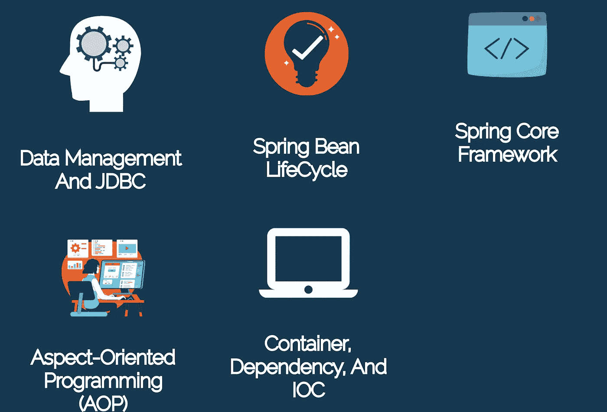
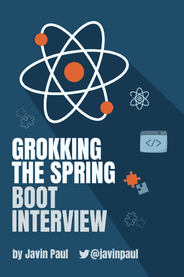
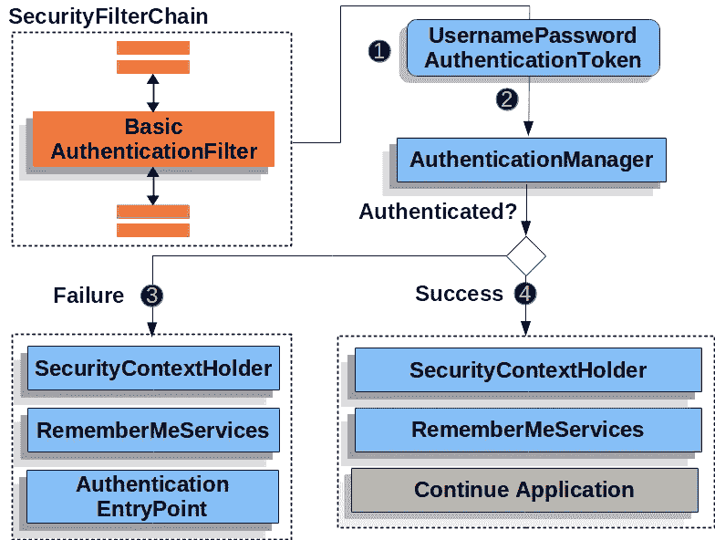

# 2023 年 100+ Spring 框架、Spring Boot、云、Data JPA、Spring 安全面试题

> 原文：<https://medium.com/javarevisited/13-topics-you-should-prepare-for-your-next-spring-boot-interview-5f2993a04ff5?source=collection_archive---------0----------------------->

## 下面列出了你应该为下一次 Java 和 Spring Boot 面试准备的 13 个基本话题和 100 多个面试问题，以及学习它们的资源。

你好，Java 程序员，如果你正在准备 Java 和春季面试，但不知道准备哪些主题和概念，那么你来对地方了。

在过去，我已经为初学者和有经验的 Java 开发人员分享了[顶级 Spring MVC 面试问题](/javarevisited/21-spring-mvc-rest-interview-questions-answers-for-beginners-and-experienced-developers-21ad3d4c9b82)以及[学习 Spring 的最佳课程](/javarevisited/10-best-spring-framework-books-for-java-developers-360284c37036)和 [Spring Boot](/javarevisited/top-10-courses-to-learn-spring-boot-in-2020-best-of-lot-6ffce88a1b6e) ，在这篇文章中，我将分享 *13 个重要的 Spring 话题*你应该为你的下一次 Spring Boot 面试和资源做准备。

Spring Framework 是最流行的、几乎是开发 java 应用程序的标准框架，包括核心 Java 和运行在 Tomcat 等服务器上的 Java web 应用程序。

老实说，破解春季面试并不容易，因为春季非常广阔，很难掌握，但你可以通过采取一种策略来准备重要的话题和概念

像 Java 一样，Spring 框架也非常庞大，有几个子项目，如容器，核心 Spring 概念，如 IoC 和依赖注入，Spring MVC，Spring Boot，Spring Data JPA，Spring Cloud，Spring Boot 测试，Spring Security，Spring Boot 执行器，Spring Boot 自动配置，Spring AOP，以及其他 Spring APIs。

以下是你应该为下一次面试准备的 Spring Framework 主题列表:

**1。** [**容器、依赖项和 IOC**](https://javarevisited.blogspot.com/2011/09/spring-interview-questions-answers-j2ee.html)

**2。春豆生命周期**

**3。面向方面编程**

**4。** [**春天 MVC**](https://www.java67.com/2012/08/spring-interview-questions-answers.html)

**5。** [**Spring Boot 基础知识**](https://www.java67.com/2018/06/top-15-spring-boot-interview-questions-answers-java-jee-programmers.html)

**6。Spring Boot 汽车配置**

**7。Spring Boot 首发依赖**

**8。** [**Spring Boot 执行器**](https://www.java67.com/2021/02/spring-boot-actuator-interview-questions-answers-java.html)

**9。Spring Boot CLI**

**10。Spring Boot 测试**

**11。春云提问**

**12。春季数据 JPA**

**13。弹簧安全**

# 100+ Spring 框架、Spring Boot 和 Spring 安全面试问题

现在，让我们看看每个主题的几个常见问题，以回顾基本概念:

## **1。容器、依赖性和 IOC 问题**

这个主题关注 spring 容器的基础知识，IOC 和依赖注入的主要好处，以及 Spring 框架如何实现它们，下面是这个主题的一些示例问题

1.  **什么是依赖注入和 IOC？Spring MVC 是如何实现它们的？(** [**回答**](https://javarevisited.blogspot.com/2012/12/inversion-of-control-dependency-injection-design-pattern-spring-example-tutorial.html#axzz6u4HTHz4Z) **)**
2.  **春天的 applicationContext 是什么？(回答)**
3.  【BeanFactory 和应用上下文有什么区别？( [**回答**](https://javarevisited.blogspot.com/2012/11/difference-between-beanfactory-vs-applicationcontext-spring-framework.html#axzz6CgkxY2DJ) **)**
4.  什么是组件扫描？Spring 是怎么做组件扫描的？
5.  如何在集成测试中创建一个应用上下文？
6.  **关闭应用程序上下文的首选方式是什么？Spring Boot 为你做这些吗？**
7.  **春天的 Setter 和 Constructor 注入有什么区别？(** [**回答**](https://javarevisited.blogspot.com/2012/11/difference-between-setter-injection-vs-constructor-injection-spring-framework.html) **)**

顺便说一下，你可以在我的书里找到所有这些问题的答案。如果你想以一种结构化和有指导的方式准备 Java 和 Spring 面试，那么你也可以查看我的书 [**搜索 Spring Boot 面试**](https://gumroad.com/l/hrUXKY) **，i** t 涵盖了所有重要的 Spring 主题和概念，这样你就可以在有限的时间内做好准备，你可以在 GumRoad 上只花 10.99 美元就可以买到。

**这里是以 10.99 美元的优惠价获取你的副本的链接** — [寻找春季新兵面试](https://gum.co/hrUXKY)

如果你喜欢在亚马逊上购物，那么这本书现在也可以在亚马逊 Kindle 上预购，如果你喜欢从亚马逊订购，那么你可以使用这个链接— [**在亚马逊上搜索 Spring Boot 访谈**](https://www.amazon.com/dp/B08V1NN4LW/?tag=javamysqlanta-20)

<https://www.amazon.com/dp/B08V1NN4LW/?tag=javamysqlanta-20>  

这本书触及了所有这些主题，并有问题来测试你对这些主题的了解。您可以使用这些问题快速修改那些基本的 Spring 概念，也可以使用这些问题进一步探索 [Spring 框架](/javarevisited/top-10-free-courses-to-learn-spring-framework-for-java-developers-639db9348d25)和 [Spring Boot](/javarevisited/top-10-courses-to-learn-spring-boot-in-2020-best-of-lot-6ffce88a1b6e?source=---------39------------------) 。

## 2.**春豆生命周期面试题**

这是 Spring 面试的另一个重要话题，因为它测试您对 Spring beans 的了解，以及如何在 Spring 容器中创建、管理和销毁它们。对这一主题的深入了解对于创建产品级 spring 应用程序至关重要。

1.  **什么是春豆？谁创建了 Spring bean 的实例？**
2.  **Spring 默认的 bean 作用域是什么？(** [**回答**](https://click.linksynergy.com/deeplink?id=JVFxdTr9V80&mid=39197&murl=https%3A%2F%2Fwww.udemy.com%2Fcourse%2Fspring-hibernate-tutorial%2F) **)
    *提示—单例***
3.  **这个@Bean 注释是做什么的？(** [**回答**](https://www.java67.com/2021/10/pring-bean-example-what-does-bean-annotation-does.html) **)
    *提示—返回一个春豆的实例***
4.  **如果只使用@Bean，默认的 bean id 是什么？你如何能覆盖它？**
5.  **@ Configuration 注释类如何支持单例 beans？**
6.  **能不能让@Bean 方法在春天最终完成？为什么不呢？
    *提示—否***
7.  **可以把@Bean 和@Profile 一起用吗？**
8.  能否将@Component 与@Profile 一起使用？
9.  **有哪些只有 Spring MVC 才有的 bean 作用域？
    ( *提示—请求、会话和全局会话)***

这些是关于 Spring bean 生命周期的一些常见问题，作为 Spring 开发者，你应该知道这些问题的大部分答案，如果不知道，我建议你回到像 Udemy 上的[**Spring&Hibernate for 初学者(包括 Spring Boot)**](https://click.linksynergy.com/deeplink?id=JVFxdTr9V80&mid=39197&murl=https%3A%2F%2Fwww.udemy.com%2Fcourse%2Fspring-hibernate-tutorial%2F) 这样的 Spring 基础课程。这是一门很棒的课程，可以同时学习春天和冬眠。

## **3。面向方面编程(AOP)面试问题**

面向方面编程或 AOP 是另一个驱动 spring 框架的基本概念。这都是关于减少锅炉平台和在一个地方处理横切关注点，以便您可以专注于业务逻辑。虽然这是一个枯燥而又难以掌握的话题，但是您必须熟悉基本的 AOP 概念，比如建议、切入点，以及 AOP 一般是如何工作的。

以下是 Spring 开发人员常见的 AOP 面试问题:

1.  **什么是 AOP？为什么需要 AOP？它解决什么问题？
    提示—交叉关注点**
2.  **什么是跨领域问题？你能说出三个典型的交叉问题吗？**
3.  **Spring 如何解决(实现)一个横切关注点？**
4.  **什么是切入点、连接点、建议、方面、编织？**
5.  **Spring 中使用的两类代理是什么？这两种代理类型的局限性是什么？**
6.  如果你想尝试捕捉异常，你可以使用哪两条建议？
7.  **使用 Spring AOP 必须代理 Spring bean 方法的什么可见性？**

这些是一些常见的 AOP 面试问题。作为一名 Spring 开发人员，您应该知道这些基本 AOP 问题的答案。如果你很难回答这些问题，那么我强烈推荐你参加约翰·汤姆逊教授的[**Spring Core Advanced—Beyond the Basics**](https://click.linksynergy.com/deeplink?id=JVFxdTr9V80&mid=39197&murl=https%3A%2F%2Fwww.udemy.com%2Fcourse%2Fspring-core-advanced-beyond-the-basics%2F)课程，在学习 Spring 和 Java 方面，他是我最喜欢的 Udemy 导师之一。

你也可以在我的博客 [**上找到所有这些问题的答案，17 个面向 Java 和 Spring 开发者的春季 AOP 面试问题**](https://javarevisited.blogspot.com/2021/03/spring-aop-interview-questions-answers.html#axzz6nwXUSoGH) 。

## 4.**春季 MVC 面试问题**

对于任何需要 Spring 技能的 Java 开发人员面试来说，这可能是您应该准备的最重要的主题。这是因为 Spring MVC，这个框架一举成名，并超越了 Struts，开发 Java 应用程序的老框架。 [Spring MVC](/javarevisited/my-favorite-spring-mvc-courses-for-java-developers-5ede7f85dd88) 为开发 Java web 应用程序提供了 MVC 框架的实现。

以下是 Java 开发人员常见的春季 MVC 面试问题:

1.  **能否解释一下 Spring MVC 应用中 HTTP 请求的工作流程？(** [**回答**](https://javarevisited.blogspot.com/2017/06/how-spring-mvc-framework-works-web-flow.html) **)**
2.  **这个@Controller 注释是用来做什么的？**
3.  **Spring 中的@Controller、@Service、和@Repository 有什么区别？(** [**回答**](https://javarevisited.blogspot.com/2017/11/difference-between-component-service.html) **)**
4.  **什么是 DispatacherServlet？它的 it 在 Spring MVC 中的作用是什么？(** [**回答**](https://javarevisited.blogspot.com/2017/09/dispatcherservlet-of-spring-mvc-10-points-to-remember.html) **)**
5.  **InternalResourceViewResolveer 的作用是什么？(** [**回答**](https://javarevisited.blogspot.com/2017/08/what-does-internalresourceviewresolver-do-in-spring-mvc.html) **)**
6.  传入的请求如何映射到控制器和方法？
7.  **@ request mapping 和@GetMapping 有什么区别？(** [**答案**](https://javarevisited.blogspot.com/2021/10/difference-between-requestmapping-and..html) **)**
8.  **@ request param 是做什么用的？**
9.  **@ request param 和@PathVariable 有什么区别？(** [**回答**](https://javarevisited.blogspot.com/2017/10/differences-between-requestparam-and-pathvariable-annotations-spring-mvc.html#axzz5jtleVQXB) **)**
10.  你可以在控制器方法中使用哪些现成的参数类型？
11.  控制器方法的有效返回类型有哪些？

这些是一些基本的 spring MVC 问题，涵盖了 spring MVC 工作流、控制器、视图解析器、dispatcher servlet 和常见的 Spring MVC 注释等概念。

作为一名 spring MVC 开发人员，你应该知道所有这些问题的答案，如果你很难回答这些问题，那么我建议你参加 Spring MVC 进修课程，比如另一位畅销书 Udemy Java 和 Spring 课程讲师 Ranga Karnam 的 [**Spring MVC For 初学者——用 25 个步骤**](https://click.linksynergy.com/deeplink?id=JVFxdTr9V80&mid=39197&murl=https%3A%2F%2Fwww.udemy.com%2Fcourse%2Fspring-mvc-tutorial-for-beginners-step-by-step%2F) 构建 Java Web App。

你也可以在我关于 [20+春季 MVC 面试问题及答案](https://javarevisited.blogspot.com/2018/11/top-20-spring-mvc-interview-questions-answers-for-java-developers.html)的博文中找到所有这些问题的答案。

## 5. **Spring Boot 基础知识**面试问题

我们正在讨论 spring Boot 面试，那么我们怎么能错过 Spring boot 问题呢？这个主题集中在基本的 Spring boot 面试问题上，如 Spring Boot 如何工作，它解决了什么问题，您如何利用 Spring Boot 的功能，如自动配置、启动器依赖性、spring boot CLI 和执行器。

以下是这个话题的一些 Spring Boot 问题示例:

1.  **@ spring boot application 注释是做什么的？(** [**回答**](https://javarevisited.blogspot.com/2018/05/the-springbootapplication-annotation-example-java-spring-boot.html#axzz6qnblZnVj) **)**
2.  **@ enable auto configuration 和@SpringBootApplication 的区别？(** [**回答**](https://www.java67.com/2018/05/difference-between-springbootapplication-vs-EnableAutoConfiguration-annotations-Spring-Boot.html) **)**
3.  使用 Spring Boot 的优势是什么？
4.  **你能说出 5 种 Spring Boot 注解及其作用吗？(回答)**
5.  **哪些事情影响了 Spring Boot 的设置？**
6.  **什么是 Spring Boot 首发？为什么有用？**
7.  你能用 Spring Boot 控制伐木吗？怎么会？
8.  **春季开机如何启用 SQL 日志？(** [**回答**](https://javarevisited.blogspot.com/2022/02/how-to-log-sql-statements-in-spring.html) **)**
9.  **Spring Boot 默认在哪里找一个** `**pplication.properties**` **文件？**
10.  **Spring Boot 支持哪些嵌入式容器？
    *提示— Tomcat(默认)、Jetty 和 under flow***
11.  **为了配置外部 MySQL，需要定义哪些属性？**

这些是一些 Spring Boot 问题的例子。如果你在 Spring Boot 申请中工作过，那么你可以很容易地回答这些问题，但是如果你很难回答这些问题，那么我建议你参加一个全面的 Spring Boot 课程来更新你的知识。如果你需要推荐，我建议你参加 Udemy 上 Ranga Karnam 的 [**学习 Spring Boot 100 步——从初学者到专家**](https://click.linksynergy.com/deeplink?id=JVFxdTr9V80&mid=39197&murl=https%3A%2F%2Fwww.udemy.com%2Fcourse%2Fspring-boot-tutorial-for-beginners%2F) 课程。

你也可以在我为 Java 开发者写的文章 [**15+ Spring Boot 问题**](https://www.java67.com/2018/06/top-15-spring-boot-interview-questions-answers-java-jee-programmers.html) 中找到所有这些春季入门问题的答案。

## 6.**春季数据 JPA** 面试问题

这是许多 Spring 开发人员忘记准备的另一个主题，虽然 Spring Data 不是 JPA 实现，但它通过提供高级抽象简化了数据库的工作。对 Spring Data JPA 的良好了解对于开发一个带有数据库的企业 Spring bot 应用程序是很重要的。

以下是来自 Spring Data JPA 的一些示例问题:

1.  **什么是春季数据 JPA？它解决了哪个问题？**
2.  **什么是 Spring 数据仓库接口？(** [**答案**](https://javarevisited.blogspot.com/2021/10/what-is-spring-data-repository.html) **)**
3.  **如何定义 Spring 数据仓库接口？**
4.  **Spring 数据仓库接口中的 finder 方法的命名约定是什么？**
5.  **Spring 在运行时是如何实现 Spring 数据仓库的？**
6.  **`**@Query**`**标注是用来做什么的？(** [**回答**](https://javarevisited.blogspot.com/2021/09/spring-data-jpa-query-example-tutorial.html) **)****
7.  **在与 JPA 一起工作时，您可以参与 Spring 中的某个给定事务吗？**
8.  ****哪些** `**PlatformTransactionManager**` **(s)可以配合 JPA 使用？****
9.  ****在 Spring 上使用 JPA 需要配置什么？Spring Boot 是如何让这变得更容易的呢？****

**如果您在现实世界中使用过 Spring Data JPA，那么您可以很容易地回答所有这些问题。它们涵盖了像存储库接口和查询注释这样的关键概念，但是如果你很难回答这些问题，那么我建议你去参加一个 Spring Data JPA 课程，比如 Udemy 上 Bharat Thippireddy 的[**Spring Data JPA Using Hibernate**](https://click.linksynergy.com/deeplink?id=JVFxdTr9V80&mid=39197&murl=https%3A%2F%2Fwww.udemy.com%2Fcourse%2Fspring-data-jpa-using-hibernate%2F)。学习 Spring Data JPA 和 Hibernate 都是很棒的课程。**

****

**您可以进一步查看我的文章 [**15+ Spring data 和 JPA**](https://www.java67.com/2021/01/spring-data-jpa-interview-questions-answers-java.html)questions with answers 找到其中许多问题的答案，还有一些用于实践。**

## **7.春季安全面试问题**

**对于 Java 和 Spring Boot 开发人员来说，这是另一个非常重要的话题。无论您使用的是普通 Spring 还是 Spring boot，您都需要使用 Spring Security 来保护您的应用程序，实现认证和授权等。它还支持 JWT 和 OAuth2，并且需要很好的 Spring Boot 概念和 API 知识来破解任何 Java 和 Spring 开发人员面试。**

**以下是 Spring Security 的一些问题示例:**

1.  ****如何在 Java web 应用中启用 Spring 安全？(** [**答案**](https://javarevisited.blogspot.com/2017/05/how-to-enable-spring-security-in-java-web-application.html) **)****
2.  ****如何使用 Spring security 限制活动用户会话的数量？(** [**回答**](https://javarevisited.blogspot.com/2018/07/spring-security-concurrent-session.html) **)****
3.  ****什么是委托过滤器代理？****
4.  ****什么是安全过滤链？(** [**回答**](https://javarevisited.blogspot.com/2017/05/how-to-enable-spring-security-in-java-web-application.html) **)****
5.  ****Spring 中的安全上下文和安全上下文持有者是什么？(** [**回答**](https://javarevisited.blogspot.com/2018/02/what-is-securitycontext-and-SecurityContextHolder-Spring-security.html#axzz6qnblZnVj) **)****
6.  ****Spring Security 支持密码编码吗？****
7.  **为什么需要方法安全性？**
8.  ****什么类型的对象通常在方法级别受到保护？****
9.  ****`**@PreAuthorized**`**`**@RolesAllowed**`**是做什么的？两者有什么区别？********

****如果你在任何现实世界的 Java 和 Spring Boot 应用程序中使用过 Spring Security，那么你可以很容易地回答这些问题，但是如果你很难回答这些问题并且需要一个复习课程，那么我建议你参加 Udemy 上的 [**Spring Security 零到掌握**](https://click.linksynergy.com/deeplink?id=JVFxdTr9V80&mid=39197&murl=https%3A%2F%2Fwww.udemy.com%2Fcourse%2Fspring-security-zero-to-master%2F) 课程。****

********

****这是最新的 Spring 安全课程，掌握 Spring 安全、认证、授权、用户、角色、权限、CORs、CSRF、JWT、OAuth2 等等。你也可以看我的文章 [**25+春季安全面试问题**](https://javarevisited.blogspot.com/2021/02/spring-security-interview-questions-answers-java.html) 来获得这些问题的答案，以及更多的练习问题。****

## ****8. **Spring Boot 测试**面试问题****

****测试是另一个许多 Java 和 Spring 开发人员没有足够重视的领域，但是从面试的角度来看，它是极其重要的。雇主现在正在寻找能够编写单元测试、创建自动化测试并遵循 [DevOps](/javarevisited/13-best-courses-to-learn-devops-for-senior-developers-in-2020-a2997ff7c33c) 和 [SDLC 最佳实践](/javarevisited/6-best-sdlc-courses-for-beginners-and-experienced-programmers-devops-and-project-managers-b8242c04d761)的开发人员。****

****这就是为什么了解如何使用单元测试和集成测试来测试 spring 和 java 应用程序非常重要。我强烈建议你花些时间准备这个话题。****

****这里有几个简单问题来测试您对 Spring 框架的总体了解，尤其是对 Spring Boot 测试的了解:****

1.  ****如何为 Spring 编写单元测试？你用哪个框架或者库？****
2.  ******如何在 JUnit 集成测试中创建共享的应用程序上下文？******
3.  ******您何时何地在测试中使用@Transactional？******
4.  ****Spring Boot 如何简化写作测试？****
5.  ******`**@SpringBootTest**`**是做什么的？它是如何与@SpringBootApplication 和@SpringBootConfiguration 交互的？********
6.  ******@ context configuration 的目的是什么？******
7.  ******@ context configuration 和@ springapplicationconfiguration 批注有什么区别？(** [**回答**](https://javarevisited.blogspot.com/2019/02/difference-between-contextconfiguration-and-springapplicationConfiguration-annotations-in-spring-boot-testing.html) **)******
8.  ******什么时候要用** `**@SpringBootTest annotation**` **？@SpringBootTest 自动配置什么？******
9.  ****spring-boot-starter-test 给类路径带来了什么依赖？****
10.  ******什么时候要用** `**@WebMvcTest**` **和** `**@DataJpaTest**` **？(** [**回答**](https://javarevisited.blogspot.com/2021/09/difference-between-webmvctest-and-da.html) **)******
11.  ******@Mock bean 和@ Mock 有什么区别？******

****如果你一直在为你的 spring boot 应用程序编写单元测试，那么你可以很容易地回答这个问题，但是如果你没有太多的接触，并且想要一个复习课程，那么我推荐 Udemy 上约翰·汤姆逊的 [**测试 Spring Boot:初学者到大师**](https://click.linksynergy.com/deeplink?id=JVFxdTr9V80&mid=39197&murl=https%3A%2F%2Fwww.udemy.com%2Fcourse%2Ftesting-spring-boot-beginner-to-guru%2F) 课程。这是学习基础知识和高级弹簧靴测试概念的好课程。****

********

****你可以进一步查看我关于 [**20+ Spring Boot 测试面试问题**](https://javarevisited.blogspot.com/2021/02/-spring-boot-testing-interview-questions-answers-java.html) 的文章，找到以上问题的答案，也可以查看更多的练习题。****

## ****9.春云面试问题****

****这是一个相对较新的话题，但鉴于云计算和微服务的重要性，这是一个极其重要的话题。大多数新的 Java 开发都是在云原生世界上进行的，Spring Cloud 是一个领先的框架，与 Quarkus 和 Micronauts 齐名。如果你在职位描述中看到微服务这个词，那么你必须准备好 Spring 云和微服务问题。****

****以下是一些问题示例:****

1.  ******什么是春云？它解决什么问题？******
2.  ****春天的云有哪些特征？****
3.  ****你将如何使用 Spring Cloud 实现负载平衡？****
4.  ******你对服务注册和发现的理解是什么？******
5.  ******什么是 Hystrix？******
6.  ****网飞在假装什么？****
7.  ******春云巴士有什么用？******
8.  ******歇斯底里断路器的目的是什么？******
9.  ******尤里卡和动物园管理员的好处是什么？******

****这些是一些基本的问题，如果你阅读过 Spring Cloud 并在其中工作过，那么你可以回答这些问题。如果你想了解更多，我推荐你参加 Udemy 上 Ranga Karnam 的 [**大师微服务与 Spring Boot 和春云**](https://click.linksynergy.com/deeplink?id=JVFxdTr9V80&mid=39197&murl=https%3A%2F%2Fwww.udemy.com%2Fcourse%2Fmicroservices-with-spring-boot-and-spring-cloud%2F) 这样的综合课程。****

********

****你也可以看看我关于 [**15 个春云面试问题**](https://www.java67.com/2021/01/spring-cloud-interview-questions-with-answers-java.html) 的帖子，找到这些问题的答案，以及更多的练习问题。****

## ****10.Spring Boot 执行器面试问题****

****致动器是 Spring Boot 的另一个重要特征，对 Spring Boot 致动器的充分了解对于生产支持和监控非常重要。您可以使用 Actuator 来公开端点，并在运行时与 Spring boot 应用程序进行交互。Spring Boot 执行器是所有关于支持和监控您的应用程序的运行生产。****

****以下是一些你可以准备的 Spring Boot 致动器面试问题:****

1.  ******Spring Boot 执行器提供什么价值？******
2.  ******您可以使用哪两种协议来访问执行器端点？
    (提示— HTTP)******
3.  ******开箱即用的致动器端点是什么？******
4.  ******信息端点是干什么用的？你如何提供数据？******
5.  ******如何使用记录器的端点来更改包的日志记录级别？******
6.  ******什么是健康指标？******
7.  ******开箱即用的健康指标是什么？******
8.  ******什么是健康指标状态？******
9.  ******开箱即用的健康指示器状态是什么？******
10.  ******如何更改健康指示器状态严重性顺序**？****

****这些是你知道的一些基本的 Spring Boot 致动器面试问题。如果你想了解更多或者想深入学习弹簧靴致动器，那么我建议你加入 Pluralsight 上 Dustin Schultz 课程的 [**弹簧框架:Spring boot 致动器**](https://pluralsight.pxf.io/c/1193463/424552/7490?u=https%3A%2F%2Fwww.pluralsight.com%2Fcourses%2Fspring-framework-spring-boot-actuator) 。****

********

****顺便说一下，你需要一个 [Pluralsight 会员](https://pluralsight.pxf.io/c/1193463/424552/7490?u=https%3A%2F%2Fwww.pluralsight.com%2Flearn)才能加入这个课程，费用大约是每月 29 美元或每年 299 美元(14%的折扣)。我向所有程序员强烈推荐这个订阅，因为它提供了超过 7000 个在线课程的即时访问，以学习任何技术技能。或者，你也可以使用他们的 [**10 天免费通行证**](https://pluralsight.pxf.io/c/1193463/424552/7490?u=https%3A%2F%2Fwww.pluralsight.com%2Flearn) 免费观看这个课程。****

****<https://pluralsight.pxf.io/c/1193463/424552/7490?u=https%3A%2F%2Fwww.pluralsight.com%2Flearn> **** 

****这就是为 Java 和 Spring 开发者面试准备的**基本主题**。为了通过 Java 开发人员面试，你还应该了解基本的 Java 框架，比如 Spring、Spring Boot 和 Hibernate。****

****在我的上一本书 [*探索 Java 面试*](https://gumroad.com/l/QqjGH) 中，我谈到了基本的核心 Java 主题，如集合、多线程和 Java 基础知识，在本书中，我分享了工作面试中常见的 Spring 框架问题。****

****这本书对于准备[**Spring 专业认证考试**](https://javarevisited.blogspot.com/2018/08/how-to-crack-spring-core-professional-certification-exam-java-latest.html#axzz5j90KOik7) 的 Java 开发人员也很有用，因为我已经试着回答了官方 Spring 认证考试指南中的大部分问题。这意味着您也可以将此作为春季认证准备的复习学习指南。****

****如果你喜欢我的作品，你可能也会喜欢我的其他书籍和课程。****

1.  ****[钻研 Java 面试](https://www.amazon.com/dp/B08P55JZBX/?tag=javamysqlanta-20)****
2.  ****[Udemy](https://www.udemy.com/course/spring-professional-practice-test-questions-vmware-edu-certification/?couponCode=5DAYPROMO)春季认证实务考试****
3.  ****[Udemy 上的 AZ 300 模拟测试](https://www.udemy.com/course/az-303-microsoft-azure-architect-technologies-practice-tests/?couponCode=5DAYSPECIAL)****
4.  ****[Udemy 上的 ACP-100 模拟测试](https://www.udemy.com/course/acp-100-jira-server-administrator-exam-practice-tests-quizes/?couponCode=5DAYSPECIAL)****

****再次感谢大家的爱和支持。我非常感谢你对我第一本书的回应。如果您有任何反馈或疑问，请随时提问。****

****如果你的目标是今年的春季认证，那么你也可以在 Udemy 上参加我的 [**春季认证实践课程**](https://www.udemy.com/course/spring-professional-practice-test-questions-vmware-edu-certification/?referralCode=7419B0A2C8AB79F0520E) 。它包含 5 个全程考试的 250 多个高质量练习题，以测试您在真实考试中的知识。****

****<https://www.udemy.com/course/spring-professional-practice-test-questions-vmware-edu-certification/?referralCode=7419B0A2C8AB79F0520E> ****