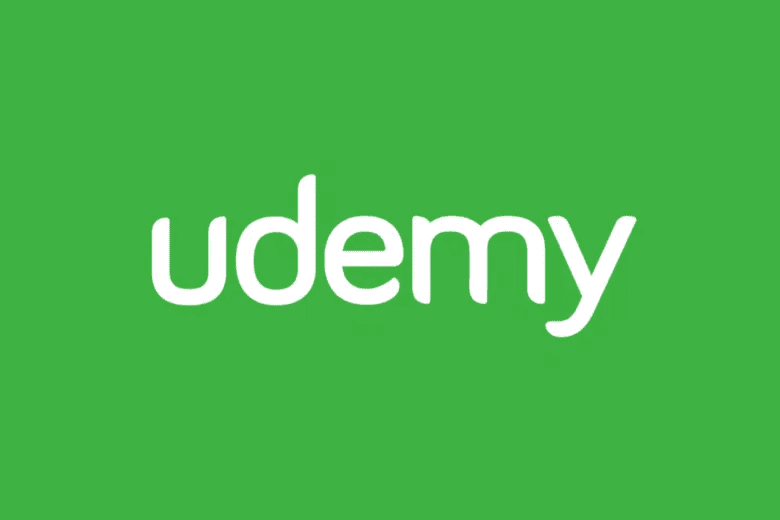
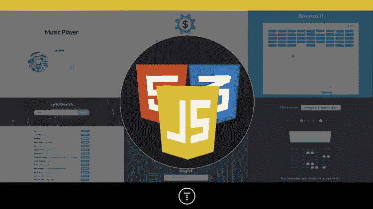
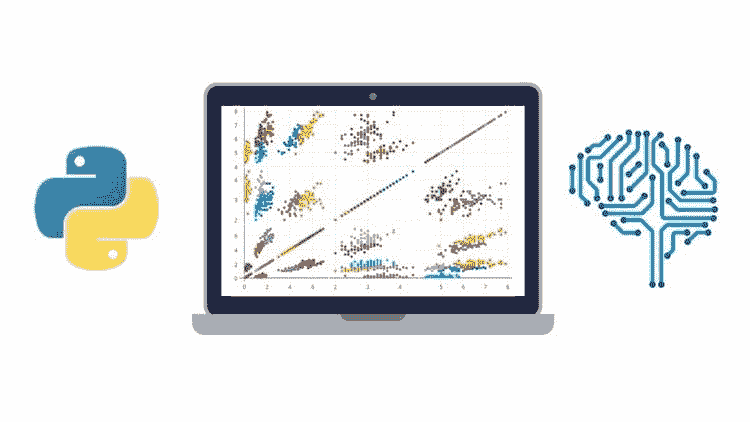
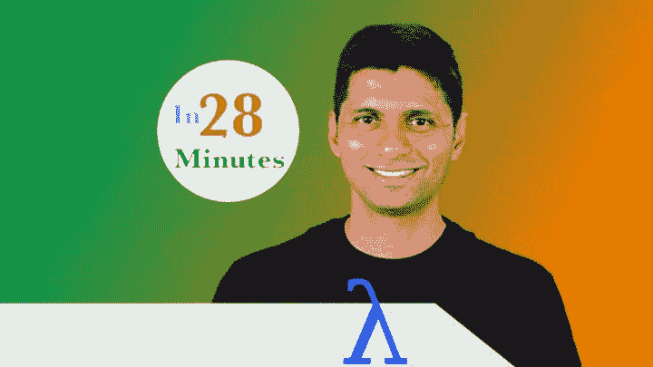
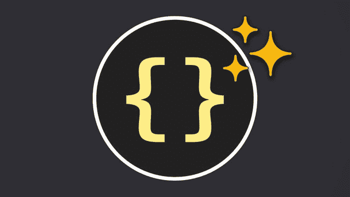
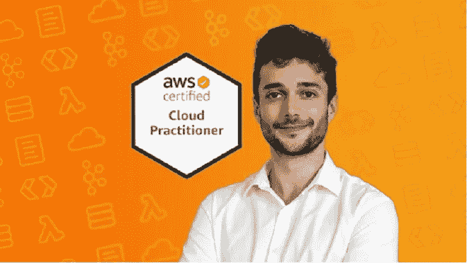

# 2023 年学习编程和软件开发的 15 门最佳 Udemy 课程

> 原文：<https://medium.com/javarevisited/15-best-udemy-courses-programmers-can-buy-on-black-friday-and-cyber-monday-2020-a803874f41d9?source=collection_archive---------1----------------------->

## 这些是 2023 年程序员和软件开发人员可以在 Udemy sales 上购买的学习 Java、Python、Docker、Web 开发等更多内容的最佳在线课程

大家好，Udemy 正在进行今年最大的销售。这实际上是购买一些优质课程的好时机，因为你不会再有机会以低至 **$9.9** 的价格购买课程，但最大的问题是你应该购买哪些课程？

嗯，我总是从知名导师那里购买课程，以及一些教授常青树和热门技能的东西，如 [Java](/javarevisited/top-5-java-online-courses-for-beginners-best-of-lot-1e1e240a758) 、 [Python](/better-programming/top-5-courses-to-learn-python-in-2018-best-of-lot-26644a99e7ec) 、[微服务](/javarevisited/10-best-java-microservices-courses-with-spring-boot-and-spring-cloud-6d04556bdfed)、 [Docker](/javarevisited/10-free-courses-to-learn-docker-and-devops-for-frontend-developers-691ac7652cee?source=---------94------------------) 、 [Kubernetes](https://javarevisited.blogspot.com/2020/06/top-5-courses-to-learn-kubernetes-for-devops-and-certification.html) 和 [AWS](/javarevisited/top-10-courses-to-learn-amazon-web-services-aws-cloud-in-2020-best-and-free-317f10d7c21d) 。我通常会在 Udemy sales 上购买很多课程，然后在需要的时候访问它们。

不过，我必须警告你，Udemy 是会上瘾的，我经常会购买比我需要的更多的课程，所以要小心，购买你现在或不久的将来需要的课程。

由于我在 udemy 课程上花了很多时间，许多人也来问我关于购买哪些 Udemy 课程或某个特定主题的最佳 Udemy 课程的建议。

在回答了 LinkedIn 和脸书上的许多读者后，我决定写下 2023 年你能买到的 15 门最好的 Udemy 课程。

因为我已经有了很多 Udemy 的课程，所以我选择了今年由 Brad Traversy，@Maximillian SchwarzMuller，Andrei Neagoie，Jose，Angela Yu，Ranga Karnam 等导师发布的最佳课程。

这些是来自 Udemy 的最好的在线课程，它们是最新的、最有吸引力的，花 9.9 美元左右购买是你今年能做的最好的投资，如果你想买书，你可以看看我的第一本书，GumRoad 上的[**Grokking the Java interview**](https://gumroad.com/l/QqjGH)。

# 2023 年程序员和软件工程师的 15 门最佳 Udemy 课程

在不浪费你更多时间的情况下，这里列出了 2023 年你可以在 Udemy sales 上买到的最好的在线课程。课程排名不分先后，但我强烈推荐购买 Docker 课程，因为这是云原生开发的最重要工具之一。

## 1. [100 天的代码—2023 年完整的 Python Pro 训练营](https://click.linksynergy.com/deeplink?id=JVFxdTr9V80&mid=39197&murl=https%3A%2F%2Fwww.udemy.com%2Fcourse%2F100-days-of-code%2F)

如果你想学习 Python 并成为一名 Python 专业人士，那么你一定会喜欢上来自于 Angela Yu 的这门课程，她是 Udemy 最好的讲师之一。参加过她的 iOS 和 Web 开发课程后，我可以保证她作为讲师的教学技能。

顾名思义，本课程将通过在 100 天内**构建 100 个项目**来教你 [Python](https://javarevisited.blogspot.com/2019/09/5-websites-to-learn-python-for-free.html) 。你将学习用 Python 来构建网站、游戏、应用程序，以及抓取和数据科学。

如果你喜欢基于项目的课程，我强烈推荐你加入 Udemy 上的 Angela Yu 杰作。

**这里是参加 MERN 课程的链接—** [100 天的代码—完整的 Python Pro 训练营](https://click.linksynergy.com/deeplink?id=JVFxdTr9V80&mid=39197&murl=https%3A%2F%2Fwww.udemy.com%2Fcourse%2F100-days-of-code%2F)

## 2.[完成 SQL +数据库训练营:零到精通【2023】](https://click.linksynergy.com/deeplink?id=JVFxdTr9V80&mid=39197&murl=https%3A%2F%2Fwww.udemy.com%2Fcourse%2Fcomplete-sql-databases-bootcamp-zero-to-mastery%2F)

这是安德烈的另一门课，我强烈推荐。SQL 是一项永远需要的技能，学习 SQL 永远不会出错。虽然 Udemy 上有很多好的 SQL 课程，但这是最新最全面的。

它不仅会帮助你掌握 SQL、数据库管理和设计，还会教你如何使用数据库，如 [PostgreSQL](https://javarevisited.blogspot.com/2020/02/top-5-courses-to-learn-postgresql-in.html) 、 [MySQL](/@javinpaul/top-5-courses-to-learn-mysql-in-2020-4ffada70656f) +等等。

它涵盖了窗口函数等高级概念，还附带了大量练习来挑战和培养您的 SQL 技能。

**这里是参加 MERN 课程的链接—** [完整的 SQL +数据库训练营:零到精通](https://click.linksynergy.com/deeplink?id=JVFxdTr9V80&mid=39197&murl=https%3A%2F%2Fwww.udemy.com%2Fcourse%2Fcomplete-sql-databases-bootcamp-zero-to-mastery%2F)

此外，如果你喜欢安德烈·尼戈亚的课程，那么你也可以订阅他的 [**ZTM 学院**](https://academy.zerotomastery.io/p/academy?affcode=441520_zytgk2dn) 课程，在那里你每月只需花费 29 美元就可以获得他目前和未来的所有课程。你可以用我的代码**好友 10** 打九折。

<https://academy.zerotomastery.io/p/academy?affcode=441520_zytgk2dn>  

## 3. [20 个使用普通 JavaScript 的 Web 项目](https://click.linksynergy.com/deeplink?id=JVFxdTr9V80&mid=39197&murl=https%3A%2F%2Fwww.udemy.com%2Fcourse%2Fweb-projects-with-vanilla-javascript%2F)

没有人像 Brad Traversy 那样解释项目，这就是为什么我喜欢他的课程。他在 YouTube 上有一些令人印象深刻的视频，这就是我如何发现它的，但从这些视频中，我成为了他的声音和清晰的教学风格的巨大粉丝。

在解释复杂的技术问题时保持清晰和简洁并不容易，但布拉德有特殊的技能。

如果你喜欢基于项目的课程，那么我强烈推荐你参加这个课程，在这里你将通过用 HTML5、CSS 和 JavaScript(没有框架或库)从头构建 20 个迷你前端项目来学习 JavaScript

**这里是购买这个 JavaScript 课程的链接—** [20 个使用普通 JavaScript 的 Web 项目](https://click.linksynergy.com/deeplink?id=JVFxdTr9V80&mid=39197&murl=https%3A%2F%2Fwww.udemy.com%2Fcourse%2Fweb-projects-with-vanilla-javascript%2F)

## 4.库贝内特斯:实用指南

毫无疑问，Docker 是一项受欢迎的技能，可能是你在 2023 年应该学习的#1 工具。虽然 Udemy 上有许多很棒的 Docker 课程，但 Maximillan Scwarzmull 的这个课程是最完整和最新的。

在本课程中，您将从头开始学习 Docker、Docker Compose、多容器项目、部署以及所有关于 Kubernetes 的内容！自从几周前发布以来，已经有超过 13，000 名学生加入了这门课程。

如果你想在 Udemy 上买一门课程，就买这门。

这里是购买这个 udemy 课程的链接——[Docker&Kubernetes:实用指南](https://click.linksynergy.com/deeplink?id=JVFxdTr9V80&mid=39197&murl=https%3A%2F%2Fwww.udemy.com%2Fcourse%2Fdocker-kubernetes-the-practical-guide%2F)

## 5. [Java 多线程、并发和性能优化](https://click.linksynergy.com/deeplink?id=JVFxdTr9V80&mid=39197&murl=https%3A%2F%2Fwww.udemy.com%2Fcourse%2Fjava-multithreading-concurrency-performance-optimization%2F)

多线程和并发性是 Java 开发人员最需要的技能之一。对很好理解多线程和并发的 Java 开发人员要求很高，但同时，这也是很难掌握的课题之一。

如果你想让你的并发技能更上一层楼，想成为 Java 中的[多线程](/javarevisited/8-best-multithreading-and-concurrency-courses-for-experienced-java-developers-8acfd3b25094)、[并发](/javarevisited/6-multithreading-and-concurrency-books-every-java-programmer-should-read-b6a08d2aae54)、[并行编程](https://javarevisited.blogspot.com/2018/06/top-5-java-multithreading-and-concurrency-courses-experienced-programmers.html)的专家，并且非常强调高性能，那么我向你强烈推荐这门课程。我把它放在第一个位置是有原因的，因为这可能是这个列表中最重要的课程，并强烈推荐每个 Java 开发人员去学习它。

**这里是加入本课程的链接** — [Java 多线程、并发和性能优化](https://click.linksynergy.com/deeplink?id=JVFxdTr9V80&mid=39197&murl=https%3A%2F%2Fwww.udemy.com%2Fcourse%2Fjava-multithreading-concurrency-performance-optimization%2F)

## 6.[与 Spring Boot 和春云一起掌握微服务](http://bit.ly/2yjLysL)

微服务是 Java 开发人员最重要的技能之一，如果你不知道微服务，我强烈建议你在 2023 年学习微服务。

虽然这不是一门新课程，但如果你还没有参加过，我强烈建议你参加，通过 Spring Boot 和 Spring Cloud 学习微服务，这是微服务开发的两个领先的 Java 框架。

本课程由 Ranga Karnam 和 28 分钟官方创建，提供了一个从 Restful Web 服务(REST API)到 Java 微服务、Spring Boot 和 Spring Cloud 的精彩旅程，这是 Java 开发人员的两个基本框架。

**以下是加入本次微服务课程的链接—** [与 Spring Boot、春云一起掌握微服务](http://bit.ly/2yjLysL)

## 7. [MERN 电子商务从无到有](https://click.linksynergy.com/deeplink?id=JVFxdTr9V80&mid=39197&murl=https%3A%2F%2Fwww.udemy.com%2Fcourse%2Fmern-ecommerce%2F)

这是一个基于项目的在线课程，自从 Brad Traversy 第一次在 Twitter 上宣布以来，我已经跟踪了很长时间。

用 [React](/javarevisited/top-10-free-courses-to-learn-react-js-c14edbd3b35f?source=extreme_main_feed----d3a191ac6ed-----5-1--------------------561c2dc6_a2b4_41e0_b7be_1d97edbf631c--8) 、 [Redux](https://javarevisited.blogspot.com/2018/08/top-5-react-js-and-redux-courses-to-learn-online.html#axzz5r06B3egD) 、Express &、 [MongoDB](/javarevisited/5-best-mongodb-courses-to-learn-nosql-for-beginners-in-2020-42df5af5496c) 从头开始构建一个电子商务平台，这是一个超过 15 个小时的大课程。

如果你喜欢基于项目的课程，那么你会喜欢这个，我强烈推荐这个课程给任何想学习 MERN 网络开发堆栈和提升他们的 React，Redux，Express & MongoDB 技能的人。

**以下是参加 MERN 课程的链接—** [MERN 电子商务从零开始](https://click.linksynergy.com/deeplink?id=JVFxdTr9V80&mid=39197&murl=https%3A%2F%2Fwww.udemy.com%2Fcourse%2Fmern-ecommerce%2F)

## 8. [Java 应用性能和内存管理](https://click.linksynergy.com/deeplink?id=JVFxdTr9V80&mid=39197&murl=https%3A%2F%2Fwww.udemy.com%2Fcourse%2Fjava-application-performance-and-memory-management%2F)

内存管理和应用程序性能故障排除是另一个让许多 Java 开发人员头疼的话题。

虽然 Java 在内存管理方面要简单得多，特别是与像 [C++](/javarevisited/top-10-courses-to-learn-c-for-beginners-best-and-free-4afc262a544e) 这样的语言相比，但是作为一名 Java 程序员，您需要了解一些 JVM 的知识。

这是一个学习如何调优 [JVM](/javarevisited/7-best-courses-to-learn-jvm-garbage-collection-and-performance-tuning-for-experienced-java-331705180686) 并做出好的编码选择以确保你的应用程序最佳运行的绝佳课程。如果你想编写高性能的 Java 应用程序，或者你的工作涉及到改进遗留应用程序的性能，那么这个课程就是为你准备的。

**以下是参加本课程的链接-** [Java 应用程序性能和内存管理](https://click.linksynergy.com/deeplink?id=JVFxdTr9V80&mid=39197&murl=https%3A%2F%2Fwww.udemy.com%2Fcourse%2Fjava-application-performance-and-memory-management%2F)

## 9.[Java 中的多线程和并行计算](https://click.linksynergy.com/fs-bin/click?id=JVFxdTr9V80&subid=0&offerid=323058.1&type=10&tmpid=14538&RD_PARM1=https%3A%2F%2Fwww.udemy.com%2Fmultithreading-and-parallel-computing-in-java%2F)

这是 Udemy 的另一个很棒的 Java 并发和多线程课程，但是它不是免费的。它的正常价格约为 200 美元，但你可以在 Udemy 的几个在线销售网站上以 9.99 美元的价格买到它，这几乎是免费的。

与之前的课程相比，本课程内容详尽，涵盖了更多主题和模式，并提供了一些真实的例子。

除了多线程的基础知识，如线程、锁、同步、阻塞等，您还将了解并发集合，它可以简化一些并发设计模式，如[生产者-消费者模式](https://javarevisited.blogspot.com/2015/07/how-to-use-wait-notify-and-notifyall-in.html)。

除了生产者-消费者，本课程还解释了用餐哲学家问题，并演示了两个模拟项目，即学生图书馆模拟和小游戏模拟，这将使您能够应用所学的知识。

**这里是加入本课程**——[Java 中的多线程和并行计算](https://click.linksynergy.com/fs-bin/click?id=JVFxdTr9V80&subid=0&offerid=323058.1&type=10&tmpid=14538&RD_PARM1=https%3A%2F%2Fwww.udemy.com%2Fmultithreading-and-parallel-computing-in-java%2F)的链接

## 109. [2023 用于机器学习的 Python&数据科学大师班](https://click.linksynergy.com/deeplink?id=JVFxdTr9V80&mid=39197&murl=https%3A%2F%2Fwww.udemy.com%2Fcourse%2Fpython-for-machine-learning-data-science-masterclass%2F)

这是 Udemy 最成功的导师和 Python 大师班课程作者何塞·波尔蒂利亚的又一杰作。

伟大的何塞·马西亚尔·波尔蒂利亚有许多关于 Udemy Python、 [SQL](/hackernoon/top-5-sql-and-database-courses-to-learn-online-48424533ac61) 、 [Flask](https://javarevisited.blogspot.com/2020/01/top-5-courses-to-learn-flask-for-web-development-with-python.html) 、 [Django](/@javinpaul/my-favorite-courses-to-learn-django-for-beginners-2020-ac172e2ab920) etch 的精彩课程，但这次他带来了一门专门学习机器学习和 Python 数据科学的课程。

如果你想用 Python 学习[数据科学](/javarevisited/my-favorite-data-science-and-machine-learning-courses-from-coursera-udemy-and-pluralsight-eafc73acc73f)和[机器学习](/javarevisited/top-10-machine-learning-and-data-science-certifications-and-training-courses-for-beginners-and-a6308497b764)，包括 Numpy、Pandas、Matplotlib、Scikit-Learn 等等，那么这是你应该在 Udemy 上购买的课程。

**这里是购买本 Python 课程的链接—** [2023 机器学习的 Python&数据科学大师班](https://click.linksynergy.com/deeplink?id=JVFxdTr9V80&mid=39197&murl=https%3A%2F%2Fwww.udemy.com%2Fcourse%2Fpython-for-machine-learning-data-science-masterclass%2F)

## 11.[2023 年全网&手机设计师:UI/UX、Figma、+more](https://click.linksynergy.com/deeplink?id=JVFxdTr9V80&mid=39197&murl=https%3A%2F%2Fwww.udemy.com%2Fcourse%2Fcomplete-web-designer-mobile-designer-zero-to-mastery%2F)

Andrei Negaoie 是今年另一位引起我注意的教练。参加过他的 Python 和 JavaScript 课程后，我喜欢他教授和创建超级吸引人的课程的方式，这个课程是另一个例子。

如果你想在 2023 年成为一名设计师，那么你应该参加这个课程。它会教你如何从零开始掌握移动和[网页设计](https://www.java67.com/2020/08/top-5-courses-to-learn-responsive-web-design-best.html)，用户界面+用户体验(UI/UX 设计)，HTML，CSS。

该课程有超过 24 小时的最新内容，以学习 UI/UX、Figma 等。

**这里是购买本设计课程的链接—** [全网&2023 年手机设计师:UI/UX，Figma](https://click.linksynergy.com/deeplink?id=JVFxdTr9V80&mid=39197&murl=https%3A%2F%2Fwww.udemy.com%2Fcourse%2Fcomplete-web-designer-mobile-designer-zero-to-mastery%2F)

顺便说一句，如果你喜欢安德烈的课程，那么你也可以加入他的[**Zero to Mastery Academy**](https://academy.zerotomastery.io/a/aff_c0gnlvf7/external?affcode=441520_zytgk2dn)，在那里你只需订阅一次就可以获得他的所有课程。每月花费大约 39 美元，但绝对值得。您现在还可以使用优惠券代码 **FRIENDS10 获得 10%的折扣**。

<https://academy.zerotomastery.io/a/aff_c0gnlvf7/external?affcode=441520_zytgk2dn>  

## 12.[用 Lambdas & Streams](https://click.linksynergy.com/deeplink?id=JVFxdTr9V80&mid=39197&murl=https%3A%2F%2Fwww.udemy.com%2Fcourse%2Ffunctional-programming-with-java%2F) 学习 Java 函数式编程

这可能是从 Java 函数式编程开始的最好的 Udemy 课程。在这个动手课程中，我们将学习用函数式编程编写一些优秀的 Java 代码。

您不仅将学习 Java 函数式编程的基础知识，如 Lambda 表达式、方法引用、流和函数接口，还将通过解决难题、练习和使用 JShell 编写程序来实践这些概念。

本课程还使用了 [Eclipse](/javarevisited/top-10-courses-to-learn-eclipse-junit-and-mockito-for-java-developers-4de1e8d62b96?source=collection_home---4------1-----------------------) (Java IDE)，如果您是 Java 新手，请不要担心；您还将学习如何设置它。

如果你是函数式编程的新手，那么这是最好的入门课程。由 28 分钟官方的 Ranga Rao 创建，他是一位 Java 开发人员，也是 Udemy 的畅销书讲师，这是初学者学习函数式编程的最佳课程。说到社会证明，已经有超过 16K 的学生注册了这门课程。

**这里是加入本课程的链接** — [用 Lambdas & Streams](https://click.linksynergy.com/deeplink?id=JVFxdTr9V80&mid=39197&murl=https%3A%2F%2Fwww.udemy.com%2Fcourse%2Ffunctional-programming-with-java%2F) 学习 Java 函数式编程

## 13.[清理代码](https://click.linksynergy.com/deeplink?id=JVFxdTr9V80&mid=39197&murl=https%3A%2F%2Fwww.udemy.com%2Fcourse%2Fwriting-clean-code%2F)

编码是一门艺术，不是每个人都能写出经得起时间考验的代码。代码更容易阅读和扩展。健壮且优雅地处理错误的代码，看起来像流动的河流的代码。是的，我说的是干净的代码。

虽然有几门课程可以编写[干净的代码](/javarevisited/clean-code-a-must-read-coding-book-for-programmers-9dc80494d27c)，但是没有一门像这门课一样好。Max 的教学风格将干净的代码编写带到了另一个层次。

简而言之，如果你想学习如何以一种示例驱动的方式一步一步地编写可读、可理解、可维护的代码，那么就在 [Udemy sale](https://javarevisited.blogspot.com/2020/11/top-10-udemy-courses-you-can-buy-in.html#axzz6enw6Ycw1) 上购买这门课程，你会感谢我推荐这门课程。

**这里是购买这个干净代码课程的链接—** [干净代码](https://click.linksynergy.com/deeplink?id=JVFxdTr9V80&mid=39197&murl=https%3A%2F%2Fwww.udemy.com%2Fcourse%2Fwriting-clean-code%2F)

## 14.[学习 DevOps:完整的 Kubernetes 课程](https://click.linksynergy.com/deeplink?id=JVFxdTr9V80&mid=39197&murl=https%3A%2F%2Fwww.udemy.com%2Fcourse%2Flearn-devops-the-complete-kubernetes-course%2F)

除了 Docker，Kubernetes 是另一个我正在学习并推荐给所有高级开发者的工具。Kubernetes 将部署和可伸缩性提升到了另一个层次，鉴于对云原生开发的不断推动，作为一名全栈开发人员，您迟早需要学习 Kubernetes。

Kubernetes 将运行和管理您的容器化应用程序。如果你想学习如何构建、部署、使用和维护 [Kubernetes](/javarevisited/top-15-online-courses-to-learn-docker-kubernetes-and-aws-for-fullstack-developers-and-devops-d8cc4f16e773) 并学习 [DevOps](/javarevisited/13-best-courses-to-learn-devops-for-senior-developers-in-2020-a2997ff7c33c) ，那么你必须参加这个课程。

这是最好的 Udemy 课程之一，你可以在 Udemy 销售中购买，以了解 DevOps 和 Kubernetes。

**这里是购买这个 kubernetes 课程的链接**——[学习 DevOps:完整的 Kubernetes 课程](https://click.linksynergy.com/deeplink?id=JVFxdTr9V80&mid=39197&murl=https%3A%2F%2Fwww.udemy.com%2Fcourse%2Flearn-devops-the-complete-kubernetes-course%2F)

## 15.[终极 AWS 认证云从业者— 2023 年【全新】](https://click.linksynergy.com/deeplink?id=JVFxdTr9V80&mid=39197&murl=https%3A%2F%2Fwww.udemy.com%2Fcourse%2Faws-certified-cloud-practitioner-new%2F)

如果你想在一周内通过 AWS 云从业者考试，并寻找一个可靠的在线课程，涵盖考试主题、测验和最终准备练习测试等所有内容，那么你必须参加夏羽·马雷克在 Udemy 上开设的最终 AWS 云从业者课程。

我真的很喜欢这门课程，它结构完美，内容新颖，信息丰富，不仅能帮助你通过 AWS 云从业者认证，还能在任何 AWS 环境中工作。

如果你不知道 Stéphane Maarek 是 Udemy 上最好的 AWS 导师之一，一个 AWS 英雄，他拥有超过 9 个 AWS 和云认证这意味着他自己也走过这条路。他甚至在 AWS 的一次考试中获得了 980/1000 的高分，这是惊人的。

我向任何想成为认证 AWS 云从业者的人强烈推荐这门课程。

**以下是参加本课程的链接** — [终极 AWS 认证云从业者](https://click.linksynergy.com/deeplink?id=JVFxdTr9V80&mid=39197&murl=https%3A%2F%2Fwww.udemy.com%2Fcourse%2Faws-certified-cloud-practitioner-new%2F)

以上是 2023 年你能买到的最好的 Udemy 课程。这些都是非常棒的课程，由最好的老师创建，内容最新，引人入胜，你可以在 Udemy sales 上以不到 100 美元的价格购买所有课程，没有比这更好的了。如果你真的想提升你的发展技能，并想促进你的职业发展，就从这些课程中学习吧。

您可能喜欢的其他**编程和课程文章**

*   [完整的 Java 开发者路线图](https://javarevisited.blogspot.com/2019/10/the-java-developer-roadmap.html#axzz6N3akNoox)
*   [学习数据科学的十大课程](https://javarevisited.blogspot.com/2020/08/top-10-coursera-certifications-to-learn-Data-Science-Visualization-and-Data-Analysis.html)
*   Udemy vs CodeCademy vs OneMonth？
*   [面向程序员和开发者的 Coursera 十大项目](https://javarevisited.blogspot.com/2020/08/top-10-coursera-projects-to-learn-essential-programming-skills.html)
*   [Udemy vs 复数视线？哪个学习平台比较好？](https://javarevisited.blogspot.com/2019/10/udemy-vs-pluralsight-review-which-is-better-to-learn-code.html)
*   [2023 年学习 Python 可以做的 8 个项目](/javarevisited/8-projects-you-can-buil-to-learn-python-in-2020-251dd5350d56)
*   [Udemy vs Coursera？学理工和编程哪个好](https://javarevisited.blogspot.com/2020/01/coursera-vs-udemy-which-is-better-for-programming-tech.html)
*   [Coursera 证书对工作和事业有帮助吗](https://javarevisited.blogspot.com/2020/02/does-udemy-coursera-edx-educative-or.html)
*   [学习 Python 的 10 个 Coursera 专业化和认证](https://javarevisited.blogspot.com/2020/02/10-best-coursera-courses--for-python.html)
*   [5 个最佳 Coursera 程序员职业证书](https://javarevisited.blogspot.com/2019/10/top-5-coursera-professional-certificates-for-programmers-IT-professionals.html)
*   [2023 年学习人工智能的 7 门最佳课程](/javarevisited/7-best-courses-to-learn-artificial-intelligence-in-2020-26d59d62f6fe)
*   Udemy vs Educative vs CodeCademy？新手用哪个好
*   Coursera 的 10 项数据科学和机器学习认证

感谢阅读这篇文章。如果你喜欢在 2023 年的 Udemy 销售上购买这些最好的 Udemy 课程，那么请与你的朋友和同事分享。如果您有任何问题或反馈，请留言。

如果你正在从 plur sight 和 Educative 等其他网站上寻找最好的在线课程，那么你也可以看看这份清单:面向开发者的 [**最佳 plur sight 课程**](/javarevisited/top-10-pluralsight-courses-to-learn-programming-and-software-development-during-covid-19-stay-at-30b7d8a4f88f) 和面向编码面试的 [**最佳 Educative 课程**](/javarevisited/11-best-educative-courses-for-coding-interviews-and-software-development-339ad82fee50) ，这两份清单都包含一些你会喜欢的瑰宝。

<https://javarevisited.blogspot.com/2020/05/top-10-educative-courses-for-programmers.html> 