# 2023 年谷歌、IBM 和 AWS 的 23 个学习 Python、数据分析和云计算的最佳 Coursera 课程和认证

> 原文：<https://medium.com/javarevisited/18-coursera-courses-you-can-join-in-2020-to-learn-from-the-worlds-top-tech-companies-google-74af46967d1e?source=collection_archive---------0----------------------->

## 这些是你可以参加的最好的 Coursera 课程，可以学习 AWS、Google、IBM、SAS 等世界顶级科技公司的热门技能。

[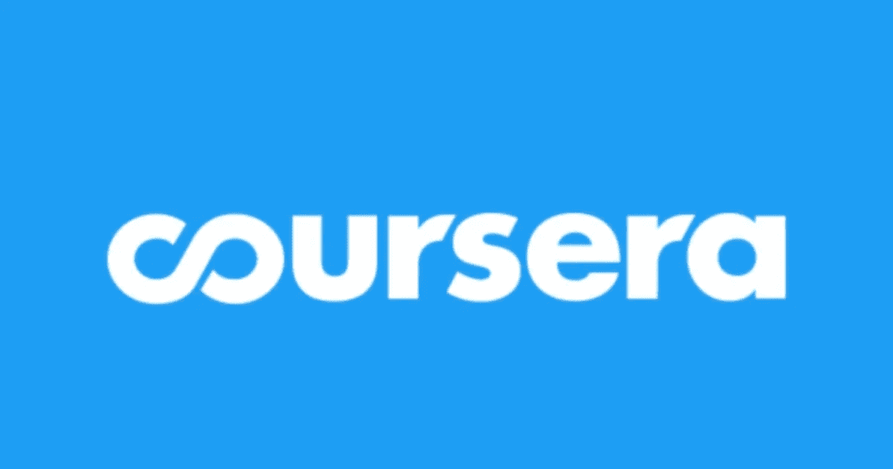](https://coursera.pxf.io/c/3294490/1164545/14726?u=https%3A%2F%2Fwww.coursera.org%2Fcourseraplus)

朋友们，你们知道吗，Coursera 除了有世界知名大学的课程外，还有世界最大的科技公司的在线课程。

你可以参加由谷歌、IBM、AWS 和其他大型科技公司教授的培训课程，向世界上最好的导师学习。如果这看起来让你兴奋，那就坚持住，让我们深入了解来自顶尖科技公司的 20 个最好的 Coursera Coursera。

# 2023 年要学的 23 门最佳 Coursera 课程、专业证书和专业

以下是 23 个最佳 Coursera 课程、专业证书和专业的列表，用于学习数据分析、Python、云计算、IT 支持、项目管理、UI/UX 设计、机器学习、深度学习、神经网络、AWS、计算机视觉等等。

最棒的是，他们由来自谷歌、IBM、Meta、AWS、阿里巴巴等顶级科技公司的经验丰富的专业培训师授课:

1.  [**谷歌数据分析专业证书**](https://coursera.pxf.io/c/3294490/1164545/14726?u=https%3A%2F%2Fwww.coursera.org%2Fprofessional-certificates%2Fgoogle-data-analytics) **(已报名 675846**)
2.  [**深度学习**](https://coursera.pxf.io/c/3294490/1164545/14726?u=https%3A%2F%2Fwww.coursera.org%2Fspecializations%2Fdeep-learning) **来自 deeplearning.ai**
3.  [**谷歌 UX 设计职业证书**](https://coursera.pxf.io/c/3294490/1164545/14726?u=https%3A%2F%2Fwww.coursera.org%2Fprofessional-certificates%2Fgoogle-ux-design) ( **370，353** 已报名)
4.  [**谷歌 IT 支持**](https://coursera.pxf.io/c/3294490/1164545/14726?u=https%3A%2F%2Fwww.coursera.org%2Fprofessional-certificates%2Fgoogle-it-support) **来自谷歌**
5.  [**IBM 数据科学**](https://coursera.pxf.io/c/3294490/1164545/14726?u=https%3A%2F%2Fwww.coursera.org%2Fprofessional-certificates%2Fibm-data-science) 出自 ***IBM***
6.  [**Google IT 自动化与 Python**](https://coursera.pxf.io/c/3294490/1164545/14726?u=https%3A%2F%2Fwww.coursera.org%2Fprofessional-certificates%2Fgoogle-it-automation) **来自 Google**
7.  [**AWS 基础**](https://coursera.pxf.io/c/3294490/1164545/14726?u=https%3A%2F%2Fwww.coursera.org%2Fspecializations%2Faws-fundamentals) **来自亚马逊网络服务**
8.  [**谷歌项目管理:专业证书**](https://coursera.pxf.io/c/3294490/1164545/14726?u=https%3A%2F%2Fwww.coursera.org%2Fprofessional-certificates%2Fgoogle-project-management) (已报名**464064**
9.  [**AI For every one**](https://coursera.pxf.io/c/3294490/1164545/14726?u=https%3A%2F%2Fwww.coursera.org%2Flearn%2Fai-for-everyone)来自 deeplearning.ai
10.  [**云架构**](https://coursera.pxf.io/c/3294490/1164545/14726?u=https%3A%2F%2Fwww.coursera.org%2Fprofessional-certificates%2Fgcp-cloud-architect) **用谷歌云从谷歌云**
11.  [**AWS 机器学习入门**](https://coursera.pxf.io/c/3294490/1164545/14726?u=https%3A%2F%2Fwww.coursera.org%2Flearn%2Faws-machine-learning) **来自亚马逊网络服务**
12.  [**IBM 人工智能商业基础**](https://coursera.pxf.io/c/3294490/1164545/14726?u=https%3A%2F%2Fwww.coursera.org%2Fspecializations%2Fibm-ai-foundations-for-business) 来自 **IBM**
13.  [**AWS 计算机视觉:入门 GluonCV**](https://coursera.pxf.io/c/3294490/1164545/14726?u=https%3A%2F%2Fwww.coursera.org%2Flearn%2Faws-computer-vision-gluoncv) **来自亚马逊网络服务**
14.  [**阿里云计算专业**](https://coursera.pxf.io/c/3294490/1164545/14726?u=https%3A%2F%2Fwww.coursera.org%2Fspecializations%2Falibabacloud) **来自阿里云学院**
15.  [**安全在谷歌云平台**](https://coursera.pxf.io/c/3294490/1164545/14726?u=https%3A%2F%2Fwww.coursera.org%2Fspecializations%2Fsecurity-google-cloud-platform) **来自谷歌云**
16.  [**云工程与谷歌云**](https://coursera.pxf.io/c/3294490/1164545/14726?u=https%3A%2F%2Fwww.coursera.org%2Fprofessional-certificates%2Fcloud-engineering-gcp) **来自谷歌云**
17.  [**自然语言处理**](https://coursera.pxf.io/c/3294490/1164545/14726?u=https%3A%2F%2Fwww.coursera.org%2Fspecializations%2Fnatural-language-processing) **来自 deeplearning.ai**
18.  [来自 deeplearning.ai 的医学 ai](https://coursera.pxf.io/c/3294490/1164545/14726?u=https%3A%2F%2Fwww.coursera.org%2Fspecializations%2Fai-for-medicine)
19.  [**SAS 程序员职业证书**](https://coursera.pxf.io/c/3294490/1164545/14726?u=https%3A%2F%2Fwww.coursera.org%2Fprofessional-certificates%2Fsas-programming) **来自 SAS**
20.  [**用 SAS**](https://coursera.pxf.io/c/3294490/1164545/14726?u=https%3A%2F%2Fwww.coursera.org%2Flearn%2Fsas-statistics) **统计来自 SAS**
21.  [**SAS 可视化商业分析来自 SAS**](https://coursera.pxf.io/c/3294490/1164545/14726?u=https%3A%2F%2Fwww.coursera.org%2Fprofessional-certificates%2Fsas-visual-business-analytics)
22.  [**脸书(Meta)社交媒体营销来自 Meta**](https://coursera.pxf.io/c/3294490/1164545/14726?u=https%3A%2F%2Fwww.coursera.org%2Fprofessional-certificates%2Ffacebook-social-media-marketing)
23.  [**SRE 和 DevOps 工程师用 Google Cloud 从 Google Cloud**](https://coursera.pxf.io/c/3294490/1164545/14726?u=https%3A%2F%2Fwww.coursera.org%2Fprofessional-certificates%2Fsre-devops-engineer-google-cloud)

现在，让我们深入研究 tach 课程，找出为什么它们是最好的 Coursera 课程，以及为什么应该加入它们。

## 1. [**谷歌 IT 支持**](https://coursera.pxf.io/c/3294490/1164545/14726?u=https%3A%2F%2Fwww.coursera.org%2Fprofessional-certificates%2Fgoogle-it-support)

这个由谷歌开发的 5 门课程证书包括一个创新的课程，旨在为您在 IT 支持方面的入门级角色做准备。IT 行业的工作可能意味着在小型企业或像谷歌这样的全球性公司中亲自或远程帮助台工作。

该计划是“与谷歌一起成长”( Grow with Google)计划的一部分，该计划旨在为所有人创造经济机会。

完成证书后，您可以与顶级雇主分享您的信息，如 Cognizant、GE Digital、Hulu、Infosys、Intel、KForce、MCPc、PNC Bank、RICOH USA、Sprint、TEKSystems、Veterans United Home Loans、Walmart 及其子公司，当然还有 Google。

完成谷歌证书并通过 [**CompTIA A+认证考试**](https://javarevisited.blogspot.com/2020/07/top-5-comptia-a-plus-certification-courses-and-practice-tests.html) 还可以获得 CompTIA 和谷歌双重证书

[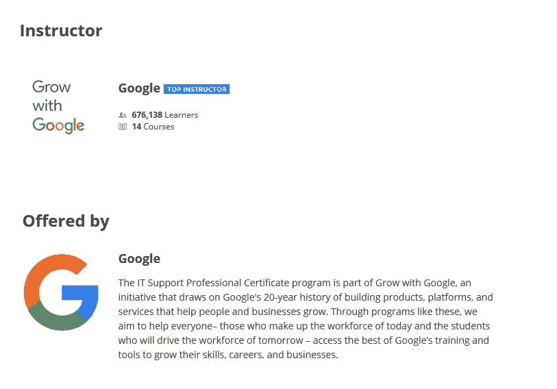](https://coursera.pxf.io/c/3294490/1164545/14726?u=https%3A%2F%2Fwww.coursera.org%2Fprofessional-certificates%2Fgoogle-it-support)

## 2. [**Google IT 自动化与 Python**](https://coursera.pxf.io/c/3294490/1164545/14726?u=https%3A%2F%2Fwww.coursera.org%2Fprofessional-certificates%2Fgoogle-it-automation)

这种新的初级证书由谷歌开发，共有 6 门课程，旨在为 it 专业人员提供急需的技能，包括 Python、Git 和 IT 自动化，可以帮助你推进职业发展。

本课程以您的 IT 基础为基础，帮助您将职业生涯提升到一个新的高度。它旨在教您如何使用 Python 编程，以及如何使用 Python 来自动化常见的系统管理任务。

您还将学习使用 Git 和 GitHub，排查和调试复杂的问题，并通过使用配置管理和云来大规模应用自动化。

[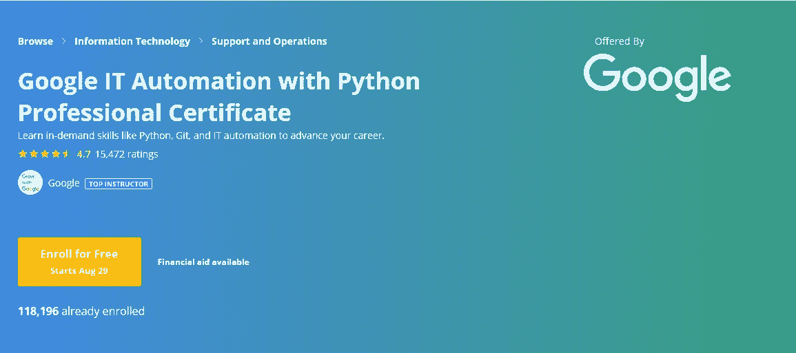](https://coursera.pxf.io/c/3294490/1164545/14726?u=https%3A%2F%2Fwww.coursera.org%2Fprofessional-certificates%2Fgoogle-it-automation)

## 3.[来自 IBM 的 IBM 数据科学](https://coursera.pxf.io/c/3294490/1164545/14726?u=https%3A%2F%2Fwww.coursera.org%2Fprofessional-certificates%2Fibm-data-science)

该计划由 9 门在线课程组成，将为您提供**最新的工作就绪工具和技能**，包括开源工具和库、Python、数据库、SQL、数据可视化、数据分析、统计分析、预测建模和机器学习算法。

您将通过在 IBM Cloud 中使用真实的数据科学工具和真实世界的数据集进行实践来学习数据科学。

成功完成这些课程后，您将建立一个数据科学项目组合，为您投身数据科学这一激动人心的职业提供信心。

除了获得 Coursera 的专业证书，您还将获得 IBM 的**数字徽章**以表彰您在数据科学方面的熟练程度。

[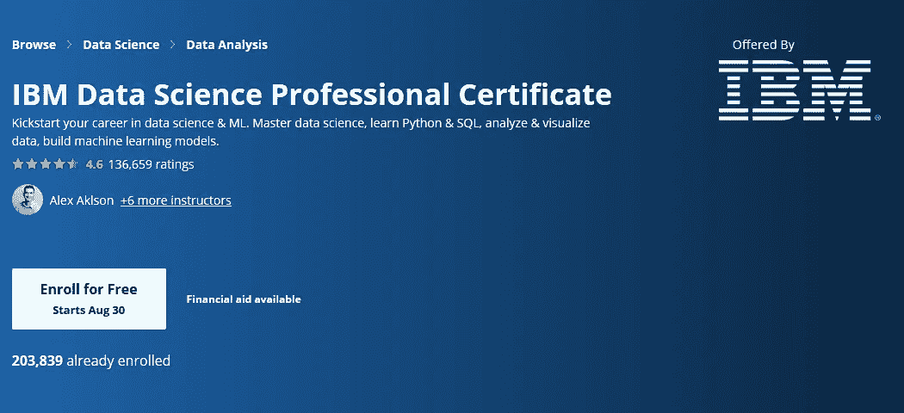](https://coursera.pxf.io/c/3294490/1164545/14726?u=https%3A%2F%2Fwww.coursera.org%2Fprofessional-certificates%2Fibm-data-science)

## 4. [**深度学习专精来自 deeplearning.ai**](https://coursera.pxf.io/c/3294490/1164545/14726?u=https%3A%2F%2Fwww.coursera.org%2Fspecializations%2Fdeep-learning)

如果你想打入 AI，这个专精会帮你做到。深度学习是科技领域最受追捧的技能之一。我们会帮助你变得擅长深度学习。

在五门课程中，你将学习深度学习的基础，了解如何构建神经网络，并学习如何领导成功的机器学习项目。您将了解卷积网络、RNNs、LSTM、Adam、Dropout、BatchNorm、Xavier/He 初始化等等。

[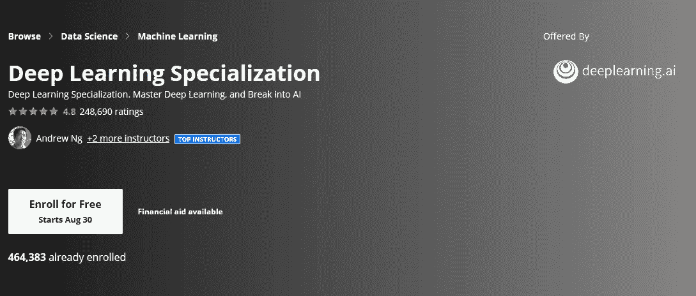](https://coursera.pxf.io/c/3294490/1164545/14726?u=https%3A%2F%2Fwww.coursera.org%2Fspecializations%2Fdeep-learning)

## 5.[亚马逊网络服务的 AWS 基础知识](https://coursera.pxf.io/c/3294490/1164545/14726?u=https%3A%2F%2Fwww.coursera.org%2Fspecializations%2Faws-fundamentals)

这一专业为当前或有抱负的 IT 专业人员提供了 Amazon Web Services (AWS)的特性、优势和功能的概述。

通过这四门相互关联的课程，您将更加生动地了解核心 AWS 服务、关键 AWS 安全概念、从内部迁移到 AWS 的策略，以及使用 AWS 构建无服务器应用程序的基础知识。

此外，您将有机会通过完成由 AWS 技术讲师开发的实验和练习来实践您所学到的知识。

[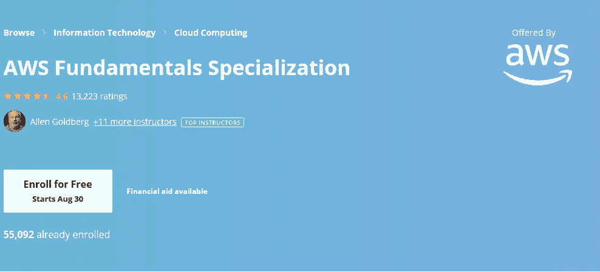](https://coursera.pxf.io/c/3294490/1164545/14726?u=https%3A%2F%2Fwww.coursera.org%2Fspecializations%2Faws-fundamentals)

## 6.[从亚马逊网络服务开始学习 AWS 机器](https://coursera.pxf.io/c/3294490/1164545/14726?u=https%3A%2F%2Fwww.coursera.org%2Flearn%2Faws-machine-learning)

本课程来自 AWS 本身，它将教你如何开始使用 AWS 机器学习。关键主题包括 AWS 上的机器学习、AWS 上的计算机视觉和 AWS 上的自然语言处理(NLP)。每个主题由几个模块组成，深入探讨各种 ML 概念、AWS 服务以及专家将概念付诸实践的见解。

[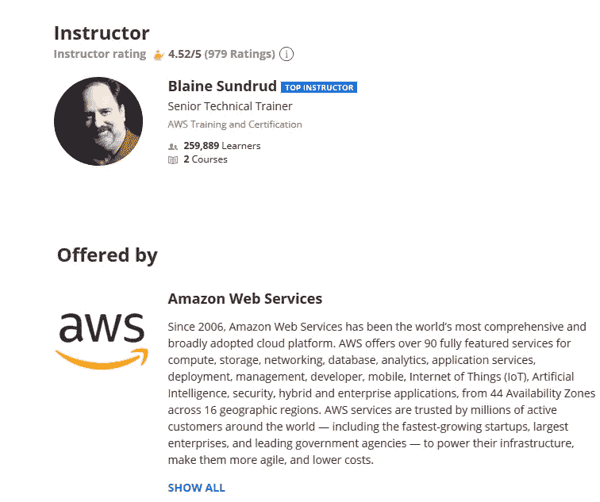](https://coursera.pxf.io/c/3294490/1164545/14726?u=https%3A%2F%2Fwww.coursera.org%2Flearn%2Faws-machine-learning)

## 7. [AWS 计算机视觉:从亚马逊网络服务开始使用 gluonvc](https://coursera.pxf.io/c/3294490/1164545/14726?u=https%3A%2F%2Fwww.coursera.org%2Flearn%2Faws-computer-vision-gluoncv)

本课程概述了计算机视觉(CV)、使用 Amazon Web Services (AWS)的机器学习(ML)以及如何使用 Apache MXNet 和 GluonCV 工具包构建和训练 CV 模型。

该课程讨论了人工神经网络和其他深度学习概念，然后介绍了如何将神经网络构建块结合到完整的计算机视觉模型中，并有效地训练它们。

[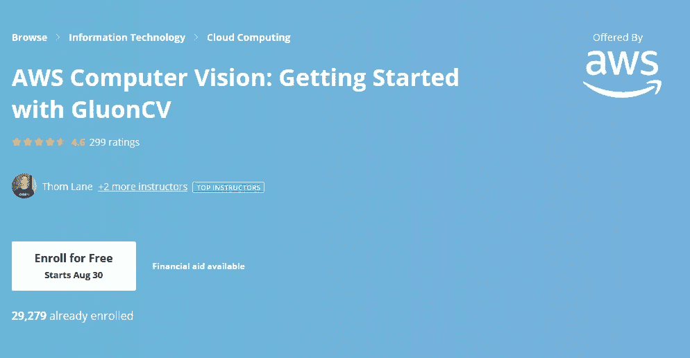](https://coursera.pxf.io/c/3294490/1164545/14726?u=https%3A%2F%2Fwww.coursera.org%2Flearn%2Faws-computer-vision-gluoncv)

## 8.[阿里云学院的阿里云计算专业](https://coursera.pxf.io/c/3294490/1164545/14726?u=https%3A%2F%2Fwww.coursera.org%2Fspecializations%2Falibabacloud)

该专业面向希望更多了解云技术如何帮助他们成长的学生和企业。通过云计算、大数据和云安全课程，用户将接触到一系列产品，这些产品组合起来使架构适合任何任务。

这种专业化将在两个层面上培训用户:首先，我们主要产品线的基本规格和功能，其次，评估用户一起使用几个不同产品在阿里云上创建最佳实践解决方案的能力。

[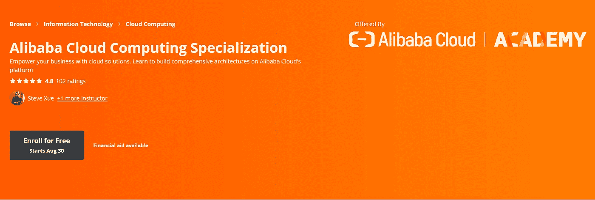](https://coursera.pxf.io/c/3294490/1164545/14726?u=https%3A%2F%2Fwww.coursera.org%2Fspecializations%2Falibabacloud)

## 9.[基于谷歌云的云架构](https://coursera.pxf.io/c/3294490/1164545/14726?u=https%3A%2F%2Fwww.coursera.org%2Fprofessional-certificates%2Fgcp-cloud-architect)

该计划提供了您作为专业云架构师推进职业生涯所需的技能，并支持您准备行业认可的 [Google Cloud 专业云架构师认证。](https://cloud.google.com/certification/cloud-architect?utm_source=coursera&utm_medium=referral&utm_content=coursera-prof-cert-cgc-cloud-architect)

您将学习如何部署解决方案要素，包括网络、系统和应用服务等基础设施组件，并通过大量 Qwiklabs 实践项目获得实际经验。

[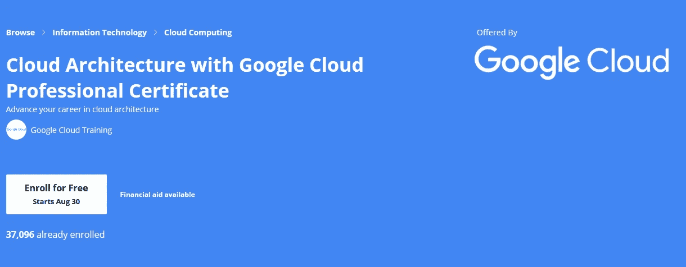](https://coursera.pxf.io/c/3294490/1164545/14726?u=https%3A%2F%2Fwww.coursera.org%2Fprofessional-certificates%2Fgcp-cloud-architect)

## 10.[来自谷歌云的谷歌云平台安全](https://coursera.pxf.io/c/3294490/1164545/14726?u=https%3A%2F%2Fwww.coursera.org%2Fspecializations%2Fsecurity-google-cloud-platform)

该专业包括使用我们的 Qwiklabs 平台的动手实验。

这些实践部分将让您应用在视频讲座中学到的技能。项目将包括谷歌云产品等主题，这些产品在 Qwiklabs 中使用和配置。

您可以通过这些模块中解释的许多概念获得实际操作经验。

[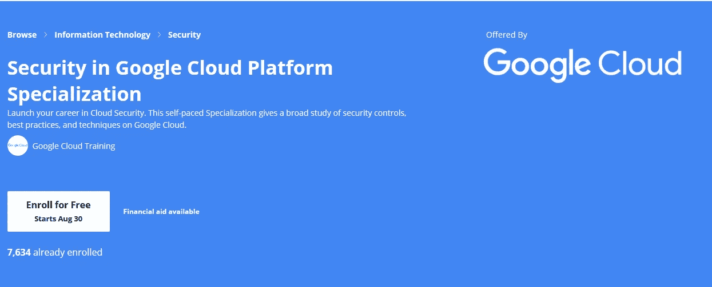](https://coursera.pxf.io/c/3294490/1164545/14726?u=https%3A%2F%2Fwww.coursera.org%2Fspecializations%2Fsecurity-google-cloud-platform)

## 11.[来自 Google Cloud 的 Google Cloud 云工程](https://coursera.pxf.io/c/3294490/1164545/14726?u=https%3A%2F%2Fwww.coursera.org%2Fprofessional-certificates%2Fcloud-engineering-gcp)

该专业证书包含使用 Qwiklabs 平台的动手实验。

这些实践部分将让您应用在视频讲座中学到的技能。项目将纳入谷歌云平台产品等主题，这些产品在 Qwiklabs 中使用和配置。您可以通过这些模块中解释的概念获得实践经验。

[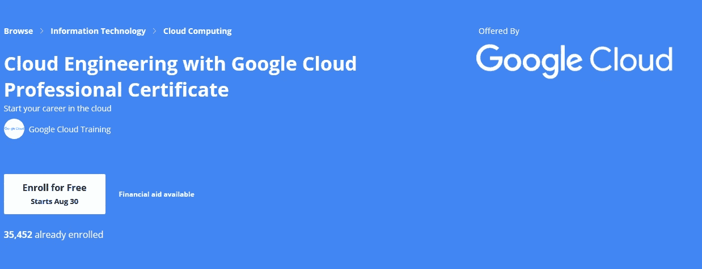](https://coursera.pxf.io/c/3294490/1164545/14726?u=https%3A%2F%2Fwww.coursera.org%2Fprofessional-certificates%2Fcloud-engineering-gcp)

## 12. [IBM 的商业人工智能基础](https://coursera.pxf.io/c/3294490/1164545/14726?u=https%3A%2F%2Fwww.coursera.org%2Fspecializations%2Fibm-ai-foundations-for-business)

这种专业化将解释和描述商业领袖考虑基于人工智能的商业挑战解决方案的总体重点领域。第一门课程提供了面向商业的人工智能技术和基本概念的总结。

第二部分将介绍数据科学中的技术和概念。第三篇介绍了人工智能阶梯，这是一个框架，用于理解成功部署基于人工智能的解决方案所必需的工作和过程。

[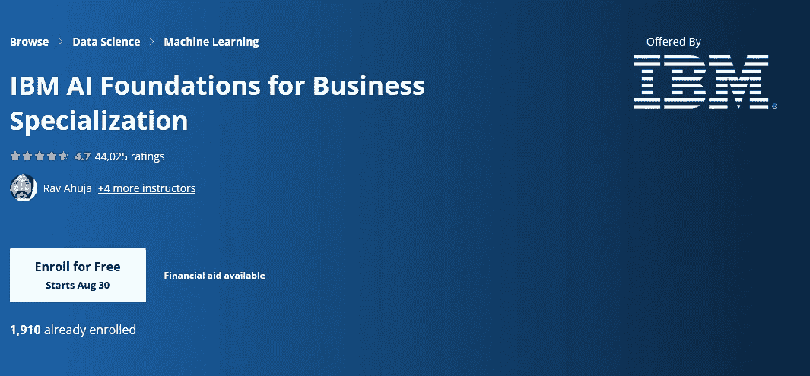](https://coursera.pxf.io/c/3294490/1164545/14726?u=https%3A%2F%2Fwww.coursera.org%2Fspecializations%2Fibm-ai-foundations-for-business)

## 13.[来自 deeplearning.ai 的自然语言处理](https://coursera.pxf.io/c/3294490/1164545/14726?u=https%3A%2F%2Fwww.coursera.org%2Fspecializations%2Fnatural-language-processing)

**自然语言处理(NLP)** 使用算法来理解和操纵人类语言。这项技术是机器学习应用最广泛的领域之一。

随着人工智能的不断发展，对擅长建立模型来分析语音和语言、揭示上下文模式以及从文本和音频中产生见解的专业人士的需求也将增加。

本专业结束时，您将能够设计执行问答和情感分析的 NLP 应用程序，创建翻译语言和总结文本的工具，甚至构建聊天机器人。

[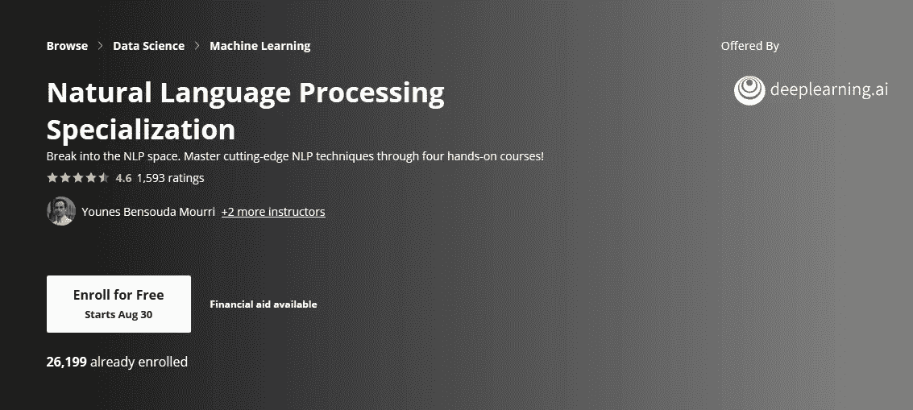](https://coursera.pxf.io/c/3294490/1164545/14726?u=https%3A%2F%2Fwww.coursera.org%2Fspecializations%2Fnatural-language-processing)

## 14.[来自 deeplearning.ai 的 AI For Everyone】](https://coursera.pxf.io/c/3294490/1164545/14726?u=https%3A%2F%2Fwww.coursera.org%2Flearn%2Fai-for-everyone)

人工智能不仅仅是工程师的专利。如果你希望你的组织在使用人工智能方面变得更好，这是告诉每个人——尤其是你的非技术同事——要参加的课程。

虽然这门课程很大程度上是非技术性的，但工程师也可以通过这门课程学习人工智能的商业方面。

[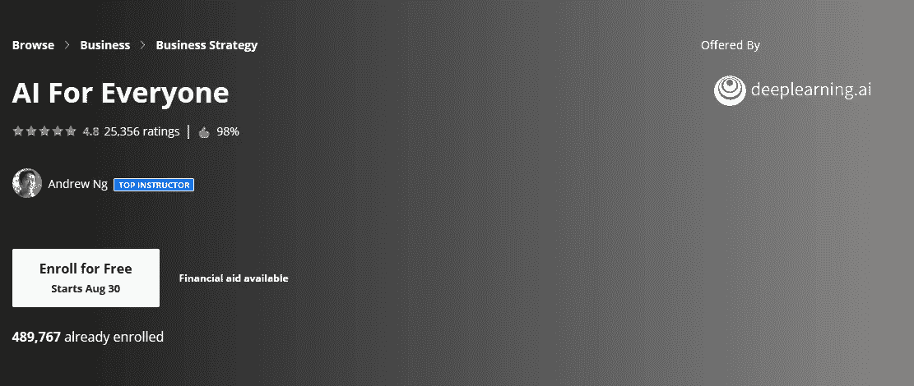](https://coursera.pxf.io/c/3294490/1164545/14726?u=https%3A%2F%2Fwww.coursera.org%2Flearn%2Fai-for-everyone)

## 15.[来自 deeplearning.ai 的医学 ai](https://coursera.pxf.io/c/3294490/1164545/14726?u=https%3A%2F%2Fwww.coursera.org%2Fspecializations%2Fai-for-medicine)

人工智能正在改变医学实践。它帮助医生更准确地诊断患者，预测患者未来的健康状况，并推荐更好的治疗方法。

这个三门课程的专业将让你获得将机器学习应用于医学中具体问题的实践经验。

这些课程超越了深度学习的基础，教你将人工智能应用于医疗用例的细微差别。如果你是深度学习的新手，或者想更深入地了解神经网络的工作原理。

[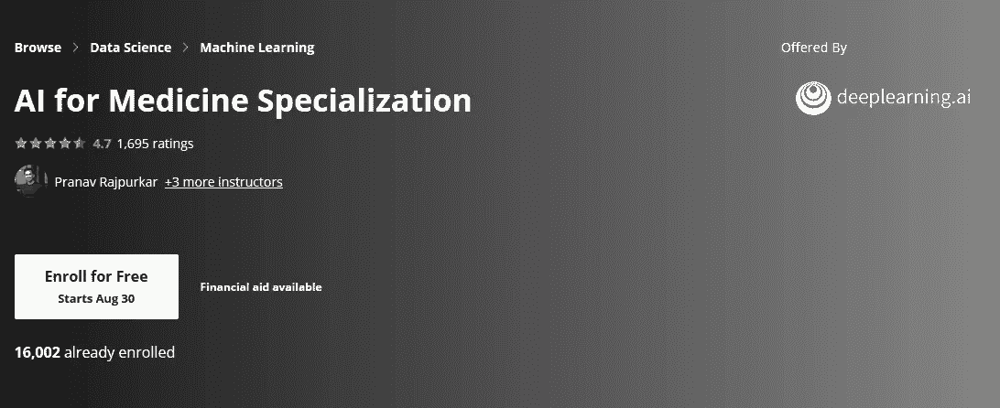](https://coursera.pxf.io/c/3294490/1164545/14726?u=https%3A%2F%2Fwww.coursera.org%2Fspecializations%2Fai-for-medicine)

## 16. [SAS 程序员职业证书来自 SAS](https://coursera.pxf.io/c/3294490/1164545/14726?u=https%3A%2F%2Fwww.coursera.org%2Fprofessional-certificates%2Fsas-programming)

当您完成 SAS 基础编程课程时，您将具备操作和转换数据、组合 SAS 数据集、使用 SAS 过程创建基本的详细和摘要报告，以及识别和纠正数据、语法和编程逻辑错误的技能。这些技能为你准备 SAS 基础编程专家认证考试。

在本专业证书课程的最后一门课程中，您将完成展示您 SAS 编程知识的项目。

在第一个项目中，您为 SAS 编程过程的每个阶段编写程序，以分析美国机场的乘客索赔。在第二个项目中，您将利用您在数据准备阶段的知识编写重组世界旅游数据的程序。

[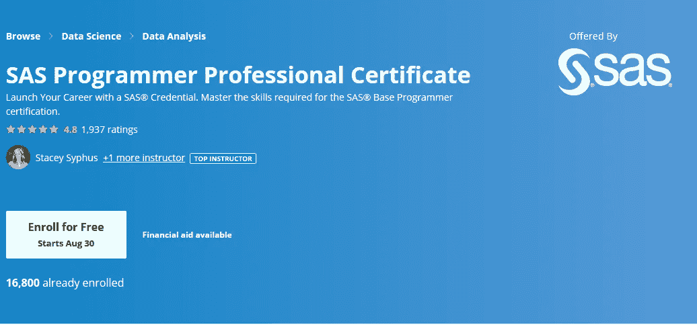](https://coursera.pxf.io/c/3294490/1164545/14726?u=https%3A%2F%2Fwww.coursera.org%2Fprofessional-certificates%2Fsas-programming)

## 17.[从 SAS 统计 SAS](https://coursera.pxf.io/c/3294490/1164545/14726?u=https%3A%2F%2Fwww.coursera.org%2Flearn%2Fsas-statistics)

本入门课程面向使用 SAS/STAT 软件进行统计分析的 SAS 软件用户。重点是 t 检验、方差分析和线性回归，并包括对逻辑回归的简要介绍。

[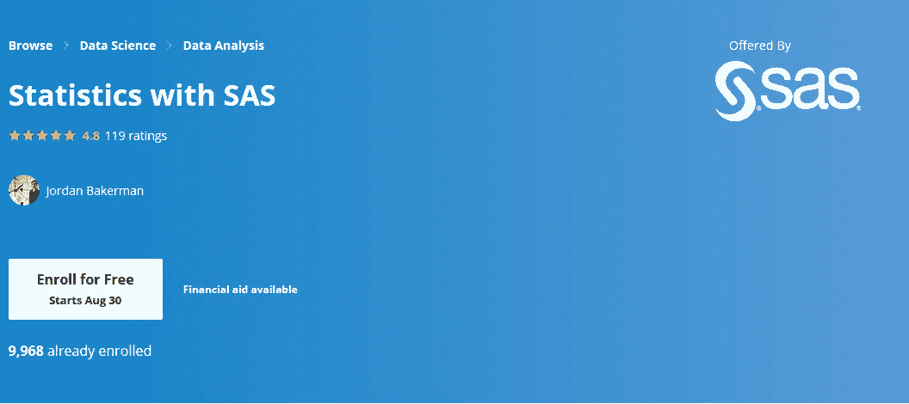](https://coursera.pxf.io/c/3294490/1164545/14726?u=https%3A%2F%2Fwww.coursera.org%2Flearn%2Fsas-statistics)

## 18.[来自 SAS 的 SAS 可视化商业分析](https://coursera.pxf.io/c/3294490/1164545/14726?u=https%3A%2F%2Fwww.coursera.org%2Fprofessional-certificates%2Fsas-visual-business-analytics)

使用 SAS Visual Analytics，您将学习访问和操作数据，使用各种交互式报告和图形分析数据，以及设计和共享仪表板来可视化您的数据。SAS 可视化分析在各种职业中都是一项有用的技能，包括业务分析师、研究员、统计师或数据科学家。

[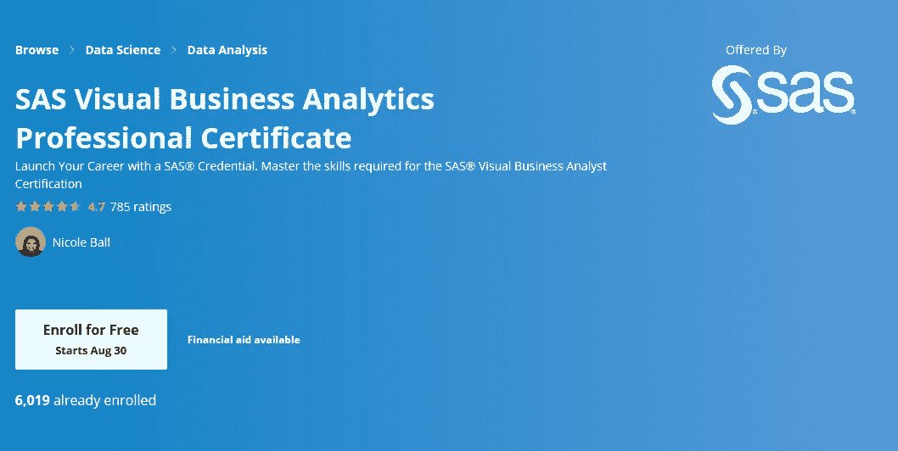](https://coursera.pxf.io/c/3294490/1164545/14726?u=https%3A%2F%2Fwww.coursera.org%2Fprofessional-certificates%2Fsas-visual-business-analytics)

## 19.[通过 Meta 进行脸书社交媒体营销](https://coursera.pxf.io/c/3294490/1164545/14726?u=https%3A%2F%2Fwww.coursera.org%2Fprofessional-certificates%2Ffacebook-social-media-marketing)

这是相对较新的，可能是脸书在 Coursera 平台上的第一个专业认证/专业。无论你是已经在为你的企业修补社交媒体平台，还是对数字营销领域完全陌生，你都来对地方了。

这个由数字营销专家 Aptly 和脸书营销人员共同开发的五门课程计划，包括一个行业相关的课程，旨在为您在社交媒体营销中的入门级角色做准备。

在介绍了数字营销和主要的社交媒体平台后，你将学习如何建立在线形象、发帖、建立追随者以及管理你的社交媒体账户。

你将发展在社交媒体上创建和管理广告活动的技能，并学会评估营销努力的结果。

**这是参加本课程的链接**——[来自脸书的脸书社交媒体营销](https://click.linksynergy.com/deeplink?id=JVFxdTr9V80&mid=40328&murl=https%3A%2F%2Fwww.coursera.org%2Fprofessional-certificates%2Ffacebook-social-media-marketing)

[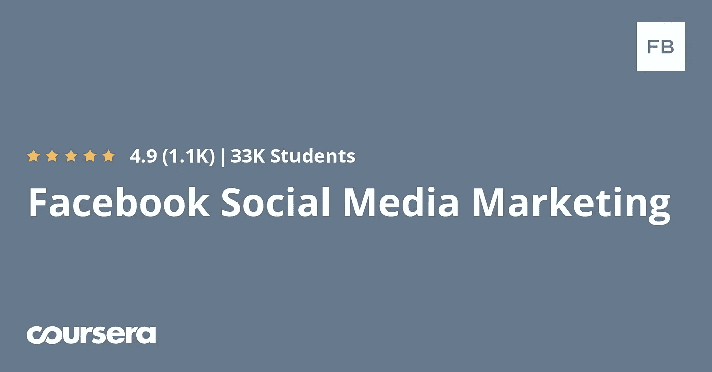](https://coursera.pxf.io/c/3294490/1164545/14726?u=https%3A%2F%2Fwww.coursera.org%2Fprofessional-certificates%2Ffacebook-social-media-marketing)

## 20.[来自谷歌云的 SRE 和 DevOps 工程师](https://coursera.pxf.io/c/3294490/1164545/14726?u=https%3A%2F%2Fwww.coursera.org%2Fprofessional-certificates%2Fsre-devops-engineer-google-cloud)

这是谷歌自己在谷歌云平台上的又一个伟大的课程。SRE 或现场可靠性工程师随着 DevOps 越来越受欢迎，了解 SRE 原则不仅对 GCP DevOps 工程师认证很重要，对未来的 DevOps 或 SRE 面试也很重要。

该计划提供您作为数据工程师推进职业发展所需的技能，并提供培训以支持您准备行业认可的[Google Cloud Professional devo PS 工程师](https://www.java67.com/2020/08/top-5-free-courses-to-become-google.html)认证。87%的谷歌云认证用户对他们的云技能更有信心。

您还将有机会使用谷歌云来实践关键的工作技能，以构建软件交付渠道、部署和监控服务，以及管理事件并从中学习。

您将学习如何将 SRE 原则应用于服务、监控技术、故障排除、改进基础设施和应用程序性能等。

**这是参加本课程的链接**——[SRE 和 DevOps 谷歌云工程师来自谷歌云](https://click.linksynergy.com/deeplink?id=JVFxdTr9V80&mid=40328&murl=https%3A%2F%2Fwww.coursera.org%2Fprofessional-certificates%2Fsre-devops-engineer-google-cloud)

[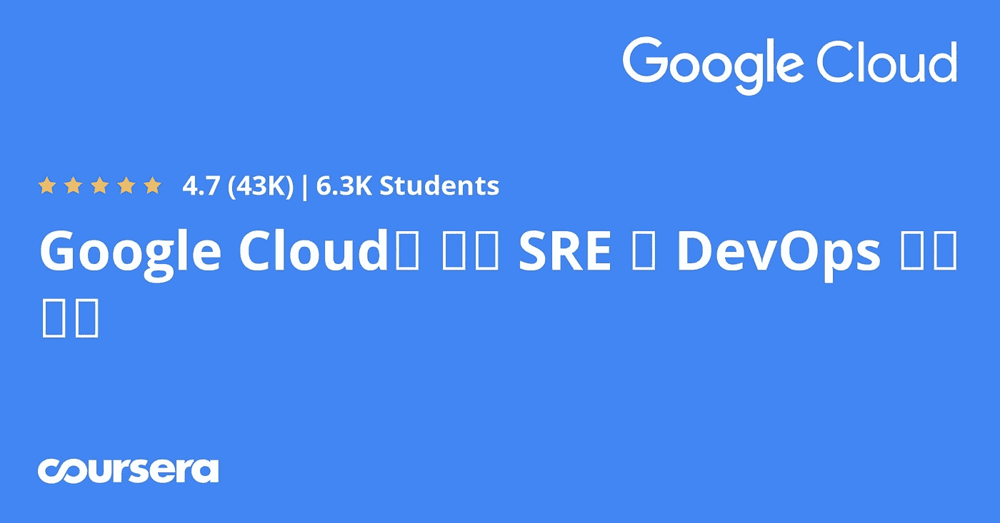](https://coursera.pxf.io/c/3294490/1164545/14726?u=https%3A%2F%2Fwww.coursera.org%2Fprofessional-certificates%2Fsre-devops-engineer-google-cloud)

这就是你可以在 2023 年参加的谷歌等顶级科技公司的 22 门 Coursera 课程和认证。如果你想在 IT 行业拥有一个专业的职业生涯，无论你是想成为一名云工程师 python 开发人员，还是只是为了娱乐和获得新知识和技能而学习，这些也是最好的课程。

顺便说一句，如果你计划参加多个 Coursera 课程或专业，那么考虑参加 [**Coursera Plus**](https://coursera.pxf.io/c/3294490/1164545/14726?u=https%3A%2F%2Fwww.coursera.org%2Fcourseraplus) 订阅，它可以让你无限制地访问他们最受欢迎的课程、专业、专业证书和指导项目。它每年花费大约 399 美元，但是它完全物有所值，因为你可以获得无限的证书。

你可能喜欢的其他 **Coursera 和编程文章**

*   [学习云计算的 10 门最佳 Coursera 课程](https://javarevisited.blogspot.com/2020/08/top-10-coursera-certifications-to-learn-cloud-computing-aws.html#axzz6WK1yC5WW)
*   [Coursera Plus Review——在 Coursera 上学习的更好方式](https://javarevisited.blogspot.com/2020/08/coursera-plus-better-way-to-take-coursera-courses-specilizations-certification.html)
*   [学习 Web 开发的十大 Coursera 课程](https://javarevisited.blogspot.com/2020/08/top-10-coursera-certifications-to-learn-web-development.html)
*   [你可以在 Coursera 上在线申请的前 5 个计算机科学学位](https://javarevisited.blogspot.com/2020/04/is-it-possible-to-get-master-of-computer-science-degree-online-coursera.html)
*   [Udemy vs Coursera？学理工和编程哪个好](https://javarevisited.blogspot.com/2020/01/coursera-vs-udemy-which-is-better-for-programming-tech.html)
*   Coursera 证书对工作和事业有帮助吗
*   [学习 Python 的 10 个 Coursera 专业化和认证](https://javarevisited.blogspot.com/2020/02/10-best-coursera-courses--for-python.html)
*   [5 个最佳 Coursera 程序员职业证书](https://javarevisited.blogspot.com/2019/10/top-5-coursera-professional-certificates-for-programmers-IT-professionals.html)
*   [2023 年学习 Python 可以做的 8 个项目](/javarevisited/8-projects-you-can-buil-to-learn-python-in-2020-251dd5350d56)
*   [开始职业生涯的十大 Coursera 认证](/javarevisited/top-10-coursera-certificates-to-start-your-career-in-cloud-data-science-ai-mainframe-and-it-558690c83587)
*   [2023 年学习人工智能的 7 门最佳课程](/javarevisited/7-best-courses-to-learn-artificial-intelligence-in-2020-26d59d62f6fe)
*   [Udemy vs 复数视线？哪个学习平台比较好？](https://javarevisited.blogspot.com/2019/10/udemy-vs-pluralsight-review-which-is-better-to-learn-code.html)
*   [Java 上的最佳 Coursera 认证访问 Youtube 频道](https://www.youtube.com/watch?v=6NKULJuitcU)
*   [Udemy vs CodeCademy vs one month？](https://javarevisited.blogspot.com/2019/09/codecademy-vs-udemy-vs-onemonth-which-is-better-for-learning-code.html#axzz6VYKcmyZz)
*   Udemy vs Educative vs Codecademy？新手用哪个好
*   [你可以在 Coursera Online 上获得 5 个数据科学学位](https://www.java67.com/2020/06/top-5-data-science-degree-you-can-earn-online-coursera-edx.html)
*   [Coursera 的 10 项数据科学和机器学习认证](/javarevisited/top-10-machine-learning-and-data-science-certifications-and-training-courses-for-beginners-and-a6308497b764)

感谢阅读这篇文章。如果你喜欢谷歌、AWS 和脸书为软件开发人员提供的这些最好的 Coursera 课程和认证，那么请与你的朋友和同事分享。如果您有任何问题或反馈，请留言。

如果你正在寻找 2023 年最好的 Udemy 课程，那么你也可以看看我列出的 [**程序员和软件开发人员最佳 Udemy 课程**](https://javarevisited.blogspot.com/2019/08/top-10-udemy-courses-and-certifications-for-programmers.html) 。包含了最好的 Udemy 课程，学习 Java、Python、Git，以及其他软件开发所需的必备技能。

<https://javarevisited.blogspot.com/2019/08/top-10-udemy-courses-and-certifications-for-programmers.html> 