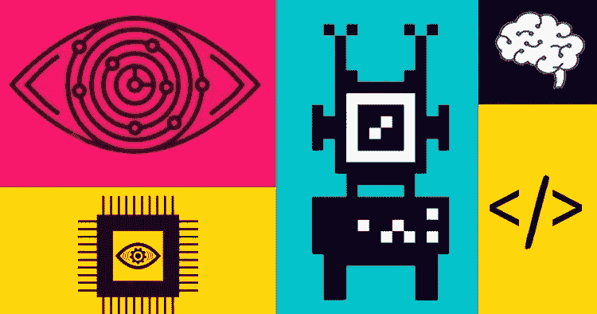
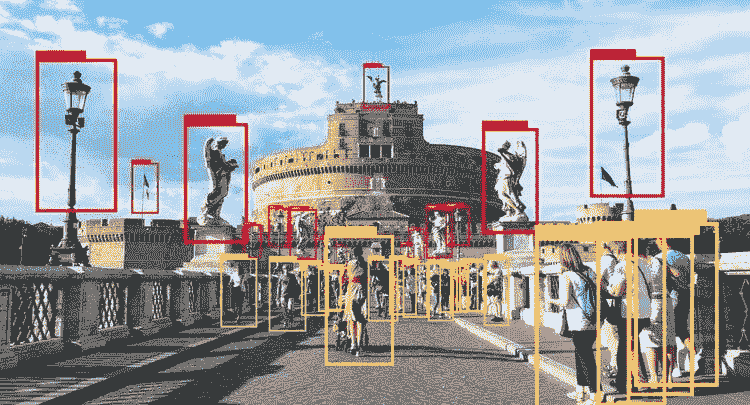
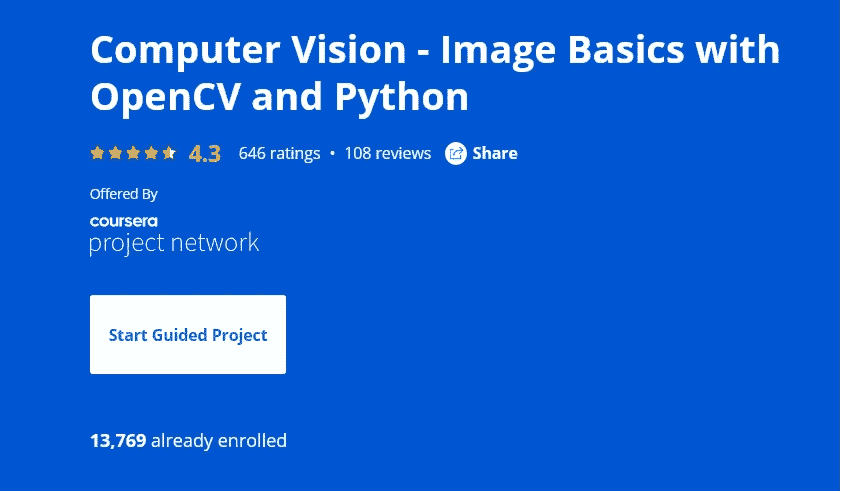

# 2022 年学习计算机视觉和开放初学者 CV 的 2 个项目

> 原文：<https://medium.com/javarevisited/2-projects-to-learn-computer-vision-and-open-cv-for-beginners-1e0479ed171b?source=collection_archive---------0----------------------->

## 这些是你学习计算机视觉可以做的最好的项目，打开 CV，里面有相关支持课程和教程的链接。

大家好，如果你想学习计算机视觉和 OpenCV 库并寻找最好的资源，那么你来对地方了。在过去，我已经分享了 [**最佳计算机视觉课程**](/javarevisited/5-best-computer-vision-courses-for-beginners-85f901a8f88a) ，在这篇文章中，我将分享你可以建立的学习计算机视觉和打开 CV 库的最佳项目。

除了理论知识和证书，构建项目是积累知识和提高技术技能的最佳方式，计算机视觉也不例外。

这些指导性项目不仅有助于理解计算机视觉在日常生活中的应用及其重要性，还会给你作为计算机视觉专业人员工作所需的信心

顺便说一句，如果你是计算机视觉和开放简历领域的初学者，让我给你简单介绍一下它们是什么。*计算机视觉*只不过是人工智能(AI)的一部分，使计算机和系统能够从数字图像中获取有意义的信息，是的，你是正确的。我说的是阅读图像。

例如，计算机可以将汽车的图像识别为汽车，将小时的图像识别为马，以采取有意义的行动。从自动驾驶汽车到识别人，计算机视觉在现实世界中有许多应用，这就是为什么对计算机视觉专家的需求日益增加。

现在，如果你想知道什么是 [OpenCV](https://opencv.org/) ，因为它通常与计算机视觉一起使用，那么请记住 *OpenCV* 提供了实时优化的计算机视觉库、工具和硬件。

它还支持机器学习(ML)的模型执行。你可以在我之前的关于初学者和中级开发者的最佳 OpenCV 课程的文章中了解更多。

<https://becominghuman.ai/5-best-free-opencv-and-computer-vision-courses-for-beginners-77c31812290f>  

# 2022 年学习计算机视觉和 OpenCV 的 2 个最佳项目

现在你已经知道了什么是计算机视觉和 OpenCV，以及它们的应用是什么，是时候在 2022 年跳入你可以构建的最好的项目来更好地学习这些工具和库了。

## 1.计算机视觉目标检测

对象检测是您可以从计算机视觉开始构建的第一批项目之一。这也是一个有趣的项目，因为你将学习如何从图像中检测人脸、眼睛以及二者的组合，如何从视频中检测行人和汽车移动，以及最终如何检测汽车的牌照。

如果您需要学习更多关于物体检测的课程，Udemy 上的 [**计算机视觉:使用 Colab GPU 的 YOLO 自定义物体检测**](https://click.linksynergy.com/deeplink?id=CuIbQrBnhiw&mid=39197&murl=https%3A%2F%2Fwww.udemy.com%2Fcourse%2Fcomputer-vision-yolo-custom-object-detection-with-colab-gpu%2F) 课程是 4 小时长的基于项目的在线课程，在这里您将学习如何从图像和视频中进行计算机视觉物体检测。

以下是加入本课程的链接— [**计算机视觉:使用 Colab GPU 的 YOLO 自定义物体检测**](https://click.linksynergy.com/deeplink?id=CuIbQrBnhiw&mid=39197&murl=https%3A%2F%2Fwww.udemy.com%2Fcourse%2Fcomputer-vision-yolo-custom-object-detection-with-colab-gpu%2F)

## 2.单一和多目标跟踪。

这是你可以更好地学习计算机视觉的另一个重要项目。在单个目标跟踪(SOT)中，**第一帧中目标的边界框被给予跟踪器**。跟踪器的目标是在所有其他帧中定位相同的目标。

如果您需要资源，那么在这个 [1 小时的基于项目的课程](https://click.linksynergy.com/deeplink?id=JVFxdTr9V80&mid=40328&murl=https%3A%2F%2Fwww.coursera.org%2Fprojects%2Fcomputer-vision-opencv-for-images)中，您将学习如何使用 Jupyter Notebook 使用 OpenCV 和 Python 在图像上进行计算机视觉。这个课程运行在 Coursera 的名为 Rhyme 的动手项目平台上。

这种基于项目的课程最大的好处是，你不需要建立自己的开发环境。在这个项目中，您可以即时访问预装了 Python、Jupyter 和 OpenCV 的云桌面。

以下是您将在本指导项目中学到的内容:

1.  如何用 Matplotlib 打开图像
2.  Matplotlib 和 OpenCV 的区别
3.  使用 OpenCV 时需要记住的 3 个要点
4.  如何翻转图像、调整图像大小、如何绘制形状以及在图像上书写

**这里是加入这个引导式计算机视觉项目的链接** — [计算机视觉 OpenCV 和 Python 的图像基础](https://click.linksynergy.com/deeplink?id=JVFxdTr9V80&mid=40328&murl=https%3A%2F%2Fwww.coursera.org%2Fprojects%2Fcomputer-vision-opencv-for-images)

以上就是 2022 年学习计算机视觉和打开 CV 可以做的**最好的项目。这些项目也是更好地学习 CV 和 OpenCV 的好方法。然而，要完成这些项目，您需要有一些计算机视觉的基础知识，这些知识可以在本文前面讨论的课程的帮助下获得。**

其他实用**数据科学和机器学习**文章

*   [学习机器学习 R 编程的 5 门免费课程](http://www.java67.com/2018/09/top-5-free-R-programming-courses-for-Data-Science-Machine-Learning-Programmers.html)
*   [从零开始学习 Python 的前 5 本书](https://javarevisited.blogspot.com/2019/07/top-5-books-to-learn-python-in-2019.html)
*   [在线学习 PyTorch 和 Keras 的前 5 门课程](https://www.java67.com/2020/06/top-5-courses-to-learn-pytorch-and-keras.html)
*   [学习人工智能的 7 门最佳课程](/javarevisited/7-best-courses-to-learn-artificial-intelligence-in-2020-26d59d62f6fe?source=---------17------------------)
*   [哈佛和 IBM 的 9 门数据科学课程](https://becominghuman.ai/9-data-science-and-machine-learning-courses-by-harvard-ibm-udemy-and-others-12a0c7c23ec1)
*   [学习自然语言处理(NLP)的 5 门最佳课程](https://www.java67.com/2020/07/top-5-courses-to-learn-natural-language-processing-NLP.html)
*   [Coursera 和 Udemy 的十大数据科学认证](/javarevisited/my-favorite-data-science-and-machine-learning-courses-from-coursera-udemy-and-pluralsight-eafc73acc73f?source=---------5------------------)
*   [免费学习 Python 编码的五大网站](https://javarevisited.blogspot.com/2019/09/5-websites-to-learn-python-for-free.html)
*   学习 PyTorch、Keras、Sci-kit 和 MatPlotLib 的 9 门课程
*   [学习数据分析 Panadas 的 5 门最佳课程](https://becominghuman.ai/5-best-courses-to-learn-pythons-pandas-libary-for-data-analysis-and-data-science-34b62abb0e96)
*   [你可以做的 8 个 Python 项目来更好地理解](/@javinpaul/8-projects-you-can-buil-to-learn-python-in-2020-251dd5350d56)
*   [学习 Tableau 数据可视化的 7 门最佳课程](https://becominghuman.ai/my-favorite-courses-to-learn-tableau-for-data-science-and-visualization-46623ba5b424)
*   [排名前五的数据科学和机器学习课程](https://hackernoon.com/top-5-data-science-and-machine-learning-course-for-programmers-e724cfb9940a)
*   [tensor flow 和机器学习课程前 5 名](https://hackernoon.com/top-5-tensorflow-and-ml-courses-for-programmers-8b30111cad2c)

感谢您阅读本文。如果你觉得这些来自 Udemy、Coursera 和 Pluralsight 的*最佳免费*C*computer Vision 和 Open CV 在线课程*有用，那么请与你的朋友和同事分享。如果您有任何问题或反馈，请留言。

**P. S.** —如果你已经了解了 Open CV 的基础知识，并且正在寻找一门全面的课程来将你的 OpenCV 技能提升到一个新的水平，那么我强烈推荐你查看 UDemy 上 SuperDataScience 团队的这个 [**深度学习和计算机视觉 A-Z: OpenCV、SSD 和 GANs**](https://click.linksynergy.com/deeplink?id=JVFxdTr9V80&mid=39197&murl=https%3A%2F%2Fwww.udemy.com%2Fcourse%2Fcomputer-vision-a-z%2F) 。这是一个深入学习 OpenCV 的很好的课程，你可以在 Udemy sale 上花 9.9 美元得到它

</javarevisited/top-5-advanced-deep-learning-and-neural-network-courses-to-learn-in-2020-a273f5eddca5> 