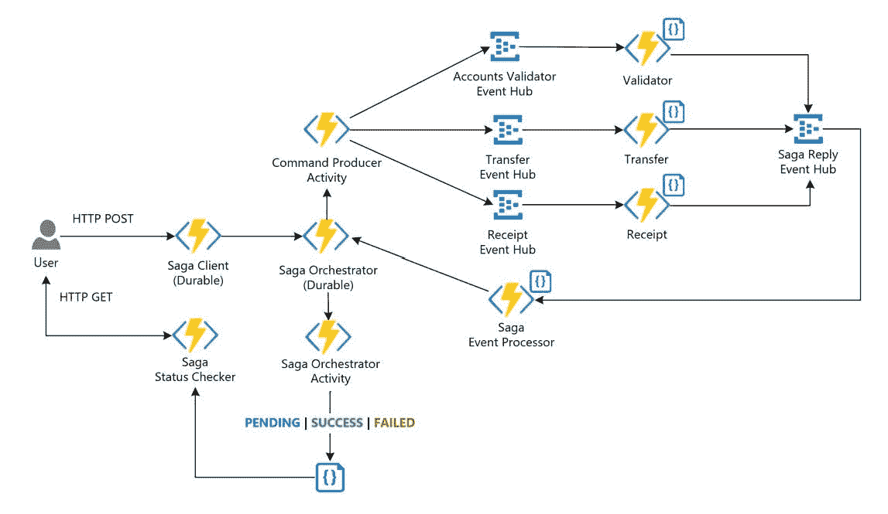

# 20 个高级核心 Java 面试问题，面向 5 到 10 年经验丰富的开发人员

> 原文：<https://medium.com/javarevisited/20-advanced-core-java-interview-questions-for-experienced-developers-of-5-to-10-years-87b243276134?source=collection_archive---------0----------------------->

## 对于有 5 到 10 年经验的 Java 开发人员来说，这些都是困难和高级的核心 Java 问题

图片- Github 主题

你好，朋友们，如果你正在准备下一次 Java 开发人员面试，并寻找高级开发人员或团队领导职位，那么你必须…