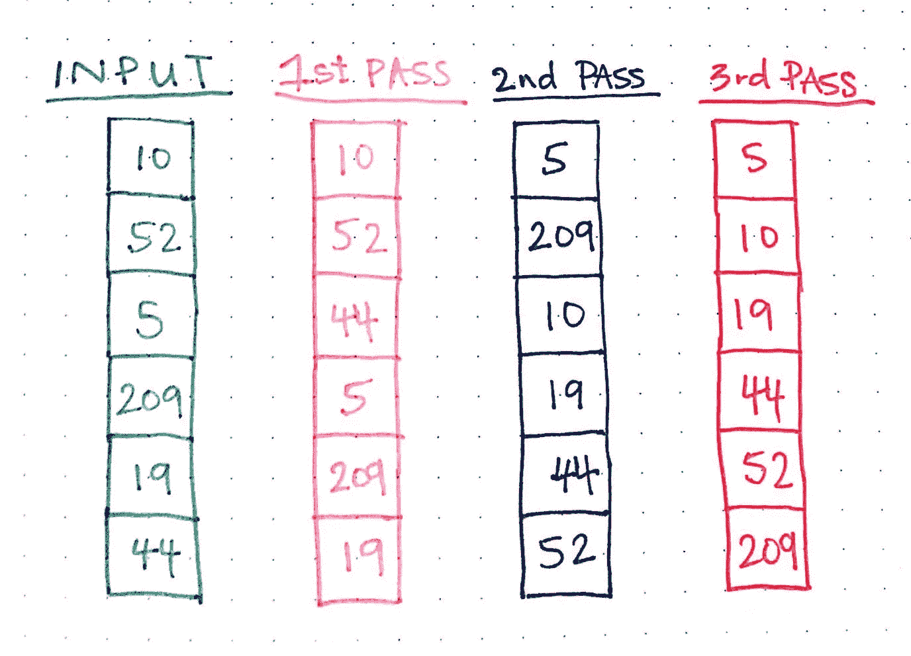
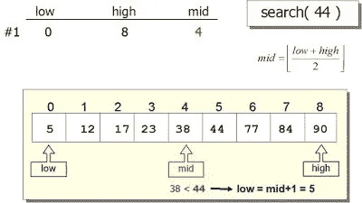
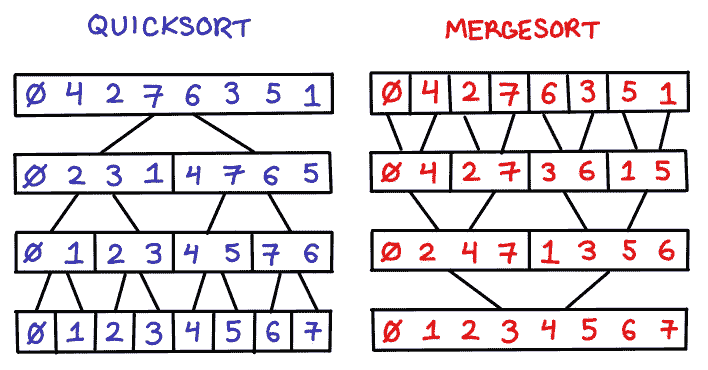
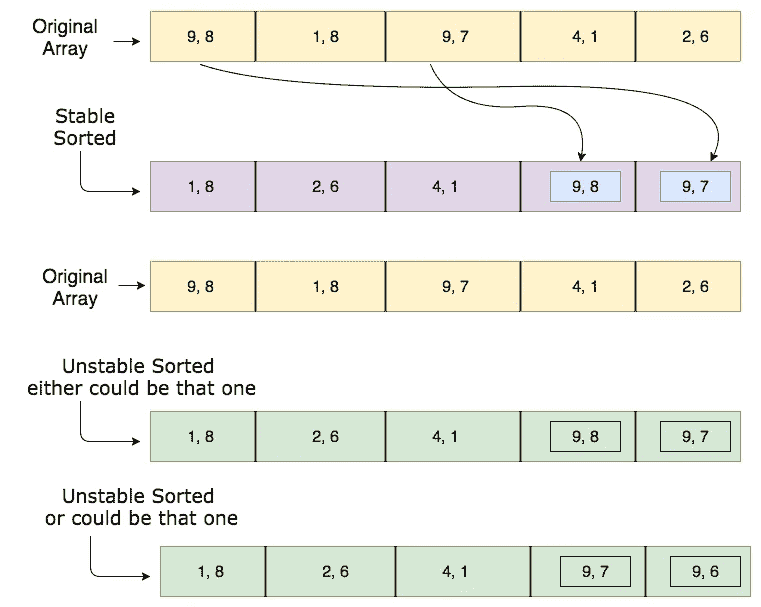

# 20 大算法编程问题及解决方案访谈

> 原文：<https://medium.com/javarevisited/20-algorithms-coding-problems-to-crack-you-next-technical-interviews-23191f229788?source=collection_archive---------0----------------------->

## 准备编码面试？这里有 20 多个你可以练习的算法问题。这个列表包括了关于基本搜索和排序算法的问题，如二分搜索法、快速排序、计数排序等。

大家好，如果你正在准备[编程工作面试](https://javarevisited.blogspot.com/2011/06/top-programming-interview-questions.html)或寻找一份新工作，那么你知道这不是一个容易的过程。你必须很幸运地接到电话并进入第一轮面试，不仅仅是当你是一个初学者，而是在你职业生涯的任何阶段。

但是，是的，当你在寻找你的第一份工作时，这在初级阶段是最困难的。

> *这就是为什么你不能掉以轻心。你必须准备好抓住这个机会，为此，你必须知道这是面试时对你的期望。问的是什么，要准备什么题目等等？*

我已经写了很多关于你能在这个博客中找到什么有用文章的博客，但是让我来回顾一下，让我告诉你，除了[数据结构问题](http://www.java67.com/2018/06/data-structure-and-algorithm-interview-questions-programmers.html)、[系统设计问题](http://www.java67.com/2018/05/top-20-system-design-interview-questions-answers-programming.html)，以及编程语言特有的问题，如 [Java](http://javarevisited.blogspot.sg/2015/10/133-java-interview-questions-answers-from-last-5-years.html) 、 [C++](http://www.java67.com/2019/04/top-10-c-interview-questions-and-answers.html) 或 [Scala](https://javarevisited.blogspot.com/2017/03/top-30-scala-and-functional-programming.html) ，大多数编程工作面试还会问基于算法的问题。

这些都是基于常见的搜索和排序算法，如[字符串算法](https://javarevisited.blogspot.com/2015/01/top-20-string-coding-interview-question-programming-interview.html)、[二分搜索法](https://medium.freecodecamp.org/how-to-implement-a-binary-search-algorithm-in-java-without-recursion-67d9337fd75f)、[图形算法](http://bit.ly/2NAbaIR)等。

练习这些基于算法的问题很重要，因为即使它们看起来显而易见且简单，但有时在实际面试中它们会变得难以解决，尤其是如果你从未自己编码过它们。

> 在面试前练习这些问题不仅能让你熟悉它们，还能让你更有信心向面试官解释解决方案，这对你的选择起着非常重要的作用。

它还让你为任何扭曲的问题做好准备，像面试官经常喜欢要求你使用[递归](https://javarevisited.blogspot.com/2012/12/recursion-in-java-with-example-programming.html#axzz5lX7tvDaU)或[迭代](https://javarevisited.blogspot.com/2017/03/how-to-reverse-linked-list-in-java-using-iteration-and-recursion.html)来解决特定的编码问题。

有时，如果你使用我在[中使用的数据结构，在字符串](http://www.java67.com/2014/03/how-to-find-duplicate-characters-in-String-Java-program.html)中寻找重复字符，他们会要求你不使用设置的数据结构来解决这个问题。这些只是一些常见的例子，这就是为什么实践很重要。

顺便说一句，如果你是数据结构和算法领域的初学者，那么我建议你首先参加一个全面的算法课程，比如 Udemy 上的 [**数据结构和算法:使用 Java**](https://click.linksynergy.com/fs-bin/click?id=JVFxdTr9V80&subid=0&offerid=323058.1&type=10&tmpid=14538&RD_PARM1=https%3A%2F%2Fwww.udemy.com%2Fdata-structures-and-algorithms-deep-dive-using-java%2F) 的深度学习，它不仅会教你基本的数据结构和算法，还会教你如何在现实世界中使用它们，以及如何使用它们解决编码问题。

另一方面，如果你喜欢阅读书籍或者更喜欢书籍而不是在线课程，那么你必须阅读像 Thomas H. Cormen 的 [**【算法简介】**](http://www.amazon.com/dp/0072970545/?tag=javamysqlanta-20) 这样的综合性书籍，以了解常见的计算机科学算法，如搜索、排序、密码学、[图算法](http://bit.ly/2NAbaIR)和一些常见的算法，如傅立叶变换。

# 来自编码面试的 20 多个搜索和排序算法问题

无论如何，这里有一些在面试中经常被问到的搜索和排序算法问题。我已经链接了解决方案，但是你应该先试着解决问题再看解决方案。

这篇文章的目的是你应该知道如何自己解决这些问题，但是，是的，如果你卡住了，想比较你的解决方案，你可以看到解决方案。

## 基于搜索算法的编码问题

让我们首先从基本的搜索算法开始，如线性搜索、二分搜索法、层次顺序搜索和深度优先搜索算法。

## **1。你能实现二分搜索法算法吗？(** [**解**](http://www.java67.com/2016/10/binary-search-using-recursion-in-java.html) **)**

这很简单，二分搜索法是一个分治算法，将问题分成子问题，然后解决这些子问题。这是一种搜索算法，这意味着它用于查找像整数数组中的数字或目录中的项目这样的东西。

实现[二分搜索法算法](https://javarevisited.blogspot.com/2017/04/recursive-binary-search-algorithm-in-java-example.html)最简单的方法是使用递归，这是解决方案链接包含的内容，但是您应该在看到解决方案之前亲自尝试一下。

值得注意的一点是输入必须是有序的，我的意思是你只能在一个[有序数组](http://www.java67.com/2014/12/how-to-find-missing-number-in-sorted.html)中实现二分搜索法。

## **2。写一个程序实现一个线性搜索算法？(** [**解**](http://www.java67.com/2016/10/how-to-implement-linear-search-in-java.html) **)**

它甚至比二分搜索法更容易，你需要做的就是使用循环或递归方法遍历数组中的所有元素，并将每个元素与你想要搜索的元素进行比较。当一个元素匹配时，要么返回索引，要么根据需要返回。

例如，如果您正在编写一个 [contains()方法](http://www.java67.com/2015/09/how-to-check-if-key-exits-in-hashmap-in-java.html)，您可以返回`true` 或`false` 来指示数组中是否存在某个元素。由于你需要扫描整个数组来寻找元素，这个算法的时间复杂度是`O(n)`。

## **3。你能实现没有递归的二分搜索法算法吗？(** [**解**](https://javarevisited.blogspot.com/2018/06/binary-search-in-java-without-recursion.html) **)**

您可能知道，通过使用循环，有时使用[堆栈](http://www.java67.com/2013/08/ata-structures-in-java-programming-array-linked-list-map-set-stack-queue.html)数据结构，您可以将递归算法替换为迭代算法。对于二分搜索法，你也可以这样做；只需划分数组，比较中间的元素，直到找到目标元素或者数组中没有更多的元素。

> *如果目标元素比中间元素大，你就得向右移动，否则就向左移动。*

顺便说一句，如果你在理解递归算法或将递归算法转换为迭代算法方面有困难，那么我建议你去参加一个很好的在线课程，比如 Pluralsight 中的 [**算法和数据结构—第一部分**](https://pluralsight.pxf.io/c/1193463/424552/7490?u=https%3A%2F%2Fwww.pluralsight.com%2Fcourses%2Fads-part1) 和[**第二部分**](https://pluralsight.pxf.io/c/1193463/424552/7490?u=https%3A%2F%2Fwww.pluralsight.com%2Fcourses%2Fads2) ，以便更好地学习基础知识。

这些课程还会教你如何计算时间和空间的复杂度，无论是从编码面试的角度，还是从提高算法性能的角度，这都是非常重要的。

顺便说一下，你需要一个 [Pluralsight 会员](https://pluralsight.pxf.io/c/1193463/424552/7490?u=https%3A%2F%2Fwww.pluralsight.com%2Fpricing)才能加入这个课程，费用大约是每月 29 美元或每年 299 美元(14%的折扣)。我向所有程序员强烈推荐这个订阅，因为它提供了超过 7000 个在线课程的即时访问，以学习任何技术技能。

或者，你也可以使用他们的 [**10 天免费通行证**](https://pluralsight.pxf.io/c/1193463/424552/7490?u=https%3A%2F%2Fwww.pluralsight.com%2Flearn) 免费观看这个课程。

## **4。写代码实现二叉树中的层次顺序搜索？**(解决方案)

在级别顺序搜索中，首先访问同级节点，然后进入下一个级别。您可以使用一个[队列](https://javarevisited.blogspot.com/2017/03/difference-between-stack-and-queue-data-structure-in-java.html)来实现二叉树中的层次顺序搜索。

而且，如果你真的想做得更好，你也可以查看这个[课程列表来破解你的编程工作面试](https://dev.to/javinpaul/10-data-structure-algorithms-sql-and-java-courses-to-crack-any-programming-job-interview-11f6)

 [## 程序员的 100+编码面试问题

### 解决这些常见的编码问题，以便在下一次编程工作面试中表现出色。

codeburst.io](https://codeburst.io/100-coding-interview-questions-for-programmers-b1cf74885fb7) 

## **5。二叉树的深度优先搜索算法是什么？**(解决方案)

这是另一种流行的搜索算法，主要用于树和图。该算法首先对节点进行深度访问，然后进行同级搜索；这就是为什么深度优先搜索算法这个名字。

这很难实现，但是您可以使用堆栈来实现 DFS 或深度优先搜索算法。如果你需要更多关于这个话题的信息，我建议你去查查 Aditya Bhargava 的[**Grokking Algorithms**](https://www.amazon.com/Grokking-Algorithms-illustrated-programmers-curious/dp/1617292230/?tag=javamysqlanta-20)的书；他的解释可能是对这个话题最好的解释

## 基于排序算法的编码问题

现在我们已经看到了一些基于搜索算法的编码问题，让我们深入研究一下基于排序算法的编码问题:

## **6。实现冒泡排序算法？(** [**解**](http://javarevisited.blogspot.sg/2014/08/bubble-sort-algorithm-in-java-with.html#axzz5ArdIFI7y) **)**

难道这不是你学的第一种排序算法吗？是的，我做到了，这就是为什么我记得[冒泡排序](http://www.java67.com/2012/12/bubble-sort-in-java-program-to-sort-integer-array-example.html)是将数组中的每个数字与其他数字进行比较，这样每次通过后，最大或最小的元素[就会冒泡到顶部。](https://javarevisited.blogspot.com/2017/03/how-to-find-largest-and-smallest-number.html)

我的意思是，号码已经找到了，它已经按顺序排好了。这是最基本的排序算法之一，我们大多数人都是用这种算法开始学习排序的。

*这个的时间复杂度是* `*O(n ^2)*` *这使得它对于大的数字集合不可用，但是对于小的数字集合却很好。*如果你想了解更多，你可以在 freeCodeCamp 上查看这些免费的[数据结构和算法课程](https://medium.freecodecamp.org/these-are-the-best-free-courses-to-learn-data-structures-and-algorithms-in-depth-4d52f0d6b35a)

 [## 面向初学者的 10 大免费数据结构和算法课程——最好的

### 算法和数据结构是计算机科学的两个最基本和最重要的课题，是计算机科学的基础

medium.com](/javarevisited/top-10-free-data-structure-and-algorithms-courses-for-beginners-best-of-lot-ad807cc55f7a) 

## **7。稳定排序算法和不稳定排序算法的区别？(** [**回答**](https://javarevisited.blogspot.com/2017/06/difference-between-stable-and-unstable-algorithm.html) **)**

这是一个棘手的概念，我很久以前才知道。我还没有遇到任何实际的用例，但从面试的角度来看，知道这个概念是可以的。

在稳定排序算法中，相同元素的顺序即使在排序后也保持不变，但在不稳定排序算法中，这些会发生变化。

一个很好的例子是[快速排序](http://www.java67.com/2014/07/quicksort-algorithm-in-java-in-place-example.html)和[合并排序](http://www.java67.com/2018/03/mergesort-in-java-algorithm-example-and.html)，其中前者是不稳定的，而后者是稳定的算法。

## **8。迭代快速排序算法是如何实现的？(** [**解**](http://javarevisited.blogspot.sg/2016/09/iterative-quicksort-example-in-java-without-recursion.html#axzz5ArdIFI7y) **)**

显然没有递归:-)。如果你还记得，我之前告诉过你，你可以用栈来把递归算法转换成迭代算法，这也是你可以做的，来实现没有递归的快速排序算法。

Btw，如果你在计算和理解算法的时间和空间复杂度上有困难，那么你应该去看看类似 [**数据结构&算法——面试**](https://click.linksynergy.com/fs-bin/click?id=JVFxdTr9V80&subid=0&offerid=323058.1&type=10&tmpid=14538&RD_PARM1=https%3A%2F%2Fwww.udemy.com%2Flearn-data-structure-algorithms-with-java-interview%2F) 这样的课程，在去面试之前更好地理解它们。

## **9。如何实现计数排序算法？(** [**解**](http://www.java67.com/2017/06/counting-sort-in-java-example.html) **)**

就像我们对基数排序和桶排序等其他 O(n)排序算法所做的那样。

如果你不知道，[计数排序](http://www.java67.com/2017/06/counting-sort-in-java-example.html)是另一种整数排序算法，根据是小整数的键对对象集合进行排序。

它有`O(n)`的时间复杂度，这使得它比类似的[快速排序](https://javarevisited.blogspot.com/2014/08/quicksort-sorting-algorithm-in-java-in-place-example.html)和[合并排序](http://www.java67.com/2018/03/mergesort-in-java-algorithm-example-and.html)对于一组特定的输入更快。有关更多详细信息，请参见解决方案。

## **10。如何在不使用第三个变量的情况下交换两个数？(** [**解**](http://www.java67.com/2015/08/how-to-swap-two-integers-without-using.html) **)**

另一个棘手的问题，如果你知道诀窍，就很容易:-)你可以交换两个数字，而不需要使用临时变量或第三个变量，如果你可以将两个数字的和存储在一个数字中，然后用另一个数字减去和，就像这样

`a = 3;
b = 5;`

`a = a + b; //8
b = a — b; // 3
a = a — b; //5`

现在你有了 a = 5 和 b = 3，所以不用第三个变量或临时变量就可以交换数字。

## 11。基数排序算法是如何实现的？( [**解**](http://www.java67.com/2018/03/how-to-implement-radix-sort-in-java.html) **)**

这是另一种时间复杂度为 O(n)的整数排序算法。根据维基百科，基数排序是一种[非比较排序算法](https://javarevisited.blogspot.com/2017/02/difference-between-comparison-quicksort-and-non-comparison-counting-sort-algorithms.html)，它通过按单个数字对键进行分组来对具有整数键的数据进行排序，这些数字共享相同的有效位置和值。

可以进一步看 [**算法，第一部分**](http://bit.ly/algorithms-part1)**和 [**第二部分**](http://bit.ly/algorithms-part2) 由罗伯特·塞奇威克在 [Coursera](https://medium.com/u/99c0fb464c1f?source=post_page-----5a476121fd0f----------------------) 上了解更多关于这些或者线性排序算法。该课程是免费学习和探索的，但如果你还想获得认证，则需要付费。**

****

**如果你觉得 Coursera 的课程有用，因为它们是由知名公司如谷歌、IBM 和世界上最好的大学创建的，我建议你加入 Coursera 的订阅计划**

**这种单一订阅让你可以无限制地访问他们最受欢迎的**课程**、**专业化**、**职业证书**和**指导项目**。它每年花费大约 399 美元，但是它完全值得你的钱，因为你得到了**无限证书**。**

****

## ****12。如何实现插入排序算法？(** [**解**](http://www.java67.com/2014/09/insertion-sort-in-java-with-example.html) **)****

**你曾经整理过你橱柜里的一副牌或者几件衬衫吗？这两件事有什么共同点？好吧，你把下一张卡片或衬衫放到它们合适的位置，或者，我应该说你把下一个元素插入它合适的位置。那就是 [*为你插入排序*](http://www.java67.com/2014/09/insertion-sort-in-java-with-example.html) 。**

# **技术面试中基于各种算法的问题**

**现在，让我们看几个基于不同算法的编码问题。**

## ****13。写算法检查两个矩形是否重叠？(** [**解**](http://javarevisited.blogspot.sg/2016/10/how-to-check-if-two-rectangle-overlap-in-java-algorithm.html) **)****

**这是一个棘手的算法问题，但如果你在 2D 数学课上听老师讲课，你就能解决这个问题。还有一个技巧，检查矩形不会重叠的所有条件，如果任何条件为假，则意味着两个矩形彼此重叠。例如，如果一个矩形的上侧低于其他矩形的下侧，那么它们不会重叠，因为它们是垂直对齐的。**

**顺便说一句，如果你发现这个问题很难解决，我建议你看看 Educative 上的 [**《寻找编码面试:编码问题的模式》**](https://www.educative.io/collection/5668639101419520/5671464854355968?affiliate_id=5073518643380224) 课程，这是一个编码面试的交互式门户网站，可以学习一些 **16 种有用的编码模式，如滑动窗口**、两个指针、快速和慢速指针、合并间隔、循环排序和 Top K 元素，可以帮助你解决常见编码问题的区域。**

****

## **14。合并排序算法是如何实现的？( [**解**](http://www.java67.com/2018/03/mergesort-in-java-algorithm-example-and.html) **)****

**与快速排序类似，合并排序也是一种分治算法，这意味着您可以保留问题，直到您可以对它们中最小的进行排序。**

**例如，要对一个数字数组进行排序，你需要将数组分成更小的部分，直到你知道如何像一个有一个或零个元素的数组那样排序。一旦你对小数组进行了排序，你就可以合并它们以得到最终的结果。**

**快速排序和合并排序唯一的[区别是合并排序是**稳定的**而快速排序是**不稳定的**。这意味着相同的元素在排序前后保持不变。](https://javarevisited.blogspot.com/2017/06/difference-between-stable-and-unstable-algorithm.html)**

**另一个值得注意的区别是，尽管两者都有平均时间，但使用快速排序比合并排序更好，因为对于相同数量的输入，快速排序花费的时间更少，快速排序中的常数因子比合并排序更少。**

****

## **15。如何实现桶排序算法？( [**解**](http://javarevisited.blogspot.sg/2017/01/bucket-sort-in-java-with-example.html) **)****

**桶排序是另一个很棒的算法，它甚至不用比较元素就可以对数组进行排序。它被称为[非比较排序算法](https://javarevisited.blogspot.com/2017/02/difference-between-comparison-quicksort-and-non-comparison-counting-sort-algorithms.html)，可以为所选输入提供 O(n)性能。**

**如果你不了解非比较排序算法，请参见 [**算法介绍**](http://www.amazon.com/dp/0072970545/?tag=javamysqlanta-20) 一书。**

****

## ****16。写算法检查两个字符串是否是变位词(** [**【解】**](http://javarevisited.blogspot.sg/2013/03/Anagram-how-to-check-if-two-string-are-anagrams-example-tutorial.html#axzz5F18OIWfY) **)****

**变位词是长度和字符匹配但顺序不同的词，像`Army` 和`Mary`，两者有相同的字符数。**

**解决这个问题的一个技巧是[对字符数组](http://www.java67.com/2016/07/how-to-sort-array-in-descending-order-in-java.html)进行排序，并检查它们是否相同。**

## ****17。用你最喜欢的编程语言实现快速排序算法？(** [**解**](https://javarevisited.blogspot.com/2014/08/quicksort-sorting-algorithm-in-java-in-place-example.html) **)****

**这是一个非常简单的排序算法，但前提是你必须练习过，如果没有，那么你可能会迷失方向。记住， **Quicksort** 是一个[分治算法](https://dev.to/javinpaul/50-data-structure-and-algorithms-problems-from-coding-interviews-4lh2)，意思是你不断划分数组，也叫**分区**。然后你在最小的层次上解决问题，也就是所谓的基本情况，就像你的数组只包含一个或者零个元素。**

## ****19。比较和非比较排序算法的区别？(** [**回答**](https://javarevisited.blogspot.com/2017/02/difference-between-comparison-quicksort-and-non-comparison-counting-sort-algorithms.html) **)****

**顾名思义，在基于比较的排序算法中，你必须比较元素才能像 quicksort 一样排序，但是在非基于比较的排序算法中，比如[计数排序](http://www.java67.com/2017/06/counting-sort-in-java-example.html)，你可以不比较元素而排序元素。惊讶吗？**

**是的，那么我建议你去看看这个课程，学习更多的排序算法，比如基数排序、计数排序和桶排序。可以进一步查看[**数据结构和算法:深潜**](https://click.linksynergy.com/fs-bin/click?id=JVFxdTr9V80&subid=0&offerid=323058.1&type=10&tmpid=14538&RD_PARM1=https%3A%2F%2Fwww.udemy.com%2Fdata-structures-and-algorithms-deep-dive-using-java%2F) 如果你想了解更多关于这些排序算法的知识。**

****

## ****19。如何检验两个弦是否是相互旋转的？(** [**解**](https://javarevisited.blogspot.com/2017/07/2-ways-to-check-if-one-string-is-rotation-of-another-String.html) **)****

**有一个简单的技巧可以解决这个问题，*只要将字符串与其自身连接起来，并检查那里是否存在旋转。*您可以使用`indexOf` 或`substring` 方法来完成。如果连接的字符串包含旋转，那么给定的字符串是前者的旋转。**

## **20。实现素数厄拉多塞算法的筛选？( [**解**](https://javarevisited.blogspot.com/2015/05/sieve-of-Eratosthenes-algorithm-to-generate-prime-numbers-in-java.html) **)****

**这是很难实现的算法之一，尤其是当你不记得它的时候:-)有时候，面试官会给你解释，但其他时候，你需要记住它。**

**我希望这 20 个问题足以让你为编码面试的算法做好准备。如果你需要更多这样的编码问题，你可以从 Gayle Laakmann McDowell 写的《破解代码访谈》 中得到帮助，里面包含了 189 个以上的编程问题和解决方案。短时间内准备编程求职面试的好书。**

****

**对了，你在实践中解决的问题越多，你的准备就越充分。所以，如果你认为这份问题清单还不够，你还需要更多，那么看看这些额外的 [50 个编程问题](http://javarevisited.blogspot.sg/2015/02/50-programmer-phone-interview-questions-answers.html)用于[电话面试](http://www.java67.com/2015/03/top-40-core-java-interview-questions-answers-telephonic-round.html)和这些[书籍](http://javarevisited.blogspot.sg/2016/06/top-5-books-for-programming-coding-interviews-best.html)和[课程](http://javarevisited.blogspot.sg/2018/02/10-courses-to-prepare-for-programming-job-interviews.html)来做更彻底的准备。**

## **现在，您已经为编码面试做好了准备**

**这些是数据结构和算法之外的一些最常见的问题，有助于你在面试中表现出色。**

**我在我的[博客](http://java67.com/)上也分享了很多这样的问题，所以如果你真的感兴趣，你可以随时去那里搜索。**

**这些常见的编码、[数据结构和算法问题](https://hackernoon.com/50-data-structure-and-algorithms-interview-questions-for-programmers-b4b1ac61f5b0)是你需要知道的，以便成功地面试任何公司，无论大小，任何级别的编程工作。**

**如果你正在寻找一份编程或软件开发的工作，你可以从这个课程列表开始准备，学习解决编码问题的模式、技巧和诀窍**

## **准备技术面试的资源**

1.  **[寻找编码面试:编码问题的模式](https://www.educative.io/collection/5668639101419520/5671464854355968?affiliate_id=5073518643380224)**
2.  **[数据结构和算法:使用 Java 进行深入研究](https://click.linksynergy.com/fs-bin/click?id=JVFxdTr9V80&subid=0&offerid=323058.1&type=10&tmpid=14538&RD_PARM1=https%3A%2F%2Fwww.udemy.com%2Fdata-structures-and-algorithms-deep-dive-using-java%2F)**
3.  **[从 0 到 Java 中的数据结构和算法](https://click.linksynergy.com/fs-bin/click?id=JVFxdTr9V80&subid=0&offerid=323058.1&type=10&tmpid=14538&RD_PARM1=https%3A%2F%2Fwww.udemy.com%2Ffrom-0-to-1-data-structures%2F)**
4.  **[数据结构与算法分析—面试](https://click.linksynergy.com/fs-bin/click?id=JVFxdTr9V80&subid=0&offerid=323058.1&type=10&tmpid=14538&RD_PARM1=https%3A%2F%2Fwww.udemy.com%2Fdata-structure-and-algorithms-analysis%2F)**
5.  **[**破解密码面试**](http://www.amazon.com/Cracking-Coding-Interview-6th-Edition/dp/0984782850/?tag=javamysqlanta-20) ，**
6.  **[钻研系统设计面试](https://www.educative.io/collection/5668639101419520/5649050225344512?affiliate_id=5073518643380224)**

**这个列表提供了准备的好话题，也有助于评估你的准备情况，找出你的强项和弱项。**

**良好的数据结构和算法知识对于成功编写面试代码非常重要，这也是你应该集中大部分注意力的地方。**

## **结束语**

**谢谢，你坚持到了文章的结尾…祝你编程面试好运！这当然不会很容易，但通过遵循这些搜索和排序算法问题，你比别人更近了一步。**

**如果你喜欢这篇文章，那么请与你的朋友和同事分享，不要忘记在 Twitter 上关注[javarestived](https://twitter.com/javarevisited)以及在 Medium 上关注 [javinpaul](https://medium.com/u/bb36d8439904) 和 javinpaul！**

****附言——**如果你正在准备技术面试，那么我也建议你通过 [**寻找编码面试:编码问题的模式**](https://www.educative.io/collection/5668639101419520/5671464854355968?affiliate_id=5073518643380224) 来学习 16 种有用的编码模式，如滑动窗口、两个指针、快慢指针、合并间隔、循环排序和 Top K 元素，它们可以帮助你解决许多常见的编码问题。**

** [## 探索编码面试:编码问题的模式——互动学习

### 编码面试一天比一天难。几年前，我温习了关键数据结构并浏览了…

www.educative.io](https://www.educative.io/collection/5668639101419520/5671464854355968?affiliate_id=5073518643380224) 

## 来自媒体的其他数据结构和算法文章

 [## 50+数据结构和算法程序员面试问题

### 有很多计算机科学毕业生和程序员申请编程、编码和软件…

medium.com](/hackernoon/50-data-structure-and-algorithms-interview-questions-for-programmers-b4b1ac61f5b0)  [## 10 门数据结构、算法和编程课程，破解任何编码面试

### 许多初级开发人员梦想在大型科技公司工作，但是，说实话，获得你的…

medium.com](/hackernoon/10-data-structure-algorithms-and-programming-courses-to-crack-any-coding-interview-e1c50b30b927)  [## Java、C/C++和 Python 初学者的 10 本最佳数据结构和算法书籍

### 算法是语言不可知的，任何称职的程序员都应该能够将它们转换成他们自己的代码…

medium.com](/javarevisited/10-best-books-for-data-structure-and-algorithms-for-beginners-in-java-c-c-and-python-5e3d9b478eb1)**