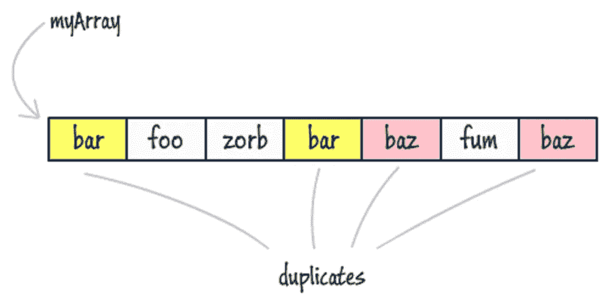

# 20 多个数组编码问题和来自编程访谈的问题

> 原文：<https://medium.com/javarevisited/20-array-coding-problems-and-questions-from-programming-interviews-869b475b9121?source=collection_archive---------0----------------------->

如何在一个数组中找到重复的元素？

大家好，数组是最基本的数据结构，它将元素存储在连续的内存位置。这也是面试官最喜欢的话题之一，你会在任何[编码面试](https://javarevisited.blogspot.com/2011/06/top-programming-interview-questions.html)中听到很多关于数组的问题，比如[反转一个数组](https://www.java67.com/2016/01/java-program-to-reverse-array-in-place.html)，对数组排序，或者搜索数组中的元素。

数组数据结构的主要好处是，如果你知道索引，它**提供快速的 O(1)搜索**，但是**从数组中添加和移除元素是缓慢的**，因为一旦创建了数组，你就不能改变它的大小。

为了创建一个更短或更长的数组，您需要创建一个新数组，并将所有元素从旧数组复制到新数组。

# 每个程序员都应该知道的关于数组的事情

1.  数组索引从 0 开始，而不是 1。
2.  数组大多是不可变的数据结构，其长度一旦创建就不能改变，可变数组称为链表。
3.  数组需要一个内存块来分配，称为连续内存位置，这意味着即使你有一个内存，如果内存是分散的，你也不能分配一个大数组。
4.  通过数组中的索引进行搜索是 O(1)，但是插入和删除并不容易，因为您可能需要重新排列数组。
5.  数组基本上是同质的数据结构，这意味着不能在整数数组中存储字符串，反之亦然。
6.  数组可以是一维的，也可以是多维的。二维数组被称为矩阵，在游戏中使用瓷砖创建 2D 世界非常有用。

解决基于数组的问题的关键是很好地了解[数组数据结构](http://www.java67.com/2013/08/ata-structures-in-java-programming-array-linked-list-map-set-stack-queue.html)以及基本的编程构造函数，如**循环**、**递归**和基本运算符。

如果您不熟悉这些概念，那么我强烈建议您先学习一门全面的数据结构和算法课程，如[**数据结构和算法:使用 Java**](https://click.linksynergy.com/fs-bin/click?id=JVFxdTr9V80&subid=0&offerid=323058.1&type=10&tmpid=14538&RD_PARM1=https%3A%2F%2Fwww.udemy.com%2Fdata-structures-and-algorithms-deep-dive-using-java%2F) 深入学习，该课程详细解释了基本的数据结构。它也非常实惠，因为你可以在不时发生的疯狂的 Udemy 销售上只花 9.9 美元购买这门课程。

# 来自编程面试的 20 多个问题

以下是一些常见的基于数组的编码面试问题，供您练习使用:

1.  **如何在给定的 1 到 100 的整数数组中找到缺失的数字？(** [**解**](http://javarevisited.blogspot.com/2014/11/how-to-find-missing-number-on-integer-array-java.html) **)**
2.  **如何在给定的整数数组中找到重复的数字？(** [**解**](http://javarevisited.blogspot.com/2014/01/how-to-remove-duplicates-from-array-java-without-collection-API.html) **)**
3.  **如何在一个未排序的整数数组中找到最大和最小的数？(** [**解**](http://java67.blogspot.com/2014/02/how-to-find-largest-and-smallest-number-array-in-java.html) **)**
4.  **如何求一个整数数组的和等于给定数的所有对？(** [**解**](http://javarevisited.blogspot.com/2014/08/how-to-find-all-pairs-in-array-of-integers-whose-sum-equal-given-number-java.html) **)**
5.  如果一个数组中包含多个重复的数字，如何找到重复的数字？( [**解**](http://javarevisited.blogspot.com/2014/03/3-ways-to-find-first-non-repeated-character-String-programming-problem.html) **)**
6.  **如何在 Java 中删除给定数组中的重复项？(** [**解**](http://javarevisited.blogspot.com/2014/01/how-to-remove-duplicates-from-array-java-without-collection-API.html) **)**
7.  如何在旋转数组中搜索目标值？(解决方案)
8.  **给定一个未排序的整数数组，求最长连续元素序列的长度？**(解决方案)
9.  **如何使用快速排序算法对整数数组进行排序？(** [**解**](http://javarevisited.blogspot.com/2014/08/quicksort-sorting-algorithm-in-java-in-place-example.html) **)**
10.  **如何就地删除数组中的重复项？(** [**)解**](http://javarevisited.blogspot.com/2014/01/how-to-remove-duplicates-from-array-java-without-collection-API.html) **)**
11.  在 Java 中，你如何原地反转一个数组？( [**解**](http://javarevisited.blogspot.com/2013/03/how-to-reverse-array-in-java-int-String-array-example.html) **)**
12.  如何在不使用任何库的情况下从数组中删除重复项？( [**)解**](http://javarevisited.blogspot.sg/2014/01/how-to-remove-duplicates-from-array-java-without-collection-API.html) **)**
13.  **如何将字节数组转换成字符串？(** [**解**](https://javarevisited.blogspot.com/2014/08/2-examples-to-convert-byte-array-to-String-in-Java.html) **)**
14.  **数组和链表有什么区别？(** [**回答**](http://www.java67.com/2017/06/5-difference-between-array-and-linked.html) **)**
15.  如何在给定的数组中执行二分搜索法？( [**解**](http://javarevisited.blogspot.sg/2015/10/how-to-implement-binary-search-tree-in-java-example.html#axzz4wnEtnNB3) **)**
16.  如何求两个排序数组的中间值？(解决方案)
17.  **如何将一个数组左右旋转给定的数 K？(** [**解**](https://www.java67.com/2018/05/how-to-rotate-array-left-and-right-by-given-number.html) **)**
18.  如何在一个无序的数组中找到重复的元素？( [**解**](http://java67.blogspot.com/2015/10/2-ways-to-find-duplicate-elements-in-java-array.html) **)**
19.  **给定一个按升序排序的整数数组，求给定值的起止位置？**(解决方案)
20.  **给定一个整数数组，找出具有最大和的连续子数组(至少包含一个数)并返回其和？【解决方案】**

这些问题不仅有助于您发展解决问题的技能，还能提高您对数组数据结构的了解。

如果你需要更高级的基于数组的问题，那么你可以看看 Python 中的[**leet code:50 个算法编码面试问题**](https://click.linksynergy.com/deeplink?id=JVFxdTr9V80&mid=39197&murl=https%3A%2F%2Fwww.udemy.com%2Fcourse%2Fleetcode-in-python-50-algorithms-coding-interview-questions%2F) ，这是一个训练营式的课程，学习解决问题的技巧、数据结构和算法，以通过谷歌等公司的编码面试

在本课程中，作者收集了这些大公司提出的 50 个最重要、最受欢迎的面试问题，我将一步步地解释这些问题，帮助你准确理解如何解决这些问题。

 [## Python 中的 LeetCode:编码面试问题的 50 种算法

### 为你的软件工程编码面试做准备？这是适合你的地方。最想了解…

Udemy.com](https://click.linksynergy.com/deeplink?id=JVFxdTr9V80&mid=39197&murl=https%3A%2F%2Fwww.udemy.com%2Fcourse%2Fleetcode-in-python-50-algorithms-coding-interview-questions%2F) 

而且，如果你觉得这 20 道题还不够，还需要多加练习，那么你还可以看看这份 [**30 道阵题**](http://javarevisited.blogspot.sg/2015/06/top-20-array-interview-questions-and-answers.html) 的清单。

# 编写面试代码的最佳资源

选择好的资源对于编码面试的成功非常重要。如果你选择了一个错误的资源，那么比金钱更重要的是，你会失去你需要准备的宝贵时间，因此要花一些时间去寻找好的资源。

如果您需要建议，以下是我的一些经过验证和测试的资源，用于深入学习数据结构和算法以进行编码面试:

*   [**数据结构与算法:Java 开发者使用 Java**](https://click.linksynergy.com/fs-bin/click?id=JVFxdTr9V80&subid=0&offerid=323058.1&type=10&tmpid=14538&RD_PARM1=https%3A%2F%2Fwww.udemy.com%2Fdata-structures-and-algorithms-deep-dive-using-java%2F&source=post_page---------------------------) 的深度学习。了解数组、链表、树、哈希表、堆栈、队列、堆、排序算法和搜索算法
*   [**ByteByteGo 作者 Alex Xu**](https://bytebytego.com?fpr=javarevisited) 是学习面试系统设计的一个很好的资源，也是科技面试的另一个重要话题。在这个平台上，你不仅将学习基本的系统设计概念，如可伸缩性、缓存、高可用性、分布式系统，还将学习如何解决常见的系统设计问题，如如何设计
*   [**Python 中的算法和数据结构**](https://click.linksynergy.com/deeplink?id=JVFxdTr9V80&mid=39197&murl=https%3A%2F%2Fwww.udemy.com%2Falgorithms-and-data-structures-in-python%2F&source=post_page---------------------------) 对于那些热爱 Python 的人来说
    从头开始实现最新算法的指南:数组、链表、图形算法和排序
*   [**JavaScript 算法与数据结构 Masterclass**](https://click.linksynergy.com/fs-bin/click?id=JVFxdTr9V80&subid=0&offerid=508237.1&type=10&tmpid=14538&RD_PARM1=https%3A%2F%2Fwww.udemy.com%2Fjs-algorithms-and-data-structures-masterclass%2F&source=post_page---------------------------) 由 Colt_Steele 为 JavaScript 程序员打造。失踪的计算机科学和编码面试训练营。学习所有你需要的东西来应对困难的编码面试。
*   [**掌握数据结构&使用 C 和 C++** 的算法](https://click.linksynergy.com/deeplink?id=JVFxdTr9V80&mid=39197&murl=https%3A%2F%2Fwww.udemy.com%2Fdatastructurescncpp%2F)对于擅长 C/C++的人
*   [**Java 中的数据结构:面试复习**](https://www.educative.io/collection/5642554087309312/5724822843686912?affiliate_id=5073518643380224&source=post_page---------------------------) **by** [**教研组**](https://medium.com/u/163aa84775f6?source=post_page-----b1cf74885fb7----------------------) 刷新 Java 中重要的数据结构和算法概念。本课程包含了对所有常见数据结构的详细回顾，并提供了 Java 实现层面的细节，以帮助读者做好准备。
*   [**寻找编码面试:编码问题的模式**](https://www.educative.io/collection/5668639101419520/5671464854355968?affiliate_id=5073518643380224) 作者[法希姆·哈克](https://medium.com/u/71fb82f73ada)和[教育团队](https://medium.com/u/163aa84775f6?)
    这就像编码面试的元课程，它不会教你如何解决编码问题，而是教你如何使用模式解决特定类型的编码问题。掌握这 15 个面试问题的基本模式，你就能应对面试中遇到的任何问题

而且，如果你更喜欢书籍，没有比《破解编码面试**[更好的了，由](http://www.amazon.com/Cracking-Coding-Interview-6th-Edition/dp/0984782850/?tag=javamysqlanta-20)** [**格利拉克曼麦克道尔**](https://medium.com/u/e21bc4f4525e) 其中呈现了 **189+编程问题及解决方案。**短时间内准备编程求职面试的好书。顺便说一句，如果你购买这里提到的任何资源，我也会赚一些钱。

# 现在，您已经为编码面试做好了准备

这些是数据结构和算法之外的一些最常见的问题，有助于你在面试中表现出色。

我在我的[博客](http://java67.com/)上也分享了很多这样的问题，如果你真的感兴趣，可以随时去那里搜索。

这些**常见的编码、数据结构和算法问题**是你需要知道的，以便成功地面试任何公司，无论是大公司还是小公司，任何级别的编程工作。

如果你想找一份编程或软件开发的工作，你可以从这个编码问题列表开始准备。

这个列表提供了准备的好话题，也有助于评估你的准备情况，找出你的强项和弱项。

良好的数据结构和算法知识对于成功编写面试代码非常重要，这也是你应该集中大部分注意力的地方。

**其他你可能喜欢的编程与编码访谈文章**

1.  [来自编码访谈的 25 个软件设计问题](/javarevisited/25-software-design-interview-questions-to-crack-any-programming-and-technical-interviews-4b8237942db0)
2.  [访谈中的 21 个字符串编码问题](/javarevisited/top-21-string-programming-interview-questions-for-beginners-and-experienced-developers-56037048de45)
3.  [每个程序员都应该读的 10 本算法书](http://www.java67.com/2015/09/top-10-algorithm-books-every-programmer-read-learn.html)
4.  [来自编码面试的 20+二叉树问题](/javarevisited/20-binary-tree-algorithms-problems-from-coding-interviews-c5e5a384df30)
5.  [面向 Java 开发人员的五大数据结构和算法书籍](http://javarevisited.blogspot.sg/2016/05/5-free-data-structure-and-algorithm-books-in-java.html#axzz4uXETWjmV)
6.  [来自编程访谈的 20 多个基于链表的编码问题](/javarevisited/top-20-linked-list-coding-problems-from-technical-interviews-90b64d2df093)
7.  [初学者和有经验程序员的 100+编码问题](https://codeburst.io/100-coding-interview-questions-for-programmers-b1cf74885fb7)
8.  [破解你下一次编码面试的 10 门课程](http://-and-programming-courses-to-crack-any-coding-interview-e1c50b30b927)
9.  [20+来自投行的 Java 面试问题](/javarevisited/top-20-java-interview-questions-from-wall-street-banks-36ba58865681)
10.  [程序员 30+系统设计面试问题](https://faun.pub/top-30-system-design-interview-questions-and-problems-for-programmers-417e89eadd67)

## 结束语

谢谢，你坚持到了文章的结尾…祝你编程面试好运！这当然不容易，但是通过遵循这个路线图和指南，你离成为软件开发人员更近了一步。

如果你喜欢这篇文章，那么请分享给你的朋友和同事，别忘了在 Twitter 上关注 [javinpaul](https://twitter.com/javinpaul) ！

## p . s——如果你需要一些免费资源，你可以查看这个[免费数据结构与算法课程](http://javarevisited.blogspot.com/2018/01/top-5-free-data-structure-and-algorithm-courses-java--c-programmers.html)的列表，开始你的准备工作。

 [## 我最喜欢的免费课程&深入学习数据结构和算法的认证

### 为程序员学习数据结构和算法的一些最好的免费在线课程的精选列表。

medium.com](/free-code-camp/these-are-the-best-free-courses-to-learn-data-structures-and-algorithms-in-depth-4d52f0d6b35a) 

而且，如果你也想学习系统设计，那么 [**ByteByteGo**](https://bytebytego.com?fpr=javarevisited) 是我的发现，它是学习基本系统设计概念和架构的一个很好的平台。

 [## ByteByteGo | Ace 您的下一次系统设计面试

### 让您的系统设计技能更上一层楼所需的一切

bytebytego.com](https://bytebytego.com?fpr=javarevisited)