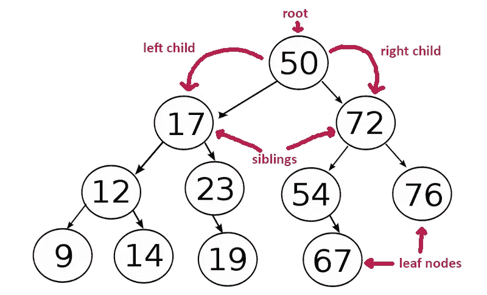

# 来自编程访谈的 20 多个二叉树编码问题

> 原文：<https://medium.com/javarevisited/20-binary-tree-algorithms-problems-from-coding-interviews-c5e5a384df30?source=collection_archive---------0----------------------->

大家好，我一直在分享很多关于编程工作面试的资源，如[书籍](/javarevisited/10-best-books-for-data-structure-and-algorithms-for-beginners-in-java-c-c-and-python-5e3d9b478eb1)、[课程](/hackernoon/10-data-structure-algorithms-and-programming-courses-to-crack-any-coding-interview-e1c50b30b927)，以及一些关于[软件设计](/javarevisited/25-software-design-interview-questions-to-crack-any-programming-and-technical-interviews-4b8237942db0)和数据结构的面试问题，如[数组](https://javarevisited.blogspot.com/2015/06/top-20-array-interview-questions-and-answers.html#axzz5dCg1cNYo)、[字符串](/javarevisited/top-21-string-programming-interview-questions-for-beginners-and-experienced-developers-56037048de45)和[链表](/javarevisited/top-20-linked-list-coding-problems-from-technical-interviews-90b64d2df093)。

到目前为止，我们只看了线性数据结构，如数组和链表，但是现实世界中的所有信息都不能用线性方式表示，这就是树数据结构的用处。

[树形数据结构](https://www.java67.com/2013/08/ata-structures-in-java-programming-array-linked-list-map-set-stack-queue.html)是一种分层数据结构，允许您像存储家谱或办公室层级一样存储分层数据。根据您存储数据的方式，有不同类型的树，例如[二叉树](http://javarevisited.blogspot.sg/2016/07/binary-tree-preorder-traversal-in-java-using-recursion-iteration-example.html)，其中每个节点最多有两个子节点。

和它的近亲二叉查找树一样，它也是最流行的树数据结构之一。所以你会发现很多基于它们的问题，比如如何遍历它们，计算节点，求深度，检查它们是否平衡。

**解决** [***二叉树问题的一个关键点***](/javarevisited/top-60-tree-data-structure-coding-interview-questions-every-programmer-should-solve-89c4dbda7c5a) **是很强的理论知识，**比如二叉树的大小或深度是多少，什么是叶子，什么是节点，以及对流行的遍历算法的理解，比如前序、后序、有序遍历。

如果您不熟悉这些概念，那么我强烈建议您首先学习一门全面的数据结构和算法课程，如[**数据结构和算法:使用 Java**](https://click.linksynergy.com/fs-bin/click?id=JVFxdTr9V80&subid=0&offerid=323058.1&type=10&tmpid=14538&RD_PARM1=https%3A%2F%2Fwww.udemy.com%2Fdata-structures-and-algorithms-deep-dive-using-java%2F) 深入学习，该课程详细解释了基本的数据结构。它也非常实惠，因为你可以在不时发生的疯狂的 Udemy 销售上只花 9.9 美元购买这门课程。

<https://click.linksynergy.com/fs-bin/click?id=JVFxdTr9V80&subid=0&offerid=323058.1&type=10&tmpid=14538&RD_PARM1=https%3A%2F%2Fwww.udemy.com%2Fdata-structures-and-algorithms-deep-dive-using-java%2F>  

# 20+基于二叉树的面试编码问题

既然你已经知道了如何使用[递归](https://www.educative.io/courses/recursion-for-coding-interviews-in-java?affiliate_id=5073518643380224)来解决基于二叉树的编码问题，以及一些关于解决基于二叉树的编码问题的技巧，下面是来自软件工程师或开发人员工作面试的流行的基于二叉树的编码问题列表:

1.  **二叉查找树是如何实施的？(** [**解**](http://javarevisited.blogspot.sg/2015/10/how-to-implement-binary-search-tree-in-java-example.html#axzz4wnEtnNB3) **)**
2.  **如何在给定的二叉树中进行前序遍历？(** [**解**](http://javarevisited.blogspot.sg/2016/07/binary-tree-preorder-traversal-in-java-using-recursion-iteration-example.html#axzz5ArdIFI7y) **)**
3.  **如何在没有递归的情况下，按前序遍历给定的二叉树？(** [**解**](http://www.java67.com/2016/07/binary-tree-preorder-traversal-in-java-without-recursion.html) **)**
4.  如何在给定的二叉树中进行有序遍历？( [**解**](http://www.java67.com/2016/08/binary-tree-inorder-traversal-in-java.html) **)**
5.  **如何在没有递归的情况下使用 inorder 遍历打印给定二叉树的所有节点？(** [**)解**](http://www.java67.com/2016/08/binary-tree-inorder-traversal-in-java.html) **)**
6.  **如何实现后序遍历算法？(**<http://www.java67.com/2016/10/binary-tree-post-order-traversal-in.html>****)****
7.  ****后序遍历如何在没有递归的情况下遍历二叉树？(** [**解**](http://www.java67.com/2017/05/binary-tree-post-order-traversal-in-java-without-recursion.html) **)****
8.  **二叉查找树的所有叶子是如何印刷的？( [**解**](http://www.java67.com/2016/09/how-to-print-all-leaf-nodes-of-binary-tree-in-java.html) **)****
9.  ****如何统计给定二叉树中的叶节点数？(** [**解**](http://javarevisited.blogspot.sg/2016/12/how-to-count-number-of-leaf-nodes-in-java-recursive-iterative-algorithm.html) **)****
10.  **如何在给定的数组中执行二分搜索法？( [**解**](http://javarevisited.blogspot.sg/2015/10/how-to-implement-binary-search-tree-in-java-example.html#axzz4wnEtnNB3) **)****
11.  ****如何在 Java 中将给定的二叉树转换成双向链表？**(解决方案)**
12.  ****用 Java 写程序求给定二叉树的深度？**(解决方案)**
13.  ****二叉树和二分搜索法树有什么区别？(回答)****
14.  ****什么是自平衡树？(回答)****
15.  ****什么是 AVL 树？(回答)****
16.  ****你给了一个 BST，其中两个节点互换？如何恢复原始 BST？**(解决方案)**
17.  **如何在 Java 中将二叉树转换成二叉查找树？( [**解**](https://www.java67.com/2019/10/difference-between-binary-tree-avl-red-black-binary-search-tree.html) **)****
18.  ****用 Java 求给定二叉树的最大 BST 子树？**(解决方案)**
19.  ****写一个 Java 程序连接二叉树的同一级节点？【解决方案】****
20.  ****什么是 Trie 数据结构？(回答)****
21.  ****二叉树和 Trie 有什么区别？(答案)****
22.  ****如何检查给定的二叉树是否是 BST？(**<https://javarevisited.blogspot.com/2021/12/how-to-check-if-tree-is-binary-search.html>****)******
23.  ******如何计算给定二叉树中的叶节点数(** [**解**](https://javarevisited.blogspot.com/2016/12/how-to-count-number-of-leaf-nodes-in-java-recursive-iterative-algorithm.html) **)******
24.  ******如何用 Java 打印给定二叉树的叶节点？(** [**解**](https://javarevisited.blogspot.com/2016/09/how-to-print-all-leaf-nodes-of-binary-tree-in-java.html) **)******
25.  ******如何检查给定的节点在二叉树中是否存在？(** [**解**](https://www.java67.com/2022/02/how-to-check-if-node-exists-in-binary-tree-in-java.html) **)******
26.  ******如何求二叉查找树中第 k 个最小元素？(** [**解**](https://www.java67.com/2022/01/how-to-find-kth-smallest-element-in.html) **)******
27.  ******如何在给定的二叉树中找到最大和水平？(** [**解**](https://www.java67.com/2022/01/how-to-find-maximum-sum-level-in-given-binary-tree-java.html) **)******
28.  ******如何在 Java 中找到二叉树的最低共同祖先？(** [**解**](https://www.java67.com/2022/01/how-to-find-lowest-common-ancestor-of.html) **)******

****这些是编程工作面试中最常见的基于二叉树的问题。你可以通过解决它们来适应基于树的问题。****

****如果你觉得自己对二叉树编码的理解不足，自己无法解决这些问题，我建议你回去选一门好的数据结构和算法课程，像前谷歌工程师威廉·费塞特的 [**易到高级数据结构**](https://click.linksynergy.com/deeplink?id=JVFxdTr9V80&mid=39197&murl=https%3A%2F%2Fwww.udemy.com%2Fcourse%2Fintroduction-to-data-structures%2F) 和前 **ACM-ICPC 世界**决赛选手来刷新你对二叉树和二叉查找树的知识。****

********

****如果你需要更多的推荐，这里是我列出的有用的[数据结构算法书籍](http://javarevisited.blogspot.sg/2015/07/5-data-structure-and-algorithm-books-best-must-read.html)和[课程](http://javarevisited.blogspot.sg/2018/01/top-5-free-data-structure-and-algorithm-courses-java--c-programmers.html)开始。****

## ****现在你离编码面试又近了一步****

****这些是编码面试中最常见的关于二叉树数据结构的问题，可以帮助你在面试中做得更好。****

****我在我的[博客](http://java67.com/)上也分享了很多[数据结构问题](https://codeburst.io/100-coding-interview-questions-for-programmers-b1cf74885fb7)，如果你真的感兴趣，可以随时去那里搜索。****

****这些**常见的编码、数据结构和算法问题**是你需要知道的，以便成功地面试任何公司，无论是大公司还是小公司，任何级别的编程工作。****

****如果你正在寻找一份编程或软件开发的工作，你可以从这个[编码问题列表](/hackernoon/50-data-structure-and-algorithms-interview-questions-for-programmers-b4b1ac61f5b0)开始准备。****

****这个列表提供了准备的好话题，也有助于评估你的准备情况，找出你的强项和弱项。****

****良好的数据结构和算法知识对于成功编写面试代码非常重要，这也是你应该集中大部分注意力的地方。****

## ******继续学习******

****[钻研编码面试:编码问题模式](https://www.educative.io/collection/5668639101419520/5671464854355968?affiliate_id=5073518643380224)
[数据结构和算法:深入使用 Java](https://click.linksynergy.com/fs-bin/click?id=JVFxdTr9V80&subid=0&offerid=323058.1&type=10&tmpid=14538&RD_PARM1=https%3A%2F%2Fwww.udemy.com%2Fdata-structures-and-algorithms-deep-dive-using-java%2F)
[掌握编码面试:大科技(FAANG)面试](https://academy.zerotomastery.io/a/aff_rml6679s/external?affcode=441520_zytgk2dn)
[数据结构和算法分析—求职面试](https://click.linksynergy.com/fs-bin/click?id=JVFxdTr9V80&subid=0&offerid=323058.1&type=10&tmpid=14538&RD_PARM1=https%3A%2F%2Fwww.udemy.com%2Fdata-structure-and-algorithms-analysis%2F)
[算法和数据结构第一、二部分](https://pluralsight.pxf.io/c/1193463/424552/7490?u=https%3A%2F%2Fwww.pluralsight.com%2Fcourses%2Fads-part1)
[Java 中的数据结构:面试复习者](https://www.educative.io/collection/5642554087309312/5724822843686912?affiliate_id=5073518643380224)
[钻研编码面试的动态编程模式](https://www.educative.io/collection/5668639101419520/5633779737559040?affiliate_id=5073518643380224)****

****<https://www.educative.io/collection/5668639101419520/5671464854355968?affiliate_id=5073518643380224>  

## 结束语

谢谢，你坚持到了文章的结尾…祝你编程面试好运！这当然不容易，但是通过遵循这个路线图和指南，你离成为软件开发人员更近了一步。

如果你喜欢这篇文章，那么请分享给你的朋友和同事，别忘了在 Twitter 上关注 [javinpaul](https://twitter.com/javinpaul) ！

## p . s——如果你需要一些免费资源，可以查看这个[免费数据结构与算法课程](/javarevisited/top-10-free-data-structure-and-algorithms-courses-for-beginners-best-of-lot-ad807cc55f7a?source=collection_home---4------0-----------------------)列表，开始准备。

<https://www.freecodecamp.org/news/these-are-the-best-free-courses-to-learn-data-structures-and-algorithms-in-depth-4d52f0d6b35a/>  

> 如果你不是媒体成员，我强烈推荐你加入媒体，阅读不同领域伟大作家的精彩故事。你可以**在这里加入介质**</@somasharma_81597/membership>****