# 2023 年 Java 开发人员可以阅读的 20 本书

> 原文：<https://medium.com/javarevisited/20-books-java-developers-can-read-in-2019-aabf2878c496?source=collection_archive---------0----------------------->

苏阿德·卡玛丁在 [Unsplash](https://unsplash.com?utm_source=medium&utm_medium=referral) 上拍摄的照片

大家好，今天，我将分享一些过去几年中最好的 Java 书籍，你们可以在 2023 年阅读，以更好地学习 Java 和相关技术。

清单包括学习 [Java 8](http://www.java67.com/2014/09/top-10-java-8-tutorials-best-of-lot.html) 、 [Java 9](http://www.java67.com/2018/01/top-10-java-9-tutorials-and-courses.html) 、 [Spring 5](http://www.java67.com/2017/11/top-5-free-core-spring-mvc-courses-learn-online.html) 、 [Groovy](http://javarevisited.blogspot.sg/2017/12/10-things-java-programmers-should-learn.html#axzz53ENLS1RB) 、 [Scala](http://javarevisited.blogspot.sg/2018/01/10-reasons-to-learn-scala-programming.html#axzz550Ppgfxg) 、 [Hibernate](http://javarevisited.blogspot.sg/2018/01/top-5-hibernate-and-jpa-courses-for-java-programmers-learn-online.html#axzz55mTqgbD8) 、 [Spring](http://javarevisited.blogspot.sg/2016/12/top-5-spring-and-hibernate-training-courses-java-jee-programmers.html) 、 [Agile](http://javarevisited.blogspot.sg/2018/01/top-5-free-agile-courses-for-programmers.html#axzz54v9Z26qM) 、Scrum、微服务、算法等 Java 开发者的重要素材。

你不需要读所有的书——这个列表会给你一些关于你想学的东西的有趣的书的想法——但是如果你像我一样是个书呆子，有时间看书，特别是在上下班途中，那么这是一个非常有趣的列表。

这是我在过去几年里读过的 20 本书的清单，你也可以在 2023 年读它们。 [**有效 Java 第三版**](http://www.amazon.com/dp/0321356683/?tag=javamysqlanta-20) 应该是你在 2023 年读的第一本书，但是如果你确实有空闲时间，你可以用这个列表挑选一两本书。

# 1.现代 Java 在行动

这本书的早期版本叫做 [Java 8 in Action](http://aax-us-east.amazon-adsystem.com/x/c/QiN3P8aEtvuspKUKKWJIl0QAAAFhEYQFlAEAAAFKAXxrN3E/https://assoc-redirect.amazon.com/g/r/http://www.amazon.com/Java-Action-Lambdas-functional-style-programming/dp/1617291994/ref=as_at?creativeASIN=1617291994&linkCode=w61&imprToken=iV-VWYtiFdkY3Gzdi0E9Gg&slotNum=1&tag=javamysqlanta-20) ，这是我最喜欢的学习 JDK 8 特性的书之一。如果你还没有读过 JDK 8 和 JDK 9，10，11，12 和 17，2023 年是阅读这本书的好时机。

它还更新了 Java 9 和 Java 10 中引入的所有新特性。我知道我说的是 Java 10，而 Java 13 已经发布了，但是真的很难找到一本能跟上 Java 发布进度的书。

如果你需要 Java 8 和 Java 9 的教程，你也可以在这里查看我最喜欢的 Java 8 教程列表[和](http://www.java67.com/2014/09/top-10-java-8-tutorials-best-of-lot.html) [Java 9 教程](https://www.java67.com/2014/09/top-10-java-8-tutorials-best-of-lot.html)。

这本书将教你用 Java 编写代码的所有现代方法——像 lambdas、Stream、函数式编程以及反应式编程。不过，如果你更喜欢在线课程而不是书本，我建议你看看 Udemy 上的 [**完整的 Java MasterClass**](https://click.linksynergy.com/fs-bin/click?id=JVFxdTr9V80&subid=0&offerid=323058.1&type=10&tmpid=14538&RD_PARM1=https%3A%2F%2Fwww.udemy.com%2Fjava-the-complete-java-developer-course%2F) 课程，这是最近为 Java 11 更新的。

[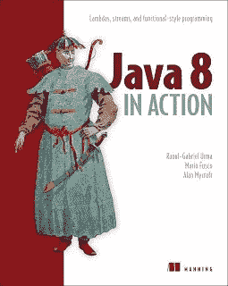](http://aax-us-east.amazon-adsystem.com/x/c/QiN3P8aEtvuspKUKKWJIl0QAAAFhEYQFlAEAAAFKAXxrN3E/https://assoc-redirect.amazon.com/g/r/http://www.amazon.com/Java-Action-Lambdas-functional-style-programming/dp/1617291994/ref=as_at?creativeASIN=1617291994&linkCode=w61&imprToken=iV-VWYtiFdkY3Gzdi0E9Gg&slotNum=1&tag=javamysqlanta-20)

# 2.干净的建筑

这是我几年前发现的一本好书。我是鲍勃大叔作品的忠实粉丝，已经阅读了[的《干净的代码](http://www.amazon.com/Clean-Code-Handbook-Software-Craftsmanship/dp/0132350882?tag=javamysqlanta-20)和[的《干净的编码者](https://www.amazon.com/Clean-Coder-Conduct-Professional-Programmers/dp/0137081073?tag=javamysqlanta-20)。这些书更多的是谈论如何让你的架构正确。这是一本独一无二的书，如果你想了解不同软件架构的优缺点，这是值得一读的书。

[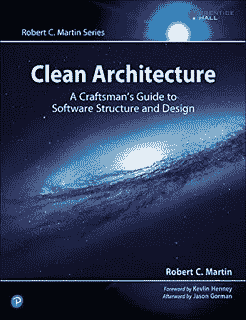](https://javarevisited.blogspot.com/2017/09/clean-architecture-by-uncle-bob-martin.html)

# 3.搜索算法

这是 2023 年又一本值得一读的好书。尽管就算法和数据结构的覆盖面而言，它非常短，但它所覆盖的内容非常有趣和有用。

它通过与现代例子相关联，赋予旧概念新的生命，比如脸书可能如何存储其用户。

顺便说一句，如果你的目标是学习数据结构和算法，那么我也建议你参加一个综合的在线课程，比如 [**数据结构和算法:使用 Java**](https://click.linksynergy.com/fs-bin/click?id=JVFxdTr9V80&subid=0&offerid=323058.1&type=10&tmpid=14538&RD_PARM1=https%3A%2F%2Fwww.udemy.com%2Fdata-structures-and-algorithms-deep-dive-using-java%2F) 在 [Udemy](https://medium.com/u/b32aa0132f1b?source=post_page-----7079eec265cb----------------------) 上深入学习

[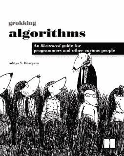](https://dev.to/javinpaul/grokking-algorithms-best-data-structure-and-algorithms-book-for-beginners-with-python-54cp)

总之是 2023 年想学算法的初学者必读的书之一。如果你需要更多的建议，在这里查看我的[列表](http://www.java67.com/2015/09/top-10-algorithm-books-every-programmer-read-learn.html)。

# 4.构建微服务:设计细粒度系统

大家都在说微服务，但到底是什么呢？微服务架构相对于整体架构的主要优势是什么？ [**这本书回答了所有这些问题**](http://aax-us-east.amazon-adsystem.com/x/c/QiN3P8aEtvuspKUKKWJIl0QAAAFhEYQFlAEAAAFKAXxrN3E/https://assoc-redirect.amazon.com/g/r/https://www.amazon.com/Building-Microservices-Designing-Fine-Grained-Systems/dp/1491950358/ref=as_at?creativeASIN=1491950358&linkCode=w61&imprToken=iV-VWYtiFdkY3Gzdi0E9Gg&slotNum=4&tag=javamysqlanta-20) **。我还没有读完这本书，所以我也打算在 2023 年读完它。**

[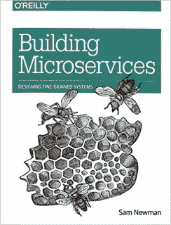](https://medium.com/javarevisited/top-5-courses-to-learn-microservices-in-java-and-spring-framework-e9fed1ba804d)

# 5.软技能

许多程序员忽略的一件事是[软技能](http://www.amazon.com/Soft-Skills-software-developers-manual/dp/1617292397?tag=javamysqlanta-20)，比如写邮件，关注职业发展，提升自己。这是一本来自约翰·桑梅兹的好书，如果你觉得你在职业生涯中停滞不前，或者想在 2023 年给它一个推动，这是你应该读的书。

[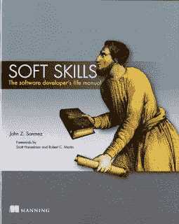](http://javarevisited.blogspot.sg/2017/12/5-career-development-and-soft-skill-books-for-programmers.html#axzz58AXV2r1A)

# 6.面向普通人的数据库设计

[关于数据库设计的最古老但最好的书之一](https://www.amazon.com/Database-Design-Mere-Mortals-Hands/dp/0201752840?tag=javamysqlanta-20)，我喜欢找一本仍然相关的好的旧书。如果您对学习数据库设计感兴趣或者想要改进您的数据库建模，这提供了一个很好的起点。如果你需要更多的推荐，请在这里查看我的数据库设计书籍完整列表。

如果你想把你的学习和在线课程结合起来，你也可以加入何塞·波尔蒂利亚的 SQL 训练营。

[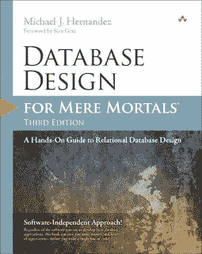](https://javarevisited.blogspot.com/2018/07/top-5-advanced-sql-books-for.html)

# 7.制作 Java Groovy

去年，我有机会接触了一点 Groovy，这是我为了学习 Groovy 而阅读的第一本书。如果你决定在 2023 年学习 Groovy，这本书从 Java 程序员的角度提供了一个很好的基础。它只给你足够的信息，让你跟上速度，而不会给你不必要的细节，你可能一开始就不明白。

[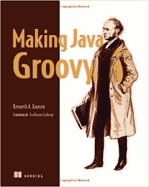](https://javarevisited.blogspot.com/2017/08/top-5-books-to-learn-groovy-for-java.html)

# 8.Groovy 在行动，第二版

[这是我去年在 Groovy 上看的第二本书](https://www.amazon.com/Groovy-Action-Covers-2-4/dp/1935182447/?tag=javamysqlanta-20)。尽管开始制作 Java Groovy 是一件好事，但它并不全面，一旦您学习了 Groovy 的基础知识并编写了几个 Groovy 脚本，您就需要更详细的信息。这就是这本书的震撼之处。如果你是 2023 学 Groovy 的，可以参考这本书。

[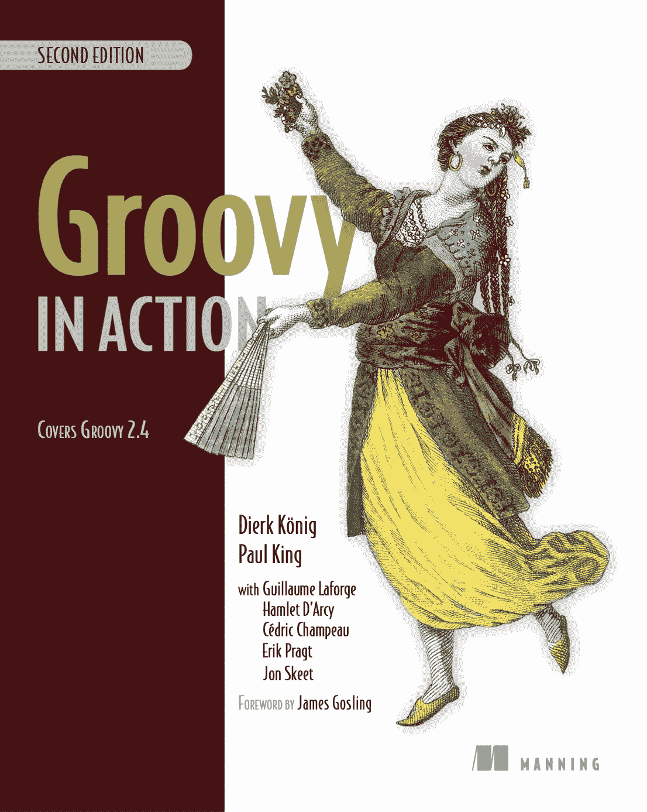](http://www.java67.com/2018/06/top-5-books-to-learn-grails-framework-Java-Groovy.html)

# 9.TCP/IP 图解

这是《T4》中我最不喜欢的一本书，但我仍然觉得它很有用。这本书我还没有看完，但是如果你必须深入研究 TCP/IP，这本书值得一读。

[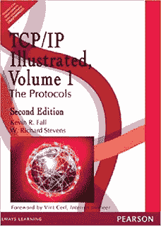](https://javarevisited.blogspot.com/2017/08/best-book-to-learn-tcpip-udp-and-networking-protocol.html)

# 10.UML 提取

去年，我不得不写几个 UML 图，这是我读的书来更新我关于 UML 的知识。如果你决定在 2023 年学习 UML，你也可以看看这本书。

[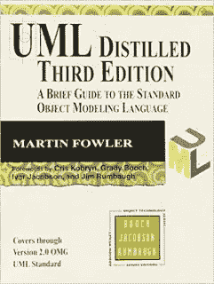](https://javarevisited.blogspot.com/2017/07/top-5-books-to-learn-uml-unified-modelling-language-java.html)

# 11.冬眠提示

这是去年最有用的 Java 书籍之一，由博客作者索本·让桑撰写。这本书提供了 70 个关于 Hibernate 的实用技巧。如果您使用 Hibernate，那么这些提示可以很好地填补您的知识空白。而如果你在 2023 年决定学习 Hibernate，你可以用这本书赋予你的知识一个新的维度。

顺便说一句，如果你喜欢在线课程，这里列出了一些[好的 Hibernate 和 JPA 课程](http://javarevisited.blogspot.sg/2018/01/top-5-hibernate-and-jpa-courses-for-java-programmers-learn-online.html)。

# 12.敏捷开发的艺术

我使用敏捷已经有一段时间了，但我仍然喜欢阅读关于敏捷的书籍来刷新我的知识，并学习一两个新的东西。[这本书被证明是一本关于敏捷的好书](https://www.amazon.com/Agile-Development-first-Text-Only/dp/B004SCFAC4/?tag=javamysqlanta-20)，即使是敏捷的普通用户也能从这本书中学到一二。

如果你喜欢课程，你可以看看这些[免费的敏捷和 Scrum 课程](http://javarevisited.blogspot.sg/2018/01/top-5-free-agile-courses-for-programmers.html)。

[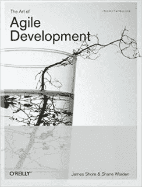](https://javarevisited.blogspot.com/2017/06/top-5-books-to-learn-agile-and-scrum-methodology.html)

# 13.基本 Scrum

几年前我就一直在扮演 Scrum Master 的角色，而[这是我为这个角色做准备而读的书](https://www.amazon.com/Essential-Scrum-Practical-Addison-Wesley-Signature/dp/0137043295/?tag=javamysqlanta-20)。Scrum 适用于小型的本地团队，但是当你需要远程管理分散在世界各地的大型团队时，就变得棘手了。

这本书提供了你召开 Scrum 会议所需的所有工具和指导，以及如何成为一名 Scrum 大师。如果你希望在 2023 年成为 Scrum 大师，这是你应该读的书，如果你喜欢课程，你可以看看这些免费的敏捷和 Scrum 课程。

# 14.Java 性能伴侣

我过去读过几本 Java 性能调优的书，比如[Java 性能权威指南](https://javarevisited.blogspot.com/2018/07/top-5-java-performance-tuning-books-for.html#axzz5QyVrOCeJ)，所以我没抱太大期望。我唯一的目标是了解 G1 的垃圾收集，这是我从这本书中学到的。如果你的重点是 2023 年的 Java 性能调优，这本书是一个很好的起点。

[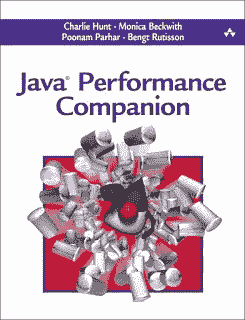](https://www.java67.com/2019/08/best-books-to-learn-java-virtual-machine-in-depth.html)

# 15.高性能 Java 持久性

这是@Vlad Mihalcea 的另一本关于 Hibernate 的伟大著作。如果你真的想在 2023 年提高你的冬眠知识，我建议你同时阅读[冬眠技巧](https://javarevisited.blogspot.com/2016/12/top-5-spring-and-hibernate-training-courses-java-jee-programmers.html#axzz56WXxxAC0)和这本书。

如果你愿意，Vlad 还为有经验的开发者提供了几个[**高性能 hibernate 培训课程**](https://vladmihalcea.teachable.com/?affcode=172599_kuoszt8s) 。

# 16.Scala 中的函数式编程

几年前，我尝试过使用 Scala，但是没有成功。我读了一两本书，但没有做足够的练习来真正学习 Scala。其中一个原因是我没有在我的任何项目中使用它，并且有更重要的事情需要关注。

无论如何，如果你决定在 2023 年专注于函数式编程和 Scala，[你可以看看这本书](https://www.amazon.com/Functional-Programming-Scala-Paul-Chiusano/dp/1617290653/?tag=javamysqlanta-20)。如果时间允许，我可能会在 2023 年再读一遍。

# 17.不耐烦的 Scala

这是我去年看的又一本关于 Scala 的书。我非常喜欢凯·s·霍斯特曼的作品，读过他的书，比如《核心 Java 第一部分和第二部分》和《Java SE 8》。

这是一本类似的侧重于 Scala 的书。如果你在 2023 年学习 Scala，这是一本好书，但是如果你喜欢在线课程，你也可以使用这些[免费课程来学习 Scala](https://javarevisited.blogspot.com/2019/01/5-free-scala-programming-courses-for-java-programmers-learn-online.html) 。

[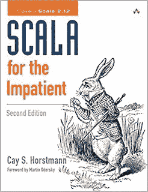](http://www.amazon.com/dp/0321774094/?tag=javamysqlanta-20)

# 18.头部优先 JavaScript

我以前说过，但是 JavaScript 现在是头号编程语言，如果你不知道 JavaScript，你就错过了很多。 [Head First JavaScript 是 web 开发工作和学习 Angular、React 和 jQuery 等框架的必读书籍](https://www.amazon.com/Head-First-JavaScript-Programming-Brain-Friendly/dp/144934013X?tag=javamysqlanta-20)。

如果你还没有学习 JavaScript，没有比 Head First JavaScript 更好的书了，但是如果你喜欢课程，你也可以使用这些[免费课程来学习 JavaScript](http://www.java67.com/2018/04/top-5-free-javascript-courses-to-learn.html) 。

[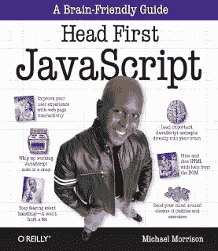](https://www.amazon.com/Head-First-JavaScript-Programming-Brain-Friendly/dp/144934013X?tag=javamysqlanta-20)

# 19.SQL 食谱

SQL 是我最喜欢的技术，我总是在寻找一本关于 SQL 的有趣的书。这是我去年发现的，我也很高兴与大家分享。

这是一本关于 SQL 的非常实用的书，教你很多关于在不同的数据库中使用 SQL 的技巧。

如果你想提高你的 SQL 技能，2023 年读这本书。你也可以利用这些[免费课程学习 SQL 查询](http://www.java67.com/2018/02/5-free-database-and-sql-query-courses-programmers.html)来进一步提高你的 SQL 知识。

[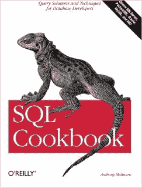](https://www.amazon.com/SQL-Cookbook-Solutions-Techniques-Developers/dp/0596009763?tag=javamysqlanta-20)

# 20.完整的软件开发人员职业指南

最后但同样重要的是，[这是一本适合每个软件开发人员的好书](https://www.amazon.com/Complete-Software-Developers-Career-Guide-ebook/dp/B073X6GNJ1?tag=javamysqlanta-20)。如果你对你的职业很认真，想在 2023 年掌控它，这是你应该读的书。[SimpleProgrammer.com](https://medium.com/u/56e8cba02b?source=post_page-----7079eec265cb----------------------)[的 John Sonmez](http://simpleprogrammer.com/) 在这本书里解释了很多实用的东西和我之前分享的软技能。

以上就是 2023 年**你能读的前 20 本书**。我读过更多，但我只列出这 20 个供你参考。如果你最近几年还有其他有趣的书在这个列表中，请随意推荐，我会把它们添加到这个列表中，为 Java 程序员创建一个真正的大型图书列表。

其他 **Java 和编程文章**你可能喜欢的
[2023 年 Java 和 Web 开发者应该学会的 10 件事](http://javarevisited.blogspot.sg/2017/12/10-things-java-programmers-should-learn.html#axzz53ENLS1RB)
[Java 开发者应该知道的 10 个测试工具](http://javarevisited.blogspot.sg/2018/01/10-unit-testing-and-integration-tools-for-java-programmers.html)
[5 个框架 Java 开发者应该学会的 2023 年](http://javarevisited.blogspot.sg/2018/04/top-5-java-frameworks-to-learn-in-2018_27.html)
[最后 Java 有 var 来声明局部变量](http://javarevisited.blogspot.sg/2018/03/finally-java-10-has-var-to-declare-local-variables.html)
[Java 开发人员在日常工作中使用的 10 个工具](http://javarevisited.blogspot.sg/2017/03/10-tools-used-by-java-programming-Developers.html#axzz55lrMRnNC)
[10 个数据结构和算法课程面试](https://hackernoon.com/10-data-structure-algorithms-and-programming-courses-to-crack-any-coding-interview-e1c50b30b927)
[2023 年成为更好的 Java 开发人员的 10 个技巧](https://javarevisited.blogspot.com/2018/05/10-tips-to-become-better-java-developer.html)
[2023 年 DevOps 路线图——成为 DevOps 工程师的指南](https://javarevisited.blogspot.com/2018/09/the-2018-devops-roadmap-your-guide-to-become-DevOps-Engineer.html)

感谢您阅读本文。如果你喜欢这些书，请与你的朋友和同事分享。如果您有任何反馈或建议，请留言。如果你愿意，你也可以在 Twitter 上关注[javarestived](https://twitter.com/javarevisited)。

如果你喜欢在线课程，这里列出了一些最好的 Java 课程，有免费的也有付费的，我已经在这篇文章中分享过了:

 [## 面向初学者的 10 大 Java 在线课程

### 如果你是计算机科学专业的毕业生，或者想学习 Java 并且正在寻找一些很棒的资源，比如…

medium.com](/javarevisited/top-5-java-online-courses-for-beginners-best-of-lot-1e1e240a758) 

而且，

 [## 我最喜欢的深入学习 Java 的免费课程

### 我的免费课程列表深入学习 Java 从核心 Java 到多线程到 JDBC 到合集，什么都有…

medium.com](/javarevisited/10-free-courses-to-learn-java-in-2019-22d1f33a3915)