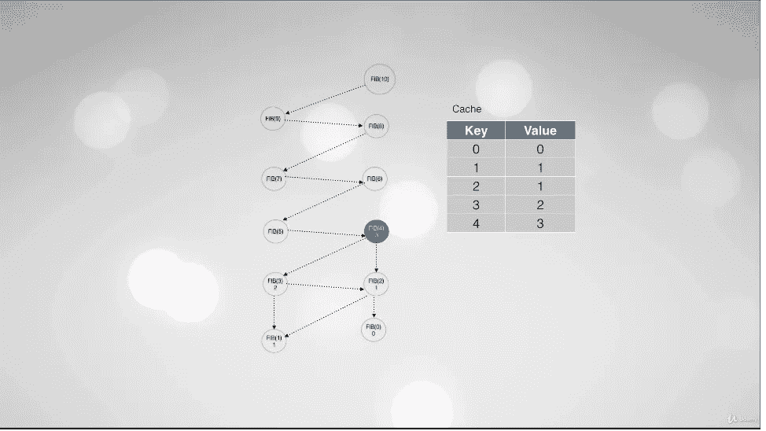
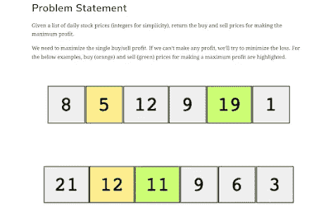
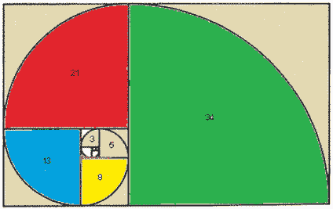
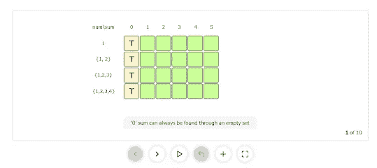

# 软件工程师 20 大动态编程面试问题

> 原文：<https://medium.com/javarevisited/20-dynamic-programming-interview-questions-with-solutions-2a144b1a1e07?source=collection_archive---------1----------------------->

## 准备编码面试？这里有 20 个动态编程问题来测试你的技能，好好准备。

大家好，如果你正在准备编码面试，那么有两个话题你必须特别注意，一个是系统设计，另一个是动态编程，这两个话题都很难掌握，但对技术面试来说非常重要。

过去，我曾分享过 [**最佳动态编程课程**](/javarevisited/6-best-dynamic-programming-courses-for-coding-interviews-14744060923c) 以及[最佳系统设计课程](/javarevisited/10-best-system-design-courses-for-coding-interviews-949fd029ce65)、[书籍](/javarevisited/8-best-system-design-and-software-design-books-for-programmers-be54cb313106)和[系统设计面试问题](https://faun.pub/top-30-system-design-interview-questions-and-problems-for-programmers-417e89eadd67)，在这篇文章中，我将分享面试实践中的最佳动态编程问题。你可以解决这些问题，不仅学习动态编程，而且掌握它。

**动态编程**对于程序员来说是最难掌握的概念之一，但同时，破解任何[编程工作面试](https://javarevisited.blogspot.com/2011/06/top-programming-interview-questions.html)也是非常重要的。

如今，在每次编码面试中，你都会发现至少有一个动态编程编码问题，这也是大多数程序员的困惑所在。

他们试图使用像**分治**这样的技术来解决问题，但最终失败了，因为除非你已经解决了相当数量的基于动态编程的编码问题，否则很难找到这类问题的解决方案。

这与 [**系统设计问题**](https://www.java67.com/2018/05/top-20-system-design-interview-questions-answers-programming.html) 非常相似，看起来很容易，但当你试图解决它们时，你经常会发现自己被卡住了，这就是为什么我建议你尽可能多的练习。

为了帮助你练习，我准备分享一些来自编码面试 *s* 的*常见问题* [*动态编程问题。您不仅可以利用这个问题来学习如何识别基于动态编程的编码问题，还可以学习如何在给定的时间内处理和解决这些问题。*](https://javarevisited.blogspot.com/2021/03/top-dynamic-programming-problems-for-coding-interviews.html)

我还发布了视频和链接，在那里你可以找到这些[动态编程编码问题](https://www.java67.com/2023/01/dynamic-programming-interview-questions.html)的解决方案，以防你被卡住。我也分享了一些有用的资源，比如在线课程和教程，来学习动态编程和更新你的知识。

如果有需要，我也可以在单独的文章中发布我对这些问题的解决方案，但这并不妨碍你练习。你应该现在就开始练习，为你的[编码面试](https://javarevisited.blogspot.com/2018/02/10-courses-to-prepare-for-programming-job-interviews.html)解决尽可能多的动态编程问题。

如果你有任何动态编程的问题应该在这个列表中，请随时提出建议，我会补充。我喜欢保持这个列表的更新，这样我们就有足够多的[动态编程问题来练习](https://www.java67.com/2023/01/dynamic-programming-interview-questions.html)，有各种难度级别，比如容易、中等和困难。

# 解决动态规划问题的 7 个步骤？

解决动态规划问题的关键是首先*识别*它们。这与我们之前解决的[二叉树问题](/javarevisited/20-binary-tree-algorithms-problems-from-coding-interviews-c5e5a384df30)和[基于链表的问题](https://javarevisited.blogspot.com/2017/07/top-10-linked-list-coding-questions-and.html)等递归问题非常相似。你首先要看整个问题是否可以分解成更小的问题。

例如在爬楼梯的问题中，你可以将 n 步问题分解成 1 步或 2 步问题。

一旦你能做到这一点，你就会看到，通过组合子问题的解决方案，是否能得到完整的解决方案，这是关键。如果这是真的，那么它最有可能是动态编程问题，你可以使用分治、[递归](https://javarevisited.blogspot.com/2012/12/recursion-in-java-with-example-programming.html)和记忆化来解决问题。

下面是解决动态规划(DP)基本做题的 7 个步骤

1.  通过将问题分解成子问题来识别问题
2.  识别问题变量。
3.  清楚地表达递归关系以应用递归。
4.  确定基本案例。
5.  决定你想要迭代地还是递归地实现它。
6.  添加[记忆](https://javarevisited.blogspot.com/2020/05/fibonacci-series-in-java-8-with.html)。
7.  确定时间复杂度。

您还可以使用快速方法来解决动态编程问题，这是解决任何动态编程问题所需的 4 个步骤的缩写:

*   找到第一个解决方案
*   分析第一个解决方案
*   识别子问题
*   扭转解决方案

您可以使用这些技术来识别和解决动态编程问题。我还强烈推荐 Udemy 上的 [**掌握动态编程的艺术**](https://click.linksynergy.com/deeplink?id=JVFxdTr9V80&mid=39197&murl=https%3A%2F%2Fwww.udemy.com%2Fcourse%2Fmaster-the-art-of-dynamic-programming%2F) 课程，尝试几个引导性的问题来理解这些步骤是如何结合在一起的，特别是如果你从未解决过动态编程问题的话。

如果你需要一本书，我强烈推荐 Aditya Bhargava 的《Grokking Algorithms》[一书，该书也详细解释了背包问题，并教你如何解决动态编程问题。](https://www.amazon.com/Grokking-Algorithms-illustrated-programmers-curious/dp/1617292230?tag=javamysqlanta-20)

# 编程和技术面试的 20 个动态编程编码问题

为了不浪费您的时间，这里列出了采访中最流行和最常被问到的基于动态编程的编码问题。

他们不仅能很好地练习这一高难度的技术，还能给你一个机会来测试你解决问题的能力。

> 如果你能在没有任何帮助的情况下解决这 10 个问题中的 5 个，你就处于尝试编码面试的好位置。

## 1.爬楼梯的问题

这是最流行的编码问题之一，可以使用动态编程技术来解决。在这个问题中，你正在爬楼梯。需要 n 步才能到达顶端。每次你可以爬 1 或 2 级台阶。问题是，你有多少种不同的方式可以爬到顶端？

注:给定 n 会是正整数。

例 1:

输入:2
输出:2
解释:登顶有两种方法。
1。1 步+ 1 步
2。两步

例 2:

输入:3
输出:3
解释:登顶有三条路。
1。1 步+ 1 步+ 1 步
2。1 步+ 2 步
3。2 步+ 1 步。

如果你遇到了困难，你也可以观看这个视频来获得一些想法，如果你需要一个课程，Andrei Negaoie 的 [**掌握编码面试:大技术(FAANG)面试**](https://academy.zerotomastery.io/a/aff_rml6679s/external?affcode=441520_zytgk2dn) 是最好的课程，在那里你不仅可以找到这个问题的解决方案，还可以找到许多其他类似的问题。

## 2.背包问题[已解决]

这是另一个常见的基于动态编程的编码问题，也是一个可以解决许多此类问题的模式。在这类问题中，你将得到“N”个物品的重量和利润，将这些物品放入一个容量为“C”的背包中。你的目标:从背包中的物品获得最大利润。每个项目只能选择一次。

这个优化问题的一个常见例子是，你应该把哪些水果放在背包里才能获得最大利润。以下是每种水果的重量和利润:

物品:{苹果，橘子，香蕉，甜瓜}
重量:{ 2，3，1，4 }
利润:{ 4，5，3，7 }
背包容量:5

让我们试着把不同的水果组合放进背包，这样它们的总重量不会超过 5。

苹果+橘子(总重量 5) => 9 利润
苹果+香蕉(总重量 3) = > 7 利润
橘子+香蕉(总重量 4) = > 8 利润
香蕉+甜瓜(总重量 5) = > 10 利润

这表明香蕉+甜瓜是最佳组合，因为它给了我们最大的利润，并且总重量不超过容量。你也可以从 Educative 上的动态编程课程 中找到这个问题的详细解决方案。

## 3.编辑距离问题

这是比较容易的动态规划问题之一。在这个问题中，将给出两个单词 word1 和 word2，找出将 word1 转换为 word2 所需的最少运算次数。

您可以对一个单词进行以下 3 种操作:

*   插入一个字符
*   删除一个字符
*   替换一个字符

例 1:
输入:word1 = "horse "，word2 = "ros"
输出:3
解释:
`horse -> rorse (replace ‘h’ with ‘r’)
rorse -> rose (remove ‘r’)
rose -> ros (remove ‘e’)`

如果你被困住了，可以看看 YouTube 上的这个教程来摆脱困境，找到一步一步的解决方案:

## 4.最长回文子序列问题

这是另一个常见的动态编程问题和模式。在这种类型的 DP 问题中，你将得到一个序列，找出它的最长回文子序列(或 LPS)的长度。在回文子序列中，元素向前和向后读是一样的。

例 1:
输入:
`“bbbab”`

输出:
4

说明:LPS 是`“bbbb”.`

如果你需要解决方案，可以在 YouTube 上观看这个视频教程，它是免费的，可以为这个动态编程问题提供一步一步的解决方案。

## 4.买卖股票的最佳时机问题

这是一个困难的动态规划问题，需要一些经验来解决。在这个问题中，您将得到一个数组，其中第 I 个元素是给定股票在第 I 天的价格。

如果你只被允许完成最多一笔交易(即买一股卖一股)，设计一个算法来找出最大利润。

请注意，你不能在买入股票之前卖出。

例 1:
输入:[7，1，5，3，6，4]
输出:5
解释:第 2 天买入(价格= 1)，第 5 天卖出(价格= 6)，利润= 6–1 = 5。
不是 7–1 = 6，因为卖价需要大于买价。

你可以自己尝试这个问题，但是如果你遇到了困难，你也可以 [**在这里查看关于教育性的**](https://www.educative.io/m/find-maximum-single-sell-profit?affiliate_id=5073518643380224) 解决方案。

## 5.斐波那契问题[ [解](https://www.java67.com/2019/03/nth-fibonacci-number-in-java-coding.html)

这是最简单的动态编程问题之一，你们中的许多人已经解决了它，甚至不知道自己正在使用动态编程。这也是 DP 最常见的例子，许多教师使用斐波那契数来教授动态编程。在这个问题中，你将被要求写一个函数来计算第 n 个斐波那契数。

斐波那契数列是一系列数字，其中每个数字都是前面两个数字之和。前几个斐波纳契数列是 0、1、2、3、5、8 等等。

我们可以把斐波那契数定义为:

`Fib(n) = Fib(n-1) + Fib(n-2) for n > 1`

给定:Fib(0) = 0，Fib(1) = 1

你也可以看我的关于如何用 Java[计算第 n 个斐波那契数的解决方案](https://www.java67.com/2019/03/nth-fibonacci-number-in-java-coding.html)了解更多如何解决这个问题。

## 6.硬币兑换问题

给你不同面额的硬币和一个总金额。写一个函数来计算你需要的最少的硬币数。如果该金额不能由任何硬币组合而成，则返回-1。

例 1:
输入:硬币= [1，2，5]，金额= 11
输出:3
解释:11 = 5 + 5 + 1

如果你遇到困难，这里有帮助指南

## 7.最长公共子串

给定两个字符串 1 和 s2，找出两个字符串中最长的公共子字符串的长度。

例一:

输入:s1 = "abdca"
s2 = "cbda "

输出:2

说明:最长的公共子串是“bd”。

下面是最长公共子串问题的解决方案:

## 8.最长公共子序列

给定两个字符串 1 和 s2，找出两个字符串中最长的公共子序列的长度。

例 1:
输入:s1 = `“abdca”`
s2 = `“cbda”`

输出:3
说明:最长的子串是“bda”。

而且，如果你遇到了困难，你可以随时在 YouTube 上观看这个视频，了解如何解决这个*动态编程问题*:

## 9.相等子集和划分问题

这是与*背包问题*非常相似的另一个流行的动态规划问题。如果你知道如何解决背包问题，那么你也可以解决这个问题。

在他的问题中，给你一组正数，看看我们能否把它分成两个子集，使得两个子集的元素之和相等。

示例 1:

输入:{1，2，3，4}

输出:真

说明:给定的集合可以分成两个和相等的子集:{1，4} & {2，3}

示例 2:

输入:{1，1，3，4，7}

输出:真

说明:给定的集合可以分成两个和相等的子集:{1，3，4} & {1，7}

示例 3:

输入:{2，3，4，6}

输出:假

解释:给定的集合不能被分成两个和相等的子集。

你可以试着自己解决这个问题，但是如果你卡住了，你也可以 [**点击这里**](https://www.educative.io/courses/grokking-dynamic-programming-patterns-for-coding-interviews/3jEPRo5PDvx?affiliate_id=5073518643380224) 查看解决方案。这个免费课程是他们的动态编程课程的一部分，详细解释了这个问题，并告诉你如何在你的浏览器中解决这个问题。

## 10.连续子阵列和

这是来自访谈的另一个流行的基于动态编程的编码问题。在这个问题中，你将得到一个非负数的列表和一个目标整数 k，写一个函数来检查数组是否有一个大小至少为 2 的连续子数组，其总和为 k 的倍数，也就是说，总和为 n*k，其中 n 也是一个整数。

例 1:
输入:[23，2，4，6，7]，k=6

输出:真
解释:因为【2，4】是一个大小为 2 的连续子数组，求和为 6。

如果你被卡住了，你可以看这个视频来获得如何解决这个 DP 问题的想法，但是我建议你先自己试试

## 10 多道动态规划面试练习题

**这里还有 10 个动态编程面试问题你可以练习**

*   断词问题
*   切割绳索时的最大乘积
*   骰子投掷问题
*   盒子堆叠
*   鸡蛋掉落拼图
*   布尔括号问题
*   最短公共超序列
*   矩阵链乘法
*   划分问题
*   独特的路径

以上是采访中的一些常见的动态编程问题。顺便说一下，这只是你在编码面试中可能遇到的动态编程概念和问题的一个小例子。

解决这些问题将使你对如何在编码面试中识别动态编程问题以及如何在有限的时间内解决它们有足够的了解。

这些问题还涵盖了所有基本的动态编程模式，如背包问题，它可以用来解决大量的动态规划问题。

一些**对编码面试有用的资源**:

*   [准备技术编程/编码工作面试的 10 本书](http://www.java67.com/2017/06/10-books-to-prepare-technical-coding-job-interviews.html)
*   [为编程工作面试做准备的 10 门课程](http://javarevisited.blogspot.sg/2018/02/10-courses-to-prepare-for-programming-job-interviews.html)
*   [每个程序员都应该读的 10 本算法书](http://www.java67.com/2015/09/top-10-algorithm-books-every-programmer-read-learn.html)
*   [面向 Java 开发人员的五大数据结构和算法书籍](http://javarevisited.blogspot.sg/2016/05/5-free-data-structure-and-algorithm-books-in-java.html#axzz4uXETWjmV)
*   [前 5 名免费数据结构与算法课程](https://javarevisited.blogspot.com/2018/01/top-5-free-data-structure-and-algorithm-courses-java--c-programmers.html)
*   [20+字符串算法面试题](https://hackernoon.com/20-string-coding-interview-questions-for-programmers-6b6735b6d31c)
*   [回顾一下这些面向程序员的 Java 面试问题](https://www.freecodecamp.org/news/review-these-50-questions-to-crack-your-java-programming-interview-69d03d746b7f/)
*   [20 多个基于数组的面试问题](/javarevisited/20-array-coding-problems-and-questions-from-programming-interviews-869b475b9121)
*   [2021 年初级开发者应参加的 10 门算法课程](http://www.java67.com/2019/02/top-10-free-algorithms-and-data.html)
*   [学习数据结构和算法的 7 门最佳课程](/javarevisited/7-best-courses-to-learn-data-structure-and-algorithms-d5379ae2588)
*   [程序员 25 个软件设计面试问题](/javarevisited/25-software-design-interview-questions-to-crack-any-programming-and-technical-interviews-4b8237942db0)
*   [30 大面向对象编程问题](http://www.java67.com/2015/12/top-30-oops-concept-interview-questions-answers-java.html)
*   [学习面试动态编程的前 5 门课程](https://javarevisited.blogspot.com/2019/12/top-5-courses-to-learn-dynamic-programming-for-interivews.html)
*   学习面试系统设计的 10 门最佳课程

感谢您阅读本文。如果你喜欢这些*动态规划问题和面试问题*，那么请与你的朋友和同事分享。如果您有任何问题或反馈，请留言。

如果你需要更多的练习，包括每种模式的几十个问题和解决方案，请查看 [**探索动态编程模式**](https://www.educative.io/collection/5668639101419520/5633779737559040?affiliate_id=5073518643380224) 的教育性编码访谈。这是一个非常好的基于文本的交互式课程，可以帮助你提高动态编程技能。

作为一个平台，教育性也是编码面试的一个很好的资源，你可以 [**获得他们所有的课程，每月只需 14.9 美元**](https://www.educative.io/subscription?affiliate_id=5073518643380224) 。我向所有准备编程工作面试的人强烈推荐这一点。

 [## 探索编码面试的动态编程模式——交互式学习

### 事实是，动态编程(DP)问题可能是编码面试中最令人生畏的问题。即使当…

www.educative.io](https://www.educative.io/collection/5668639101419520/5633779737559040?affiliate_id=5073518643380224)