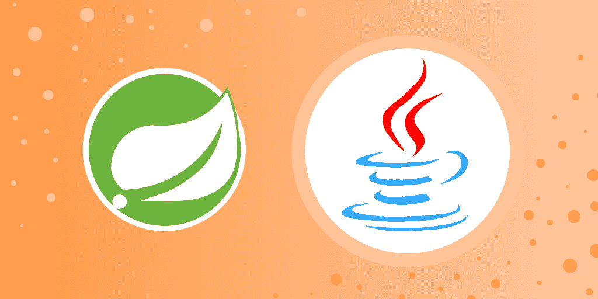
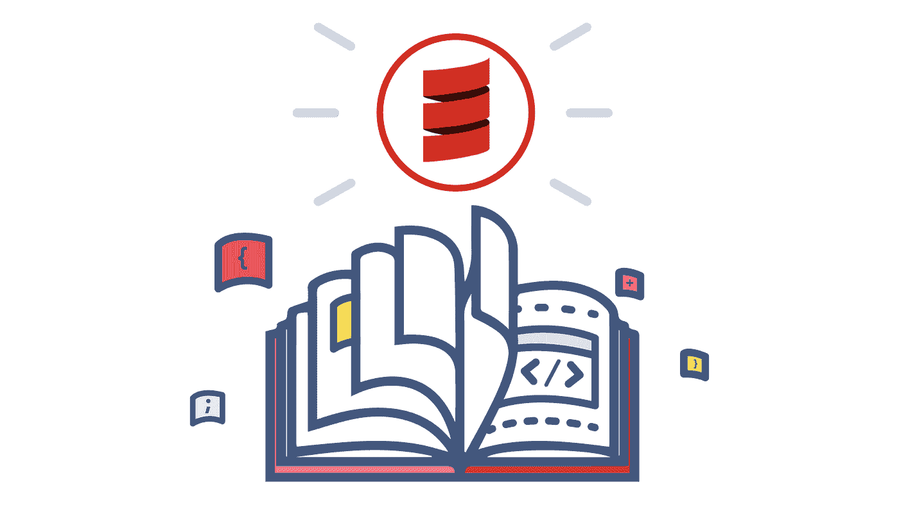
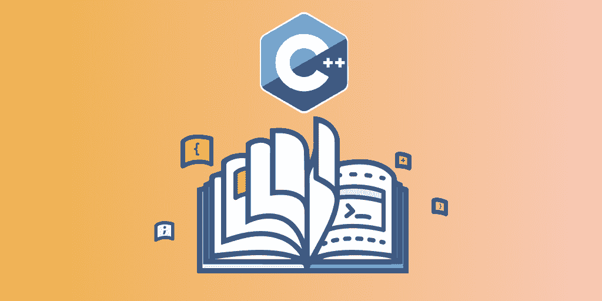
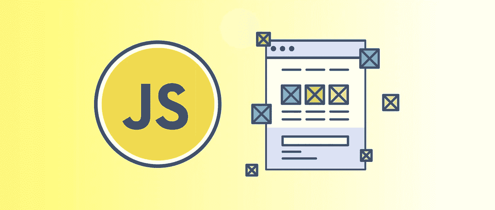
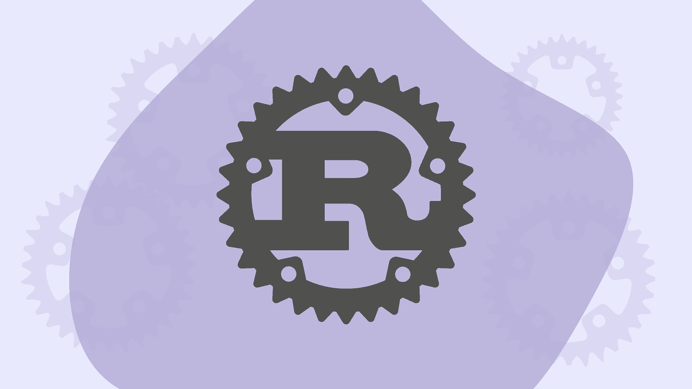

# 2023 年学习编程和软件开发的 20 个最佳免费教育课程

> 原文：<https://medium.com/javarevisited/20-free-educative-courses-for-programmers-and-software-engineers-a7135028350c?source=collection_archive---------0----------------------->

## 我最喜欢的免费的基于文本的编程和软件开发课程

image_credit —教育性

你好，如果你正在寻找免费的编程资源来学习有用的技能，如 Python、Java、C、JavaScript、Ruby、Rust、Dart、Scala、R、Perl、算法，甚至是准备编程工作面试的资源，那么你来对地方了。

过去，我曾分享过 Udemy 、 [**Coursera**](/javarevisited/18-coursera-courses-you-can-join-in-2020-to-learn-from-the-worlds-top-tech-companies-google-74af46967d1e?source=collection_home---4------0-----------------------) 和 [**Pluralsight**](/javarevisited/top-10-pluralsight-courses-to-learn-programming-and-software-development-during-covid-19-stay-at-30b7d8a4f88f) 的最佳免费课程，而在这篇文章中，我将分享 Educative.io 的最佳免费课程

如果你不知道， [**Educative**](https://www.educative.io/subscription?affiliate_id=5073518643380224) 是一个全新的学习平台，专注于基于文本的互动学习。与 Udemy 和 Pluralsight 不同，他们的课程是基于文本和互动的，这意味着更快和更积极的学习。

Educative 最重要的好处是，它们消除了设置自己的开发环境的痛苦，这对于初学者来说通常是最困难的任务。

许多人在设置他们的开发环境时会因为错误而感到沮丧和分心，但是你不需要再忍受了，你可以使用 Eductaive 的尖端技术在你的浏览器上运行你的代码。

Educative 也有一些最好的编码面试课程，如 [**探索系统设计面试**](https://www.educative.io/collection/5668639101419520/5649050225344512?affiliate_id=5073518643380224) 和 [**探索编码面试模式**](https://www.educative.io/collection/5668639101419520/5671464854355968?affiliate_id=5073518643380224) 学习编码面试系统设计的两个基本技能和破解编码问题的能力。

他们也有负担得起的价格，并允许访问他们所有的 150 多个课程和未来的课程，只需**每月 14.9 美元(50%的折扣)。我向相信主动学习或准备编码面试的程序员和开发人员强烈推荐这一点。**

** [## 教育无限:保持领先

### 我们听到了您的反馈。你现在只需支付一次费用，就可以获得 Educative 上的所有课程。

www.educative.io](https://www.educative.io/subscription?affiliate_id=5073518643380224) 

# 2023 年 20 个最佳免费教育在线编程和软件开发课程

在不浪费你更多时间的情况下，这里有一个 Educative 提供的最好的免费编程和开发课程列表。该列表包括免费的基于文本的互动课程，以学习按需技能，如 [Python](/swlh/5-free-python-courses-for-beginners-to-learn-online-e1ca90687caf) 、 [Java](/javarevisited/10-free-courses-to-learn-java-in-2019-22d1f33a3915?source=collection_home---4------8-----------------------) 、 [C](/javarevisited/10-best-c-programming-courses-for-beginners-2c2c1f6bcb12) 、 [JavaScript](/javarevisited/10-best-online-courses-to-learn-javascript-in-2020-af5ed0801645) 、 [Ruby](/javarevisited/top-5-free-courses-to-learn-ruby-and-rails-for-beginners-best-of-lot-e149fe03c964) 、 [Rust](/javarevisited/7-best-rust-programming-courses-and-books-for-beginners-in-2021-2ed2311af46c) 、 [Dart](/javarevisited/6-best-dart-programming-courses-for-beginners-to-learn-in-2021-2-are-free-24dc56f5ac14?source=extreme_sidebar---------0-2----------------------) 、 [Scala](/javarevisited/10-best-scala-and-functional-programming-online-courses-for-beginners-b6461b27bf) 、 [R](/javarevisited/10-best-r-programming-courses-for-data-science-and-statistics-8f84ebec4974) 、Perl 和[算法](/javarevisited/7-free-books-to-learn-data-structure-and-algorithms-in-java-346b2d70db10?source=---------7------------------)。

如果你喜欢主动学习，那么你会喜欢这些课程，如果你喜欢，不要忘记与你的朋友和同事分享这篇文章，他们也需要高质量的免费编程和软件开发资源。

## 1.[摸索行为面试](https://www.educative.io/courses/grokking-the-behavioral-interview?affiliate_id=5073518643380224)【免费】

这是 Educative 提供的最好的免费课程之一，它将教你如何在行为面试中表现出色。你可能会想，“有可能为行为面试做准备吗？”简短的回答是:是的。是的，它是。

即使你已经对谈论自己和自己成就的能力非常自信，你也可以从练习和提醒自己一些更常见的陷阱中获益良多。

在这个免费的教育课程中，你将学会如何有效地准备和回答行为面试问题。

以下是您将在本课程中学到的内容:

1.  如何使用著名的明星技巧来设计你的答案
2.  围绕行为面试问题的常见模式、神话和真相
3.  礼仪的最佳实践，无论是面对面还是通过电话

当你完成本课程时，你将知道如何准备和回答任何出现在你面前的行为问题。别忘了练习。:)

**这是加入这个免费课程的链接**——[寻找行为面试](https://www.educative.io/courses/grokking-the-behavioral-interview?affiliate_id=5073518643380224)

**

## **2.[从零开始学 Java】【免费】](https://www.educative.io/courses/learn-java-from-scratch?affiliate_id=5073518643380224)**

**这是 2023 年学习 Java 编程语言最好的免费、基于文本的互动课程之一。**

**在本课程中，您将从一个简单的 hello world 程序开始，继续学习 Java 中的常见概念，如条件语句、循环语句、数学和逻辑，然后学习更高级的概念，如继承、泛型和数组列表等。**

**学完本课程后，你将成为一名中级 Java 开发人员，准备好承担自己的项目。**

****这里是加入这个免费课程的链接** — [从零开始学习 Java】](https://www.educative.io/courses/learn-java-from-scratch?affiliate_id=5073518643380224)**

****

## **3.[从零开始学习 Python 3](https://www.educative.io/courses/learn-python-from-scratch?affiliate_id=5073518643380224)【免费】**

**Python 是目前世界上最流行的编程语言，广泛用于 web 开发、数据科学、机器学习、Web 报废和自动化。**

**如果你想在 2023 年[学习 Python](/javarevisited/10-free-python-tutorials-and-courses-from-google-microsoft-and-coursera-for-beginners-96b9ad20b4e6)并寻找一个免费的互动在线课程，那么这个教育课程是一个很好的开始。**

**本课程将首先教你基本的构建模块，然后再学习更高级的概念，如函数和循环。有趣的测验和编码挑战将伴随你一路走来，以帮助强化课程中涵盖的所有概念。**

**当您完成这个免费的 Python 3 课程时，您将拥有在 Python 3 中创建自己的基本应用程序所需的技能**

****这里是加入这个免费课程的链接**——[从头开始学习 Python 3](https://www.educative.io/courses/learn-python-from-scratch?affiliate_id=5073518643380224)**

****

## **4.[学习飞镖:舞动第一步](https://www.educative.io/courses/learn-dart-first-step-to-flutter?affiliate_id=5073518643380224)【免费课程】**

**如果你想学习 Dart 编程语言，开始使用 Flutter 进行应用程序开发，并寻找一个免费的交互式课程，那么你会喜欢这个课程。**

**Dart 是一种干净、简单、基于类的面向对象语言，比 JavaScript 有更多的结构，并且有 Google 的支持。这类似于 JavaScript，也就是说如果你懂 JavaScript，你就可以很容易地选择 Dart 编程语言。**

**但是，关于 Dart 的对话不能不提 [Flutter](/javarevisited/my-favorite-flutter-and-dart-programming-courses-for-beginners-9e8355710d78) 。Flutter 是谷歌的移动 UI 框架，用于在 iOS 和 Android 上制作高质量的原生界面。**

**Flutter 应用程序是使用 Dart 编程语言编写的，这使得 Dart 成为开发人员社区喜爱的语言。在开始使用 Flutter 开发应用程序之前，您需要学习 Dart。**

**本课程将帮助您学习 Dart 的基础知识，并帮助您开始学习 Flutter。**

****这里是加入这个免费课程的链接**——[学习飞镖:舞动的第一步](https://www.educative.io/courses/learn-dart-first-step-to-flutter?affiliate_id=5073518643380224)**

****

## **5.[从零开始学习 Scala】【免费课程】](https://www.educative.io/courses/learn-scala-from-scratch?affiliate_id=5073518643380224)**

**如果你想在 2023 年学习 Scala，并寻找一个免费的在线课程，那么你会喜欢 Educative 的这个交互式、基于文本的 Scala 课程。**

**Scala 是目前世界上最受欢迎的编程语言之一——不仅在开发人员中，在 Twitter 和 LinkedIn 等热门科技公司中也是如此。**

**Scala 代表可伸缩语言，它为你提供了简单有效地构建可伸缩程序的工具。它是一种静态类型的高级语言，将[函数式编程](/javarevisited/10-best-scala-and-functional-programming-online-courses-for-beginners-b6461b27bf)和[面向对象编程](/javarevisited/my-favorite-courses-to-learn-object-oriented-programming-and-design-in-2019-197bab351733?source=---------103------------------)结合到一个灵活的包中。**

**本课程将帮助你保持领先地位，制作出色的、可扩展的应用程序，并学习一门令人垂涎的新编程语言。这门课程最大的好处是，你可以在浏览器中练习 Scala 编码，而无需下载或安装 Scala 编译器。**

****这里是加入这个免费课程的链接**——[从头开始学习 Scala】](https://www.educative.io/courses/learn-scala-from-scratch?affiliate_id=5073518643380224)**

****

## **6.[从零开始学习 Perl】【免费课程】](https://www.educative.io/courses/learn-perl-from-scratch?affiliate_id=5073518643380224)**

**如果你想在 2023 年学习 Perl 编写脚本，这个免费的教育课程是一个很好的开始。您可以直接在浏览器中编写 Perl 脚本并立即执行它们，而无需下载或安装 Perl。**

**Perl 是世界上最流行的文本处理语言之一。它允许您为各种应用程序创建极其高效的文本解析器。**

**这个免费的 Perl 课程将帮助您快速掌握 Perl，从循环、字符串和数组等基本概念开始。**

**您将逐步学习更复杂的主题，如数据结构和包。不需要背景知识。任何愿意理解 Perl 的原理和语法以便将来使用它的人都会发现这门课程很有用**

****这里是加入这个免费课程的链接**——[从头开始学习 Perl](https://www.educative.io/courses/learn-perl-from-scratch?affiliate_id=5073518643380224)**

****

## **7.[从零开始学 R](https://www.educative.io/courses/learn-r-from-scratch?affiliate_id=5073518643380224)【免费课程】**

**如果你想学习统计学数据科学的 R，并寻找一个真正免费的在线课程，那么你会喜欢 Educative 的这个免费 R 编程课程。它是交互式的，基于文本的，更重要的是完全免费。**

**r 可能是最广为人知的数据分析语言。由于其强大的统计功能、出色的绘图能力和通过包的可扩展性，它已经被使用了很多年。**

**这个免费的互动课程将让你快速上手，并且假设你没有 r 语言的基础知识。你将从最基础的开始，逐步学习像异常处理这样的高级概念。**

**完成这个免费的 R 编程课程后，你将能够自己用 R 编写详细、有用的代码。**

****这里是加入这个免费课程的链接**——[从零开始学习 R](https://www.educative.io/courses/learn-r-from-scratch?affiliate_id=5073518643380224)**

****

## **8.[从零开始学 PHP](https://www.educative.io/courses/learn-php-from-scratch?affiliate_id=5073518643380224)【免费互动课程】**

**如果你想在 2023 年学习 PHP，并寻找一个免费的在线课程，那么这是最适合你的课程。这门高度互动的课程向你介绍 PHP 的基本编程概念，PHP 是世界上最流行的语言之一。**

**这个[免费的 PHP 课程](/javarevisited/top-10-free-courses-to-learn-php-and-mysql-for-web-development-e96e69982675?source=---------34------------------)从一个简单的 Hello world 程序开始，继续涵盖 PHP 中的常见概念，如条件语句、循环语句和逻辑。**

**然后，它反映了函数和数组的概念，以及它们赋予程序员编写更好代码的能力。最后，为了教授 PHP 中的高级概念，如类、继承和异常处理，本文进行了更深入的探讨。**

**完成这门免费的 PHP 课程后，你将会很好地掌握 PHP 的基础知识，并准备好学习高级概念**

****这里是加入这个免费课程的链接**——[从头开始学习 PHP](https://www.educative.io/courses/learn-php-from-scratch?affiliate_id=5073518643380224)**

****

## **9.[算法的可视化介绍](https://www.educative.io/collection/10370001/760001?authorName=Educative&affiliate_id=5073518643380224)【免费互动课程】**

**如果你在理解基本的计算机科学算法方面有困难，并且你正在寻找学习算法的最好的免费资源，那么这个免费的教育课程对你来说是完美的。**

**在这门互动课程中，您将通过文章、可视化、测验和[编码挑战](/javarevisited/20-array-coding-problems-and-questions-from-programming-interviews-869b475b9121)的组合，学习计算机科学算法入门，包括搜索、排序、递归和图论。用 Java、Python、C++或 Javascript 实现挑战。**

** [## 无算法交互式课程的可视化介绍

### 学习介绍性的计算机科学算法，包括搜索，排序，递归，并通过图论…

www.educative.io](https://www.educative.io/collection/10370001/760001?authorName=Educative&affiliate_id=5073518643380224)** 

## **10.[Fahim ul Haq《从零开始学 C》](https://www.educative.io/courses/learn-c-from-scratch?affiliate_id=5073518643380224)【免费互动课程】**

**c 语言是计算机科学史上最古老和最流行的编程语言之一。它是所有主流编程语言如 [C++](/javarevisited/top-10-courses-to-learn-c-for-beginners-best-and-free-4afc262a544e) 和 Java 诞生的地方。**

**它允许您直接与内存和低级计算机操作进行交互，从而增强您的编程技能并加深您的理解**

**如果你想在 2023 年学习 C 编程，并寻找一个免费的在线课程，那么这个免费的互动课程非常适合你。这门免费的 C 语言课程以全面而简洁的方式概述了数据类型、控制流、函数、输入/输出、内存、编译、调试和其他高级主题。**

**这门全面而详细的课程将向你介绍 C 语言的所有基本和高级编程概念。此外，它还解决了 c 语言中的内存、调试和并行编程问题。**

****这里是加入这个免费课程的链接** — [从零开始学习 C 语言，作者是法希姆·哈克](https://www.educative.io/courses/learn-c-from-scratch?affiliate_id=5073518643380224)**

****

## **11.[JavaScript 入门:第一步](https://www.educative.io/courses/introduction-to-javascript-first-steps?affiliate_id=5073518643380224)【免费互动课程】**

**如果你想在 2023 年学习 JavaScript，并寻找一个免费的在线课程，那么 Educative 的这个基于文本的交互式 JavaScript 课程是一个不错的起点。**

**这是给完全初学者的 JavaScript 介绍。它将提供语言的基础。主题包括变量、运算符、函数、数组、对象和循环。**

**学习完这个免费的 JavaScript 课程后，您应该准备好通过高级课程或其他资源进一步学习。**

**本课程最大的好处是，本课程不需要安装。可以直接从课程中查看和运行代码。**

****这里是加入这个免费课程的链接—**[JavaScript 简介:第一步](https://www.educative.io/courses/introduction-to-javascript-first-steps?affiliate_id=5073518643380224)**

****

## **12.[从零开始学铁锈](https://www.educative.io/courses/learn-rust-from-scratch?affiliate_id=5073518643380224)【免费文字课程】**

**Rust 是最受欢迎的编程语言之一，它在 StackOverFlow 的年度调查中多次被评为最受欢迎的编程语言。**

**它正迅速成为系统和嵌入式程序员中最受欢迎的语言之一，对 Rust 开发人员的需求也在大幅增长。**

**就性能、可靠性和生产力而言，Rust 也是一种非常强大的语言，尤其是与 [C++](https://becominghuman.ai/10-best-c-courses-for-beginners-and-experienced-developers-fd2401c07f50) 相比。**

**如果你想在 2023 年**学习 Rust**并寻找一个免费的互动课程，那么在 Educative 上从零开始学习 Rust 是最好的资源。**

**在这个免费的 Rust 编程课程中，您将从一个简单的“Hello world”程序开始学习 Rust，并继续学习常见的概念，如数组、字符串、向量、枚举、结构、特征、泛型、函数和逻辑。**

**最后，它深入到更高级的概念，如生存期和内存管理。完成本课程后，您将很好地掌握 Rust 的基础知识，并准备继续学习更高级的概念**

****这里是加入这个免费课程的链接—** [从零开始学铁锈](https://www.educative.io/courses/learn-rust-from-scratch?affiliate_id=5073518643380224)**

****

## **13.[从零开始学习 Ruby](https://www.educative.io/courses/learn-ruby-from-scratch?affiliate_id=5073518643380224)【免费文本课程】**

**Ruby 是最受欢迎的编程语言之一，对于初学者来说也很容易学习。Ruby 是一种智能的、易于使用的、功能性的、面向对象的编程语言，它是 Perl 的脚本能力、Pythonic 能力等等的奇妙组合！**

**正如 [Ruby](/javarevisited/10-best-ruby-on-rails-courses-for-beginners-dca4d66e9f7b) 的创造者 Matsumoto 所暗示的:“我希望看到 Ruby 帮助世界上的每一个程序员变得高效，并且享受编程，并且快乐。这是 Ruby 语言的主要目的。”**

**如果你想在 2023 年学习 Ruby 编程语言，并寻找免费的在线资源，那么 Educative 的“从头开始学习 Ruby”课程是一个很好的资源。**

**这个免费的 Ruby 课程将为您提供大量交互式插图、练习以及变量、内置类、对象、条件、块等不可或缺的主题的支持，帮助您进行实际操作！**

****这里是加入这个免费课程的链接—** [从零开始学习 Ruby】](https://www.educative.io/courses/learn-ruby-from-scratch?affiliate_id=5073518643380224)**

****

## **14.[了解 Flexbox:你需要知道的一切](https://www.educative.io/courses/understanding-flexbox-everything-you-need-to-know?affiliate_id=5073518643380224)[免费]**

**如果您正在寻找免费的在线课程来学习 Flexbox，这是网页设计师和网页开发人员的重要工具之一，那么 Educative 的这个免费的交互式 Flexbox 课程非常值得加入。**

**这个免费的 Flexbox 课程涵盖了你需要掌握的 CSS Flexbox 模型的所有基础和高级概念。你会在这个过程中学会布局一个响应式的音乐 App。**

** [## 了解 Flexbox:您需要知道的一切-交互式学习

### 本课程将涵盖所有你需要掌握的 CSS Flexbox 模型的基础和高级概念。你…

www.educative.io](https://www.educative.io/courses/understanding-flexbox-everything-you-need-to-know?affiliate_id=5073518643380224)** 

## **15.[从头开始学习 web 开发:超越语法](https://www.educative.io/collection/10370001/5686791109607424?affiliate_id=5073518643380224)**

**如果你想在 2023 年开始学习网络开发，并寻找免费的在线课程，那么这个免费的教育课程是一个很好的资源。**

**在这个免费的交互式 web 开发课程中，您将学习使用 [HTML](/javarevisited/top-10-free-courses-to-learn-html-5-css-3-and-web-development-872d62d97a97) 、 [CSS](/javarevisited/10-best-css-online-courses-for-beginners-and-experienced-developers-54aa2e8c0253) 和 [JavaScript](/javarevisited/10-best-online-courses-to-learn-javascript-in-2020-af5ed0801645) 编码和创建自己的网页。**

**您不用观看乏味的视频，也不用考虑如何将这些视频转换成真正的代码，而是在几分钟内通过交互式、基于测试的练习来实践您所学到的东西。**

**在这个过程中，你将有机会制作功能模块，包括一个图像转盘和一个待办事项应用程序。不需要任何先验知识。**

** [## 从头开始学习 HTML、CSS 和 JavaScript 交互式学习

### 在这个交互式 web 开发课程中，学习使用 HTML、CSS 和 JavaScript 编码和创建自己的网页…

www.educative.io](https://www.educative.io/collection/10370001/5686791109607424?affiliate_id=5073518643380224)** 

## **16.使用 RamdaJS 的函数式编程模式！【免费】**

**如果你想学习函数式编程并寻找一个免费的在线课程，那么 Educative 的这个基于文本的交互式课程是一个很好的开始。**

**在这个免费的函数式编程课程中，您将使用 Ramda(Javascript 中的一个 FP 库)学习流行的模式。**

**在使用它们之前，您还将学习基本的函数式编程概念，如纯函数、currying 和无点风格。**

** [## 用 RamdaJS 实现函数式编程模式！-免费互动课程

### 我们知道函数式编程(FP)在过去的几年里势头强劲，尤其是在…

www.educative.io](https://www.educative.io/collection/5070627052453888/5738600293466112?affiliate_id=5073518643380224)** 

## **17.[垃圾收集算法快速入门](https://www.educative.io/collection/5701241594183680/1?authorName=Muhammad%20Umer%20Azad&affiliate_id=5073518643380224)【免费】**

**如果你正在寻找一个免费的资源来更好地理解 Java 中的垃圾收集算法，那么这个免费的教育课程是最好的资源之一。**

**本系列文章简要概述了不同的垃圾收集技术以及相关的权衡，如引用计数和标记清除等。**

** [## 垃圾收集算法快速入门-免费互动课程

### 本系列文章简要概述了不同的垃圾收集技术及其利弊。我已经…

www.educative.io](https://www.educative.io/collection/5701241594183680/1?authorName=Muhammad%20Umer%20Azad&affiliate_id=5073518643380224)** 

## **18.[用 React & Redux](https://www.educative.io/collection/4888135733346304/5649050225344512?authorName=Matthew%20Choi&affiliate_id=5073518643380224) 构建特斯拉的电池续航里程计算器**

**这是 Educative 的另一个很棒的免费反馈课程。这个免费的互动课程旨在通过构建特斯拉的电池续航里程计算器，教授如何使用 React 和 Redux 创建完整的应用程序。**

**React.js 的基础知识是必需的，但除此之外，这个免费课程将带你了解构建每个组件所需的步骤，如何处理用户交互以及如何创建酷动画。**

** [## 使用 React & Redux - Free 互动课程构建特斯拉电池续航里程计算器

### 这个免费的互动课程旨在教导如何创建完整的应用程序使用反应和 Redux 通过建立…

www.educative.io](https://www.educative.io/collection/4888135733346304/5649050225344512?authorName=Matthew%20Choi&affiliate_id=5073518643380224)** 

## **19.代码小时:用 Java 构建你的机器人世界**

**在这个免费的教育课程中，你将在驾驶模拟机器人通过迷宫时学习编码的基础知识。本教程结束时，您将能够使用变量，使用称为方法的 Java 命令，生成随机数，并使用编码结构、循环来指示计算机解决重复性任务。**

** [## 代码小时:在 Java 自由互动课程中构建你的机器人世界

### 在驾驶模拟机器人通过迷宫时学习编码的基础知识。本教程结束时，您将能够…

www.educative.io](https://www.educative.io/collection/13890001/5677350838599680?affiliate_id=5073518643380224) 

以上是 2023 年学习基本技术技能的最佳免费教育课程。你可以加入尝试这个新的在线学习平台。它很棒，因为它是基于文本的，比视频更快，并且允许您直接从浏览器运行代码，这意味着您可以在不安装任何软件和设置自己的环境的情况下开始编码，这对初学者来说通常是最困难的任务。

而且，如果你喜欢教育平台和他们的探索课程，如 [*探索系统设计面试*](https://www.educative.io/collection/5668639101419520/5649050225344512?affiliate_id=5073518643380224) ，探索面向对象编程面试，然后考虑获得 [**教育订阅**](https://www.educative.io/subscription?affiliate_id=5073518643380224) ，每月只需 14.9 美元就可以访问他们的 100 多门课程。非常划算，非常适合准备编码面试。

 [## 教育无限:保持领先

### 我们听到了您的反馈。你现在只需支付一次费用，就可以获得 Educative 上的所有课程。

www.educative.io](https://www.educative.io/subscription?affiliate_id=5073518643380224) 

这个平台消除了这种痛苦，让学习变得更加愉快。

其他对开发者有用的免费编程资源

*   [我最喜欢的免费课程学习 TypeScript](/javarevisited/top-10-free-typescript-courses-to-learn-online-best-of-lot-44bce9da41d1)
*   [13 门面向初学者的免费 JavaScript 课程](/javarevisited/12-free-courses-to-learn-javascript-and-es6-for-beginners-and-experienced-developers-aa35874c9a32)
*   [面向开发者的 7 门免费区块链课程](/javarevisited/7-free-courses-to-learn-blockchain-in-2020-764e66b47ebe)
*   [10 2023 年免费数据结构与算法课程](/javarevisited/top-10-free-data-structure-and-algorithms-courses-for-beginners-best-of-lot-ad807cc55f7a)
*   [10 门免费 React.js 课程供初学者加入](/javarevisited/top-10-free-courses-to-learn-react-js-c14edbd3b35f)
*   [2023 年我最喜欢的学习 Flutter 的免费课程](/javarevisited/my-favorite-flutter-and-dart-programming-courses-for-beginners-9e8355710d78)
*   [2023 年将加入 10 门免费数据科学课程](/javarevisited/10-free-data-science-online-courses-for-beginners-a5fe78c2cb7b)
*   [我最喜欢的学习机器学习的免费课程](/javarevisited/10-free-machine-learning-courses-for-beginners-181f83b4c816)
*   [初学者学习 C 编程的 9 门免费课程](/javarevisited/9-free-c-programming-courses-for-beginners-2486dff74065)
*   [面向 Java 开发者的 10 门免费 Spring 框架课程](/javarevisited/top-10-free-courses-to-learn-spring-framework-for-java-developers-639db9348d25?source=---------6------------------)

感谢您阅读本文。如果你喜欢这些来自 Educative 的*最好的免费互动、基于文本的编程课程，那么请与你的朋友和同事分享。如果您有任何问题或反馈，请留言。

**附言——**如果你正在寻找一个最佳教育课程的列表，那么你也可以看看我关于 [**10 个程序员最佳教育课程的帖子**](https://javarevisited.blogspot.com/2020/05/top-10-educative-courses-for-programmers.html) ，里面有很多资源可以找到优质的免费编程资源，比如书籍和课程。*

 [## 探索系统设计面试——互动学习

### 系统设计问题已经成为软件工程面试过程的标准部分。在这些方面的表现…

www.educative.io](https://www.educative.io/collection/5668639101419520/5649050225344512?affiliate_id=5073518643380224)**