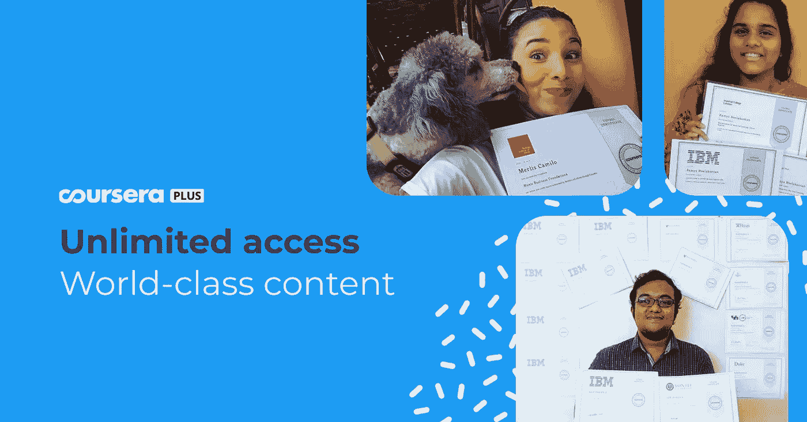

# 2023 年为开发者提供 200 美元 Coursera 加折扣和最佳新年优惠

> 原文：<https://medium.com/javarevisited/200-coursera-plus-discount-and-best-new-year-deals-for-developers-in-2023-eb2b682575?source=collection_archive---------1----------------------->

## 想在 2023 年提升你的 take 技能？以下是你现在可以抓住的投资学习的最佳交易。

大家好，

我希望你这个周末和你的家人过得愉快。

刚刚了解到一个极好的新年优惠，想和大家分享一下；Coursera 为他们的高级会员 [*Coursera Plus 会员*](https://imp.i384100.net/c/3294490/1164545/14726?u=https%3A%2F%2Fwww.coursera.org%2Fcourseraplus%2Fspecial%2Fholiday2023) 提供 200 美元的折扣，这意味着你只需支付初始费用的一小部分，就可以获得无限的证书并进入 7000 多门课程。

以下是了解更多信息的链接——[**Coursera Plus，12 个月**](https://imp.i384100.net/c/3294490/1164545/14726?u=https%3A%2F%2Fwww.coursera.org%2Fcourseraplus%2Fspecial%2Fholiday2023) 售价 199 美元(通常为 399 美元)

广告，如果你想知道在 2023 年拿哪个证书，那么不要担心，我有一个来自谷歌和 Meta 的伟大的专业证书列表，你可以把它作为你的 Coursera Plus 认证的一部分

以下是 2023 年使用 Coursera Plus 获得的 ***最佳 Coursera 证书***

*   [谷歌数据分析专业证书](https://coursera.pxf.io/c/3294490/1164545/14726?u=https%3A%2F%2Fwww.coursera.org%2Fprofessional-certificates%2Fgoogle-data-analytics)
*   [谷歌 UX 设计专业证书](https://coursera.pxf.io/c/3294490/1164545/14726?u=https%3A%2F%2Fwww.coursera.org%2Fprofessional-certificates%2Fgoogle-ux-design)
*   [谷歌 IT 支持专业证书](https://coursera.pxf.io/c/3294490/1164545/14726?u=https%3A%2F%2Fwww.coursera.org%2Fprofessional-certificates%2Fgoogle-it-support)
*   [谷歌项目管理:专业证书](https://coursera.pxf.io/c/3294490/1164545/14726?u=https%3A%2F%2Fwww.coursera.org%2Fprofessional-certificates%2Fgoogle-project-management)
*   [谷歌数字营销&电子商务专业证书](/javarevisited/7-best-google-professional-certificates-on-coursera-to-learn-data-analytics-python-and-it-support-42147311cfe2)
*   [元前端开发者职业证书](https://bit.ly/3RxQ13o)
*   [Meta 后端开发者职业证书](/javarevisited/is-the-meta-frontend-and-backend-developer-certificates-on-coursera-worth-it-review-125f1571e515)
*   [元数据库工程师职业证书](https://bit.ly/3RBromz)
*   [Meta Android 开发者专业证书](https://bit.ly/3Qxwjn4)
*   [Meta iOS 开发者职业证书](https://bit.ly/3Qxwjn4)
*   [元社交媒体营销专业证书](https://bit.ly/3NcLHUF)
*   [元营销分析专业证书](https://coursera.pxf.io/c/3294490/1164545/14726?u=https%3A%2F%2Fwww.coursera.org%2Fprofessional-certificates%2Ffacebook-marketing-analytics)

顺便说一句，这个优惠只针对新用户，而且只在有限的时间内有效。说实话，不像 [*Udemy*](/javarevisited/10-best-udemy-online-courses-for-java-developers-4c9ab70cd01f) 每个月都有优惠， [*Coursera*](/javarevisited/7-best-data-science-courses-with-certificates-on-coursera-from-jhu-usa-to-become-a-data-scientist-445a24882e8b) 几乎不给优惠，而且这是他们目前为止在 Coursera Plus 上最大的优惠。

我记得过去他们给大约 100 美元的折扣，但这次他们提供 200 美元的折扣，这是巨大的。这也意味着，如果你还没有加入 Coursera Plus，现在可能是最好的时机。

这里是加入 Coursera Plus 的链接— [**花 199 美元加入 Coursera Plus**](https://imp.i384100.net/c/3294490/1164545/14726?u=https%3A%2F%2Fwww.coursera.org%2Fcourseraplus%2Fspecial%2Fholiday2023)

对了，2022 年刚刚飞逝而过；在两年的严格封锁和禁止旅行后，它开始与 COVID 放松。这也是一个回顾和反思你所学到的东西，并为 2023 年制定新的目标的时候，比如一份新工作，更好的薪水，或提升你的技术技能，创建一个 YouTube 频道，创建一个课程，并创造被动收入。

我正在写一些关于你在 2023 年能学到什么的文章，所以请继续关注，因为这篇文章更多的是关于我邮件中的最佳交易，我认为它值得与大家分享。

其中大部分与学习和面试准备有关，这在 2023 年至关重要，这可能是获得它们和省钱的最佳时机。大多数课程会员都有 30%到 50%的折扣:

1.  [**Udemy 课程八折优惠**](https://click.linksynergy.com/fs-bin/click?id=JVFxdTr9V80&offerid=323058.9410&type=3&subid=0)
2.  **教育无限期 10-8 折优惠**
3.  **[**plur sight 年度订阅享受 33%的折扣**](https://pluralsight.pxf.io/c/1193463/424552/7490?u=https%3A%2F%2Fwww.pluralsight.com%2Flearn)**
4.  **[**CodeCademy 年度计划五折**](https://bit.ly/codecademyhome)**
5.  **[**data camp 年度订阅享受 65%的折扣**](https://datacamp.pxf.io/c/1193463/1012793/13294?u=https%3A%2F%2Fwww.datacamp.com%2Fpricing)**
6.  **[**指数七五折**](https://bit.ly/3cNF0vw) (学习系统设计和模拟面试的好地方)**
7.  **[**优达城纳米学位七折(使用代码 HAPPYHOLIDAYS22)**](https://imp.i115008.net/c/3294490/786224/11298?u=https%3A%2F%2Fwww.udacity.com%2Fcourse%2Fjava-programming-nanodegree--nd079)**
8.  ****未来学习订阅七折优惠****
9.  ****[**Teachable(最佳课程平台)七五折(一月涨价)**](https://teachable.sjv.io/rnLVgy)****
10.  ****[**我的 Java 和 Spring 书籍打五折**](https://bit.ly/3Bu2VtF)****
11.  ****[**弗拉德·米哈尔恰的冬眠课程享受 33%的优惠**](https://vladmihalcea.teachable.com/p/high-performance-java-persistence-mach-3-online/?coupon_code=XMAS22&affcode=172599_kuoszt8s)****
12.  ****[**苹果 AirPods Pro 八折(还可以赠送)**](https://www.amazon.com/dp/B0BDHWDR12?tag=javamysqlanta-20)****

****如果你问我所有这些网站中只有一个网站可以加入，我推荐 Pluralsight 我喜欢他们的平台和课程，几天前我参加的重构课程非常棒。您可以通过搜索面向 Java 开发人员的重构来找到它，但是如果您像我一样喜欢从多个来源学习，请随时加入更多。****

********

****这就是程序员在 2023 年要做的所有**新年交易。折扣每天都在飞来飞去，但它们是一个最小的时期，所以你最好在它们到期前抓住它们。如果你喜欢 udemy 课程，我已经发布了你应该在今年年终大甩卖中购买的 [**最佳 Udemy 课程**](/javarevisited/15-best-udemy-courses-programmers-can-buy-on-black-friday-and-cyber-monday-2020-a803874f41d9) 。******

**但是，最重要的是，不要忘记休息一下，花时间和你的家人和朋友在一起。**

**那是圣诞节的礼物。**

**一切顺利，不断学习，不断成长，节日快乐！！**