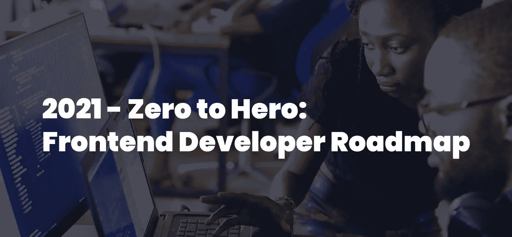
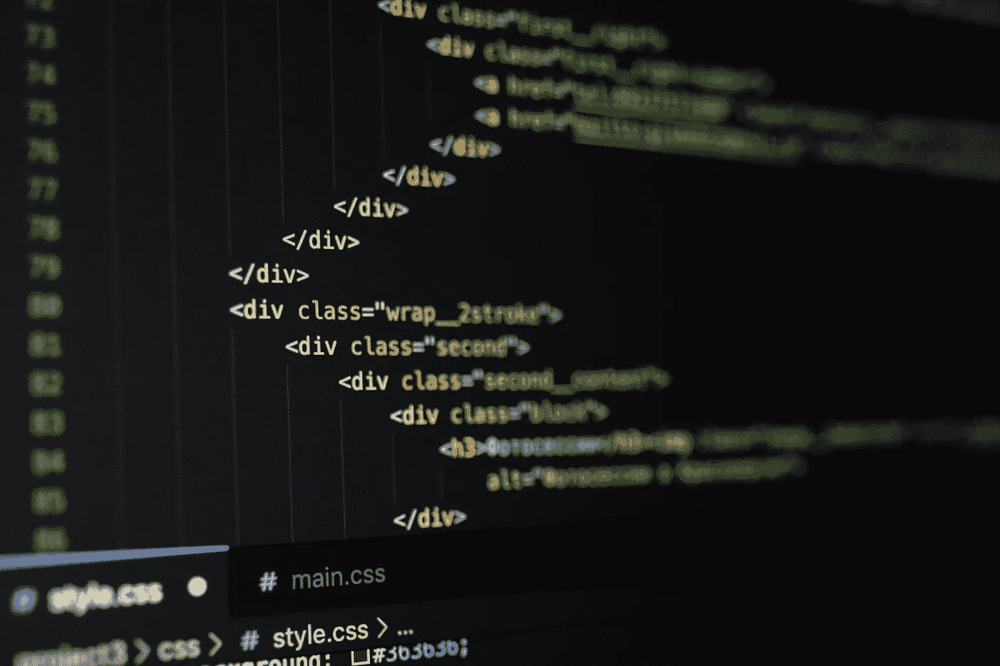
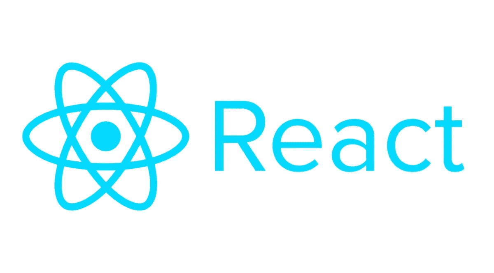
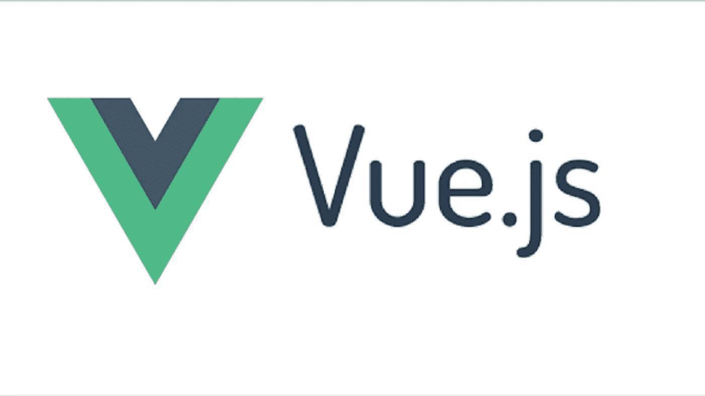
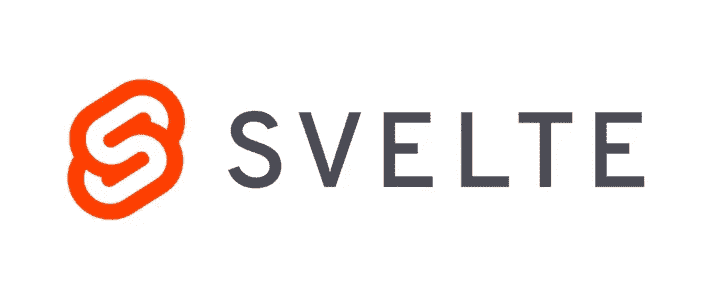

# 2021 从零到英雄:前端开发路线图

> 原文：<https://medium.com/javarevisited/2021-zero-to-hero-front-end-developer-roadmap-30c7ed630a8f?source=collection_archive---------0----------------------->

这篇文章最初发表为:【2021 年完整的前端开发路线图

谷歌是一个寻找前端开发资源的好地方，问题是，我需要学习什么？

这里有一个**完整的 2021 年前端开发路线图，有 15 个以上的免费资源**，来启动你的职业生涯，并开始货币化你的开发技能。

你将从编程的**基础**开始，学习什么是变量以及数据是如何存储的。然后，您将转向**构建您的第一个网页**，添加一些与</javarevisited/10-best-online-courses-to-learn-javascript-in-2020-af5ed0801645>**JavaScript 的交互，并使用 [**CSS**](/javarevisited/10-best-css-online-courses-for-beginners-and-experienced-developers-54aa2e8c0253) 进行样式化。**

**在这个路线图结束时，您将能够使用最新的 [**JavaScript 框架**](/javarevisited/10-javascript-frameworks-and-libraries-to-learn-in-2020-best-of-lot-5f61f86c60b4) **和** [**CSS 预处理程序**](/javarevisited/top-5-advanced-css-courses-to-learn-flexbox-grid-and-sass-da8e37b09b1d?source=---------8------------------) 完整地创建一个中小型前端应用程序，但是要注意:**

**不管路线图有多好，没有实践，就不会有学习。这将花费你一些时间，但回报将是巨大的！**

**准备好了吗？让我们从计算机科学的**基础开始。****

# **1.没有基本面就没有前端**

****

**在 JavaScript 和**前端框架**之前，你需要掌握计算机科学基础</javarevisited/8-best-computer-science-courses-for-beginners-to-learn-online-696379aa4e96>**。****

****学习什么是函数，你的代码是如何被解释的，以及数据是如何被处理的，这将极大地加快你对[编程语言](/javarevisited/top-5-programming-languages-for-web-development-in-2021-f6fd4f564eb6)的理解，同时**为你的 web 开发之旅**打下基础。****

****首先，我建议你看一看:
[**《计算机科学基础》，哈佛自己出版的免费课程。**](https://learning.edx.org/course/course-v1:HarvardX+CS50+X/home)****

# ****2.前端之前:了解网络是如何工作的****

********

****对于前端开发人员来说，理解什么是 HTTP 或 DNS，什么是 T2，或者浏览器如何在屏幕上显示一个网站是很重要的。****

****你必须与**API**通信，处理、发送和接收数据:*最好做好准备。*****

****<https://www.freecodecamp.org/news/how-the-web-works-a-primer-for-newcomers-to-web-development-or-anyone-really-b4584e63585c/>****——**[**web 开发新人入门**](https://www.freecodecamp.org/news/how-the-web-works-a-primer-for-newcomers-to-web-development-or-anyone-really-b4584e63585c/) **。********

# ****3.学习 HTML 和 CSS****

********

****一切都是从 [**HTML**](/javarevisited/top-10-free-courses-to-learn-html-5-css-3-and-web-development-872d62d97a97) 开始的，后来有人想到把东西做得“酷”，创造了 [**CSS**](/javarevisited/10-best-html-and-css-courses-for-beginners-in-2021-6757eec00032) 。****

****学习如何用 HTML 创建你的第一个网页，以及如何设计元素的样式，给它们你喜欢的外观。****

****[**freecodecamp.com 300+小时免费课程，2021 年开启你前端开发者生涯的最佳去处。**](https://www.freecodecamp.org/learn/responsive-web-design/)****

# ****4.开发一个投资组合来展示你的前端项目。****

********

****要记住概念，你需要练习，你可以通过开发东西来练习。如果这些“东西”有助于你实现成为一名成功的前端开发人员的目标，那就更好了。****

****联系新客户时，你会被要求展示的第一件东西是**一份作品集**。既然你已经掌握了 HTML 和 CSS 的**基础，为什么不做一个呢？******

****这里有一个关于如何创建一个简单的 HTML 和 CSS 文件夹的分步指南。****

# ****5.不要丢掉你的工作——学习 Git。****

********

*****知道版本控制不是可选的。*****

****有无数的版本控制系统，比如:****

*   ****[**GitHub**T3**。**](https://github.com/)****
*   ****[**DevOps**](https://azure.microsoft.com/en-us/services/devops/) **。******
*   ****[**比特桶**](http://bitbucket.org) **。******

****它们的共同点是，**是**[**GIT**](/javarevisited/11-best-online-places-to-learn-git-for-beginners-in-2021-6dc2b7c6ef48):
一个免费的开源分布式版本控制系统，旨在快速高效地处理从小到大的项目。****

******简单地说**，GIT 是一个文件夹中文件变化的本地历史，它将帮助你:****

*   ****跟踪你的代码。****
*   ****备份你的代码。****
*   ******避免因不必要的变更而导致的灾难性后果**。****
*   ******与队友**和其他人无缝协作。****

****[**在 YouTube 上的这个速成班学习 GIT。**](https://www.youtube.com/watch?v=8JJ101D3knE)****

# ****6.为您的前端添加交互性—学习 JavaScript****

********

****[**JavaScript**](/javarevisited/my-favorite-free-tutorials-and-courses-to-learn-javascript-8f4d0a71faf2) 及其框架，本质上支持任何需要某种程度的**交互性或数据处理**的前端，例如:****

*   ******一种形式，******
*   ******弹出，******
*   ******Twitter 的订阅。******

****在 2021 年学习 it 是作为一名 web 开发人员最好的投资之一，因为它为前端开发人员提供了数以千计的工作机会。****

****[**开发者互动网站免费 JavaScript 入门课程。**](https://www.edx.org/course/javascript-introduction)****

# ****7.优化你的代码:学习算法和数据结构****

****成为一名优秀的开发人员意味着很多事情:其中之一就是了解你的工具。****

****很好地理解 [**算法和数据结构**](/javarevisited/top-10-data-structure-and-algorithms-courses-for-java-developers-25161ee2edc0) ，理解**列表、队列和堆栈**之间的区别，知道**排序算法**是如何工作的，是编写更优化和更干净的代码的关键。****

****Freecodecamp 提供免费的 [**300 多小时认证 JavaScript 课程**](https://www.freecodecamp.org/learn/javascript-algorithms-and-data-structures/) ，同样贯穿算法和数据结构的基础。****

# ****8.连接您的前端—了解 API****

****在 2021 年，作为一名前端开发人员，你必须找到一种方法与后端房间的人进行交流，交换数据或验证用户。****

****为此，您可能会使用一些 API 和 HTTP，但什么是 API，我如何发送和接收数据呢？****

****[**在 YouTube 上了解什么是 API**](https://www.youtube.com/watch?v=Yzx7ihtCGBs)**。******

****[**学习如何在 JavaScript**](https://www.youtube.com/watch?v=tc8DU14qX6I) **中从 API 获取数据。******

# ****9.要学习前端开发，你需要做前端****

****如前所述:边做边学是关键。****

********

****既然你已经学会了 JavaScript，是时候开发一些成熟的前端应用程序了。****

****尝试创建:****

*   ******待办事项应用，******
*   ******报名表格，******
*   ******定价组件，******
*   ******登陆页面。******

****测试 HTML、CSS 和普通 JavaScript 如何在真实的前端应用程序中协同工作。****

****这里有一个关于如何构建你的待办事项应用前端的惊人教程。****

****下面是 [16 个点燃你创造力的前端项目灵感](https://dev.to/frontendmentor/16-front-end-projects-with-designs-to-help-improve-your-coding-skills-5ajl)。****

## ****香草 JavaScript 是什么意思？****

****当你阅读“普通 JavaScript”时，你应该认为这是在没有任何框架的情况下使用的 JavaScript。)****

## ****我该如何选择合适的前端项目进行开发？****

****这真的取决于你的目标:****

****你想开发 web 应用吗？开发一个网飞克隆体。
你想开发 SaaS 吗？开发基于订阅的工具。
你想开发登陆页面吗？创建登录页面。切题。****

# ****10.加速前端开发——学习 JavaScript 框架****

********

****虽然**普通 JavaScript** 能够创建**完全工作的前端**，**它不可扩展**并且不能给你带来那些现成的工具，比如框架和库:****

*   ****</javarevisited/10-free-vue-js-nuxt-js-online-courses-for-beginners-in-2021-a347ea2ad144>****，********
*   ****[**反应过来**](/javarevisited/5-best-react-js-books-for-beginners-and-experienced-web-developers-e7b90b1ab9d2?source=---------36----------------------------)****
*   ********[**身材苗条**](/javarevisited/5-best-svelet-js-courses-for-beginners-in-2021-fadf0c4e2bab) **，**********

****可能给你的发展带来的影响。挑选一个 [**JavaScript 前端框架**](/javarevisited/10-best-frontend-and-backend-frameworks-for-java-python-ruby-and-javascript-developers-cce3c951787a) 也会让你的工作机会大增。****

****但是要注意，在转移到框架之前，你应该花足够的时间来构建普通的 JavaScript 项目，否则，你可能会丢失许多前端开发的基本概念。****

****根据您的偏好和您所在国家的需求选择您的框架。****

# ****11.学习:反应前端开发****

********

****React 是一个令人惊叹的开源框架，它使得创建交互式 ui 变得轻而易举。由脸书于 2013 年发布，因其简单灵活而广受欢迎。****

****React 为超过 10 万个网站提供支持****

****这里有一个由网络忍者播放的令人惊讶的播放列表，可以启动你的 React 之旅。****

# ****12.学习:Vue.js 前端开发****

********

****Vue(发音为/vjuː/，类似视图)是一个用于构建用户界面的渐进式框架。****

****它的路线图类似于 **React** ，有很好的文档，如果已经有了普通 JavaScript 和入门级前端开发的经验，很容易学会。****

****[在 Traversy media](https://www.youtube.com/watch?v=qZXt1Aom3Cs) 的这个令人惊叹的速成班中学习 Vue。****

# ****13.学习:苗条前端开发****

********

******Svelte 有一种构建用户界面的新方法。******

****像 [React](https://www.java67.com/2018/02/5-free-react-courses-for-web-developers.html) 和 Vue 这样的框架在浏览器中完成大部分工作，而 Svelte 将这些工作转移到编译阶段，在你构建应用程序时进行。****

****[**用其官方免费教程**](https://svelte.dev/tutorial/basics) 学习 Svelte。****

# ****14.改进您的前端造型工作流程****

*****学习一个 CSS 预处理器。*****

****CSS 预处理器是一个让你从预处理器自己独特的语法中生成 CSS 的程序**。有许多 CSS 预处理程序可供选择，但是，它们都将添加一些纯 CSS 中不存在的功能，例如:******

*   ******Mixin******
*   ******套料选择器******
*   ******继承选择器等等。******

****Sass 被认为是前端开发最好的 CSS 预处理器。****

# ****15.学习 Sass 来设计你的前端****

*****拥有超能力的 CSS。*****

********

****Sass 是“语法上令人敬畏的样式表”的首字母缩写。Sass 不仅是世界上最流行的 CSS 预处理器，也是最老的预处理器之一，由 Hampton Catlin 在 2006 年推出，后来由 Natalie Weizenbaum 开发。****

****[**在这个免费的课程中学习 Sass，再次，与 freecodecamp.org**](https://www.youtube.com/watch?v=_a5j7KoflTs)****

# ****结论:2021 年成为前端开发者是最好的选择。****

******2021 年成为前端开发者，进入 IT 界，这是你能做的最好的投资。******

****记住一个自己做的项目抵得上几十个跟着教程做的项目。在这个路线图中，我列出了我在学习前端开发时发现的最好的免费资源。****

****在你的作品集里适当地展示你的项目，**这将是你的客户首先会看的东西！******

****您可能喜欢的其他**开发者路线图文章******

****</javarevisited/the-java-programmer-roadmap-f9db163ef2c2>  </javarevisited/the-2019-web-developer-roadmap-ab89ac3c380e>  </hackernoon/the-2018-devops-roadmap-31588d8670cb>  </javarevisited/the-2019-react-js-developer-roadmap-9a8e290b8a56> ****