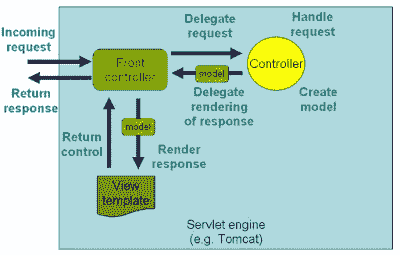
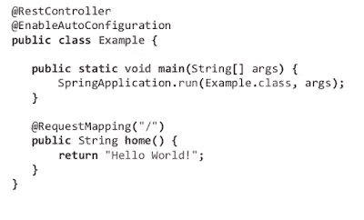

# 面向初学者和有经验的开发人员的 10 大春季 MVC 面试问题答案

> 原文：<https://medium.com/javarevisited/21-spring-mvc-rest-interview-questions-answers-for-beginners-and-experienced-developers-21ad3d4c9b82?source=collection_archive---------0----------------------->

[](http://bit.ly/2ylC68g)

大家好。如果您正在准备 Java 和 Spring 面试或 Spring 认证，并且正在寻找一些常见的 Spring MVC 和 REST 面试问题，那么您来对地方了。早些时候，我已经分享了[最佳春季 MVC 课程](/javarevisited/10-best-online-courses-to-learn-spring-framework-in-2020-f7f73599c2fd?source=collection_home---4------0-----------------------)和[书籍](/javarevisited/5-advanced-spring-framework-books-experienced-java-developers-should-read-in-2020-best-of-lot-2a786fc5ad31?source=---------6-----------------------)，今天，我将分享 Java 开发人员申请 web 开发人员职位的 22 个春季面试问题。

由于 Spring 框架是开发 Java web 应用程序和 RESTful web 服务的最流行和标准的框架，任何高级 Java 开发人员都应该对 [Spring core](https://www.java67.com/2017/11/top-5-free-core-spring-mvc-courses-learn-online.html) 和 [Spring MVC](http://javarevisited.blogspot.sg/2018/01/how-to-learn-spring-core-spring-mvc-boot-security-framework.html#axzz55IgfKjy8) 有很好的了解。

但是，如果工作描述提到 REST 和 web 服务，您还需要知道如何使用 Spring 框架开发 RESTful web 服务。

从 [Spring 3.1](https://spring.io/projects/spring-framework) 开始，框架得到了很大的增强，支持 RESTFul API 所需的许多特性。 **HTTPMessageConverter** 可以通过检测类路径中的相关库，将您的 HTTP 响应转换为 [JSON](http://javarevisited.blogspot.sg/2018/02/how-to-parse-json-with-date-field-in-java-jackson-example.html#axzz56WGunSwy) 或 [XML](http://javarevisited.blogspot.sg/2013/01/jaxb-xml-binding-tutorial-marshalling-unmarshalling-java-object-xml.html#axzz56WGunSwy) ，如 [Jackson](http://javarevisited.blogspot.sg/2018/02/how-to-parse-json-with-date-field-in-java-jackson-example.html) 和 [JAXB](http://javarevisited.blogspot.sg/2013/01/jaxb-xml-binding-tutorial-marshalling-unmarshalling-java-object-xml.html) 。

Spring 还为 RESTful Web 服务提供了定制的注释，如 **@RestController，**可以让您的控制器更加了解 REST，这样您就不需要做每个 REST API 都需要的常见事情，如将响应转换为 JSON。

对于在现实世界中为 RESTful web 服务开发安全性来说，对 Spring 安全性的深入了解也是必不可少的。既然没有安全性就不能让 life 成为一个重要的 REST API，那么对安全性基础知识、 [HTTP 基本认证](http://javarevisited.blogspot.sg/2018/01/how-http-basic-authentication-works-in.html)、摘要认证、 [OAuth](/javarevisited/top-10-courses-to-learn-spring-security-and-oauth2-with-spring-boot-for-java-developers-8f0222d6066d?source=---------5-----------------------) 和 JWT 的良好了解就非常重要。

顺便说一下，如果你是 Spring MVC 和 Spring 框架的新手，那么我强烈推荐你加入一个好的、全面的 Spring 课程，比如这个 [**Spring 5:初学者到大师**](http://bit.ly/2ylC68g) 资源，首先学习基础知识。这将有助于你更好地回答这个问题，并在春季认证和面试中取得好成绩。

[](http://bit.ly/2ylC68g) [## Spring Framework 5:初学者到大师教程

### Spring 框架 5:学习 Spring 框架 5，Spring Boot 2，Spring MVC，Spring Data JPA，Spring Data MongoDB…

bit.ly](http://bit.ly/2ylC68g) 

# 十大 Spring MVC + REST Web 服务面试问题及答案

下面是一些关于在 Spring 框架中使用 REST web 服务的常见问题。

## **1。Spring MVC 中什么时候需要@ResponseStatus 注释？**

对于一个有经验的 Spring 开发者来说，这是一个 3 到 5 年的好问题。在 Spring MVC 和 REST 中进行错误处理时，需要使用`@ResponseStatus` 注释。通常，当服务器端出现错误或异常时，web 服务器会返回一个总括的 HTTP 状态代码 500 —内部服务器错误。

这可能适用于人类用户，但不适用于 REST 客户端。如果找不到资源，您需要向它们发送适当的状态代码，比如 404。这就是您可以使用它们的`@ResponseStatus`注释的地方，它允许您发送定制的 HTTP 状态代码以及适当的错误消息，以防出现异常。

为了使用它，您可以创建定制的异常，并使用`@ResponseStatus`注释和适当的 HTTP 状态代码和原因对它们进行注释。

当这种异常从控制器的处理程序方法中抛出，并且没有在其他地方处理时，则带有适当 HTTP 状态代码的适当 HTTP 响应被发送到客户端。

例如，如果您正在为一个提供图书信息的图书馆编写一个 [RESTful web 服务](http://www.java67.com/2015/09/top-10-restful-web-service-interview-questions-answers.html)，那么您可以使用`@ResponseStatus`来创建一个异常，当没有找到一本书时返回 HTTP 响应代码 404，而不是内部服务器错误(500)，如下所示:

```
@ResponseStatus(value=HttpStatus.NOT_FOUND, reason="No such Book")  // 404
public class BookNotFoundException extends RuntimeException {// ...}
```

如果这个异常是从任何处理程序方法中抛出的，那么 HTTP 错误代码 404 和原因“没有这样的书”将被返回给客户机。

如果你不熟悉 Spring MVC、Security 和 REST 的基本概念，我建议你在下一次求职面试之前，通过这些 [REST with Spring](http://courses.baeldung.com/p/rest-with-spring-the-master-class?affcode=22136_bkwjs9xa) 和 [Learn Spring Security](https://courses.baeldung.com/p/learn-spring-security-the-master-class?utm_source=javarevisited&utm_medium=web&utm_campaign=lss&affcode=22136_bkwjs9xa) 课程来积累一些经验。这两个课程是专门为您提供一些真实世界的经验而设计的，以增加您对 Spring MVC、REST 和 Spring Security 的知识和经验。

[](http://courses.baeldung.com/p/rest-with-spring-the-master-class?affcode=22136_bkwjs9xa) [## 与春天一起休息:大师课

### 使用 Spring 构建生产级 REST API 的参考。这 14 个模块涵盖了构建和保护 API…

courses.baeldung.com](http://courses.baeldung.com/p/rest-with-spring-the-master-class?affcode=22136_bkwjs9xa) 

## **2。@RequestMapping 注释是做什么的？** ( [回答](http://javarevisited.blogspot.sg/2017/06/how-spring-mvc-framework-works-web-flow.html#axzz55vF5ugU8))

`@RequestMapping`注释用于将 web 请求映射到 Spring 控制器方法。您可以基于 HTTP 方法映射请求，例如 GET、POST 和各种其他参数。

例如，如果您正在使用 Spring 开发一个 [RESTful web 服务，那么您可以使用、产生和消耗属性以及媒体类型注释来指示该方法仅用于产生或消耗 JSON，如下所示:](/javarevisited/top-5-books-and-courses-to-learn-restful-web-services-in-java-using-spring-mvc-and-spring-boot-79ec4b351d12)

```
@RequestMapping 
(method = RequestMethod.POST, consumes="application/json")
public Book save(@RequestBody Book aBook) {
  return bookRepository.save(aBook);
}
```

类似地，您可以创建其他处理程序方法来生成 JSON 或 XML。如果你对这些注释还不熟悉，那么我建议你加入 Udemy 上的这个 [**Spring MVC For 初学者**](https://click.linksynergy.com/fs-bin/click?id=JVFxdTr9V80&subid=0&offerid=323058.1&type=10&tmpid=14538&RD_PARM1=https%3A%2F%2Fwww.udemy.com%2Fspring-mvc-tutorial-for-beginners-step-by-step%2F) 课程来学习基础知识。

[](https://click.linksynergy.com/fs-bin/click?id=JVFxdTr9V80&subid=0&offerid=323058.1&type=10&tmpid=14538&RD_PARM1=https%3A%2F%2Fwww.udemy.com%2Fspring-mvc-tutorial-for-beginners-step-by-step%2F) [## 初学者的 Spring MVC 用 25 个步骤构建 Java Web 应用程序

### Ranga 是 AWS 认证解决方案架构师助理。我们在 DevOps、云上向 45 万名学习者教授 30 多门课程…

udemy.com](https://click.linksynergy.com/fs-bin/click?id=JVFxdTr9V80&subid=0&offerid=323058.1&type=10&tmpid=14538&RD_PARM1=https%3A%2F%2Fwww.udemy.com%2Fspring-mvc-tutorial-for-beginners-step-by-step%2F) 

## **3。@Controller 是刻板印象吗？@RestController 是刻板印象吗？** ( [回答](http://javarevisited.blogspot.sg/2017/08/difference-between-restcontroller-and-controller-annotations-spring-mvc-rest.html))

是的，`@Controller`和`@RestController`都是刻板印象。`@Controller`实际上是 Spring 的`@Component`原型注释的特殊化。这意味着用`@Controller`标注的类也将被 Spring 容器自动检测，作为容器组件扫描过程的一部分。

并且，`@RestController`是 RESTful web 服务的`@Controller`的专门化。它不仅结合了 [@ResponseBody](http://courses.baeldung.com/p/rest-with-spring-the-master-class?affcode=22136_bkwjs9xa) 和`@Controller`注释，还赋予了控制器类更多的含义，以清楚地表明它处理 RESTful 请求。

您的 Spring 框架也可能使用这个注释来提供一些将来与 REST API 开发相关的更有用的特性。

## **4。Spring MVC 中什么时候需要@ResponseBody 注释？** ( [回答](http://javarevisited.blogspot.sg/2018/01/7-reasons-for-using-spring-to-develop-RESTful-web-service.html#axzz55a8rTeu7))

`@ResponseBody`注释可以放在一个方法上，指示返回类型应该直接写入 HTTP 响应体(而不是放在模型中，或者解释为视图名)。

例如:

```
@RequestMapping(path = "/hello", method = RequestMethod.PUT)
@ResponseBody
public String helloWorld() {
  return "Hello World";
}
```

或者，也可以使用 [@RestController](http://courses.baeldung.com/p/rest-with-spring-the-master-class?affcode=22136_bkwjs9xa) 注释来代替`@Controller`注释。这将消除使用`@ResponseBody`的需要，因为正如在前面的回答中所讨论的，它自动带有`@RestController`注释。

## **5。@PathVariable 在 Spring MVC 中是做什么的？为什么它在春天的休息中有用？** ( [回答](http://javarevisited.blogspot.sg/2017/10/differences-between-requestparam-and-pathvariable-annotations-spring-mvc.html))

这是 Spring MVC 的一个有用的注释，允许你从 URI 中读取值，比如查询参数。这在使用 Spring 创建 RESTful web 服务的情况下特别有用，因为在 REST 中，资源标识符是 URI 的一部分。这个问题通常由有 4 到 6 年经验的 Spring MVC 开发人员提出。

比如这个 [URL](http://myapp.com/books/101) 如果你想学习如何提取 id，那么你可以使用 Spring MVC 的`@PathVariable`注释。如果你不熟悉 Spring MVC 注释，那么 [Spring MVC For 初学者:25 步构建 Java Web App](https://click.linksynergy.com/fs-bin/click?id=JVFxdTr9V80&subid=0&offerid=323058.1&type=10&tmpid=14538&RD_PARM1=https%3A%2F%2Fwww.udemy.com%2Fspring-mvc-tutorial-for-beginners-step-by-step%2F)是一个很好的起点。

[](https://click.linksynergy.com/fs-bin/click?id=JVFxdTr9V80&subid=0&offerid=323058.1&type=10&tmpid=14538&RD_PARM1=https%3A%2F%2Fwww.udemy.com%2Fspring-mvc-tutorial-for-beginners-step-by-step%2F)

## **6。Spring MVC 中的@Controller 和@RestController 有什么区别？** ( [回答](http://javarevisited.blogspot.sg/2017/08/difference-between-restcontroller-and-controller-annotations-spring-mvc-rest.html))

正如我在之前的文章中所讨论的，在它们`@Controller`和`@RestController`注释之间有很多不同之处(更多信息请看答案！)，但最重要的一点是，使用`@RestController`可以自动获得`@ResponseBody`注释，这意味着您不需要单独用`@ResponseBody`注释来注释您的处理程序方法。

这使得使用 Spring 开发 RESTful web 服务变得更加容易。你可以在这里了解更多关于 Spring Boot 的知识，以及它如何帮助你创建基于 Spring MVC 的 web 应用程序。

[](http://bit.ly/2yjLysL)

## 7。Spring MVC 中的 RestTemplate 有什么优势？( [**回答**](http://javarevisited.blogspot.sg/2017/02/how-to-consume-json-from-restful-web-services-Spring-RESTTemplate-Example.html) **)**

`RestTemplate`类是 Spring 框架中模板方法模式的一个实现。类似于其他流行的模板类，如`JdbcTemplate`或`JmsTempalte`，它也简化了客户端与 RESTful web 服务的交互。您可以使用它非常容易地消费 RESTful web 服务器，如这个`RestTemplate`示例所示。

## **8。哪里需要@EnableWebMVC？**(答案)

当使用 Java 配置代替 XML 来配置 Spring MVC 时，需要使用`@EnableWebMvc`注释来启用 Spring MVC。它相当于 XML 配置中的< mvc:注释驱动的>。

它支持带`@Controller`注释的类，这些类使用`@RequestMapping`将传入的请求映射到尚不熟悉 Spring 对 Java 配置支持的处理程序方法。Udemy 上的[春季大师班](https://click.linksynergy.com/fs-bin/click?id=JVFxdTr9V80&subid=0&offerid=323058.1&type=10&tmpid=14538&RD_PARM1=https%3A%2F%2Fwww.udemy.com%2Fspring-tutorial-for-beginners%2F)是一个不错的起点。

[](https://click.linksynergy.com/fs-bin/click?id=JVFxdTr9V80&subid=0&offerid=323058.1&type=10&tmpid=14538&RD_PARM1=https%3A%2F%2Fwww.udemy.com%2Fspring-tutorial-for-beginners%2F) [## 学习 Spring 框架大师课教程

### Ranga 是 AWS 认证解决方案架构师助理。我们在 DevOps、云上向 45 万名学习者教授 30 多门课程…

udemy.com](https://click.linksynergy.com/fs-bin/click?id=JVFxdTr9V80&subid=0&offerid=323058.1&type=10&tmpid=14538&RD_PARM1=https%3A%2F%2Fwww.udemy.com%2Fspring-tutorial-for-beginners%2F) 

## **9。Spring REST 中的 HttpMessageConverter 是什么？**

一个`HttpMessageConverter`是一个[策略](http://www.java67.com/2014/12/strategy-pattern-in-java-with-example.html)接口，它指定了一个可以与 HTTP 请求和响应相互转换的转换器。Spring REST 使用这个接口将 HTTP 响应转换成各种格式，例如 JSON 或 XML。

每个`HttpMessageConverter`实现都有一个或几个相关联的 MIME 类型。Spring 使用“Accept”头来确定客户机期望的内容类型。

然后，它将尝试找到一个能够处理该特定内容类型的已注册的 [HTTPMessageConverter](http://courses.baeldung.com/p/rest-with-spring-the-master-class?affcode=22136_bkwjs9xa) ，并在将响应发送给客户端之前，使用它将响应转换成该格式。如果你是 Spring MVC 的新手，请看这个 [Spring 5:初学者到权威](http://bit.ly/2ylC68g)资源来学习基础知识。

[](http://bit.ly/2ylC68g) [## Spring Framework 5:初学者到大师教程

### Spring 框架 5:学习 Spring 框架 5，Spring Boot 2，Spring MVC，Spring Data JPA，Spring Data MongoDB…

bit.ly](http://bit.ly/2ylC68g) 

## **10。如何创建 HttpMessageConverter 的自定义实现来支持新类型的请求/响应？**

您只需要创建一个`AbstractHttpMessageConverter`的实现，并使用`WebMvcConfigurerAdapter#extendMessageConverters()`方法将它注册到生成新类型的请求/响应的类中。

## **11。开发 RESTful Web 服务的类路径中需要 Spring MVC 吗？** ( [回答](http://javarevisited.blogspot.sg/2017/01/where-and-how-to-download-spring-JAR-Files-Spring4-without-Maven-Gradle.html#axzz4pp42TeHu))

这个问题经常被有 1 到 2 年 Spring 经验的 Java 程序员问到。简单的回答是:**是的—** 您需要在 Java 应用程序的类路径中使用 Spring MVC 来使用 Spring 框架开发 RESTful web 服务。

实际上是 Spring MVC 提供了所有有用的注释，像`@RestController`、`@ResponseCode`、`@ResponseBody`、`@RequestBody`和`@PathVariable`(参见 [REST with Spring](http://courses.baeldung.com/p/rest-with-spring-the-master-class?affcode=22136_bkwjs9xa) )。因此，您必须在 pom.xml 中使用适当的 Maven 条目

[](http://courses.baeldung.com/p/rest-with-spring-the-master-class?affcode=22136_bkwjs9xa) [## 与春天一起休息:大师课

### 使用 Spring 构建生产级 REST API 的参考。这 14 个模块涵盖了构建和保护 API…

courses.baeldung.com](http://courses.baeldung.com/p/rest-with-spring-the-master-class?affcode=22136_bkwjs9xa) 

对于初学者和有经验的 Java JEE 开发人员来说，以上是一些常见的春季 MVC 面试问题。如果你要参加 Pivotal 的[弹簧认证](http://javarevisited.blogspot.sg/2017/06/how-to-prepare-for-spring-framework-certifications.html)，这些问题对于温习你关于弹簧座的知识也非常有用。

如果你已经在为你的 Spring 开发者认证做准备，并且你从 Spring 认证的角度需要更多这样的问题，你会在 David Mayer 的 [**Core Spring 模拟器**](https://www.certification-questions.com/practice-exam/vmware/edu-1202?affiliateCode=fcff36fd-557a-4713-abf6-973e9924770f&utm_source=Javin&utm_medium=affiliate&utm_campaign=affiliate) 上找到很多关于这个主题的问题，这是目前通过 Spring 认证的最好的模拟器之一。祝你面试好运！

[](https://www.certification-questions.com/practice-exam/vmware/edu-1202?affiliateCode=fcff36fd-557a-4713-abf6-973e9924770f&utm_source=Javin&utm_medium=affiliate&utm_campaign=affiliate) [## VMware EDU-1202 模拟测试

### 每个问题都有详细的解释。我们的网络模拟器和移动应用程序不仅仅是为了练习，而是…

www.certification-questions.com](https://www.certification-questions.com/practice-exam/vmware/edu-1202?affiliateCode=fcff36fd-557a-4713-abf6-973e9924770f&utm_source=Javin&utm_medium=affiliate&utm_campaign=affiliate) 

你可能喜欢的其他 **Java 和 Spring 文章:**
[Spring MVC 在 Java 内部是如何工作的？](https://javarevisited.blogspot.com/2017/06/how-spring-mvc-framework-works-web-flow.html)
[2023 年 Java 开发者应该学会的 10 件事？](https://javarevisited.blogspot.sg/2017/12/10-things-java-programmers-should-learn.html#axzz53ENLS1RB)
[Java 开发者可以学习的 3 个最佳实践 Spring](/@javinpaul/3-coding-best-practices-i-learned-from-spring-framework-in-java-2dfef576e485)
[深入学习 Spring Boot 的 5 大课程](https://www.java67.com/2018/06/5-best-courses-to-learn-spring-boot-in.html)
[Java full stack 开发者应该学习的 10 个框架](/javarevisited/top-10-frameworks-full-stack-java-developers-can-learn-in-2020-5995021401e5)
[2023 年成为更好的 Java 程序员的 10 个技巧](http://javarevisited.blogspot.sg/2018/05/10-tips-to-become-better-java-developer.html)
[2023 年学习 Spring Boot 的 5 大课程](https://javarevisited.blogspot.com/2018/05/top-5-courses-to-learn-spring-boot-in.html)
[面向 Java 开发者的 5 大 Spring 微服务课程](https://javarevisited.blogspot.com/2018/02/top-5-spring-microservices-courses-with-spring-boot-and-spring-cloud.html#axzz5Cz1R4cHw)

[学习春云的前 5 本书](https://javarevisited.blogspot.com/2018/07/top-5-books-to-learn-spring-boot-and-spring-cloud-java.html)
[15 Spring Boot 面向 Java 开发者的面试问题](http://www.java67.com/2018/06/top-15-spring-boot-interview-questions-answers-java-jee-programmers.html)
[10 Spring Boot 与春云微服务课程](/javarevisited/10-best-java-microservices-courses-with-spring-boot-and-spring-cloud-6d04556bdfed?source=rss-bb36d8439904------2&utm_source=dlvr.it&utm_medium=linkedin)

感谢您阅读本文。如果你觉得这些*春季 MVC 面试问答*对你的准备有用，那么请与你的朋友和同事分享。我非常感谢你的支持。

**P. S. —** 如果你是 Spring 框架的新手，正在寻找一些免费的在线课程来学习 Spring 框架以及 Spring MVC 和 Spring Boot 之类的东西，那么你也可以看看这个为 Java 程序员提供的 [**免费 Spring 课程**](https://www.java67.com/2017/11/top-5-free-core-spring-mvc-courses-learn-online.html) 列表。

[](/javarevisited/top-10-free-courses-to-learn-spring-framework-for-java-developers-639db9348d25) [## Java 开发人员学习 Spring 框架的 10 大免费课程

### 大家好，我最近分享了很多资源，如书籍和课程，当我公布了我的最佳…

medium.com](/javarevisited/top-10-free-courses-to-learn-spring-framework-for-java-developers-639db9348d25)