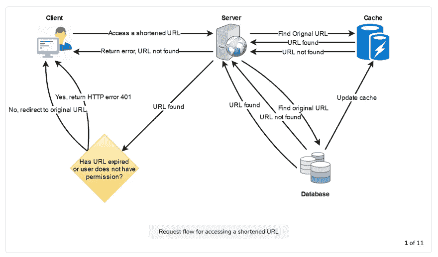
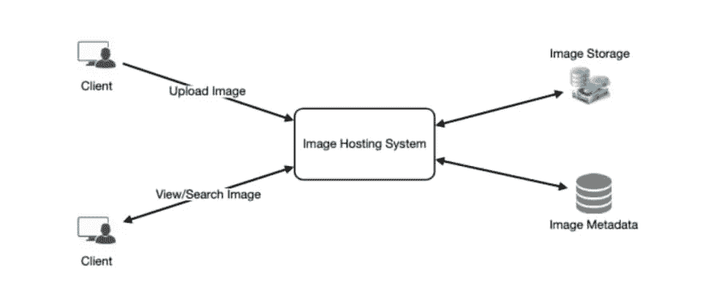
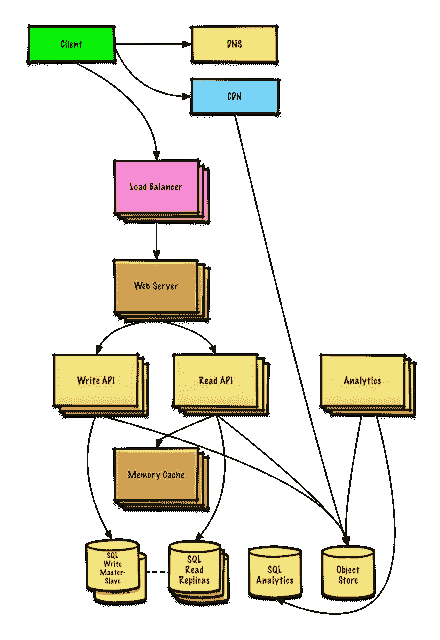
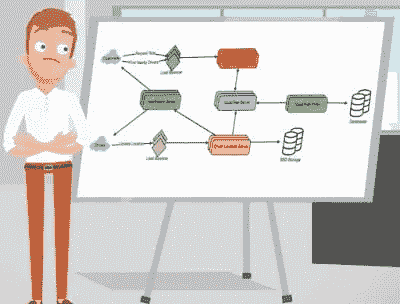
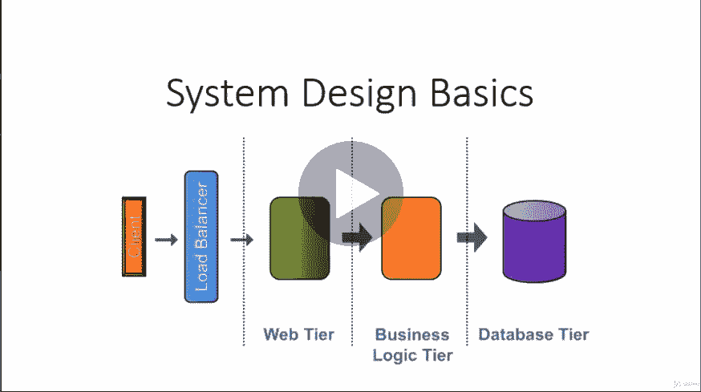

# 破解任何编程和技术面试的 25 个软件设计面试问题

> 原文：<https://medium.com/javarevisited/25-software-design-interview-questions-to-crack-any-programming-and-technical-interviews-4b8237942db0?source=collection_archive---------0----------------------->

## *常见系统设计问题和有用资源链接*

你好伙计们，如果你给过任何编码面试那么你知道**系统设计或软件设计问题**是编程工作面试的重要组成部分，如果你想做好，你必须准备这个话题。

过去，当我分享我的[编程面试问题](http://www.java67.com/2018/05/top-75-programming-interview-questions-answers.html)列表时，我已经分享了几个[系统设计问题](https://www.java67.com/2018/05/top-20-system-design-interview-questions-answers-programming.html)，但是我的读者一直问我更多的问题，因为这是一个很难掌握的话题，需要越来越多的练习。

我有自己的问题列表，这些问题是我从与朋友和同事的各种采访中收集的，但当我偶然发现关于教育的 [**探索系统设计采访**](https://www.educative.io/collection/5668639101419520/5649050225344512?affiliate_id=5073518643380224) 课程时，我需要更多的问题来写这篇文章。

<https://www.educative.io/courses/grokking-the-system-design-interview?affiliate_id=5073518643380224>  

这就像是天赐的资源，因为它不仅给了你很多系统设计问题，还提供了解决这些问题所需的所有知识和工具。

换句话说，这门课程一步一步地教你如何着手设计一个真实世界的系统，比如脸书、推特、优步等等。

此外，没有太多的系统设计面试课程和资源可以让你准备这个话题。当我在搜索时，我只找到了 Educative 的系统设计课程和 Udemy 的掌握系统设计面试课程，该课程由前亚马逊招聘经理 Frank Kane 教授。

除此之外，我没有发现任何在线课程完全专注于解决顶级公司的系统设计问题，如[亚马逊](https://javarevisited.blogspot.com/2016/01/top-20-amazon-and-google-programming-interview-questions.html)、[谷歌](https://javarevisited.blogspot.com/2012/01/google-interview-questions-answers-top.html)、[微软](https://javarevisited.blogspot.com/2015/12/30-microsoft-interview-questions-for-software-development-engineers.html#axzz5YWjgMMkL)、苹果、SalesForce、Flipcart 等。

当你将本课程与这个问题列表结合起来时，你将拥有准备[系统设计面试](/javarevisited/10-best-system-design-courses-for-coding-interviews-949fd029ce65)的最佳材料。你也可以先自己尝试所有这些问题，然后再参加课程或查看我对其中一些问题的解决方案。

只有当你有一些编码经验和计算机科学和软件设计的基础知识时，这种方法才是最好的。如果你完全是这方面的初学者，那么我建议你首先从基础课程开始学习，比如 Coursera 上的 [**Java 编程:软件设计原理**](https://coursera.pxf.io/c/3294490/1164545/14726?u=https%3A%2F%2Fwww.coursera.org%2Flearn%2Fjava-programming-design-principles) 或者教育团队本身的 [**Web 应用&软件架构 101**](https://www.educative.io/courses/web-application-software-architecture-101?affiliate_id=5073518643380224) 。

<https://www.educative.io/courses/web-application-software-architecture-101?affiliate_id=5073518643380224>  

本课程不仅会教你如何使用 Java 和多个类来解决现实世界中的问题，还会教你软件设计，软件设计不仅仅是编码，还包括逻辑思维和设计，这对于成为一名成功的软件开发人员非常重要。

# 面向程序员的 25 个系统设计面试问题

事不宜迟，这里列出了一些最受欢迎的系统设计或面向对象的分析和设计问题，可以解决任何编程工作面试。

**1。用 Java 怎么设计自动售货机？** ( [解决方案](http://javarevisited.blogspot.sg/2016/06/design-vending-machine-in-java.html#axzz4sZVwtCgs) )
你需要编写代码来实现一个自动售货机，它有一堆产品，如巧克力、糖果、冷饮，并接受一些硬币，如 5 分、10 分、25 分、25 分等。确保你插入一枚硬币，拿回一件产品，找回你的机会。此外，编写单元测试来演示这些常见用例的工作原理。如果你遇到困难，你可以阅读我的两篇文章([第一部分](http://javarevisited.blogspot.sg/2016/06/design-vending-machine-in-java.html#axzz4sZVwtCgs)和[第二部分](http://javarevisited.blogspot.sg/2016/06/java-object-oriented-analysis-and-design-vending-machine-part-2.html))来解决这些经典的系统设计问题。

**2。如何设计一个像 goo.gl 或者 bit.ly 这样的网址缩短服务？** ( [解法](https://www.educative.io/courses/grokking-the-system-design-interview/m2ygV4E81AR?affiliate_id=5073518643380224) )
这是另一个常见的系统设计问题。您已经给出了一个(通常)很长的 URL，那么您将如何设计一个服务来为它生成一个更短的唯一别名呢？如果你不熟悉 URL shortener 服务，看看一些流行的服务，如谷歌的 goo.gl 和 Twitter 使用的 bit.ly。

确保提供一些设计决策背后的数据库模式和基本原理，如保留数据多长时间，如何获得统计和分析等。如果你被卡住了，你可以按照 [**给出的解决方案，在教育性的**](https://www.educative.io/collection/5668639101419520/5649050225344512?affiliate_id=5073518643380224) 课程中寻找系统设计面试。

**3。你如何设计一个交通控制系统？**
一个自古至今依然流行的经典系统设计问题。确保你知道如何从一种状态转换到另一种状态，比如从红色到绿色，从绿色到橙色到红色等等。

[哈沙尔·德赛](https://unsplash.com/@harshaldesai?utm_source=medium&utm_medium=referral)在 [Unsplash](https://unsplash.com?utm_source=medium&utm_medium=referral) 上的照片

**4。如何为交易系统设计限价指令书？** ( [解](https://javarevisited.blogspot.sg/2017/03/2-practical-data-structure-algorithm-interview-questions-java.html) )
限价指令簿在证券交易所中用于根据价格和时间的优先顺序将买入指令与卖出指令相匹配。你会怎么做？你将使用哪种数据结构？请记住，匹配的速度是关键，也是可靠性。

如果你需要复习数据结构，那么你可以查看 Java 课程中的 [**数据结构和算法，如果你觉得卡住了，你可以在这里查看我的解决方案。**](https://click.linksynergy.com/deeplink?id=JVFxdTr9V80&mid=39197&murl=https%3A%2F%2Fwww.udemy.com%2Fcourse%2Flearn-data-structure-algorithms-with-java-interview%2F)

<https://www.udemy.com/course/learn-data-structure-algorithms-with-java-interview/?ranMID=39197&ranEAID=JVFxdTr9V80&ranSiteID=JVFxdTr9V80-swb05MQNQKoCJQSIsLN1.g&LSNPUBID=JVFxdTr9V80>  

**5。如何设计一个像 Pastebin 这样的网站？Pastebin 允许你粘贴文本或代码，然后在任何你想要的地方分享代码的链接。这不是一个在线代码编辑器，但你可以用它来存储任何类型的文本。**

## **6。你会如何创建自己的 Instagram？** ( [解](https://www.educative.io/courses/grokking-the-system-design-interview/m2yDVZnQ8lG?affiliate_id=5073518643380224))

Instagram 是一个照片共享应用程序，它提供了一些自定义滤镜来提高照片质量。你的应用程序应该有照片上传功能，为搜索标记照片，和一些基本的过滤器。如果你能加入分享或社交网络，那就太好了。

顺便说一句，如果你卡住了，你还可以看到教育搜索系统设计课程上提供的免费解决方案。

**7。如何设计像 Google Drive 或 Dropbox 这样的全局文件共享和存储应用？**
这些是用来存储和分享文件、照片和其他媒体的。你是如何设计允许用户上传/浏览/搜索/分享文件或照片的呢？跟踪文件共享的权限，并允许多个用户编辑同一文档？

如果你喜欢 YouTube 视频，这里有一个不错的视频，可以教你如何设计 Dropbox、Google Drive 或任何其他文档托管解决方案:

## **8。如何设计一个像 WhatsApp 或者 Facebook Messenger 这样的聊天应用？【** [**解**](https://bytebytego.com/courses/system-design-interview/design-a-chat-system?fpr=javarevisited)

**你肯定用过 WhatsApp 和脸书吧？没有吗？如果不是，让我告诉你，一个聊天应用程序可以让你给你的朋友发消息。这是一个点对点的连接。**

**你保留一个好友列表，查看他们的状态，和他们聊天。在 WhatsApp 中，你也可以连接群组，但那是为高级和有经验的开发者准备的。至少，您应该提供一个设计来保存一个朋友列表，并从他们那里发送和接收消息。**

**如果你需要一些提示，那么我建议你去 Udemy 上查看 [**摇摆系统设计课程**](https://click.linksynergy.com/deeplink?id=JVFxdTr9V80&mid=39197&murl=https%3A%2F%2Fwww.udemy.com%2Fcourse%2Frocking-system-design%2F) ，在那里你会找到一个完整的案例研究来解决这个问题。**

**<https://click.linksynergy.com/deeplink?id=JVFxdTr9V80&mid=39197&murl=https%3A%2F%2Fwww.udemy.com%2Fcourse%2Fpreparing-for-system-design-interviews%2F> ** 

****9。你如何设计一个 Twitter 的克隆？Twitter 是一种流行的信息服务，可以让你向你所有的关注者发布信息。你发微博，你的追随者看到这些信息，他们可以喜欢或转发。****

**确保你实现了关注者、标签、推文、删除等常见功能。如果你走投无路，进退维谷，你可以按照 [**系统设计面试的解决方案:寻找系统设计面试**](https://www.educative.io/collection/5668639101419520/5649050225344512?affiliate_id=5073518643380224) 。**

****

****10。如何设计像 YouTube 或网飞这样的全球视频流媒体服务？[** [**解决方案**](https://bytebytego.com/courses/system-design-interview/design-youtube?fpr=javarevisited) **]** 在设计像网飞或 YouTube 这样的视频流服务时，关键的事情是在低带宽连接上实现流畅的流传输、缓冲和运行，您如何应对这些挑战。**

**可以去看看这个[系统设计课程](https://www.java67.com/2019/09/top-5-courses-to-learn-system-design.html)学习如何处理这类问题。Alex Xu 已经解释了如何设计 YouTube，作为他的 [**系统设计面试课程**](https://bytebytego.com?fpr=javarevisited) 的一部分，你可以免费访问这一课。**

**<https://bytebytego.com/courses/system-design-interview/design-youtube?fpr=javarevisited> ** 

**11。如何设计一台 ATM 机？ATM 机允许用户存取现金。它还允许用户查看自己的余额。你如何设计这样一个系统？你面临的主要挑战是什么？**

**12.如何设计 API 速率限制器？**

**13.你是如何设计 Twitter 搜索的？**

****14。如何设计一个像 Google 一样的网络爬虫？**
一个网络爬虫去一个网站，抓取所有链接并索引它们，例如谷歌，这样它们以后可以出现在搜索结果中。一个爬虫也可以用来在一组目录中搜索一个特定的文件，你如何设计这样的东西？主要的挑战是什么？**

**你可以先自己尝试这个问题，但是如果你卡住了，你也可以通过指数 加入这个 [**系统设计课程，看看这个问题以及其他流行的系统设计问题的解决方案，比如设计 YouTube、抖音、Facebook Messenger 等等。**](https://www.tryexponent.com/courses/system-design-interview?ref=javinpaul2)**

**<https://www.tryexponent.com/courses/system-design-interview?ref=javinpaul2> ** 

****15。如何设计脸书的新闻订阅？你会用什么样的算法？**
新闻订阅是脸书的重要组成部分，它让用户可以看到他周围发生的事情，包括朋友和家人，他喜欢的页面，他关注的群体，当然还有脸书的广告。**

**Newsfeed 算法的工作是显示对用户来说最重要的消息，并且可以产生高参与度。显然，来自朋友和家人的信息应该优先考虑。**

**如果你感到寸步难行，停滞不前，你可以遵循 [**系统设计面试的解决方案:寻找系统设计面试**](https://www.educative.io/collection/5668639101419520/5649050225344512?affiliate_id=5073518643380224) 。**

****

**16。Yelp 或者附近的朋友怎么设计？**

**这是另一个流行的[系统设计问题](https://javarevisited.blogspot.com/2022/06/system-design-interview-question-answer.html)，在编码面试中被问到。如果你不知道 Yelp 是一个评级服务，它也使用你的位置来推荐最好的商店和餐馆。**

****17。如何设计像优步、Grab 或 Ola backend 这样的全球打车服务？**
优步和 Ola 是两个最受欢迎的叫车服务，它将司机和乘客聚集在一起。你如何着手设计让乘客看到附近的出租车并预订它们？**

****18。如何设计 BookMyShow？**
一个可以让你预订影院和活动门票的网站。这其实是一家做得不错的印度创业公司。**

## ****19。如何设计一个像 Quora，Reddit，或者 HackerNews 这样的社交网络+留言板的服务网站？****

**Reddit、Quora 和 HackerNews 是一些最受欢迎的社交网站，用户可以在这些网站上发表问题或分享链接。其他用户可以回答问题或对共享链接发表评论。**

## ****20。如何设计一个像 Airbnb 这样的应用？****

**它允许一些用户上传房间出租，其他用户出租。有些功能只对管理员、发布者和订阅者可用。**

****21。你如何设计电梯系统的电梯？** 我们都知道电梯和升降机，因为我们大多数人都使用它。你可能已经看到它们成对出现，在一些大的办公楼里，你可以看到 3 到 4 部电梯。你需要为此设计软件，以便它可以在不同的层面上快速使用。你可以假设你有两部电梯和一栋 10 层的大楼。**

**这里有一个很好的 Youtube 视频，解释了这个[流行的系统设计面试问题](https://dzone.com/articles/21-object-oriented-and-system-design-problems-to-p)的解决方案，你可以在这里观看。**

****22。你会如何着手设计一个像亚马逊或 Flipkart 这样的大规模电子商务网站？****

****23。你将如何着手设计使用微服务的电子商务网站，你将如何处理交易？****

****24。你会如何设计一个停车场系统？(已解决)** 这是一个有趣的问题，问的是亚马逊、谷歌、苹果等 FAANG 公司。**

**您应该涵盖以下用例**

1.  **当用户进入时给他一张票**
2.  **用户退出时生成价格。**

**这里有一个很好的 YouTube 视频解释了这个问题和解决方案。他们还讨论了 API、数据库模型和数据库选择。他们还讨论了如何使其分布。我们还讨论了并发性。你也可以通过指数 来检验这个 [**系统设计面试课程，学习如何在面试中解决这类系统设计问题。**](http://System Design Interview Course)**

**24。在搜索引擎上创建一个类似单词建议的自动完成功能？扩展到百万用户？**

****25。你会如何在脸书、Instagram、Twitter、LinkedIn 等社交网络上创建订阅源？****

**如果你需要一些指导，我建议你查看 Udemy 上的 [**准备系统设计面试**](https://click.linksynergy.com/deeplink?id=JVFxdTr9V80&mid=39197&murl=https%3A%2F%2Fwww.udemy.com%2Fcourse%2Fpreparing-for-system-design-interviews%2F) 课程，Rajat Mehta 有一个完整的案例研究来解决这个问题。在这部杰作中，您还将了解高层设计、低层设计和数据库设计。**

****

**以上是 Java 程序员常见的系统设计面试问题**。顺便说一下，这些问题不仅对 Java 程序员有用，对 [Python](https://hackernoon.com/top-5-courses-to-learn-python-in-2020-best-of-lot-bdq3y42) 、 [C++](https://dev.to/javinpaul/top-10-courses-to-learn-c-in-depth-best-of-lot-1k7) 、 [Java](/javarevisited/top-5-java-online-courses-for-beginners-best-of-lot-1e1e240a758) 和 [Ruby](https://www.java67.com/2018/02/5-free-ruby-and-rails-courses-to-learn-online.html) 程序员也有用。这些问题实际上与编程语言无关，并且测试你的软件设计和架构技能。****

# ****准备系统设计面试的 8 种最佳资源【书籍、教程和在线课程】****

**如果你需要更多的资源，如在线课程和指南，以及更多的问题来练习，那么你可以查看这些在线课程和书籍来进一步提高你的知识，并破解任何系统设计面试。**

1.  **[**掌握系统设计面试上 Udemy**](https://click.linksynergy.com/deeplink?id=JVFxdTr9V80&mid=39197&murl=https%3A%2F%2Fwww.udemy.com%2Fcourse%2Fsystem-design-interview-prep%2F)**
2.  **[软件设计和架构专业化](https://coursera.pxf.io/c/3294490/1164545/14726?u=https%3A%2F%2Fwww.coursera.org%2Fspecializations%2Fsoftware-design-architecture)**
3.  **[**系统设计访谈—知情人指南徐彦博**](https://www.amazon.com/System-Design-Interview-insiders-Second/dp/B08CMF2CQF/?tag=javamysqlanta-20) **【最佳图书】****
4.  **[**指数法系统设计课程**](https://www.tryexponent.com/courses/system-design-interview?ref=javinpaul2)**
5.  **[破解代码面试——189 个问题及解决方案](http://www.amazon.com/Cracking-Coding-Interview-6th-Edition/dp/0984782850/?tag=javamysqlanta-20)**
6.  **[**系统设计面试课程由 Alex Xu 主讲**](https://bytebytego.com?fpr=javarevisited)**
7.  **[Github 上的系统设计入门](https://github.com/donnemartin/system-design-primer/blob/master/README.md)**
8.  **[**网络应用&软件架构 101**](https://www.educative.io/courses/web-application-software-architecture-101?affiliate_id=5073518643380224)**
9.  **探索系统设计面试教育课程**

**<https://www.educative.io/courses/grokking-the-system-design-interview?affiliate_id=5073518643380224>  <https://javarevisited.blogspot.com/2022/03/how-to-prepare-for-system-design.html>  

你可能喜欢的其他 Java 设计模式教程

*   我最喜欢的学习软件架构的课程([课程](/javarevisited/top-5-courses-to-learn-software-architecture-in-2020-best-of-lot-5d34ebc52e9))
*   学习面向对象编程的 5 门免费课程([课程](http://www.java67.com/2018/02/5-free-object-oriented-programming-online-courses.html))
*   工厂和依赖注入模式的区别？([答](https://javarevisited.blogspot.com/2015/06/difference-between-dependency-injection.html))
*   用 Spring 学习 Java 微服务的前 5 门课程([门课程](/javarevisited/top-5-courses-to-learn-microservices-in-java-and-spring-framework-e9fed1ba804d))
*   如何用 Java 创建线程安全的 Singleton？([例](http://javarevisited.blogspot.sg/2012/12/how-to-create-thread-safe-singleton-in-java-example.html#axzz5EAUtcsud)
*   如何在 Java 中实现策略设计模式？([举例](https://javarevisited.blogspot.com/2015/07/strategy-design-pattern-and-open-closed-principle-java-example.html))
*   工厂和抽象工厂模式的区别？([例](http://javarevisited.blogspot.sg/2012/12/how-to-create-thread-safe-singleton-in-java-example.html#axzz5EAUtcsud))
*   18 个 Java 设计模式面试问题及答案([列表](http://www.java67.com/2012/09/top-10-java-design-pattern-interview-question-answer.html))
*   Java 中状态和策略设计模式的区别？([回答](http://javarevisited.blogspot.sg/2014/04/difference-between-state-and-strategy-design-pattern-java.html))
*   学习 Java 设计模式的前 5 门课程([课程](https://javarevisited.blogspot.com/2018/02/top-5-java-design-pattern-courses-for-developers.html))
*   5 门学习数据结构和算法的免费课程([课程](https://javarevisited.blogspot.com/2018/01/top-5-free-data-structure-and-algorithm-courses-java--c-programmers.html))
*   学习软件设计和架构的前 5 门课程([开发到](https://dev.to/javinpaul/5-best-courses-to-learn-software-architecture-and-system-design-for-programmers-1879)

感谢您阅读本文。如果你喜欢这些软件设计和系统设计面试问题，那么请与你的朋友和同事分享。如果您有任何问题或反馈，请留言。

**P.S.-** 如果你正在寻找一些学习设计模式和软件架构的免费课程，我也建议你去看看 Udemy 上 John Purcell 的 [**Java 设计模式和架构**](http://bit.ly/java-design-patterns-tutorial) 课程。这是完全免费的，你需要做的就是创建一个 Udemy 帐户来访问这个课程。

<http://bit.ly/java-design-patterns-tutorial>  

> 如果你不是媒体成员，我强烈推荐你加入媒体，阅读不同领域伟大作家的精彩故事。你可以**在这里加入介质**</@somasharma_81597/membership>**