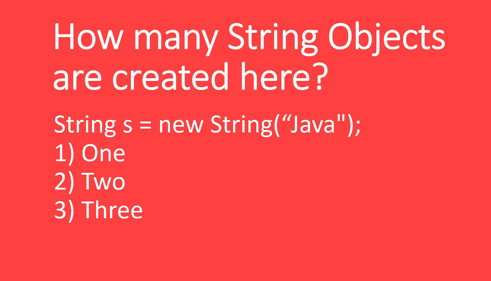
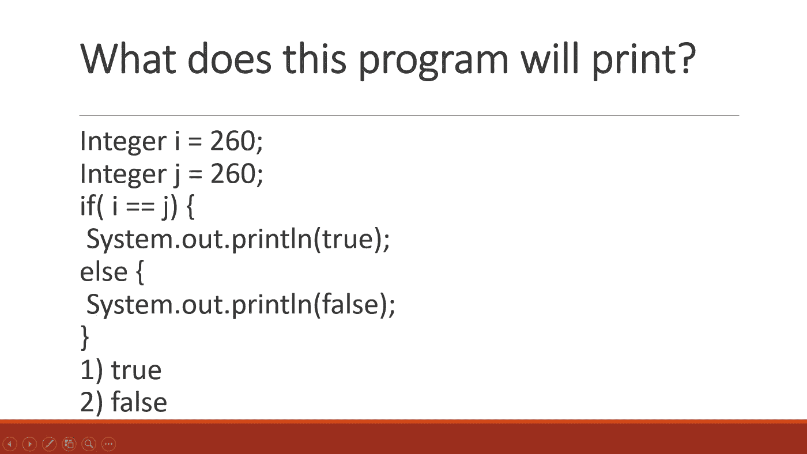

# 2023 年破解 Java 开发者访谈的 25 大主题和资源

> 原文：<https://medium.com/javarevisited/25-topics-and-resources-to-crack-java-developer-interviews-in-2021-8fbfe317513?source=collection_archive---------0----------------------->

## 准备 Java 开发人员面试？这里有一些基本的主题和 500 多个 Java 问题，你可以用相关的书籍、课程和文章来准备

image _ credit—Ace Java 面试培训

大家好，如果你的目标是 2023 年的 Java 开发人员面试，但对如何准备 Java 面试感到困惑，那么你来对地方了。前面我已经分享了 2023 年学习 Java 的 [**最佳书籍**](/javarevisited/5-best-core-java-books-for-beginners-20e3f723e3a)[**课程**](/javarevisited/top-5-java-online-courses-for-beginners-best-of-lot-1e1e240a758) ，今天我要分享的是 2023 年破解 Java 开发者面试的一些有用话题和资源。

Java 面试与科技巨头和基于产品的公司如谷歌、亚马逊、微软或脸书的传统编程面试略有不同。首先，即使它有来自数据结构和算法的问题，如[字符串](http://javarevisited.blogspot.sg/2015/01/top-20-string-coding-interview-question-programming-interview.html)、[链表](/javarevisited/top-20-linked-list-coding-problems-from-technical-interviews-90b64d2df093)或[数组](http://javarevisited.blogspot.com/2015/06/top-20-array-interview-questions-and-answers.html)，如果你不是这方面的专家，你仍然可以设法通过 Java 面试。

问题比那些公司简单一点，也实用一点。关于 Java 面试的另一个基本问题是基于 Java 编程语言和 JDK API 的问题。因为 Java 也是一种面向对象的编程语言，你会在那里找到很多面向对象的问题。

由于 Java 主要是作为一种应用程序编程语言来使用的，因此焦点也相应地与主要集中在 API、 [Java 概念](https://www.java67.com/2015/07/array-concepts-interview-questions-answers-java.html)和[设计模式](http://www.java67.com/2015/12/top-30-oops-concept-interview-questions-answers-java.html)上的问题保持一致。

此外，Java 面试根据应聘者的经历变化很大。例如，有 1 到 2 年或 3 到 4 年经验的初级开发人员将会看到更多关于诸如 [Java 基础](http://www.java67.com/2014/07/21-frequently-asked-java-interview-questions-answers.html)、API 和[数据结构和算法](/hackernoon/50-data-structure-and-algorithms-interview-questions-for-programmers-b4b1ac61f5b0)等主题的问题。

更多像 Java 程序员这样有 5 到 6 年经验的资深开发者会发现更多关于[并发编程](/javarevisited/8-best-multithreading-and-concurrency-courses-for-experienced-java-developers-8acfd3b25094)、Java 并发 API、 [JVM 内部](/javarevisited/7-best-courses-to-learn-jvm-garbage-collection-and-performance-tuning-for-experienced-java-331705180686)、GC 调优、Java 性能的问题。因此，你的准备工作应该与你的经验相一致，而不仅仅是关注常见的编程问题。

此外，Java EE 面试与[核心 Java 面试](http://www.java67.com/2015/03/top-40-core-java-interview-questions-answers-telephonic-round.html)完全不同，因为核心 Java 面试主要关注核心 Java 概念，如并发性、集合和 JVM 内部机制，而 Java EE 面试是基于一个框架，如 JSF、Spring、Hibernate 等。准备 Java 面试的最好方法是参加像 [**Java 面试指南:200+面试问题和答案**](https://click.linksynergy.com/fs-bin/click?id=JVFxdTr9V80&subid=0&offerid=323058.1&type=10&tmpid=14538&RD_PARM1=https%3A%2F%2Fwww.udemy.com%2Fjava-interview-questions-and-answers%2F) 这样的课程，尽管没有什么可以替代你通过认真准备 Java 面试而获得的经验。

<https://click.linksynergy.com/fs-bin/click?id=JVFxdTr9V80&subid=0&offerid=323058.1&type=10&tmpid=14538&RD_PARM1=https%3A%2F%2Fwww.udemy.com%2Fjava-interview-questions-and-answers%2F>  

# 核心 Java 访谈的 25 个以上基本主题

正如我告诉你的，主题的重要性取决于候选人的经历。我会向有 2 年经验的新 Java 开发人员或初级 Java 开发人员询问更多的问题，从 Java 基础知识如字符串、集合、`equals()` 和`hashcode`以及 OOP 概念，但是这些话题对于有 4 到 5 年经验的 Java 开发人员来说太琐碎了。

对于那些，我更喜欢问[并发](https://javarevisited.blogspot.com/2018/06/top-5-java-multithreading-and-concurrency-courses-experienced-programmers.html)、 [JVM 内部](https://javarevisited.blogspot.com/2019/04/top-5-courses-to-learn-jvm-internals.html)、[垃圾收集](http://javarevisited.blogspot.sg/2012/10/10-garbage-collection-interview-question-answer.html)、[测试](https://hackernoon.com/5-courses-java-programmers-can-join-to-learn-junit-and-mockito-in-2019-h74t38r4)、[设计模式](http://javarevisited.blogspot.com/2012/06/20-design-pattern-and-software-design.html)。决定你应该为面试准备哪个话题的另一个因素是工作描述。

> 还有，没有比**职位描述**更好的指南来准备相关话题。

例如，如果你要为一个基于核心 Java 多线程的应用程序工作，那么你应该为核心 Java 主题做好准备，比如[多线程和并发](https://javarevisited.blogspot.com/2018/06/top-5-java-multithreading-and-concurrency-courses-experienced-programmers.html)、 [Java 集合](/javarevisited/50-java-collections-interview-questions-for-beginners-and-experienced-programmers-4d2c224cc5ab)、泛型、[枚举](https://www.java67.com/2013/07/15-java-enum-interview-questions-amswers-for-experienced-programmers.html)、GC 算法和 JVM 内部机制。

同样，如果你要为一个 Java Web 服务应用程序工作，那么就要准备好关于 [REST 和 SOAP](http://javarevisited.blogspot.sg/2015/08/difference-between-soap-and-restfull-webservice-java.html) 、XML、 [JSON](https://www.java67.com/2016/10/3-ways-to-convert-string-to-json-object-in-java.html) 以及其他相关的主题。

对于 Java，web 应用开发者来说， [JSP](https://www.java67.com/2012/10/servlet-jsp-interview-questions-answer-faq-experience.html) ， [Servlet](https://www.java67.com/2021/07/servlet-and-filter-interview-questions-answers-java-.html) ， [Spring](/javarevisited/10-best-online-courses-to-learn-spring-framework-in-2020-f7f73599c2fd) ， [Hibernate](/javarevisited/top-5-hibernate-online-training-courses-for-beginners-and-advance-java-programmers-469460596b2b) 比多线程和 JVM 内部更关键。同样，对于一个 Android 开发者来说，除了 Java 基础知识，了解 Android API 更重要。尽管如此，我还是给那些认真对待面试的 Java 开发人员提供了一个主题列表。

*   **Java 基础知识**
*   **面向对象的概念(** [**问题**](http://www.java67.com/2015/12/top-30-oops-concept-interview-questions-answers-java.html) **)**
*   **数据结构与算法(** [**问题**](http://www.java67.com/2018/06/data-structure-and-algorithm-interview-questions-programmers.html) **)**
*   **多线程、并发和线程基础知识(** [**问题**](http://javarevisited.blogspot.sg/2014/07/top-50-java-multithreading-interview-questions-answers.html#axzz4jaJmaqbE) **)**
*   **日期类型转换与基础(** [**问题**](http://www.java67.com/2018/03/top-50-core-java-interview-questions.html) **)**
*   **垃圾收集(** [**问题**](https://javarevisited.blogspot.com/2012/10/10-garbage-collection-interview-question-answer.html) **)**
*   **Java 集合框架(** [**问题**](https://javarevisited.blogspot.com/2011/11/collection-interview-questions-answers.html) **)**
*   **数组(** [**问题**](http://www.java67.com/2015/07/array-concepts-interview-questions-answers-java.html) **)**
*   **字符串(** [**问题**](http://www.java67.com/2018/06/top-35-java-string-interview-questions.html) **)**
*   **GOF 设计图案(** [**题**](http://www.java67.com/2012/09/top-10-java-design-pattern-interview-question-answer.html) **)**
*   **立体设计原理(试题)**
*   **抽象类和接口(** [**问题**](http://javarevisited.blogspot.sg/2013/04/10-abstract-class-and-interface-interview-question-java-answers.html#axzz4pk4W5ie3) **)**
*   **Java 基础知识比如 equal 和 hashcode (** [**问题**](http://javarevisited.blogspot.sg/2013/08/10-equals-and-hashcode-interview.html) **)**
*   **泛型和枚举(** [**问题**](http://www.java67.com/2013/07/15-java-enum-interview-questions-amswers-for-experienced-programmers.html) **)**
*   **Java IO 和 NIO (** [**问题**](https://javarevisited.blogspot.com/2014/08/socket-programming-networking-interview-questions-answers-Java.html) **)**
*   **常见网络协议(** [**问题**](https://javarevisited.blogspot.com/2014/08/socket-programming-networking-interview-questions-answers-Java.html) **)**
*   **Java 中的数据结构与算法(** [**问题**](http://www.java67.com/2018/06/data-structure-and-algorithm-interview-questions-programmers.html) **)**
*   **正则表达式**
*   **JVM 内部(** [**问题**](http://www.java67.com/2016/10/difference-between-heap-and-stack-memory-in-java-JVM.html) **)**
*   **Java 最佳实践**
*   **JDBC (** [**提问**](https://javarevisited.blogspot.com/2012/12/top-10-jdbc-interview-questions-answers.html) **)**
*   **日期、时间和日历(** [**问题**](http://www.java67.com/2017/08/top-10-date-time-and-calendar-Java-Interview-Questions.html) **)**
*   **Java 中的 XML 处理(** [**问题**](https://javarevisited.blogspot.com/2013/01/10-xml-interview-questions-and-answers.html) **)**
*   **JUnit (** [**提问**](https://javarevisited.blogspot.com/2021/04/junit-interview-questions-with-answers.html) **)**
*   **编程题(** [**题**](https://javarevisited.blogspot.com/2017/07/top-50-java-programs-from-coding-Interviews.html#axzz5bGNdvWgs) **)**

除了这些话题之外，你还可以从《Java 面试暴露<http://www.amazon.com/Java-Programming-Interviews-Exposed-Markham/dp/1118722868?tag=javamysqlanta-20>**和《破解编码面试 》等书中得到帮助。这些都是很棒的书，尤其是从面试的角度来看，它会让你对 Java 编程工作面试有一个很好的想法。你还会发现脸书、谷歌等科技公司以及巴克莱、花旗、德意志银行、摩根士丹利等投资银行提出的问题。

对于一个想要成为专家而不仅仅是专注于清除面试的更认真的开发人员，我建议你看看我的 [12 本面向有经验程序员的高级 Java 书籍](http://www.java67.com/2016/06/12-must-read-advance-java-books-for-intermediate-programmers.html)文章。它包含了 Java 中每个重要主题的书籍。**

****

**如果你在某个主题上有所欠缺，你可以随时回到你读过的书或者你学过的课程去学习类似 Java 的课程。**

**<https://click.linksynergy.com/fs-bin/click?id=JVFxdTr9V80&subid=0&offerid=323058.1&type=10&tmpid=14538&RD_PARM1=https%3A%2F%2Fwww.udemy.com%2Fjava-the-complete-java-developer-course%2F> ** 

# **Java 面试的最佳课程和书籍**

**最近我看到一些优秀的书籍来准备核心 Java 和 web 开发人员的面试，这些书籍更加关注核心 Java 概念，如[多线程](/javarevisited/6-multithreading-and-concurrency-books-every-java-programmer-should-read-b6a08d2aae54)、[合集](/javarevisited/7-best-java-collections-and-stream-api-courses-for-beginners-in-2020-3ad18d52c38)、Java 基础知识等。，还会涉及到 web 开发概念，如 [Web 服务](https://javarevisited.blogspot.com/2018/02/top-5-restful-web-services-with-spring-courses-for-experienced-java-programmers.html)、 [Spring](https://javarevisited.blogspot.com/2018/06/top-6-spring-framework-online-courses-Java-programmers.html) 、 [Hibernate](https://javarevisited.blogspot.com/2018/01/top-5-hibernate-and-jpa-courses-for-java-programmers-learn-online.html) 、 [JSP](http://www.java67.com/2018/02/5-free-servlet-jsp-and-jdbc-online-courses-for-java-developers.html) 、Servlet 等。这些书和课程都很便宜，花费你不到 15 美元，但是给你足够的实践和想法来做好你的 Java 面试。** 

## **1. [Java 面试指南:200+面试问答](https://click.linksynergy.com/fs-bin/click?id=JVFxdTr9V80&subid=0&offerid=323058.1&type=10&tmpid=14538&RD_PARM1=https%3A%2F%2Fwww.udemy.com%2Fjava-interview-questions-and-answers%2F)**

**这是一个了解 Java 面试的绝佳课程。它组织得非常好，几乎涵盖了我们在这里讨论过的所有主题，甚至可能更多，比如 web 服务、spring、hibernate、JDBC 等等。**

**对于入门级 Java 程序员和有经验的 Java 开发人员面试都同样有用。**

****这里是加入本课程的链接** — [Java 面试指南](https://click.linksynergy.com/fs-bin/click?id=JVFxdTr9V80&subid=0&offerid=323058.1&type=10&tmpid=14538&RD_PARM1=https%3A%2F%2Fwww.udemy.com%2Fjava-interview-questions-and-answers%2F)**

****

## **2.[钻研 Java 面试](https://gumroad.com/l/QqjGH)(我的书)**

**这是我写博客 10 年后的第一本书，它包含了 150 页的面试问题，如果你在几天或几个小时内有 Java 面试，这是最理想的。**

**尽管这本书很短，但它涉及了 Java 的许多基本领域——如并发性、收集、性能调优、垃圾收集、面向对象编程、lambdas、流、设计模式、泛型和其他核心 Java 概念。简而言之，如果你下一次 Java 面试的时间不多了，这本书将会帮助你。你也可以**用我的 code friends20 来获得我的 Java 和 Spring 面试书的八折优惠**。**

****这里是购买我的电子书的链接** — [**搜索 Java 访谈**](https://gumroad.com/l/QqjGH)**

****

## **3.[面向高级工程面试的 Java 多线程](https://www.educative.io/courses/java-multithreading-for-senior-engineering-interviews?affiliate_id=5073518643380224)**

**如果你有一个面试，那么我强烈建议你加倍学习并发性，这是一个很好的课程，为 Java 中的多线程和并发性面试问题做准备。并发和多线程可能是大多数面试中提出的最具挑战性的话题，即使对于有经验的开发人员也是如此。然而，掌握并发性将使你比其他受访者有相当大的优势。

在本课程中，你将先睹为快，了解最常见的并发性面试问题，如[生产者-消费者](https://www.java67.com/2012/12/producer-consumer-problem-with-wait-and-notify-example.html)、用餐哲学家、读者-作者、有限缓冲区等，但你也将建立坚实的基础以及高级并发性概念，这些概念将伴随你的职业生涯，并帮助你在面试中表现出最高水平。**

**这是参加本课程的链接。 [Java 多线程高级工程面试](https://www.educative.io/courses/java-multithreading-for-senior-engineering-interviews?affiliate_id=5073518643380224)**

****

**如果你不知道 [Educative](https://www.educative.io?affiliate_id=5073518643380224) 是另一个在线学习平台，它基于文本的交互式学习课程获得了很大的吸引力。阅读通常比观看更快，如果你更喜欢阅读文本而不是观看视频，那么这就是结账的平台。**

**它有一些为编码面试做准备的最好的课程，如[探索编码面试:编码问题的模式](https://www.educative.io/collection/5668639101419520/5671464854355968?affiliate_id=5073518643380224)(这是一门独特的课程，将教你 15 种常见的编码模式，可用于解决 100 多种 Leetcode 问题)和[探索系统设计面试](https://www.educative.io/collection/5668639101419520/5649050225344512?affiliate_id=5073518643380224)。**

**他们还有 9 门课程，一门叫做[**Ace Java 面试**](https://www.educative.io/track/ace-java-coding-interview?affiliate_id=5073518643380224) 的课程，它将帮助你快速掌握你需要知道的一切，以便在 Java 中完成技术面试，涵盖从 cs 基础到系统设计的主题。你不仅要复习理论，还要在此过程中获得大量的实际练习。**

**而且，如果你喜欢这个平台，我建议你购买一个 [**教育订阅**](https://www.educative.io/subscription?affiliate_id=5073518643380224) ，每月花费**【18】美元(现在有 50%的折扣)**，对于需要不断学习的程序员和软件工程师来说完全值得。**

**<https://www.educative.io/subscription?affiliate_id=5073518643380224>  

以上就是关于**如何准备 Java 面试的家伙们**。java 生态系统是巨大的，但根据工作描述，你可以进一步缩小准备范围，如果你要参加核心 Java 面试，那么你应该更多地关注核心 Java 概念，如多线程、集合和 JVM 内部机制。

同样，如果你要去参加 Java web 开发人员的面试，那么你应该更多地关注 web 开发方面，例如安全性，MVC 框架如 Spring、Struts，以及 ORM 框架如 Hibernate 和 iBatis。

**进一步学习**
[完整的 Java MasterClass](https://click.linksynergy.com/fs-bin/click?id=JVFxdTr9V80&subid=0&offerid=323058.1&type=10&tmpid=14538&RD_PARM1=https%3A%2F%2Fwww.udemy.com%2Fjava-the-complete-java-developer-course%2F)
[数据结构和算法:深度挖掘使用 Java](https://click.linksynergy.com/fs-bin/click?id=JVFxdTr9V80&subid=0&offerid=323058.1&type=10&tmpid=14538&RD_PARM1=https%3A%2F%2Fwww.udemy.com%2Fdata-structures-and-algorithms-deep-dive-using-java%2F)
[算法和数据结构—第一、二部分](https://pluralsight.pxf.io/c/1193463/424552/7490?u=https%3A%2F%2Fwww.pluralsight.com%2Fcourses%2Fads-part1)
[搜罗 Java 面试宝典](https://gumroad.com/l/QqjGH)
[搜罗 Spring Boot 面试宝典](https://gumroad.com/l/hrUXKY)

其他 **Java 面试资源**为您

*   过去 5 年的 133 个 Java 面试问题([列表](https://javarevisited.blogspot.sg/2015/10/133-java-interview-questions-answers-from-last-5-years.html))
*   15 数据结构与算法面试题([列表](http://javarevisited.blogspot.com/2013/03/top-15-data-structures-algorithm-interview-questions-answers-java-programming.html))
*   10 个春季框架面试问题([罗列](http://javarevisited.blogspot.com/2011/09/spring-interview-questions-answers-j2ee.html))
*   20 Hibernate 框架面试问题及答案([列表](http://java67.blogspot.com/2016/02/top-20-hibernate-interview-questions.html))
*   50 个 Java 并发面试问题([列表](http://javarevisited.blogspot.com/2014/07/top-50-java-multithreading-interview-questions-answers.html))
*   25 Java 集合面试问题([列表](http://javarevisited.blogspot.com/2011/11/collection-interview-questions-answers.html))
*   Java 开发人员的 10 个 RESTful Web 服务面试问题([列表](http://www.java67.com/2015/09/top-10-restful-web-service-interview-questions-answers.html))
*   10 数据结构与算法课程面试([课程](https://hackernoon.com/10-data-structure-algorithms-and-programming-courses-to-crack-any-coding-interview-e1c50b30b927))
*   50+数据结构和算法题([题](https://hackernoon.com/50-data-structure-and-algorithms-interview-questions-for-programmers-b4b1ac61f5b0))
*   Java 开发人员的 20 个春季 MVC 面试问题([问题](https://javarevisited.blogspot.com/2018/11/top-20-spring-mvc-interview-questions-answers-for-java-developers.html#axzz5aKI6DjLZ))
*   Java 程序员的 20 个 Spring 和 REST 面试问题([问题](https://javarevisited.blogspot.com/2018/02/top-20-spring-rest-interview-questions-answers-java.html#axzz57Kv4wGXe))

感谢你阅读这篇文章，如果你觉得这篇文章有用，值得分享，那么请分享给你的朋友和同事。如果您有任何建议或反馈，或者如果您想分享任何帮助您在 Java 面试中取得好成绩的个人技巧，请留下您的评论。

**附言——**如果你是 Java 开发领域的新手，需要一门全面的课程来学习 Java 并为面试做准备，那么我推荐你去看看 Udemy 网站上由 Tim Buchalaka 开设的[**完整的 Java 大师班**](https://click.linksynergy.com/fs-bin/click?id=JVFxdTr9V80&subid=0&offerid=323058.1&type=10&tmpid=14538&RD_PARM1=https%3A%2F%2Fwww.udemy.com%2Fjava-the-complete-java-developer-course%2F) 课程。这个 80+小时的课程是互联网上最全面的 Java 课程。

<https://click.linksynergy.com/fs-bin/click?id=JVFxdTr9V80&subid=0&offerid=323058.1&type=10&tmpid=14538&RD_PARM1=https%3A%2F%2Fwww.udemy.com%2Fjava-the-complete-java-developer-course%2F> **