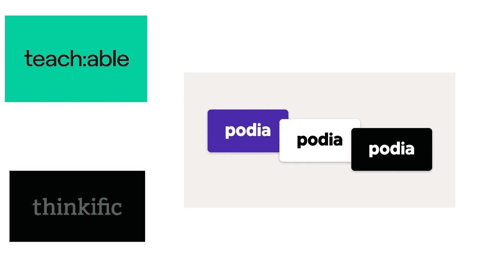
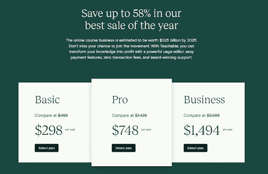

# 2022 年 3 个最佳交易讲师和课程创建者

> 原文：<https://medium.com/javarevisited/3-best-deals-and-discounts-on-online-course-platforms-for-instructors-and-course-creators-659d6917c216?source=collection_archive---------1----------------------->

## 这些是来自 Teachable，Thinkific 和 Podia 的最佳网络星期一 2022 交易，这些是针对讲师的最佳在线课程平台

**披露:** *这个帖子包括附属链接，如果你使用我的链接购买任何交易，我会为你赚取一小笔佣金，没有额外的费用(没有任何！).*

你好，伙计们，如果你计划在 2022 年开始你的在线课程业务，并在热门的在线课程平台上寻找最好的网络星期一交易，如 [Teachable](https://teachable.sjv.io/c/1193463/998814/12646) 、[thinkfic](https://try.thinkific.com/javinpaul8817-blackfriday2424)、Kajabi 和 [Podia](https://podia.sjv.io/c/3294490/1274189/15666?u=https%3A%2F%2Fwww.podia.com%2F) ，那么你来对地方了。在这篇文章中，我将为在线课程教师分享最好的网络星期一交易。

很长一段时间以来，我一直倡导程序员和开发人员创建在线课程，在 2022 年既学习又赚钱，并一直推荐****和**创建他们的在线课程并分享他们的知识。******

******你们中的许多人询问折扣券和交易来开始，这就是为什么我在 2022 年为[思维和教学](/javarevisited/teachable-thinkific-or-udemy-which-is-the-best-platform-for-first-time-course-creators-in-2021-9da6133d73b)平台分享最好的折扣优惠来创建你们的在线课程业务。******

******在当今世界，没有比开设课程更好的教学方式了，这个疫情已经证明，在不久的将来，电子学习将会继续发展。******

******但是，开设课程说起来容易做起来难，尤其是如果你是一个完美主义者。这涉及到很多事情，比如选择相机、麦克风、 [**在线课程托管** **平台**](https://javarevisited.blogspot.com/2020/03/top-5-websites-to-create-online-courses.html) 、 [**工具**](https://javarevisited.blogspot.com/2019/12/how-to-create-online-courses-for-free.html#axzz6enw6Ycw1) ，以及购买其他装备。******

****如果你想投资在线课程创建工具和平台，那么黑色星期五和网络星期一可能是购买任何东西的最佳时机。****

****有很多优惠飞来飞去，很难选择哪一个选择，哪一个放弃，这就是为什么我创建了这个页面，在这里你可以找到最好的黑色星期五和在线课程创作者和教育工作者的网络星期一交易。****

****这是我的第二个这样的列表，昨天，我发布了关于程序员的*的网络星期一最佳交易，我的读者对此非常高兴。*****

*****所以，我想为在线课程的创建者和教育工作者整理一个类似的列表，毕竟，我也打算下一步发布我的课程，猜猜我将和 [Thinkfic](http://try.thinkific.com/javinpaul8817-blackfriday) 一起开始我的在线课程事业。*****

*****我选择 Thinkific 是因为他们提供一流的工具、应用商店、专家培训，并帮助创建和营销你的课程。他们还会不时地举办免费的网络研讨会和免费培训来指导你完成整个过程，除此之外，他们还有一个 [**免费思维计划**](https://try.thinkific.com/javinpaul8817-pricing) 来免费创建你的在线课程，这是最好不过的了。*****

***** [## 使用#1 在线课程平台进行在线教学:Thinkific 定价

### Internet Explorer 与我们的网站不兼容。我们建议使用不同的浏览器，如谷歌浏览器…

try.thinkific.com](https://try.thinkific.com/javinpaul8817-pricing) 

# 面向在线课程讲师和课程创建者的 2022 年网络星期一最佳交易

在不浪费你更多时间的情况下，这里为在线课程创建者和教育工作者列出了一个最好的黑色星期五和网络星期一交易清单。这些交易将对你的课程创建之旅有很大帮助。

## 1.[thinkfic 网络星期一交易 2022-价值 3824 美元，价值 396 美元](http://try.thinkific.com/javinpaul8817-blackfriday)

Thinkific 是最受欢迎的创建高质量在线课程的平台之一。如果你想出售课程，并希望完全控制它们，那么你需要把它们放到像[thinkfic](http://try.thinkific.com/javinpaul8817)或 Teachable 这样的平台上，这就是这笔交易将帮助你的地方。

这笔交易将为您提供创建首个在线课程所需的所有工具。只需花费**396 美元，**您就可以获得价值**超过**3824 美元的限时套装，其中包含所有的工具和培训来指导您完成课程创建之旅。无论你是初学者还是希望将课程提升到更高水平的人，你都将作为一名自信的课程创建者，准备好打造你梦寐以求的在线教育业务，跨入 2022 年。

以下是您将在这个思维捆绑包中获得的内容:

1.  6 个月的[**thinkfic Pro+成长计划**](http://try.thinkific.com/javinpaul8817-omf) (他们最受欢迎的计划)价格为 4。这两个月的自由时间会给你额外的时间来确保你有一个好的开始！
2.  来自 Thinkific 首席教育家的 6 天循序渐进的培训，他将教你如何选择和验证你的课程主题，绘制你的学习旅程和课程，并建立一个有效的营销漏斗。
3.  一流的商业工具
    你可以看到，在 2022 年，你将获得创建首个在线课程所需的一切。我的意思是，这对任何想在 2022 年开设在线课程业务的人来说都是一件大事，相信我，在 11 月 30 日之后，你将不会得到这么多的折扣，所以抓紧时间吧。

以下是获得这笔交易的链接— [**申领你的黑色星期五礼包**](https://try.thinkific.com/javinpaul8817-blackfriday2424)

*****

## *****2.[可教的最佳网络星期一交易(节省高达 58%)](https://teachable.sjv.io/c/1193463/998814/12646)*****

*****teacheble 是另一个受欢迎的在线平台，如果你喜欢 teacheble，这可能是购买他们年度计划的最佳时机，因为你将节省高达 47%或几乎一半的钱。*****

*****有了年度可教计划，你可以通过销售在线课程和辅导产品在网上赚钱。

如果你不知道 [Teachable](https://teachable.sjv.io/c/1193463/998814/12646) 是一个知识商务平台，是像我(还有你)这样的创业者值得信赖的商业伙伴！)，也是任何希望将其专业知识转化为利润的人的资源。*****

*****我喜欢 Teachable 的地方在于，他们去掉了棘手的东西(比如编码和支付处理)，让分享我的知识变得前所未有的容易。功能包括:*****

*   *****无限视频带宽*****
*   *****无限学生*****
*   *****无缝的第三方集成*****
*   *****功能强大、易于使用的页面编辑器*****
*   *****学生测验和课程完成证书*****
*   *****高级定价选项，如订阅和一次性付款*****
*   *****全面的报告工具*****

*****Teachable 还支持[在线辅导](https://teachable.sjv.io/c/1193463/998807/12646)，让你销售和推广一对一辅导、日程安排和吸纳客户，并在一个地方赚钱。

在 Teachable 在网络星期一推广期间加入，你不仅可以节省数百美元，还可以加入其他 100，000 多名创作者的行列，他们在该平台上的总收入超过 5 亿美元，教授从编码到水彩画到外语的一切内容。*****

*****以下是获得可教的黑色星期五交易的链接— [**可教的网络星期一交易**](https://teachable.sjv.io/rnLVgy)*****

**********

## *****3.[Podia](https://podia.sjv.io/c/3294490/1274189/15666?u=https%3A%2F%2Fwww.podia.com%2F)[2022 年最佳 Podia 交易—节省高达 60%]*****

*****这是在 2022 年托管您的在线课程和创建您的在线课程业务的另一个最佳平台。如果你不知道 [Podia](https://podia.sjv.io/c/3294490/1274189/15666?u=https%3A%2F%2Fwww.podia.com%2F) 是一个一体化的数字店面，它为你提供了托管、营销和销售产品所需的一切，例如*****

*   *****支持课程、网络研讨会、数字下载、在线社区等，*****
*   *****不需要第三方应用程序，*****
*   *****超级友好，全天候客户支持，*****
*   *****起价 39 美元/月、零交易费的实惠计划，*****
*   *****你需要的一切，包括销售网页，文件托管，结帐，电子邮件营销，*****
*   *****还有更多。*****

*****[**Podia**](https://podia.sjv.io/c/3294490/1274189/15666?u=https%3A%2F%2Fwww.podia.com%2F) **可以用零头的成本为创作者替代 5+工具！。毫不奇怪，Podia 也在开展黑色星期五和网络星期一活动，并提供有吸引力的折扣和优惠。*******

*****如果你一直在考虑将数字产品添加到你的商业计划中，或者将你现有的产品转移到一个新的平台上，你会想看看 Podia 的这个神奇的 [**黑色星期五-网络星期一交易**](https://podia.sjv.io/c/3294490/1274189/15666?u=https%3A%2F%2Fwww.podia.com%2F) 。*****

***** [## 获得一个免费网站。卖产品。建立你的社区。

### 你的网站是免费的，简单的，漂亮的。Podia 处理开箱即用的技术，因此您可以设置…

podia.sjv.io](https://podia.sjv.io/c/3294490/1274189/15666?u=https%3A%2F%2Fwww.podia.com%2F) 

当您在本周末注册时，您将获得 14 天的免费试用期，并锁定当前计划价格的 10%折扣，并且您将在前两个月节省 50%的费用。这是两个半月的 Podia，仅售 35 美元，因此您可以开始建立您的商店，装载产品，并实现您的梦想！如果你使用我在这篇文章中的链接，你还会得到 10%的额外折扣。

作为一个创作者，销售你的产品有助于你现在和将来增加收入。众所周知，问题在于许多产品平台都面临着巨大的挑战——必须拼凑出不完整的解决方案，需要复杂技术技能的工具，或者会占用你很大一部分收入的费用。

这就是我喜欢波迪亚的原因。它简单、直观、易于使用。它也很实惠，套餐起价仅为**每月 39 美元，没有任何费用。**

** [## Podia 定价

### 我们提供免费计划，以便您可以带着 Podia 兜风！如果您注册了付费计划并希望退款…

podia.sjv.io](https://podia.sjv.io/c/3294490/1274189/15666?u=https%3A%2F%2Fwww.podia.com%2Fpricing) 

Podia 是一个一体化平台，您可以使用它来运营您的整个业务，从托管您的网站和产品到收集电子邮件地址、发送时事通讯和点滴、收款、举办网络研讨会，甚至托管在线社区。

如果你正在考虑转换平台，你不想错过这个开始的机会。立即注册，优惠有效期从美国东部时间黑色星期五(11/26)上午 12:00 到网络星期一东部时间晚上 11:59(11/29)

以下是获得折扣的链接— [**在 Podia 上享受两个月五折优惠**](https://podia.sjv.io/c/3294490/1274189/15666?u=https%3A%2F%2Fwww.podia.com%2Fpricing)

以上是课程创建者的**最佳黑色星期五交易**。我建议你买一个，为明年的在线课程做准备。创建一个在线课程并不容易，但从长远来看，它的回报是巨大的，你也有机会学习和建立你的听众。

如果你有任何关于 Podia，Thinkific，或可教的问题，请告诉我——我很乐意帮忙！

您可能喜欢的其他**在线课程文章**

*   [**推出自己赚钱的在线课程的 7 个步骤**](https://teachable.sjv.io/c/1193463/1014938/12646)
*   [为什么每个开发者都应该创建在线课程](https://javarevisited.blogspot.com/2019/06/why-programmers-should-create-and-sell.html#axzz5zt6Ca1vv)
*   可教的、有思想的还是无意义的——哪一个是课程创作者的最佳平台？
*   [学习如何创建在线课程的前 5 门课程](https://javarevisited.blogspot.com/2019/12/top-5-courses-to-learn-how-to-create-online-courses.html)
*   [5 种资源打造最畅销的在线课程](https://javarevisited.blogspot.com/2019/12/top-5-courses-to-learn-how-to-create-online-courses.html)
*   [学习如何在 10 分钟内创建在线课程](https://javarevisited.blogspot.com/2019/12/how-to-create-online-courses-for-free.html)
*   [创建和销售课程的 5 个最佳网站](https://javarevisited.blogspot.com/2020/03/top-5-websites-to-create-online-courses.html)
*   [创建在线课程作为副业的 10 个理由](https://javarevisited.blogspot.com/2020/03/10-reasons-to-create-online-courses.html)
*   [2022 react . js 开发者路线图](https://javarevisited.blogspot.com/2018/10/the-2018-react-developer-roadmap.html)
*   [面向程序员的 10 大 Pluralsight 课程和认证](https://javarevisited.blogspot.com/2017/12/top-10-pluralsight-courses-java-and-web-developers.html)
*   [2022 年 Java 开发者应该学会的 10 件事](https://javarevisited.blogspot.com/2017/12/10-things-java-programmers-should-learn.html#axzz5atl0BngO)
*   [5 个课程创作者最佳在线教学平台](https://hackernoon.com/5-online-teaching-and-coaching-platforms-for-course-creators-and-bloggers-3lfj302n)

感谢您阅读本文。如果你发现这些**对在线课程创建者**来说是最好的黑色星期五和网络星期一交易，尤其是可教的和有思想的黑色星期五交易是有用的，那么请与你的朋友和同事分享它们。

如果您有任何问题或反馈，或者在创建在线课程、销售或营销方面面临任何问题，请在下面留言，我们将尽力回答您的问题，如果您想采取行动，请从 Thinkific 的免费试用开始。

 [## 思维自由审判

### 轻松上传您的教练计划内容，将其转变为在线课程。我们将向您介绍最佳的方法来…

try.thinkific.com](http://try.thinkific.com/javinpaul8817)*******