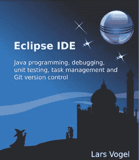
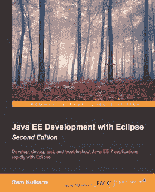
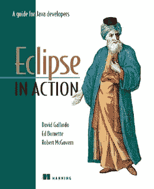

# Java 开发人员的 3 本最佳 Eclipse IDE 书籍

> 原文：<https://medium.com/javarevisited/3-best-eclipse-ide-books-for-java-developers-fef21d474146?source=collection_archive---------3----------------------->

## 这些是我最喜欢的学习 Java 和 JEE 开发 Eclipse IDE 的书籍。我还分享了一些在线课程，你可以加入这些课程，更快更好地学习。

图片—eclipse.org

你好，Java 程序员，如果你正在寻找学习 Eclipse IDE 的最佳资源，那么你来对地方了。之前，我已经分享了针对 Java 开发者的[免费和最好的 Eclipse 课程](/javarevisited/6-free-best-eclipse-ide-courses-for-java-programmers-1229ee9e5d87)。在本文中，我将分享学习 Java 和 JEE 开发 Eclipse IDE 的最佳书籍。

为了成为一名优秀的 Java 开发人员，对 Eclipse IDE 或者你使用的任何 IDE，比如 [Netbeans](https://javarevisited.blogspot.com/2017/03/10-tools-used-by-java-programming-Developers.html) 或者 [IntelliJIDea](https://javarevisited.blogspot.com/2018/09/top-5-courses-to-learn-intellij-idea-java-and-android-development.html) 的扎实知识是必须的。Java 拥有优秀的工具，可以加速应用程序的开发。

ide 或集成开发环境允许你只通过一个工具来编码、运行、测试和调试。

他们是巨大的生产力助推器。因为我已经开始在记事本、TextPad 和 JCreator 中进行 Java 开发编码，所以我知道拥有 ide 的强大功能是什么感觉。

Java 世界里有三大 ide， [Eclipse](https://javarevisited.blogspot.com/2020/05/top-5-courses-to-learn-eclipse-ide-for-java-developers.html) ，NetBeans 和 [IntelliJIDEA](/javarevisited/7-best-courses-to-learn-intellij-idea-for-beginners-and-experienced-java-programmers-2e9aa9bb0c05) 。前两个是免费的，第三个需要许可证。我使用 Eclipse，它也是 Java 世界中最流行的 IDE。

关于 [Eclipse 生产力小技巧](http://javarevisited.blogspot.com/2011/07/java-debugging-tutorial-example-tips.html)和[有用的快捷方式](http://javarevisited.blogspot.com/2010/10/eclipse-tutorial-most-useful-eclipse.html)我在这个博客里写了很久，但是从来没有分享过一些学习 Eclipse IDE 的好书。

直到一位读者在脸书上与我聊天，并向我寻求一些建议，我才想到这个问题，因为他正在与 Eclipse 搏斗，他的项目需要他在 Eclipse IDE 上工作。

本文献给所有想更好地学习 Eclipse IDE 的 Java 程序员。没关系，无论你是核心 Java 程序员还是 Java EE 开发人员，你都会从这些 Eclipse 书籍中学到很多东西。您不仅将学习如何有效地使用 Eclipse IDE，还将学习 Eclipse 的一些隐藏的宝石，这将有助于您的日常工作。投入一些时间和金钱来学习 Eclipse IDE 本身总是值得的，这将使您在 Eclipse IDE 中更有效率。

顺便说一句，和这些书一起，我还推荐你去看看 Udemy 的 [**初学 Eclipse Java IDE 培训课程**](https://click.linksynergy.com/fs-bin/click?id=JVFxdTr9V80&subid=0&offerid=323058.1&type=10&tmpid=14538&RD_PARM1=https%3A%2F%2Fwww.udemy.com%2Fbeginners-eclipse-java-ide-training-course%2F) 以更互动的方式学习。

<https://click.linksynergy.com/fs-bin/click?id=JVFxdTr9V80&subid=0&offerid=323058.1&type=10&tmpid=14538&RD_PARM1=https%3A%2F%2Fwww.udemy.com%2Fbeginners-eclipse-java-ide-training-course%2F>  

# Java JEE 开发人员学习 Eclipse IDE 的 3 本最佳书籍

在不浪费你更多时间的情况下，这里有我最喜欢的学习 Java 和 JEE 开发 Eclipse IDE 的书籍。这些书是由像 Lars Vogel 和其他每天使用 Eclipse IDE 的专家写的。

这些书不仅能帮助你更好地用 Java 编写代码，还能帮助你更快地运行和调试 Java 应用程序。您还将能够更好地在类、方法和包之间导航。

IDE 是读写代码的必备工具，这些书将教你如何掌握 Eclipse IDE，成为更好的 Java 程序员。

## 1.Eclipse IDE (vogella) Kindle 版

如果您刚刚下载了面向 Java 或 JEE 开发人员的 Eclipse IDE，并且不确定如何开始，请阅读 Lars Vogel 的 [Eclipse IDE (vogella)](http://www.amazon.com/Eclipse-IDE-vogella-Lars-Vogel-ebook/dp/B006O1J39S/?tag=javamysqlanta-20) 。这是一本 Kindle 书籍，但却是从头开始学习 Eclipse 的最佳书籍之一。

这本书假设没有先验知识，可以被一个新的 Java 开发人员用来学习 Eclipse。如果你想成为一个更有生产力的 Java 开发者，这是一本必不可少的读物。

它涵盖了 Eclipse IDE 的更新版本，因此是市场上学习 Eclipse 的更新书籍之一。

而且，如果你想要更主动的学习体验，那么你也可以将这本书与 Pluralsight 的[**Eclipse Guided Tour-Part 1 和 2**](https://pluralsight.pxf.io/c/1193463/424552/7490?u=https%3A%2F%2Fwww.pluralsight.com%2Fcourses%2Feclipse-guided-tour-part1) 课程结合起来，进行更主动的学习。

<https://pluralsight.pxf.io/c/1193463/424552/7490?u=https%3A%2F%2Fwww.pluralsight.com%2Fcourses%2Feclipse-guided-tour-part1>  

虽然你需要一个 Pluralsight 会员才能加入这个每月花费约 29 美元的课程，但你也可以使用他们的 [**10 天免费 tria**](https://pluralsight.pxf.io/c/1193463/424552/7490?u=https%3A%2F%2Fwww.pluralsight.com%2Fpricing%2Ffree-trial) l 免费加入这个课程。

## 2.**用 Eclipse 开发 Java EE**

如果您是 Java web 开发人员，并且使用 JEE 进行后端开发，那么请记住，您需要 Eclipse IDE 供 Java EE 开发人员访问数据库。

它包含数据库开发工具，如 database explorer。默认情况下，面向 Java 开发人员的 Eclipse IDE 不包含这些工具。仅供参考，我正在使用面向 Web 开发人员的 Eclipse Java EE IDE，版本:Kepler Service Release 2。

这也是 Ram Kulkarni 的[**Java EE Development with Eclipse**](http://www.amazon.com/Java-Development-Eclipse-Ram-Kulkarni-ebook/dp/B014HFNB40/?tag=javamysqlanta-20)的书，它将帮助您直接从 Eclipse IDE 编写代码、调试、测试和诊断 Java EE 7 应用程序。Java EE 开发人员的最佳 Eclipse 书籍之一。

## 3. [Eclipse 在行动:Java 开发人员指南](http://www.amazon.com/Eclipse-Action-Guide-Java-Developer/dp/1930110960?tag=javamysqlanta-20)

我推荐的第三本书是最受欢迎的一本书，你们中的许多人已经知道了，大卫·盖拉多的《Eclipse in Action:Java 开发人员指南》。

一旦你下载了 Eclipse，并意识到它非常庞大，你就需要一本教科书来帮助你前进。

这本书充满了实用的提示、技巧和逐步指南，告诉你如何运行 Java 程序或如何远程调试 Java 程序。

这本书将告诉你关于 Eclipse 特性、插件以及如何使用 Eclipse 进行 Java JEE 开发的一切。

而且，如果你需要一门课程，我建议你把这本书和 Udemy 的 [Eclipse 调试技术和技巧](https://click.linksynergy.com/fs-bin/click?id=JVFxdTr9V80&subid=0&offerid=323058.1&type=10&tmpid=14538&RD_PARM1=https%3A%2F%2Fwww.udemy.com%2Feclipse-debugging-techniques-and-tricks%2F)课程结合起来。这是一门在短时间内学习重要知识的好课程。

<https://click.linksynergy.com/fs-bin/click?id=JVFxdTr9V80&subid=0&offerid=323058.1&type=10&tmpid=14538&RD_PARM1=https%3A%2F%2Fwww.udemy.com%2Feclipse-debugging-techniques-and-tricks%2F>  

以上是 Java 开发人员可以阅读的所有关于 Eclipse IDE 的最佳书籍，以便在 Eclipse IDE 内外学习，并最大限度地利用它进行 Java 和 JEE 开发。这些书不仅会教你如何在 Eclipse 中运行和调试 Java 程序，还会教你如何编写 JSP，如何使用 JSP 和 Servlet 来辅助内容，如何安装 Tomcat 服务器来运行 Eclipse 中的 Java web 应用程序等等。简而言之，开始使用 Eclipse IDE 时的好伴侣书籍之一。

其他 **Java Eclipse 文章**你可能喜欢探索

*   Java 开发人员的 30 个有用的 Eclipse 快捷方式([列表](http://javarevisited.blogspot.com/2010/10/eclipse-tutorial-most-useful-eclipse.html))
*   如何在 Eclipse 中远程调试 Java 应用程序？([教程](http://javarevisited.blogspot.sg/2011/02/how-to-setup-remote-debugging-in.html))
*   Java 开发人员应该知道的 10 个 Eclipse 调试技巧？([见此处](http://javarevisited.blogspot.com/2011/07/java-debugging-tutorial-example-tips.html))
*   如何从 Eclipse 创建一个可执行的 JAR 文件？([例](http://java67.com/2014/04/how-to-make-executable-jar-file-in-Java-Eclipse.html))
*   Java 开发人员学习 Eclipse IDE 的 3 本书([列表](http://javarevisited.blogspot.com/2016/03/3-books-to-learn-eclipse-ide-for-java-jee-programmers.html))
*   如何在 Eclipse 中附加 JAR 文件的源代码？([导轨](http://javarevisited.blogspot.com/2012/12/how-to-attach-source-in-eclipse-Jar-JDK-debugging.html))
*   我最喜欢的学习 Spring Boot 的免费课程([课程](/javarevisited/10-free-spring-boot-tutorials-and-courses-for-java-developers-53dfe084587e))
*   初学者学习 Eclipse 和 JUnit 的 5 本免费书籍([课程](https://www.java67.com/2018/02/5-free-eclipse-and-junit-online-courses-java-developers.html))
*   Eclipse 打印 System.out.println 语句的快捷方式？([快捷键](http://javarevisited.blogspot.com/2012/10/eclipse-shortcut-to-systemoutprintln-in-java.html))
*   如何在 Eclipse 中增加控制台缓冲区大小？([步骤](http://javarevisited.blogspot.com/2013/03/how-to-increase-console-buffer-size-in.html))
*   Eclipse 中如何用空格代替制表符？([导轨](http://javarevisited.blogspot.com/2016/06/how-to-make-eclipse-use-spaces-instead.html))
*   如何增加运行在 Eclipse 中的 Java 程序的堆大小？([向导](http://www.java67.com/2016/02/how-to-increase-heap-size-of-java-program-eclipse-command-line.html)
*   初学者学习 Java 的十大课程([课程](/javarevisited/top-5-java-online-courses-for-beginners-best-of-lot-1e1e240a758))

感谢您阅读本文。如果你喜欢这篇文章，那么请分享给你的朋友和同事。如果您有任何问题或反馈，请发表评论。

**P. S.** —如果你喜欢 IntelliJIDEA 胜过 Eclipse，并且正在寻找一些免费资源来学习 IntelliJIDEA 以便更好地进行 Java 编程，那么我也建议你在 Udemy 上查看这个免费的 IntelliJIDEA 课程 。这是一门提高你在 IntelliJIDEA 上的生产力的伟大课程。

<https://click.linksynergy.com/deeplink?id=JVFxdTr9V80&mid=39197&murl=https%3A%2F%2Fwww.udemy.com%2Fcourse%2Fintellij-idea-ide%2F> 