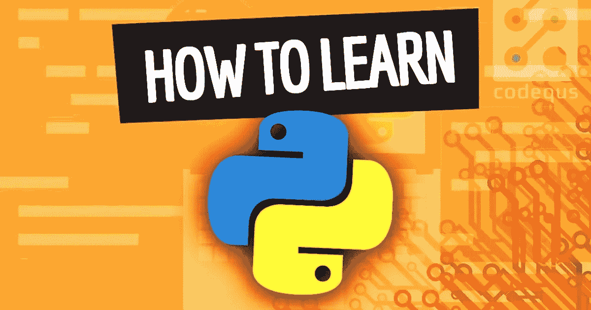
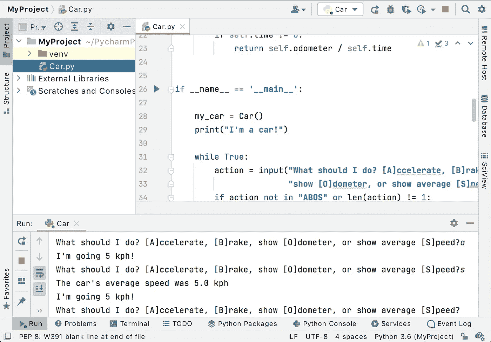
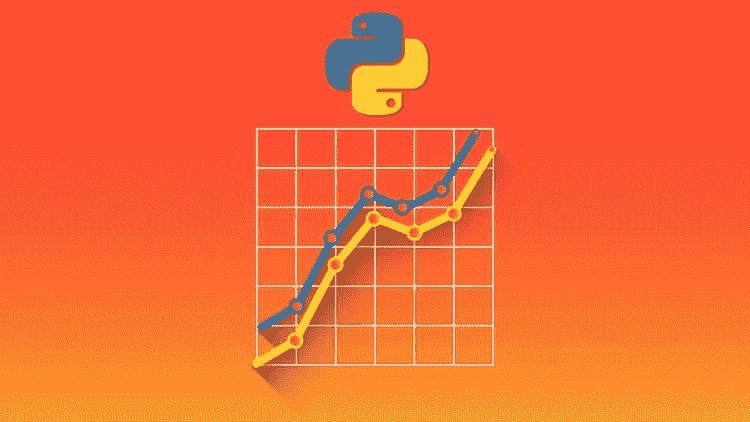
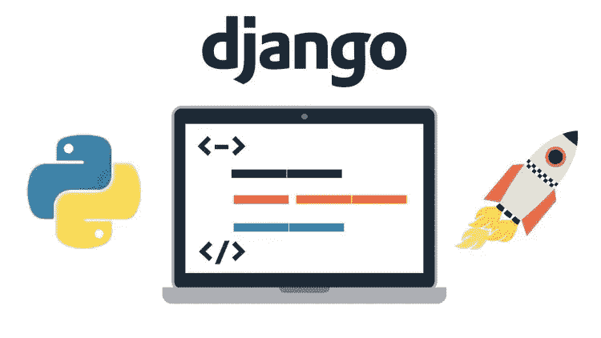
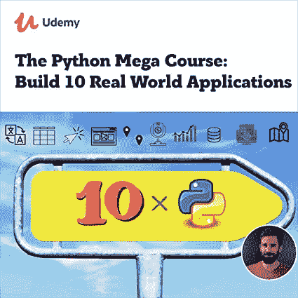
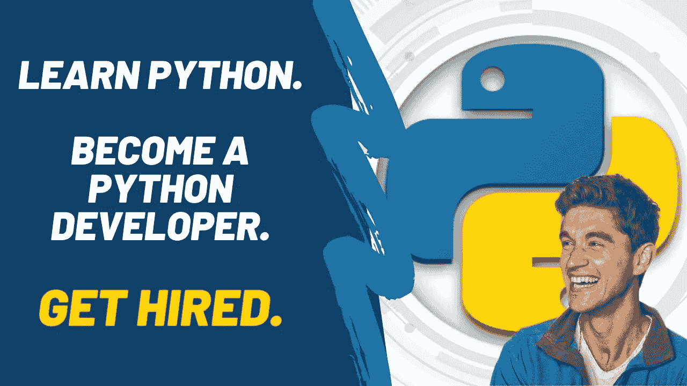

# 7 天内学习 Python 编程语言的前 3 个 Udemy 课程

> 原文：<https://medium.com/javarevisited/3-best-python-bootcamp-courses-to-learn-python-online-in-7-days-f0b199f50e6a?source=collection_archive---------0----------------------->

## 使用 Udemy 的在线 Python 在线课程在 7 天内学习 Python 编程的分步指南

大家好，如果你想在 7 天或一周内自学 Python 编程语言，并寻找最好的在线 Python 资源，那么你来对地方了。

在过去，我已经分享了 [**最好的 Python 课程**](/javarevisited/10-best-python-3-courses-on-udemy-ddd4e3ec5dbf) 、 [**书籍**](https://javinpaul.medium.com/best-python-books-a93d1a0d842d) 、 [**教程**](/javarevisited/10-free-python-tutorials-and-courses-from-google-microsoft-and-coursera-for-beginners-96b9ad20b4e6) ，今天，我将与您分享通过加入 Udemy 上最好的 Python 课程(我最喜欢和最实惠的在线学习网站之一)在 7 天内从零开始学习 Python 编程的具体步骤。

经过充分的研究，结合自己的经验，我在一周的时间里，选择了两个 [*最好的 Python Bootcamp 课程*](https://becominghuman.ai/7-best-python-online-courses-for-beginners-to-learn-programming-abe12cecb1ad) ，可以用来从零开始学习 Python。

你不需要参加这两个在线课程，事实上，你只需要参加其中一个课程，然后每天花大约 4 到 5 个小时观看课程和做练习，这应该足够在 7 天内**学会 Python**。

Python 是一种高级的、[面向对象的编程语言](/javarevisited/my-favorite-courses-to-learn-object-oriented-programming-and-design-in-2019-197bab351733?source=---------103------------------)早在 1989 年由一位名叫吉多·范·罗苏姆的程序员创建，因为他希望一种编程语言是开源的，现在这种语言可以在许多方面工作，例如数据可视化、web 开发以及更多的行业等等。

你将看到的这两个在线课程涵盖了在一周内成为一名 [python 开发者](https://javarevisited.blogspot.com/2019/01/10-web-development-frameworks-fullstack-developer-should-learn.html)的所有基础知识，但如果你对如何开始感到困惑，你还会看到一些 youtube 视频，向你展示每天应该学习的内容。

# Udemy 上的 3 门最佳 Python 课程，让你在 7 天内学会编程语言

现在，让我们开始通过 7 天学习 Python 的计划，成为一名可以自动化事物和从 web 上废弃数据的 Python 开发人员。一个 Python 开发人员，他也可以编写面向对象的程序，并且可以阅读其他编码人员编写的 Python 脚本。

成为 Python 开发人员的第一步是参加一个全面而有趣的 Python 课程。所以，让我们从 Udemy 网站上找出只需 10 美元就能买到的最好的 Python 课程

## 1.[何塞·波尔蒂利亚完成 Python 训练营](https://click.linksynergy.com/deeplink?id=JVFxdTr9V80&mid=39197&murl=https%3A%2F%2Fwww.udemy.com%2Fcourse%2Fcomplete-python-bootcamp%2F)

这个训练营式的在线课程是你自学 python 的最佳资源。本课程首先学习 python 对象和数据结构比较运算符函数以及一些基础知识，然后学习一些高级知识，如面向对象编程和创建一些项目，如 web 抓取和使用 python 的电子邮件，以及更多项目，等等。

这门课程教给你的东西比我在这里列出的要多得多，如果你能在一周内完成这门课程，就把自己当成一名 [python 开发者](/javarevisited/8-advanced-python-programming-courses-for-intermediate-programmer-cc3bd47a4d19)。它的结构非常好，内容非常好，音频质量非常好，可以提供更好的学习体验。如果你真的想自学 Python 编程语言，我强烈推荐你参加这个课程。它非常便宜，你只需要花一杯星巴克咖啡的钱就可以学会 Python。

现在，如果你觉得这门课有点难，或者出于某种原因你不想上，我会告诉你要在一周内成为一名 python 开发者，你每天都要学些什么。

**这里是加入本课程的链接** — [完整的 Python Bootcamp 课程](https://click.linksynergy.com/deeplink?id=JVFxdTr9V80&mid=39197&murl=https%3A%2F%2Fwww.udemy.com%2Fcourse%2Fcomplete-python-bootcamp%2F)

## 第 1 天— Python 基础知识、变量、循环

你想学习的每一种编程语言都是从基础开始的，如何使用它们的变量和循环，以及让你能够创建一些像处理用户输入这样的小程序的基础，YouTube 上有许多视频向你展示如何用 python 来做这些，比如 YouTube 上 Edureka 的这个[课程](https://click.linksynergy.com/deeplink?id=JVFxdTr9V80&mid=39197&murl=https%3A%2F%2Fwww.udemy.com%2Fcourse%2Fcomplete-python-bootcamp%2F)，作为初学者学习 python 基础。

## 第 2 天—功能模块

每个程序都需要一些在同一个程序中反复编写的代码，函数模块的真正力量来了，你可以在一个函数中编写一小段代码，并且想调用多少次就调用多少次，这段 YouTube [视频](https://www.youtube.com/watch?v=qbWBhyGmCs0)向你展示了如何用 python 实现它。

## 第 3 天—基本库

python 的真正力量来了，它的一系列库被用于各种行业，如机器学习和数据可视化，数以千计的库你只需搜索你想用 Python 实现什么行业，就会有大量的视频和教程出现在你面前。如果需要课程，也可以在 Udemy 上查看[熊猫数据分析和 Python](https://click.linksynergy.com/deeplink?id=JVFxdTr9V80&mid=39197&murl=https%3A%2F%2Fwww.udemy.com%2Fcourse%2Fdata-analysis-with-pandas%2F) 课程。

## 第 4 天—文件处理、数据库访问。

现在，我们将继续学习如何与文件交互，比如在文件内部写东西等等，这将在许多方面帮助你，比如与数据库交互并使其充满信息，所以如果你想成为一名 web 开发人员，可以考虑学习这些技能，这个[视频](https://www.youtube.com/watch?v=aequTxAvQq4)将向你展示如何用 python 处理文件。

## 第 5 天——使用 Django 创建 web 应用

如果你已经学会了如何在数据库中使用 python，这一技能将帮助你使用 Django 创建 web 应用程序，实际上，学习 web 开发是非常有趣的，而且现在很受欢迎，本[课程](https://click.linksynergy.com/deeplink?id=JVFxdTr9V80&mid=39197&murl=https%3A%2F%2Fwww.udemy.com%2Fcourse%2Fpython-and-django-full-stack-web-developer-bootcamp%2F)将教你如何使用 Django 构建 web 应用程序。

## 第 6 天—机器学习

机器学习是最有趣的话题之一，也是对深度学习和人工智能的介绍。它通过向算法输入输入和输出来工作，然后它学习并可以根据你输入的数据预测未知的输出。如果你需要在线课程来进一步学习机器学习，你也可以查看我的列表[最佳机器学习课程](/javarevisited/top-10-machine-learning-and-data-science-certifications-and-training-courses-for-beginners-and-a6308497b764)来找到更多课程进行进一步学习。

## 第 7 天—构建项目

在花了六天时间学习 python 和库的一些技能后，你必须通过在创建项目中尽可能多地练习来测试你的知识，你可以在 Udemy 上看到这个 [Python 大型课程](https://click.linksynergy.com/deeplink?id=JVFxdTr9V80&mid=39197&murl=https%3A%2F%2Fwww.udemy.com%2Fcourse%2Fthe-python-mega-course%2F)来构建一些真实世界的项目，你可以从中吸取经验。

## 2.[2021 年完成 Python 开发者:零到精通](https://click.linksynergy.com/deeplink?id=JVFxdTr9V80&mid=39197&murl=https%3A%2F%2Fwww.udemy.com%2Fcourse%2Fcomplete-python-developer-zero-to-mastery%2F)

学习完之后，你已经是一名 Python 开发者了，但是如果因为某些原因你不喜欢第一门课程，并且觉得很难跟上，你可以尝试学习 Andrei Neagoie 的[*2021 年完整 Python 开发者:零到精通*](https://click.linksynergy.com/deeplink?id=JVFxdTr9V80&mid=39197&murl=https%3A%2F%2Fwww.udemy.com%2Fcourse%2Fcomplete-python-developer-zero-to-mastery%2F) 课程。

Andrei Negaoie 的完整 python 开发者课程可能是教你从开始到高级如何编码和使用列表字典[面向对象编程](/javarevisited/6-best-object-oriented-programming-books-and-courses-for-beginners-d46235cbda49)使用 python 和更高级的功能(如 decorators 调试规范表达式)以及如何在机器学习数据科学报废数据等方面实现 Python 的大量课程之一。

最棒的是，安德烈知道如何教学，他的课程提供了最好的学习体验。在课程方面，它类似于何塞·波尔蒂利亚的 Python 课程，但你可能会喜欢安德烈的风格和介绍，这对学习很重要。

你也可以在加入之前观看这两个课程的预习课，然后按照我建议的每天的步骤在 7 天内学习 Python 编程。

**这里是加入本课程的链接**——[2021 年完成 Python 开发者:零到精通](https://click.linksynergy.com/deeplink?id=JVFxdTr9V80&mid=39197&murl=https%3A%2F%2Fwww.udemy.com%2Fcourse%2Fcomplete-python-developer-zero-to-mastery%2F)

## 另一个 Python 训练营课程[奖金]

最后，我想提一下 udemy 中的另一门好课程，它也可以让你在短时间内成为一名 python 开发人员。是的，我说的是 [**100 天的代码:2023 年完整的 Python Pro boot camp**](https://click.linksynergy.com/deeplink?id=JVFxdTr9V80&mid=39197&murl=https%3A%2F%2Fwww.udemy.com%2Fcourse%2F100-days-of-code%2F)课程，由 Angela Yu 教授，这是另一个很棒的 Python 初学者课程，如果你能更好地适应 Angela 的教学风格，那么你也可以加入这个课程。

以上就是关于**如何利用 Udemy 课程在 7 天内学会 Python 编程语言**。在完成了我在本文中列出的大部分内容后，你将有能力在 7 天内，在一周或更短的时间内创建自己的 python 程序，而你学习这门语言所花的时间完全取决于你的努力以及你有多少空闲时间来开始练习和练习以学习更多。

如果你真的想深入学习 Python，这里有更多免费和付费的资源供你进一步学习

*   [2023 年学习 Python 的 10 个理由](https://javarevisited.blogspot.com/2018/05/10-reasons-to-learn-python-programming.html)
*   [5 Python 中的数据科学与机器学习课程](https://javarevisited.blogspot.com/2018/03/top-5-data-science-and-machine-learning-online-courses-to-learn-online.html)
*   [10 门 Python 课程和程序员认证](https://javarevisited.blogspot.com/2020/02/10-best-coursera-courses--for-python.html)
*   [2023 年学习 Python 的 5 本最佳书籍](/javarevisited/best-python-books-a93d1a0d842d)
*   [Python 开发者的五大 Web 开发框架](https://javarevisited.blogspot.com/2019/04/top-5-python-web-development-frameworks.html)
*   Python 和 JavaScript，从哪个开始比较好？
*   [面向初学者的 15 门免费 Python 编程课程](/swlh/5-free-python-courses-for-beginners-to-learn-online-e1ca90687caf)
*   [Udemy 课程回顾——何塞·波尔蒂利亚的 Python 训练营](https://javarevisited.blogspot.com/2020/10/the-complete-python-bootcamp-go-from-zero-to-hero-udemy-course-review.html)
*   [深入学习 Python 的 10 门免费在线课程](https://javarevisited.blogspot.com/2018/12/10-free-python-courses-for-programmers.html)
*   [学习数据科学的 5 大 Python 书籍](https://javarevisited.blogspot.com/2019/08/top-5-python-books-for-data-science-and-machine-learning.html)
*   [面向程序员的 10 本免费 Python 编程书籍](http://www.java67.com/2017/05/top-7-free-python-programming-books-pdf-online-download.html)
*   [8 个 Python 项目，适合初学者学习 Python](/javarevisited/8-projects-you-can-buil-to-learn-python-in-2020-251dd5350d56)
*   [为什么 Python 是数据科学的最佳编程语言](https://javarevisited.blogspot.com/2020/05/why-python-is-best-programming-language.html)
*   [免费学习 Python 编码的五大网站](https://javarevisited.blogspot.com/2019/09/5-websites-to-learn-python-for-free.html)

感谢您阅读本文。如果你喜欢这些 *Python 课程，并打算用 7 天时间*学习 Python，那么请把这篇文章分享给你的朋友和同事。如果您有任何问题或反馈，请留言，如果您有我应该参加或阅读的 Python 课程或书籍，请随时与我们分享。

**p . s .——**如果你更喜欢互动阅读和边做边学，而不是看书或看视频，那么你也可以看看[**CodeCademy Learn Python 3 course**](https://bit.ly/learnpython3codecademy)，这是一门边做边学 Python 的很棒的课程。这是他们职业套装的一部分，但值得学习。他们现在还提供 50%的 code CYBER21 优惠。

<https://bit.ly/learnpython3codecademy> 