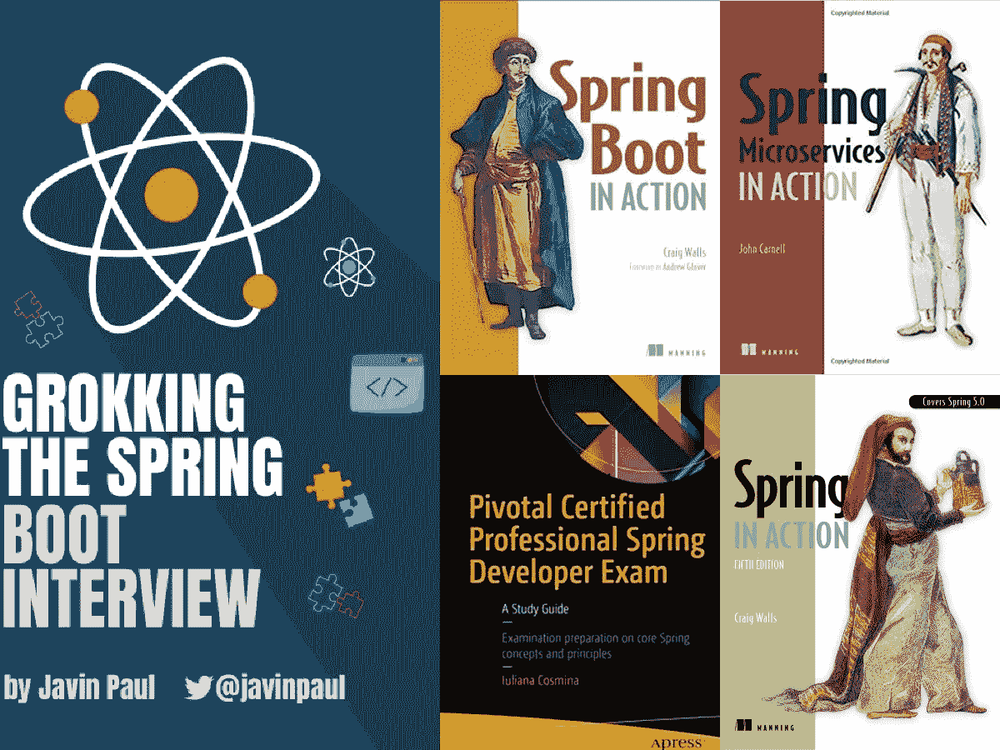
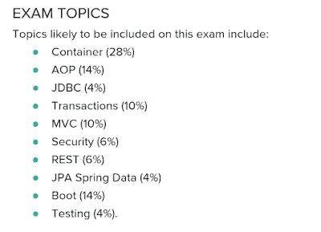

# 面向 Java 开发人员的 3 本最佳 Spring 认证书籍和课程

> 原文：<https://medium.com/javarevisited/3-best-spring-professionals-certification-books-and-courses-for-java-developers-935296c3709?source=collection_archive---------1----------------------->

## 这些是你为 2023 年春季专业认证 Vmware EDU-1202 考试做准备时可以阅读的最佳书籍

春季认证书

你好，Java 程序员，如果你正在准备 Spring Professional 认证并寻找最好的书籍和课程，那么你来对地方了。

之前我已经分享了学习 [Spring 框架](/javarevisited/10-best-spring-framework-books-for-java-developers-360284c37036)、 [Spring Boot](/javarevisited/top-10-courses-to-learn-spring-boot-in-2020-best-of-lot-6ffce88a1b6e?source=---------39------------------) 、 [Spring Security](/javarevisited/top-10-courses-to-learn-spring-security-and-oauth2-with-spring-boot-for-java-developers-8f0222d6066d?source=---------5-----------------------) 、 [Spring Cloud](/javarevisited/5-best-courses-to-learn-spring-cloud-and-microservices-1ddea1af7012) 和[微服务](/javarevisited/7-free-microservices-courses-for-java-programmers-c9b2f3a2ea7d)的最佳课程，在这篇文章中，我将分享你可以加入的最佳书籍和课程，以从头开始准备 Spring 专业认证。

自从 Vmware 取消了成为 Spring 认证开发人员的强制培训要求后，许多 Spring 开发人员一直在寻求好的资源来准备 Spring Professional V5.0 考试，如书籍、课程、模拟考试、学习笔记等。通过自学为[弹簧芯认证](https://javarevisited.blogspot.com/2018/08/how-to-crack-spring-core-professional-certification-exam-java-latest.html#axzz5j90KOik7)做准备。

因为，早些时候，如果不参加在线或教师指导的核心 Spring 培训，就不能参加 Spring 认证考试，这在美国和北美要花费大约 3200 美元，在印度要花费 50K INR，所以许多有经验的 Spring 开发人员不愿成为认证的 Spring 开发人员。

既然限制已经取消，而且参加 Spring 认证也不是强制性的，许多在 Spring 框架方面有良好工作经验的 Java 开发人员希望他们的技能得到认可。

对于初级和中级 Java 开发人员来说，这也是一个非常好的机会，因为你只需要花 200 美元购买一张考试券，就可以将这个受欢迎的认证添加到你的简历中。甲骨文 [Java 认证](http://www.java67.com/2017/05/how-to-prepare-for-java-certifications.html)甚至更便宜，在美国大约要 246 美元，在印度 10K 印度卢比左右。Spring 是近十年来最流行的 Java 框架之一。在 2002 年 10 月引入依赖注入的概念后，Spring 已经走了很长的路，成为默认的 Java 应用程序开发框架。随着 Spring 的流行，对具有 Spring 技能的 Java 开发人员的需求也在增长，到目前为止，Spring 仍然是在 Java web 开发领域获得工作的关键技术。

在你的简历中加入 Spring 认证(VMware EDU-1202)不仅可以增加你对 Spring 框架的了解，还可以增加你获得你正在争夺的 Java 开发人员职位的机会，因此我建议所有 Java 开发人员都成为 Spring 认证专家。

# 准备 2023 年 Vmware 春季专业认证考试的 3 本最佳书籍

这里有几本好书和课程，可以为 Spring Core 或 Spring 专业认证考试做准备。业界也认可像[甲骨文认证 Java 开发者](http://www.java67.com/2017/05/10-free-java-8-certification-sample-questions-OCAJP8-OCPJP8-Mock-Exams.html)和 [Pivotal 认证 Spring 开发者](http://www.java67.com/2017/06/is-it-possible-to-take-spring-certification-without-training.html)这样的认证开发者。

Spring 框架背后的公司 Vmware 提供了几个基于 Spring 的认证，比如 Spring 专业认证考试(VMware EDU-1202)来认可你的 Spring 核心技能。

## 1. [Pivotal 认证专家 Spring 开发者考试:学习指南](https://www.amazon.com/Pivotal-Certified-Professional-Spring-Developer/dp/1484208129?tag=javamysqlanta-20)

Iuliana Cosmina 的 Pivotal Certified Professional Spring Developer 考试的第一版是 Spring core verification(如 Spring Professional V5.0 考试)的唯一学习指南。这本书的好处在于它涵盖了官方学习指南中给出的所有考试主题，并且是一个认证结构，即每章后都包含测验和练习题，以使您熟悉从考试角度来看很重要的概念。

你还可以在书中找到一些有用的春季认证小贴士。简而言之，如果你依靠自学而不是培训，这是一本准备春季核心认证的理想书籍。

为了更好的准备，我也建议你把这本书和 Udemy 上的 [**春季专业认证考试教程——模块 01**](https://click.linksynergy.com/deeplink?id=JVFxdTr9V80&mid=39197&murl=https%3A%2F%2Fwww.udemy.com%2Fcourse%2Fspring-certified-tutorial%2F) 课程结合起来。这是一门特别的课程，它牢记这次考试，并且回答了官方春季考试指南中的所有问题。

由于春季培训材料是为春季认证[而设计的，而且直到上个月，培训都是强制性的，所以许多考生参加培训只是为了使用学习材料为春季核心认证做准备。这意味着完全不需要任何春季认证的学习指南。

现在限制已经取消，培训是可选的，许多](/javarevisited/does-vmware-spring-professional-certification-worth-it-183d7b770df2)[有经验的 Java 和 Spring 开发人员](/javarevisited/the-java-programmer-roadmap-f9db163ef2c2)，他们更喜欢自学而不是课堂培训，正在寻求获得认证。我预计会有更多的书籍和学习指南进入市场，但在那之前，你可以使用这两本书来准备 Spring 核心认证，我的意思是，Spring Professional v5.0 考试。

你还可以做的一件事就是购买 [**大卫·梅尔的春季模拟考试**](https://www.certification-questions.com/practice-exam/spring/professional?affiliateCode=fcff36fd-557a-4713-abf6-973e9924770f&utm_source=Javin&utm_medium=affiliate&utm_campaign=affiliate) ，这将帮助你熟悉考试模式和你在真实考试中可以预期的问题水平。你可以使用这个模拟器来提高你的速度和准确性，以及填补你的知识空白。这也会帮助你找到自己的强项和弱项。

 [## 春季专业实践测试|

### 每个问题都有详细的解释。我们的网络模拟器和移动应用程序不仅仅是为了练习，而是…

www.certification-questions.com](https://www.certification-questions.com/practice-exam/spring/professional?affiliateCode=fcff36fd-557a-4713-abf6-973e9924770f&utm_source=Javin&utm_medium=affiliate&utm_campaign=affiliate) 

## 2.[动作中的弹簧](https://www.amazon.com/Spring-Action-Craig-Walls/dp/1617294942?tag=javamysqlanta-20)

这是很长一段时间以来学习 Spring 最好的书之一，甚至我就是通过看这本书学习 Spring 框架的。这本书最棒的地方是现在更新了，第 5 版涵盖了 Spring 5，是备考 Spring Professional v5.0 考试和 Spring Professional v5.0 考试的理想用书。

虽然你也可以使用该书的早期版本，但阅读最新版本以准备 Spring Core Certification 5.0 版本中添加的最新考试主题更有意义。

如果你愿意，你也可以将这本书与 [**Spring Framework 5:初学者到大师**](https://click.linksynergy.com/fs-bin/click?id=JVFxdTr9V80&subid=0&offerid=323058.1&type=10&tmpid=14538&RD_PARM1=https%3A%2F%2Fwww.udemy.com%2Fspring-framework-5-beginner-to-guru%2F) 课程结合起来，以便更好地学习。

尽管这本书不是按照考试主题组织的，因为它不是学习指南，而是学习 Spring 框架的一般[书](/javarevisited/10-best-spring-framework-books-for-java-developers-360284c37036)，但它涵盖了大多数考试主题。

这也是 Pivotal 推荐的书籍，并在 5.0 版的官方春季认证学习指南和 5.0 版的学习指南中提到。您也可以将这本书与其近亲 [Spring Boot 在行动](https://www.amazon.com/Spring-Boot-Action-Craig-Walls/dp/1617292540?tag=javamysqlanta-20)相结合，以涵盖 Spring Boot 主题。

 [## Spring Boot 在行动

### Amazon.com 的 Spring Boot 在行动。*符合条件的优惠可享受免费*运输。Spring Boot 在行动

www.amazon.com](https://www.amazon.com/Spring-Boot-Action-Craig-Walls/dp/1617292540?tag=javamysqlanta-20) 

## 3.[探寻 Spring Boot 的面试](https://gumroad.com/l/hrUXKY)

这是我的书，是我为准备 Spring Boot 面试和准备春季专业认证的 Java 开发人员写的。在这本书里，我已经回答了官方 Spring 认证指南中的大部分问题。

这本书涵盖了所有的考试题目，还有一些是面试题目。以下是本书涵盖的 Spring 主题列表，大多数与 given Spring 认证考试指南相同。

1.容器、依赖项和 IOC

2.春豆生命周期

3.[面向方面编程](https://javarevisited.blogspot.com/2021/03/spring-aop-interview-questions-answers.html) (AOP)

4. [Spring MVC](/javarevisited/my-favorite-spring-mvc-courses-for-java-developers-5ede7f85dd88)

5. [Spring Boot 简介](/javarevisited/10-free-spring-boot-tutorials-and-courses-for-java-developers-53dfe084587e?source=collection_home---4------7-----------------------)

6.Spring Boot 汽车配置

7.Spring Boot 起动机依赖

8. [Spring Boot 执行器](https://www.java67.com/2021/02/spring-boot-actuator-interview-questions-answers-java.html)

9.Spring Boot CLI

10. [Spring Boot 测试](https://javarevisited.blogspot.com/2021/02/-spring-boot-testing-interview-questions-answers-java.html)

11.[春云提问](https://www.java67.com/2021/01/spring-cloud-interview-questions-with-answers-java.html)

12.[春季数据 JPA](https://www.java67.com/2021/01/spring-data-jpa-interview-questions-answers-java.html)

13.[弹簧安全](https://javarevisited.blogspot.com/2021/02/spring-security-interview-questions-answers-java.html#axzz6lIcZ8tnd)

最棒的是，你可以使用这本书快速找到 Spring 认证指南中给出的问题的答案，然后你可以更好地在短时间内准备这些主题。

你可以在 Gumroad 上购买这本书，你也可以给我的所有读者打八折。

**这里是购买这本书的链接**——[寻找 Spring Boot 访谈](https://gumroad.com/l/hrUXKY)

如果你喜欢在 Kindle 上阅读，那么你也可以查看这本书的 Kindle 版本。

# 2.准备 2023 年春季专业认证的最佳在线课程

也可以将这些书籍与一些优秀的在线 Spring 框架课程结合使用，效果会更好。有些课程是专门为通过春季专业认证而开设的，就像我现在要和你分享的一样。

## 1.春季职业资格考试教程—模块 01

这是准备春季专业认证的最佳课程资料。它解释并回答了 Spring Professional 认证学习指南中的所有问题，不仅对认证有用，对 Java 面试也有用。
通过本课程，您将获得通过春季专业认证考试(VMware EDU-1202)所需的所有知识和技能。

本课程涵盖了整个课程的第一个模块，在其中您可以找到 Spring 专业认证学习指南第一部分中所有主题的答案，即容器、依赖性和 IoC。如果你真的想通过 Spring Professional 认证，那么我也建议你检查一下本课程的其他模块，如 [**Spring Professional 认证第 2 部分**](https://click.linksynergy.com/deeplink?id=JVFxdTr9V80&mid=39197&murl=https%3A%2F%2Fwww.udemy.com%2Fcourse%2Fspring-professional-certification-exam-tutorial-module-02%2F) 、3、4 和 5。

本课程涵盖了春季认证考试的所有主题，就像下面描述的所有模块一样:

除了这两本书和课程，你还可以购买大卫·迈耶的 [**Spring Web 模拟器**](https://www.certification-questions.com/practice-exam/spring/professional?affiliateCode=fcff36fd-557a-4713-abf6-973e9924770f&utm_source=Javin&utm_medium=affiliate&utm_campaign=affiliate) 好好准备一下。它包含 400 多个关于各种考试主题的问题，并为您提供急需的练习，以提高您的速度和准确性。

 [## 春季专业实践测试|

### 每个问题都有详细的解释。我们的网络模拟器和移动应用程序不仅仅是为了练习，而是…

www.certification-questions.com](https://www.certification-questions.com/practice-exam/spring/professional?affiliateCode=fcff36fd-557a-4713-abf6-973e9924770f&utm_source=Javin&utm_medium=affiliate&utm_campaign=affiliate) 

请记住，您需要取得大约 78%的分数才能通过春季认证，即您需要在 90 分钟内正确回答 50 个问题中的 38 个问题。

我还创建了特殊的[春季专业实践测试](/javarevisited/7-best-free-spring-professional-certification-courses-practice-tests-for-java-programmers-317f56c486ea)来微调您的创作并检查您的准备水平。这是一门 Udemy 课程，你可以利用这些模拟测试来找到你的强项和弱项。

Udemy 课程包含 5 个模拟测试，每个测试有 *50 道真题*。我强烈建议您参加本课程，并在真实的考试场景中进行这些测试，以提高第一次通过这一艰难考试所需的速度和准确性。这是链接

 [## 2023 年春季专业认证考试 VMware EDU-1202

### 我们是一个拥有扎实技术技能的团队，对在线教学充满热情。我一直在把我对 Java 的想法写在…

www.udemy.com](https://www.udemy.com/course/spring-professional-practice-test-questions-vmware-edu-certification/?referralCode=7419B0A2C8AB79F0520E) 

以上就是准备 Spring Core 认证的一些**好书。即使是最好的书籍也会很快过时，但谢天谢地，Spring in Action 更新到了 Spring 4，它仍然是准备 Spring Professional V5.0 考试(VMware EDU-1202)的最佳书籍。

我还建议你尽快购买考试券，因为考试券现在非常便宜，大约 200 美元，随着需求的增加，我预计它们会变得更贵一些。

它们的有效期也是 1 年，所以你可以在 1 年内参加考试，这在心理上给你提供了成为 Spring 认证的最后期限。如果你想的话，你甚至可以把今年成为一名认证的春季职业选手作为目标。

**Spring Core 认证的其他有用资源****

*   [免费 Spring 认证转储和 PDF](https://click.linksynergy.com/deeplink?id=JVFxdTr9V80&mid=39197&murl=https%3A%2F%2Fwww.udemy.com%2Fcourse%2Fpivotal-certified-professional-core-spring-5%2F)
*   [深入学习 Spring 框架的前 5 门课程](https://javarevisited.blogspot.com/2018/06/top-6-spring-framework-online-courses-Java-programmers.html)
*   [深入了解 Spring Boot 的五大课程](https://www.java67.com/2018/06/5-best-courses-to-learn-spring-boot-in.html)
*   [50 道免费 Spring 认证练习题及答案](https://javarevisited.blogspot.com/2022/05/50-free-spring-professional-certification-questions.html)
*   [深入学习 Spring Security 的 5 大课程](https://javarevisited.blogspot.com/2019/06/3-books-and-courses-to-learn-spring-security-in-depth.html#axzz5rmEX3Ulh)
*   [学习 Java 微服务的 5 大课程](/javarevisited/top-5-courses-to-learn-microservices-in-java-and-spring-framework-e9fed1ba804d)
*   [Java & Moie 的 Core Spring 4.2 认证考试 PDF](http://javaetmoi.com/wp-content/uploads/2016/01/spring-certification-4_2-mock-exam-antoine.pdf)
*   [春季专业考试 v5.0 学习指南](https://d1fto35gcfffzn.cloudfront.net/academy/Core-Spring-5.0-Certification-Study-Guide.pdf)
*   [春季专业考试 v5.0 通用信息(PDF)](https://d1fto35gcfffzn.cloudfront.net/training/exam-briefs/Pivotal_ExamBrief_SpringProfessional_5.pdf)
*   [如何破解 Spring Core 职业 v5.0 认证](https://www.java67.com/2019/06/core-spring-professional-50-topics-guide-java-developers.html)
*   [通过春季认证的前 5 名课程](https://www.java67.com/2017/07/3-spring-certification-books-best-of.html)
*   [通过 Spring 认证的前 5 名免费模拟测试](https://www.java67.com/2017/08/3-free-spring-certification-mock-exams-practice-questions.html)
*   [Udemy 上的 250+ Spring 认证题](https://www.udemy.com/course/spring-professional-practice-test-questions-vmware-edu-certification/?referralCode=7419B0A2C8AB79F0520E)

感谢您阅读本文。如果您喜欢这些*最佳春季认证(VMware EDU-1202)书籍和课程*，请与您的朋友和同事分享。如果您有任何问题或反馈，请留言。

**P. S.** —如果你正在寻找一些准备春季专业认证的在线课程，那么我强烈建议你查看 Udemy 上的 [**春季专业认证考试教程**](https://click.linksynergy.com/deeplink?id=JVFxdTr9V80&mid=39197&murl=https%3A%2F%2Fwww.udemy.com%2Fcourse%2Fspring-certified-tutorial%2F) 课程。这是一门 8 个模块的课程，回答了官方春季认证考试指南中的每一个问题。

 [## 春季专业认证考试教程-模块 01

### 容器、依赖项和 IoC

udemy.com](https://click.linksynergy.com/deeplink?id=JVFxdTr9V80&mid=39197&murl=https%3A%2F%2Fwww.udemy.com%2Fcourse%2Fspring-certified-tutorial%2F)