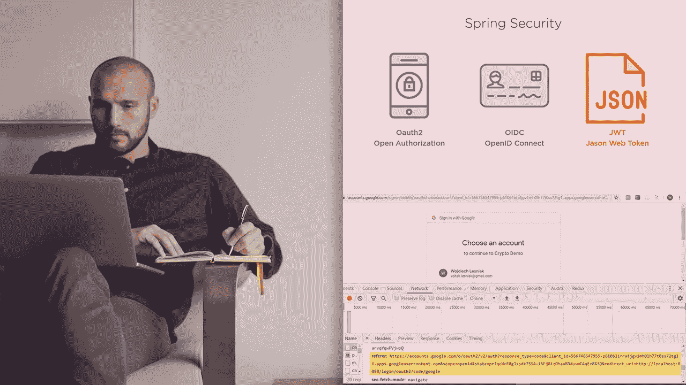
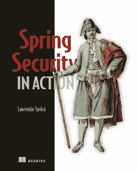
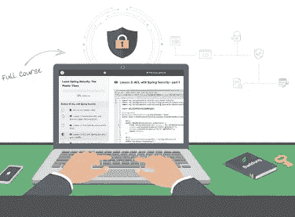

# 2023 年学习春季安全的 3 本书和课程

> 原文：<https://medium.com/javarevisited/3-best-spring-security-books-and-resources-for-java-programmers-653d05c8afd4?source=collection_archive---------1----------------------->

## 《Spring Security in Action》、《Spring Security 初学者到大师》和 Eugen Paraschive 的《Spring Security Masterclass》是 2023 年学习 Spring Security 的最佳资源

image_credit — Pluralsight

你好，Java 开发人员，如果你想学习 Spring Security 并寻找书籍、在线课程和培训班等最佳资源，你来对地方了。

前面我已经分享了学习 [Spring 框架](/javarevisited/10-best-spring-framework-books-for-java-developers-360284c37036)、 [Spring Boot](/javarevisited/top-10-courses-to-learn-spring-boot-in-2020-best-of-lot-6ffce88a1b6e?source=---------39------------------) 、[无功 Spring](/javarevisited/7-best-webflux-and-reactive-spring-boot-courses-for-java-programmers-33b7c6fa8995) 、 [Spring Cloud](/javarevisited/5-best-courses-to-learn-spring-cloud-and-microservices-1ddea1af7012) 、[微服务](/javarevisited/7-free-microservices-courses-for-java-programmers-c9b2f3a2ea7d)的最佳课程，而在这篇文章里，我将分享 2023 年你可以加入学习 Spring Security 的最佳书籍和课程。

[Spring Security](https://spring.io/projects/spring-security) 是 Spring 框架保护伞下的大项目之一，它解决了现代 web 应用程序的安全需求。由于安全性是企业 Java 应用程序最关心的问题，所以掌握像 Spring security 这样的安全框架知识对一个人的职业生涯大有帮助。

它有助于你成为一名全栈开发人员，并为你的工作和职业发展带来许多机会。很多 Java 开发人员需要了解 Spring 框架和如何保护他们在网络上的应用。

他们也是 Java 世界中收入最高的专业人士之一，在这里，一个拥有 Spring + Spring Security 的 Java 开发人员在全球任何地方都可以获得 120，000-150，000 美元或同等的收入。即使在印度，如果你有这些技能，你会得到许多极好的机会、令人兴奋的工作和更高的薪水。

证券和许多组织非常重视使用第三方安全审计和 Fortify 之类的工具来识别应用程序中的安全漏洞。很好地理解 [Spring security](http://javarevisited.blogspot.sg/2018/01/how-to-learn-spring-core-spring-mvc-boot-security-framework.html#axzz5678OxJDp) 不仅可以帮助你在应用程序开始时考虑安全性，还可以让你将安全性视为一个问题，并保护已经构建好的应用程序。

所以，我们知道安全性是必不可少的，Java 开发者学习和使用 [Spring security](/javarevisited/top-10-courses-to-learn-spring-security-and-oauth2-with-spring-boot-for-java-developers-8f0222d6066d?source=---------5-----------------------) 会受益匪浅，但是你是如何学习它们的呢？它们不是最容易掌握和尝试的概念；因此，选择一本好书和培训课程是非常重要的。

好在 Spring Security 是一个比较成熟的框架，网上也有很多素材，可以用来学习和掌握。尽管如此，如果你从零开始，我建议先读一本[书](http://www.java67.com/2016/12/5-spring-framework-books-for-java-programmers.html)或参加一个[在线课程](https://javarevisited.blogspot.com/2017/06/3-best-spring-security-online-training-courses-java-programmers.html)，而不是在博客和文章上学习零碎的东西。

毫无疑问，博客帖子和文章提供了很多价值，但是一本书和一门结构化的课程为你提供了全面的学习体验。一旦你熟悉了大部分内容，你可以阅读博客文章和文章来了解更多，进一步巩固你的理解。

如果你不熟悉 Spring 框架本身，你应该在跳到 Spring Security 之前先从那个开始。如果你需要推荐，那么 Udemy 上约翰·汤姆逊的 [**Spring Framework 5:初学者到大师**](https://click.linksynergy.com/fs-bin/click?id=JVFxdTr9V80&subid=0&offerid=323058.1&type=10&tmpid=14538&RD_PARM1=https%3A%2F%2Fwww.udemy.com%2Fspring-framework-5-beginner-to-guru%2F) 是最好的入门课程。

<https://click.linksynergy.com/fs-bin/click?id=JVFxdTr9V80&subid=0&offerid=323058.1&type=10&tmpid=14538&RD_PARM1=https%3A%2F%2Fwww.udemy.com%2Fspring-framework-5-beginner-to-guru%2F>  

# Java 开发人员的 3 本最佳 Spring 安全书籍和课程

因为我的许多读者问我学习 Spring Security 的最佳书籍，所以我分享了几本我读过并认为很棒的书。理想情况下，我喜欢读几本[书](/javarevisited/10-best-spring-framework-books-for-java-developers-360284c37036)，但总的来说，一本好书和一门优秀的培训课程已经足够了。无论如何，以下是我对从头开始学习 Spring Security 的建议

## 1.[春安在行动](https://www.amazon.com/Spring-Security-Action-Laurentiu-Spilca/dp/1617297739?tag=javamysqlanta-20)

这是一本优秀的书，最初我觉得很无聊。当我读到前几章的时候，我正要把它放下，但是真正的行动是从春天安全的深潜开始的。

这本书有很多示例代码，它不仅要求你阅读，还要求你工作；我的意思是，尝试和测试示例应用程序和每个新概念的构建，这是非常好的。

它也很好地解释了本质细节，比如它告诉你*当你添加< http >标签时会发生什么？*、[、*什么是安全上下文*、](https://javarevisited.blogspot.com/2018/02/what-is-securitycontext-and-SecurityContextHolder-Spring-security.html)、*截取 url 的顺序有什么关系？*和*使用 it security=none 的后果，因为省略了 CSS 和 JavaScript 的另一个 URL*。

总而言之，这是一本完整的书，不仅涵盖了基础知识，还涵盖了高级细节，最重要的是，它也是最新的课程，因为它涵盖了 Spring Security 5。我非常感谢《春天的安全在行动》的作者和出版商劳伦提乌·斯皮卡和曼宁创作了这本书。

**这里是购买这本书的链接**——[春季安保在行动](https://www.amazon.com/Spring-Security-Action-Laurentiu-Spilca/dp/1617297739?tag=javamysqlanta-20)

随着 [Spring Security basics](https://javarevisited.blogspot.com/2021/02/spring-security-interview-questions-answers-java.html#axzz6lIcZ8tnd) ，您将学习如何根据您的需求定制 Spring Security，从基于表单的日志开始，到根据您的公司和环境与定制的身份验证提供者集成。

您还将发现 [OAuth2](/javarevisited/top-10-courses-to-learn-spring-security-and-oauth2-with-spring-boot-for-java-developers-8f0222d6066d?source=---------5-----------------------) 和 OpenID Connect 之间的关系，并了解如何使用 Spring 保护您的微服务和无服务器应用。

## 2.[春天安全核心:初学者到宗师](https://click.linksynergy.com/deeplink?id=JVFxdTr9V80&mid=39197&murl=https%3A%2F%2Fwww.udemy.com%2Fcourse%2Fspring-security-core-beginner-to-guru%2F)

这是 Spring 专家约翰·汤姆逊教授的又一门关于 Spring security 的优秀课程，他的 Spring Security 5 课程是我学习 Spring 最喜欢的课程之一。我喜欢约翰·汤姆逊的教学风格，因为它清晰简洁的解释和触及基础，而这是大多数老师所忽略的。

例如，在本次*春季安全课程*中，他的前几堂课会让你很好地了解什么是春季安全，以及你为什么需要它。

您将了解认证，如 [Http 基本认证](https://javarevisited.blogspot.com/2018/01/how-http-basic-authentication-works-in.html)和授权，如[基于角色的访问控制](https://javarevisited.blogspot.com/2013/07/role-based-access-control-using-spring-security-ldap-authorities-mapping-mvc.html)，以及 Spring security 如何对此有所帮助，这非常好。任何 Java 开发人员都希望提高的一点是他们对 web 应用程序安全性的理解。我采访过很多有经验的开发者，他们不太了解常见的安全漏洞，比如 *SQL 注入*、*跨站点脚本*、*会话劫持* g 等等。

**以下是加入本课程**——[春季安全核心:初学者到大师](https://click.linksynergy.com/deeplink?id=JVFxdTr9V80&mid=39197&murl=https%3A%2F%2Fwww.udemy.com%2Fcourse%2Fspring-security-core-beginner-to-guru%2F)的链接

他们可以从参加本课程和参加 Eugen 的 [Learn Spring Security 5 培训中受益匪浅，我们将在下一部分讨论。

这两门课程和 Spring Security 这本书对于大多数 Java 开发者来说，获取所有必需的 Spring 安全技能绰绰有余。如果需要更多的选择，还可以看看 Pluralsight 的](https://courses.baeldung.com/p/learn-spring-security-the-certification-class?utm_source=javarevisited&utm_medium=web&utm_campaign=lss&affcode=22136_bkwjs9xa) [**春季安全基础**](https://pluralsight.pxf.io/c/1193463/424552/7490?u=https%3A%2F%2Fwww.pluralsight.com%2Fcourses%2Fspring-security-fundamentals) 课程。

<https://pluralsight.pxf.io/c/1193463/424552/7490?u=https%3A%2F%2Fwww.pluralsight.com%2Fcourses%2Fspring-security-fundamentals>  

作者 Bryan Hassen 提供了一些关于 Spring 安全框架的优秀信息；最棒的是，Pluralsight 提供了一个[免费试用](http://pluralsight.pxf.io/c/1193463/424552/7490?u=https%3A%2F%2Fwww.pluralsight.com%2Flearn)，这意味着你可以注册并免费学习这门课程。

<http://pluralsight.pxf.io/c/1193463/424552/7490?u=https%3A%2F%2Fwww.pluralsight.com%2Flearn>  

## 3.[学春季安全认证课](https://courses.baeldung.com/p/learn-spring-security-the-certification-class?utm_source=javarevisited&utm_medium=web&utm_campaign=lss&affcode=22136_bkwjs9xa)

这是最好的深入学习 Spring Security 的在线课程之一，作者是 Baeldung 的帕拉斯基夫 Eugen。欧根不需要介绍；他也是最受欢迎的高级 Spring 课程之一[**REST with Spring**](http://courses.baeldung.com/p/rest-with-spring-the-master-class?affcode=22136_bkwjs9xa)**，**的作者，该课程教授如何使用 Spring 开发 RESTful Web 服务。

尽管如此，没有多少人知道他还有一个宝贝，那就是他的 learn Spring Security 课程。课程结构非常好，这使得它既适合初级开发人员，也适合有经验的开发人员。尽管如此，它还涵盖了类似生产的真实企业应用程序中所需的所有必要的安全性内容。

这是学习 Spring Security 的*最佳课程之一，也是最新的、非常实用的课程。您可以通过本课程和 Spring Security 5 书籍来深入学习 Spring Security 5，以保护您的[微服务](https://javarevisited.blogspot.com/2018/02/top-5-spring-microservices-courses-with-spring-boot-and-spring-cloud.html)和 [Java](/javarevisited/10-free-courses-to-learn-java-in-2019-22d1f33a3915) 应用。*

这是参加本课程的链接。[学春季安全认证课](https://courses.baeldung.com/p/learn-spring-security-the-certification-class?utm_source=javarevisited&utm_medium=web&utm_campaign=lss&affcode=22136_bkwjs9xa)

以上是关于深入学习 Spring Security 的一些**最佳书籍和课程**。尽管《Spring in Action》是一本很好的书，它涵盖了 Spring 框架的大部分特性，但是它对 Spring 安全性的关注却很少。它确实包括 Spring 安全性，尤其是 web 应用程序安全性和方法级安全性，但这还不够好。

您可能想探索的其他 **Java 和 Spring 文章**

*   [2023 年 Java 开发者路线图](https://javarevisited.blogspot.com/2019/10/the-java-developer-roadmap.html#123)
*   [2023 年学习 Spring Boot 的 5 门课程](https://hackernoon.com/top-5-online-courses-to-learn-spring-boot-in-2019-c2fd7a0282c2)
*   [2023 年 Java 开发人员应该学会的 10 件事](http://javarevisited.blogspot.sg/2017/12/10-things-java-programmers-should-learn.html)
*   [Java 开发者应该知道的 10 个 Spring MVC 注释](http://www.java67.com/2019/04/top-10-spring-mvc-and-rest-annotations-examples-java.html)
*   [2023 年学习 Spring 框架的 5 门免费课程](http://www.java67.com/2017/11/top-5-free-core-spring-mvc-courses-learn-online.html)
*   [2023 年成为更好的 Java 开发人员的 10 个技巧](http://javarevisited.blogspot.sg/2018/05/10-tips-to-become-better-java-developer.html)
*   [学习 Java 微服务的 5 大课程](/javarevisited/top-5-courses-to-learn-microservices-in-java-and-spring-framework-e9fed1ba804d)
*   [Java 开发人员应该知道的五大框架](https://javarevisited.blogspot.sg/2018/04/top-5-java-frameworks-to-learn-in-2018_27.html)
*   [深入学习 Spring 框架的 5 门课程](https://javarevisited.blogspot.com/2018/06/top-6-spring-framework-online-courses-Java-programmers.html)
*   [有经验的 Java 开发人员应该阅读的 5 本春季书籍](http://javarevisited.blogspot.sg/2018/04/5-spring-framework-books-experienced-Java-developers-2018.html)
*   [每个 Java 程序员都应该知道的 5 个 Spring Boot 特性](https://javarevisited.blogspot.com/2018/11/top-5-spring-boot-features-java.html#axzz5YFjHrt5j)
*   [学习和掌握 Spring Cloud 的 5 大课程](http://javarevisited.blogspot.sg/2018/04/top-5-spring-cloud-courses-for-java.html)
*   [2023 年学习 Spring Boot 的 10 门免费课程](/javarevisited/10-free-spring-boot-tutorials-and-courses-for-java-developers-53dfe084587e?source=collection_home---4------7-----------------------)

感谢阅读这篇文章。如果你觉得这些*最佳春季安全资源*有用，请分享给你的朋友和同事。

如果你正在使用 Spring security 来保护你的应用程序，你应该知道更多，这也是这些书能帮助你的地方。它们补充了[**Spring in Action**](https://www.amazon.com/Spring-Action-Craig-Walls/dp/1617294942?tag=javamysqlanta-20)中的内容，并提供了对扩展和定制 Spring 安全性至关重要的内部实现细节。

来自 Udemy 的 [**Spring Security Core:初学者到大师**](https://click.linksynergy.com/deeplink?id=JVFxdTr9V80&mid=39197&murl=https%3A%2F%2Fwww.udemy.com%2Fcourse%2Fspring-security-core-beginner-to-guru%2F) ，结合《行动书》中的 Spring，从头到尾完美掌握 Spring Security。

<https://click.linksynergy.com/deeplink?id=JVFxdTr9V80&mid=39197&murl=https%3A%2F%2Fwww.udemy.com%2Fcourse%2Fspring-security-core-beginner-to-guru%2F> 