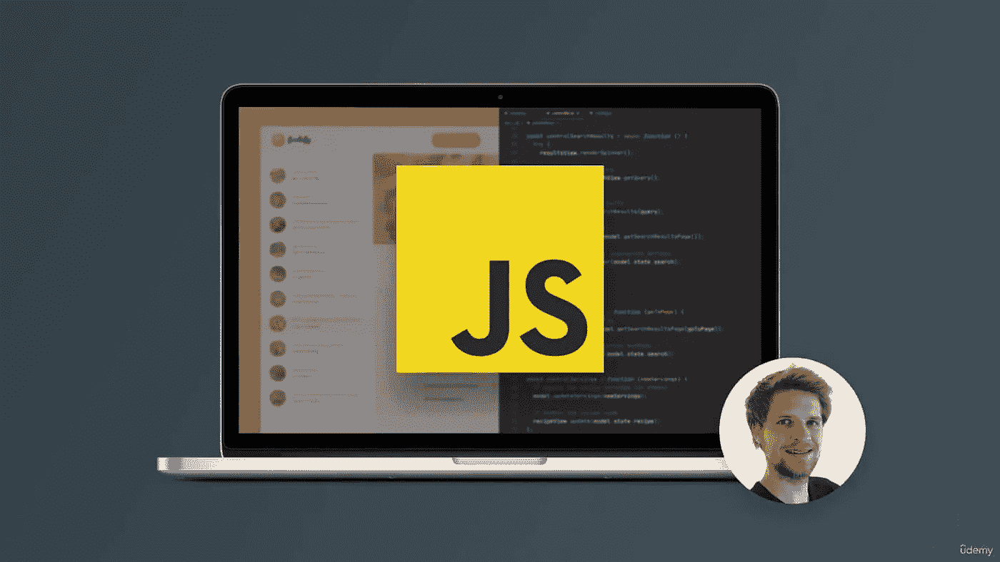

# 2023 年从零开始学习 JavaScript 的 3 种方法

> 原文：<https://medium.com/javarevisited/3-best-ways-to-learn-javascript-from-scratch-books-courses-and-projects-be995d4cd964?source=collection_archive---------5----------------------->

## 2023 年想学 JavaScript？以下是学习 JavaScript 的最佳方法，包括推荐的书籍、在线课程和项目，以积累真正的技能和经验。

大家好，如果你想在 2023 年从头开始学习 JavaScript，并且想知道在 2023 年学习 JavaScript 的最好方法是什么，那么你来对地方了。

早些时候，我已经分享了学习 Javascript 的[最佳 JavaScript 课程](https://javinpaul.medium.com/10-best-online-courses-to-learn-javascript-in-depth-fbd9b05ff3e0)、[书籍](https://javarevisited.blogspot.com/2017/02/top-5-javascript-books-to-learn-best-of-lot-must-read.html)和[网站](/javarevisited/my-favorite-free-tutorials-and-courses-to-learn-javascript-8f4d0a71faf2)，在这篇文章中，我将分享我的 3 点公式，这是学习 JavaScript 的最佳方法。

它包括参加一个 JavaScript 课程，接着读一本书，然后做几个项目来获得现实世界的经验。在这个过程中，我还会分享一些资源，比如书籍、课程、教程和供初学者在 2023 年构建的 JavaScript 项目想法。你可以用这种方法和推荐的资源在 2023 年**从头开始学习 JavaScript。**

JavaScript 最初是一种帮助 Java 的脚本语言，但是在过去的 25 年中，JavaScript 已经成为 web 开发中最重要的编程语言。首先，它接管了客户端开发，后来，随着 [Node.js](https://www.java67.com/2020/06/top-5-courses-to-learn-mern-stack-for-web-development.html) 的引入，JavaScript 也成为了服务器端开发的顶级语言之一。

今天，超过 90%的网站都在以这样或那样的方式使用 JavaScript。所有主要的前端框架和库都是基于 JavaScript 的。例如[角度](https://javarevisited.blogspot.com/2018/06/5-best-courses-to-learn-angular.html)和[反作用](https://javarevisited.blogspot.com/2018/08/top-5-react-js-and-redux-courses-to-learn-online.html)。

此外，Node.js 和最流行的数据库如 [MongoDB](https://javarevisited.blogspot.com/2019/01/top-5-mongodb-online-training-courses.html) 和 [SQL](https://javarevisited.blogspot.com/2018/05/top-5-sql-and-database-courses-to-learn-online.html) 一起被大量用于后端。

因此，要成为专业的前端、后端或全栈 web 开发人员，你需要学习 JavaScript。互联网上有一些课程、书籍和教程可供你选择来学习 JavaScript。在这篇文章中，我们将列出 2023 年学习 JavaScript 的 3 大方法。

# 2023 年学习 JavaScript 最好的方法有哪些？

从头开始学习 JavaScript 有 3 个最好的方法——参加 [**最佳 JavaScript 在线课程**](/javarevisited/10-best-online-courses-to-learn-javascript-in-2020-af5ed0801645) ，阅读深入的 [JavaScript 书籍](/javarevisited/5-best-javascript-books-for-beginners-and-experienced-web-developers-2c6353d1cc85)，构建几个 JavaScript 项目来实践你通过参加课程和阅读书籍所学到的所有概念。我遵循这种方法，学习了许多编程语言和框架，包括 JavaScript。

虽然有些人认为从一本 JavaScript 书开始比参加 JavaScript 课程更好，但根据我的经验，我发现从在线课程开始是一个更好的主意，因为 JavaScript 非常庞大，从书中学习 JavaScript 可能需要几个月的时间。

相反，如果你参加一个课程，你将会学到 20%最重要的 JavaScript 概念和特性，在几周的时间里，80%的时间都在使用它们。

在线课程也提供主动学习，因为你将会使用你的眼睛、耳朵和头脑，而不是在看书时只用你的眼睛和头脑。当你看到老师在你眼前做事情时，它也有助于学得更快，这是从在线课程学习 Javascript 的最大优势。

# 1.2023 年最好的 JavaScript 课程是什么？

如前所述，互联网上充满了 JavaScript 课程，很难找到既值得你花费时间和金钱的完美课程，但谢天谢地，我在搜索过程中发现了一些精华，还有[**2023 年完整 JavaScript 课程:从零到专家！**](https://click.linksynergy.com/deeplink?id=JVFxdTr9V80&mid=39197&murl=https%3A%2F%2Fwww.udemy.com%2Fcourse%2Fthe-complete-javascript-course%2F) 是完全初学者可以选择的课程。这是一个庞大的课程，总视频内容近 70 小时。

本课程从 JavaScript 的基础开始，然后慢慢转向必须学习的高级主题。JavaScript 初学者的另一门优秀课程是[**JavaScript—2023 年完全指南(初级+高级)**](https://click.linksynergy.com/deeplink?id=CuIbQrBnhiw&mid=39197&murl=https%3A%2F%2Fwww.udemy.com%2Fcourse%2Fjavascript-the-complete-guide-2020-beginner-advanced%2F) 。这也是一个庞大的课程，视频内容总计 53 小时。

JavaScript 在过去的 25 年里有了很大的发展。有几个特性被认为是 JavaScript 的“现代特性”，每个 JavaScript 开发人员都应该熟悉它们。

要学习现代 JavaScript 特性，可以选择 Udemy 上我最喜欢的导师之一 Brad Traversy 的 [**从头学现代 JavaScript**](https://click.linksynergy.com/deeplink?id=JVFxdTr9V80&mid=39197&murl=https%3A%2F%2Fwww.udemy.com%2Fcourse%2Fmodern-javascript-from-the-beginning%2F)。我非常喜欢他的教学风格，因为他对概念的解释非常清晰，我相信学完这门课程后，你也会成为他的粉丝。

如果你喜欢从免费资源中学习，比如 YouTube 上的免费 JavaScript 课程，那么我强烈推荐你去看看 FreeCodeCamp 提供的 7 小时免费 JavaScript 课程，这是我最喜欢的 2023 年学习 JavaScript 和 web 开发的地方之一

你可以在这里观看这个课程:

# 2.2023 年有哪些最好的 JavaScript 书籍？

在互联网和视频教程的时代，书籍是最好的学习资源之一。有了书，你可以深入一切，这就是 JavaScript 学生所需要的。

[**《你不知道的 JS by Kyle Simpson》**](https://www.amazon.com/You-Dont-Know-JS-Yet/dp/B084DFZ6GW?tag=javamysqlanta-20)就是你学习和掌握 JavaScript 所需要的全部。它实际上不是一本书，而是 6 本书的系列。这 6 本书包含了每个 JavaScript 开发者需要知道的所有必要概念。

以下是 6 本书的清单。

*   你不知道 JS: Up and Going
*   你不知道 JS:类型和语法
*   你不知道 JS: ES6 及以上
*   你不知道 JS: Async 和 Performance
*   你不知道 JS: this 和对象原型
*   你不知道 JS:范围和闭包

正如你所看到的，这些书包含了所有重要的基本概念，比如类型、ES6、异步 JavaScript、对象、作用域和闭包。

如果您想深入了解现代 JavaScript 及其特性，那么您可以选择[**“JavaScript 应用程序编程:使用 Node、HTML5 和 Moderns JS 库的健壮 Web 架构”**](https://www.amazon.com/Programming-JavaScript-Applications-Architecture-Libraries/dp/1491950293?tag=javamysqlanta-20) 或**[**JavaScript:优秀部分**](https://www.amazon.com/JavaScript-Good-Parts-Douglas-Crockford/dp/0596517742?tag=javamysqlanta-20)**

****

# **3.2023 年对初学者来说最好的 JavaScript 项目是什么**

**基本的 JavaScript 项目应该是某种 web 项目。为此，您需要使用另外两种核心 web 技术。这些技术是 HTML 和 CSS。以下是可以使用 [HTML](https://www.java67.com/2020/08/5-best-online-courses-to-learn-html-5.html) 、 [CSS](/javarevisited/10-best-css-online-courses-for-beginners-and-experienced-developers-54aa2e8c0253) 和 [JavaScript](https://javinpaul.medium.com/6-best-data-structure-and-algorithms-courses-for-javascript-developers-c35e23236165) 创建的项目列表。**

*   **JavaScript 计算器**
*   **井字游戏**
*   **带验证的 JavaScript 表单**
*   **JavaScript 时钟**
*   **JavaScript 测验**

**[**JavaScript Web 项目:构建作品集的 20 个项目**](https://academy.zerotomastery.io/a/aff_693qyg0h/external?affcode=441520_zytgk2dn)Udemy 是一门优秀的课程，包含构建 20 个 JavaScript 移动友好项目的视频内容。**

**本课程包括的一些项目:报价生成器、笑话讲述器、明暗模式、音乐播放器、自定义倒计时、视频播放器、簿记员、表单验证器、Pong、拖放和闪屏。**

****

**顺便说一句，你需要一个 [**ZTM 会员**](https://academy.zerotomastery.io/a/aff_c0gnlvf7/external?affcode=441520_zytgk2dn) 来观看这个课程，这个课程每月花费大约 39 美元，但也提供了许多超级吸引人和有用的课程，比如这个 JavaScript Web 项目:20 个项目来建立你的作品集课程。您还可以使用我的代码朋友 10 获得您选择的任何订阅的 10%的折扣。**

**以上就是 2023 年学习 JavaScript 的 3 种最佳方法。正如本文前面提到的，在 2021 年学习 JavaScript 是一个极好的选择，因为 JavaScript 是 web 开发社区中最流行的编程语言。诸如 [Angular](/javarevisited/10-courses-to-learn-angular-for-web-development-6da1bd2856dc) 和 [React](https://dev.to/javinpaul/5-best-online-courses-to-learn-react-with-hooks-in-2022-26lf) 等 JavaScript 框架和库非常流行，而 Node.js 则广泛用于后端开发。**

**但是要学习这些技术，你需要学习和掌握 JavaScript。在本文中，我们列出了一些合适的书籍和课程，它们对从初级到高级的 JavaScript 学习都很有帮助。**

**而且，我们还提到了你应该尝试测试你的 JavaScript 知识的项目。除了项目，我们还提到了一门课程，其中包含 20 个 JavaScript 项目的视频材料。**

**您可能喜欢的其他 **JavaScript 和** **Web 开发文章****

*   **[成为全栈式 web 开发人员的 10 门最佳课程](/javarevisited/top-10-online-courses-to-become-a-fullstack-web-developer-in-2020-d608a6b63232)**
*   **[Java 和 Web 开发人员应该学习的 10 个框架](http://javarevisited.blogspot.sg/2018/01/10-frameworks-java-and-web-developers-should-learn.html)**
*   **[初学者学习 Nodejs 的十大课程](/javarevisited/top-10-online-courses-to-learn-node-js-in-depth-8ef0e31ca139)**
*   **[学习 Web 开发的前 5 门课程](/better-programming/my-5-favorite-courses-to-learn-web-development-in-2019-a5e74167f8b2)**
*   **[2023 年前端和后端开发者路线图](https://javarevisited.blogspot.com/2019/02/the-2019-web-developer-roadmap.html)**
*   **学习 React 钩子和上下文 API 的 10 门免费课程**
*   **[2023 年你可以学习的 10 种编程语言](http://www.java67.com/2017/12/10-programming-languages-to-learn-in.html)**
*   **[2023 年学习打字稿的 10 门免费课程](/javarevisited/top-10-free-typescript-courses-to-learn-online-best-of-lot-44bce9da41d1)**
*   **[我最喜欢的学习角框架的课程](/javarevisited/10-courses-to-learn-angular-for-web-development-6da1bd2856dc)**
*   **[初学者和有经验者的 15 门最佳 JavaScript 课程](/javarevisited/10-best-online-courses-to-learn-javascript-in-2020-af5ed0801645)**
*   **[2023 年学习 HTML 5 和 CSS 的 5 大课程](https://javarevisited.blogspot.com/2019/05/top-5-html-5-and-css-3-courses-for-web-developers.html)**
*   **[2023 年要学习的 10 个 JavaScript 框架和库](https://www.java67.com/2019/01/top-10-javascript-frameworks-and-libraries-for-web-developers.html)**

**感谢您阅读本文。如果你喜欢这个 3 点公式和 2023 年学习 JavaScript 的最佳方法，请与你的朋友和同事分享。如果您有任何问题或反馈，请留言。**

****附言——**如果你喜欢从免费资源中学习，并寻找免费书籍和在线课程来学习 JavaScript，那么你也可以查看这个最佳 [**免费 JavaScript 课程**](/javarevisited/12-free-courses-to-learn-javascript-and-es6-for-beginners-and-experienced-developers-aa35874c9a32) 和[书籍](/javarevisited/5-free-books-to-learn-javascript-for-beginners-4cca79834262)的列表。它包含了从零开始学习 JavaScript 的最好的免费资源。**

** [## 2023 年学习 JavaScript 的 5 大免费在线课程——最好的

### 大家好，如果你想在 2023 年自学 JavaScript，并寻找一些免费资源，如书籍、网站…

www.java67.com](https://www.java67.com/2018/04/top-5-free-javascript-courses-to-learn.html)**