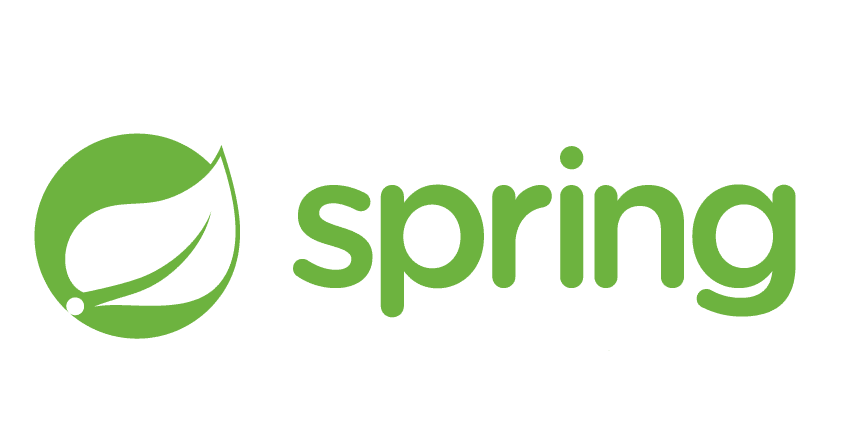
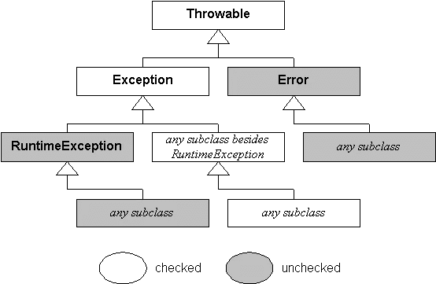
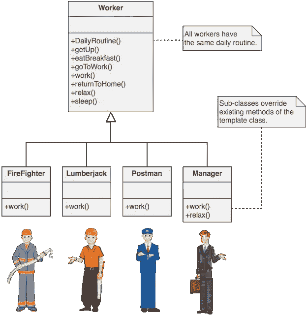

# Java 程序员可以从 Spring Framework 中学到的 3 个编码最佳实践

> 原文：<https://medium.com/javarevisited/3-coding-best-practices-i-learned-from-spring-framework-in-java-2dfef576e485?source=collection_archive---------0----------------------->

## Spring 不仅仅是另一个 DI 和 IOC 框架，您可以学习如何使用 Spring 编写更好的代码。

毫无疑问，Spring 框架是最受欢迎的 Java 框架之一，它通过提供像[依赖注入](https://javarevisited.blogspot.sg/2015/06/difference-between-dependency-injection.html)和[控制反转](https://javarevisited.blogspot.com/2012/12/inversion-of-control-dependency-injection-design-pattern-spring-example-tutorial.html)这样的特性，使得创建真实世界的企业级 Java 应用程序变得非常容易。

但是，老实说，Spring 不仅仅是另一个 DI 和 IOC 框架。通过提供一个有用的抽象层，它进一步简化了许多 Java APIs，如 [JDBC](/javarevisited/top-5-courses-to-learn-jdbc-and-database-connectivity-for-java-developers-free-and-best-of-lot-7945156fcc3) 、 [JMS](https://javarevisited.blogspot.com/2020/05/top-16-jms-java-messaging-service-interview-questions-answers.html) 、 [Java Mail](https://www.java67.com/2019/10/how-to-send-email-in-java-using-spring.html) 等。

使用 JDBC 的 Springs `[JdbcTempalte](https://javarevisited.blogspot.com/2020/05/10-jdbctemplate-examples-in-spring.html#axzz6oawwFfxd)` 和其他工具类要容易得多。它们消除了 Java 开发人员在执行 SQL 语句和处理`ResultSet` 以获得他们想要的 Java 对象时面临的大部分摩擦。

所以，当你[学习 Spring 框架](/javarevisited/top-10-free-courses-to-learn-spring-framework-for-java-developers-639db9348d25)的时候，你不仅仅是学习如何使用它，还学习了一些有用的见解，关于如何用 [Java](/javarevisited/10-books-java-developers-should-read-in-2020-e6222f25cc72) 和[面向对象编程](/javarevisited/my-favorite-courses-to-learn-object-oriented-programming-and-design-in-2019-197bab351733?source=---------103------------------)编写更好的代码。

在本文中，我将分享我在学习 Spring 时遇到的一些最佳实践，主要是通过阅读我最喜欢的 Craig Walls 的[**Spring In Action**](https://www.amazon.com/Spring-Action-Covers-4/dp/161729120X?tag=javamysqlanta-20)一书以及我自己对 Spring 框架的体验。尤其是《春天在行动》这本书对我产生了巨大的影响，因为克雷格出色的写作风格和他解释春天的每一个概念的方式。如果你还没有读过，我强烈建议你读读这本书，它完全值得你花时间和金钱。

**这里是购买本书的链接** — [**春天在行动**](https://www.amazon.com/Spring-Action-Covers-4/dp/161729120X?tag=javamysqlanta-20)

# 我从 Spring 框架中学到的 3 个最佳实践

以前我分享过[最好的 spring 课程](/javarevisited/10-best-online-courses-to-learn-spring-framework-in-2020-f7f73599c2fd)和[最好的 spring 书籍](/javarevisited/5-advanced-spring-framework-books-experienced-java-developers-should-read-in-2020-best-of-lot-2a786fc5ad31?source=---------6-----------------------)，今天我要分享的是我使用 Spring 框架 10 年来学到的最佳实践。这些最佳实践也将帮助您编写更好的代码。

无论如何，在不浪费你更多时间的情况下，这里是我从 Spring 学到的 3 个最佳实践，建议每个 Java 程序员在用 Java 编写代码时都要意识到这一点并应用它。

## 1.接口编码

这是我在阅读 [Head First Design Pattern](http://www.amazon.com/dp/0596007124/?tag=javamysqlanta-20) 时学到的一个老的 OOP 指南。OOP 设计原则的主要目的是减少两个类之间的耦合，从而增加灵活性。Spring 严格遵循这个面向对象的指导方针，并且经常公开一个接口来使用关键类，比如创建接口来利用`JdbcTemplate`。这种做法促进了不同层之间的松散耦合。

另一个很好的例子是用于提供缓存的`Cache` 接口。所有其他的缓存实现，如`EhCache`、`ConcurrentMapCache`和`NoOpCache` 都实现了这个接口。

如果您的代码依赖于缓存接口，而不是任何特定的实现，您可以切换缓存提供程序，而不会影响代码的其他部分。如果你有兴趣学习更多关于干净代码的知识，那么由 Wlodek Krakowski 在 Udemy 上撰写的 [**重构金字塔(Java)——逐渐干净代码**](https://click.linksynergy.com/deeplink?id=JVFxdTr9V80&mid=39197&murl=https%3A%2F%2Fwww.udemy.com%2Fcourse%2Fpyramid-of-refactoring-java-interpreter-factories%2F) 是一个很好的资源。

## Java 中接口编码的一个例子

下面是一个使用[集合框架](/javarevisited/50-java-collections-interview-questions-for-beginners-and-experienced-programmers-4d2c224cc5ab)用 Java 编写接口的简单代码示例。如果你仔细观察，在这个例子中，我使用了一个`interface` 而不是实现来声明 Java 中的变量、参数和方法的返回类型。

这种编码风格是`flexible` ，以后更容易改变。如果你想了解更多关于接口原理的编码，我建议你去浏览一下 Java 中的 [**软件架构基础&设计模式**](https://click.linksynergy.com/fs-bin/click?id=JVFxdTr9V80&subid=0&offerid=323058.1&type=10&tmpid=14538&RD_PARM1=https%3A%2F%2Fwww.udemy.com%2Fbasics-of-software-architecture-design-in-java%2F) **，**这是一门关于这个主题的优秀课程。

## 2.优先处理未检查的异常，而不是检查的异常

如果你使用过 Spring 框架，那么你会注意到 Spring 比[检查异常](https://javarevisited.blogspot.sg/2011/12/checked-vs-unchecked-exception-in-java.html)更喜欢未检查异常，最好的例子就是 Spring JDBC。

Spring 有丰富的异常层次来描述在连接和从数据库检索数据时可能出现的不同错误，但是它们的根是`DataAccessException` ，它是未检查的。Spring 认为大多数错误都是由 catch 块中无法纠正的原因造成的，因此它决定捕捉开发人员的异常，而不是像 Java 那样强迫他们。结果是**更干净的代码**，没有空的 catch 块，并且有更少的 try-catch 块。

这也是 Java 中处理错误和异常的最佳实践之一。如果你对这个话题感兴趣，那么你也可以查看我的帖子 [10 Java 异常最佳实践](http://javarevisited.blogspot.sg/2013/03/0-exception-handling-best-practices-in-Java-Programming.html)以获得更多建议，如果你需要一门课程，那么 Tim Buchalaka 和他的团队编写的《Java master class》<https://click.linksynergy.com/deeplink?id=JVFxdTr9V80&mid=39197&murl=https%3A%2F%2Fwww.udemy.com%2Fcourse%2Fjava-the-complete-java-developer-course%2F>**是学习 Java 的绝佳课程。**

****

## **3.模板设计模式的使用**

**Spring 大量使用模板方法设计模式来简化事情。一个很好的例子是 [JdbcTemplate](https://javarevisited.blogspot.com/2020/05/10-jdbctemplate-examples-in-spring.html) ，它在使用 JDBC API 时消除了很多痛苦。您只需要定义需要什么，Spring 会处理剩下的过程。

如果你不知道[模板设计模式](https://click.linksynergy.com/fs-bin/click?id=JVFxdTr9V80&subid=0&offerid=323058.1&type=10&tmpid=14538&RD_PARM1=https%3A%2F%2Fwww.udemy.com%2Fjava-design-patterns%2F)定义了一个流程或算法，你不能改变流程，但同时你可以根据自己的需要定制步骤。

例如，在处理 [JDBC](/javarevisited/top-5-courses-to-learn-jdbc-and-database-connectivity-for-java-developers-free-and-best-of-lot-7945156fcc3) 的时候，你可以使用 JdbcTemplate 执行一个查询，得到你想要的对象。您只需要提供 [SQL](/javarevisited/top-5-sql-and-database-courses-to-learn-online-48424533ac61) ，它在每种情况下都是不同的，还需要提供映射逻辑来将表中的一行映射到一个对象。

这是一个很好的图表，很好地解释了**模板设计模式**。你可以看到每个人都有一些共同的任务，但是他们做不同的工作，这被模板方法很好地捕捉到了。他们需要定义的只是他们的工作，他们通过定义`work()`抽象方法来合作。**

**如果你想学习更多关于模板设计模式的知识，那么我强烈推荐你去看看 Udemy 上 Dmitri Nesteruk 的 Java 课程中的 [**设计模式。这是学习设计模式在 Java 中的现代实现的绝佳课程**](https://click.linksynergy.com/deeplink?id=JVFxdTr9V80&mid=39197&murl=https%3A%2F%2Fwww.udemy.com%2Fcourse%2Fdesign-patterns-java%2F)**

****

**除了`JdbcTemplate`，你还会在 Spring framework API 中找到很多其他模板方法模式的例子，比如 JmsTemplate 和 [RestTemplate](https://javarevisited.blogspot.com/2017/02/how-to-consume-json-from-restful-web-services-Spring-RESTTemplate-Example.html) ，它们允许你从 Java 应用程序中使用 REST API。

顺便说一句，如果你有兴趣学习更多关于使用 Spring 开发 RESTful web 服务的知识，那么 Eugen 帕拉斯基夫的**[**REST with Spring master class**](http://courses.baeldung.com/p/rest-with-spring-the-master-class?affcode=22136_bkwjs9xa)也是一门不错的课程。****

****<http://courses.baeldung.com/p/rest-with-spring-the-master-class?affcode=22136_bkwjs9xa>  

这就是你可以从 Spring 框架中学到的一些 **Java 最佳实践。Spring 是一个很棒的框架，它们的作者都是经验丰富的 Java 开发人员。**

通过使用 Spring 以及查看他们的代码、他们做出的决定以及他们如何设计 API，您可以学到很多东西。Spring 是开源的，这意味着你可以下载并查看它们的源代码。

我知道，Spring 集合了许多这样的最佳实践，有很多东西需要学习，但是我发现这三个在 Spring 中无处不在，因此对 Spring 框架的代码质量有巨大的影响。

无论如何，如果你遇到了你从 Spring Framework 中学到的任何其他最佳实践，请随时与我们分享。

其他 **Java 和 Spring 文章**你可能喜欢
[Spring 框架 MasterClass 作者 Ranga Karnan](https://click.linksynergy.com/fs-bin/click?id=JVFxdTr9V80&subid=0&offerid=323058.1&type=10&tmpid=14538&RD_PARM1=https%3A%2F%2Fwww.udemy.com%2Fspring-tutorial-for-beginners%2F)
[Spring MVC 在 Java 内部是如何工作的？](https://javarevisited.blogspot.com/2017/06/how-spring-mvc-framework-works-web-flow.html)
[Java 开发者应该深入学习的 10 件事？](https://javarevisited.blogspot.sg/2017/12/10-things-java-programmers-should-learn.html#axzz53ENLS1RB)
[Java 和 Web 开发人员应该学习的 10 个框架](https://javarevisited.blogspot.com/2018/01/10-frameworks-java-and-web-developers-should-learn.html)
[Java 开发人员必备的 10 个测试工具](https://javarevisited.blogspot.com/2018/01/10-unit-testing-and-integration-tools-for-java-programmers.html)
[成为更好的 Java 程序员的 10 个技巧](http://javarevisited.blogspot.sg/2018/05/10-tips-to-become-better-java-developer.html)
[7 个使用 Spring 进行 REST API 开发的理由](http://javarevisited.blogspot.sg/2018/01/7-reasons-for-using-spring-to-develop-RESTful-web-service.html#axzz55a8rTeu7)
[10 个免费的 Spring 框架初学者课程](/javarevisited/top-10-free-courses-to-learn-spring-framework-for-java-developers-639db9348d25)
[10 个高级 Spring Boot Java 开发人员课程](/javarevisited/10-advanced-spring-boot-courses-for-experienced-java-developers-5e57606816bd?source=collection_home---4------0-----------------------)
[为什么 Spring 是最好的](/javarevisited/why-spring-is-the-best-framework-for-developing-rest-apis-in-java-784590e484a4?source=collection_home---4------0-----------------------) [Java 开发者 10 门免费 Spring Boot 课程](/javarevisited/10-free-spring-boot-tutorials-and-courses-for-java-developers-53dfe084587e?source=collection_home---4------7-----------------------)
[学习微服务和 Spring Cloud 的前 5 门课程](/javarevisited/5-best-courses-to-learn-spring-cloud-and-microservices-1ddea1af7012)
[学习软件架构师我最喜欢的课程](/javarevisited/top-5-courses-to-learn-software-architecture-in-2020-best-of-lot-5d34ebc52e9)

感谢您阅读本文。如果你喜欢这篇文章和这些来自 Spring Framework 的 Java 最佳实践，那么请与你的朋友和同事分享。如果您有任何问题或反馈，请留言

如果你是 Spring 框架的新手，并且正在寻找在线学习 Spring 框架的综合课程，那么我强烈推荐你加入 Udemy 网站上 John Thomspon 的 [**Spring Framework 5:初学者到大师**](https://click.linksynergy.com/fs-bin/click?id=JVFxdTr9V80&subid=0&offerid=323058.1&type=10&tmpid=14538&RD_PARM1=https%3A%2F%2Fwww.udemy.com%2Fspring-framework-5-beginner-to-guru%2F) 课程。在线学习 spring 是最好的课程。

<https://click.linksynergy.com/fs-bin/click?id=JVFxdTr9V80&subid=0&offerid=323058.1&type=10&tmpid=14538&RD_PARM1=https%3A%2F%2Fwww.udemy.com%2Fspring-framework-5-beginner-to-guru%2F> ****