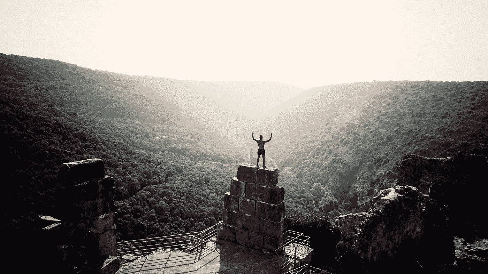

# 3 位 Java 冠军的灵感来源以及他们的共同点

> 原文：<https://medium.com/javarevisited/3-java-champions-to-be-inspired-by-and-what-they-have-in-common-c51a22186722?source=collection_archive---------0----------------------->

## 他们成就的核心有两个特征

在 [Unsplash](https://unsplash.com?utm_source=medium&utm_medium=referral) 上由 [Ameer Basheer](https://unsplash.com/@24ameer?utm_source=medium&utm_medium=referral) 拍摄的照片

我只能想象成为 [Java 冠军](https://developer.oracle.com/javachampions/)是 Java 开发人员职业生涯的巅峰。这意味着，除了其他许多事情之外，确认你是一个热爱 Java 的人，一个领导者，并且在技术上非常有能力。