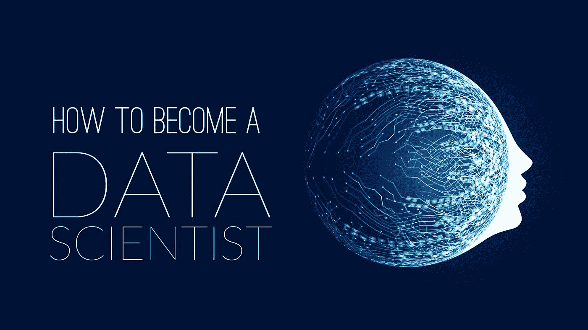

# 迈向地球上最性感工作的 3 个步骤——“数据科学家”

> 原文：<https://medium.com/javarevisited/3-steps-toward-the-sexiest-job-of-the-planet-data-scientist-d54d1dccb5b4?source=collection_archive---------0----------------------->

## ***“组织越来越意识到，为了最大限度地从数据中获益，他们需要具备相关技能的专职领导”***

在当今的数字世界中，我们正在创建数量惊人的数据，您有没有想过这些海量数据去了哪里？这些数据真的有助于数据驱动的组织提高锁定客户的能力吗？所以答案是肯定的“公司总是收集和分析关于他们的客户的数据，以提供更好的服务”，为此，组织需要现代的数据处理方法和软件。

这就是 [***数据科学家***](https://data-flair.training/blogs/steps-to-become-a-data-scientist/) 发挥作用的地方。数据科学家处理数据，以帮助公司做出更好的决策，为任何业务提供促销优惠和预测分析。

数据科学家被誉为***【21 世纪最性感的工作】*** 。

**成为数据科学家的步骤-**

在这个数据的世界里，成为数据科学家的理由可能很多，但要实现你的梦想工作，你必须遵循以下 3 个步骤

**第一步——确保你有一个合格的学位:**数据科学是一个高度量化的领域，需要更高的学位。根据研究— 88%的数据科学家拥有硕士学位，46%拥有博士学位**—**

*   **计算机科学**
*   **数学**
*   **统计数字**
*   **经济学**

****步骤 2-满足数据科学的先决条件**:要成为一名数据科学家，你需要掌握以下技术和非技术技能-**

1.  ****学习统计、概率和数学分析**:为了成为一名精通的数据科学家，这是你应该拥有的最重要的技能之一。作为一名数据科学家，您需要掌握的一些重要主题是描述性和推断性统计、线性代数、微积分、离散数学和优化理论，在线课程是学习这些内容的最佳选择。你可以看看这个 [10 个数据科学和机器学习课程的列表](https://dev.to/javinpaul/10-data-science-and-machine-learning-courses-for-programmers-looking-to-switch-career-57kd)来了解最新情况。**
2.  ****掌握至少一门编程语言:**基本上，编程可以让你以实用的方式实施你的统计思维**。**因此，你必须熟练掌握至少一门编程语言。作为数据科学家，您必须了解的一些基本编程语言和工具是**

*   ****Python:** 它是最流行的语言，因为它的通用性和可伸缩性。Python 的代码可读性也使它成为数据科学家的热门选择。解决数据科学问题，如数据预处理、可视化、预测和数据保存，为了执行这些步骤，Python 有专门的库，如 Pandas、 [TensorFlow](https://hackernoon.com/top-5-tensorflow-and-ml-courses-for-programmers-8b30111cad2c) 、Numpy、Matplotlib、SciPy、scikit-learn 等。如果你还没有开始学习 python，我建议你访问一下 [***240+免费 Python 教程***](https://data-flair.training/blogs/python-tutorials-home/) ，免费成为 Python 专家。如果你喜欢网络课程，也可以查看这个 [**学习 Python 的最佳课程列表**](https://hackernoon.com/top-5-courses-to-learn-python-in-2018-best-of-lot-26644a99e7ec) 。**
*   ****R:** R 是数据科学的重要工具，它非常受欢迎，是许多统计学家和数据科学家的首选。r 是一种编程语言，它为你分析、处理、转换和可视化信息提供了一个密集的环境。如果你想投身于这个职业，你可以在这里免费学习 R-[**90+****免费 *R 教程系列***](https://data-flair.training/blogs/r-tutorials-home/) 。如果你喜欢网络课程，也可以查看这个 [**免费课程列表，学习 R 编程**](https://hackernoon.com/5-free-r-programming-courses-for-data-scientists-and-ml-programmers-5732cb9e10) 。**
*   ****数据库查询语言:** SQL 是数据科学家必须具备的最重要的技能。它是一种数据库语言，用于从称为关系数据库的有组织的数据源中检索数据。在数据科学中， [SQL](https://dev.to/javinpaul/5-online-courses-to-learn-sql-and-database-for-beginners-best-of-lot-5533) 用于更新、查询和操作数据库。作为数据科学家，从数据库中检索数据、提取和整理数据是最重要的部分，而 SQL 在其中扮演着重要的角色。看这些顶级的 [**5 门课程学习数据库和 SQL**](https://javarevisited.blogspot.com/2018/05/top-5-sql-and-database-courses-to-learn-online.html) 。**
*   ****Scala:** Scala 是一种基于 Java 的语言，也是数据科学家必备的技术技能之一。它支持函数式编程和强大的静态类型系统。它提供了促进大规模并行处理的能力。下面是为什么要学习 scala*[***的 16+理由***](https://data-flair.training/blogs/why-scala/)*如果你想学习 Scala，下面是 [5 门免费的 Scala 课程](https://javarevisited.blogspot.com/2019/01/5-free-scala-programming-courses-for-java-programmers-learn-online.html)。****

********

1.  ******业务和领域知识:**许多受欢迎的公司正在使用数据科学来简化他们的常规流程。数据科学帮助企业以更好的方式运营的方式有很多:做出更明智的决策和预测分析以预测结果。****

****以下是大多数数据科学家使用并塑造数据科学家未来的顶级数据科学工具:- [***顶级数据科学工具。*T32**](https://data-flair.training/blogs/top-data-science-tools/)****

******第三步:总是试图从各处获取知识:******

1.  ******参加数据科学认证-** 作为一名数据科学家，始终领先一步非常重要，在数据科学行业，认证是你技能的证明。以下是 7 大[数据科学家认证](https://javarevisited.blogspot.com/2018/10/data-science-and-machine-learning-courses-using-python-and-R-programming.html)****

*   ****戴尔 EMC 认证专家认证计划****
*   ****SAS 数据科学研究院****
*   ****微软认证解决方案专家(MCSE)****
*   ****Cloudera 认证助理(CCA)****
*   ****Cloudera 认证专家:CCP 数据工程师****
*   ****数据科学证书—哈佛扩展学院****

******2。尝试在真实的项目中工作:**一旦你在理论上很好，就开始实践数据科学项目，参加项目对你在数据科学领域的职业生涯有很大帮助。随着您在各种竞赛中一路攀升，您在数据科学领域也赢得了声誉。此外，从事独立项目是获得数据科学领域经验的另一种方式。****

****我们已经讨论了成为数据科学家的一些重要步骤。为了掌握这些学科，一个有抱负的数据科学家必须知道正确的方向。除了核心知识和技术专长，数据科学家还应该具备很强的沟通技巧。你应该看看关于 [***成为数据科学家所需技能***](https://data-flair.training/blogs/skills-needed-to-become-a-data-scientist/) **的博客。******