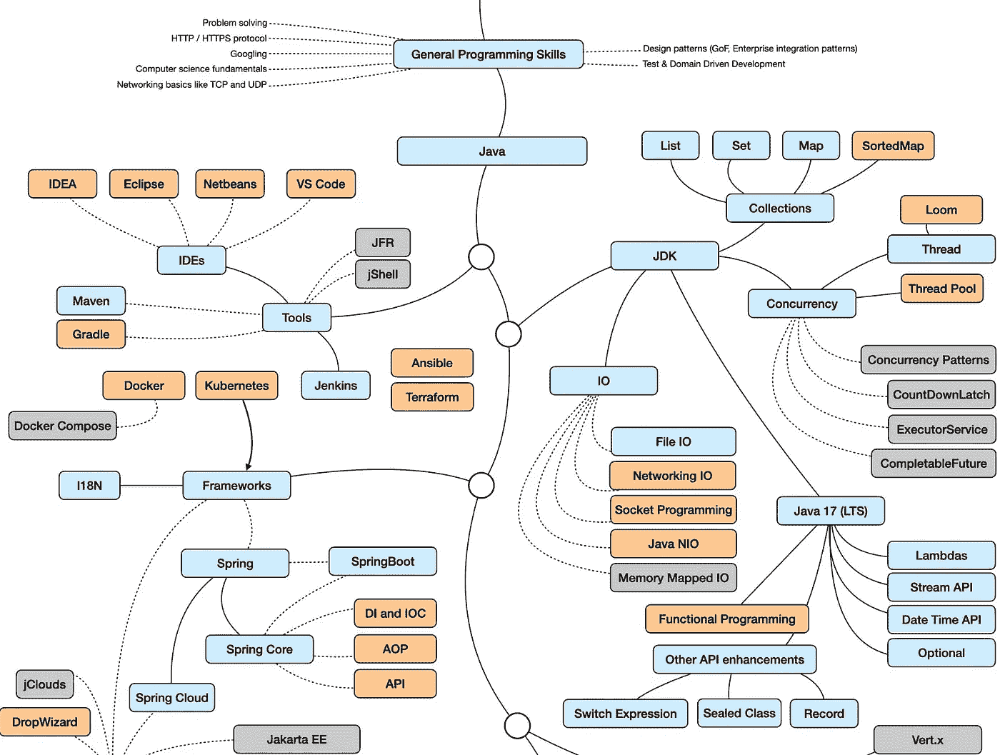
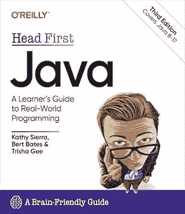
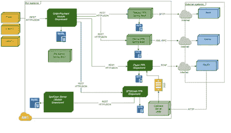

# 学习 Java 并在 2023 年成为软件开发人员的 3 种方法

> 原文：<https://medium.com/javarevisited/3-ways-to-learn-java-and-become-a-software-developer-in-2023-3d885a58cd3c?source=collection_archive---------0----------------------->

## 想在 2023 年成为 Java 开发者？以下是我学习 Java 并在 2023 年成为一名成功的 Java 开发人员的 3 个屡试不爽的方法

大家好，如果你想学习 Java，并且想知道 2023 年学习 Java 的最好方法是什么，那么你来对地方了。以前我分享过很多学习 Java 编程与开发的有用资源像 [**Java 开发者路线图**](/javarevisited/the-java-programmer-roadmap-f9db163ef2c2)[**最佳 Java 课程**](https://javarevisited.blogspot.com/2018/05/top-5-java-courses-for-beginners-to-learn-online.html)[**最佳 Java 书籍**](https://javarevisited.blogspot.com/2018/07/top-9-java-programming-books-best-must-read.html) ，还有这个 [**最佳网站** **免费学习 Java**](https://javarevisited.blogspot.com/2018/07/top-5-websites-to-learn-coding-in-java.html)的列表，在这篇文章里，我会告诉你 2023 年学习 Java 的最佳方法。

即使你没有任何编程经验，你也可能听说过“Java”这个术语。

Java 是编程世界中最常见、最流行的术语之一。这是因为 Java 是世界上最流行的编程语言之一，它从 90 年代中期就存在了。

Java 不仅直到今天还存在，而且在那些年里还一直占据着顶级位置。

在 IT 界，Java 几乎无处不在。它用于 web 开发、移动开发、游戏开发、数据库连接等等。所以，如果你打算在 2023 年学习 Java，那么这是一个伟大的决定。

但是 [Java](/javarevisited/10-best-places-to-learn-java-online-for-free-ce5e713ab5b2) 是一种强硬的编程语言。事实上，它被认为是世界上最难掌握的编程语言之一。但这并不意味着一个人不能学习它。

事实上，一旦知道如何设置开发环境，学习 Java 基础知识就很容易了。只要有正确的指导和决心，任何人都可以掌握 Java。

在本文中，我们将列出 **3 种不同的学习 Java** 的方法，并建议**2023 年学习 Java 的最佳方法**，这样你就可以学习并掌握 Java 编程语言，成为你一直想成为的 [Java 开发者](https://javarevisited.blogspot.com/2019/10/the-java-developer-roadmap.html)。

请记住，*有很多面向 Java 开发人员和技术熟练的 Java 开发人员的工作，特别是那些擅长多线程和并发的开发人员，他们的工资相当高*，如果你有机会在谷歌或亚马逊这样的公司工作，平均工资超过 15 万美元到数百万美元。

同样在低端，作为一个有几年经验的初级和中级 Java 开发人员，你可以很容易地找到一份工作，收入从 6 万到 9 万不等。

# 在线学习 Java 并在 2023 年成为 Java 开发人员的 3 种最佳方式。

现在，让我们来看看在 2023 年成为一名 Java 开发人员的三种主要方法: [*学习 Java 编程语言*](/javarevisited/top-5-java-online-courses-for-beginners-best-of-lot-1e1e240a758) 及其框架、工具和生态系统。我已经根据你应该从他们开始的顺序把他们分类了

## 1.参加在线 Java 课程

在线课程是学习编程语言的另一种最佳方式。现在互联网上到处都是 Java 课程。有些是付费的，有些是免费的。

如果你想深入学习 Java，那么 Udemy 上覆盖 Java 11 & Java 17 的 [**Java 编程大师班是最好的选择。这是一个庞大的课程，总视频内容超过 80 小时。它有 25 个部分，401 个内容，涵盖了初学者应该知道与 Java 相关的所有概念。**](https://click.linksynergy.com/deeplink?id=CuIbQrBnhiw&mid=39197&murl=https%3A%2F%2Fwww.udemy.com%2Fcourse%2Fjava-the-complete-java-developer-course%2F)

课程从一个非常基础的讲座开始，解释什么是语句、表达式、变量、方法和代码块。在涵盖了最基本的主题之后，这些课程将遵循一些中级概念，如 OOPS、数组、列表、类、接口和泛型。

之后，它将数据库和 Java 网络编程等高级概念。总的来说，这是初学者和中级开发人员学习 Java 编程的绝佳课程。

如果你需要一个选择，那么 [**面向完全初学者的 Java 编程**](https://click.linksynergy.com/deeplink?id=JVFxdTr9V80&mid=39197&murl=https%3A%2F%2Fwww.udemy.com%2Fcourse%2Fjava-programming-tutorial-for-beginners%2F) 是 Udemy 的另一个热门课程。这门课程是为那些想在较短时间内学习 Java 的人开设的。与之前的课程类似，这个课程也是为初学者开设的，但是它相对较短，总共有 31 小时的视频内容。

# 2.读一本好的 Java 书

在互联网和视频教程的时代，书籍是最好的学习资源之一。有了书，你可以深入一切，这就是 Java 学生所需要的。

如果你是一个完全的编程初学者，那么[“用 Java 为傻瓜开始编程”](https://www.amazon.com/Beginning-Programming-Java-Dummies-Computer/dp/1119235537?tag=javamysqlanta-20)，对你来说是最好的选择。这本书将指导你从最基本的主题，如如何创建一个 Java 程序。

此外，这本书没有跳到困难的概念，而是很好地解释了基本和必要的概念，如变量、数据类型、数组、对象等等。

其他有用的 Java 书籍有《Java:面向绝对初学者的编程基础》、《核心 Java 第一卷—基础》和[**Head First Java:A Brain-Friendly Guide**](https://www.amazon.com/Head-First-Java-Brain-Friendly-Guide/dp/1491910771?tag=javamysqlanta-20)。

# 3.构建 Java 项目

掌握一门编程语言的最好方法是实践。如果你确信你已经学习了足够多的 Java，那么你应该开始构建一些基本的 Java 项目。

下面列出了一些适合初学者的基本 Java 项目想法:

*   建立学校管理系统
*   建一座图书馆
*   用 Java 创建一个类似蛇的游戏
*   ATM 接口
*   设计一台自动售货机
*   REST API 客户端

这些基本 Java 项目的主要目标是学习如何使用基本但重要的 JavaScript 特性，如 OOPs、类和接口。

完成基本项目后，您可以继续进行更大的高级项目。电子商务项目是学习实时开发的最佳项目之一。 [**《全栈:Angular 与 Java Spring Boot 电子商务网站》**](https://click.linksynergy.com/deeplink?id=JVFxdTr9V80&mid=39197&murl=https%3A%2F%2Fwww.udemy.com%2Fcourse%2Ffull-stack-angular-spring-boot-tutorial%2F) 是专注于使用 Java 创建电子商务网站的课程。

以上就是 2023 年在线学习 Java 的 **3 最佳方式**。Java 不仅是最流行的编程语言之一，也是最重要的编程语言之一，因为它无处不在。

正如本文前面提到的，J *ava 被用于几个强大的领域，比如 web 开发、移动开发等等。*

所以学习 Java 总是值得的。在本文中，我们为初学者列出了一些学习 Java 的最佳书籍和课程。一旦你完成了学习，我们也为 Java 项目提供了一些想法。所以如果你打算学 Java，就去学吧。

现在进入问题，**2023 年学习 Java 最好的方法是什么？**在我看来，根据我作为 Java 开发人员、讲师和 Java 书籍作者的经验，我认为学习 Java 的最佳方式是从一门课程开始，让自己熟悉 Java 基础知识，然后通过阅读书籍来深入学习 Java，最后用 Java 做项目来应用你到目前为止学到的所有知识。

我个人使用这三点系统来学习 Java 和其他编程语言，效果很好。

你可能喜欢的其他**编程文章**

*   [2023 年 Java 程序员应该学会的 10 件事](https://javarevisited.blogspot.com/2017/12/10-things-java-programmers-should-learn.html#axzz5atl0BngO)
*   [2023 年 Java 开发人员可以学习的 22 项技术技能](https://javarevisited.blogspot.com/2020/03/top-20-skills-java-developers-can-learn.html)
*   [2023 年你可以学会的 10 种编程语言](http://www.java67.com/2017/12/10-programming-languages-to-learn-in.html)
*   [每个 Java 开发人员都应该知道的 10 个工具](http://www.java67.com/2018/04/10-tools-java-developers-should-learn.html)
*   [2023 年 Java 开发者可以瞄准的 10 项 IT 认证](https://javarevisited.blogspot.com/2019/12/top-10-it-certifications-for-java-programmers.html)
*   [2023 年 Java 开发者路线图](https://javarevisited.blogspot.com/2019/10/the-java-developer-roadmap.html)
*   [学习 Java 编程语言的 10 个理由](http://javarevisited.blogspot.sg/2013/04/10-reasons-to-learn-java-programming.html)
*   [2023 年 Java 和 Web 开发人员应该学习的 10 个框架](http://javarevisited.blogspot.sg/2018/01/10-frameworks-java-and-web-developers-should-learn.html)
*   [2023 年成为更好的 Java 开发人员的 10 个技巧](http://javarevisited.blogspot.sg/2018/05/10-tips-to-become-better-java-developer.html)
*   [2023 年需要学习的 5 大 Java 框架](http://javarevisited.blogspot.sg/2018/04/top-5-java-frameworks-to-learn-in-2018_27.html)
*   [有抱负的 Web 开发人员应该学习的 10 件事](/javarevisited/10-things-aspiring-web-developers-should-learn-in-2021-6747bfbfc12e)
*   每个 Java 开发人员都应该知道的 10 个测试库
*   [如何破解 2023 年弹簧专业认证](https://javarevisited.blogspot.com/2018/08/how-to-crack-spring-core-professional-certification-exam-java-latest.html#axzz5j90KOik7)
*   [2023 年你可以瞄准的 10 大云认证](https://www.java67.com/2020/09/top-10-cloud-certification-you-can-aim.html)

感谢您阅读本文。如果你喜欢这些*在线学习 Java 并在 2023 年*成为 Java 开发者的 3 个最好方法，那么请分享给你的朋友和同事。如果您有任何建议或反馈或任何其他文本想要与我们分享，请留言。

**P. S. —** 如果你想学习 Java 编程和开发，但需要免费的资源，比如免费的书籍和免费的在线课程，那么你也可以看看这份清单，里面列出了 10 门最好的免费 Java 课程<https://www.java67.com/2018/08/top-10-free-java-courses-for-beginners-experienced-developers.html>****s**，让你在 2023 年从头开始学习 Java。**

**<https://javarevisited.blogspot.com/2018/07/top-5-websites-to-learn-coding-in-java.html> **