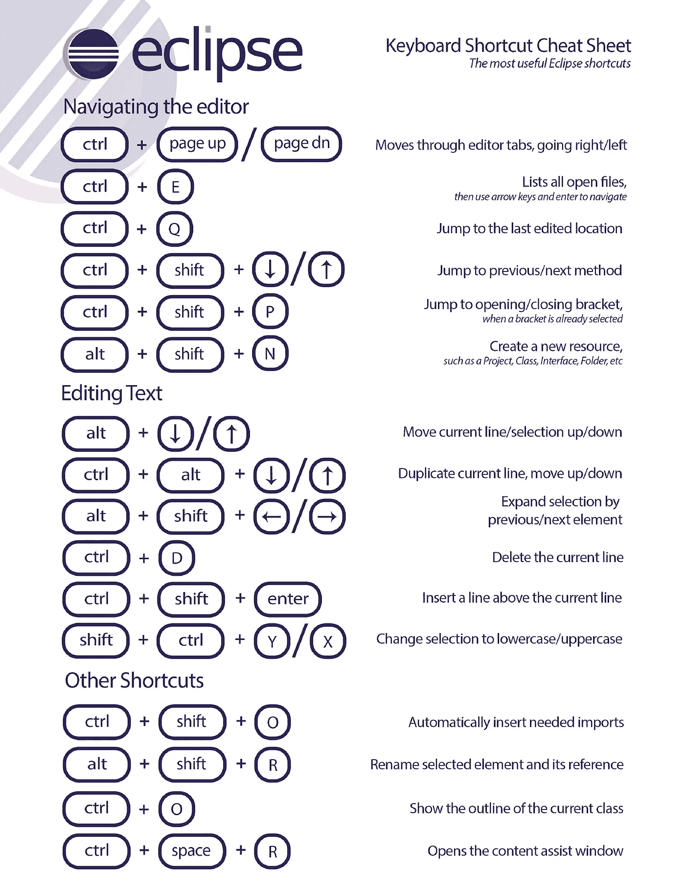
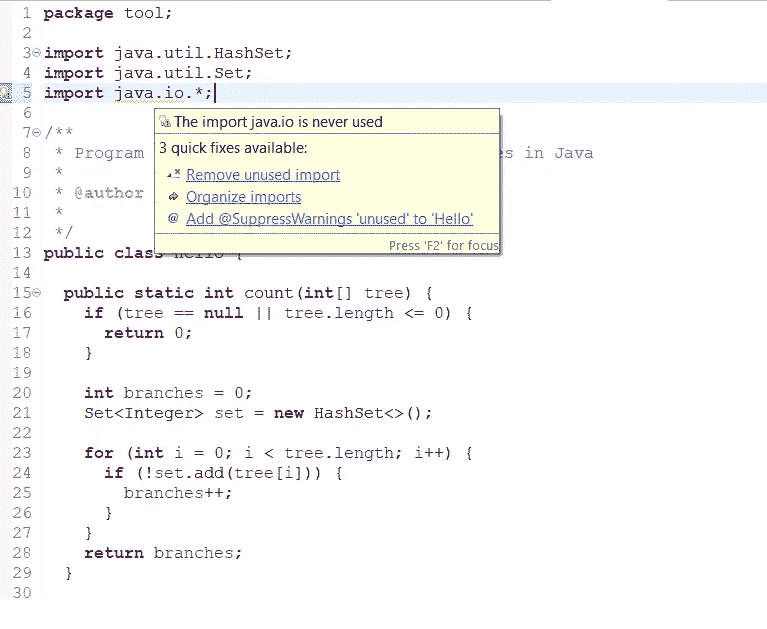
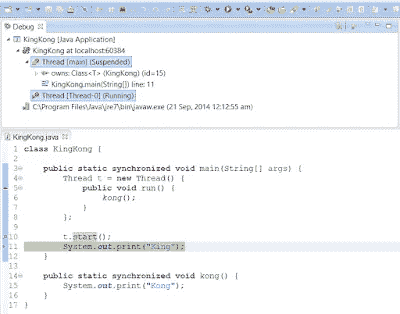
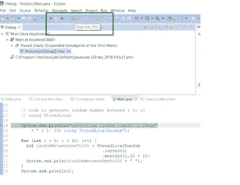
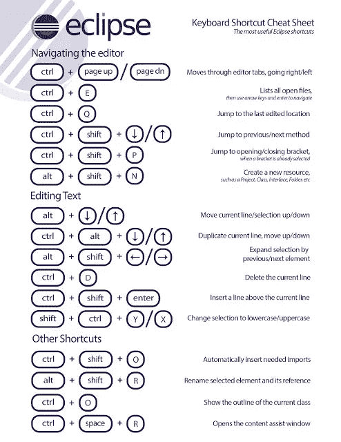

# 30 个 Eclipse IDE 快捷方式 Java 可以在 2023 年学习

> 原文：<https://medium.com/javarevisited/30-eclipse-shortcuts-every-java-programmer-should-learn-817be5337bd8?source=collection_archive---------1----------------------->

## 30 个非常棒的 Eclipse IDE 快捷方式，让您在处理 Java 项目时工作更快，提高您的生产力。

对 Java 开发人员有用的 Eclipse 快捷方式

大家好，本教程是关于每个 Java 开发人员都应该学习的 30 个 Eclipse 键盘快捷键。这可以极大地提高你的生产力，你可以更好地完成你的工作。

Eclipse 是最常用的 Java 开发 IDE，了解 *Eclipse 快捷方式*不仅能提高你的生产力，还能让你更有效率。你将有更多的时间做你喜欢做的事情。使用键盘快捷键也有助于给同事留下深刻印象，并表明您对用于 Java 开发的工具有很好的掌握。

如果您是一名 Java 开发人员，使用 Eclipse 作为您的主要 IDE 进行各种用途的开发，如编码、开发和调试，那么我还建议您看一看 [**初学者 Eclipse Java IDE 培训课程**](https://click.linksynergy.com/fs-bin/click?id=JVFxdTr9V80&subid=0&offerid=323058.1&type=10&tmpid=14538&RD_PARM1=https%3A%2F%2Fwww.udemy.com%2Fbeginners-eclipse-java-ide-training-course%2F) ，从 Java 程序员的角度来看，这是学习如何有效使用 Eclipse 的最佳课程之一。

在接触 Eclipse 之前，我是 Netbeans IDE 的忠实粉丝，因为我来自 J2ME，Netbeans 提供了复杂的 IDE 环境，使您能够在各种移动仿真器中构建、调试和运行 Java 应用程序，包括一些高级处理选项，如预处理、**设置异常断点** t 等。

从那时起我就喜欢上了 ide 上的键盘快捷键和其他[工具](https://www.java67.com/2018/04/10-tools-java-developers-should-learn.html)，我用于开发包括 Edit Plus，Microsoft Excel 等。更好地了解您的工具当然有助于您在更少的时间内交付更多的东西，并在生产问题出现时真正快速地找到一些东西。

正如我所说，在我职业生涯的开始，我是一个 Netbeans 粉丝，但是当我加入一家投资银行时，我遇到了 [Eclipse IDE](http://www.java67.com/2018/02/5-free-eclipse-and-junit-online-courses-java-developers.html) ,因为我团队中的每个人都在使用，而 Netbeans IDE 在公司中不可用(不知道为什么不允许 NetBeans，尽管它是免费的),所以我决定走 Eclipse 之路。

后来我发现 [Eclipse](/javarevisited/top-10-courses-to-learn-eclipse-junit-and-mockito-for-java-developers-4de1e8d62b96) 最适合运行在 Eclipse 上并依赖于专有 Linux 库的分布式核心 Java 应用程序。

在 Windows 中运行整个应用程序是不可能的，当时 eclipse 的一些很酷的功能，如 [**【远程调试】**](http://javarevisited.blogspot.com/2011/02/how-to-setup-remote-debugging-in.html)**【条件断点】****异常断点**，`Ctrl+T`和`Ctrl+R`等快捷方式真的救了我的命。

在这里，我分享了一个包含 30 个 Eclipse 键盘快捷键的列表，我发现这些快捷键在我的日常生活中最有用，在编写代码、阅读代码或者在 Eclipse 中调试 Java 应用程序时最常用。

# 2023 年 Java 程序员学习的 30 个最佳 Eclipse 键盘快捷键

下面是我为 Java 开发人员选择的 30 个 Eclipse IDE 键盘快捷键列表。对于使用 [Eclipse IDE](/javarevisited/6-free-best-eclipse-ide-courses-for-java-programmers-1229ee9e5d87) 进行 web 开发的核心 Java 开发人员和 Java web 应用程序开发人员都很有用。

## 1. **Ctrl + Shift + T** 用于从 jar 文件中查找类

Eclipse 中的这个键盘快捷键是我最常用和最喜欢的快捷键。在处理具有复杂代码的高速交易系统时，我经常需要眨眼间找到 Java 类，这个 eclipse 键盘快捷键就是为此而设计的。无论您的应用程序中或任何 JAR 中是否有类，这个快捷方式都会找到它。

## 2. **Ctrl + Shift + R** 用于查找任何资源(文件)，包括配置 xml 文件

这与上面的 *Eclipse 快捷方式*类似，唯一的区别是它不仅可以找到 Java 文件，还可以找到任何文件，包括 XML、configs 和许多其他文件，但是这个 Eclipse 快捷方式只从您的工作区中找到文件，并不在 JAR 级别挖掘。

## 3. **Ctrl + 1** 快速修复

这是另一个漂亮的 Eclipse 快捷方式，可以修复 Eclipse 中的任何错误。无论是缺少声明、缺少分号，还是任何与导入相关的错误，这个 eclipse 快捷方式都会帮助您快速解决。

## 4. **Ctrl + Shift + o** 用于组织导入

修复缺失导入的另一个 Eclipse 键盘快捷键。特别有帮助，如果你从其他文件复制一些代码，并导入所有依赖关系。

可以进一步查看 [**初学者 Eclipse Java IDE 培训课程**](https://click.linksynergy.com/fs-bin/click?id=JVFxdTr9V80&subid=0&offerid=323058.1&type=10&tmpid=14538&RD_PARM1=https%3A%2F%2Fwww.udemy.com%2Fbeginners-eclipse-java-ide-training-course%2F) 了解更多关于 Eclipse 中代码格式化快捷键的知识。

# 快速导航的 Eclipse IDE 快捷方式

在本节中，我们将看到一些 eclipse 键盘快捷键，当在 [Eclipse](/javarevisited/10-best-eclipse-plugins-for-java-and-spring-boot-development-e814305831cb) 中读写代码时，这些快捷键有助于在文件内和文件间快速导航。

7) **Ctrl + o** 为快速大纲快速转到一个方法

9) **Alt +右**和 **Alt +左**用于在编辑时前后移动。

12) **Alt + Shift + W 在包浏览器中显示一个类**

13) **Ctrl + Shift + Up** 和 down 在成员间导航(变量和方法)

15) **Ctrl + k** 和 **Ctrl + Shift +K** 用于查找下一个/上一个

16)转到一个类型声明: **F3** ，这个 Eclipse 快捷键非常有用，可以非常快速地看到函数定义。

除了这些键盘快捷键，学习如何在 Eclipse 中调试一个 Java 程序也是一项技能。Eclipse 中有这么多可用的调试工具和特性，很多 Java 程序员都不知道，比如**条件调试**、**点击计数、**和**远程调试**。如果你真的想成为一名优秀的 Java 开发人员，我建议你提高你的调试技能，如果你需要一些关于 Eclipse 调试技术和技巧的帮助，T35 是最好的起点。

# 编写和编辑代码的 Eclipse 快捷方式

这些 Eclipse 快捷方式对于在 Eclipse 中编辑代码非常有帮助:

5) **Ctrl + /** 关于注释、取消注释行和块，请看[这里的](http://javarevisited.blogspot.com/2012/10/eclipse-shortcut-to-remove-all-unused-imports-java.html)一个实例。

6) **Ctrl + Shift + /** 对带有块注释的行进行注释，取消注释，参见[此处](http://javarevisited.blogspot.com/2012/12/eclipse-shortcut-to-comment-uncomment.html)举例。

8)选择类别并按下 **F4** 查看其类型层级

10) **Ctrl + F4 或 Ctrl + w** 关闭当前文件

11) **Ctrl+Shirt+W 为**关闭所有文件。

14) **Ctrl + l** 转到行

16)选择文本并按下 **Ctrl + Shift + F** 进行格式化。

17) **Ctrl + F** 用于查找，查找/替换

18) **Ctrl + D** 删除一行

19) **Ctrl + Q** 转到最后编辑的地方

你可以进一步查看 [**Eclipse IDE for 初学者:提高你的 Java 生产力**](https://click.linksynergy.com/fs-bin/click?id=JVFxdTr9V80&subid=0&offerid=323058.1&type=10&tmpid=14538&RD_PARM1=https%3A%2F%2Fwww.udemy.com%2Fluv2code-eclipse-ide-for-beginners%2F) 找到这些快捷方式中大多数的活例子。这是 Udemy 上的免费课程，所以你不需要支付任何费用。

# 杂项 Eclipse 快捷方式

这些是不同的 *Eclipse 键盘快捷键*，它们不属于任何类别，但是非常有用，让在 Eclipse 中工作变得非常容易。

20) **Ctrl + T** 用于在父类型和子类型之间切换

21)转到其他打开的编辑器: **Ctrl + E** 。

22)移动到文件中的下一个(或上一个)问题(即:错误、警告): **Ctrl +。**为下一个问题，Ctrl +为上一个问题

23)在你访问过的文件中来回跳转: **Alt + ←和 Alt + →，**分别。

25) **CTRL+Shift+G** ，在工作区中搜索对所选方法或变量的引用

26) **Ctrl+Shift+L** 查看所有 Eclipse 键盘快捷键的列表。

27) **Alt + Shift + j** 在 Java 源文件的任意位置添加 Javadoc。

28) **CTRL+SHIFT+P** 找到一个右括号。将光标放在左大括号处，并使用此。

29) **Alt+Shift+X，Q** 在 Eclipse 中使用键盘快捷键运行 Ant 构建文件。

30) **Ctrl + Shift +F** 进行自动套用格式。

如果你需要看到这些快捷方式的运行，你还可以加入 [Pluralsight](https://medium.com/u/50a6c7ef7431?source=post_page-----817be5337bd8--------------------------------) 上的[**日食导游——第一部分和第二部分**](https://pluralsight.pxf.io/c/1193463/424552/7490?u=https%3A%2F%2Fwww.pluralsight.com%2Fcourses%2Feclipse-guided-tour-part1) 在线课程。它不是免费的，但每月订阅费用约为 29 美元，但也让你可以在 Pluralsight 上访问最新技术的 5000 多门课程，这完全值得。

<https://www.pluralsight.com/courses/eclipse-guided-tour-part1?clickid=yo33dNx7GXIOyjqxhLyTY0btUklyeHWDAS9Y0M0&irgwc=1&mpid=1193463&utm_source=impactradius&utm_medium=digital_affiliate&utm_campaign=1193463&aid=7010a000001xAKZAA2>  

> 请记住，作为一名程序员，你需要不断学习新东西，提高你的知识，如果你不学习，你很可能会落后。

顺便说一句，你需要一个 [**Pluralsight 会员**](https://pluralsight.pxf.io/c/1193463/424552/7490?u=https%3A%2F%2Fwww.pluralsight.com%2Fpricing) 才能加入这个课程，这个课程的费用大约是每月 29 美元，每年 299 美元(14%的折扣)，但是完全值得。另类。你也可以使用他们的 [**10 天免费试用**](https://pluralsight.pxf.io/c/1193463/424552/7490?u=https%3A%2F%2Fwww.pluralsight.com%2Flearn) 来免费观看这个课程。

这里有一个很好的图片，可以让 Java 程序员记住这些**有用的 Eclipse 快捷方式**:

如果你有一些更有用的 **Eclipse 键盘快捷键**那么请发表评论，我会把它们列入这个列表。这些 Eclipse 快捷方式几乎适用于所有 Eclipse 版本，如 Eclipse 3.5、3.6 Helios、Eclipse Ganymede 和 Indigo 的旧版本。如果您在任何特定版本的 Eclipse IDE 中使用这些 Eclipse 快捷方式时遇到任何问题，请告诉我。

这个列表并不完整，我建议你们分享这里列出的 eclipse 快捷方式，这样会更有用。

其他**你可能喜欢的 Java 和编程文章**

*   [2023 年学习 Eclipse IDE 的 5 大在线课程](https://javarevisited.blogspot.com/2020/05/top-5-courses-to-learn-eclipse-ide-for-java-developers.html)
*   [Eclipse 初学者教程——10 步学会 Java IDE(免费)](https://click.linksynergy.com/deeplink?id=JVFxdTr9V80&mid=39197&murl=https%3A%2F%2Fwww.udemy.com%2Fcourse%2Feclipse-java-tutorial-for-beginners%2F)
*   [2023 年 Java 程序员该学什么](/javarevisited/what-java-programmers-should-learn-in-2020-648050533c83)
*   [2023 年学习 Java 编程的 10 门课程](/javarevisited/top-5-java-online-courses-for-beginners-best-of-lot-1e1e240a758)
*   [我最喜欢的学习软件架构的课程](/javarevisited/top-5-courses-to-learn-software-architecture-in-2020-best-of-lot-5d34ebc52e9)
*   [我最喜欢的深入学习 Java 的免费课程](/javarevisited/10-free-courses-to-learn-java-in-2019-22d1f33a3915)
*   [2023 年学习 Docker、Kubernetes、AWS 的 10 门课程](/javarevisited/top-15-online-courses-to-learn-docker-kubernetes-and-aws-for-fullstack-developers-and-devops-d8cc4f16e773)
*   [通过 Spring 专业认证的 5 种资源](/javarevisited/top-5-spring-professional-certification-exam-resources-for-java-developers-3ef9fa42fe13)
*   [我最喜欢的用 Spring 学习微服务的课程](/javarevisited/top-5-courses-to-learn-microservices-in-java-and-spring-framework-e9fed1ba804d)
*   [学习 Spring Boot 的 10 门高级课程](/javarevisited/10-advanced-spring-boot-courses-for-experienced-java-developers-5e57606816bd)

**附言——**如果你是一个**Intellij DEA**的用户，并且正在寻找一些提高你在 IntelliJIDEA 上工作效率的技巧和诀窍，那么你也可以查看 Udemy 上的[**Intellij DEA Tricks to Boost Productivity for Java developers**](https://click.linksynergy.com/deeplink?id=JVFxdTr9V80&mid=39197&murl=https%3A%2F%2Fwww.udemy.com%2Fcourse%2Fintellij-idea-secrets-double-your-coding-speed-in-2-hours%2F)课程。由陶伟和李中清创建的这个课程充满了有用的技巧

<https://click.linksynergy.com/deeplink?id=JVFxdTr9V80&mid=39197&murl=https%3A%2F%2Fwww.udemy.com%2Fcourse%2Fintellij-idea-secrets-double-your-coding-speed-in-2-hours%2F> 