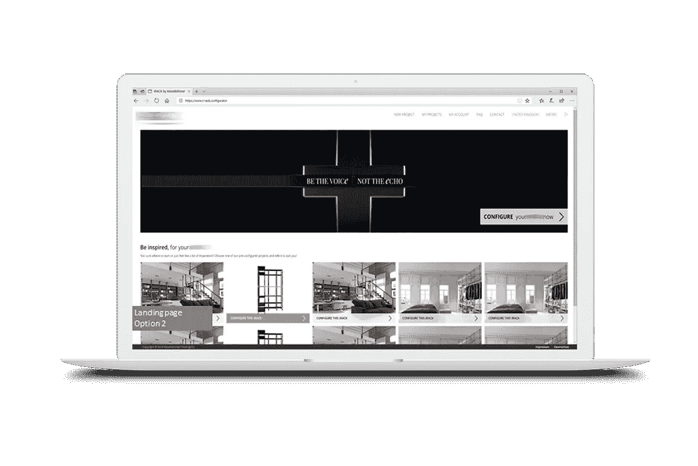
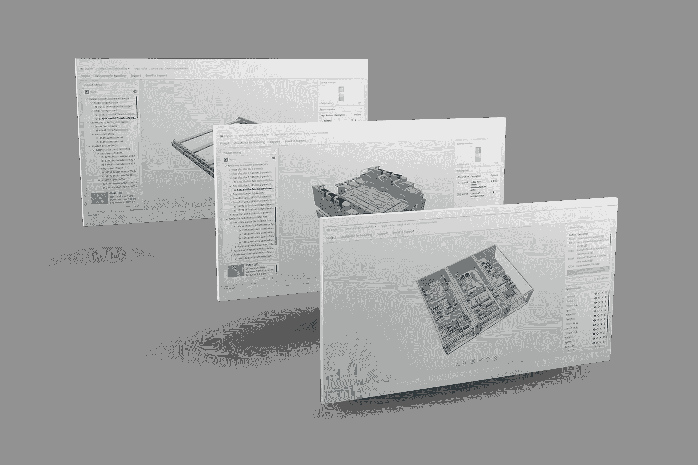
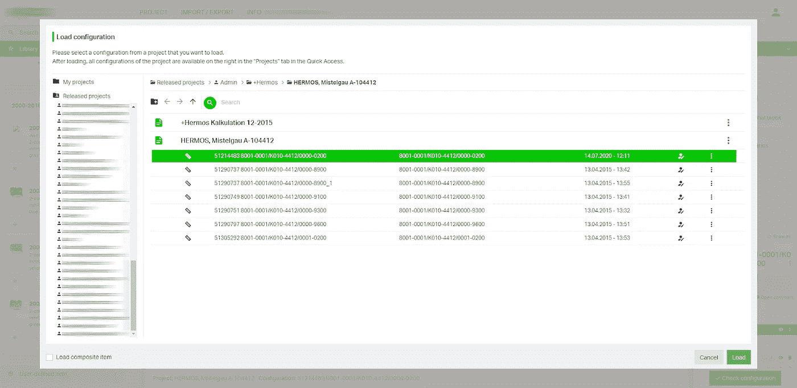

# 面向制造业的 3D 网络应用

> 原文：<https://medium.com/javarevisited/3d-web-applications-for-manufacturing-industry-58b025762733?source=collection_archive---------3----------------------->

3D 技术一年比一年好，其影响力也在不断增长。从社交媒体到 3d 打印，从 VR/AR 到 3D 扫描，我们不断体验到更多的 3D 内容。

在软件中使用 3D 技术意味着为用户，即客户或员工解决现实生活中的问题。

我的公司从事各种 3D 项目，我决定收集一些最有趣的。

# 三维货架配置器

该客户是德国领先的厨房和野营用支架、衣架、配件和家具供应商。该公司决定推出新产品:内部货架生产线，并聘请 IntexSoft 开发 3D 货架配置器。

简而言之，3D 货架配置器允许最终客户根据自己的品味和风格创建货架:可以选择正确的尺寸、货架和柜门数量、颜色和材料。

我们为我们的客户提供的关键功能是一个**灵活的管理面板**:在该平台中，允许向配置器添加新产品和附件，设置所需的大小，在配置器中设置规则，并在没有开发人员帮助的情况下使用 [JSON 文件](https://javarevisited.blogspot.com/2015/03/parsing-large-json-files-using-jackson.html#axzz5YVgi0isQ)和数据导入添加细节。

对于最终用户来说，3D 配置器允许在构建时获得平均生产成本，设置**货架尺寸和附件，导出产品的几何模型**。该系统最令人兴奋的功能之一是能够**创建一个具有必要尺寸、干扰元素(窗户、门、家具)的房间**，并在该特定房间内配置所需的机架。

总而言之，主要特点是:

*   灵活的管理面板；
*   3D 模型复制；
*   按位置导入数据的规则:项目、产品和价格；
*   每个经销商一套单独的配置；
*   用于设置默认和可用附件和安装件的系统；
*   设计样板间和在模型内配置所需机架的可能性；
*   多语制；
*   以不同货币显示产品成本；
*   移除项目；
*   建造适当尺寸的货架和附件；
*   生产成本的自动计算；
*   几何机架模型导出；
*   产品文档的自动生成；
*   以毫米和英寸显示尺寸；
*   直接向生产商发送信息的联系方式。

使用的技术:

**前端**

*   [有角度的](/javarevisited/10-courses-to-learn-angular-for-web-development-6da1bd2856dc)
*   [Three.js](/javascript-in-plain-english/three-js-basics-c5bf2ab6773b)

**后端**

*   [Java 8](https://javarevisited.blogspot.com/2018/08/top-5-java-8-courses-to-learn-online.html)
*   [弹簧](/javarevisited/10-best-online-courses-to-learn-spring-framework-in-2020-f7f73599c2fd)
*   [冬眠](/javarevisited/top-5-hibernate-online-training-courses-for-beginners-and-advance-java-programmers-469460596b2b)
*   贾斯珀报告
*   搅拌机
*   [Python](https://javarevisited.blogspot.com/2020/05/top-10-udemy-courses-to-learn-python-programming.html)

**数据库**

*   [微软 SQL](/javarevisited/5-best-courses-to-learn-microsoft-sql-server-in-depth-e9f11b73c14a)

# 轨道系统的 3D 配置器

客户聘请 IntexSoft 开发一个 3D 配置器，用于设计备件和电能消耗的分配和控制。

配置器允许基于灵活的关联和可用性规则创建由各种产品组成的项目，使用 3D 建模来获得设计系统的完整概览。

主要任务是开发一个配置器，帮助用户创建安装的组件并使用它们。与前一个项目一样，我们实现了一个**灵活的管理面板**，允许单独加载和处理每个 3D 部件，并**设置各种关键参数**，负责组件在轨道系统中的位置、与其他组件的兼容性等。我们增加了**缩放和旋转元素**的功能，以便于处理零件和设计。

开发的系统还允许**在短路和施工电力损失的情况下计算施工耐力**。

**系统中的数据导入**通过导入应用程序不同工作阶段使用的几个 XML 文件，从客户的 ERP 系统中加载可用产品的信息。由于项目已经输入到系统中，可以在管理面板中加载和分配 3D 模型，并进行进一步的调整。

也可以导出 **OBJ、3DS** 和 **DXF** 格式的轨道系统几何体。导出的数据可用于进一步的生产过程和销售文件的准备。

该应用的主要特点是:

*   3D 视图变化(旋转)；
*   现有项目的加载和编辑；
*   创建项目文件；
*   请求项目报价；
*   导出轨道系统几何图形(OBJ、3DS、DXF)；
*   短路强度能力的计算；
*   铁路系统功率损耗的估算。

使用的技术:

**前端**

*   安古拉吉斯
*   三. js

**后端**

*   Java 8
*   春天
*   冬眠
*   贾斯珀报告
*   搅拌机
*   计算机编程语言

# 基于网络的电气元件 CAD 软件

该客户是世界领先的端子和连接器制造商，拥有独特的弹簧夹技术。该公司需要开发一个用于设计备件及其配送的 web 应用程序。

该软件本质上类似于上述软件。这个项目已经持续了十多年。在此期间，我们的团队还参与了从 Flex 到 HTML5 的项目迁移。在迁移过程中，我们转移了一些现有功能，添加了新功能，并更新了应用程序设计。

IntexSoft 团队的主要任务是开发一个 **CAD(计算机辅助设计)应用**，用于创建配电和控制设备领域的组件的 3D 模型。在此任务中，我们创建了一个灵活的管理面板，允许用户单独下载和处理 3D 部件，并设置大量必要的参数。

对于建模，IntexSoft 实现了几个重要的优化特性。

该系统允许使用三种项目类别:

*   DIN 导轨和接线盒的电连接器；
*   印刷电路板的连接端子；
*   标记卡。

建模时，用户可以关闭某些元素的显示，以便它们不会干扰附近零件的加工。否则，管理员可以**通过上传必要的细节到场景，处理它们，并保存为一个单元，将几个单独的产品**组合成一个产品。

该应用有一个**高级项目验证系统**。我们的专家已经连接了规则引擎 Drools，它允许管理员**设置和记录人们可以理解的特定规则**。在应用程序中组装系统时，根据产品类型，可能会出现各种建议。

应用程序中创建的每个零件都可以通过颜色、尺寸、标记等进行**定制。然后可以直接发送标记进行打印。该应用还允许创建**多个项目**版本；每个版本都可以单独编辑、评论和监控。**

IntexSoft 团队还实现了一个项目**变更跟踪**功能:管理员可以查看不同用户所做修改的全部内容，并恢复任何版本。

该应用程序还允许用户和管理员对细节发表评论，如果他们需要以某种特定的方式处理的话。

我们还开发了几个利用分销和订购流程的功能。例如，**创建商品定制库**:如果客户经常订购某个特定的产品或一组产品，他们可以将它们收集在个人库中，以便在重新订购时找到所需的产品。

最终用户收到设计系统的完整概览，导出的几何数据可用于进一步的生产和销售过程。

最终用户也可以在系统内请求商业报价。为此，应该描述所需的结构，选择必要的零件及其数量。基于这些数据，公司代表计算成本。

总而言之，该系统的主要特点是:

*   新项目的创建；
*   添加/修改/删除系统元素；
*   更改 3D 布局视图(旋转和替换)；
*   下载和编辑现有项目；
*   对象评论；
*   项目状态跟踪；
*   项目验证；
*   灵活的管理面板；
*   将几个产品收集到一个产品中；
*   喜欢的单元的个性化库；
*   CAE，e！驾驶舱，WSIX 数据输入；
*   根据颜色、尺寸、标记定制物品；
*   创建项目文件；
*   请求项目报价；
*   使用多种语言(能够在 15 种以上的语言之间切换)。

使用的技术:

**前端**

*   [棱角分明 6](/javarevisited/10-free-angular-and-react-js-courses-from-udemy-and-coursera-best-of-lot-e67f7d811e6b)
*   [Three.js](https://www.intexsoft.com/blog/post/three-js.html)

**后端**

*   Java 6
*   [弹簧](https://javarevisited.blogspot.com/2018/04/5-spring-framework-books-experienced-Java-developers-2018.html)
*   [冬眠](/javarevisited/top-5-books-to-learn-hibernate-for-java-developers-b2cb4b16ccd6?source=---------14------------------)
*   贾斯珀报告
*   搅拌机
*   [Python](/javarevisited/10-free-python-tutorials-and-courses-from-google-microsoft-and-coursera-for-beginners-96b9ad20b4e6)
*   [Node.js 8](/javarevisited/top-10-online-courses-to-learn-node-js-in-depth-8ef0e31ca139)
*   Memcached

**数据库**

*   SQL 服务器

# 总结

如你所见，3D 网络应用对制造商和供应商至关重要。这样的项目既费时又费力，但最终，它们解决了人为错误概率的问题，也自动化了制造和营销过程。

*原载于 2020 年 9 月 14 日*[*【https://intexsoft.com】*](https://intexsoft.com/blog/3d-web-applications-for-manufacturing-industry/)*。*