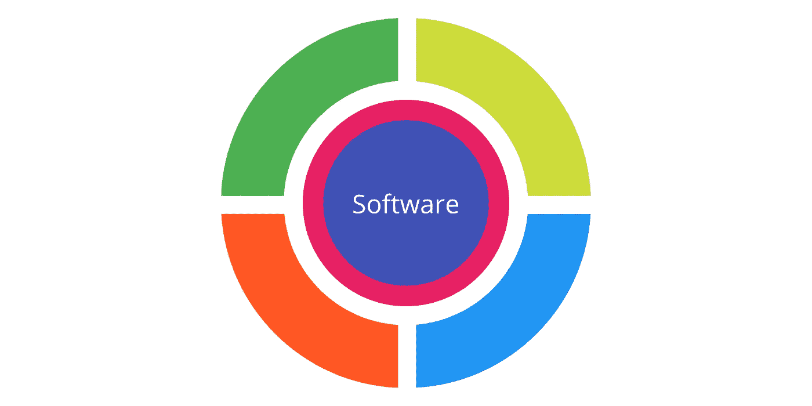
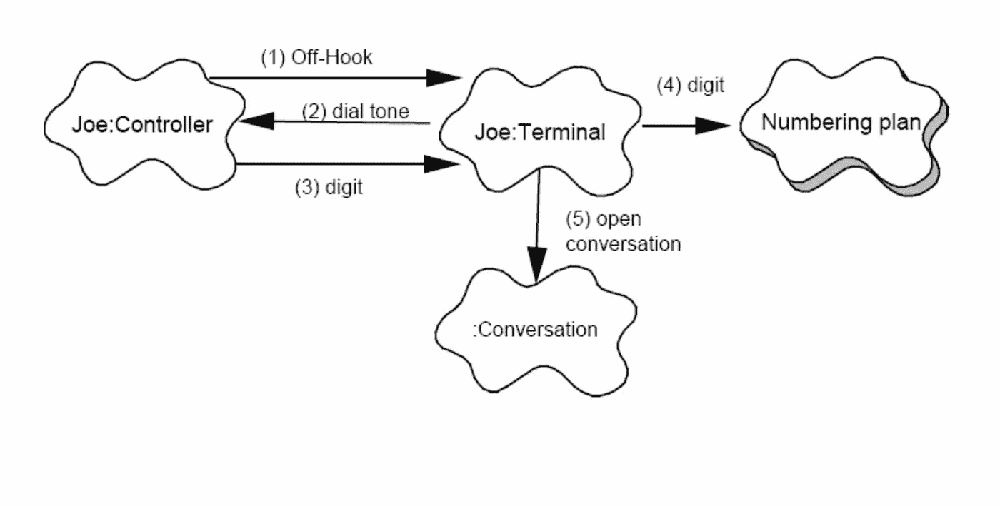

# 软件中的 4+1 架构视图模型

> 原文：<https://medium.com/javarevisited/4-1-architectural-view-model-in-software-ec407bf27258?source=collection_archive---------0----------------------->

图片来源:[https://medium . com/the-mighty-programmer/kruchtens-views-of-software-design-e 9088398 c 592](/the-mighty-programmer/kruchtens-views-of-software-design-e9088398c592)

H ello 读者们，

今天，我将谈论软件架构中最重要的模型之一。这正是**的 4+1 视图模型**，它在理解不同利益相关者的观点和看法时非常方便。

## 4+1 模式是如何产生的

Philippe Kruchten:4+1 建筑视图模型的发明者(图片来源:[https://twitter.com/pbpk](https://twitter.com/pbpk)

1995 年，hilippe Kruchten 在 Rational 软件公司工作，当时该公司是软件开发工具的主要销售商。

在电信、飞机、运输和国防领域创建大规模复杂软件系统的多年经验告诉他，软件架构图经常无法传达实际的系统设计。方框、线条和箭头的含义经常不清楚，利益相关者很难找到他们需要的信息。

在那年发布的一篇论文中，Architectural blue prints——软件架构的“4+1”视图模型，他提供了一种使用一组并发的“视图”来组织软件架构描述的技术，每个视图解决不同涉众的独特关注。4+1 架构模式就是这样起源的。

## 使用

4+1 视图模型用于描述使用多个并发视图的软件密集型系统的架构(设计)。最终用户、开发人员、系统工程师和项目经理都对系统有独特的看法，因此这些观点被用来从他们的角度描述系统。

## 名字背后的原因:4+1

4+1 模型中的五个视图(图片来源:[https://medium . com/the-mighty-programmer/kruchtens-views-of-software-design-e 9088398 c 592](/the-mighty-programmer/kruchtens-views-of-software-design-e9088398c592))

如上所述，在 4+1 模型中，系统是用不同的视角来描述的。该模型有四个视图:逻辑视图、开发视图、过程视图和物理视图。此外，选定的用例或场景被用作“加一”视图来展示设计。因此，该模型具有 4+1 视图。因此，该模型被称为 4+1 架构视图。现在让我们分别来看看它们。

## 模型描述

1.  **逻辑视图:**逻辑视图关注系统的功能，因为它与最终用户有关。类图和状态图是用来描述逻辑视图的 [UML 图](/javarevisited/5-best-uml-books-and-courses-for-java-programmers-13c551a9235d)的例子。

逻辑视图示例(图片来源:【http://cic.javerianacali.edu.co/wiki/lib/exe/fetch.php? media = materias:maze IAR-kruchten-4 _ 1 . pdf

**2。进程视图:**进程视图关注系统的运行时行为，处理系统的动态元素。它解释了系统进程以及它们如何通信。[并发性](/javarevisited/8-best-multithreading-and-concurrency-courses-for-experienced-java-developers-8acfd3b25094)、分布、集成、性能和可伸缩性都在流程视图中处理。序列图、通信图和活动图都是可以用来描述流程视图的 UML 图。

流程视图示例(图片来源:[http://cic.javerianacali.edu.co/wiki/lib/exe/fetch.php?media = materias:maze IAR-kruchten-4 _ 1 . pdf](http://cic.javerianacali.edu.co/wiki/lib/exe/fetch.php?media=materias:mazeiar-kruchten-4_1.pdf)

**3。开发视图:**开发视图从程序员的角度描述了一个系统，并且与软件管理有关。实现视图是该视图的另一个名称。它使用 UML 组件图描述系统组件。包图是用来描述开发视图的 UML 图之一。

**4。物理视图:**物理视图从系统工程师的角度描绘系统。物理层，它涉及软件组件的拓扑结构以及这些组件之间的物理连接。部署视图是该视图的另一个名称。部署图是用来描述物理透视图的 UML 图之一。

物理视图示例(图片来源:[http://cic.javerianacali.edu.co/wiki/lib/exe/fetch.php?media = materias:maze IAR-kruchten-4 _ 1 . pdf](http://cic.javerianacali.edu.co/wiki/lib/exe/fetch.php?media=materias:mazeiar-kruchten-4_1.pdf)

**5。场景:**成为第五种视图的少量用例，或者场景，用于说明架构的描述。场景中描述了[对象](https://javarevisited.blogspot.com/2020/05/object-oriented-programming-questions-answers.html#axzz6vwZEctyQ)和流程之间的交互序列。它们用于识别架构方面，以及演示和评估架构的设计。它们也可以作为架构原型测试的起点。用例视图是这个视图的另一个名字。

一个场景的例子(图片来源:【http://cic.javerianacali.edu.co/wiki/lib/exe/fetch.php? media = materias:maze IAR-kruchten-4 _ 1 . pdf

这就把我带到了今天文章的结尾。非常感谢你花时间阅读这篇文章，如果你有什么想法，我很乐意听听你的想法。再见，注意安全，我们会在另一篇文章中再见。

帕桑·德文·贾亚瓦德内

参考资料:

1.  [**Philippe Kruchten**](https://www.ics.uci.edu/~andre/ics223w2006/kruchten3.pdf)th 4+1 建筑视图模型的原始论文
2.  [**维基百科:4+1 建筑视图模型**](https://en.wikipedia.org/wiki/4%2B1_architectural_view_model)
3.  [**【4+1】Mazeiar sale HIE 的软件架构视图模型**](http://cic.javerianacali.edu.co/wiki/lib/exe/fetch.php?media=materias:mazeiar-kruchten-4_1.pdf)
4.  [**克里斯西蒙的 4+1 建筑观模式的历史**](https://devcycles.io/2019/02/28/history-of-the-4-1-architectural-view-model/)
5.  [**克鲁奇滕对普内特·萨普拉**](/the-mighty-programmer/kruchtens-views-of-software-design-e9088398c592) 软件设计的 4 + 1 观点

## 您可能喜欢的其他软件架构师文章和资源

</javarevisited/top-5-courses-to-learn-software-architecture-in-2020-best-of-lot-5d34ebc52e9>  <https://javarevisited.blogspot.com/2021/09/microservices-design-patterns-principles.html>  </javarevisited/5-best-software-architecture-books-for-experienced-java-developers-1267d05a6b1d> 