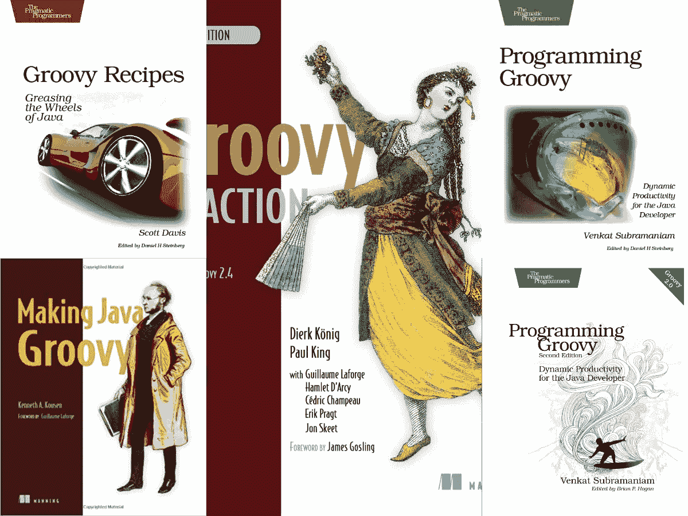
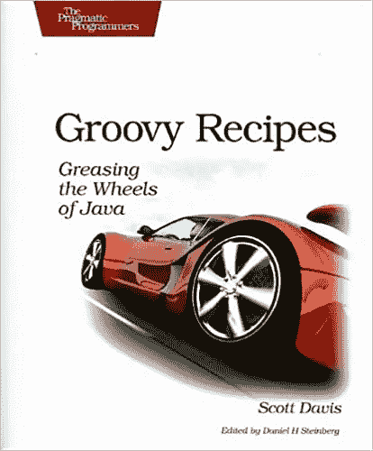
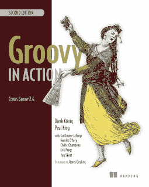
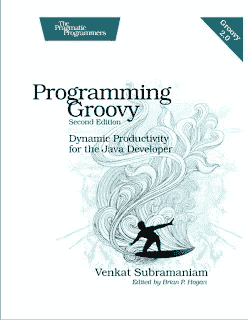

# 2023 年 Java 开发人员学习的 5 本最佳 Groovy 书籍

> 原文：<https://medium.com/javarevisited/4-best-groovy-books-for-java-developers-dcfcc116168?source=collection_archive---------1----------------------->

## 我最喜欢的为 Java 开发人员从头开始学习 Groovy 的书籍

Java 程序员们，你们好。如果你想在 2023 年学习 Groovy，并寻找书籍和在线课程等最佳资源，你来对地方了。前面我已经分享了 [**最好的 Groovy 在线课程**](/javarevisited/6-best-resources-to-learn-groovy-and-grails-for-java-developers-18c04e88fa8a) ，在本文中，我将为 Java 程序员分享学习 Groovy 最好的书籍。

[Groovy](https://groovy-lang.org/) 是一种专门为 Java 开发者打造的编程语言，是 Java 的快节奏脚本伴侣。它旨在通过简化 Java 代码和删除不必要的样板文件来提高 Java 开发人员的生产率。

Groovy 编程语言呈现了简洁易读的语法，并提供了比 Java 更优雅、更方便的 API。

例如，一个 Groovy 文件可以做 50 行，而一个 Java 源代码可以做 500 行。可以将数组声明为[]，map 声明为[: ]，这样真的让代码充满了数据而没有太多语法。

由于这个特性，Groovy 被大量用于 Java 应用程序的单元测试。一些[流行的单元测试框架](https://javarevisited.blogspot.com/2018/01/10-unit-testing-and-integration-tools-for-java-programmers.html)像[斯波克](https://spockframework.org/)也是建立在 Groovy 之上的。

[Grails](https://grails.org/)和 [Gradle](https://gradle.org/) 框架是使用 Groovy 语言构建的。Grails 是使用 Groovy 开发 web 应用程序的框架。您会惊讶地发现，从零开始创建一个现实世界的 web 应用程序是多么的快速。

Grails 在一个 zip 文件中包含了你需要的一切 web 服务器(Jetty)、数据库(HSQLDB)、Spring 、 [Hibernate](https://javarevisited.blogspot.com/2017/04/top-10-java-books-of-last-5-years-for-experienced-java-Programmers.html) ，甚至还有一个叫做 GANT 的 Ant 的 Groovy 版本。它更简洁，更有表现力，同时又和 Java 本身一样强大。

在构建自动化和 [DevOps space](https://javarevisited.blogspot.com/2018/09/the-2018-devops-roadmap-your-guide-to-become-DevOps-Engineer.html) 中也大量使用，这是程序员的重要技能之一。

大部分的 [Groovy 书籍](https://javarevisited.blogspot.com/2017/08/top-5-books-to-learn-groovy-for-java.html)都会涉及一些 Grails 和 Gradle，Grails 的书也是如此；它们对 Groovy 编程语言本身提供了一些介绍。你可以在《用 Spock 进行 Java 测试》一书中了解更多关于单元测试和 Spock 的知识。

想了解更多 [Gradle](https://javarevisited.blogspot.com/2020/06/maven-vs-gradle-beginners-introduction.htm) ，可以参考《行动中的 Gradle》。同样，如果您想了解更多关于 Grails 的知识，我建议您阅读 Grails in Action，这是 Java 开发人员学习 Grails 的最全面的指南之一。

如果你喜欢在线课程，这也是学习新技术、框架、编程语言或库的好方法，你也可以在 Udemy 上查看 [**完整的 Apache Groovy 开发者课程**](https://click.linksynergy.com/fs-bin/click?id=JVFxdTr9V80&subid=0&offerid=323058.1&type=10&tmpid=14538&RD_PARM1=https%3A%2F%2Fwww.udemy.com%2Fapache-groovy%2F) 。这是一门学习 Groovy 的综合课程，我最近花了不到 10 美元买的。

<https://click.linksynergy.com/fs-bin/click?id=JVFxdTr9V80&subid=0&offerid=323058.1&type=10&tmpid=14538&RD_PARM1=https%3A%2F%2Fwww.udemy.com%2Fapache-groovy%2F>  

# 我最喜欢的面向 Java 程序员的 Groovy 书籍

这里是我为 Java 开发人员列出的一些学习 Groovy 的最佳书籍。这个列表是根据我的偏好排序的，我指的是从 Java 开发人员的角度来看，我认为最适合学习 Groovy 的书籍。

## 1.[制作 Java Groovy，作者肯·寇森](https://www.amazon.com/Making-Java-Groovy-Ken-Kousen/dp/1935182943?tag=javamysqlanta-20)

这是我最喜欢的关于 Groovy 的书，我猜也是 Java 开发人员学习 Groovy 的最佳书籍。这本书是专门为向 Java 开发者展示如何通过添加 Groovy 来使他们的生活变得更简单而设计的，比如在不使用 [JDBC](/javarevisited/top-5-courses-to-learn-jdbc-and-database-connectivity-for-java-developers-free-and-best-of-lot-7945156fcc3) 的情况下读取文件或向数据库中插入行。

当我第一次开始使用 Groovy 来理解一个用 Groovy 编写的定制构建环境时，我需要一本可以比较 [Java](http://www.java67.com/2018/08/top-10-free-java-courses-for-beginners-experienced-developers.html) 和 [Groovy](https://javarevisited.blogspot.com/2018/02/top-3-jvm-languages-java-programmer-learn.html) 的书，并通过利用我的 Java 知识来教授 Groovy，这就是我发现使用 Java Groovy 是一个很好的选择的地方。

这本书充满了有用的信息，更容易阅读，我也喜欢肯的风格，把幽默留给脚注。

简而言之，如果你是一名 Java 开发人员，并且想在短时间内学习 Groovy，也许是为了用它进行单元测试或构建自动化，我建议你先阅读一下肯·寇森的《制作 Java Groovy》。

如果你需要一个在线课程来配合这本书，我建议你查看一下 Pluralsight 上的**[**Groovy 基础**](https://pluralsight.pxf.io/c/1193463/424552/7490?u=https%3A%2F%2Fwww.pluralsight.com%2Fcourses%2Fgroovy-fundamentals) 课程。你需要一个 Pluralsight 会员。如果您错过了免费课程，您还可以使用他们的 10 天免费通行证来免费学习这门课程。**

**<https://pluralsight.pxf.io/c/1193463/424552/7490?u=https%3A%2F%2Fwww.pluralsight.com%2Fcourses%2Fgroovy-fundamentals> ** 

## **2. [Groovy 食谱:润滑 Java 的轮子](https://www.amazon.com/Groovy-Recipes-Greasing-Pragmatic-Programmers/dp/0978739299?tag=javamysqlanta-20)**

**这是为忙碌的 Java 开发人员准备的另一本关于 Groovy 的好书，我指的是那些喜欢工作和尝试而不是阅读的人。**

**在这本书里，你会发现很多关于如何用 Groovy 做事情的内容，这对现实世界的编程和它们的解释非常有用，这是理解正在发生的事情的一个很好的方法。**

**在经历了制作 Java Groovy 之后，我读了这本书，我学到了这本书里给出的大部分东西。简而言之，如果你在你的公司里使用 Groovy 进行开发，这是一本非常好的书。**

**在浏览了几个食谱和它们的解释之后，你会立即开始用 groovy 做一些事情；这就是这本书的力量。它确实推动了您从 Java 到 Groovy 的旅程。**

****

**如果你需要一门课程来配合这本书，请查看 Udemy 上的[测试人员 Groovy 基础——一步一步](https://click.linksynergy.com/fs-bin/click?id=JVFxdTr9V80&subid=0&offerid=634352.1&type=10&tmpid=14538&RD_PARM1=https%3A%2F%2Fwww.udemy.com%2Fgroovy-fundamentals-for-testers-step-by-step%2F)。这是为测试人员准备的，但是对于从头开始学习 Groovy 非常有用。**

**<https://click.linksynergy.com/fs-bin/click?id=JVFxdTr9V80&subid=0&offerid=634352.1&type=10&tmpid=14538&RD_PARM1=https%3A%2F%2Fwww.udemy.com%2Fgroovy-fundamentals-for-testers-step-by-step%2F> ** 

## **3. [Groovy 在行动，第二版](https://www.amazon.com/Groovy-Action-Covers-2-4/dp/1935182447?tag=javamysqlanta-20)**

**这是 Groovy 的第一本，也是最好的一本书。这可能是 Groovy 中最全面的书。该书的第一版于 2007 年出版，这是关于 Groovy 的首批书籍之一。**

**第二版涵盖了 Groovy 2.4，为了向 Java 程序员介绍 Groovy，它进行了彻底的修改和更新。**

**通读这本书后，你可以像 Groovy 这样的专业人士一样使用 Groovy 来构建新的应用程序、单元测试、数据库任务、构建自动化和 [DevOps](http://www.java67.com/2018/02/5-free-docker-courses-for-java-and-DevOps-engineers.html) 之类的东西。**

****

**这本书最好的部分是它包含了 Groovy 中一些核心人员的想法，这些核心人员参与了 Groovylike Dierk Konig 的设计和开发，保罗·金博士，Guillaume Laforge，他是 Groovy 的正式项目经理和 Groovy 开发的负责人，Hamlet D'Arcy，Cedric Champeau，他是 Groovy 的核心委员，还有 Erik Pragt。**

**并且，如果你不介意从免费的在线课程这样的免费资源中学习，你也可以在 Udemy 上加入这个免费的 Groovy 课程—[**Groovy | Step by Step by grahav Pal**](https://click.linksynergy.com/deeplink?id=CuIbQrBnhiw&mid=39197&murl=https%3A%2F%2Fwww.udemy.com%2Fcourse%2Fgroovy-step-by-step-for-beginners%2F)已经有超过 12K 的开发者加入了这个免费的 Udemy 课程来在线学习 Groovy。**

**<https://click.linksynergy.com/deeplink?id=CuIbQrBnhiw&mid=39197&murl=https%3A%2F%2Fwww.udemy.com%2Fcourse%2Fgroovy-step-by-step-for-beginners%2F> ** 

## **4.[编程 Groovy 2](https://www.amazon.com/Programming-Groovy-Productivity-Developer-Programmers/dp/1937785300?tag=javamysqlanta-20)**

**文卡特·苏布拉马年的《编程 Groovy 2》是实用程序员系列的另一本好书，我很喜欢。**

**你可能知道文卡特是我最喜欢的作家和主持人之一；我喜欢他关于 [Java 8](http://www.java67.com/2015/07/5-books-learn-java-8-functional-programming.html) 的书，也不负众望。**

**总之，如果你想深入学习 Groovy，这是一本很棒的书；这本书的高级部分对于构建您现有的 Groovy 知识非常有用。**

****

**书籍对于学习新技术很有帮助，但是每个程序员都不一样。一些程序员发现在线或课堂培训比读书更容易。如果你更喜欢培训 overbook，你也可以看看 [**完整的 Apache Groovy 开发者课程**](https://click.linksynergy.com/fs-bin/click?id=JVFxdTr9V80&subid=0&offerid=323058.1&type=10&tmpid=14538&RD_PARM1=https%3A%2F%2Fwww.udemy.com%2Fapache-groovy%2F) ，学习 Groovy 最好的在线课程之一。**

**<https://click.linksynergy.com/fs-bin/click?id=JVFxdTr9V80&subid=0&offerid=323058.1&type=10&tmpid=14538&RD_PARM1=https%3A%2F%2Fwww.udemy.com%2Fapache-groovy%2F>  

以上是 Java 开发人员学习 Groovy 的最佳书籍**。书不多，但这些都是你从头开始学习 Groovy 可以阅读的最好和最喜欢的书。第一本书非常适合 Java 开发人员，我建议从那本书开始。**

此外，如果你也有兴趣学习 [Gradle](/javarevisited/5-best-gradle-courses-and-books-to-learn-in-2021-93f49ce8ff8e) ，这是一个流行的构建框架，通常被称为 [Maven 的替代品](/javarevisited/6-best-maven-courses-for-beginners-in-2020-23ea3cba89)，那么你可以在 Udemy 上查看[**Gradle master class 课程**](https://click.linksynergy.com/deeplink?id=CuIbQrBnhiw&mid=39197&murl=https%3A%2F%2Fwww.udemy.com%2Fcourse%2Fgradle-masterclass%2F) ，这是另一个只需几美元就可以获得的强大课程。

<https://click.linksynergy.com/deeplink?id=CuIbQrBnhiw&mid=39197&murl=https%3A%2F%2Fwww.udemy.com%2Fcourse%2Fgradle-masterclass%2F>  

正如我之前说过的，Groovy 由于其简洁的语法和强大的 API，在 Java 开发人员中越来越受欢迎，特别是在 [DevOps](/javarevisited/top-10-courses-to-learn-devops-for-experienced-programmers-d93b666db151) 和[单元测试](/javarevisited/5-courses-to-learn-junit-and-mockito-in-2019-best-of-lot-f217d8b93688)领域；因此，现在是学习 Groovy 的好时机，这不仅可以简化您的日常开发任务，还可以通过展示您的多语言编程技能为您的简历增色不少。

其他**编程和技术书籍**你可能喜欢探索

*   [给严肃程序员的 10 本算法书](http://www.java67.com/2015/09/top-10-algorithm-books-every-programmer-read-learn.html)
*   [每位程序员都应该阅读的 5 本书](http://www.java67.com/2016/02/5-books-to-improve-coding-skills-of.html)
*   [每个程序员都应该阅读的 5 本 SQL 书籍](http://www.java67.com/2016/09/sql-5-best-books-to-learn-and-master.html)
*   [12 本高级 Java 编程书籍—第一和第二部分](http://www.java67.com/2017/01/12-advanced-java-programming-books-for-experienced-programmers.html)
*   [编程/编码面试的前 5 本书](http://javarevisited.blogspot.sg/2016/06/top-5-books-for-programming-coding-interviews-best.html)
*   每个软件工程师都应该读的 10 本书
*   [学习 SOAP 和 REST Web 服务的最佳书籍](http://www.java67.com/2017/04/3-great-books-to-learn-java-web-services-soap-and-restful.html)
*   [学习敏捷和 Scrum 方法论的 5 本书](http://javarevisited.blogspot.sg/2017/06/top-5-books-to-learn-agile-and-scrum-methodology.html)
*   Java 程序员学习 UML 的 3 本必备书籍
*   [准备春季认证的 3 本书](http://www.java67.com/2017/07/3-spring-certification-books-best-of.html)
*   [5 大 Java 和 Android 游戏编程书籍](http://javarevisited.blogspot.sg/2017/06/top-5-java-and-android-game-programming-books.html)
*   [十大免费 Java 编程书籍和 PDF](http://javarevisited.blogspot.sg/2017/05/top-10-free-java-programming-books-ebooks-pdf.html)
*   [过去 5 年十大 Java 书籍](http://javarevisited.blogspot.sg/2017/04/top-10-java-books-of-last-5-years-for-experienced-java-Programmers.html)
*   [学习面向对象编程的前 5 本书](http://javarevisited.blogspot.sg/2017/04/top-5-books-to-learn-object-oriented-programming.html)

感谢您阅读本文。如果你喜欢这些面向 Java 程序员的 Groovy 最佳书籍，请与你的朋友和同事分享。如果你有任何问题，反馈，或者任何其他想与我们分享的好书，请随意。

**P. S.** —如果你也有兴趣学习 Grails，这是一个开发类似 Ruby on Rails 的 Web 应用程序的 Groovy 框架，那么 Pluralsight 上的[**Grails 简介**](https://pluralsight.pxf.io/c/1193463/424552/7490?u=https%3A%2F%2Fwww.pluralsight.com%2Fcourses%2Fgrails-introduction) 是一个很好的开始课程。

<https://pluralsight.pxf.io/c/1193463/424552/7490?u=https%3A%2F%2Fwww.pluralsight.com%2Fcourses%2Fgrails-introduction> **