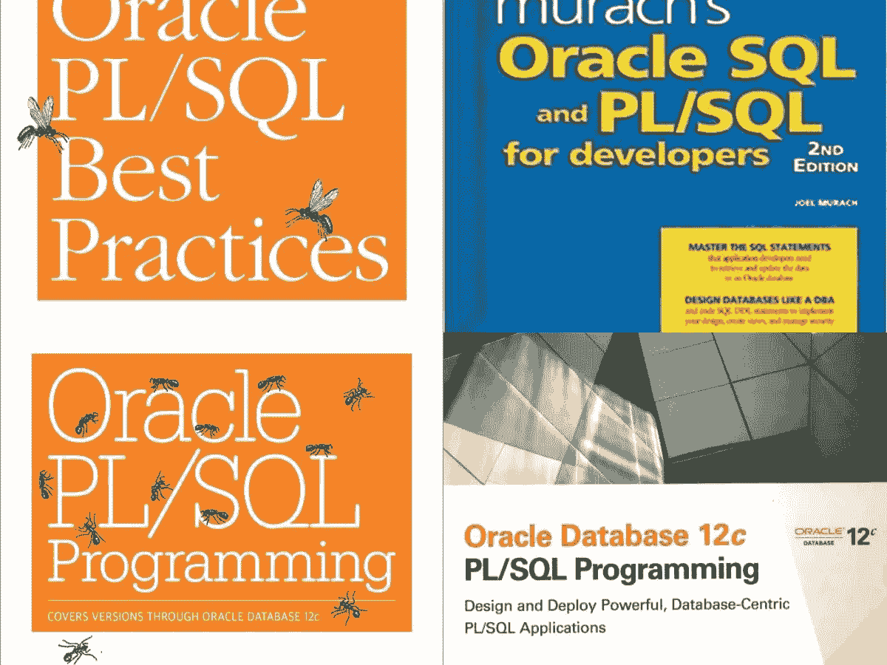
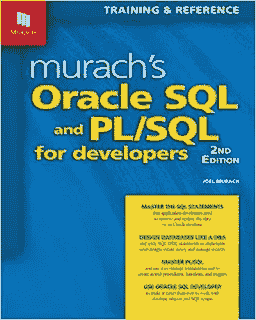
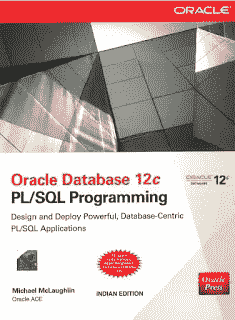
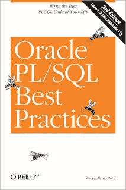

# 适合初学者学习 PL/SQL 编程的 4 本最佳 Oracle 书籍和课程

> 原文：<https://medium.com/javarevisited/4-best-oracle-books-to-learn-pl-sql-programming-for-beginners-7301442591f0?source=collection_archive---------1----------------------->

## 这是我最喜欢的，也是最好的从零开始学习 Oracle 数据库和 PL/SQL 编程的书籍。为了更好地学习，我还分享了这些书籍的在线课程。

大家好，如果你想学习 Oracle 数据库和 PL/SQL 编程，并寻找书籍和在线课程等最佳学习资源，那么你来对地方了。早些时候，我已经分享了 [*最佳 PL/SQL 在线课程*](/javarevisited/6-best-pl-sql-and-oracle-courses-for-beginners-to-learn-online-effd07d5fd2) ，在本文中，我将分享我最喜欢的书籍，以从头开始学习 Oracle 数据库和 PL/SQL。

去年夏天，我不得不做一个 Java 项目，这个项目的后端使用了 Oracle 数据库。该项目是 Java 代码与 Oracle PL/SQL 存储过程的混合，其中存储过程非常大，而且读起来非常复杂。我已经几年没有在甲骨文工作了，几乎忘记了我以前所知道的一切。

因此，为了修改、更新和重新学习，我查阅了一些书籍和在线课程，如 [T **他完成了 Oracle SQL 认证课程**](https://click.linksynergy.com/fs-bin/click?id=JVFxdTr9V80&subid=0&offerid=323058.1&type=10&tmpid=14538&RD_PARM1=https%3A%2F%2Fwww.udemy.com%2Fthe-complete-oracle-sql-certification-course%2F) ，这对我帮助很大。

在我修订和重新学习 Oracle SQL 的过程中，我还发现了许多他们用过的关于 Oracle PL/SQL 的书籍，这些书籍读起来很有趣，并且为任何程序员提供了大量信息。今天，我要和你分享那些书。作为一名 [Java 开发人员](/javarevisited/the-java-programmer-roadmap-f9db163ef2c2)，我曾经在没有 DBA 的情况下参与过一个项目，作为程序员，你有责任创建、更新和理解现有的 PL/SQL 存储过程。

这意味着，您需要了解 PL/SQL，即使不是专家级，也要达到中级水平，以便在后端处理涉及 Oracle 数据库的 Java 项目时处理您的日常任务。

顺便告诉你，这些书是从一个应用开发者的角度来看的，不是给 DBA 看的。所以，如果你是一名 DBA 或者想成为一名 Oracle DBA，你最好去看看针对初级 DBA 的课程，比如[**Oracle DBA 11g/12c——数据库管理**](https://click.linksynergy.com/fs-bin/click?id=JVFxdTr9V80&subid=0&offerid=323058.1&type=10&tmpid=14538&RD_PARM1=https%3A%2F%2Fwww.udemy.com%2Foracledbatraining%2F) ，这些课程更侧重于 DBA。

 [## Oracle 数据库管理员(DBA) 11g/12c 培训课程

### Amarnath 拥有计算机科学硕士学位，在 IT 行业拥有大约 15 年的经验。他有…

udemy.com](https://click.linksynergy.com/fs-bin/click?id=JVFxdTr9V80&subid=0&offerid=323058.1&type=10&tmpid=14538&RD_PARM1=https%3A%2F%2Fwww.udemy.com%2Foracledbatraining%2F) 

# 学习 PL/SQL 编程的 5 本最佳 Oracle 书籍

为了不再浪费时间，我列出了一些关于 Oracle 数据库和 PL/SQL 编程的好书。我读过其中的大部分，虽然不是全部，但偶尔会参考一下。这些是学习 Oracle 10g、Oracle 11g 甚至 Oracle 数据库的 Oracle 12c 版本的绝佳资源。

## 1.[甲骨文 PL/SQL 编程第六版](https://www.amazon.com/Oracle-PL-SQL-Programming-Versions/dp/1449324452/?tag=javamysqlanta-20)

这本书的作者是 Steven Feuerstein，他是 Oracle PL/SQL 程序员世界中最著名的人之一，也是备受推崇的专家。这本书是关于 Oracle PL/SQL 编程的完整指南或参考书。如果你不理解某个特定的代码、语法或关键词，这是你应该参考的书。这本书的全称是*《Oracle PL/SQL 编程:涵盖 Oracle Database 12c 第六版的各个版本》，*这也意味着它涵盖了 Oracle 数据库的最新版本，如 Oracle 12c。

如果你愿意，你也可以将本书与 Udemy 上的 [**学习 PL/SQL —初级到高级示例方式**](https://click.linksynergy.com/deeplink?id=JVFxdTr9V80&mid=39197&murl=https%3A%2F%2Fwww.udemy.com%2Fcourse%2Flearning-plsql-the-example-way%2F) 课程结合使用，这是学习 PL/SQL 评分最高的课程之一，全面涵盖了所有重要的 PL/SQL 概念。

## 2.[穆拉希面向开发人员的 Oracle SQL 和 PL/SQL，第二版](https://www.amazon.com/Murachs-Oracle-SQL-Developers-2nd/dp/1890774804?tag=javamysqlanta-20)

我喜欢穆拉希系列，以前读过他们的 Servlet 和 JSP 书，我知道从穆拉希的甲骨文书中可以期待什么，它也没有让我失望。

乔尔·穆拉希的《穆拉希的 Oracle SQL 和面向开发者的 PL/SQL》。如果您使用 Toad 与 Oracle 数据库进行交互，那么您会发现这本书有一点不同，因为它使用了基于 Java 的免费工具 [SQL developer](http://bit.ly/2D9Cufx) ，但是由于我在不同的项目中使用过这两种工具，所以对我来说不成问题。

我强烈推荐这本书给任何刚开始使用 SQL 但使用 Oracle 数据库如 Oracle 10g 或 Oracle 11g 的程序员。它充满了不平凡的例子，在各种意义上都非常可读。

如果你需要一门课程来配合这本书，那么我推荐你去看看 Udemy 上的 [**Oracle PL/SQL 基础第一卷& II**](https://click.linksynergy.com/fs-bin/click?id=JVFxdTr9V80&subid=0&offerid=323058.1&type=10&tmpid=14538&RD_PARM1=https%3A%2F%2Fwww.udemy.com%2Foracle-plsql-fundamentals-vol-i-ii%2F) 课程。这是 Udemy 上最全面的 Oracle 课程之一。

## 3. [Oracle Database 12c PL/SQL 编程第 1 版](https://www.amazon.com/Oracle-Database-12c-SQL-Programming-ebook/dp/B00HSO0X0S?tag=javamysqlanta-20)

另一本值得学习的好书是 Michael McLaughlin 的《Oracle 数据库和 PL/SQL 编程》。它也是关于 Oracle PL/SQL 编程的最新书籍之一，涵盖了 Oracle 12c 数据库。和其他书一样，它也充满了概念和例子，但我更喜欢这本书的附录部分提供的额外信息，这真是太棒了。可以把这本书作为学习 Oracle PL/SQL 编程的教材。

如果你需要一门课程来配合这本书，我建议你参加 Pluralsight 上的**[**Oracle Database 12c Fundamentals By Tim Warner**](https://pluralsight.pxf.io/c/1193463/424552/7490?u=https%3A%2F%2Fwww.pluralsight.com%2Fcourses%2Foracle-database-12c-fundamentals)**课程。它很好地补充了这本书，因为它涵盖了最新的 Oracle 12c 版本。****

********

## ****4. [Oracle PL/SQL 最佳实践第二版](https://www.amazon.com/Oracle-PL-SQL-Best-Practices/dp/0596514107?tag=javamysqlanta-20)****

****这是 Steven Feuerstein 的另一个杰作，是任何有经验或中级程序员都必须阅读的最佳书籍之一，他们知道如何使用 Oracle PL/SQL 编程语言。这本书充满了关于如何充分利用 PL/SQL、如何以正确的方式使用事物的大量建议，以及 Steven 从他多年的 Oracle PL/SQL 编程经验中获得的最佳实践。我有一本这本书，每当我有时间或者每当我需要知道如何正确使用 Oracle 数据库的任何特性时，我都会经常回顾这本书。****

********

****您也可以将本书与[学习 PL/SQL-初学者结合起来，以更好地学习示例方法](https://click.linksynergy.com/deeplink?id=JVFxdTr9V80&mid=39197&murl=https%3A%2F%2Fwww.udemy.com%2Fcourse%2Flearning-plsql-the-example-way%2F)。****

**** [## 学习 PL/SQL -真正基础的高级示例方法

### 快速 PL/SQL 面试准备- PL/SQL 游标、过程、函数、包和触发器-面向对象…

udemy.com](https://click.linksynergy.com/deeplink?id=JVFxdTr9V80&mid=39197&murl=https%3A%2F%2Fwww.udemy.com%2Fcourse%2Flearning-plsql-the-example-way%2F) 

以上是关于从零开始学习 Oracle PL/SQL 编程的一些**最佳书籍**。作为一名 Java 开发人员，您需要学习许多不同的技术来成为一名全栈开发人员或执行您的日常任务。我曾经做过一个 Java 项目，在后台使用了 [Oracle](http://www.java67.com/2018/02/5-free-oracle-and-microsoft-sql-server-online-courses.html) 、 [SQL Server](http://www.java67.com/2018/01/top-4-free-microsoft-sql-server-books.html) 、 [MySQL](https://javarevisited.blogspot.com/2018/05/top-5-mysql-courses-to-learn-online.html) 、Sybase、 [PostgreSQL](https://javarevisited.blogspot.com/2020/02/top-5-courses-to-learn-postgresql-in.html) 和 IBM 数据库。

事实上，每一个新项目都伴随着一个新的数据库和一套新的技术，所以不要认为仅仅学习 Java 就足够了。如果你遇到任何其他的甲骨文的 PL/SQL 编程书籍，不要忘记留言，我喜欢好书。

其他**数据库和 SQL 文章**你可能喜欢:

*   如何在一个 SQL 查询中连接三个表？([例](http://javarevisited.blogspot.com/2012/11/how-to-join-three-tables-in-sql-query-mysql-sqlserver.html))
*   初学者学习数据库和 SQL 的五大课程([课程](https://hackernoon.com/top-5-sql-and-database-courses-to-learn-online-48424533ac61))
*   面向初级程序员的 5 本免费 SQL 书籍([免费书籍](https://www.java67.com/2017/08/5-free-sql-books-for-beginners-and-experienced-pdf-download.html))
*   初学者学习 MySQL 数据库的 5 大课程([课程](https://javarevisited.blogspot.com/2018/05/top-5-mysql-courses-to-learn-online.html))
*   4 本免费书籍学习微软 SQL Server 数据库([本书](https://www.java67.com/2018/01/top-4-free-microsoft-sql-server-books.html)
*   深入学习微软 SQL Server 的前 5 门课程([课程](https://javarevisited.blogspot.com/2020/02/top-5-courses-to-learn-microsoft-sql-server-mssql.html)
*   免费在线学习 SQL 的 5 大网站？([网站](http://javarevisited.blogspot.com/2015/06/5-websites-to-learn-sql-online-for-free.html))
*   深入学习 PostgreSQL 的五大课程([课程](https://javarevisited.blogspot.com/2020/02/top-5-courses-to-learn-postgresql-in.html))
*   5 门免费的初学者学习 T-SQL 和 SQL Server 的课程([课程](https://javarevisited.blogspot.com/2018/12/top-5-free-microsoft-sql-server-and-transact-sql-online-courses.html#axzz5hG3koJem))
*   5 门学习数据库和 SQL 的免费课程([免费课程](https://www.java67.com/2018/02/5-free-database-and-sql-query-courses-programmers.html))
*   5 本高级 SQL 书籍来提升您的 SQL 技能([书籍](https://javarevisited.blogspot.com/2018/07/top-5-advanced-sql-books-for.html))
*   学习 Oracle 和 SQL Server 的 5 门免费课程？([课程](http://javarevisited.blogspot.com/2013/05/migrating-sql-query-from-oracle-to-sql-server-2008.html))

感谢您阅读本文，如果您喜欢这些甲骨文书籍和课程，请与您的朋友和同事分享，这会带来很大的不同。如果你有什么好的甲骨文书籍可以推荐，请留下评论。

**P.S.** —如果你对学习数据库和 SQL 感兴趣，并且正在寻找一些免费资源来开始你的旅程，那么你也可以看看这个 [**免费 SQL 初学者课程**](http://www.java67.com/2018/02/5-free-database-and-sql-query-courses-programmers.html) 的列表，开始你的学习。

 [## 程序员和数据科学家学习数据库和 SQL 的 10 门免费课程

### 免费课程学习 SQL 和数据库概念的初学者使用微软 SQL 服务器，甲骨文，和 MySQL 从 edX…

medium.com](/javarevisited/7-free-courses-to-learn-database-and-sql-for-programmers-and-data-scientist-e7ae19514ed2)****