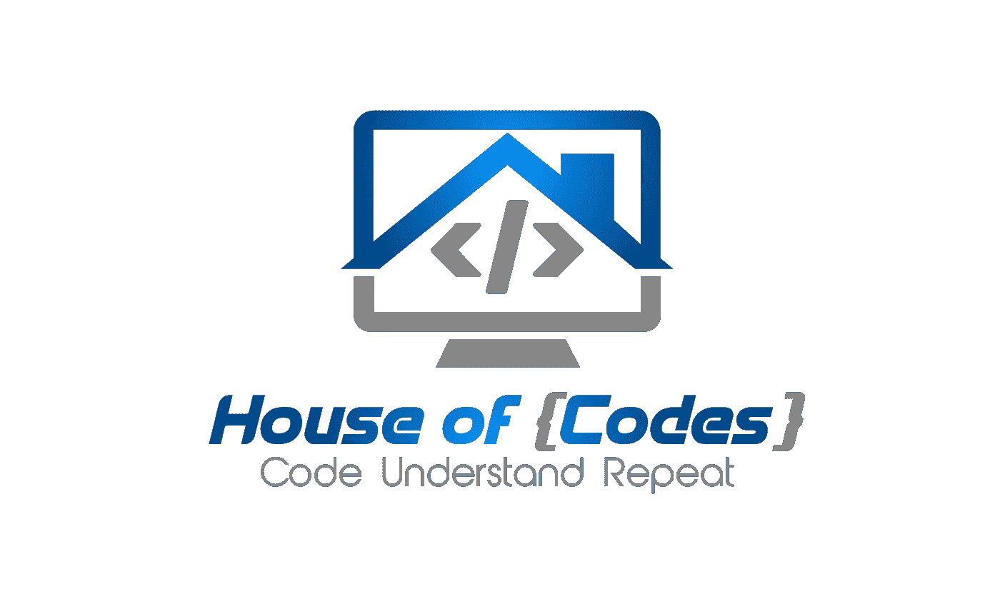

# 面试中非常有用的 4 个链表逻辑

> 原文：<https://medium.com/javarevisited/4-incredibly-useful-linked-list-tips-for-interview-79d80a29f8fc?source=collection_archive---------1----------------------->

## 链表的最终指南

作者:[阿克谢·拉文德兰](https://www.linkedin.com/in/akshay-ravindran-096)

如果你一直关注我，你会知道我最近做了一个 **100 天**到**亚马逊挑战**的活动。当我在解决这些问题的时候。我发现这些“**面试”**题有很多相似之处。我愿意与你分享它。