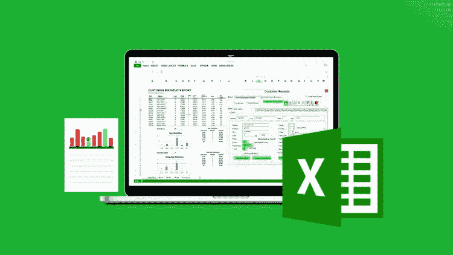
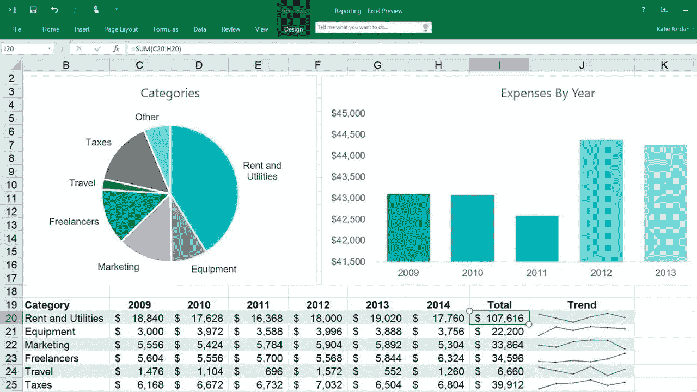
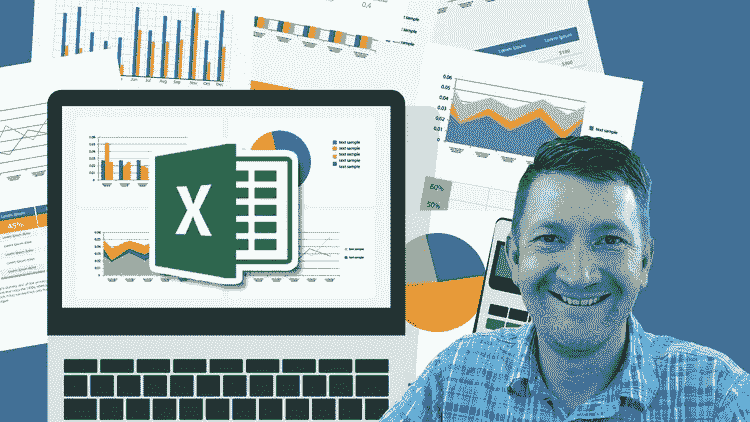

# 2023 年学习高级 Excel 数据分析和可视化功能的 5 门最佳在线课程

> 原文：<https://medium.com/javarevisited/5-advanced-courses-to-learn-microsoft-excel-in-depth-b556aaee5f6c?source=collection_archive---------1----------------------->

## 我最喜欢的在线课程，学习数据分析和可视化的高级 Excel 功能，并在 2023 年成为 Excel 大师

大家好，过去，我曾分享过一些学习 Microsoft Excel 的最佳在线培训课程******以及[**最佳免费 Excel 课程**](/javarevisited/10-free-courses-to-learn-microsoft-excel-for-beginners-69561f2f2678) 总的来说，虽然这些资源对初学者来说很棒，但各种 IT 专业人士不会深入了解一些最强大的 Excel 功能，如宏、VBA 和各种有助于数据可视化的图表。******

****这些特性使 Excel 成为自动化和数据可视化的强大工具，而数据可视化是当今数据密集型世界的一项基本技能。VBA 增加的编程能力还可以通过许多自动耗时和繁琐的任务来极大地帮助您的数据分析，这就是为什么学习这些功能以充分释放 Microsoft Excel 的潜力是必不可少的。我使用微软 Excel 已经将近 20 年了，但是如果你问我，我仍然是一个初学者。Excel 基本的 XLS 功能，比如过滤、排序、[分组](https://javarevisited.blogspot.com/2017/03/how-to-enclose-list-of-values-into-single-quotes-using-microsoft-excel-for-sql-query.html)、删除重复、做 VLOOKUP，我知道的不多。是的，当我真的需要时，我也可以制作一些图表，如饼状图、折线图和一些图表，但这对我来说不是很容易，我必须做很多努力，做很多谷歌搜索才能找到这些图表。

由于数据分析已经成为我工作中更重要的一部分，我不得不磨练我的 Excel 技能，并决定投入一些时间和金钱来提高我的 Microsoft Excel 知识。我想看看专家是如何使用 Excel 实现自动化和创建数据可视化的，没有比向专家学习更好的方法了。**** 

# ****2023 年学习 Microsoft Excel 高级功能的五大在线课程****

****这里是我的在线培训课程列表，学习一些高级的微软功能，如图表、VBA、宏和数据可视化。这些是我所遇到的学习高级 excel 功能的最终最佳课程，三位讲师都是非常博学的伟大教师。

所以，不要再浪费你的时间了，让我们在 2023 年潜入一些最好的课程，学习微软 VBA、宏和其他数据可视化。****

## ****1.[解锁 Excel VBA 和 Excel 宏](https://click.linksynergy.com/deeplink?id=JVFxdTr9V80&mid=39197&murl=https%3A%2F%2Fwww.udemy.com%2Fexcel-vba-and-macros-course%2F)****

****这是我在学习 Excel VBA 和宏时遇到的最吸引人的在线课程之一。本课程的讲师 Leila Gharani 动态地介绍了所有重要的概念。她上课的节奏非常好，不会在简单的想法上放慢太多，这使得其他课程变得索然无味。

如果您正在寻求使用 Excel 实现工作自动化，或者想要增强您当前的 Excel 文件，那么这是适合您的课程。它有超过 22 小时的内容、27 篇文章和 50 多种可下载的练习资源。

课程还有小测验、编码练习，以及一些令人愉快的真实世界任务，让你的学习体验更好。也有助于你保留所学的知识；不然看视频就变得没意思了。****

******这里是加入本课程的链接** — [解锁 Excel VBA 和 Excel 宏](https://click.linksynergy.com/deeplink?id=JVFxdTr9V80&mid=39197&murl=https%3A%2F%2Fwww.udemy.com%2Fexcel-vba-and-macros-course%2F)****

********

****说到社会证明，这是 Udemy[Udemy](https://javarevisited.blogspot.com/2019/09/teachable-or-udemy-which-platform-is-best-online-course.html)上关于高级 Excel 最好的课程之一。超过 40，000 名学生已经注册了这门课程，近 8，835 名参与者平均给了它 4.6 分，这太令人惊讶了。非常感谢 Leila 创建了这个课程，我强烈推荐这个课程给任何想深入学习微软 Excel 宏和 VBA 的人。****

## ****2. [Microsoft Excel —使用 Excel 透视表进行数据分析](https://click.linksynergy.com/deeplink?id=JVFxdTr9V80&mid=39197&murl=https%3A%2F%2Fwww.udemy.com%2Fdata-analysis-with-excel-pivot-tables%2F)****

****这也是在 Udemy 上学习用 Excel 进行数据分析的最佳课程之一。到目前为止，我还没有在任何地方遇到过比这更好的球场。这是我今年迄今为止做的最好的投资。本课程侧重于数据分析，尤其是数据透视表，它是洞察和可视化的有用图表之一。这门课程承诺让你的数据分析技能从零到专业，使用 Excel 数据透视表，它确实做到了。

您不仅将学习如何使用数据透视表和数据透视图来简化流程，还将学习如何在 Excel 中彻底革新您的工作流程。该课程有趣、引人入胜、互动，还包含 10 个真实世界的数据透视表案例研究(天气、鲨鱼袭击、品酒、卷饼评级等等！)来测试你的技术。

说到社交证明，已经有超过 53000 名学生信任这门课程，平均有近 10000 名参与者给它打了 4.6 分，这充分说明了这门课程的质量。非常感谢 Maven Analytics 和 Chris Dutton 创建了这个课程，绝对的瑰宝。****

******以下是参加本课程的链接** — [Microsoft Excel —使用 Excel 数据透视表进行数据分析](https://click.linksynergy.com/deeplink?id=JVFxdTr9V80&mid=39197&murl=https%3A%2F%2Fwww.udemy.com%2Fdata-analysis-with-excel-pivot-tables%2F)****

********

## ****3. [Microsoft Excel —数据可视化、Excel 图表和图形](https://click.linksynergy.com/deeplink?id=JVFxdTr9V80&mid=39197&murl=https%3A%2F%2Fwww.udemy.com%2Fcourse%2Fadvanced-excel-charts-graphs%2F)****

****这是 Chris Dutton 的另一门优秀课程，学习数据可视化、Excel 图表、图形等。本课程承诺教你 20 多种 Excel 图表类型和图形，并使用 Microsoft Excel 2016 到 Excel 2020 构建自定义视觉效果，他们也会提供。

您将从饼图、折线图、柱形图等基本图表类型开始，到瀑布图、旭日图和雷达图等更令人兴奋的选项。最棒的是，他从数据可视化的基本原理开始，然后进行动手演示，真正向您展示如何做到这一点。他还用简单的英语解释了每一个概念，这真的很棒。**** 

******这是参加本课程的链接** — [Microsoft Excel —数据可视化、Excel 图表和图形](https://click.linksynergy.com/deeplink?id=JVFxdTr9V80&mid=39197&murl=https%3A%2F%2Fwww.udemy.com%2Fcourse%2Fadvanced-excel-charts-graphs%2F)****

********

****谈到社会证明，这门课程受到来自 150+个国家的 24000 多名学生的信任。近 4000 名参与者对它的平均评分为 4.6，这证明了它的质量。当然，这是 Chris 的一个宝贵意见，如果你想学习使用 Excel 进行数据可视化，我强烈推荐你。****

## ****4.[微软 Excel 数据分析和仪表板报告](https://click.linksynergy.com/deeplink?id=JVFxdTr9V80&mid=39197&murl=https%3A%2F%2Fwww.udemy.com%2Fmicrosoft-excel-data-analysis-and-dashboard-reporting%2F)****

****以防万一，如果你不能连接到克里斯(极不可能)，你可以尝试参加凯尔皮尤的课程。在学习微软 Excel 的高级功能方面，他是另一位在 [Udemy](https://javarevisited.blogspot.com/2019/09/codecademy-vs-udemy-vs-onemonth-which-is-better-for-learning-code.html) 上的优秀教师。

本课程将教你如何使用 Excel 2010、2013、2016 以完全动手的方式构建动态、交互式的 Microsoft Excel 仪表盘。如果出于某种原因，你被困在 Excel 2010 或 2013 中，本课程肯定能给你很大帮助。

说到社交证明，已经有超过 5000 名学生信任这门课程，平均下来，这门课程在 1000 多名参与者中获得了 4.7 分的评分，这是非常了不起的。 [Udemy](https://javarevisited.blogspot.com/2019/08/top-10-udemy-courses-and-certifications-for-programmers.html) 上的 4.7 评级课程不多。****

******这是参加本课程的链接** — [Microsoft Excel 数据分析和仪表板报告](https://click.linksynergy.com/deeplink?id=JVFxdTr9V80&mid=39197&murl=https%3A%2F%2Fwww.udemy.com%2Fmicrosoft-excel-data-analysis-and-dashboard-reporting%2F)****

********

## ****5.[掌握微软 Excel 宏和 Excel VBA](https://click.linksynergy.com/deeplink?id=JVFxdTr9V80&mid=39197&murl=https%3A%2F%2Fwww.udemy.com%2Fmaster-microsoft-excel-macros-and-vba-with-5-simple-projects%2F)****

****这是凯尔·皮尤教授的另一门课程，但这一次的重点是宏和 BVA。这是一门很棒的课程，类似于列表中的第一门，也遵循基于项目的学习，这是我选择课程时首先考虑的。

在本课程中，您将学习如何在 Excel 中实现日常任务的自动化，学习一些使用 VBAs 和宏的最佳实践，最重要的是，学习如何编写自定义 VBA 宏来创建更强大的自动化。

大部分课程都是用 Excel 2013 录制的，但 Excel 2007、2010、2013 或 2016 还会跟进。它还涉及到基于 VBA 编程概念来创建动态的、可重用的代码，这在您进入现实世界的项目时非常重要。****

******这里是加入本课程的链接** — [掌握微软 Excel 宏和 Excel VBA](https://click.linksynergy.com/deeplink?id=JVFxdTr9V80&mid=39197&murl=https%3A%2F%2Fwww.udemy.com%2Fmaster-microsoft-excel-macros-and-vba-with-5-simple-projects%2F)****

********

****谈社会证明，这门课被 28K 以上的学生信任，非常优秀。近 6200 名学员对该课程的平均评分为 4.5 分，这当然也是课程质量的一个良好标志。

我建议你先看一下这门课的预习课，如果你能连接到 Kyle Pew，你会发现这是多么优秀的资源来**学习 Excel 的高级特性。******

****以上是学习微软 Excel 宏和 Excel VBA 的一些**最佳课程**。如果你想更好地使用 Excel，我强烈建议你学习 VBA 和宏。这将为您节省大量时间，并使您成为专业的 Excel 用户。****

****你的同事会视你为灵感源泉，并总是指望你自动完成乏味的数据分析任务。如果你使用像微软 Azure 这样的云，那么 Power BI 是另一个有用的数据可视化工具。

你可能喜欢的其他**技术资源******

*   ****[2023 年学习 Python 的十大课程](/better-programming/top-5-courses-to-learn-python-in-2018-best-of-lot-26644a99e7ec)****
*   ****[2023 年网络开发者路线图](https://dev.to/javinpaul/the-2019-web-development-frontend-backend-roadmap-4le2)****
*   ****[学习大数据和 Apache Spark 的 5 门课程](http://javarevisited.blogspot.com/2017/12/top-5-courses-to-learn-big-data-and.html)****
*   ****[5 门免费的数据结构与算法课程](https://javarevisited.blogspot.com/2018/01/top-5-free-data-structure-and-algorithm-courses-java--c-programmers.html)****
*   ****[初学者学习面向对象编程的 5 门课程](https://javarevisited.blogspot.com/2018/08/5-object-oriented-programming-and-design-courses-for-Java-programmers.html)****
*   ****[完整的 DevOps 开发者路线图](https://javarevisited.blogspot.com/2018/09/the-2018-devops-roadmap-your-guide-to-become-DevOps-Engineer.html)****
*   ****[面向程序员和开发人员的 5 门免费 Linux 课程](http://www.java67.com/2018/02/5-free-linux-unix-courses-for-programmers-learn-online.html)****
*   ****[学习 React JS 框架的 5 门免费课程](http://www.java67.com/2018/02/5-free-react-courses-for-web-developers.html)****
*   ****[2023 react . js 开发者路线图](https://javarevisited.blogspot.com/2018/10/the-2018-react-developer-roadmap.html)****
*   ****[学习 TensorFlow 和机器学习的前 5 门课程](https://javarevisited.blogspot.com/2018/08/top-5-tensorflow-and-machine-learning-courses-online-programmers.html)****
*   ****[2023 年学习 Web 开发的五大课程](https://javarevisited.blogspot.com/2018/02/top-5-online-courses-to-learn-web-development.html)****
*   ****[初学者和有经验的程序员学习 Java 的 10 门免费课程](http://www.java67.com/2018/08/top-10-free-java-courses-for-beginners-experienced-developers.html)****

****感谢您阅读本文。如果你喜欢这些*最好的微软 Excel 高级在线课程*，那么请分享给你的朋友和同事。如果您有任何问题或反馈，请留言。如果你在 Udemy、Coursera 或 Pluralsight 上有任何其他 Excel 课程——你已经学过了，非常棒，欢迎在评论中给我们建议。****

******p . s .**——如果你正在寻找学习微软 Excel VBA 的免费课程，那么我也建议你看看 Udemy 上的 [**Excel VBA 编程举例**](http://bit.ly/2CX5J1W) (MS Excel 2016)。这是完全免费的，你所要做的就是创建一个帐户来访问课程。****

**** [## 免费 Excel VBA 教程- Excel VBA 编程实例(MS Excel)

### 通过观看演示了解你将通过 VBA 实现什么，然后看 VBA 的逐步解释…

bit.ly](http://bit.ly/2CX5J1W)****